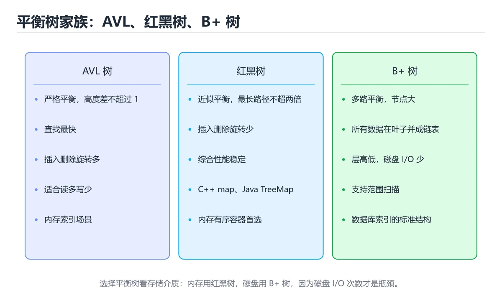
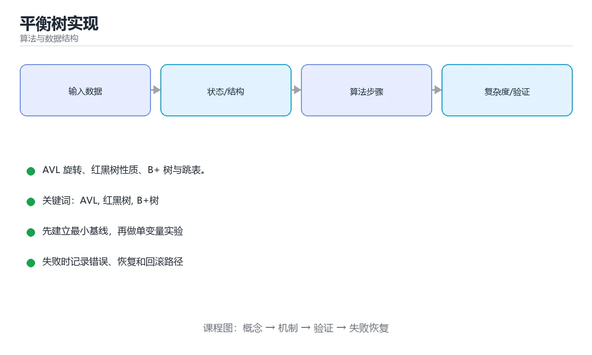

# 平衡树实现

> 内容更新时间：2026-10-06 · 学习阶段：进阶 · 预计用时：40 分钟





## 本节知识框架

**课程定位**：所属分类 `algorithms`（算法与数据结构），课程主题 `平衡树实现`，学习阶段 进阶，建议用时 40 分钟。

本课主线：AVL 旋转、红黑树性质、B+ 树与跳表。

**学完本课应当能够**
- 说清 `AVL` 与 `红黑树` 的含义与区别，并各举一个正例和一个反例。
- 用本课示例验证 `B+树` 的行为，记录输入、输出与失败条件。
- 遇到「只实现插入不测试删除」这类问题时，能说出触发条件与修复顺序。

### 从概念到验证的学习链条

1. `AVL`：先掌握 平衡树通过旋转或分裂合并保持树高为对数级，保证查找、插入和删除的最坏时间复杂度；AVL、红黑树和 B 树分别面向不同内存与磁盘场景，再用它解释 `红黑树` 为什么会出现。
2. `红黑树`：先掌握 通过颜色约束维持近似平衡的二叉搜索树，查找、插入和删除都保持对数复杂度，再用它解释 `B+树` 为什么会出现。
3. `B+树`：先掌握 所有键值存放在叶子节点、叶子按链表连接的多路平衡树，适合磁盘索引和范围查询，再用它解释 `跳表` 为什么会出现。
4. `跳表`：先掌握 用多层有序链表和随机索引实现近似对数查找的概率数据结构，再用它解释 `旋转` 为什么会出现。
5. `旋转`：先掌握 旋转是局部操作，不改变中序遍历顺序，因此不会破坏键的有序性，再用它解释 本课示例的观察结果 为什么会出现。

**先修与衔接**：本课是「算法与数据结构」分类的第 20 课。相关或后续课程：《网络流与二分图匹配》。

### 完成判据

- **定义关**：不看正文也能说明 `AVL` 是 平衡树通过旋转或分裂合并保持树高为对数级，保证查找、插入和删除的最坏时间复杂度，AVL、红黑树和 B 树分别面向不同内存与磁盘场景，并指出一个反例。
- **机制关**：能按“输入 → 转换 → 输出 → 验证”复述 `平衡树实现`，而不是只背结论。
- **示例关**：能运行或推演 `平衡树实现` 的 `text` 示例，并说明一个真实出现的标识符或字面量。
- **证据关**：能指出 `平衡树实现` 示例里的 调用了 `__init__()`，并说明它支持或反驳了本课的哪一条结论。
- **排错关**：能复现 只实现插入不测试删除，记录现象并按 对删除的借位和合并做完整测试 修复。
- **迁移关**：能把 `AVL`、`红黑树`、`B+树`、`跳表` 放进一个与 `平衡树实现` 不同的项目场景，并保持输入与验证条件可追踪。
- **复盘关**：学完 `平衡树实现` 后，用一句话写下仍然不确定的结论，并列出下一次验证需要的输入、环境和成功判据。

### 复习清单

- [ ] 能不看正文复述本课核心术语，并指出一个边界或反例。
- [ ] 能运行或推演本课示例，记录输入、输出与失败现象。
- [ ] 能完成一次自测，并把错题对照错误表定位原因。

## 核心概念定义

| 术语 | 操作性定义 | 常见边界与风险 |
| --- | --- | --- |
| AVL | 平衡树通过旋转或分裂合并保持树高为对数级，保证查找、插入和删除的最坏时间复杂度；AVL、红黑树和 B 树分别面向不同内存与磁盘场景。 | 易错：旋转开销大；正确做法是写多用红黑树或跳表。 |
| 红黑树 | 通过颜色约束维持近似平衡的二叉搜索树，查找、插入和删除都保持对数复杂度。 | 易错：旋转开销大；正确做法是写多用红黑树或跳表。 |
| B+树 | 所有键值存放在叶子节点、叶子按链表连接的多路平衡树，适合磁盘索引和范围查询。 | 索引命中与数据分布决定实际开销，判断前先看执行计划而不是只看结果是否正确。 |
| 跳表 | 用多层有序链表和随机索引实现近似对数查找的概率数据结构。 | 易错：旋转开销大；正确做法是写多用红黑树或跳表。 |
| 旋转 | 旋转是局部操作，不改变中序遍历顺序，因此不会破坏键的有序性。 | 易错：树结构断裂；正确做法是每次旋转同步父子关系和高度。 |

## 原理与运行机制

### 机制总览

**教材衔接：为什么需要平衡**

普通二叉搜索树在插入有序数据时会退化成链表，查找从 O(log n) 恶化到 O(n)。平衡树通过旋转维持树高为 O(log n)。

**教材衔接：AVL 树**

每个节点记录平衡因子（左右子树高度差，绝对值 ≤ 1）。插入后若失衡，分四种情况旋转：

| 情况 | 场景 | 处理 |
| --- | --- | --- |
| LL | 左子树的左侧过高 | 右旋一次 |
| RR | 右子树的右侧过高 | 左旋一次 |
| LR | 左子树的右侧过高 | 先左旋再右旋 |
| RL | 右子树的左侧过高 | 先右旋再左旋 |

AVL 查询最快，但插入删除旋转频繁，适合读多写少。

**教材衔接：红黑树**

五条性质：节点非红即黑、根为黑、叶子（NIL）为黑、红节点的子节点必为黑、任一节点到其所有叶子的黑节点数相同。这些约束保证最长路径不超过最短路径的两倍，即树高 ≤ 2log(n+1)。

插入修复分三种情形：叔叔为红则变色上溯；叔叔为黑且呈直线则旋转 + 变色；呈折线则先转成直线再处理。删除修复更复杂，工程上通常直接使用标准库实现。

Java 的 TreeMap、C++ 的 std::map、Linux 内核的 CFS 调度器都使用红黑树。

**教材衔接：B 树与 B+ 树**

多路平衡树，一个节点存多个键，树高更低（通常 3~4 层即可覆盖千万级数据），专为**磁盘/页**设计：B+ 树的内部节点只存键、叶子节点存数据并用链表相连，因此范围查询高效。这是数据库索引与文件系统的核心结构。

**教材衔接：跳表与其他**

跳表用多层链表 + 随机晋升实现期望 O(log n)，实现比平衡树简单且天然支持范围查询（Redis ZSet 采用）。Treap 用随机优先级维护平衡，Splay 树把常访问节点旋转到根部（适合局部性强的场景）。

**教材衔接：选型建议**

| 需求 | 选择 |
| --- | --- |
| 纯内存、读写均衡 | 红黑树（标准库） |
| 查询极密集、写少 | AVL |
| 磁盘索引、范围扫描 | B+ 树 |
| 实现简单、并发友好 | 跳表 |

**教材衔接：B+ 树为什么适合磁盘**

| 特性 | 收益 |
| --- | --- |
| 节点扇出大（一页几百个键） | 树高通常 3 到 4 层，IO 次数少 |
| 数据只在叶子节点 | 内部节点小，能缓存更多索引 |
| 叶子节点链表相连 | 范围查询与排序扫描高效 |
| 所有查询路径等长 | 性能稳定可预测 |

**教材衔接：深入补充：平衡树实现**

前面已经建立了基本概念。这一节换一个角度，把平衡树实现放进真实工程里，
重点回答三件事：AVL 为什么存在、内部如何运转、什么时候会失效。

### 一、核心模型

平衡树通过旋转或分裂合并保持树高为对数级，保证查找、插入和删除的最坏时间复杂度；AVL、红黑树和 B 树分别面向不同内存与磁盘场景。

```text
查找/插入/删除 → 更新节点 → 检查平衡因子或颜色 → 旋转/分裂/合并 → 恢复平衡 → 返回结果
```

### 二、关键机制拆解

1. 普通二叉搜索树在有序插入时会退化成链表，最坏复杂度变成 O(n)。
2. AVL 树严格保持左右子树高度差不超过 1，查找快但插入删除旋转多。
3. 红黑树用颜色约束近似平衡，插入删除旋转较少，广泛用于标准库有序容器。
4. B 树和 B+ 树多路平衡，节点对齐磁盘页，适合数据库和文件系统索引。
5. 旋转是局部操作，不改变中序遍历顺序，因此不会破坏键的有序性。
6. 删除比插入复杂，需要处理借位、合并和根节点变化。
7. 并发平衡树需要锁、版本或分片策略，不能直接复用单线程实现。

### 三、对照表：抓住容易混淆的边界

| 维度 | 一侧 | 另一侧 |
| --- | --- | --- |
| AVL 树 | 严格平衡，查找快 | 插入删除旋转多 |
| 红黑树 | 近似平衡，更新开销低 | 标准库有序结构常用 |
| B+ 树 | 多路平衡，磁盘页友好 | 数据库索引常用 |
| 跳表 | 多层链表随机平衡 | 实现简单、并发友好 |

### 四、工作示例

向红黑树连续插入有序键时，树会通过旋转和变色保持近似平衡，不会像普通 BST 那样退化。删除节点时若颜色失衡，需要向上调整直到根节点。

### 五、常见误区与失效边界

| 错误做法或假设 | 后果 | 正确做法 |
| --- | --- | --- |
| 只实现插入不测试删除 | 树逐渐失衡 | 对删除的借位和合并做完整测试 |
| 旋转后忘记更新父指针 | 树结构断裂 | 每次旋转同步父子关系和高度 |
| 用递归处理超深树 | 栈溢出 | 关键路径改用迭代或限制深度 |
| 认为平衡树线程安全 | 并发修改损坏结构 | 使用锁、读写锁或并发数据结构 |

### 六、场景推演

内存索引在频繁删除后查询变慢。分析发现删除时只移动键，没有重新平衡，树高不断增加。修复删除逻辑并加入不变量测试后，树高回到对数级。

### 七、自测问答

**Q1：普通 BST 什么时候退化？**

按有序顺序插入时，树会变成链表。

**Q2：AVL 和红黑树的核心取舍是什么？**

AVL 更严格平衡、查找快；红黑树更新旋转少、综合性能更均衡。

**Q3：旋转为什么保持有序？**

旋转只改变父子结构，不改变中序遍历顺序。

**Q4：为什么数据库用 B+ 树？**

多路节点对齐磁盘页，树高低、范围查询友好。

### 八、小项目：把知识变成可检查的产出

实现一个红黑树或 AVL 树，包含插入、删除、查找和中序遍历；用随机序列和有序序列各插入 10 万条，统计树高、旋转次数和耗时。

### 九、适用边界

平衡树保证有序操作的对数复杂度，但不一定比哈希表快。若只需等值查找且无顺序需求，哈希表通常更简单、更高效。

### 十、完成检查清单

- [ ] 能说明 BST 退化原因
- [ ] 能比较 AVL、红黑树和 B+ 树
- [ ] 能实现并验证旋转操作
- [ ] 能处理删除后的平衡恢复
- [ ] 能分析并发场景的替代结构

### 十一、复习顺序

1. 不看资料讲清「平衡树实现」的核心模型，并各举一个正例和反例。
2. 再对照表逐行解释容易混淆的概念，每个概念补一个反例。
3. 跟着工作示例做一遍，改变一个条件并预测结果。
4. 用自测问答检查理解，错题回到对应小节重新阅读。
5. 最后完成 AVL 的小项目，把结果、失败记录和复查清单整理成可提交产物。

> 复习不是重读一遍，而是离开原文重新产出：复述、改写、验证、复盘。

### 机制拆解：每一步的输入、动作与输出

#### 1. `AVL`
- 输入：`AVL`；本步把 平衡树通过旋转或分裂合并保持树高为对数级，保证查找、插入和删除的最坏时间复杂度；AVL、红黑树和 B 树分别面向不同内存与磁盘场景 当作判断规则。
- 动作：围绕 `AVL` 保留中间状态，并记录它与 `红黑树` 的对应关系。
- 输出：`红黑树`，它可以被下一段代码、测试或记录继续使用。
- `AVL` 的失败条件：当用 AVL 处理写多场景时，会出现旋转开销大。

#### 2. `红黑树`
- 输入：`AVL`；本步把 通过颜色约束维持近似平衡的二叉搜索树，查找、插入和删除都保持对数复杂度 当作判断规则。
- 动作：围绕 `红黑树` 保留中间状态，并记录它与 `B+树` 的对应关系。
- 输出：`B+树`，它可以被下一段代码、测试或记录继续使用。
- `红黑树` 的失败条件：当用 AVL 处理写多场景时，会出现旋转开销大。

#### 3. `B+树`
- 输入：`红黑树`；本步把 所有键值存放在叶子节点、叶子按链表连接的多路平衡树，适合磁盘索引和范围查询 当作判断规则。
- 动作：围绕 `B+树` 保留中间状态，并记录它与 `跳表` 的对应关系。
- 输出：`跳表`，它可以被下一段代码、测试或记录继续使用。
- `B+树` 的失败条件：索引命中与数据分布决定实际开销，判断前先看执行计划而不是只看结果是否正确。

#### 4. `跳表`
- 输入：`B+树`；本步把 用多层有序链表和随机索引实现近似对数查找的概率数据结构 当作判断规则。
- 动作：围绕 `跳表` 保留中间状态，并记录它与 `旋转` 的对应关系。
- 输出：`旋转`，它可以被下一段代码、测试或记录继续使用。
- `跳表` 的失败条件：当用 AVL 处理写多场景时，会出现旋转开销大。

#### 5. `旋转`
- 输入：`跳表`；本步把 旋转是局部操作，不改变中序遍历顺序，因此不会破坏键的有序性 当作判断规则。
- 动作：围绕 `旋转` 保留中间状态，并记录它与 `__init__` 的对应关系。
- 输出：`__init__`，它可以被下一段代码、测试或记录继续使用。
- `旋转` 的失败条件：当旋转后忘记更新父指针时，会出现树结构断裂。

### 示例中的可观察事实

1. 调用了 `__init__()`；它对应的课程主题是 `平衡树实现`。
2. 调用了 `height()`；它对应的课程主题是 `平衡树实现`。
3. 调用了 `update()`；它对应的课程主题是 `平衡树实现`。
4. 调用了 `max()`；它对应的课程主题是 `平衡树实现`。
5. 调用了 `rotate_right()`；它对应的课程主题是 `平衡树实现`。
6. 调用了 `rotate_left()`；它对应的课程主题是 `平衡树实现`。
7. 调用了 `rebalance()`；它对应的课程主题是 `平衡树实现`。
8. 出现字面量 `key`；它对应的课程主题是 `平衡树实现`。

### 复现实验记录

- 环境：`平衡树实现` 使用 `text` 示例，固定 `AVL`、`红黑树`、`B+树`、`跳表` 作为第一组条件。
- 首轮输入：先确认 调用了 `__init__()`，预测 `AVL` 会怎样变化。
- 基线观察：记录命令、输入、输出和错误原文，不用截图代替可复制的文本。
- 单变量修改：只改变 `AVL`，观察 `旋转` 是否仍满足定义。
- 失败注入：复现 只实现插入不测试删除，确认现象是 树逐渐失衡。
- 记录结论：把“修改前、修改后、预期变化、实际变化”写成四列表，这样复盘 `平衡树实现` 时才能区分概念错误与实现错误。

## 典型应用场景

- **只实现插入不测试删除**：典型现象是树逐渐失衡；正确做法是对删除的借位和合并做完整测试。
- **旋转后忘记更新父指针**：典型现象是树结构断裂；正确做法是每次旋转同步父子关系和高度。
- **用递归处理超深树**：典型现象是栈溢出；正确做法是关键路径改用迭代或限制深度。
- **认为平衡树线程安全**：典型现象是并发修改损坏结构；正确做法是使用锁、读写锁或并发数据结构。

### 最小验证场景

- 准备：保留 `text` 示例的原始输入，先记录 `平衡树实现` 的基线输出和完整运行命令。
- 观察：先核对 调用了 `__init__()`，再改变一个与 `AVL` 相关的条件。
- 判定：新结果与 `平衡树实现` 的基线不同不等于错误；只有当差异破坏了 `AVL` 的定义或错误表中的约束，才判定为失败。

### 选择与边界

- 使用 `AVL` 时，先满足它的定义：平衡树通过旋转或分裂合并保持树高为对数级，保证查找、插入和删除的最坏时间复杂度；AVL、红黑树和 B 树分别面向不同内存与磁盘场景；易错：旋转开销大；正确做法是写多用红黑树或跳表。
- 使用 `红黑树` 时，先满足它的定义：通过颜色约束维持近似平衡的二叉搜索树，查找、插入和删除都保持对数复杂度；易错：旋转开销大；正确做法是写多用红黑树或跳表。
- 使用 `B+树` 时，先满足它的定义：所有键值存放在叶子节点、叶子按链表连接的多路平衡树，适合磁盘索引和范围查询；索引命中与数据分布决定实际开销，判断前先看执行计划而不是只看结果是否正确。
- 使用 `跳表` 时，先满足它的定义：用多层有序链表和随机索引实现近似对数查找的概率数据结构；易错：旋转开销大；正确做法是写多用红黑树或跳表。
- 使用 `旋转` 时，先满足它的定义：旋转是局部操作，不改变中序遍历顺序，因此不会破坏键的有序性；易错：树结构断裂；正确做法是每次旋转同步父子关系和高度。

## 代码/协议/SQL 示例

### 最小可验证示例

```python
class AVLNode:
    __slots__ = ("key", "left", "right", "height")

    def __init__(self, key):
        self.key, self.left, self.right, self.height = key, None, None, 1

def height(node) -> int:
    return node.height if node else 0

def update(node) -> None:
    node.height = 1 + max(height(node.left), height(node.right))

def rotate_right(y):
    x = y.left
    y.left = x.right
    x.right = y
    update(y)
    update(x)
    return x

def rotate_left(x):
    y = x.right
    x.right = y.left
    y.left = x
    update(x)
    update(y)
    return y

def rebalance(node):
    update(node)
    balance = height(node.left) - height(node.right)
    if balance > 1:
        if height(node.left.left) < height(node.left.right):
            node.left = rotate_left(node.left)     # LR
        return rotate_right(node)
    if balance < -1:
        if height(node.right.right) < height(node.right.left):
            node.right = rotate_right(node.right)  # RL
        return rotate_left(node)
    return node
```

**教材衔接：AVL 旋转速查**

| 失衡类型 | 判定 | 处理 |
| --- | --- | --- |
| LL | 左子树的左子树过高 | 右旋一次 |
| RR | 右子树的右子树过高 | 左旋一次 |
| LR | 左子树的右子树过高 | 先左旋左子，再右旋根 |
| RL | 右子树的左子树过高 | 先右旋右子，再左旋根 |

### 示例精读：先找证据，再改一个条件

1. 调用了 `__init__()`；它出现在 `平衡树实现` 的示例中，阅读时先确认它前后各发生了什么。
2. 调用了 `height()`；它出现在 `平衡树实现` 的示例中，阅读时先确认它前后各发生了什么。
3. 调用了 `update()`；它出现在 `平衡树实现` 的示例中，阅读时先确认它前后各发生了什么。
4. 调用了 `max()`；它出现在 `平衡树实现` 的示例中，阅读时先确认它前后各发生了什么。
5. 调用了 `rotate_right()`；它出现在 `平衡树实现` 的示例中，阅读时先确认它前后各发生了什么。
6. 调用了 `rotate_left()`；它出现在 `平衡树实现` 的示例中，阅读时先确认它前后各发生了什么。
7. 调用了 `rebalance()`；它出现在 `平衡树实现` 的示例中，阅读时先确认它前后各发生了什么。
8. 出现字面量 `key`；它出现在 `平衡树实现` 的示例中，阅读时先确认它前后各发生了什么。
- 在 `平衡树实现` 中与 `AVL` 对照：示例必须能支持 平衡树通过旋转或分裂合并保持树高为对数级，保证查找、插入和删除的最坏时间复杂度；AVL、红黑树和 B 树分别面向不同内存与磁盘场景，否则说明这一段还缺少实现或验证步骤。
- 在 `平衡树实现` 中与 `红黑树` 对照：示例必须能支持 通过颜色约束维持近似平衡的二叉搜索树，查找、插入和删除都保持对数复杂度，否则说明这一段还缺少实现或验证步骤。
- 在 `平衡树实现` 中与 `B+树` 对照：示例必须能支持 所有键值存放在叶子节点、叶子按链表连接的多路平衡树，适合磁盘索引和范围查询，否则说明这一段还缺少实现或验证步骤。
- 在 `平衡树实现` 中与 `跳表` 对照：示例必须能支持 用多层有序链表和随机索引实现近似对数查找的概率数据结构，否则说明这一段还缺少实现或验证步骤。

## 时间/空间复杂度或性能分析

**复杂度证据**：本课正文出现 `O(log n)`、`O(n)`、`O(1)` 等量级表达式；使用前要同时确认输入规模、最好/平均/最坏情况以及常数项来源。

**测量方法**：以 `平衡树实现` 的 `AVL` 场景为对象，固定输入跑一遍记录基线，再把规模或并发度提高一个数量级复测；两次结果的差值与波动范围才是结论依据。

### 需要控制的变量与记录项

- `平衡树实现` 的 `AVL`：固定它的版本、输入范围和资源上限，分别记录速度、内存与失败率的变化。
- `平衡树实现` 的 `红黑树`：固定它的版本、输入范围和资源上限，分别记录速度、内存与失败率的变化。
- `平衡树实现` 的 `B+树`：固定它的版本、输入范围和资源上限，分别记录速度、内存与失败率的变化。
- `平衡树实现` 的 `跳表`：固定它的版本、输入范围和资源上限，分别记录速度、内存与失败率的变化。
- `平衡树实现` 的 `旋转`：固定它的版本、输入范围和资源上限，分别记录速度、内存与失败率的变化。
- `平衡树实现` 中 `AVL` 的边界：易错：旋转开销大；正确做法是写多用红黑树或跳表。达到边界时不要外推，必须重新测量。
- `平衡树实现` 中 `红黑树` 的边界：易错：旋转开销大；正确做法是写多用红黑树或跳表。达到边界时不要外推，必须重新测量。
- `平衡树实现` 中 `B+树` 的边界：索引命中与数据分布决定实际开销，判断前先看执行计划而不是只看结果是否正确。达到边界时不要外推，必须重新测量。
- `平衡树实现` 中 `跳表` 的边界：易错：旋转开销大；正确做法是写多用红黑树或跳表。达到边界时不要外推，必须重新测量。
- `平衡树实现` 中 `旋转` 的边界：易错：树结构断裂；正确做法是每次旋转同步父子关系和高度。达到边界时不要外推，必须重新测量。
- `平衡树实现` 的代码证据：先验证 调用了 `__init__()`，再记录该路径的输入规模与耗时；只看代码行数不能推出复杂度。

## 常见误区与易错点

| 容易写错的做法 | 实际现象 | 原因与正确做法 |
| --- | --- | --- |
| 只实现插入不测试删除 | 树逐渐失衡 | 对删除的借位和合并做完整测试 |
| 旋转后忘记更新父指针 | 树结构断裂 | 每次旋转同步父子关系和高度 |
| 用递归处理超深树 | 栈溢出 | 关键路径改用迭代或限制深度 |
| 认为平衡树线程安全 | 并发修改损坏结构 | 使用锁、读写锁或并发数据结构 |
| 旋转后不更新高度 | 后续平衡判断错误 | 先更新子节点再更新父节点 |
| 平衡因子符号搞反 | 旋转方向错误 | 统一约定（左高为正）并写测试 |
| 插入后只平衡一处 | 树仍然失衡 | 沿递归路径逐层回溯平衡 |
| 删除后忘记平衡 | 树逐渐退化 | 删除同样需要回溯重平衡 |
| 用 AVL 处理写多场景 | 旋转开销大 | 写多用红黑树或跳表 |
| 二叉树做磁盘索引 | IO 次数过多 | 用 B+ 树 |
| 认为平衡树一定比哈希快 | 场景判断错误 | 精确查找哈希平均 O(1) 更快 |
| 手写平衡树用于生产 | 边界 bug 多 | 用标准库的实现 |
| 忽略重复键策略 | 行为不确定 | 明确计数、丢弃或允许重复 |
| 忘记随机化（Treap / 跳表） | 最坏退化 | 用高质量随机数 |

### 现场 1：只实现插入不测试删除

**症状**：树逐渐失衡。

**根因与修复**：对删除的借位和合并做完整测试。

**自检**：在本课示例里复现「只实现插入不测试删除」，改成对删除的借位和合并做完整测试后重跑；如果症状消失且失败路径按预期变化，说明定位正确。

### 现场 2：旋转后忘记更新父指针

**症状**：树结构断裂。

**根因与修复**：每次旋转同步父子关系和高度。

**自检**：在本课示例里复现「旋转后忘记更新父指针」，改成每次旋转同步父子关系和高度后重跑；如果症状消失且失败路径按预期变化，说明定位正确。

### 现场 3：用递归处理超深树

**症状**：栈溢出。

**根因与修复**：关键路径改用迭代或限制深度。

**自检**：在本课示例里复现「用递归处理超深树」，改成关键路径改用迭代或限制深度后重跑；如果症状消失且失败路径按预期变化，说明定位正确。

### 现场 4：认为平衡树线程安全

**症状**：并发修改损坏结构。

**根因与修复**：使用锁、读写锁或并发数据结构。

**自检**：在本课示例里复现「认为平衡树线程安全」，改成使用锁、读写锁或并发数据结构后重跑；如果症状消失且失败路径按预期变化，说明定位正确。

### 现场 5：旋转后不更新高度

**症状**：后续平衡判断错误。

**根因与修复**：先更新子节点再更新父节点。

**自检**：在本课示例里复现「旋转后不更新高度」，改成先更新子节点再更新父节点后重跑；如果症状消失且失败路径按预期变化，说明定位正确。

### 现场 6：平衡因子符号搞反

**症状**：旋转方向错误。

**根因与修复**：统一约定（左高为正）并写测试。

**自检**：在本课示例里复现「平衡因子符号搞反」，改成统一约定（左高为正）并写测试后重跑；如果症状消失且失败路径按预期变化，说明定位正确。

### 现场 7：插入后只平衡一处

**症状**：树仍然失衡。

**根因与修复**：沿递归路径逐层回溯平衡。

**自检**：在本课示例里复现「插入后只平衡一处」，改成沿递归路径逐层回溯平衡后重跑；如果症状消失且失败路径按预期变化，说明定位正确。

### 现场 8：删除后忘记平衡

**症状**：树逐渐退化。

**根因与修复**：删除同样需要回溯重平衡。

**自检**：在本课示例里复现「删除后忘记平衡」，改成删除同样需要回溯重平衡后重跑；如果症状消失且失败路径按预期变化，说明定位正确。

### 现场 9：用 AVL 处理写多场景

**症状**：旋转开销大。

**根因与修复**：写多用红黑树或跳表。

**自检**：在本课示例里复现「用 AVL 处理写多场景」，改成写多用红黑树或跳表后重跑；如果症状消失且失败路径按预期变化，说明定位正确。

## 与其他知识点的关系

**教材衔接：平衡结构对照**

| 结构 | 平衡条件 | 查找 | 插入删除 | 特点 |
| --- | --- | --- | --- | --- |
| AVL 树 | 左右子树高度差 ≤ 1 | 最快 | 旋转多 | 读多写少 |
| 红黑树 | 颜色性质约束黑高 ≤ 2log(n+1) | 稍慢 | 旋转少 | 增删频繁（std::map、TreeMap） |
| Treap | 堆序 + BST 序 | 期望 O(log n) | 期望快 | 实现简单，随机优先 |
| 跳表 | 多层索引 | 期望 O(log n) | 期望快 | 实现简单，支持范围查询 |
| B 树 | 多路平衡 | O(log n) | 分裂合并 | 磁盘索引 |
| B+ 树 | 数据全在叶子 + 叶子链表 | O(log n) | 同上 | 数据库索引首选 |

- **相关或后续**：`网络流与二分图匹配`。本课术语会在这些课程里继续使用。
- **术语归属**：`AVL`、`红黑树`、`B+树` 的定义以本课「核心概念定义」为准，换到其他课程时先确认定义是否被改写。
- 同一分类的《树与二叉搜索树》也涉及 `红黑树`；两课衔接时先确认这个术语的定义是否一致。
- 同一分类的《概率数据结构》也涉及 `跳表`；两课衔接时先确认这个术语的定义是否一致。

### 先修与后续术语接口

- `网络流与二分图匹配`：两者通过本分类的学习顺序衔接，阅读时重点比较各自的输入与失败条件。

### 容易混淆的相邻概念

- `AVL` 与 `红黑树`：前者强调 平衡树通过旋转或分裂合并保持树高为对数级，保证查找、插入和删除的最坏时间复杂度；AVL、红黑树和 B 树分别面向不同内存与磁盘场景；后者强调 通过颜色约束维持近似平衡的二叉搜索树，查找、插入和删除都保持对数复杂度。判断时分别检查两条定义的适用范围，不要只看名称相似就互换。
- `红黑树` 与 `B+树`：前者强调 通过颜色约束维持近似平衡的二叉搜索树，查找、插入和删除都保持对数复杂度；后者强调 所有键值存放在叶子节点、叶子按链表连接的多路平衡树，适合磁盘索引和范围查询。判断时分别检查两条定义的适用范围，不要只看名称相似就互换。
- `B+树` 与 `跳表`：前者强调 所有键值存放在叶子节点、叶子按链表连接的多路平衡树，适合磁盘索引和范围查询；后者强调 用多层有序链表和随机索引实现近似对数查找的概率数据结构。判断时分别检查两条定义的适用范围，不要只看名称相似就互换。
- `跳表` 与 `旋转`：前者强调 用多层有序链表和随机索引实现近似对数查找的概率数据结构；后者强调 旋转是局部操作，不改变中序遍历顺序，因此不会破坏键的有序性。判断时分别检查两条定义的适用范围，不要只看名称相似就互换。

## 自测题与参考答案

> 先独立作答，再对照参考答案；答案都能在本课正文、术语表或错误表里找到依据。

### 自测 1（概念复述）

不看正文，写出 `AVL` 的操作性定义，并说明它与 `红黑树` 的区别。

**参考答案**：平衡树通过旋转或分裂合并保持树高为对数级，保证查找、插入和删除的最坏时间复杂度；AVL、红黑树和 B 树分别面向不同内存与磁盘场景。

`红黑树` 的定位是：通过颜色约束维持近似平衡的二叉搜索树，查找、插入和删除都保持对数复杂度；两者的差别要从适用对象与失败模式上说明。

### 自测 2（排错）

本课错误表记录了「只实现插入不测试删除」这类做法。请写出它会出现的现象、根因，以及修复顺序。

**参考答案**：现象是树逐渐失衡；正确做法是对删除的借位和合并做完整测试。修复时先复现现象并保留证据，再改动一处假设重跑，确认现象消失。

### 自测 3（动手验证）

运行本课的 `text` 示例，改动其中一个输入后重新运行，记录输出与错误信息。

**参考答案**：正常输入下 `text` 示例应当复现正文给出的结果；改动输入后，如果结果改变或报错，先核对它是否满足 `平衡树实现` 中`AVL` 的适用范围，再检查错误表里是否有同类现象。

### 自测 4（代码阅读）

阅读本课开头的 `text` 示例，说明它体现了`AVL` 的哪一条性质，并指出改动哪个输入会让这条性质不再成立。

**参考答案**：`AVL` 的定义是 平衡树通过旋转或分裂合并保持树高为对数级，保证查找、插入和删除的最坏时间复杂度，AVL、红黑树和 B 树分别面向不同内存与磁盘场景，示例正是在实现这条定义。改动与 `AVL` 有关的一个输入后，如果结果不再符合 `平衡树实现` 的正文描述，就说明该性质只在当前前提成立。

### 自测 5（迁移）

把 `平衡树实现` 的方法迁移到自己的项目：围绕 `AVL` 写出一个与错误表同类的风险点，并说明触发条件和检验方式。

**参考答案**：例如「忘记随机化（Treap / 跳表）」，它会导致最坏退化；检验方式是按用高质量随机数改一处再复现，确认现象消失且没有引入新的失败分支。

### 自测 6（对比）

用一个表格对比 `AVL` 与 `红黑树`：各写一行适用场景、一行失败表现。

**参考答案**：`AVL` 的定义是平衡树通过旋转或分裂合并保持树高为对数级，保证查找、插入和删除的最坏时间复杂度；AVL、红黑树和 B 树分别面向不同内存与磁盘场景；`红黑树` 的定义是通过颜色约束维持近似平衡的二叉搜索树，查找、插入和删除都保持对数复杂度。两者的失败表现分别对应本课错误表里与本术语相关的行。

### 自测 7（排错顺序）

面对「只实现插入不测试删除」引发的问题，请把“复现 树逐渐失衡 → 保留证据 → 对删除的借位和合并做完整测试 → 回归验证”四步写成可执行的检查清单。

**参考答案**：第一步按树逐渐失衡复现；第二步记录输入、版本与完整报错；第三步按对删除的借位和合并做完整测试只改一处；第四步重跑并确认失败路径也按预期变化。

### 自测 8（边界判断）

针对 `旋转`，分别写出“可以使用”的条件和“结论不再成立”的条件。

**参考答案**：易错：树结构断裂；正确做法是每次旋转同步父子关系和高度。 同时要把 `旋转` 的定义 旋转是局部操作，不改变中序遍历顺序，因此不会破坏键的有序性 与实际输入逐项对照。

### 自测 9（机制重建）

不看正文，按输入、转换、输出、验证四段重建 `AVL` → `红黑树` → `B+树` → `跳表` 的作用链。

**参考答案**：起点是 `AVL` 的定义 平衡树通过旋转或分裂合并保持树高为对数级，保证查找、插入和删除的最坏时间复杂度；AVL、红黑树和 B 树分别面向不同内存与磁盘场景；中间每一步都保留可观察状态；终点由 `旋转` 检查，失败时回到错误表定位第一个偏离定义的步骤。

### 自测 10（综合排错）

在 `平衡树实现` 中，现象是 最坏退化。请围绕 忘记随机化（Treap / 跳表） 写出最小复现、关键证据、修复动作和回归验证，并说明为什么不能只凭一次运行下结论。

**参考答案**：先复现 忘记随机化（Treap / 跳表），记录输入与完整错误；再按 用高质量随机数 只改一处。回归时同时跑正常路径和边界路径，只有两次结果都可解释，才把修复视为完成。

### 自测 11（一分钟复述）

用每分钟约 200 字的速度复述 `平衡树实现`：先给主问题，再按顺序说出 `AVL`、`红黑树`、`B+树`、`跳表`，最后给一个失败案例。

**自评标准**：主问题必须对应 AVL 旋转、红黑树性质、B+ 树与跳表；每个术语都要能接上一句定义或边界；失败案例必须写成可观察现象，不能用“可能有风险”代替证据。

## 术语速查

| 术语 | 一句话说明 |
| --- | --- |
| `AVL` | 平衡树通过旋转或分裂合并保持树高为对数级，保证查找、插入和删除的最坏时间复杂度；AVL、红黑树和 B 树分别面向不同内存与磁盘场景。 |
| `红黑树` | 通过颜色约束维持近似平衡的二叉搜索树，查找、插入和删除都保持对数复杂度。 |
| `B+树` | 所有键值存放在叶子节点、叶子按链表连接的多路平衡树，适合磁盘索引和范围查询。 |
| `跳表` | 用多层有序链表和随机索引实现近似对数查找的概率数据结构。 |
| `旋转` | 旋转是局部操作，不改变中序遍历顺序，因此不会破坏键的有序性。 |

**术语关系**：`AVL`（平衡树通过旋转或分裂合并保持树高为对数级） → `红黑树`（通过颜色约束维持近似平衡的二叉搜索树） → `B+树`（所有键值存放在叶子节点、叶子按链表连接的多路平衡树） → `跳表`（用多层有序链表和随机索引实现近似对数查找的概率数据结构）。

## 考点精讲

`平衡树实现` 的题库有 6 道题，下面逐题给出题干、正确项与判断依据：先自己作答，再核对正确项，最后回到正文对应小节复核。

### 考点 1：第 1 题

- **题目**：AVL 树要求每个节点的平衡因子绝对值不超过？
- **正确项**：1
- **判断依据**：这道题落在术语 `AVL` 上：平衡树通过旋转或分裂合并保持树高为对数级，保证查找、插入和删除的最坏时间复杂度，AVL、红黑树和 B 树分别面向不同内存与磁盘场景。复习时把 `AVL` 的定义、适用边界和一个反例一起说清楚，再回到「核心概念定义」核对原文。

### 考点 2：第 2 题

- **题目**：红黑树的五条性质保证了什么？
- **正确项**：最长路径不超过最短路径的两倍
- **判断依据**：这道题落在术语 `红黑树` 上：通过颜色约束维持近似平衡的二叉搜索树，查找、插入和删除都保持对数复杂度。复习时把 `红黑树` 的定义、适用边界和一个反例一起说清楚，再回到「核心概念定义」核对原文。

### 考点 3：第 3 题

- **题目**：下面这段 `python` 代码来自 `平衡树实现`。课程主线是AVL 旋转、红黑树性质、B+ 树与跳表。代码与 `AVL` 有关。哪一项是代码里真实出现的内容？
- **正确项**：出现字面量 `height`
- **判断依据**：这道题落在术语 `AVL` 上：平衡树通过旋转或分裂合并保持树高为对数级，保证查找、插入和删除的最坏时间复杂度，AVL、红黑树和 B 树分别面向不同内存与磁盘场景。复习时把 `AVL` 的定义、适用边界和一个反例一起说清楚，再回到「核心概念定义」核对原文。

### 考点 4：第 4 题

- **题目**：围绕“平衡树实现”中的 AVL、红黑树、B+树，下列哪两项是本课强调的实践判断？
- **正确项**：学习 AVL 时要同时说明输入、输出和失败路径，不能只看正常流程；验证 红黑树 时要固定版本并覆盖边界输入，结论才可复现
- **判断依据**：这道题落在术语 `AVL` 上：平衡树通过旋转或分裂合并保持树高为对数级，保证查找、插入和删除的最坏时间复杂度，AVL、红黑树和 B 树分别面向不同内存与磁盘场景。复习时把 `AVL` 的定义、适用边界和一个反例一起说清楚，再回到「核心概念定义」核对原文。

### 考点 5：第 5 题

- **题目**：B+ 树比二叉树更适合磁盘索引的原因是？
- **正确项**：单个节点能容纳更多键
- **判断依据**：这道题检验本课主问题：AVL 旋转、红黑树性质、B+ 树与跳表。复习时先复述本课主问题，再举一个会让结论失效的输入。

### 考点 6：第 6 题

- **题目**：填空：补齐下面这段术语说明中的空缺。课程 `AVL 旋转、红黑树性质、B+ 树与跳表。`，这段说明是：`____`：用多层有序链表和随机索引实现近似对数查找的概率数据结构。空缺处应填哪个术语？
- **正确项**：跳表
- **判断依据**：这道题落在术语 `AVL` 上：平衡树通过旋转或分裂合并保持树高为对数级，保证查找、插入和删除的最坏时间复杂度，AVL、红黑树和 B 树分别面向不同内存与磁盘场景。复习时把 `AVL` 的定义、适用边界和一个反例一起说清楚，再回到「核心概念定义」核对原文。

### 考点 7：`AVL`

- **要点**：平衡树通过旋转或分裂合并保持树高为对数级，保证查找、插入和删除的最坏时间复杂度；AVL、红黑树和 B 树分别面向不同内存与磁盘场景。
- **AVL 的边界**：易错：旋转开销大；正确做法是写多用红黑树或跳表。

### 考点 8：`红黑树`

- **要点**：通过颜色约束维持近似平衡的二叉搜索树，查找、插入和删除都保持对数复杂度。
- **红黑树 的边界**：易错：旋转开销大；正确做法是写多用红黑树或跳表。

### 考点 9：`B+树`

- **要点**：所有键值存放在叶子节点、叶子按链表连接的多路平衡树，适合磁盘索引和范围查询。
- **B+树 的边界**：索引命中与数据分布决定实际开销，判断前先看执行计划而不是只看结果是否正确。

### 考点 10：`跳表`

- **要点**：用多层有序链表和随机索引实现近似对数查找的概率数据结构。
- **跳表 的边界**：易错：旋转开销大；正确做法是写多用红黑树或跳表。

### 考点 11：`旋转`

- **要点**：旋转是局部操作，不改变中序遍历顺序，因此不会破坏键的有序性。
- **旋转 的边界**：易错：树结构断裂；正确做法是每次旋转同步父子关系和高度。

### 考点 12：排错——只实现插入不测试删除

- **现象**：树逐渐失衡。
- **处理**：对删除的借位和合并做完整测试。

### 考点 13：排错——旋转后忘记更新父指针

- **现象**：树结构断裂。
- **处理**：每次旋转同步父子关系和高度。

### 考点 14：综合辨析——`AVL` 与 `旋转`

- **辨析点**：`AVL` 的定义是 平衡树通过旋转或分裂合并保持树高为对数级，保证查找、插入和删除的最坏时间复杂度；AVL、红黑树和 B 树分别面向不同内存与磁盘场景；`旋转` 的定义是 旋转是局部操作，不改变中序遍历顺序，因此不会破坏键的有序性。
- **答题要求**：面对 `平衡树实现` 的题目，先判断描述的是 `AVL` 还是 `旋转`，再归到对应定义，最后写出一个会让该定义失效的边界输入。

### 考点 15：排错评分点

- **现象分**：能写出 树逐渐失衡，而不是只写“程序有错”。
- **证据分**：保留触发 只实现插入不测试删除 的输入、版本和错误原文。
- **修复分**：按 对删除的借位和合并做完整测试 只改一处，并同时回归正常路径与边界路径。

## 内容元数据

- 内容版本：v2.0
- 最后更新：2026-10-06
- 学习阶段：进阶
- 适用环境：任意主流语言（伪代码与复杂度为主）；本课聚焦 AVL。
- 内容来源：内置结构化课程与工程实践整理
- 相关主题：AVL、红黑树、B+树、跳表、旋转
- 质量版本：P0 测验标准 + P1 覆盖扩展 + P2 体验补全

## 参考资料与复核

- 最后复核：2026-10-04
- 下次复核：2027-05-24
- 复核范围：版本兼容、API 行为、安全建议与工程实践
- 来源性质：官方文档、标准或权威教材；本课核对关键词：AVL、红黑树、B+树、跳表、旋转。

| 参考资料 | 本课用途 |
| --- | --- |
| [OpenDSA](https://opendsa-server.cs.vt.edu/) | 数据结构互动教材 |
| [OI Wiki](https://oi-wiki.org/) | 竞赛算法与数据结构 |
| [Princeton Algorithms](https://algs4.cs.princeton.edu/home/) | 经典算法与数据结构教材 |

| [本课术语索引：平衡树实现](#核心概念定义) | 按本课输入、术语边界和错误表现逐项核对 |
> 「平衡树实现」的链接用于离线阅读后的延伸核对；App 不会自动联网。