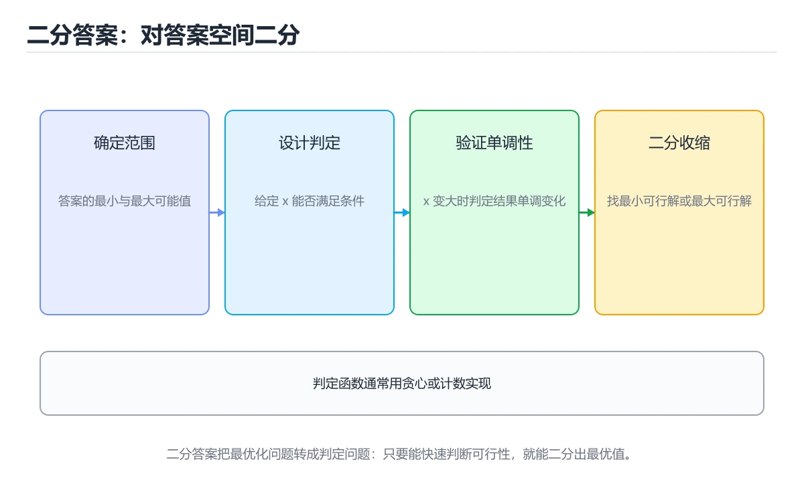
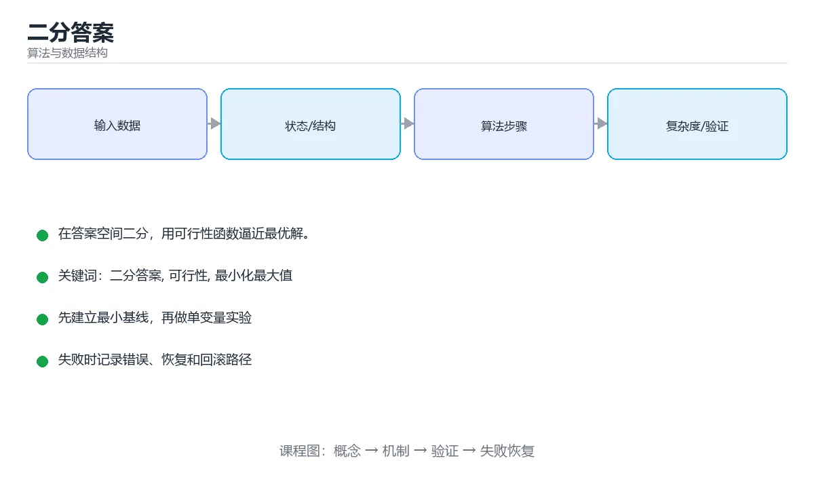

# 二分答案

> 内容更新时间：2026-10-06





## 学习目标

- 能用自己的话解释二分答案解决了什么问题，而不是只背术语。
- 能说清 二分答案、「可行性」、「最小化最大值」、「贪心」 之间的关系，并分别举出一个例子。
- 能把本课知识放回「算法与数据结构」的知识体系，说明它和相邻主题的边界。
- 能完成本课练习，并用验收标准检查自己的结果。

> 一句话摘要：在答案空间二分，用可行性函数逼近最优解。

## 前置知识

- 先完成上一课《单调栈与单调队列》；如果已经掌握，可以直接用本课练习自测。
- 本课阶段：进阶。建议先掌握同一分类的基础课程，并能独立运行正文中的最小示例。
- 开始前先复习：二分答案、可行性、最小化最大值。
- 如果某一步看不懂，先记录具体卡点，完成练习后再回头读一遍。

## 和二分查找的区别

```text
二分查找：在有序数组里找某个值
二分答案：在答案的取值范围内二分，用 check(mid) 判断这个答案是否可行
```

适用条件：答案具有**单调性**——若 x 可行，则所有比 x 更宽松（或更严格）的值也可行，从而可以二分逼近最优解。

## 通用模板

```python
def binary_answer(low, high, feasible):
    """求满足 feasible(x) 的最小 x（feasible 随 x 单调递增为真）"""
    while low < high:
        mid = (low + high) // 2
        if feasible(mid):
            high = mid          # mid 可行，尝试更小
        else:
            low = mid + 1       # mid 不可行，必须更大
    return low
```

求「最大可行值」时把可行分支改成 `low = mid`，并注意 `mid = (low + high + 1) // 2` 避免死循环。

## 例一：分割数组的最大值最小（最小化最大值）

把数组分成 k 段，使各段和的最大值最小：

```python
def split_array(nums, k):
    def feasible(limit):
        count, current = 1, 0
        for value in nums:
            if current + value > limit:
                count += 1
                current = value
                if count > k:
                    return False
            else:
                current += value
        return True
    low, high = max(nums), sum(nums)
    return binary_answer(low, high, feasible)
```

答案范围是 `[max(nums), sum(nums)]`，`feasible` 是贪心地在每段接近 limit 时切分。

## 例二：爱吃香蕉的珂珂

```python
import math

def min_eating_speed(piles, hours):
    def feasible(speed):
        return sum(math.ceil(p / speed) for p in piles) <= hours
    return binary_answer(1, max(piles), feasible)
```

速度越快耗时越短，满足单调性，因此可以二分速度。

## 例三：实数二分

```python
def sqrt_binary(x, eps=1e-10):
    low, high = 0.0, max(1.0, x)
    while high - low > eps:          # 用精度控制迭代
        mid = (low + high) / 2
        if mid * mid >= x:
            high = mid
        else:
            low = mid
    return low
```

实数二分固定迭代 100 次比用 eps 更稳妥。

## 解题步骤

1. 明确答案的含义与取值范围（下界/上界）。
2. 写 `feasible(x)`，通常用贪心或遍历，复杂度 O(n)。
3. 确认单调性：x 变大时 feasible 是「由真变假」还是「由假变真」。
4. 套模板，注意边界与死循环。

总复杂度 `O(n log V)`，V 是答案范围。

## 常见误区

- 单调性不成立却硬套二分（先举反例验证）。
- 上下界取错，导致漏掉最优解。
- `while low < high` 与 `low = mid` 的组合没处理好，造成死循环。
- 可行性函数写错，比二分本身更容易出错——先用暴力验证小数据。

## 三类判定函数的写法对比

| 判定类型 | 典型题 | 判定函数要点 |
| --- | --- | --- |
| 贪心可行性 | 分割数组最大和、装船问题 | 从左往右累加，超限就切一段，统计段数是否 ≤ 限制 |
| 计数可行性 | 学生分糖、最少天数 | 按规则累计需求量，与预算比较 |
| 数学推导 | 开方、最小速度 | 用公式直接算出需要的步数或时间 |

写判定函数的三个要求：**只返回真假**（不要在里面做二分）、**复杂度 O(n) 或 O(log n)**（否则总复杂度会退化）、**边界明确**（空输入、单个元素、limit 为 0 时是否合法）。

两种二分方向的模板区别：求"最小可行值"用 `if feasible(mid) high = mid else low = mid + 1`，mid 取下整；求"最大可行值"用 `if feasible(mid) low = mid else high = mid - 1`，**mid 必须上取整 `(low+high+1)//2`**，否则会死循环——这是二分答案最常踩的坑。

## 本课小结
二分答案 = **在答案空间上二分 + 可行性判定**。看到「最大化的最小值」「最小化的最大值」「至少/至多」这类问法，优先考虑它。

## 适用题型速查

| 题型 | 二分的对象 | 判定函数 |
| --- | --- | --- |
| 分割数组使最大段和最小 | 段和上限 | 能否切出不超过 k 段 |
| 最少天数完成任务 | 天数 | 该天数内是否达标 |
| 运货能力 | 船的最低载重 | 能否在 D 天内运完 |
| 最小速度吃香蕉 | 速度 | 该速度能否按时吃完 |
| 最大化最小值（如牛栏分配） | 最小间距 | 该间距能否放下 k 个 |
| 最小化最大值（如任务分配） | 最大值上限 | 该上限能否完成任务 |
| 容量规划 | 容量 | 是否满足负载 |
| 求第 k 小（值域二分） | 数值 | 不大于该值的元素个数 |

## 常见错误对照表

| 容易写错的做法 | 实际现象 | 原因与正确做法 |
| --- | --- | --- |
| 判定函数不具单调性 | 二分结果错误 | 先证明可行性随答案单调 |
| 上下界设得太窄 | 错过正确答案 | 下界取最小可能值，上界取最大可能值 |
| 求最大可行值时用 `high = mid - 1` 且记录方式不一致 | 死循环或漏解 | 统一模板：可行记录并往右 |
| `mid` 用 `(low + high) // 2` 在极大数据溢出 | 整数溢出（C++/Java） | 写 `low + (high - low) // 2` |
| 判定函数写成 O(n²) | 总体超时 | 判定函数应尽量 O(n) 或 O(n log n) |
| 二分浮点用 `low <= high` | 死循环 | 固定迭代次数或设误差阈值 |
| 忘记单元素就超限的剪枝 | 返回错误结果 | 判定函数里先检查最大单元素 |
| 边界条件没覆盖 | 结果差一 | 测试答案等于上下界的情况 |
| 把可行判定写成「严格小于」 | 结果偏小或偏大 | 与题目条件严格对齐 |
| 没有小规模暴力对拍 | 逻辑错误难以发现 | 用暴力解验证前几百组随机数据 |

## 自测清单

- [ ] 能说出二分答案的两个前提：答案有界、可行性单调。
- [ ] 能独立写出判定函数并分析其复杂度。
- [ ] 区分「求最大可行值」与「求最小可行值」的收缩方向。
- [ ] `mid` 计算避免溢出。
- [ ] 用暴力解对小规模数据对拍验证。

## 动手练习

> 本课练习重点：围绕「二分答案、可行性、最小化最大值」完成复述、实验和交付，每个结果都要能被别人检查。

先手算 8 个元素的状态变化，再实现并统计操作次数与复杂度。

### 练习 1：建立心智模型（10 分钟）

合上教程，用 3～5 句话回答：

1. 二分答案解决了什么问题？
2. 如果没有它，会出现什么具体后果？
3. 它和「可行性」是什么关系？

**验收标准**：至少出现一个本课关键词，并写出一个反例、边界条件或失效场景。

### 练习 2：做一次可控实验（20 分钟）

从正文中选一个最小示例，完成以下操作：

1. 先预测修改一个参数、输入或步骤后的结果。
2. 再实际执行或逐步推演，记录真实结果。
3. 如果结果与预测不同，写出差异原因。

**验收标准**：留下「原例 → 改动 → 预测 → 结果 → 原因」五步记录。

### 练习 3：交付一个小结果（30 分钟）

给定 8～12 个手工构造的数据，写出每一步状态，并统计比较或交换次数。

任务要求：

- 结果必须能被别人检查，不能只写“我已经理解了”。
- 至少覆盖二分答案和「可行性」两个关键词。
- 写出 1 个仍然不确定的问题，以及下一步如何验证。

> 提示：时间有限时优先做练习 1 和练习 2；练习 3 可以拆成两次完成。

## 可运行练习

### 任务 1：先跑通，再解释

```python
def binary_answer(low, high, feasible):
    """求满足 feasible(x) 的最小 x（feasible 随 x 单调递增为真）"""
    while low < high:
        mid = (low + high) // 2
        if feasible(mid):
            high = mid          # mid 可行，尝试更小
        else:
            low = mid + 1       # mid 不可行，必须更大
    return low
```

### 任务 2：只改一个条件

把「二分答案」的最小示例复制一份，只改一个条件再跑一次：

- 改动点：只把二分答案的输入换成空值、极值或错误输入，其余保持不变。
- 预测：先写下「二分答案」在改动后的输出或错误信息，再运行。
- 记录：对照改动前后的结果，指出差异出在哪一步。
- 验收：换回原条件能复现原结果，改动只影响二分答案。

### 任务 3：迁移到自己的数据

用同一套思路处理一组你自己的数据或场景，保持输出格式与任务 1 一致。

## 故障现场

### 现场 1：本课的 二分答案 常规用例通过，但边界用例失败

把这条结论放回「二分答案」的完整流程里展开：

- 正文依据：能说清 二分答案、「可行性」、「最小化最大值」、「贪心」 之间的关系，并分别举出一个例子。
- 落地检查：把「现场 1：本课的 二分答案 常规用例通过，但边界用例失败」改写成一条可执行的核对项，逐条验证输入、超时与失败路径。

### 现场 2：本课的 可行性 结果在两次运行之间不一致

**症状**：在本课的练习或生产场景里出现“本课的 可行性 结果在两次运行之间不一致”。

**复现**：准备一组最小输入，只保留触发“本课的 可行性 结果在两次运行之间不一致”的必要条件，连续运行两次确认结果稳定。

**定位**：围绕“可行性 依赖了当前版本、执行顺序或共享状态，单次运行无法暴露差异”检查调用链、输入数据和环境配置，先验证假设再改代码。

**预防**：把“本课的 可行性 结果在两次运行之间不一致”写成一条自动化用例，并在本课的验收清单里保留对应检查项。

### 现场 3：小数据规模结果正确，扩大输入后超时或内存溢出

**定位**：围绕“二分答案 的时间或空间复杂度在边界条件下失控，可行性 的常数开销也被低估”检查调用链、输入数据和环境配置，先验证假设再改代码。

## 本课复习清单

离开本课前，逐项确认：

- [ ] 不看解析，能说出「使用二分答案的前提是？」的判断依据。
- [ ] 不看解析，能说出「「分割数组使最大段和最小」属于哪类问题？」的判断依据。
- [ ] 不看解析，能说出「求「最大可行值」时容易踩的坑是？」的判断依据。
- [ ] 不看解析，能说出「二分答案与普通二分查找的关系是？」的判断依据。
- [ ] 不看解析，能说出「求「最大可行值」时，可行时应如何收缩边界？」的判断依据。
- [ ] 至少运行一次本课示例，记录输入、输出和一个边界情况。
- [ ] 把本课最容易混淆的两个概念写成一句话对照。

| 复盘项 | 记录 |
| --- | --- |
| 已经能独立解释的考点 |  |
| 仍然说不清的概念 |  |
| 下一步验证动作 |  |

## 术语速查

把「二分答案」里反复出现的术语集中放在一起。复习时先遮住右列，尝试用自己的话解释，再回到正文核对。

| 术语 | 本课语境 |
| --- | --- |
| `可行性` | 围绕“二分答案 的时间或空间复杂度在边界条件下失控，可行性 的常数开销也被低估”检查调用链、输入数据和环境配置，先验证假设再改代码。 |
| `最小化最大值` | “二分答案”中的 二分答案、可行性、最小化最大值，下列哪两项是本课强调的实践判断。 |
| `贪心` | 它在「二分答案」里是理解「贪心」的关键术语，用来解释定义、适用条件与失败路径；它与二分答案、可行性共同决定这一节的判断边界。复习时回到正文示例核对输入、输出和验证方式。 |

## 考点精讲

### 考点 1：概念判断·二分答案

- **题目**：使用二分答案的前提是？
- **判断依据**：题干的正确项是答案具有单调性。题目本身不需要有序，但可行性必须随答案单调变化。回到「二分答案」的正文示例，用“使用二分答案的前提是”走一遍二分答案、可行性、最小化最大值的完整流程，能复现的结论才可以保留。回到正文示例，用“使用的前提是”走一遍二分答案、可行性、最小化最大值的完整流程，能复现的结论才可以保留。

### 考点 2：概念判断·分割数组使最大段和最小

- **题目**：「分割数组使最大段和最小」属于哪类问题？
- **判断依据**：在答案范围二分，用贪心判断能否在 k 段内完成。其他选项：「分割数组使最大段和最小」属于最小化最大值。在「二分答案」里判断这道题，要把二分答案、可行性、最小化最大值的条件、过程与失败路径逐项对齐，换成“分割数组使最大段和最小属于哪类问题”这个场景，只有满足前提的结论才成立。

### 考点 3：多选辨析·二分答案

- **题目**：围绕“二分答案”中的 二分答案、可行性、最小化最大值，下列哪两项是本课强调的实践判断？
- **判断依据**：题干的正确项是学习 二分答案 时要同时说明输入、输出和失败路径，不能只看正常流程。在二分答案里，判断 可行性 时要固定版本与边界输入，所以“验证 可行性 时要固定版本并覆盖边界输入，结论才可复现”才可复现。在「二分答案」里，如果只凭关键词作答，很容易把验证 可行性 时要固定版本并覆盖边界输入，结论才可复现、把 可行性 的单次运行结果当成所有版本和规模都成立与验证 可行性 时要固定版本并覆盖边界输入，结论才可复现。

### 考点 4：代码补全·二分答案

- **题目**：下面这段 Python 代码摘自「二分答案」的正文示例。关于这段代码，下面哪一项说法与实际内容相符？
- **判断依据**：在「二分答案」里，题干的正确项是这段代码包含循环结构，同一段逻辑会被重复执行，在「二分答案」里循环次数与二分答案的输入规模直接相关。「二分答案」要求先交代二分答案、可行性、最小化最大值的前提再下结论，所以“这段代码包含循环结构”只在题干“下面这段 Python 代码摘自二分答案的正文示例关于这段代”给定的条件下成立。

### 考点 5：概念判断·最大可行值

- **题目**：求「最大可行值」时，可行时应如何收缩边界？
- **判断依据**：求最大时「可行就往右」，求最小时「可行就往左」，写成模板可避免方向搞反。把“记录答案后把下界抬高”代回「二分答案」里“求最大可行值时”的例子核对，条件一旦改变，结论就要用二分答案、可行性、最小化最大值重新推导。回到二分答案、可行性、最小化最大值本身再看一遍：只有“记录答案后把下界抬高”与题干“求最大可行值时”的前提一致，结论才成立。

### 考点 6：填空·二分答案

- **题目**：补全代码：「二分答案」示例中，下面这行代码缺少哪个关键字或函数名？请填入 ____。 `def ____(low, high, feasible):`
- **判断依据**：空格应填写「binary_answer」。把“binaryanswer”代回「二分答案」里“二分答案示例中”的例子核对，条件一旦改变，结论就要用二分答案、可行性、最小化最大值重新推导。回到二分答案、可行性、最小化最大值本身再看一遍：只有“binaryanswer”与题干“binaryanswer”的前提一致，结论才成立。

## English Overview

**Title:** Binary Search on Answer

**Summary:** Binary search the answer with a feasibility check.

**Category:** Algorithms
**Level:** 进阶
**Key terms:** 二分答案, 可行性, 最小化最大值, 贪心

## 内容元数据

- 内容版本：v2.0
- 最后更新：2026-10-06
- 学习阶段：进阶
- 适用环境：任意主流语言（伪代码与复杂度为主）
- 内容来源：内置结构化课程与工程实践整理
- 相关主题：二分答案、可行性、最小化最大值、贪心
- 质量版本：P0 测验标准 + P1 覆盖扩展 + P2 体验补全

## 参考资料与复核

- 最后复核：2026-10-04
- 下次复核：2027-04-04
- 复核范围：版本兼容、API 行为、安全建议与工程实践
- 来源性质：官方文档、标准或权威教材；正文为离线教学重组

| 参考资料 | 本课用途 |
| --- | --- |
| [Big-O Cheat Sheet](https://www.bigocheatsheet.com/) | 复杂度速查 |
| [MIT 6.006](https://ocw.mit.edu/courses/6-006-introduction-to-algorithms-spring-2020/) | 算法设计与分析 |
| [VisuAlgo](https://visualgo.net/en) | 算法可视化与交互 |

> 「二分答案」的链接用于离线阅读后的延伸核对；App 不会自动联网。

## 复习与迁移

复习目标：把「二分答案」的判断标准放回可复现的例子里。先自己作答，再对照依据；如果结论正确但理由不完整，回到正文补足前提。

### 概念复述

- 用一句话说明「二分答案」解决什么问题：在答案空间二分，用可行性函数逼近最优解。
- 写出二分答案、可行性、最小化最大值之间的关系，并各举一个例子。
- 说出本课最容易混淆的两个概念，以及区分它们的判据。

### 正文逐节复核

- **例一：分割数组的最大值最小（最小化最大值）**：答案范围是 `[max(nums), sum(nums)]`，`feasible` 是贪心地在每段接近 limit 时切分。

### 测验回顾

1. 使用二分答案的前提是？
   - 依据：题干的正确项是答案具有单调性。题目本身不需要有序，但可行性必须随答案单调变化。回到「二分答案」的正文示例，用“使用二分答案的前提是”走一遍二分答案、可行性、最小化最大值的完整流程，能复现的结论才可以保留。回到正文示例，用“使用的前提是”走一遍二分答案、可行性、最小化最大值的完整流程，能复现的结论才可以保留。
2. 「分割数组使最大段和最小」属于哪类问题？
   - 依据：在答案范围二分，用贪心判断能否在 k 段内完成。其他选项：「分割数组使最大段和最小」属于最小化最大值。在「二分答案」里判断这道题，要把二分答案、可行性、最小化最大值的条件、过程与失败路径逐项对齐，换成“分割数组使最大段和最小属于哪类问题”这个场景，只有满足前提的结论才成立。
3. 围绕“二分答案”中的 二分答案、可行性、最小化最大值，下列哪两项是本课强调的实践判断？
   - 依据：题干的正确项是学习 二分答案 时要同时说明输入、输出和失败路径，不能只看正常流程。在二分答案里，判断 可行性 时要固定版本与边界输入，所以“验证 可行性 时要固定版本并覆盖边界输入，结论才可复现”才可复现。在「二分答案」里，如果只凭关键词作答，很容易把验证 可行性 时要固定版本并覆盖边界输入，结论才可复现、把 可行性 的单次运行结果当成所有版本和规模都成立与验证 可行性 时要固定版本并覆盖边界输入，结论才可复现。
4. 下面这段 Python 代码摘自「二分答案」的正文示例。关于这段代码，下面哪一项说法与实际内容相符？
   - 依据：在「二分答案」里，题干的正确项是这段代码包含循环结构，同一段逻辑会被重复执行，在「二分答案」里循环次数与二分答案的输入规模直接相关。「二分答案」要求先交代二分答案、可行性、最小化最大值的前提再下结论，所以“这段代码包含循环结构”只在题干“下面这段 Python 代码摘自二分答案的正文示例关于这段代”给定的条件下成立。
5. 求「最大可行值」时，可行时应如何收缩边界？
   - 依据：求最大时「可行就往右」，求最小时「可行就往左」，写成模板可避免方向搞反。把“记录答案后把下界抬高”代回「二分答案」里“求最大可行值时”的例子核对，条件一旦改变，结论就要用二分答案、可行性、最小化最大值重新推导。回到二分答案、可行性、最小化最大值本身再看一遍：只有“记录答案后把下界抬高”与题干“求最大可行值时”的前提一致，结论才成立。
6. 补全代码：「二分答案」示例中，下面这行代码缺少哪个关键字或函数名？请填入 ____。

`def ____(low, high, feasible):`
   - 依据：空格应填写「binary_answer」。把“binaryanswer”代回「二分答案」里“二分答案示例中”的例子核对，条件一旦改变，结论就要用二分答案、可行性、最小化最大值重新推导。回到二分答案、可行性、最小化最大值本身再看一遍：只有“binaryanswer”与题干“binaryanswer”的前提一致，结论才成立。

### 迁移练习

把「二分答案」的结论迁移到相邻主题，每次迁移都写清预测与证据：

1. 换输入：用二分答案处理一组你自己的数据，对比教材示例的结果差异。
2. 换失败条件：制造一个可行性相关的错误，说明如何从错误信息定位根因。
3. 换规模：把数据量或并发度提高一个数量级，说明「二分答案」的结论是否仍成立。
