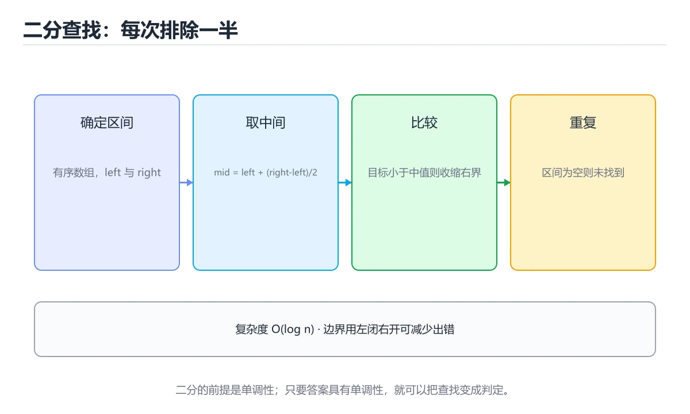
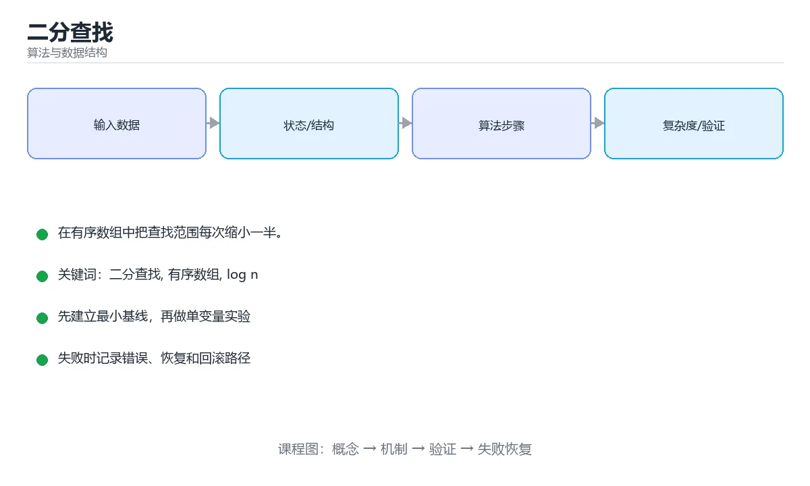

# 二分查找





> 内容更新时间：2026-10-06 · 学习阶段：基础 · 预计用时：12 分钟

## 学习目标

- 能用自己的话解释二分查找解决了什么问题，而不是只背术语。
- 能说清 二分查找、「有序数组」、「log n」、「边界」 之间的关系，并分别举出一个例子。
- 能把本课知识放回「算法与数据结构」的知识体系，说明它和相邻主题的边界。
- 能完成本课练习，并用验收标准检查自己的结果。

> 一句话摘要：在有序数组中把查找范围每次缩小一半。

## 前置知识

- 会进行基本的文件、命令行或浏览器操作；遇到不熟悉的术语先查本课关键词。
- 本课阶段：进阶。建议先掌握同一分类的基础课程，并能独立运行正文中的最小示例。
- 开始前先复习：二分查找、有序数组、log n。
- 如果某一步看不懂，先记录具体卡点，完成练习后再回头读一遍。

## 适用场景

二分查找要求在**有序数组**中查找目标值。它每次把搜索范围缩小一半，因此时间复杂度是 `O(log n)`：在 10 亿个有序数据中查找，最多只要 30 次比较。

## 核心思想

维护一个左闭右闭区间 `[left, right]`，反复取中点：

1. 若中点值等于目标，返回下标。
2. 若中点值小于目标，目标一定在右半边，令 `left = mid + 1`。
3. 若中点值大于目标，目标一定在左半边，令 `right = mid - 1`。
4. 区间为空时说明不存在，返回 -1。

## 代码实现

```python
def binary_search(nums, target):
    left, right = 0, len(nums) - 1      # 左闭右闭区间
    while left <= right:                # 区间非空就继续
        mid = left + (right - left) // 2  # 防止溢出的写法
        if nums[mid] == target:
            return mid
        elif nums[mid] < target:
            left = mid + 1
        else:
            right = mid - 1
    return -1

print(binary_search([1, 3, 5, 7, 9, 11], 7))  # 3
```

## 为什么用 left + (right - left) // 2

在 C/C++ 等语言中，`(left + right) / 2` 可能超过整数上限变成负数。写成 `left + (right - left) // 2` 可以避免溢出，这个习惯在所有语言中都值得保留。

## 边界问题

二分查找最容易出错的地方是区间定义。常见错误包括：

- `while left < right` 与 `<=` 混用，导致漏查最后一个元素。
- 更新时写成 `left = mid` 造成死循环。
- 数组含重复元素时未明确要找哪一个。

```python
# 查找第一个等于 target 的位置（左边界）
def lower_bound(nums, target):
    left, right = 0, len(nums)
    while left < right:                 # 左闭右开区间
        mid = (left + right) // 2
        if nums[mid] < target:
            left = mid + 1
        else:
            right = mid
    return left
```

## 生活中的类比

猜数字游戏「1 到 100，每次告诉你大了还是小了」，最优策略就是每次猜中点，最多 7 次必中，这就是二分思想。

## 边界速查表

| 环节 | 左闭右闭 `[left, right]` | 左闭右开 `[left, right)` |
| --- | --- | --- |
| 初始值 | `left=0, right=n-1` | `left=0, right=n` |
| 循环条件 | `left <= right` | `left < right` |
| 命中时 | 直接返回 mid | 直接返回 mid |
| 收缩左界 | `left = mid + 1` | `left = mid + 1` |
| 收缩右界 | `right = mid - 1` | `right = mid` |
| 返回位置 | 未找到返回 -1 | 返回 left 即插入位置 |

两种写法都对，**关键是循环条件与边界更新必须配套**；混用是死循环与漏查的首要原因。写完后用「目标在最左 / 最右 / 不存在 / 数组为空」四组用例自测。

## 本课小结
二分查找的模板不难，难在**边界**。写完后用「目标在最左、最右、不存在」三种情况自测。

## 三种模板速查

| 目标 | 模板要点 | 返回值 |
| --- | --- | --- |
| 找任意一个等于 target 的下标 | `while (lo <= hi)`，相等即返回 | 下标或 -1 |
| 找第一个 >= target 的位置 | `while (lo < hi)`，`hi = mid` | 插入位置（`lower_bound`） |
| 找最后一个 <= target 的位置 | `while (lo < hi)`，`lo = mid` 需上取整 | 下标或 -1 |

```python
def lower_bound(nums, target):
    """返回第一个 >= target 的下标；不存在时返回 len(nums)。"""
    lo, hi = 0, len(nums)          # 左闭右开区间
    while lo < hi:
        mid = (lo + hi) // 2
        if nums[mid] < target:
            lo = mid + 1
        else:
            hi = mid
    return lo

def upper_bound(nums, target):
    """返回第一个 > target 的下标。"""
    lo, hi = 0, len(nums)
    while lo < hi:
        mid = (lo + hi) // 2
        if nums[mid] <= target:
            lo = mid + 1
        else:
            hi = mid
    return lo

# 统计 target 出现次数：两个边界相减即可
count = upper_bound(nums, target) - lower_bound(nums, target)
```

## 边界与复杂度速查

| 项目 | 说明 |
| --- | --- |
| 时间复杂度 | O(log n)，10 亿数据最多比较约 30 次 |
| 空间复杂度 | 迭代写法 O(1)，递归写法 O(log n) |
| 前置条件 | 数据有序（或满足单调性） |
| `mid` 写法 | `lo + (hi - lo) // 2` 避免整数溢出（Java / C++ 尤其重要） |
| 区间风格 | 左闭右开 `[lo, hi)` 最不易出错，统一到底 |
| 循环条件 | 用 `lo < hi` 时循环结束即 `lo == hi`，直接返回 |
| 死循环排查 | 出现 `lo = mid` 时必须改用上取整 `mid = (lo + hi + 1) // 2` |

## 常见错误对照表

| 容易写错的做法 | 实际现象 | 原因与正确做法 |
| --- | --- | --- |
| `while lo <= hi` 里写 `hi = mid` | 死循环 | 闭区间与半开区间的收缩方式必须配套 |
| `lo = mid` 而不上取整 | 死循环（lo 与 hi 相邻时 mid 恒等于 lo） | 改成 `mid = (lo + hi + 1) // 2` |
| `hi = len(nums)` 却写 `nums[hi]` | `IndexError` | 右开区间不能取 `nums[hi]` |
| 循环里 `lo = mid - 1` 配 `lo < hi` | 漏掉候选解 | 明确用闭区间 `<=` 模板 |
| 有重复元素时用「找到即返回」 | 返回的不是第一个/最后一个 | 用 `lower_bound` / `upper_bound` |
| 对无序数据二分 | 结果随机 | 先排序，或确认题目具备单调性 |
| 对浮点数用 `lo <= hi` | 精度问题、死循环 | 固定循环次数（如 100 次）或设误差阈值 |
| 二分答案时 check 不单调 | 结果不正确 | 先证明可行性随答案单调，再二分 |
| 用递归但没考虑栈深 | 极大规模下递归过深 | 数据量大时改迭代 |

## 自测清单

- [ ] 能默写 `lower_bound` 与 `upper_bound`。
- [ ] 知道什么时候必须用上取整避免死循环。
- [ ] 记得 `mid = lo + (hi - lo) // 2` 的作用。
- [ ] 遇到「找边界」问题优先想到二分边界而不是线性扫描。
- [ ] 能说明二分答案的适用前提是单调性。

## 动手练习

> 本课练习重点：围绕「二分查找、有序数组、log n」完成复述、实验和交付，每个结果都要能被别人检查。

先手算 8 个元素的状态变化，再实现并统计操作次数与复杂度。

### 练习 1：建立心智模型（10 分钟）

合上教程，用 3～5 句话回答：

1. 二分查找解决了什么问题？
2. 如果没有它，会出现什么具体后果？
3. 它和「有序数组」是什么关系？

**验收标准**：至少出现一个本课关键词，并写出一个反例、边界条件或失效场景。

### 练习 2：做一次可控实验（20 分钟）

从正文中选一个最小示例，完成以下操作：

1. 先预测修改一个参数、输入或步骤后的结果。
2. 再实际执行或逐步推演，记录真实结果。
3. 如果结果与预测不同，写出差异原因。

**验收标准**：留下「原例 → 改动 → 预测 → 结果 → 原因」五步记录。

### 练习 3：交付一个小结果（30 分钟）

给定 8～12 个手工构造的数据，写出每一步状态，并统计比较或交换次数。

任务要求：

- 结果必须能被别人检查，不能只写“我已经理解了”。
- 至少覆盖二分查找和「有序数组」两个关键词。
- 写出 1 个仍然不确定的问题，以及下一步如何验证。

> 提示：时间有限时优先做练习 1 和练习 2；练习 3 可以拆成两次完成。

## 可运行练习

### 任务 1：先跑通，再解释

```python
def binary_search(nums, target):
    left, right = 0, len(nums) - 1      # 左闭右闭区间
    while left <= right:                # 区间非空就继续
        mid = left + (right - left) // 2  # 防止溢出的写法
        if nums[mid] == target:
            return mid
        elif nums[mid] < target:
            left = mid + 1
        else:
            right = mid - 1
    return -1

print(binary_search([1, 3, 5, 7, 9, 11], 7))  # 3
```

### 任务 2：只改一个条件

把「二分查找」的最小示例复制一份，只改一个条件再跑一次：

- 改动点：只把二分查找的输入换成空值、极值或错误输入，其余保持不变。
- 预测：先写下「二分查找」在改动后的输出或错误信息，再运行。
- 记录：对照改动前后的结果，指出差异出在哪一步。
- 验收：换回原条件能复现原结果，改动只影响二分查找。

### 任务 3：迁移到自己的数据

用同一套思路处理一组你自己的数据或场景，保持输出格式与任务 1 一致。

## 故障现场

### 现场 1：本课的 二分查找 常规用例通过，但边界用例失败

把这条结论放回「二分查找」的完整流程里展开：

- 正文依据：能说清 二分查找、「有序数组」、「log n」、「边界」 之间的关系，并分别举出一个例子。
- 落地检查：把「现场 1：本课的 二分查找 常规用例通过，但边界用例失败」改写成一条可执行的核对项，逐条验证输入、超时与失败路径。

### 现场 2：本课的 有序数组 结果在两次运行之间不一致

**症状**：在本课的练习或生产场景里出现“本课的 有序数组 结果在两次运行之间不一致”。

**复现**：准备一组最小输入，只保留触发“本课的 有序数组 结果在两次运行之间不一致”的必要条件，连续运行两次确认结果稳定。

**定位**：围绕“有序数组 依赖了当前版本、执行顺序或共享状态，单次运行无法暴露差异”检查调用链、输入数据和环境配置，先验证假设再改代码。

**预防**：把“本课的 有序数组 结果在两次运行之间不一致”写成一条自动化用例，并在本课的验收清单里保留对应检查项。

### 现场 3：小数据规模结果正确，扩大输入后超时或内存溢出

**定位**：围绕“二分查找 的时间或空间复杂度在边界条件下失控，有序数组 的常数开销也被低估”检查调用链、输入数据和环境配置，先验证假设再改代码。

## 本课复习清单

离开本课前，逐项确认：

- [ ] 不看解析，能说出「二分查找对数据的核心要求是什么？」的判断依据。
- [ ] 不看解析，能说出「在长度为 n 的有序数组中二分查找的时间复杂度是？」的判断依据。
- [ ] 不看解析，能说出的判断依据。
- [ ] 不看解析，能说出「在 10 亿个有序数据中二分查找，最多需要比较约多少次？」的判断依据。
- [ ] 不看解析，能说出「数组含重复元素且只需返回任意一个目标位置，二分查找还能用吗？」的判断依据。
- [ ] 至少运行一次本课示例，记录输入、输出和一个边界情况。
- [ ] 把本课最容易混淆的两个概念写成一句话对照。

| 复盘项 | 记录 |
| --- | --- |
| 已经能独立解释的考点 |  |
| 仍然说不清的概念 |  |
| 下一步验证动作 |  |

## 术语速查

| 术语 | 本课语境 |
| --- | --- |
| `O(log n)` | 二分查找要求在**有序数组**中查找目标值。它每次把搜索范围缩小一半，因此时间复杂度是 `O(log n)`：在 10 亿个有序数据中查找，最多只要 30 次比较。 |
| `[left, right]` | 维护一个左闭右闭区间 `[left, right]`，反复取中点： |
| `left = mid + 1` | 若中点值小于目标，目标一定在右半边，令 `left = mid + 1`。 |
| `right = mid - 1` | 若中点值大于目标，目标一定在左半边，令 `right = mid - 1`。 |
| `(left + right) / 2` | 在 C/C++ 等语言中，`(left + right) / 2` 可能超过整数上限变成负数。写成 `left + (right - left) // 2` 可以避免溢出，这个习惯在所有语言中都值得保留。 |
| `left + (right - left) // 2` | 在 C/C++ 等语言中，`(left + right) / 2` 可能超过整数上限变成负数。写成 `left + (right - left) // 2` 可以避免溢出，这个习惯在所有语言中都值得保留。 |

## 考点精讲

### 考点 1：多选辨析·二分查找

- **题目**：围绕“二分查找”中的 二分查找、有序数组、log n，下列哪两项是本课强调的实践判断？
- **判断依据**：题干的正确项是学习 二分查找 时要同时说明输入、输出和失败路径，不能只看正常流程。在「二分查找」里，验证 有序数组 时要固定版本并覆盖边界输入，结论才可复现。在「二分查找」里判断这道题，要把二分查找、有序数组、log n的条件、过程与失败路径逐项对齐，换成“围绕二分查找中的 二分查找、有序数组”这个场景，只有满足前提的结论才成立。

### 考点 2：代码补全·二分查找

- **题目**：这段 Python 代码是「二分查找」的示例片段，下面哪一项描述与它一致？
- **判断依据**：在「二分查找」里，题干的正确项是这段代码把主要逻辑封装在函数或方法里，需要被调用才会执行，在「二分查找」里封装边界决定二分查找从哪一步开始生效。「二分查找」要求先交代二分查找、有序数组、log n的前提再下结论，所以“这段代码把主要逻辑封装在函数或方法里”只在题干“这段 Python 代码是二分查找的示例片段”给定的条件下成立。

### 考点 3：概念判断·二分查找

- **题目**：写成 mid = left + (right - left) / 2 的主要好处是？
- **判断依据**：在「二分查找」里，避免 left + right 整数溢出。在 C/C++ 等语言中 left + right 可能超过整数上限，先减后加可以避免溢出。「二分查找」要求先交代二分查找、有序数组、log n的前提再下结论，所以“避免 left + right 整数溢出”只在题干“写成 mid = left + (right - left)”给定的条件下成立。

### 考点 4：概念判断·二分查找

- **题目**：在 10 亿个有序数据中二分查找，最多需要比较约多少次？
- **判断依据**：log2(10^9) 约等于 30，每次比较把范围缩小一半。其他选项：log2(10 亿) 约等于 30，这正是二分「最多 30 次」的来源。这道题要求区分概念与边界，「30」只有在题干给出的前提下才成立，而「10 亿」、「10」缺少同一组条件。「二分查找」要求先交代二分查找、有序数组、log n的前提再下结论，所以“30”只在题干“在 10 亿个有序数据中二分查找”给定的条件下成立。

### 考点 5：概念判断·二分查找

- **题目**：数组含重复元素且只需返回任意一个目标位置，二分查找还能用吗？
- **判断依据**：作答时，先用二分查找建立输入与输出的基线，再把能，命中即可返回代入边界条件核对，结论才能复现。这道题的关键在「二分查找」的二分查找、有序数组、log n：先确认题干“数组含重复元素且只需返回任意一个目标”问的是哪一步，再排除偷换前提的选项。把“能，命中即可返回”代回正文里“数组含重复元素且只需返回任意一个目标位置”的例子核对，条件一旦改变，结论就要用二分查找、有序数组、log n重新推导。

### 考点 6：填空·二分查找

- **题目**：补全代码：「二分查找」示例中，下面这行代码缺少哪个关键字或函数名？请填入 ____。 `def ____(nums, target):`
- **判断依据**：空格应填写「binary_search」。def (nums, target): 限定的语境来判断。把“binarysearch”代回「二分查找」里“二分查找示例中”的例子核对，条件一旦改变，结论就要用二分查找、有序数组、log n重新推导。

## English Overview

**Title:** Binary Search

**Summary:** Halve the search range on a sorted array.

**Category:** Algorithms
**Level:** 进阶
**Key terms:** 二分查找, 有序数组, log n, 边界, 查找

## 内容元数据

- 内容版本：v2.0
- 最后更新：2026-10-06
- 学习阶段：基础
- 适用环境：任意主流语言（伪代码与复杂度为主）
- 内容来源：内置结构化课程与工程实践整理
- 相关主题：二分查找、有序数组、log n、边界、查找
- 质量版本：P0 测验标准 + P1 覆盖扩展 + P2 体验补全

## 参考资料与复核

- 最后复核：2026-10-04
- 下次复核：2027-04-04
- 复核范围：版本兼容、API 行为、安全建议与工程实践
- 来源性质：官方文档、标准或权威教材；正文为离线教学重组

| 参考资料 | 本课用途 |
| --- | --- |
| [GeeksforGeeks 算法](https://www.geeksforgeeks.org/fundamentals-of-algorithms/) | 算法专题与实现 |
| [Princeton Algorithms](https://algs4.cs.princeton.edu/home/) | 经典算法与数据结构教材 |
| [CP-Algorithms](https://cp-algorithms.com/) | 算法实现与复杂度 |

> 「二分查找」的链接用于离线阅读后的延伸核对；App 不会自动联网。

## 复习与迁移

复习目标：把「二分查找」的判断标准放回可复现的例子里。先自己作答，再对照依据；如果结论正确但理由不完整，回到正文补足前提。

### 概念复述

- 用一句话说明「二分查找」解决什么问题：在有序数组中把查找范围每次缩小一半。
- 写出二分查找、有序数组、log n之间的关系，并各举一个例子。
- 说出本课最容易混淆的两个概念，以及区分它们的判据。

### 正文逐节复核

- **边界速查表**：两种写法都对，**关键是循环条件与边界更新必须配套**；混用是死循环与漏查的首要原因。

### 测验回顾

1. 围绕“二分查找”中的 二分查找、有序数组、log n，下列哪两项是本课强调的实践判断？
   - 依据：题干的正确项是学习 二分查找 时要同时说明输入、输出和失败路径，不能只看正常流程。在「二分查找」里，验证 有序数组 时要固定版本并覆盖边界输入，结论才可复现。在「二分查找」里判断这道题，要把二分查找、有序数组、log n的条件、过程与失败路径逐项对齐，换成“围绕二分查找中的 二分查找、有序数组”这个场景，只有满足前提的结论才成立。
2. 这段 Python 代码是「二分查找」的示例片段，下面哪一项描述与它一致？
   - 依据：在「二分查找」里，题干的正确项是这段代码把主要逻辑封装在函数或方法里，需要被调用才会执行，在「二分查找」里封装边界决定二分查找从哪一步开始生效。「二分查找」要求先交代二分查找、有序数组、log n的前提再下结论，所以“这段代码把主要逻辑封装在函数或方法里”只在题干“这段 Python 代码是二分查找的示例片段”给定的条件下成立。
3. 写成 mid = left + (right - left) / 2 的主要好处是？
   - 依据：在「二分查找」里，避免 left + right 整数溢出。在 C/C++ 等语言中 left + right 可能超过整数上限，先减后加可以避免溢出。「二分查找」要求先交代二分查找、有序数组、log n的前提再下结论，所以“避免 left + right 整数溢出”只在题干“写成 mid = left + (right - left)”给定的条件下成立。
4. 在 10 亿个有序数据中二分查找，最多需要比较约多少次？
   - 依据：log2(10^9) 约等于 30，每次比较把范围缩小一半。其他选项：log2(10 亿) 约等于 30，这正是二分「最多 30 次」的来源。这道题要求区分概念与边界，「30」只有在题干给出的前提下才成立，而「10 亿」、「10」缺少同一组条件。「二分查找」要求先交代二分查找、有序数组、log n的前提再下结论，所以“30”只在题干“在 10 亿个有序数据中二分查找”给定的条件下成立。
5. 数组含重复元素且只需返回任意一个目标位置，二分查找还能用吗？
   - 依据：作答时，先用二分查找建立输入与输出的基线，再把能，命中即可返回代入边界条件核对，结论才能复现。这道题的关键在「二分查找」的二分查找、有序数组、log n：先确认题干“数组含重复元素且只需返回任意一个目标”问的是哪一步，再排除偷换前提的选项。把“能，命中即可返回”代回正文里“数组含重复元素且只需返回任意一个目标位置”的例子核对，条件一旦改变，结论就要用二分查找、有序数组、log n重新推导。
6. 补全代码：「二分查找」示例中，下面这行代码缺少哪个关键字或函数名？请填入 ____。

`def ____(nums, target):`
   - 依据：空格应填写「binary_search」。def (nums, target): 限定的语境来判断。把“binarysearch”代回「二分查找」里“二分查找示例中”的例子核对，条件一旦改变，结论就要用二分查找、有序数组、log n重新推导。

### 迁移练习

把「二分查找」的结论迁移到相邻主题，每次迁移都写清预测与证据：

1. 换输入：用二分查找处理一组你自己的数据，对比教材示例的结果差异。
2. 换失败条件：制造一个有序数组相关的错误，说明如何从错误信息定位根因。
3. 换规模：把数据量或并发度提高一个数量级，说明「二分查找」的结论是否仍成立。
