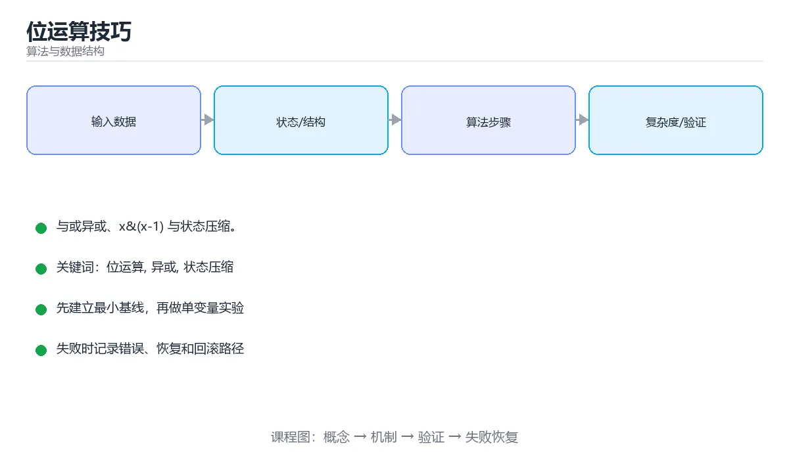

# 位运算技巧



> 内容更新时间：2026-10-03 · 学习阶段：进阶 · 预计用时：15 分钟

## 学习目标

- 能用自己的话解释「位运算技巧」解决了什么问题，而不是只背术语。
- 能说清 「位运算」、「异或」、「状态压缩」、「位掩码」 之间的关系，并分别举出一个例子。
- 能把本课知识放回「算法与数据结构」的知识体系，说明它和相邻主题的边界。
- 能完成本课练习，并用验收标准检查自己的结果。

> 一句话摘要：与或异或、x&(x-1) 与状态压缩。

## 前置知识

- 先完成上一课《贪心算法》；如果已经掌握，可以直接用本课练习自测。
- 本课阶段：进阶。建议先掌握同一分类的基础课程，并能独立运行正文中的最小示例。
- 开始前先复习：位运算、异或、状态压缩。
- 如果某一步看不懂，先记录具体卡点，完成练习后再回头读一遍。


## 基础运算

```text
a & b   按位与：都为 1 才是 1       常见用途：取位、判断奇偶
a | b   按位或：有一个 1 就是 1     常见用途：置位
a ^ b   按位异或：不同为 1          常见用途：翻转位、找唯一出现一次的数
~a      按位取反
a << k  左移 k 位，等价于乘 2^k
a >> k  右移 k 位，等价于整除 2^k（对非负数）
```

```python
n = 0b1011
n & 1                 # 1：判断奇偶
n >> 1                # 0b101：除以 2
n | (1 << 2)          # 置位
n & ~(1 << 0)         # 清位
(n >> 2) & 1          # 取第 2 位
n.bit_count()         # 1 的个数（Python 3.10+）
```

## 常用技巧

```python
x & (x - 1)      # 消掉最低位的 1（可用于统计 1 的个数、判断是否为 2 的幂）
x & (-x)         # 取出最低位的 1（树状数组的关键操作）
x ^ x            # 0
x ^ 0            # x
a, b = b, a      # Python 交换不需要位运算，但 a ^= b ^= a ^= b 在 C 系语言里常见
```

判断 2 的幂：

```python
def is_power_of_two(n: int) -> bool:
    return n > 0 and (n & (n - 1)) == 0
```

## 异或的三大性质

```text
a ^ a = 0          相同的数异或抵消
a ^ 0 = a          与 0 异或保持不变
异或满足交换律与结合律
```

因此「数组中只有一个数出现一次，其余都出现两次」只需全部异或一遍：

```python
def single_number(nums):
    result = 0
    for value in nums:
        result ^= value
    return result
```

## 状态压缩

用整数的二进制位表示「选或不选」，把集合状态压成一个数：

```python
# 枚举 n 个元素的所有子集
n = 3
for mask in range(1 << n):
    subset = [i for i in range(n) if mask & (1 << i)]
    print(mask, subset)
```

状态压缩 DP 的复杂度通常是 `O(2ⁿ × n)`，适合 `n ≤ 20` 的场景（旅行商问题、棋盘覆盖）。

## 注意事项

1. Python 的整数是任意精度，不需要考虑溢出；C/C++ 中要区分有符号与无符号移位。
2. 负数在 C/C++ 中是补码表示，右移行为依实现而定，可读性优先于炫技。
3. 位运算优先级低于比较运算，务必加括号。
4. 位技巧要写注释，否则几个月后自己也看不懂。

## 本课小结
位运算的价值是**把集合状态压缩成整数**并做到 O(1) 级的位操作；掌握 `x & (x-1)`、`x & -x`、异或消消乐这三招，就能解决大部分位运算题。

<!-- appendix:v1 -->

## 位运算速查

| 运算 | 作用 | 示例 |
| --- | --- | --- |
| `x & 1` | 取最低位（判奇偶） | `5 & 1 == 1` |
| `x >> 1` 与 `x << 1` | 除以 2 与乘 2 | `5 >> 1 == 2` |
| `x & (x - 1)` | 清除最低位的 1 | `12 & 11 == 8` |
| `x & -x` | 取出最低位的 1（lowbit） | `12 & -12 == 4` |
| `x \| (1 << k)` | 第 k 位置 1 | 置位 |
| `x & ~(1 << k)` | 第 k 位置 0 | 清位 |
| `x ^ (1 << k)` | 第 k 位取反 | 翻转 |
| `(x >> k) & 1` | 取第 k 位 | 判断 |
| `x ^ y` | 只保留不同的位 | 找差异 |
| `~x` | 按位取反 | 注意补码 |
| `x & (x - 1) == 0` | 判断是否为 2 的幂（需 x > 0） | 常见技巧 |

```python
def count_ones(x: int) -> int:
    """Brian Kernighan 法：每次消掉一个 1。"""
    count = 0
    while x:
        x &= x - 1
        count += 1
    return count


def single_number(nums):
    """只有一个数出现一次，其余出现两次。"""
    result = 0
    for n in nums:
        result ^= n
    return result


def subsets_bitmask(nums):
    """用二进制枚举全部子集：n 不超过 20 时可行。"""
    n = len(nums)
    result = []
    for mask in range(1 << n):
        result.append([nums[i] for i in range(n) if (mask >> i) & 1])
    return result


def is_power_of_two(x: int) -> bool:
    return x > 0 and (x & (x - 1)) == 0
```

## 常见应用速查

| 场景 | 技巧 |
| --- | --- |
| 状态压缩 DP | 用 `mask` 表示集合，n 不超过 20 |
| 权限位（读、写、执行） | 每位一种权限，用 `&` 判断、`\|` 授予 |
| 布隆过滤器 | 多个哈希位共同标记 |
| 位图 | 用 `bytearray` 或位集合省内存 |
| 取模 2 的幂 | `x & (2**k - 1)` 等价 `x % 2**k` |
| 子集枚举 | `for mask in range(1 << n)` |
| 交换两数 | 异或技巧仅用于演示，生产用临时变量 |

## 常见错误对照表

| 容易写错的做法 | 实际现象 | 原因与正确做法 |
| --- | --- | --- |
| 判断 2 的幂不排除 0 与负数 | 0 被误判为 2 的幂 | 加 `x > 0` |
| 用 `>>` 处理负数期望补 0 | 结果错误 | 负数右移行为依赖语言，必要时用无符号 |
| 位运算优先级记混 | 表达式结果错误 | 加括号，位运算优先级低于比较 |
| Python 整数无固定宽度 | `~x` 结果与 C 不同 | 明确掩码，如 `& 0xFFFFFFFF` |
| 左移超过位宽 | 未定义行为（C/C++） | 避免移位数不小于位宽 |
| 写 `x & 1 == 1` 不加括号 | 被解析成 `x & (1 == 1)` | 写成 `(x & 1) == 1` |
| 状态压缩不估规模 | `1 << n` 爆炸 | n 超过 20 要考虑其他算法 |
| 用异或在同一变量上交换 | 值被清零 | 生产代码用临时变量 |
| 位运算替代可读逻辑 | 维护困难 | 只在性能关键处使用并加注释 |
| 忘记补码表示 | 负数位模式判断错误 | 用无符号类型或显式掩码 |

## 自测清单

- [ ] 记得 `x & (x-1)` 清最低位、`x & -x` 取最低位。
- [ ] 会用异或找出只出现一次的元素。
- [ ] 判断 2 的幂时排除 0 与负数。
- [ ] 位运算表达式一律加括号。
- [ ] 状态压缩前先估算 2 的 n 次方规模。

## 动手练习

<!-- practice-diversified:v1 -->

> 本课练习重点：围绕「位运算、异或、状态压缩」完成复述、实验和交付，每个结果都要能被别人检查。

先手算 8 个元素的状态变化，再实现并统计操作次数与复杂度。

### 练习 1：建立心智模型（10 分钟）

合上教程，用 3～5 句话回答：

1. 「位运算技巧」解决了什么问题？
2. 如果没有它，会出现什么具体后果？
3. 它和「异或」是什么关系？

**验收标准**：至少出现一个本课关键词，并写出一个反例、边界条件或失效场景。

### 练习 2：做一次可控实验（20 分钟）

从正文中选一个最小示例，完成以下操作：

1. 先预测修改一个参数、输入或步骤后的结果。
2. 再实际执行或逐步推演，记录真实结果。
3. 如果结果与预测不同，写出差异原因。

**验收标准**：留下「原例 → 改动 → 预测 → 结果 → 原因」五步记录。

### 练习 3：交付一个小结果（30 分钟）

给定 8～12 个手工构造的数据，写出每一步状态，并统计比较或交换次数。

任务要求：

- 结果必须能被别人检查，不能只写“我已经理解了”。
- 至少覆盖「位运算」和「异或」两个关键词。
- 写出 1 个仍然不确定的问题，以及下一步如何验证。

> 提示：时间有限时优先做练习 1 和练习 2；练习 3 可以拆成两次完成。

<!-- scaffold:v1 -->

<!-- p2-enrichment:v1 -->

## English Overview

**Title:** Bit Manipulation

**Summary:** Bitwise tricks and bitmask states.

**Category:** Algorithms  
**Level:** 进阶  
**Key terms:** 位运算, 异或, 状态压缩, 位掩码

> The full tutorial is written in Chinese. This bilingual overview helps English readers identify the topic, scope and key terms before studying the detailed examples.

## 内容元数据

- 内容版本：v2.0
- 最后更新：2026-10-03
- 学习阶段：进阶
- 适用环境：任意主流语言（伪代码与复杂度为主）
- 内容来源：内置结构化课程与工程实践整理
- 相关主题：位运算、异或、状态压缩、位掩码
- 质量版本：P0 测验标准 + P1 覆盖扩展 + P2 体验补全

<!-- top50-rewrite:v1 -->

## 课程专属精读：位运算技巧

### 一、知识地图

- **基础运算**：a & b   按位与：都为 1 才是 1       常见用途：取位、判断奇偶
- **常用技巧**：x & (x - 1)      # 消掉最低位的 1（可用于统计 1 的个数、判断是否为 2 的幂）
- **异或的三大性质**：a ^ a = 0          相同的数异或抵消
- **状态压缩**：用整数的二进制位表示「选或不选」，把集合状态压成一个数：
- **注意事项**：1. Python 的整数是任意精度，不需要考虑溢出；C/C++ 中要区分有符号与无符号移位。
- **位运算速查**：理解它的定义、输入、输出和失败边界。
- **常见应用速查**：理解它的定义、输入、输出和失败边界。
- **常见错误对照表**：理解它的定义、输入、输出和失败边界。

### 二、机制与验证

| 主题 | 需要回答的问题 | 验证方式 |
| --- | --- | --- |
| 基础运算 | 它解决什么问题，输入和输出是什么？ | 最小示例、边界输入、日志或指标 |
| 常用技巧 | 它解决什么问题，输入和输出是什么？ | 最小示例、边界输入、日志或指标 |
| 异或的三大性质 | 它解决什么问题，输入和输出是什么？ | 最小示例、边界输入、日志或指标 |
| 状态压缩 | 它解决什么问题，输入和输出是什么？ | 最小示例、边界输入、日志或指标 |
| 注意事项 | 它解决什么问题，输入和输出是什么？ | 最小示例、边界输入、日志或指标 |
| 位运算速查 | 它解决什么问题，输入和输出是什么？ | 最小示例、边界输入、日志或指标 |
| 常见应用速查 | 它解决什么问题，输入和输出是什么？ | 最小示例、边界输入、日志或指标 |
| 常见错误对照表 | 它解决什么问题，输入和输出是什么？ | 最小示例、边界输入、日志或指标 |

### 三、专属检查问题

1. 基础运算 与相邻主题的边界是什么？
2. 常用技巧 与相邻主题的边界是什么？
3. 异或的三大性质 与相邻主题的边界是什么？
4. 状态压缩 与相邻主题的边界是什么？
5. 注意事项 与相邻主题的边界是什么？
6. 位运算速查 与相邻主题的边界是什么？
7. 常见应用速查 与相邻主题的边界是什么？
8. 常见错误对照表 与相邻主题的边界是什么？

### 四、故障排查

1. 固定输入和环境，确认问题能复现。
2. 找到第一个异常状态，不从最终错误倒猜。
3. 只改变一个变量，记录预测和真实结果。
4. 修复后补边界、失败和重复执行测试。

## 专属复习题库

**问：基础运算 的关键点是什么？**

答：a & b   按位与：都为 1 才是 1       常见用途：取位、判断奇偶 复习时要能用自己的话复述，并给出一个失败场景。

**问：常用技巧 的关键点是什么？**

答：x & (x - 1)      # 消掉最低位的 1（可用于统计 1 的个数、判断是否为 2 的幂） 复习时要能用自己的话复述，并给出一个失败场景。

**问：异或的三大性质 的关键点是什么？**

答：a ^ a = 0          相同的数异或抵消 复习时要能用自己的话复述，并给出一个失败场景。

**问：状态压缩 的关键点是什么？**

答：用整数的二进制位表示「选或不选」，把集合状态压成一个数： 复习时要能用自己的话复述，并给出一个失败场景。

**问：注意事项 的关键点是什么？**

答：1. Python 的整数是任意精度，不需要考虑溢出；C/C++ 中要区分有符号与无符号移位。 复习时要能用自己的话复述，并给出一个失败场景。

**问：位运算速查 的关键点是什么？**

答：理解它的定义、输入、输出和失败边界。 复习时要能用自己的话复述，并给出一个失败场景。

**问：常见应用速查 的关键点是什么？**

答：理解它的定义、输入、输出和失败边界。 复习时要能用自己的话复述，并给出一个失败场景。

**问：常见错误对照表 的关键点是什么？**

答：理解它的定义、输入、输出和失败边界。 复习时要能用自己的话复述，并给出一个失败场景。

<!-- p2-references:v1 -->

## 参考资料与复核

- 最后复核：2026-10-04
- 下次复核：2027-04-04
- 复核范围：版本兼容、API 行为、安全建议与工程实践
- 来源性质：官方文档与标准；本课正文为离线教学重组，不复制原文

| 参考资料 | 本课用途 |
| --- | --- |
| [CP-Algorithms](https://cp-algorithms.com/) | 算法实现与复杂度 |
| [MIT OpenCourseWare 6.006](https://ocw.mit.edu/courses/6-006-introduction-to-algorithms-spring-2020/) | 算法设计与分析 |

> 本课主题：与或异或、x&(x-1) 与状态压缩。

> App 完全离线展示文字链接，不会自动联网；需要延伸阅读时可复制链接到浏览器。

