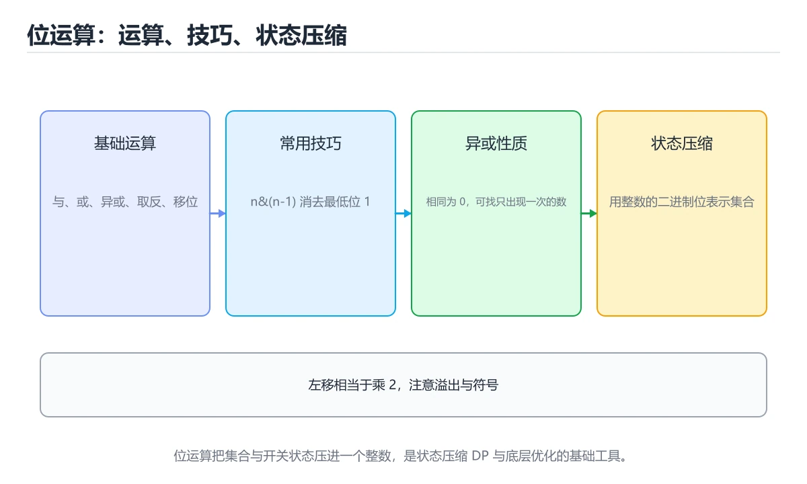

# 位运算技巧

> 内容更新时间：2026-10-06 · 学习阶段：进阶 · 预计用时：45 分钟




## 本节知识框架

**课程定位**：所属分类 `algorithms`（算法与数据结构），课程主题 `位运算技巧`，学习阶段 进阶，建议用时 45 分钟。

本课主线：与或异或、x&(x-1) 与状态压缩。

**学完本课应当能够**
- 说清 `n ≤ 20` 与 `异或` 的含义与区别，并各举一个正例和一个反例。
- 用本课示例验证 `状态压缩` 的行为，记录输入、输出与失败条件。
- 遇到「判断 2 的幂不排除 0 与负数」这类问题时，能说出触发条件与修复顺序。

### 从概念到验证的学习链条

1. `n ≤ 20`：先掌握 状态压缩 DP 的复杂度通常是 `O(2ⁿ × n)`，适合 `n ≤ 20` 的场景（旅行商问题、棋盘覆盖），再用它解释 `异或` 为什么会出现。
2. `异或`：先掌握 a ^ b 按位异或：不同为 1 常见用途：翻转位、找唯一出现一次的数，再用它解释 `状态压缩` 为什么会出现。
3. `状态压缩`：先掌握 用整数的二进制位表示「选或不选」，把集合状态压成一个数，再用它解释 `位掩码` 为什么会出现。
4. `位掩码`：先掌握 用一个整数的若干二进制位表示集合的开关状态，配合与、或、异或完成集合运算，再用它解释 本课示例的观察结果 为什么会出现。

**先修与衔接**：本课是「算法与数据结构」分类的第 14 课。先修内容：《贪心算法》。《贪心算法》里的 `贪心`、`区间调度` 是本课的前提。相关或后续课程：《前缀和与差分》。

### 完成判据

- **定义关**：不看正文也能说明 `n ≤ 20` 是 状态压缩 DP 的复杂度通常是 `O(2ⁿ × n)`，适合 `n ≤ 20` 的场景（旅行商问题、棋盘覆盖），并指出一个反例。
- **机制关**：能按“输入 → 转换 → 输出 → 验证”复述 `位运算技巧`，而不是只背结论。
- **示例关**：能运行或推演 `位运算技巧` 的 `text` 示例，并说明一个真实出现的标识符或字面量。
- **证据关**：能指出 `位运算技巧` 示例里的 调用了 `bit_count()`，并说明它支持或反驳了本课的哪一条结论。
- **排错关**：能复现 判断 2 的幂不排除 0 与负数，记录现象并按 加 `x > 0` 修复。
- **迁移关**：能把 `位运算`、`异或`、`状态压缩`、`位掩码` 放进一个与 `位运算技巧` 不同的项目场景，并保持输入与验证条件可追踪。
- **复盘关**：学完 `位运算技巧` 后，用一句话写下仍然不确定的结论，并列出下一次验证需要的输入、环境和成功判据。

### 复习清单

- [ ] 能不看正文复述本课核心术语，并指出一个边界或反例。
- [ ] 能运行或推演本课示例，记录输入、输出与失败现象。
- [ ] 能完成一次自测，并把错题对照错误表定位原因。

## 核心概念定义

| 术语 | 操作性定义 | 常见边界与风险 |
| --- | --- | --- |
| n ≤ 20 | 状态压缩 DP 的复杂度通常是 O(2ⁿ × n)，适合 n ≤ 20 的场景（旅行商问题、棋盘覆盖）。 | 结论随输入规模变化，小规模成立不代表大规模成立，需要重新测量。 |
| 异或 | a ^ b 按位异或：不同为 1 常见用途：翻转位、找唯一出现一次的数。 | 易错：值被清零；正确做法是生产代码用临时变量。 |
| 状态压缩 | 用整数的二进制位表示「选或不选」，把集合状态压成一个数。 | 易错：`1 << n` 爆炸；正确做法是n 超过 20 要考虑其他算法。 |
| 位掩码 | 用一个整数的若干二进制位表示集合的开关状态，配合与、或、异或完成集合运算。 | 换编码、换字节序或换平台都可能改变结果，处理前先固定输入编码。 |

## 原理与运行机制

### 机制总览

**教材衔接：注意事项**

1. Python 的整数是任意精度，不需要考虑溢出；C/C++ 中要区分有符号与无符号移位。
2. 负数在 C/C++ 中是补码表示，右移行为依实现而定，可读性优先于炫技。
3. 位运算优先级低于比较运算，务必加括号。
4. 位技巧要写注释，否则几个月后自己也看不懂。

**失败路径（来自本课错误表）**
- 判断 2 的幂不排除 0 与负数 → 0 被误判为 2 的幂 → 加 `x > 0`。
- 用 `>>` 处理负数期望补 0 → 结果错误 → 负数右移行为依赖语言，必要时用无符号。
- 位运算优先级记混 → 表达式结果错误 → 加括号，位运算优先级低于比较。
- Python 整数无固定宽度 → `~x` 结果与 C 不同 → 明确掩码，如 `& 0xFFFFFFFF`。
### 机制拆解：每一步的输入、动作与输出

#### 1. `n ≤ 20`
- 输入：`位运算`；本步把 状态压缩 DP 的复杂度通常是 `O(2ⁿ × n)`，适合 `n ≤ 20` 的场景（旅行商问题、棋盘覆盖） 当作判断规则。
- 动作：围绕 `n ≤ 20` 保留中间状态，并记录它与 `异或` 的对应关系。
- 输出：`异或`，它可以被下一段代码、测试或记录继续使用。
- `n ≤ 20` 的失败条件：结论随输入规模变化，小规模成立不代表大规模成立，需要重新测量。

#### 2. `异或`
- 输入：`n ≤ 20`；本步把 a ^ b 按位异或：不同为 1 常见用途：翻转位、找唯一出现一次的数 当作判断规则。
- 动作：围绕 `异或` 保留中间状态，并记录它与 `状态压缩` 的对应关系。
- 输出：`状态压缩`，它可以被下一段代码、测试或记录继续使用。
- `异或` 的失败条件：当用异或在同一变量上交换时，会出现值被清零。

#### 3. `状态压缩`
- 输入：`异或`；本步把 用整数的二进制位表示「选或不选」，把集合状态压成一个数 当作判断规则。
- 动作：围绕 `状态压缩` 保留中间状态，并记录它与 `位掩码` 的对应关系。
- 输出：`位掩码`，它可以被下一段代码、测试或记录继续使用。
- `状态压缩` 的失败条件：当状态压缩不估规模时，会出现`1 << n` 爆炸。

#### 4. `位掩码`
- 输入：`状态压缩`；本步把 用一个整数的若干二进制位表示集合的开关状态，配合与、或、异或完成集合运算 当作判断规则。
- 动作：围绕 `位掩码` 保留中间状态，并记录它与 `bit_count` 的对应关系。
- 输出：`bit_count`，它可以被下一段代码、测试或记录继续使用。
- `位掩码` 的失败条件：换编码、换字节序或换平台都可能改变结果，处理前先固定输入编码。

### 示例中的可观察事实

1. 调用了 `bit_count()`；它对应的课程主题是 `位运算技巧`。

### 复现实验记录

- 环境：`位运算技巧` 使用 `text` 示例，固定 `位运算`、`异或`、`状态压缩`、`位掩码` 作为第一组条件。
- 首轮输入：先确认 调用了 `bit_count()`，预测 `n ≤ 20` 会怎样变化。
- 基线观察：记录命令、输入、输出和错误原文，不用截图代替可复制的文本。
- 单变量修改：只改变 `位运算`，观察 `位掩码` 是否仍满足定义。
- 失败注入：复现 判断 2 的幂不排除 0 与负数，确认现象是 0 被误判为 2 的幂。
- 记录结论：把“修改前、修改后、预期变化、实际变化”写成四列表，这样复盘 `位运算技巧` 时才能区分概念错误与实现错误。

## 典型应用场景

**教材衔接：常见应用速查**

| 场景 | 技巧 |
| --- | --- |
| 状态压缩 DP | 用 `mask` 表示集合，n 不超过 20 |
| 权限位（读、写、执行） | 每位一种权限，用 `&` 判断、`\|` 授予 |
| 布隆过滤器 | 多个哈希位共同标记 |
| 位图 | 用 `bytearray` 或位集合省内存 |
| 取模 2 的幂 | `x & (2**k - 1)` 等价 `x % 2**k` |
| 子集枚举 | `for mask in range(1 << n)` |
| 交换两数 | 异或技巧仅用于演示，生产用临时变量 |

- **判断 2 的幂不排除 0 与负数**：典型现象是0 被误判为 2 的幂；正确做法是加 `x > 0`。
- **用 `>>` 处理负数期望补 0**：典型现象是结果错误；正确做法是负数右移行为依赖语言，必要时用无符号。
- **位运算优先级记混**：典型现象是表达式结果错误；正确做法是加括号，位运算优先级低于比较。
- **Python 整数无固定宽度**：典型现象是`~x` 结果与 C 不同；正确做法是明确掩码，如 `& 0xFFFFFFFF`。

### 最小验证场景

- 准备：保留 `text` 示例的原始输入，先记录 `位运算技巧` 的基线输出和完整运行命令。
- 观察：先核对 调用了 `bit_count()`，再改变一个与 `n ≤ 20` 相关的条件。
- 判定：新结果与 `位运算技巧` 的基线不同不等于错误；只有当差异破坏了 `n ≤ 20` 的定义或错误表中的约束，才判定为失败。

### 选择与边界

- 使用 `n ≤ 20` 时，先满足它的定义：状态压缩 DP 的复杂度通常是 `O(2ⁿ × n)`，适合 `n ≤ 20` 的场景（旅行商问题、棋盘覆盖）；结论随输入规模变化，小规模成立不代表大规模成立，需要重新测量。
- 使用 `异或` 时，先满足它的定义：a ^ b 按位异或：不同为 1 常见用途：翻转位、找唯一出现一次的数；易错：值被清零；正确做法是生产代码用临时变量。
- 使用 `状态压缩` 时，先满足它的定义：用整数的二进制位表示「选或不选」，把集合状态压成一个数；易错：`1 << n` 爆炸；正确做法是n 超过 20 要考虑其他算法。
- 使用 `位掩码` 时，先满足它的定义：用一个整数的若干二进制位表示集合的开关状态，配合与、或、异或完成集合运算；换编码、换字节序或换平台都可能改变结果，处理前先固定输入编码。

## 代码/协议/SQL 示例

### 最小可验证示例

```text
a & b   按位与：都为 1 才是 1       常见用途：取位、判断奇偶
a | b   按位或：有一个 1 就是 1     常见用途：置位
a ^ b   按位异或：不同为 1          常见用途：翻转位、找唯一出现一次的数
~a      按位取反
a << k  左移 k 位，等价于乘 2^k
a >> k  右移 k 位，等价于整除 2^k（对非负数）
```

**教材衔接：基础运算**

```python
n = 0b1011
n & 1                 # 1：判断奇偶
n >> 1                # 0b101：除以 2
n | (1 << 2)          # 置位
n & ~(1 << 0)         # 清位
(n >> 2) & 1          # 取第 2 位
n.bit_count()         # 1 的个数（Python 3.10+）
```

**教材衔接：常用技巧**

```python
x & (x - 1)      # 消掉最低位的 1（可用于统计 1 的个数、判断是否为 2 的幂）
x & (-x)         # 取出最低位的 1（树状数组的关键操作）
x ^ x            # 0
x ^ 0            # x
a, b = b, a      # Python 交换不需要位运算，但 a ^= b ^= a ^= b 在 C 系语言里常见
```

判断 2 的幂：

```python
def is_power_of_two(n: int) -> bool:
    return n > 0 and (n & (n - 1)) == 0
```

**教材衔接：异或的三大性质**

```text
a ^ a = 0          相同的数异或抵消
a ^ 0 = a          与 0 异或保持不变
异或满足交换律与结合律
```

因此「数组中只有一个数出现一次，其余都出现两次」只需全部异或一遍：

```python
def single_number(nums):
    result = 0
    for value in nums:
        result ^= value
    return result
```

**教材衔接：状态压缩**

用整数的二进制位表示「选或不选」，把集合状态压成一个数：

```python
# 枚举 n 个元素的所有子集
n = 3
for mask in range(1 << n):
    subset = [i for i in range(n) if mask & (1 << i)]
    print(mask, subset)
```

状态压缩 DP 的复杂度通常是 `O(2ⁿ × n)`，适合 `n ≤ 20` 的场景（旅行商问题、棋盘覆盖）。

**教材衔接：位运算速查**

| 运算 | 作用 | 示例 |
| --- | --- | --- |
| `x & 1` | 取最低位（判奇偶） | `5 & 1 == 1` |
| `x >> 1` 与 `x << 1` | 除以 2 与乘 2 | `5 >> 1 == 2` |
| `x & (x - 1)` | 清除最低位的 1 | `12 & 11 == 8` |
| `x & -x` | 取出最低位的 1（lowbit） | `12 & -12 == 4` |
| `x \| (1 << k)` | 第 k 位置 1 | 置位 |
| `x & ~(1 << k)` | 第 k 位置 0 | 清位 |
| `x ^ (1 << k)` | 第 k 位取反 | 翻转 |
| `(x >> k) & 1` | 取第 k 位 | 判断 |
| `x ^ y` | 只保留不同的位 | 找差异 |
| `~x` | 按位取反 | 注意补码 |
| `x & (x - 1) == 0` | 判断是否为 2 的幂（需 x > 0） | 常见技巧 |

```python
def count_ones(x: int) -> int:
    """Brian Kernighan 法：每次消掉一个 1。"""
    count = 0
    while x:
        x &= x - 1
        count += 1
    return count

def single_number(nums):
    """只有一个数出现一次，其余出现两次。"""
    result = 0
    for n in nums:
        result ^= n
    return result

def subsets_bitmask(nums):
    """用二进制枚举全部子集：n 不超过 20 时可行。"""
    n = len(nums)
    result = []
    for mask in range(1 << n):
        result.append([nums[i] for i in range(n) if (mask >> i) & 1])
    return result

def is_power_of_two(x: int) -> bool:
    return x > 0 and (x & (x - 1)) == 0
```

**教材衔接：深挖「位运算」的边界与代价**


### 二、把 位运算技巧 推到边界

下面是本课第一段代码（text），先原样运行一次作为基线：

| 变式 | 怎么改 | 先写下什么 | 观察点 |
| --- | --- | --- | --- |
| 边界输入 | 把 位运算技巧 的输入换成空值或最大值 | 预测输出 | 是否报错、是否静默返回 |
| 只改一处 | 把 位运算技巧 的一个参数改成另一档 | 预测差异来源 | 输出变化能否用本课结论解释 |
| 去掉一步 | 注释掉 位运算技巧 之后的一行 | 预测哪一步先失败 | 错误位置是否与预期一致 |


### 四、测验复盘

| 题号 | 正确答案 | 最容易选错的干扰项 | 复盘动作 |
| --- | --- | --- | --- |
| 1 | 消掉最低位的 1 | 取最低位 | 把干扰项改写成一句反例，再说明它违反本课哪条前提 |
| 2 | 验证 异或 时要固定版本并覆盖边界输入，结论才可复现 | 只要 位运算 的常规示例通过，就可以跳过边界与异常路径 | 把干扰项改写成一句反例，再说明它违反本课哪条前提 |
| 3 | n > 0 and (n & (n - 1)) == 0 | n & 1 == 1 | 把干扰项改写成一句反例，再说明它违反本课哪条前提 |
| 4 | 把第 k 位置 1 与置 0 | 判断第 k 位是否为 1 | 把干扰项改写成一句反例，再说明它违反本课哪条前提 |
| 5 | 这段代码只做静态声明，没有循环、分支或可观察输出。 | 这段代码包含异常处理分支，失败时会走专门的补救路径。 | 把干扰项改写成一句反例，再说明它违反本课哪条前提 |
| 6 | 0 | （无干扰项） | 把干扰项改写成一句反例，再说明它违反本课哪条前提 |


### 示例精读：先找证据，再改一个条件

1. 调用了 `bit_count()`；它出现在 `位运算技巧` 的示例中，阅读时先确认它前后各发生了什么。
- 在 `位运算技巧` 中与 `n ≤ 20` 对照：示例必须能支持 状态压缩 DP 的复杂度通常是 `O(2ⁿ × n)`，适合 `n ≤ 20` 的场景（旅行商问题、棋盘覆盖），否则说明这一段还缺少实现或验证步骤。
- 在 `位运算技巧` 中与 `异或` 对照：示例必须能支持 a ^ b 按位异或：不同为 1 常见用途：翻转位、找唯一出现一次的数，否则说明这一段还缺少实现或验证步骤。
- 在 `位运算技巧` 中与 `状态压缩` 对照：示例必须能支持 用整数的二进制位表示「选或不选」，把集合状态压成一个数，否则说明这一段还缺少实现或验证步骤。
- 在 `位运算技巧` 中与 `位掩码` 对照：示例必须能支持 用一个整数的若干二进制位表示集合的开关状态，配合与、或、异或完成集合运算，否则说明这一段还缺少实现或验证步骤。

## 时间/空间复杂度或性能分析

**复杂度证据**：本课正文出现 `O(2ⁿ × n)`、`O(1)` 等量级表达式；使用前要同时确认输入规模、最好/平均/最坏情况以及常数项来源。

**测量方法**：以 `位运算技巧` 的 `位运算` 场景为对象，固定输入跑一遍记录基线，再把规模或并发度提高一个数量级复测；两次结果的差值与波动范围才是结论依据。

### 需要控制的变量与记录项

- `位运算技巧` 的 `位运算`：固定它的版本、输入范围和资源上限，分别记录速度、内存与失败率的变化。
- `位运算技巧` 的 `异或`：固定它的版本、输入范围和资源上限，分别记录速度、内存与失败率的变化。
- `位运算技巧` 的 `状态压缩`：固定它的版本、输入范围和资源上限，分别记录速度、内存与失败率的变化。
- `位运算技巧` 的 `位掩码`：固定它的版本、输入范围和资源上限，分别记录速度、内存与失败率的变化。
- `位运算技巧` 中 `n ≤ 20` 的边界：结论随输入规模变化，小规模成立不代表大规模成立，需要重新测量。达到边界时不要外推，必须重新测量。
- `位运算技巧` 中 `异或` 的边界：易错：值被清零；正确做法是生产代码用临时变量。达到边界时不要外推，必须重新测量。
- `位运算技巧` 中 `状态压缩` 的边界：易错：`1 << n` 爆炸；正确做法是n 超过 20 要考虑其他算法。达到边界时不要外推，必须重新测量。
- `位运算技巧` 中 `位掩码` 的边界：换编码、换字节序或换平台都可能改变结果，处理前先固定输入编码。达到边界时不要外推，必须重新测量。
- `位运算技巧` 的代码证据：先验证 调用了 `bit_count()`，再记录该路径的输入规模与耗时；只看代码行数不能推出复杂度。

## 常见误区与易错点

| 容易写错的做法 | 实际现象 | 原因与正确做法 |
| --- | --- | --- |
| 判断 2 的幂不排除 0 与负数 | 0 被误判为 2 的幂 | 加 `x > 0` |
| 用 `>>` 处理负数期望补 0 | 结果错误 | 负数右移行为依赖语言，必要时用无符号 |
| 位运算优先级记混 | 表达式结果错误 | 加括号，位运算优先级低于比较 |
| Python 整数无固定宽度 | `~x` 结果与 C 不同 | 明确掩码，如 `& 0xFFFFFFFF` |
| 左移超过位宽 | 未定义行为（C/C++） | 避免移位数不小于位宽 |
| 写 `x & 1 == 1` 不加括号 | 被解析成 `x & (1 == 1)` | 写成 `(x & 1) == 1` |
| 状态压缩不估规模 | `1 << n` 爆炸 | n 超过 20 要考虑其他算法 |
| 用异或在同一变量上交换 | 值被清零 | 生产代码用临时变量 |
| 位运算替代可读逻辑 | 维护困难 | 只在性能关键处使用并加注释 |
| 忘记补码表示 | 负数位模式判断错误 | 用无符号类型或显式掩码 |

### 现场 1：判断 2 的幂不排除 0 与负数

**症状**：0 被误判为 2 的幂。

**根因与修复**：加 `x > 0`。

**自检**：在本课示例里复现「判断 2 的幂不排除 0 与负数」，改成加 `x > 0`后重跑；如果症状消失且失败路径按预期变化，说明定位正确。

### 现场 2：用 `>>` 处理负数期望补 0

**症状**：结果错误。

**根因与修复**：负数右移行为依赖语言，必要时用无符号。

**自检**：在本课示例里复现「用 `>>` 处理负数期望补 0」，改成负数右移行为依赖语言，必要时用无符号后重跑；如果症状消失且失败路径按预期变化，说明定位正确。

### 现场 3：位运算优先级记混

**症状**：表达式结果错误。

**根因与修复**：加括号，位运算优先级低于比较。

**自检**：在本课示例里复现「位运算优先级记混」，改成加括号，位运算优先级低于比较后重跑；如果症状消失且失败路径按预期变化，说明定位正确。

### 现场 4：Python 整数无固定宽度

**症状**：`~x` 结果与 C 不同。

**根因与修复**：明确掩码，如 `& 0xFFFFFFFF`。

**自检**：在本课示例里复现「Python 整数无固定宽度」，改成明确掩码，如 `& 0xFFFFFFFF`后重跑；如果症状消失且失败路径按预期变化，说明定位正确。

### 现场 5：左移超过位宽

**症状**：未定义行为（C/C++）。

**根因与修复**：避免移位数不小于位宽。

**自检**：在本课示例里复现「左移超过位宽」，改成避免移位数不小于位宽后重跑；如果症状消失且失败路径按预期变化，说明定位正确。

### 现场 6：写 `x & 1 == 1` 不加括号

**症状**：被解析成 `x & (1 == 1)`。

**根因与修复**：写成 `(x & 1) == 1`。

**自检**：在本课示例里复现「写 `x & 1 == 1` 不加括号」，改成写成 `(x & 1) == 1`后重跑；如果症状消失且失败路径按预期变化，说明定位正确。

### 现场 7：状态压缩不估规模

**症状**：`1 << n` 爆炸。

**根因与修复**：n 超过 20 要考虑其他算法。

**自检**：在本课示例里复现「状态压缩不估规模」，改成n 超过 20 要考虑其他算法后重跑；如果症状消失且失败路径按预期变化，说明定位正确。

### 现场 8：用异或在同一变量上交换

**症状**：值被清零。

**根因与修复**：生产代码用临时变量。

**自检**：在本课示例里复现「用异或在同一变量上交换」，改成生产代码用临时变量后重跑；如果症状消失且失败路径按预期变化，说明定位正确。

### 现场 9：位运算替代可读逻辑

**症状**：维护困难。

**根因与修复**：只在性能关键处使用并加注释。

**自检**：在本课示例里复现「位运算替代可读逻辑」，改成只在性能关键处使用并加注释后重跑；如果症状消失且失败路径按预期变化，说明定位正确。

## 与其他知识点的关系

**教材衔接：复习与迁移**

### 概念复述

- 用一句话说明「位运算技巧」解决什么问题：与或异或、x&(x-1) 与状态压缩。
- 写出位运算、异或、状态压缩之间的关系，并各举一个例子。
- 说出本课最容易混淆的两个概念，以及区分它们的判据。

### 正文逐节复核

- **异或的三大性质**：因此「数组中只有一个数出现一次，其余都出现两次」只需全部异或一遍。
- **状态压缩**：状态压缩 DP 的复杂度通常是 `O(2ⁿ × n)`，适合 `n ≤ 20` 的场景（旅行商问题、棋盘覆盖）。

### 测验回顾

`subset = [i for i in ____(n) if mask & (1 << i)]`
   - 依据：把“range”代回「位运算技巧」里“位运算技巧示例中”的例子核对，条件一旦改变，结论就要用位运算、异或、状态压缩重新推导。「位运算技巧」要求先交代位运算、异或、状态压缩的前提再下结论，所以“range”只在题干“range”给定的条件下成立。“range”与术语表相呼应，只有符合位运算、异或、状态压缩约束的“range”才是正文支持的结论。

### 迁移练习

把「位运算技巧」的结论迁移到相邻主题，每次迁移都写清预测与证据：

<!-- p1-deep-dive:start -->

- **先修**：`贪心算法`。本课默认这些内容已经掌握。
- **相关或后续**：`前缀和与差分`。本课术语会在这些课程里继续使用。
- **术语归属**：`n ≤ 20`、`异或`、`状态压缩` 的定义以本课「核心概念定义」为准，换到其他课程时先确认定义是否被改写。

### 先修与后续术语接口

- `贪心算法`：两者通过本分类的学习顺序衔接，阅读时重点比较各自的输入与失败条件。
- `前缀和与差分`：两者通过本分类的学习顺序衔接，阅读时重点比较各自的输入与失败条件。

### 容易混淆的相邻概念

- `n ≤ 20` 与 `异或`：前者强调 状态压缩 DP 的复杂度通常是 `O(2ⁿ × n)`，适合 `n ≤ 20` 的场景（旅行商问题、棋盘覆盖）；后者强调 a ^ b 按位异或：不同为 1 常见用途：翻转位、找唯一出现一次的数。判断时分别检查两条定义的适用范围，不要只看名称相似就互换。
- `异或` 与 `状态压缩`：前者强调 a ^ b 按位异或：不同为 1 常见用途：翻转位、找唯一出现一次的数；后者强调 用整数的二进制位表示「选或不选」，把集合状态压成一个数。判断时分别检查两条定义的适用范围，不要只看名称相似就互换。
- `状态压缩` 与 `位掩码`：前者强调 用整数的二进制位表示「选或不选」，把集合状态压成一个数；后者强调 用一个整数的若干二进制位表示集合的开关状态，配合与、或、异或完成集合运算。判断时分别检查两条定义的适用范围，不要只看名称相似就互换。

## 自测题与参考答案

> 先独立作答，再对照参考答案；答案都能在本课正文、术语表或错误表里找到依据。

### 自测 1（概念复述）

不看正文，写出 `n ≤ 20` 的操作性定义，并说明它与 `异或` 的区别。

**参考答案**：状态压缩 DP 的复杂度通常是 `O(2ⁿ × n)`，适合 `n ≤ 20` 的场景（旅行商问题、棋盘覆盖）。

`异或` 的定位是：a ^ b 按位异或：不同为 1 常见用途：翻转位、找唯一出现一次的数；两者的差别要从适用对象与失败模式上说明。

### 自测 2（排错）

本课错误表记录了「判断 2 的幂不排除 0 与负数」这类做法。请写出它会出现的现象、根因，以及修复顺序。

**参考答案**：现象是0 被误判为 2 的幂；正确做法是加 `x > 0`。修复时先复现现象并保留证据，再改动一处假设重跑，确认现象消失。

### 自测 3（动手验证）

运行本课的 `text` 示例，把其中的 `1` 换成一个边界值后重新运行，记录输出与错误信息。

**参考答案**：正常输入下 `text` 示例应当复现正文给出的结果；把 `1` 换成边界值后，如果结果改变或报错，先核对它是否满足 `位运算技巧` 中`n ≤ 20` 的适用范围，再检查错误表里是否有同类现象。

### 自测 4（代码阅读）

阅读本课开头的 `text` 示例，说明它体现了`n ≤ 20` 的哪一条性质，并指出改动哪个输入会让这条性质不再成立。

**参考答案**：`n ≤ 20` 的定义是 状态压缩 DP 的复杂度通常是 `O(2ⁿ × n)`，适合 `n ≤ 20` 的场景（旅行商问题、棋盘覆盖），示例正是在实现这条定义。改动与 `n ≤ 20` 有关的一个输入后，如果结果不再符合 `位运算技巧` 的正文描述，就说明该性质只在当前前提成立。

### 自测 5（迁移）

把 `位运算技巧` 的方法迁移到自己的项目：围绕 `n ≤ 20` 写出一个与错误表同类的风险点，并说明触发条件和检验方式。

**参考答案**：例如「忘记补码表示」，它会导致负数位模式判断错误；检验方式是按用无符号类型或显式掩码改一处再复现，确认现象消失且没有引入新的失败分支。

### 自测 6（对比）

用一个表格对比 `n ≤ 20` 与 `异或`：各写一行适用场景、一行失败表现。

**参考答案**：`n ≤ 20` 的定义是状态压缩 DP 的复杂度通常是 `O(2ⁿ × n)`，适合 `n ≤ 20` 的场景（旅行商问题、棋盘覆盖）；`异或` 的定义是a ^ b 按位异或：不同为 1 常见用途：翻转位、找唯一出现一次的数。两者的失败表现分别对应本课错误表里与本术语相关的行。

### 自测 7（排错顺序）

面对「判断 2 的幂不排除 0 与负数」引发的问题，请把“复现 0 被误判为 2 的幂 → 保留证据 → 加 `x > 0` → 回归验证”四步写成可执行的检查清单。

**参考答案**：第一步按0 被误判为 2 的幂复现；第二步记录输入、版本与完整报错；第三步按加 `x > 0`只改一处；第四步重跑并确认失败路径也按预期变化。

### 自测 8（边界判断）

针对 `位掩码`，分别写出“可以使用”的条件和“结论不再成立”的条件。

**参考答案**：换编码、换字节序或换平台都可能改变结果，处理前先固定输入编码。 同时要把 `位掩码` 的定义 用一个整数的若干二进制位表示集合的开关状态，配合与、或、异或完成集合运算 与实际输入逐项对照。

### 自测 9（机制重建）

不看正文，按输入、转换、输出、验证四段重建 `n ≤ 20` → `异或` → `状态压缩` → `位掩码` 的作用链。

**参考答案**：起点是 `n ≤ 20` 的定义 状态压缩 DP 的复杂度通常是 `O(2ⁿ × n)`，适合 `n ≤ 20` 的场景（旅行商问题、棋盘覆盖）；中间每一步都保留可观察状态；终点由 `位掩码` 检查，失败时回到错误表定位第一个偏离定义的步骤。

### 自测 10（综合排错）

在 `位运算技巧` 中，现象是 负数位模式判断错误。请围绕 忘记补码表示 写出最小复现、关键证据、修复动作和回归验证，并说明为什么不能只凭一次运行下结论。

**参考答案**：先复现 忘记补码表示，记录输入与完整错误；再按 用无符号类型或显式掩码 只改一处。回归时同时跑正常路径和边界路径，只有两次结果都可解释，才把修复视为完成。

### 自测 11（一分钟复述）

用每分钟约 200 字的速度复述 `位运算技巧`：先给主问题，再按顺序说出 `n ≤ 20`、`异或`、`状态压缩`、`位掩码`，最后给一个失败案例。

**自评标准**：主问题必须对应 与或异或、x&(x-1) 与状态压缩；每个术语都要能接上一句定义或边界；失败案例必须写成可观察现象，不能用“可能有风险”代替证据。

## 术语速查

| 术语 | 一句话说明 |
| --- | --- |
| `n ≤ 20` | 状态压缩 DP 的复杂度通常是 `O(2ⁿ × n)`，适合 `n ≤ 20` 的场景（旅行商问题、棋盘覆盖）。 |
| `异或` | a ^ b 按位异或：不同为 1 常见用途：翻转位、找唯一出现一次的数。 |
| `状态压缩` | 用整数的二进制位表示「选或不选」，把集合状态压成一个数。 |
| `位掩码` | 用一个整数的若干二进制位表示集合的开关状态，配合与、或、异或完成集合运算。 |

**术语关系**：`n ≤ 20`（状态压缩 DP 的复杂度通常是 `O(2ⁿ × n)`） → `异或`（a ^ b 按位异或：不同为 1 常见用途：翻转位、找唯一出现一次的数） → `状态压缩`（用整数的二进制位表示「选或不选」） → `位掩码`（用一个整数的若干二进制位表示集合的开关状态）。

## 考点精讲

`位运算技巧` 的题库有 6 道题，下面逐题给出题干、正确项与判断依据：先自己作答，再核对正确项，最后回到正文对应小节复核。

### 考点 1：第 1 题

- **题目**：x & (x - 1) 的作用是？
- **正确项**：消掉最低位的 1
- **判断依据**：这道题检验本课主问题：与或异或、x&(x-1) 与状态压缩。复习时先复述本课主问题，再举一个会让结论失效的输入。

### 考点 2：第 2 题

- **题目**：围绕“位运算技巧”中的 位运算、异或、状态压缩，下列哪两项是本课强调的实践判断？
- **正确项**：验证 异或 时要固定版本并覆盖边界输入，结论才可复现；学习 位运算 时要同时说明输入、输出和失败路径，不能只看正常流程
- **判断依据**：这道题落在术语 `异或` 上：a ^ b 按位异或：不同为 1 常见用途：翻转位、找唯一出现一次的数。复习时把 `异或` 的定义、适用边界和一个反例一起说清楚，再回到「核心概念定义」核对原文。

### 考点 3：第 3 题

- **题目**：判断正整数 n 是否为 2 的幂，正确写法是？
- **正确项**：n > 0 and (n & (n - 1)) == 0
- **判断依据**：这道题检验本课主问题：与或异或、x&(x-1) 与状态压缩。复习时先复述本课主问题，再举一个会让结论失效的输入。

### 考点 4：第 4 题

- **题目**：x | (1 << k) 与 x & ~(1 << k) 分别表示？
- **正确项**：把第 k 位置 1 与置 0
- **判断依据**：这道题检验本课主问题：与或异或、x&(x-1) 与状态压缩。复习时先复述本课主问题，再举一个会让结论失效的输入。

### 考点 5：第 5 题

- **题目**：这段 `python` 代码对应 `位运算技巧` 的 `n ≤ 20`。课程要解决的是与或异或、x&(x-1) 与状态压缩。关于代码内容，哪一项说法准确？
- **正确项**：调用了 `bit_count()`
- **判断依据**：这道题落在术语 `n ≤ 20` 上：状态压缩 DP 的复杂度通常是 `O(2ⁿ × n)`，适合 `n ≤ 20` 的场景（旅行商问题、棋盘覆盖）。复习时把 `n ≤ 20` 的定义、适用边界和一个反例一起说清楚，再回到「核心概念定义」核对原文。

### 考点 6：第 6 题

- **题目**：填空：补齐下面这段术语说明中的空缺。课程 `与或异或、x&(x-1) 与状态压缩。`，这段说明是：状态压缩 DP 的复杂度通常是 `O(2ⁿ × n)`，适合 ``____`` 的场景（旅行商问题、棋盘覆盖）。空缺处应填哪个术语？
- **正确项**：n ≤ 20
- **判断依据**：这道题落在术语 `n ≤ 20` 上：状态压缩 DP 的复杂度通常是 `O(2ⁿ × n)`，适合 `n ≤ 20` 的场景（旅行商问题、棋盘覆盖）。复习时把 `n ≤ 20` 的定义、适用边界和一个反例一起说清楚，再回到「核心概念定义」核对原文。

### 考点 7：`n ≤ 20`

- **要点**：状态压缩 DP 的复杂度通常是 `O(2ⁿ × n)`，适合 `n ≤ 20` 的场景（旅行商问题、棋盘覆盖）。
- **n ≤ 20 的边界**：结论随输入规模变化，小规模成立不代表大规模成立，需要重新测量。

### 考点 8：`异或`

- **要点**：a ^ b 按位异或：不同为 1 常见用途：翻转位、找唯一出现一次的数。
- **异或 的边界**：易错：值被清零；正确做法是生产代码用临时变量。

### 考点 9：`状态压缩`

- **要点**：用整数的二进制位表示「选或不选」，把集合状态压成一个数。
- **状态压缩 的边界**：易错：`1 << n` 爆炸；正确做法是n 超过 20 要考虑其他算法。

### 考点 10：`位掩码`

- **要点**：用一个整数的若干二进制位表示集合的开关状态，配合与、或、异或完成集合运算。
- **位掩码 的边界**：换编码、换字节序或换平台都可能改变结果，处理前先固定输入编码。

### 考点 11：排错——判断 2 的幂不排除 0 与负数

- **现象**：0 被误判为 2 的幂。
- **处理**：加 `x > 0`。

### 考点 12：排错——用 `>>` 处理负数期望补 0

- **现象**：结果错误。
- **处理**：负数右移行为依赖语言，必要时用无符号。

### 考点 13：综合辨析——`n ≤ 20` 与 `位掩码`

- **辨析点**：`n ≤ 20` 的定义是 状态压缩 DP 的复杂度通常是 `O(2ⁿ × n)`，适合 `n ≤ 20` 的场景（旅行商问题、棋盘覆盖）；`位掩码` 的定义是 用一个整数的若干二进制位表示集合的开关状态，配合与、或、异或完成集合运算。
- **答题要求**：面对 `位运算技巧` 的题目，先判断描述的是 `n ≤ 20` 还是 `位掩码`，再归到对应定义，最后写出一个会让该定义失效的边界输入。

### 考点 14：排错评分点

- **现象分**：能写出 0 被误判为 2 的幂，而不是只写“程序有错”。
- **证据分**：保留触发 判断 2 的幂不排除 0 与负数 的输入、版本和错误原文。
- **修复分**：按 加 `x > 0` 只改一处，并同时回归正常路径与边界路径。

## 内容元数据

- 内容版本：v2.0
- 最后更新：2026-10-06
- 学习阶段：进阶
- 适用环境：任意主流语言（伪代码与复杂度为主）
；本课聚焦 位运算。
- 内容来源：内置结构化课程与工程实践整理
- 相关主题：位运算、异或、状态压缩、位掩码
- 质量版本：P0 测验标准 + P1 覆盖扩展 + P2 体验补全

## 参考资料与复核

- 最后复核：2026-10-04
- 下次复核：2027-05-24
- 复核范围：版本兼容、API 行为、安全建议与工程实践
- 来源性质：官方文档、标准或权威教材；本课核对关键词：位运算、异或、状态压缩、位掩码。

| 参考资料 | 本课用途 |
| --- | --- |
| [CP-Algorithms](https://cp-algorithms.com/) | 算法实现与复杂度 |
| [OI Wiki](https://oi-wiki.org/) | 竞赛算法与数据结构 |
| [OpenDSA](https://opendsa-server.cs.vt.edu/) | 数据结构互动教材 |

| [本课术语索引：位运算技巧](#核心概念定义) | 按本课输入、术语边界和错误表现逐项核对 |
> 「位运算技巧」的链接用于离线阅读后的延伸核对；App 不会自动联网。