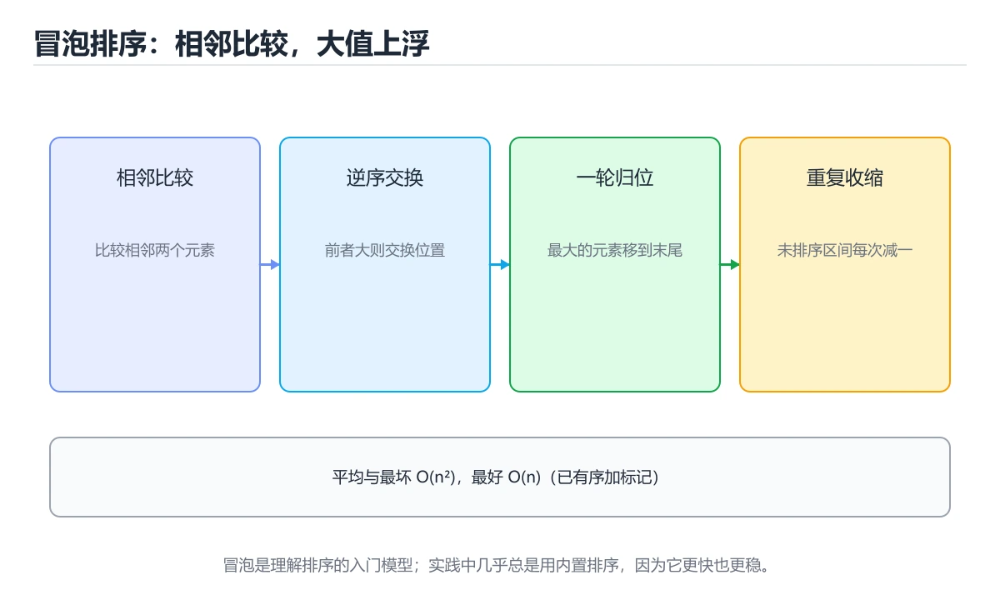
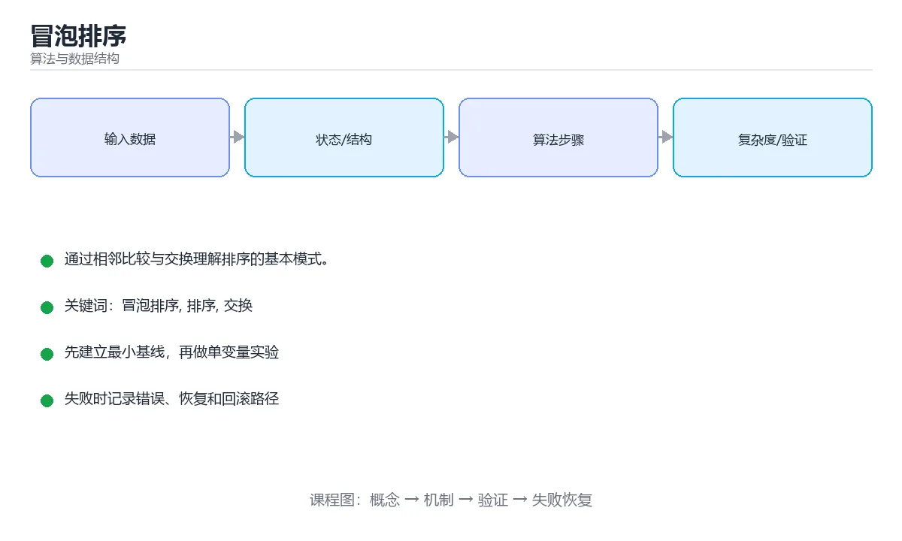

# 冒泡排序





> 内容更新时间：2026-10-06 · 学习阶段：基础 · 预计用时：35 分钟

## 学习目标

- 能用自己的话解释冒泡排序解决了什么问题，而不是只背术语。
- 能说清 冒泡排序、「排序」、「交换」、「稳定性」 之间的关系，并分别举出一个例子。
- 能把 冒泡排序 放回「冒泡排序」的知识体系，说明它和 排序 的边界。
- 能完成本课练习，并用验收标准检查自己的结果。

> 一句话摘要：通过相邻比较与交换理解排序的基本模式。

## 前置知识

- 先完成上一课《二分查找》；如果已经掌握，可以直接用本课练习自测。
- 本课阶段：基础。建议先完成「二分查找」，或确认自己能独立跑通正文里的 bubble_sort_v2 示例。
- 开始前先复习：冒泡排序、排序、交换。
- 卡在 冒泡排序 上时不要跳过：把输入、预期和实际输出写成三行，再回头读正文。

## 核心思想

冒泡排序重复遍历数组，比较相邻两个元素，如果顺序不对就交换。每一轮结束后，最大的元素会像气泡一样「浮」到末尾。

## 手动模拟

```text
初始: 5 3 8 1
第1轮: 3 5 1 8    (8 归位)
第2轮: 3 1 5 8    (5 归位)
第3轮: 1 3 5 8    (3 归位)
```

## 代码实现

```python
def bubble_sort(nums):
    n = len(nums)
    for i in range(n - 1):
        swapped = False
        # 每一轮比较到 n-1-i，后面已经有序
        for j in range(n - 1 - i):
            if nums[j] > nums[j + 1]:
                nums[j], nums[j + 1] = nums[j + 1], nums[j]
                swapped = True
        if not swapped:      # 本轮没有交换，说明已经有序
            break
    return nums

print(bubble_sort([5, 3, 8, 1]))  # [1, 3, 5, 8]
```

## 复杂度分析

| 情况 | 时间复杂度 | 说明 |
| --- | --- | --- |
| 最好 | `O(n)` | 数组本来有序，一轮后提前退出 |
| 平均 | `O(n²)` | 需要约 n²/2 次比较 |
| 最坏 | `O(n²)` | 完全逆序 |
| 空间 | `O(1)` | 只在原数组上交换 |

## 稳定性

当 `nums[j] > nums[j+1]` 时才交换（注意不是 `>=`），相等元素不会互换位置，因此冒泡排序是**稳定排序**。

## 什么时候用它

冒泡排序效率低，实际工程中很少使用。它的价值在于：

- 理解「交换」和「多轮比较」的基本模式。
- 作为教学示例，帮助建立复杂度和稳定性的直觉。

实际排序请使用语言内置实现，例如 Python 的 `sorted()`，它采用 Timsort，平均 `O(n log n)`。

## 本课小结

冒泡排序 = 相邻比较 + 交换 + 提前退出优化。记住它的复杂度是 `O(n²)`。

## 排序算法对照表

| 算法 | 平均 | 最坏 | 空间 | 稳定 | 适用场景 |
| --- | --- | --- | --- | --- | --- |
| 冒泡排序 | O(n²) | O(n²) | O(1) | 是 | 教学、近乎有序的小数组 |
| 插入排序 | O(n²) | O(n²) | O(1) | 是 | 小数组、近乎有序 |
| 选择排序 | O(n²) | O(n²) | O(1) | 否 | 交换次数要求最少 |
| 归并排序 | O(n log n) | O(n log n) | O(n) | 是 | 需要稳定、链表排序 |
| 快速排序 | O(n log n) | O(n²) | O(log n) | 否 | 通用最快，缓存友好 |
| 堆排序 | O(n log n) | O(n log n) | O(1) | 否 | 内存受限、取 TopK |
| 计数/基数排序 | O(n+k) | O(n+k) | O(n+k) | 是 | 整数、范围有限 |

## 冒泡排序实现要点

```python
def bubble_sort(nums):
    """带提前退出与有序区收缩的冒泡排序。"""
    arr = nums[:]                      # 不改原数组
    n = len(arr)
    for end in range(n - 1, 0, -1):    # 每轮确定一个最大值
        swapped = False
        for i in range(end):
            if arr[i] > arr[i + 1]:
                arr[i], arr[i + 1] = arr[i + 1], arr[i]
                swapped = True
        if not swapped:                # 本轮无交换：已经有序
            break
    return arr

assert bubble_sort([5, 1, 4, 2, 8]) == [1, 2, 4, 5, 8]
assert bubble_sort([]) == []
assert bubble_sort([1]) == [1]
```

| 优化 | 收益 |
| --- | --- |
| `swapped` 标记 | 已有序时最好情况降到 O(n) |
| 收缩右边界 | 每轮少比较一次 |
| 记录最后交换位置 | 后面已有序，可一次跳过更多 |
| 鸡尾酒（双向）冒泡 | 缓解「小元素在末尾」的慢速移动 |

## 常见错误与排查

| 容易写错的做法 | 实际现象 | 原因与正确做法 |
| --- | --- | --- |
| 内层循环写成 `range(n)` | 多比较无效元素 | 应为 `range(end)` |
| 比较写成 `>=` | 相等元素被交换，不再稳定 | 用 `>` 保持稳定 |
| 忘写 `swapped` 判断 | 最好情况仍是 O(n²) | 加提前退出 |
| 在函数内直接修改传入列表 | 调用方数据被改 | 需要时先 `nums[:]` 复制 |
| 交换写成 `a = b; b = a` | 值丢失 | 用元组交换或临时变量 |
| 认为冒泡用于生产 | 大数组极慢 | 实际用内置 `sorted` / `sort` |
| 边界处理空数组与单元素 | 越界或多余循环 | 用 `if not arr: return arr` 或循环条件自然处理 |
| 把稳定当成通用性质 | 选择排序并不稳定 | 逐算法确认 |
| 用冒泡排链表 | 指针操作复杂易错 | 链表用归并排序 |
| 忘记验证结果 | 边界用例漏测 | 至少覆盖空、单元素、重复、逆序 |

## 复习与自测

- [ ] 能手写带提前退出的冒泡排序。
- [ ] 知道冒泡最好 O(n)、最坏 O(n²)。
- [ ] 能说出冒泡稳定的原因（相等不交换）。
- [ ] 知道生产环境应使用语言内置排序。
- [ ] 测试覆盖空数组、单元素、重复元素与逆序。

## 补充：两种优化写法与适用场景

### 基础实现与两处优化

```python
def bubble_sort(nums: list[int]) -> list[int]:
    n = len(nums)
    for i in range(n - 1):
        swapped = False
        for j in range(n - 1 - i):        # 优化 1：后面的已排好，不再比较
            if nums[j] > nums[j + 1]:
                nums[j], nums[j + 1] = nums[j + 1], nums[j]
                swapped = True
        if not swapped:                   # 优化 2：本轮无交换说明已有序
            break
    return nums

# 优化 3：记录最后一次交换的位置，缩短下一轮边界
def bubble_sort_v2(nums: list[int]) -> list[int]:
    n = len(nums)
    end = n - 1
    while end > 0:
        last_swap = 0
        for j in range(end):
            if nums[j] > nums[j + 1]:
                nums[j], nums[j + 1] = nums[j + 1], nums[j]
                last_swap = j
        end = last_swap                  # last_swap 之后已经有序
    return nums
```

| 版本 | 已有序数组 | 逆序数组 | 说明 |
| --- | --- | --- | --- |
| 朴素双层循环 | O(n²) | O(n²) | 无法感知已有序 |
| 加提前退出 | **O(n)** | O(n²) | 一趟扫描就能发现有序 |
| 加记录最后交换位置 | O(n) | 接近 O(n²) | 每轮边界快速收缩 |

### 为什么它是稳定的

```text
只有「左边 > 右边」才交换，相等时不交换
  [3a, 3b, 1] → 1 与 3b 交换 → [3a, 1, 3b] → 1 与 3a 交换 → [1, 3a, 3b]
  两个 3 的原始相对顺序保持不变

对比：选择排序不稳定（交换会跨越相等元素），
      插入排序稳定，归并排序稳定，快排通常不稳定
```

### 与插入排序的对比

| 维度 | 冒泡排序 | 插入排序 |
| --- | --- | --- |
| 平均时间 | O(n²) | O(n²) |
| 最好情况 | O(n)（加提前退出） | O(n) |
| 交换次数 | 多（相邻交换，逆序时约 n²/2） | 少（移动而非交换） |
| 近乎有序时 | 尚可 | **更好** |
| 稳定性 | 稳定 | 稳定 |

```text
结论：同样是 O(n²)，插入排序在真实数据上几乎总是更快，
      因为它每次只移动一个元素，而冒泡每次交换要写两次内存。
```

### 为什么教材仍然讲它

```text
① 逻辑最简单：两层循环 + 一次比较交换，容易证明正确性
② 天然稳定：适合讲解「稳定性」这个概念
③ 交换过程可视化：适合做动画演示算法思想
④ 引出优化思路：提前退出、边界收缩都是通用的优化套路
```

### 什么时候真的可以用

| 场景 | 是否合适 | 说明 |
| --- | --- | --- |
| 元素个数 < 10 | 可以 | 开销小，代码简单 |
| 数据近乎有序 | 可以 | 提前退出后接近 O(n) |
| 教学与演示 | 推荐 | 讲解排序与稳定性 |
| 数据量上千 | 不合适 | 换插入排序或 O(n log n) 算法 |
| 数据量上万 | 禁止 | 换快排、归并或语言内置排序 |

```python
# 生产环境的默认选择：用语言内置排序（通常优化过的归并或快排）
nums.sort(key=lambda x: x.score, reverse=True)
```

### 自查清单

- [ ] 能写出带提前退出的版本，并说明最好情况为何是 O(n)
- [ ] 知道「记录最后交换位置」优化了什么
- [ ] 能解释冒泡为什么稳定、选择排序为什么不稳定
- [ ] 知道插入排序在近乎有序数据上更优
- [ ] 清楚生产环境应当直接使用内置排序

## 动手练习

> 本课练习重点：围绕「冒泡排序、排序、交换」完成复述、实验和交付，每个结果都要能被别人检查。

先笔算 排序 的中间状态，再运行程序验证复杂度结论。

### 练习 1：建立心智模型（10 分钟）

合上教程，用 3～5 句话回答：

1. 冒泡排序解决了什么问题？
2. 如果没有它，会出现什么具体后果？
3. 它和「排序」是什么关系？

验收标准：回答里必须出现 冒泡排序，并写出一个让结论失效的边界条件。

### 练习 2：做一次可控实验（20 分钟）

从正文中选一个最小示例，完成以下操作：

1. 先预测修改一个参数、输入或步骤后的结果。
2. 再实际执行或逐步推演，记录真实结果。
3. 如果结果与预测不同，写出差异原因。

**验收标准**：用 bubble_sort_v2 复现原例后，把排序改成边界值，五步记录缺一不可，其中「原因」一栏要写明「冒泡排序」里哪条规则被触发。

### 练习 3：交付一个小结果（30 分钟）

给定 8～12 个手工构造的数据，写出 冒泡排序 每一步的状态并统计操作次数。

任务要求：

- 结果必须能被别人检查，不能只写“我已经理解了”。
- 至少覆盖冒泡排序和「排序」两个关键词。
- 写出 1 个仍然不确定的问题，以及下一步如何验证。

> 提示：时间有限时优先做练习 1 和练习 2；练习 3 可以拆成两次完成。

## 可运行练习

### 任务 1：先跑通，再解释

```python
def bubble_sort(nums):
    n = len(nums)
    for i in range(n - 1):
        swapped = False
        # 每一轮比较到 n-1-i，后面已经有序
        for j in range(n - 1 - i):
            if nums[j] > nums[j + 1]:
                nums[j], nums[j + 1] = nums[j + 1], nums[j]
                swapped = True
        if not swapped:      # 本轮没有交换，说明已经有序
            break
    return nums

print(bubble_sort([5, 3, 8, 1]))  # [1, 3, 5, 8]
```

### 任务 2：只改一个条件

把「冒泡排序」的最小示例复制一份，只改一个条件再跑一次：

- 改动点：只把 冒泡排序 的输入换成空值、极值或错误输入，其余保持不变。
- 预测：先写下「冒泡排序」在改动后的输出或错误信息，再运行。
- 记录：对照改动前后的结果，指出差异出在哪一步。
- 验收：换回原条件能复现原结果，改动只影响冒泡排序。

### 任务 3：迁移到自己的数据

换一个 排序 场景重做一次，确认结论不是只对示例数据成立。

## 故障现场

### 现场 1：内层循环写成 range(n)

**症状**：在《冒泡排序》的复现场景中，多比较无效元素。

**根因**：“多比较无效元素”只是表层结果。向上追溯会落到“内层循环写成 range(n)”这一步，因为它省略了《冒泡排序》的约束，使实现行为和预期模型发生了偏离。

**修复**：针对《冒泡排序》的问题，应为 range(end)。

**验证**：先在《冒泡排序》中记录“内层循环写成 range(n)”留下的失败证据，再执行“应为 range(end)”并重放；确认错误路径变为明确结果，且修复没有掩盖同类故障。

### 现场 2：比较写成 >=

**症状**：在《冒泡排序》的复现场景中，相等元素被交换，不再稳定。

**根因**：“相等元素被交换，不再稳定”只是表层结果。向上追溯会落到“比较写成 >=”这一步，因为它省略了《冒泡排序》的约束，使实现行为和预期模型发生了偏离。

**修复**：针对《冒泡排序》的问题，用 > 保持稳定。

**验证**：保留《冒泡排序》里触发“相等元素被交换，不再稳定”的输入、版本和日志，按“用 > 保持稳定”完成修改后原样重放；只有失败现象消失且相邻场景仍可解释，才保留改动。

### 现场 3：在函数内直接修改传入列表

**症状**：在《冒泡排序》的复现场景中，调用方数据被改。

**根因**：触发点是把“在函数内直接修改传入列表”当成安全做法。它没有满足《冒泡排序》要求的前提，因此先表现为“调用方数据被改”；排查时先完整复现这一段，再核对输入、配置与依赖。

**修复**：针对《冒泡排序》的问题，需要时先 nums[:] 复制。

**验证**：在《冒泡排序》中按“需要时先 nums[:] 复制”调整后，从“在函数内直接修改传入列表”的触发条件重放同一条路径，确认“调用方数据被改”不再出现，并补一个相邻边界用例检查没有引入新问题。

## 本课复习清单

离开本课前，逐项确认：

- [ ] 不看解析，能说出「冒泡排序最坏情况的时间复杂度是？」的判断依据。
- [ ] 不看解析，能说出「加了 swapped 标记后，什么情况下可以提前结束排序？」的判断依据。
- [ ] 不看解析，能说出「冒泡排序是稳定排序的原因是什么？」的判断依据。
- [ ] 不看解析，能说出「带 swapped 优化的冒泡排序，最好情况的时间复杂度是？」的判断依据。
- [ ] 不看解析，能说出「冒泡排序每一轮结束后，哪个位置已经确定？」的判断依据。
- [ ] 至少运行一次 bubble_sort_v2 的示例，记录输入、输出和 冒泡排序 的边界情况。
- [ ] 把本课最容易混淆的两个概念写成一句话对照。

| 复盘项 | 记录 |
| --- | --- |
| 已经能独立解释的考点 |  |
| 仍然说不清的概念 |  |
| 下一步验证动作 |  |

## 术语速查

| 术语 | 一句话说明 |
| --- | --- |
| `冒泡排序` | 冒泡排序 = 相邻比较 + 交换 + 提前退出优化。 |
| `稳定性` | 相等元素在排序前后相对顺序不变；冒泡只在严格逆序时交换，所以是稳定的。 |
| `交换排序` | 通过反复比较相邻元素并交换来消除逆序对的排序思路，冒泡与鸡尾酒排序都属于这一类。 |
| `提前退出` | 某一轮没有发生任何交换就说明序列已经有序，可以直接结束循环。 |

## 考点精讲

### 考点 1：概念判断·冒泡排序

- **题目**：冒泡排序最坏情况的时间复杂度是？
- **判断依据**：完全逆序时需要约 n²/2 次比较和交换，因此是 O(n²)。其他选项：冒泡最坏需要 n-1 轮、每轮 O(n)，因此是 O(n²)。这道题的关键在「冒泡排序」的冒泡排序、排序、交换：先确认题干“冒泡排序最坏情况的时间复杂度是”问的是哪一步，再排除偷换前提的选项。这道题的关键在冒泡排序、排序、交换：先确认题干“最坏情况的时间复杂度是”问的是哪一步，再排除偷换前提的选项。

### 考点 2：多选辨析·冒泡排序

- **题目**：围绕“冒泡排序”中的 冒泡排序、排序、交换，下列哪两项是本课强调的实践判断？
- **判断依据**：题干的正确项是学习 冒泡排序 时要同时说明输入、输出和失败路径，不能只看正常流程。在「冒泡排序」里，验证 排序 时要固定版本并覆盖边界输入，结论才可复现。在「冒泡排序」里判断这道题，要把冒泡排序、排序、交换的条件、过程与失败路径逐项对齐，换成“围绕冒泡排序中的 冒泡排序、排序、交”这个场景，只有满足前提的结论才成立。

### 考点 3：概念判断·冒泡排序

- **题目**：冒泡排序是稳定排序的原因是什么？
- **判断依据**：在「冒泡排序」里，题干的正确项是只在相邻元素严格逆序时才交换。严格大于才交换，相等元素保持原有相对顺序，因此是稳定排序。这道题的关键在「冒泡排序」的冒泡排序、排序、交换：先确认题干“冒泡排序是稳定排序的原因是什么”问的是哪一步，再排除偷换前提的选项。这道题的关键在冒泡排序、排序、交换：先确认题干“是稳定排序的原因是什么”问的是哪一步，再排除偷换前提的选项。

### 考点 4：概念判断·冒泡排序

- **题目**：带 swapped 优化的冒泡排序，最好情况的时间复杂度是？
- **判断依据**：第一轮没有发生交换就说明已经有序，可以立即结束。其他选项：已有序时第一轮就无交换，只需 O(n) 次比较即可结束，这正是 swapped 优化的价值。在「冒泡排序」里，这道题要求区分概念与边界，「O(n)」只有在题干给出的前提下才成立，而「O(n log n)」、「O(n²)」缺少同一组条件。

### 考点 5：代码补全·冒泡排序

- **题目**：下面这段 Python 代码摘自「冒泡排序」的正文示例。关于这段代码，下面哪一项说法与实际内容相符？
- **判断依据**：在「冒泡排序」里，题干的正确项是这段代码只做静态声明，没有循环、分支或可观察输出，在「冒泡排序」里它只能证明冒泡排序相关约束存在，不能替代真实运行证据。把输入或边界换成空值、极值或失败情况后，结论要以「冒泡排序」的实际运行结果为准。回到「冒泡排序」的正文示例，用“下面这段 Python 代码摘自冒泡”走一遍冒泡排序、排序、交换的完整流程，能复现的结论才可以保留。回到正文示例，用“下面这段”走一遍冒泡排序、排序、交换的完整流程，能复现的结论才可以保留。

### 考点 6：填空·冒泡排序

- **题目**：补全代码：「冒泡排序」示例中，下面这行代码缺少哪个关键字或函数名？请填入 ____。 `assert ____([5, 1, 4, 2, 8]) == [1, 2, 4, 5, 8]`
- **判断依据**：空格应填写「bubble_sort」。把“bubblesort”代回「冒泡排序」里“冒泡排序示例中”的例子核对，条件一旦改变，结论就要用冒泡排序、排序、交换重新推导。回到冒泡排序、排序、交换本身再看一遍：只有“bubblesort”与题干“bubblesort”的前提一致，结论才成立。

## English Overview

**Title:** Bubble Sort

**Summary:** Adjacent compare-and-swap, the classic sorting pattern.

**Category:** Algorithms
**Level:** 进阶
**Key terms:** 冒泡排序, 排序, 交换, 稳定性, O(n²)

## 内容元数据

- 内容版本：v2.0
- 最后更新：2026-10-06
- 学习阶段：基础
- 适用环境：任意主流语言（伪代码与复杂度为主）
；本课聚焦 冒泡排序。
- 内容来源：内置结构化课程与工程实践整理
- 相关主题：冒泡排序、排序、交换、稳定性、O(n²)
- 质量版本：P0 测验标准 + P1 覆盖扩展 + P2 体验补全

## 参考资料与复核

- 最后复核：2026-10-04
- 下次复核：2027-05-17
- 复核范围：版本兼容、API 行为、安全建议与工程实践
- 来源性质：官方文档、标准或权威教材；正文为离线教学重组

| 参考资料 | 本课用途 |
| --- | --- |
| [CP-Algorithms](https://cp-algorithms.com/) | 算法实现与复杂度 |
| [MIT 6.006](https://ocw.mit.edu/courses/6-006-introduction-to-algorithms-spring-2020/) | 算法设计与分析 |
| [Princeton Algorithms](https://algs4.cs.princeton.edu/home/) | 经典算法与数据结构教材 |

> 「冒泡排序」的链接用于离线阅读后的延伸核对；App 不会自动联网。

<!-- p1-deep-dive:start -->
## 深挖「冒泡排序」的边界与代价

这一章只用「冒泡排序」自己的正文、代码和测验题，把冒泡排序推到边界再看一遍：先确认它在什么条件下成立，再估计代价，最后给出可复现的证据。

### 一、冒泡排序 的关键句与适用条件

| 正文出处 | 原句 | 用之前先确认 |
| --- | --- | --- |
| 核心思想 | 冒泡排序重复遍历数组，比较相邻两个元素，如果顺序不对就交换。 | 把 冒泡排序 换成边界值时，这一步是否仍然成立 |
| 稳定性 | 当 nums[j] > nums[j+1] 时才交换（注意不是 >=），相等元素不会互换位置，因此冒泡排序是稳定排序。 | 把 冒泡排序 换成边界值时，这一步是否仍然成立 |
| 什么时候用它 | 冒泡排序效率低，实际工程中很少使用。 | 把 冒泡排序 换成边界值时，这一步是否仍然成立 |
| 什么时候用它 | 理解「交换」和「多轮比较」的基本模式。 | 把 交换 换成边界值时，这一步是否仍然成立 |
| 什么时候用它 | 作为教学示例，帮助建立复杂度和稳定性的直觉。 | 把 稳定性 换成边界值时，这一步是否仍然成立 |

读这张表时不要只记结论：每一句都要问「把冒泡排序换成边界值还成立吗」。如果第二列的原句里已经写明前提，第三列就写成「前提不变」；如果原句省略了前提，第三列必须补出来。

### 二、把 冒泡排序 推到边界

下面是本课第一段代码（text），先原样运行一次作为基线：

```text
初始: 5 3 8 1
第1轮: 3 5 1 8    (8 归位)
第2轮: 3 1 5 8    (5 归位)
第3轮: 1 3 5 8    (3 归位)
```

| 变式 | 怎么改 | 先写下什么 | 观察点 |
| --- | --- | --- | --- |
| 边界输入 | 把 冒泡排序 的输入换成空值或最大值 | 预测输出 | 是否报错、是否静默返回 |
| 只改一处 | 把 冒泡排序 的一个参数改成另一档 | 预测差异来源 | 输出变化能否用本课结论解释 |
| 去掉一步 | 注释掉 冒泡排序 之后的一行 | 预测哪一步先失败 | 错误位置是否与预期一致 |

三次实验都要保留「原例 → 改动 → 预测 → 结果 → 原因」五步记录；其中「原因」必须引用「冒泡排序」正文里的结论，而不是只写「正常」或「报错」。

### 三、「冒泡排序」的代价怎么量

| 观察项 | 怎么测 | 结论怎么写 |
| --- | --- | --- |
| 时间 | 把 冒泡排序 的输入规模翻倍，记录耗时变化 | 写出增长是线性、对数还是常数，并给出实测数据 |
| 空间 | 记录 排序 占用的内存或存储峰值 | 说明峰值出现在哪一步，以及能否提前释放 |
| 可读性 | 统计完成同一件事需要多少行代码或多少步操作 | 用具体行数代替「更简洁」这类主观描述 |
| 失败代价 | 触发一次失败，记录恢复所需步骤 | 写清失败后是否有残留状态、如何回滚 |

如果在「冒泡排序」里量不出上表的任何一项，说明实验还停留在阅读层面：先把输入规模翻倍，再回来填表。

### 四、测验复盘

| 题号 | 正确答案 | 最容易选错的干扰项 | 复盘动作 |
| --- | --- | --- | --- |
| 1 | O(n²) | O(n) | 把干扰项改写成一句反例，再说明它违反本课哪条前提 |
| 2 | 学习 冒泡排序 时要同时说明输入、输出和失败路径，不能只看正常流程 | 把 排序 的单次运行结果当成所有版本和规模都成立 | 把干扰项改写成一句反例，再说明它违反本课哪条前提 |
| 3 | 只在 nums[j] > nums[j+1] 时交换，相等元素不互换… | 每轮都从头开始（混淆了相邻概念，也没有覆盖题干给出的全部条件） | 把干扰项改写成一句反例，再说明它违反本课哪条前提 |
| 4 | O(n) | O(n log n) | 把干扰项改写成一句反例，再说明它违反本课哪条前提 |
| 5 | 这段代码只做静态声明，没有循环、分支或可观察输出。 | 这段代码包含异常处理分支，失败时会走专门的补救路径。 | 把干扰项改写成一句反例，再说明它违反本课哪条前提 |
| 6 | 0 | （无干扰项） | 把干扰项改写成一句反例，再说明它违反本课哪条前提 |

复盘「冒泡排序」时只写「我记住了」没有意义：每个错误选项都要能对应到本课的一条前提，写完后再回到第一节的关键句表核对一次。

### 五、离开本课前的自检

- [ ] 能用一句话说明 冒泡排序 解决什么问题、在什么条件下失效。
- [ ] 能指出 排序 与相邻概念的分工，并各举一个反例。
- [ ] 能在不看解析的情况下重做本课测验，并解释冒泡排序中每个错误选项。
- [ ] 能按第二节的表格完成至少两次 冒泡排序 实验，并留下命令与输出。
- [ ] 能写出「冒泡排序」的三条结论，每条都配一个适用边界。

全部勾选后，再去做「冒泡排序」的测验与练习；只要有一项答不上来，就回到对应小节补一次实验，而不是先背结论。
<!-- p1-deep-dive:end -->
