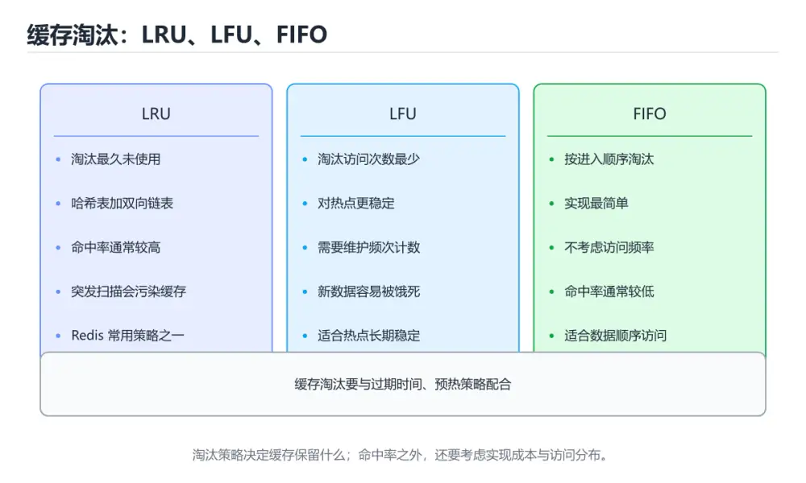
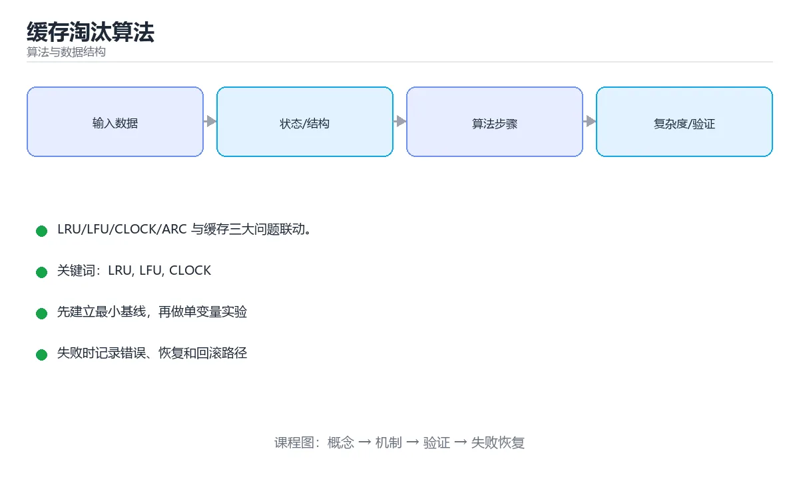

# 缓存淘汰算法





> 内容更新时间：2026-10-06 · 学习阶段：进阶 · 预计用时：40 分钟

## 本节知识框架

**课程定位**：所属分类为「算法与数据结构」，课程主题为「缓存淘汰算法」，学习阶段为「进阶」，建议用时 40 分钟。

**本课要解决的主问题**：LRU/LFU/CLOCK/ARC 与缓存三大问题联动。

| 学习层次 | 要回答的问题 | 完成判据 |
| --- | --- | --- |
| 概念层 | 「缓存淘汰算法」有哪些必须区分的对象与术语？ | 能用自己的话定义核心术语，并各举一个正例和一个反例。 |
| 机制层 | 这些对象按什么顺序发生作用，输入如何变成输出？ | 能画出或写出机制步骤，并说明每一步的失败条件。 |
| 应用层 | 什么场景适合使用「缓存淘汰算法」，什么场景不适合？ | 能给出一个真实场景、一个最小示例和一个边界案例。 |
| 性能层 | 时间、空间、吞吐或延迟受哪些量影响？ | 能说出复杂度或性能瓶颈的证据来源；没有证据时明确写“材料未提供”。 |
| 复习层 | 怎样确认自己不是只记住了结论？ | 能独立完成本课自测，并把错误定位到概念、机制、示例或边界。 |

### 阅读路线

1. 先读「核心概念定义」，建立「LRU」等对象的精确定义。
2. 再读「原理与运行机制」，把定义串成可重复的过程。
3. 用「代码/协议/SQL 示例」验证过程，并只改一个条件观察结果变化。
4. 最后检查性能、易错点、知识关系与自测题，形成可复习的证据链。

**前置知识**：《基数排序、桶排序与外部排序》

**学习位置**：本课位于《基数排序、桶排序与外部排序》之后；如果前一课的自测不能通过，应先回补再继续。

**后续衔接**：下一课《实战：把数据结构用起来》会继续使用本课术语，学完后建议立即完成一次自测。

**教材衔接：学习目标**

- 能用自己的话解释缓存淘汰算法解决了什么问题，而不是只背术语。
- 能说清 「LRU」、「LFU」、「CLOCK」、「Redis」 之间的关系，并分别举出一个例子。
- 能把 LRU 放回「缓存淘汰算法」的知识体系，说明它和 LFU 的边界。
- 能完成本课练习，并用验收标准检查自己的结果。

> 一句话摘要：LRU/LFU/CLOCK/ARC 与缓存三大问题联动。

**教材衔接：前置知识**

- 先完成上一课《基数排序、桶排序与外部排序》；如果已经掌握，可以直接用本课练习自测。
- 开始前先复习：LRU、LFU、CLOCK。
- 卡在 LRU 上时不要跳过：把输入、预期和实际输出写成三行，再回头读正文。

**教材衔接：本课小结**

通用场景用 LRU/CLOCK，有稳定热点用 LFU，有扫描流量用 2Q/ARC；再配合 TTL 抖动与多级缓存保证稳定性。

## 核心概念定义

> 阅读约定：本课先给「缓存淘汰算法」相关术语的操作性定义与适用边界；正文里的口语化说法与定义冲突时，以定义和可复现示例为准。

| 术语 | 操作性定义 | 本课中的边界 |
| --- | --- | --- |
| LRU | noeviction（拒绝写入）、allkeys-lru / allkeys-lfu、volatile-lru（只淘汰带过期时间的 key）、random、ttl（优先淘汰即将过期）。 | 仅在「缓存淘汰算法」明确给出的输入、版本与资源条件下成立。 |
| CLOCK | 新闻首页缓存适合 LRU 加短 TTL；商品详情缓存适合 LFU 或带衰减的热度模型；数据库页缓存常用 CLOCK 近似 LRU。 | 仅在「缓存淘汰算法」明确给出的输入、版本与资源条件下成立。 |
| Redis | 多级缓存（本地 + Redis + 数据库）能大幅降低后端压力，但必须处理一致性：常用「先更新数据库再删除缓存」，并用消息或 binlog 补偿。 | 仅在「缓存淘汰算法」明确给出的输入、版本与资源条件下成立。 |
| 缓存穿透 | 请求持续查询不存在的数据，导致缓存无法命中并把压力全部打到后端。 | 仅在「缓存淘汰算法」明确给出的输入、版本与资源条件下成立。 |

### 定义如何使用

在「缓存淘汰算法」中判断一个说法是否成立，先确认它使用的是哪个对象的定义，再检查输入规模、运行环境与失败路径。定义不是口号，而是后续推导、代码示例和自测题共享的约束。

## 原理与运行机制

### 机制总览

1. **建立输入**：把「LRU」按本课定义整理成可观察、可重复的输入条件。
2. **执行转换**：围绕「CLOCK」执行本课的核心步骤；每一步都记录中间状态，避免只看最终输出。
3. **产生输出**：得到「Redis」后，用正文示例或协议/SQL 结果核对输出是否符合预期。
4. **改变一个条件**：只替换一个边界条件或环境参数，观察「缓存淘汰算法」的结论是否仍然成立。

| 阶段 | 关注对象 | 失败时应检查 |
| --- | --- | --- |
| 输入 | LRU | 类型、范围、编码、版本或前置状态是否满足定义。 |
| 处理 | CLOCK | 顺序、可见性、锁、路由、事务或调度规则是否被破坏。 |
| 输出 | Redis | 结果是否可复现，错误是否被正确传播而不是被吞掉。 |

本课的机制结论要用「缓存淘汰算法」自己的示例验证。「缓存淘汰算法」没有给出某个数量级、吞吐或内存数据时，本课把该判断标为“材料未提供”，不从相邻主题外推。

**教材衔接：常见策略**

| 算法 | 思想 | 问题 |
| --- | --- | --- |
| FIFO | 淘汰最早进入的 | 忽略访问频率 |
| LRU | 淘汰最久未使用的 | 突发扫描会污染缓存 |
| LFU | 淘汰访问次数最少的 | 新数据难积累计数，需衰减 |
| CLOCK | 环形 + 访问位近似 LRU | 实现简单，Linux 页缓存采用 |
| 2Q / ARC | 冷热分区 + 自适应容量 | 抗扫描，实现较复杂 |

**教材衔接：LRU 的高效实现**

哈希表（O(1) 定位）+ 双向链表（O(1) 移动与删除）：命中时把节点移到表头，插入超容量时删除表尾。Redis 的近似 LRU 用**随机采样**若干 key 淘汰其中最久未用的，以节省链表开销。

**教材衔接：Redis 淘汰策略**

noeviction（拒绝写入）、allkeys-lru / allkeys-lfu、volatile-lru（只淘汰带过期时间的 key）、random、ttl（优先淘汰即将过期）。选择依据是数据能否重建以及是否有明显冷热区分。

**教材衔接：如何衡量**

关注命中率、平均延迟与回源 QPS；压测要覆盖真实访问分布（含热点比例），均匀随机访问无法体现 LRU 的价值。

## 典型应用场景

| 场景 | 典型输入或前提 | 期望产物 |
| --- | --- | --- |
| 学习验证 | 使用本课最小示例和 LRU、LFU | 能复现正文结论，并解释每一步。 |
| 工程落地 | 把「缓存淘汰算法」放入真实模块或服务边界 | 输出可观测、失败可定位、参数可配置。 |
| 故障排查 | 只改一个版本、规模、输入或依赖条件 | 能区分概念错误、实现错误和环境差异。 |

判断「缓存淘汰算法」的场景是否成立，标准是能否写出输入、处理、输出和失败路径；材料中没有出现的数据在本课标注为“材料未提供”，不用推测替代证据。

**课程内置实验入口**：`interactive`，用于动手验证《缓存淘汰算法》的机制；实验结论不替代概念定义与复杂度分析。

## 代码/协议/SQL 示例

### 最小可验证示例

下面保留《缓存淘汰算法》原文中的最小示例。先预测《缓存淘汰算法》示例的输出，再按正文步骤运行或推演；示例依赖外部环境时，同时记录版本与输入。

```python
from collections import OrderedDict

class LRUCache:
    """哈希表 + 双向链表：查询与更新都是 O(1)。"""

    def __init__(self, capacity: int):
        if capacity <= 0:
            raise ValueError("容量必须为正")
        self.capacity = capacity
        self.data = OrderedDict()
        self.hits = self.misses = 0

    def get(self, key):
        if key not in self.data:
            self.misses += 1
            return None
        self.data.move_to_end(key)          # 标记为最近使用
        self.hits += 1
        return self.data[key]

    def put(self, key, value) -> None:
        if key in self.data:
            self.data.move_to_end(key)
        self.data[key] = value
        if len(self.data) > self.capacity:
            self.data.popitem(last=False)   # 淘汰最久未使用

    def hit_rate(self) -> float:
        total = self.hits + self.misses
        return 0.0 if total == 0 else self.hits / total

def lru_cache_demo(func):
    """用 functools.lru_cache 做记忆化：注意参数必须可哈希。"""
    from functools import lru_cache
    cached = lru_cache(maxsize=128)(func)
    return cached
```

**教材衔接：LRU 模板**

```python
from collections import OrderedDict

class LRUCache:
    """哈希表 + 双向链表：查询与更新都是 O(1)。"""

    def __init__(self, capacity: int):
        if capacity <= 0:
            raise ValueError("容量必须为正")
        self.capacity = capacity
        self.data = OrderedDict()
        self.hits = self.misses = 0

    def get(self, key):
        if key not in self.data:
            self.misses += 1
            return None
        self.data.move_to_end(key)          # 标记为最近使用
        self.hits += 1
        return self.data[key]

    def put(self, key, value) -> None:
        if key in self.data:
            self.data.move_to_end(key)
        self.data[key] = value
        if len(self.data) > self.capacity:
            self.data.popitem(last=False)   # 淘汰最久未使用

    def hit_rate(self) -> float:
        total = self.hits + self.misses
        return 0.0 if total == 0 else self.hits / total

def lru_cache_demo(func):
    """用 functools.lru_cache 做记忆化：注意参数必须可哈希。"""
    from functools import lru_cache
    cached = lru_cache(maxsize=128)(func)
    return cached
```

## 时间/空间复杂度或性能分析

**复杂度证据**：本课正文出现 `O(1)` 等量级表达式；使用前要同时确认输入规模、最好/平均/最坏情况以及常数项来源。

| 维度 | 本课关注点 | 判断依据 |
| --- | --- | --- |
| 时间/延迟 | 「缓存淘汰算法」的主要步骤是否会随输入规模、并发度或网络往返增长。 | 以正文复杂度、基准数据或可重复测量为准。 |
| 空间/内存 | 中间状态、缓存、副本、连接或索引是否随规模增长。 | 记录峰值内存与数据副本，不只看最终结果。 |
| 吞吐/资源 | 版本、调度、锁、IO、序列化或协议开销是否成为瓶颈。 | 固定环境做对照实验，改变一个变量。 |

评估「缓存淘汰算法」时要区分“正确性成立”和“性能达标”两件事；材料没有给出基准时，本课只保留量级来源与测量方法，不写不可验证的绝对数字。

**教材衔接：与缓存三大问题联动**

穿透（查询不存在的数据）用空值缓存 + 布隆过滤器；击穿（热点 key 失效瞬间涌入）用互斥重建或逻辑过期；雪崩（大量 key 同时过期）用过期时间加随机抖动与多级缓存。

多级缓存（本地 + Redis + 数据库）能大幅降低后端压力，但必须处理一致性：常用「先更新数据库再删除缓存」，并用消息或 binlog 补偿。

**教材衔接：缓存问题与对策速查**

| 问题 | 现象 | 对策 |
| --- | --- | --- |
| 缓存穿透 | 查询根本不存在的数据 | 缓存空值、布隆过滤器、参数校验 |
| 缓存击穿 | 热点 key 失效瞬间压到下游 | 互斥重建、逻辑过期、热点不过期 |
| 缓存雪崩 | 大量 key 同时失效 | 过期时间加随机、多级缓存、限流 |
| 缓存污染 | 全表扫描挤掉热点 | 用 2Q / LRU-K / TinyLFU |
| 惊群 | 大量线程同时重建同一 key | 单飞（singleflight）|
| 数据不一致 | 缓存与数据库不同步 | 先更新库再删缓存 + 延迟双删 + 重试 |

**教材衔接：深入补充：缓存淘汰算法**

前面已经建立了基本概念。这一节换一个角度，把缓存淘汰算法放进真实工程里，
重点回答三件事：ValueError 解决什么问题、依赖哪些前提、在什么条件下失效。

### 一、核心模型

缓存淘汰算法在容量有限时决定保留哪些数据，目标是在命中率、实现复杂度、并发开销和业务价值之间取平衡；没有一种策略适合所有访问模式。

```text
请求到达 → 查找缓存 → 命中返回/未命中回源 → 写入缓存 → 容量超限触发淘汰 → 更新统计与热度
```

### 二、关键机制拆解

1. FIFO 按进入顺序淘汰，实现简单但不考虑使用频率，容易淘汰热点数据。
2. LRU 淘汰最久未使用数据，适合时间局部性强的场景，但链表更新需要并发保护。
3. LFU 按访问频率淘汰，能保留长期热点，但新数据冷启动困难且需要频率衰减。
4. CLOCK 用引用位近似 LRU，开销低，常用于操作系统页缓存。
5. TTL 和容量限制解决不同问题：TTL 控制新鲜度，容量控制内存占用。
6. 淘汰策略必须与回源、预热、雪崩保护和监控配合，否则命中率提升有限。
7. 缓存击穿、穿透和雪崩分别对应热点失效、查不存在数据和大量同时失效。

### 三、对照表：抓住容易混淆的边界

| 维度 | 一侧 | 另一侧 |
| --- | --- | --- |
| FIFO | 按进入时间淘汰 | 实现简单但忽略热度 |
| LRU | 按最近使用时间淘汰 | 适合时间局部性强的负载 |
| LFU | 按访问频率淘汰 | 适合稳定热点但更新复杂 |
| CLOCK | 用引用位近似 LRU | 开销低，适合内核和嵌入式 |

### 四、工作示例

新闻首页缓存适合 LRU 加短 TTL；商品详情缓存适合 LFU 或带衰减的热度模型；数据库页缓存常用 CLOCK 近似 LRU。选择前先测量访问分布，而不是直接照搬默认策略。

### 五、常见误区与失效边界

| 错误做法或假设 | 后果 | 正确做法 |
| --- | --- | --- |
| 缓存所有数据 | 内存被冷数据占满 | 按价值和热度设置准入策略 |
| TTL 随机设置 | 大量键同时失效导致雪崩 | 加随机抖动并做预热 |
| 热点失效后所有请求回源 | 数据库被击穿 | 使用互斥重建、逻辑过期或单飞机制 |
| 只追求命中率 | 缓存污染和内存成本上升 | 同时观察回源量、延迟和成本 |

### 六、场景推演

电商大促期间热点商品缓存同时过期，数据库 QPS 瞬间飙升。解决方案是给 TTL 加随机偏移，热点键逻辑过期后只允许一个请求重建，其余请求返回旧值并异步刷新。

### 七、自测问答

**Q1：LRU 和 LFU 的核心差异是什么？**

LRU 看最近是否使用，LFU 看使用频率。

**Q2：CLOCK 为什么开销低？**

它用引用位近似 LRU，不需要维护完整访问链表。

**Q3：TTL 和容量淘汰分别解决什么问题？**

TTL 控制数据新鲜度，容量淘汰控制内存占用。

**Q4：缓存雪崩如何避免？**

给过期时间加随机抖动，并做预热、限流和降级。

### 八、小项目：把知识变成可检查的产出

实现 FIFO、LRU、LFU 三种缓存，使用同一组访问序列比较命中率和耗时；再模拟一次热点同时过期，验证加随机 TTL 和单飞重建后的回源量变化。

### 九、适用边界

淘汰算法只决定保留什么，不能保证数据正确和最新。缓存一致性、持久化、并发更新和故障恢复需要单独的协议与监控。

### 十、完成检查清单

- [ ] 能比较 FIFO、LRU、LFU、CLOCK 的取舍
- [ ] 能根据访问分布选择淘汰策略
- [ ] 能设计 TTL 抖动和预热方案
- [ ] 能区分击穿、穿透和雪崩
- [ ] 能监控命中率、回源量和内存成本

### 十一、复习顺序

1. 合上教程复述 LRU，确认能说出它解决的三个问题。
2. 再对照表逐行解释容易混淆的概念，每个概念补一个反例。
3. 跟着工作示例做一遍，改变一个条件并预测结果。
4. 用自测问答检查理解，错题回到对应小节重新阅读。
5. 最后完成 LRU 的小项目，把结果、失败记录和复查清单整理成可提交产物。

> 复习不是重读一遍，而是离开原文重新产出：复述、改写、验证、复盘。

## 常见误区与易错点

> 复核《缓存淘汰算法》的易错点时，优先保留原文的错误表、故障现场与排错路径；每条修正都要能用本课示例复验。

| 易错点 | 常见表现 | 正确做法 |
| --- | --- | --- |
| 只背结论 | 能复述「缓存淘汰算法」的定义，却说不清输入、输出与边界。 | 回到机制步骤，用最小示例逐一验证。 |
| 混淆相邻概念 | 把本课对象与相邻主题的对象当成同一类。 | 先比较定义、资源归属、生命周期和失败模式。 |
| 忽略版本与环境 | 在开发机通过后直接外推到生产环境。 | 固定版本、输入和资源条件，再记录可复现结果。 |

**教材衔接：常见错误与排查**

| 容易写错的做法 | 实际现象 | 原因与正确做法 |
| --- | --- | --- |
| 容量为 0 或负数 | 无法缓存或异常 | 初始化时校验容量 |
| `get` 命中后不更新位置 | 退化成 FIFO | 命中要移动到最近使用位置 |
| 淘汰时删错端 | 淘汰了热点 | 明确哪端是「最久未使用」 |
| 认为 LRU 一定最优 | 扫描型负载命中率骤降 | 依负载选 LRU-K / TinyLFU |
| 无监控命中率 | 无法判断缓存效果 | 记录命中率与淘汰次数 |
| 大对象进同一缓存 | 挤掉大量小对象 | 分开缓存池或按权重计数 |
| 用可变对象作缓存键 | 查不到或误命中 | 键必须可哈希且稳定 |
| 缓存里存可变对象引用 | 外部修改污染缓存 | 存副本或不可变对象 |
| 过期时间统一 | 同一时刻集体失效 | 加随机抖动 |
| 重建时不加锁 | 惊群、下游被打爆 | 单飞或互斥重建 |

**教材衔接：故障现场**

### 现场 1：容量为 0 或负数

**症状**：在《缓存淘汰算法》的复现场景中，无法缓存或异常。

**根因**：“无法缓存或异常”只是表层结果。向上追溯会落到“容量为 0 或负数”这一步，因为它省略了《缓存淘汰算法》的约束，使实现行为和预期模型发生了偏离。

**修复**：针对《缓存淘汰算法》的问题，初始化时校验容量。

**验证**：先在《缓存淘汰算法》中记录“容量为 0 或负数”留下的失败证据，再执行“初始化时校验容量”并重放；确认错误路径变为明确结果，且修复没有掩盖同类故障。

### 现场 2：get 命中后不更新位置

**症状**：在《缓存淘汰算法》的复现场景中，退化成 FIFO。

**根因**：触发点是把“get 命中后不更新位置”当成安全做法。它没有满足《缓存淘汰算法》要求的前提，因此先表现为“退化成 FIFO”；排查时先完整复现这一段，再核对输入、配置与依赖。

**修复**：针对《缓存淘汰算法》的问题，命中要移动到最近使用位置。

**验证**：先在《缓存淘汰算法》中记录“get 命中后不更新位置”留下的失败证据，再执行“命中要移动到最近使用位置”并重放；确认错误路径变为明确结果，且修复没有掩盖同类故障。

### 现场 3：认为 LRU 一定最优

**症状**：在《缓存淘汰算法》的复现场景中，扫描型负载命中率骤降。

**根因**：当出现“认为 LRU 一定最优”时，执行路径已经绕过了《缓存淘汰算法》的关键约束，最终以“扫描型负载命中率骤降”暴露出来；修复前必须先确认约束在哪里失效。

**修复**：针对《缓存淘汰算法》的问题，依负载选 LRU-K / TinyLFU。

**验证**：在《缓存淘汰算法》中按“依负载选 LRU-K / TinyLFU”调整后，从“认为 LRU 一定最优”的触发条件重放同一条路径，确认“扫描型负载命中率骤降”不再出现，并补一个相邻边界用例检查没有引入新问题。

## 与其他知识点的关系

| 关系 | 课程 | 为什么 |
| --- | --- | --- |
| 先修 | 《基数排序、桶排序与外部排序》 | 本课会直接使用它的概念或操作前提。 |
| 关联 | 《实战：把数据结构用起来》 | 用于横向比较或把本课结论迁移到相邻主题。 |
| 关联 | 《Redis 实战》 | 用于横向比较或把本课结论迁移到相邻主题。 |
| 前置顺序 | 《基数排序、桶排序与外部排序》 | 同分类中安排在本课之前，建议先完成其自测。 |
| 后续顺序 | 《实战：把数据结构用起来》 | 同分类中安排在本课之后，会继续使用本课术语。 |

把「缓存淘汰算法」放回知识体系时，不只要记住“前面学过什么”，还要说明两个主题在输入、机制、资源边界和失败模式上的差异。这样才能把单课知识迁移到项目、排障和后续课程。

**教材衔接：淘汰策略对照**

| 策略 | 淘汰依据 | 优点 | 缺点 |
| --- | --- | --- | --- |
| FIFO | 最早进入 | 实现最简单 | 可能淘汰热点数据 |
| LRU | 最久未使用 | 贴合时间局部性 | 突发扫描会污染缓存 |
| LFU | 使用频率最低 | 保护长期热点 | 新数据难以上位，需老化 |
| LRU-K | 第 K 次最近使用 | 抗扫描 | 实现复杂 |
| CLOCK | 环形指针 + 访问位 | 近似 LRU，开销小 | 精度略低 |
| 2Q | 两个队列 | 抗扫描 | 参数需调 |
| TTL + 随机 | 过期时间 | 简单有效 | 命中率不稳定 |

## 自测题与参考答案

> 先独立作答《缓存淘汰算法》的自测题，再对照答案与解析；每处判断都要能在本课正文或示例中找到依据。

### 自测 1

下面这段 Python 代码摘自「缓存淘汰算法」的正文示例。关于这段代码，下面哪一项说法与实际内容相符？

```python
from collections import OrderedDict

class LRUCache:
    """哈希表 + 双向链表：查询与更新都是 O(1)。"""

    def __init__(self, capacity: int):
        if capacity <= 0:
            raise ValueError("容量必须为正")
        self.capacity = capacity
        self.data = OrderedDict()
        self.hits = self.misses = 0

    def get(self, key):
        if key not in self.data:
            self.misses += 1
            return None
        self.data.move_to_end(key)          # 标记为最近使用
        self.hits += 1
        return self.data[key]

    def put(self, key, value) -> None:
        if key in self.data:
            self.data.move_to_end(key)
        self.data[key] = value
        if len(self.data) > self.capacity:
            self.data.popitem(last=False)   # 淘汰最久未使用

    def hit_rate(self) -> float:
        total = self.hits + self.misses
        return 0.0 if total == 0 else self.hits / total

def lru_cache_demo(func):
    """用 functools.lru_cache 做记忆化：注意参数必须可哈希。"""
    from functools import lru_cache
    cached = lru_cache(maxsize=128)(func)
    return cached
```

A. 这段代码只做静态声明，没有循环、分支或可观察输出。
B. 这段代码包含循环结构，同一段逻辑会被重复执行。
C. 这段代码包含异常处理分支，失败时会走专门的补救路径。
D. 这段代码把主要逻辑封装在函数或方法里，需要被调用才会执行。

**参考答案**：这段代码把主要逻辑封装在函数或方法里，需要被调用才会执行。

**解析**：在「缓存淘汰算法」里，题干的正确项是这段代码把主要逻辑封装在函数或方法里，需要被调用才会执行，在「缓存淘汰算法」里封装边界决定LRU从哪一步开始生效。把输入或边界换成空值、极值或失败情况后，结论要以「缓存淘汰算法」的实际运行结果为准。把“这段代码把主要逻辑封装在函数或方法里”代回「缓存淘汰算法」里“下面这段 Python 代码摘自缓存淘汰算法的正文示例关于这”的例子核对，条件一旦改变，结论就要用LRU、LFU、CLOCK重新推导。

### 自测 2

缓存雪崩的常见防护是？

A. 统一设置相同过期时间，但这并不能根治泄漏
B. 过期时间加随机抖动 + 多级缓存
C. 关闭缓存
D. 加大 key 长度

**参考答案**：过期时间加随机抖动 + 多级缓存

**解析**：在「缓存淘汰算法」里，过期时间加随机抖动 + 多级缓存。避免大量 key 同时失效，并用本地缓存兜底。在「缓存淘汰算法」里判断这道题，要把LRU、LFU、CLOCK的条件、过程与失败路径逐项对齐，换成“缓存雪崩的常见防护是”这个场景，只有满足前提的结论才成立。回到「缓存淘汰算法」的正文示例，用“缓存雪崩的常见防护是”走一遍LRU、LFU、CLOCK的完整流程，能复现的结论才可以保留。

### 自测 3

围绕“缓存淘汰算法”中的 LRU、LFU、CLOCK，下列哪两项是本课强调的实践判断？

A. 验证 LFU 时要固定版本并覆盖边界输入，结论才可复现
B. 把 LFU 的单次运行结果当成所有版本和规模都成立
C. 学习 LRU 时要同时说明输入、输出和失败路径，不能只看正常流程
D. 只要 LRU 的常规示例通过，就可以跳过边界与异常路径

**参考答案**：验证 LFU 时要固定版本并覆盖边界输入，结论才可复现；学习 LRU 时要同时说明输入、输出和失败路径，不能只看正常流程

**解析**：本课把缓存淘汰算法拆成概念、示例与故障现场三部分，因此判断 LRU 时必须同时交代输入、输出和失败路径，这使“学习 LRU 时要同时说明输入、输出和失败路径，不能只看正常流程”成立。在缓存淘汰算法里，判断 LFU 时要固定版本与边界输入，所以“验证 LFU 时要固定版本并覆盖边界输入，结论才可复现”才可复现。

**教材衔接：复习与自测**

- [ ] 能手写 LRU（哈希表 + 双向链表 / OrderedDict）。
- [ ] 能说出 LRU、LFU、CLOCK 的差异与取舍。
- [ ] 会区分穿透、击穿、雪崩并给出对策。
- [ ] 缓存键可哈希、值不可变或已拷贝。
- [ ] 监控命中率并按负载选择淘汰策略。

**教材衔接：动手练习**

> 本课练习重点：围绕「LRU、LFU、CLOCK」完成复述、实验和交付，每个结果都要能被别人检查。

先手算 8 个元素在 LRU 中的状态变化，再实现并统计操作次数与复杂度。

### 练习 1：建立心智模型（10 分钟）

合上教程，用 3～5 句话回答：

1. 缓存淘汰算法解决了什么问题？
2. 如果没有它，会出现什么具体后果？
3. 它和「LFU」是什么关系？

验收标准：用自己的话解释 LRU，并给出一个它不成立的反例。

### 练习 2：做一次可控实验（20 分钟）

从正文中选一个最小示例，完成以下操作：

1. 先预测修改一个参数、输入或步骤后的结果。
2. 再实际执行或逐步推演，记录真实结果。
3. 如果结果与预测不同，写出差异原因。

**验收标准**：先原样跑通正文里的 `ValueError`，再只改LRU相关的输入，按「原例 → 改动 → 预测 → 结果 → 原因」记录；预测必须写在实际运行之前。

### 练习 3：交付一个小结果（30 分钟）

用 8～12 个元素手算 ValueError 的状态变化，再与程序输出对照。

任务要求：

- 结果必须能被别人检查，不能只写“我已经理解了”。
- 至少覆盖「LRU」和「LFU」两个关键词。
- 写出 1 个仍然不确定的问题，以及下一步如何验证。

> 提示：时间有限时优先做练习 1 和练习 2；练习 3 可以拆成两次完成。

**教材衔接：可运行练习**

### 任务 1：先跑通，再解释

```python
from collections import OrderedDict

class LRUCache:
    """哈希表 + 双向链表：查询与更新都是 O(1)。"""

    def __init__(self, capacity: int):
        if capacity <= 0:
            raise ValueError("容量必须为正")
        self.capacity = capacity
        self.data = OrderedDict()
        self.hits = self.misses = 0

    def get(self, key):
        if key not in self.data:
            self.misses += 1
            return None
        self.data.move_to_end(key)          # 标记为最近使用
        self.hits += 1
        return self.data[key]

    def put(self, key, value) -> None:
        if key in self.data:
            self.data.move_to_end(key)
        self.data[key] = value
        if len(self.data) > self.capacity:
            self.data.popitem(last=False)   # 淘汰最久未使用

    def hit_rate(self) -> float:
        total = self.hits + self.misses
        return 0.0 if total == 0 else self.hits / total

def lru_cache_demo(func):
    """用 functools.lru_cache 做记忆化：注意参数必须可哈希。"""
    from functools import lru_cache
    cached = lru_cache(maxsize=128)(func)
    return cached
```

### 任务 2：只改一个条件

把「缓存淘汰算法」的最小示例复制一份，只改一个条件再跑一次：

- 改动点：把 LFU 换成边界值，其他输入保持原样。
- 预测：先写下「缓存淘汰算法」在改动后的输出或错误信息，再运行。
- 记录：对照改动前后的结果，指出差异出在哪一步。
- 验收：换回原条件能复现原结果，改动只影响LRU。

### 任务 3：迁移到自己的数据

换一个 LFU 场景重做一次，确认结论不是只对示例数据成立。

**教材衔接：本课复习清单**

离开本课前，逐项确认：

- [ ] 不看解析，能说出「高效 LRU 的经典实现是？」的判断依据。
- [ ] 不看解析，能说出「缓存雪崩的常见防护是？」的判断依据。
- [ ] 不看解析，能说出「Redis 的近似 LRU 如何实现？」的判断依据。
- [ ] 不看解析，能说出「LFU 与 LRU 的淘汰策略区别是？」的判断依据。
- [ ] 不看解析，能说出「缓存击穿（热点 key 失效瞬间大量请求打到数据库）的常见防护是？」的判断依据。
- [ ] 跑通「缓存淘汰算法」的最小示例，并记录一次失败输入的处理方式。
- [ ] 把本课最容易混淆的两个概念写成一句话对照。

| 复盘项 | 记录 |
| --- | --- |
| 已经能独立解释的考点 |  |
| 仍然说不清的概念 |  |
| 下一步验证动作 |  |

---

## 术语速查

| 术语 | 一句话说明 |
| --- | --- |
| `LRU` | noeviction（拒绝写入）、allkeys-lru / allkeys-lfu、volatile-lru（只淘汰带过期时间的 key）、random、ttl（优先淘汰即将过期）。 |
| `CLOCK` | 新闻首页缓存适合 LRU 加短 TTL；商品详情缓存适合 LFU 或带衰减的热度模型；数据库页缓存常用 CLOCK 近似 LRU。 |
| `Redis` | 多级缓存（本地 + Redis + 数据库）能大幅降低后端压力，但必须处理一致性：常用「先更新数据库再删除缓存」，并用消息或 binlog 补偿。 |
| `缓存穿透` | 请求持续查询不存在的数据，导致缓存无法命中并把压力全部打到后端。 |

## 考点精讲

### 考点 1：代码补全·LRU

- **题目**：下面这段 Python 代码摘自「缓存淘汰算法」的正文示例。关于这段代码，下面哪一项说法与实际内容相符？
- **判断依据**：在「缓存淘汰算法」里，题干的正确项是这段代码把主要逻辑封装在函数或方法里，需要被调用才会执行，在「缓存淘汰算法」里封装边界决定LRU从哪一步开始生效。把输入或边界换成空值、极值或失败情况后，结论要以「缓存淘汰算法」的实际运行结果为准。把“这段代码把主要逻辑封装在函数或方法里”代回「缓存淘汰算法」里“下面这段 Python 代码摘自缓存淘汰算法的正文示例关于这”的例子核对，条件一旦改变，结论就要用LRU、LFU、CLOCK重新推导。

### 考点 2：概念判断·LRU

- **题目**：缓存雪崩的常见防护是？
- **判断依据**：在「缓存淘汰算法」里，过期时间加随机抖动 + 多级缓存。避免大量 key 同时失效，并用本地缓存兜底。在「缓存淘汰算法」里判断这道题，要把LRU、LFU、CLOCK的条件、过程与失败路径逐项对齐，换成“缓存雪崩的常见防护是”这个场景，只有满足前提的结论才成立。回到「缓存淘汰算法」的正文示例，用“缓存雪崩的常见防护是”走一遍LRU、LFU、CLOCK的完整流程，能复现的结论才可以保留。

### 考点 3：多选辨析·LRU

- **题目**：围绕“缓存淘汰算法”中的 LRU、LFU、CLOCK，下列哪两项是本课强调的实践判断？
- **判断依据**：本课把缓存淘汰算法拆成概念、示例与故障现场三部分，因此判断 LRU 时必须同时交代输入、输出和失败路径，这使“学习 LRU 时要同时说明输入、输出和失败路径，不能只看正常流程”成立。在缓存淘汰算法里，判断 LFU 时要固定版本与边界输入，所以“验证 LFU 时要固定版本并覆盖边界输入，结论才可复现”才可复现。

### 考点 4：概念判断·LRU

- **题目**：LFU 与 LRU 的淘汰策略区别是？
- **判断依据**：在「缓存淘汰算法」里，结论应落在「LFU 淘汰访问频率最低的」。LFU 对突发新热点不友好（历史计数高者长期占据），常需要定期衰减。在「缓存淘汰算法」里，这道题要求区分概念与边界，「LFU 淘汰访问频率最低的」只有在题干给出的前提下才成立，而「LRU 按大小淘汰」、「LFU 淘汰最新的」缺少同一组条件。

### 考点 5：概念判断·LRU

- **题目**：缓存击穿（热点 key 失效瞬间大量请求打到数据库）的常见防护是？
- **判断依据**：在「缓存淘汰算法」里，单飞/互斥锁重建 + 逻辑过期（后台异步刷新）。逻辑过期让请求先返回旧值，只有一个协程去重建，避免瞬时打爆数据库。这道题的关键在「缓存淘汰算法」的LRU、LFU、CLOCK：先确认题干“缓存击穿（热点 key 失效瞬间大量”问的是哪一步，再排除偷换前提的选项。

### 考点 6：填空·self.data = ____

- **题目**：补全代码：「缓存淘汰算法」示例中，下面这行代码缺少哪个关键字或函数名？请填入 ____。 `self.data = ____`
- **判断依据**：在「缓存淘汰算法」里，OrderedDict。这道题的关键在「缓存淘汰算法」的LRU、LFU、CLOCK：先确认题干“补全代码”问的是哪一步，再排除偷换前提的选项。回到LRU、LFU、CLOCK本身再看一遍：只有“OrderedDict”与题干“OrderedDict”的前提一致，结论才成立。

## English Overview

**Title:** Cache Eviction

**Summary:** LRU, LFU, CLOCK, ARC and cache failure modes.

**Category:** Algorithms
**Level:** 高级
**Key terms:** LRU, LFU, CLOCK, Redis, 缓存穿透, 缓存雪崩

## 内容元数据

- 内容版本：v2.0
- 最后更新：2026-10-06
- 学习阶段：进阶
- 适用环境：任意主流语言（伪代码与复杂度为主）；本课聚焦 LRU。
- 内容来源：内置结构化课程与工程实践整理
- 相关主题：LRU、LFU、CLOCK、Redis、缓存穿透、缓存雪崩
- 质量版本：P0 测验标准 + P1 覆盖扩展 + P2 体验补全

## 参考资料与复核

- 最后复核：2026-10-04
- 下次复核：2027-05-24
- 复核范围：版本兼容、API 行为、安全建议与工程实践
- 来源性质：官方文档、标准或权威教材；正文为离线教学重组

| 参考资料 | 本课用途 |
| --- | --- |
| [LeetCode 学习](https://leetcode.com/explore/) | 算法题训练与模式 |
| [MIT 6.006](https://ocw.mit.edu/courses/6-006-introduction-to-algorithms-spring-2020/) | 算法设计与分析 |
| [OI Wiki](https://oi-wiki.org/) | 竞赛算法与数据结构 |

> 「缓存淘汰算法」的链接用于离线阅读后的延伸核对；App 不会自动联网。
