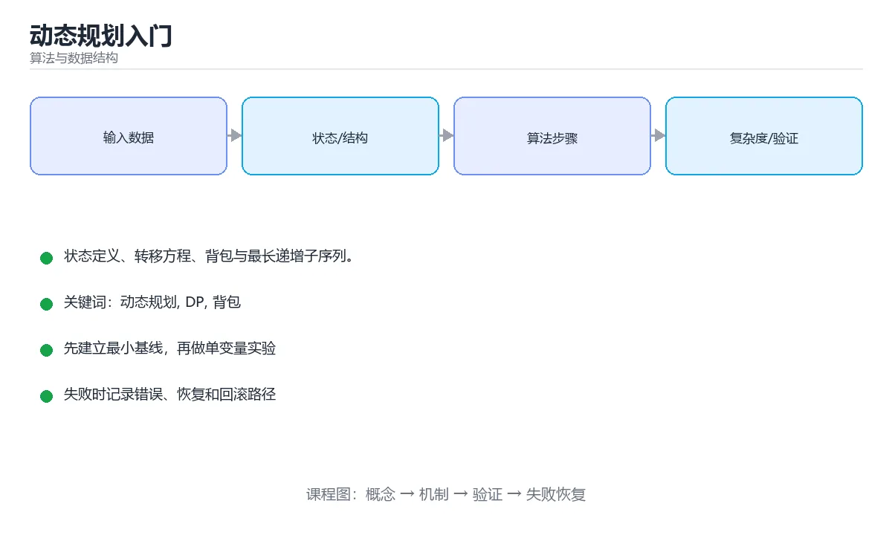

# 动态规划入门




> 内容更新时间：2026-10-06 · 学习阶段：高级 · 预计用时：35 分钟

## 本节知识框架

**课程定位**：所属分类 `algorithms`（算法与数据结构），课程主题 `动态规划入门`，学习阶段 高级，建议用时 45 分钟。

本课主线：状态定义、转移方程、背包与最长递增子序列。

**学完本课应当能够**
- 说清 `动态规划` 与 `记忆化` 的含义与区别，并各举一个正例和一个反例。
- 用本课示例验证 `状态定义` 的行为，记录输入、输出与失败条件。
- 遇到「0/1 背包容量正序遍历」这类问题时，能说出触发条件与修复顺序。

### 从概念到验证的学习链条

1. `动态规划`：先掌握 动态规划 = 定义状态 + 状态转移 + 边界 + 顺序，再用它解释 `记忆化` 为什么会出现。
2. `记忆化`：先掌握 缓存函数的输入与输出，在相同输入再次出现时直接复用结果，再用它解释 `状态定义` 为什么会出现。
3. `状态定义`：先掌握 用 dp[i] 表示「前 i 个元素的最优值」这类明确含义，定义不清后面的转移全错，再用它解释 `状态转移方程` 为什么会出现。
4. `状态转移方程`：先掌握 由小状态推出大状态的递推式，写清它才能确定遍历顺序与边界处理，再用它解释 本课示例的观察结果 为什么会出现。

**先修与衔接**：本课是「算法与数据结构」分类的第 28 课。先修内容：《排序算法家族》。《排序算法家族》里的 `排序`、`稳定性` 是本课的前提。相关或后续课程：《双指针与滑动窗口》。

### 完成判据

- **定义关**：不看正文也能说明 `动态规划` 是 动态规划 = 定义状态 + 状态转移 + 边界 + 顺序，并指出一个反例。
- **机制关**：能按“输入 → 转换 → 输出 → 验证”复述 `动态规划入门`，而不是只背结论。
- **示例关**：能运行或推演 `动态规划入门` 的 `python` 示例，并说明一个真实出现的标识符或字面量。
- **证据关**：能指出 `动态规划入门` 示例里的 调用了 `knapsack()`，并说明它支持或反驳了本课的哪一条结论。
- **排错关**：能复现 0/1 背包容量正序遍历，记录现象并按 0/1 背包必须逆序，完全背包才用正序 修复。
- **迁移关**：能把 `动态规划`、`DP`、`背包`、`LIS` 放进一个与 `动态规划入门` 不同的项目场景，并保持输入与验证条件可追踪。
- **复盘关**：学完 `动态规划入门` 后，用一句话写下仍然不确定的结论，并列出下一次验证需要的输入、环境和成功判据。

### 复习清单

- [ ] 能不看正文复述本课核心术语，并指出一个边界或反例。
- [ ] 能运行或推演本课示例，记录输入、输出与失败现象。
- [ ] 能完成一次自测，并把错题对照错误表定位原因。

## 核心概念定义

| 术语 | 操作性定义 | 常见边界与风险 |
| --- | --- | --- |
| 动态规划 | 动态规划 = 定义状态 + 状态转移 + 边界 + 顺序。 | 缓存与状态残留会让结果过期，先明确失效策略再判断正确性。 |
| 记忆化 | 缓存函数的输入与输出，在相同输入再次出现时直接复用结果。 | 缓存与状态残留会让结果过期，先明确失效策略再判断正确性。 |
| 状态定义 | 用 dp[i] 表示「前 i 个元素的最优值」这类明确含义，定义不清后面的转移全错。 | 易错：转移写不出来或答案错误；正确做法是先把 dp 的含义写成一句话。 |
| 状态转移方程 | 由小状态推出大状态的递推式，写清它才能确定遍历顺序与边界处理。 | 缓存与状态残留会让结果过期，先明确失效策略再判断正确性。 |
| 爬楼梯 | f[i] = 到第 i 阶的方法数 | 只在「f[i] = 到第 i 阶的方法数」这一前提下成立，换输入或换环境要重新验证。 |
| 0/1 背包 | f[j] = 容量 j 内的最大价值 | 易错：同一物品被重复使用，结果偏大；正确做法是0/1 背包必须逆序，完全背包才用正序。 |
| 最长递增子序列 | f[i] = 以 i 结尾的最长长度 | 只在「f[i] = 以 i 结尾的最长长度」这一前提下成立，换输入或换环境要重新验证。 |
| 编辑距离 | f[i][j] = 前 i 与前 j 个字符的最小操作数 | 只在「f[i][j] = 前 i 与前 j 个字符的最小操作数」这一前提下成立，换输入或换环境要重新验证。 |
| 爬楼梯 | `dp[i]` 到第 i 阶的方案数 | 只在「`dp[i]` 到第 i 阶的方案数」这一前提下成立，换输入或换环境要重新验证。 |
| 0/1 背包 | `dp[j]` 容量 j 的最大价值 | 易错：同一物品被重复使用，结果偏大；正确做法是0/1 背包必须逆序，完全背包才用正序。 |
| 完全背包 | 同上 | 易错：同一物品被重复使用，结果偏大；正确做法是0/1 背包必须逆序，完全背包才用正序。 |
| 最长递增子序列 | `dp[i]` 以 i 结尾的 LIS 长度 | 只在「`dp[i]` 以 i 结尾的 LIS 长度」这一前提下成立，换输入或换环境要重新验证。 |
| 最长公共子序列 | `dp[i][j]` 前 i、前 j 的 LCS | 只在「`dp[i][j]` 前 i、前 j 的 LCS」这一前提下成立，换输入或换环境要重新验证。 |
| 编辑距离 | `dp[i][j]` 最少操作数 | 只在「`dp[i][j]` 最少操作数」这一前提下成立，换输入或换环境要重新验证。 |
| 区间 DP | `dp[i][j]` 区间最优值 | 只在「`dp[i][j]` 区间最优值」这一前提下成立，换输入或换环境要重新验证。 |
| 状态压缩 | 用位表示集合 | 只在「用位表示集合」这一前提下成立，换输入或换环境要重新验证。 |
| 树形 DP | 以节点为根的子树最优 | 只在「以节点为根的子树最优」这一前提下成立，换输入或换环境要重新验证。 |

## 原理与运行机制

### 机制总览

**教材衔接：两个前提**

- **最优子结构**：大问题的最优解由子问题的最优解构成。
- **重叠子问题**：不同分支会重复计算同一子问题。

若只有最优子结构而没有重叠子问题，那叫分治（如归并排序）。

**教材衔接：解题四步**

1. **定义状态**：`dp[i]` 表示什么？（最关键的一步）
2. **写转移方程**：`dp[i]` 从哪些更小的状态来？
3. **确定初始条件与边界**。
4. **确定遍历顺序**，必要时用滚动数组压缩空间。

**教材衔接：常见题型地图**

| 类型 | 例子 |
| --- | --- |
| 序列型 | LIS、最大子数组和 |
| 区间型 | 最长回文子串、石子合并 |
| 背包型 | 0/1 背包、完全背包、零钱兑换 |
| 路径型 | 不同路径、最小路径和 |
| 状态压缩 | 旅行商问题、棋盘覆盖 |

**教材衔接：从记忆化到递推的改写步骤**

1. 先写暴力递归，确认状态参数与终止条件。
2. 加缓存（记忆化），得到自顶向下版本，此时正确性已验证。
3. 把递归改成按依赖顺序填表（自底向上）。
4. 观察是否只依赖前几行/前几个状态，用滚动数组压缩空间（0/1 背包从二维压到一维）。

调试技巧：把 dp 表打印出来与小规模暴力枚举的结果逐项对比，能在几分钟内定位转移方程错误。

**教材衔接：解题四步速查**

| 步骤 | 要回答的问题 |
| --- | --- |
| 1. 定义状态 | `dp[i]` / `dp[i][j]` 到底表示什么？边界怎么取？ |
| 2. 写转移方程 | 当前状态由哪些更小的状态得来？ |
| 3. 确定遍历顺序 | 谁先算？为什么这样能保证依赖已就绪？ |
| 4. 处理边界与答案 | 初始值是什么？最终答案是 `dp[n]` 还是所有状态的最值？ |

### 机制拆解：每一步的输入、动作与输出

#### 1. `动态规划`
- 输入：`动态规划`；本步把 动态规划 = 定义状态 + 状态转移 + 边界 + 顺序 当作判断规则。
- 动作：围绕 `动态规划` 保留中间状态，并记录它与 `记忆化` 的对应关系。
- 输出：`记忆化`，它可以被下一段代码、测试或记录继续使用。
- `动态规划` 的失败条件：缓存与状态残留会让结果过期，先明确失效策略再判断正确性。

#### 2. `记忆化`
- 输入：`动态规划`；本步把 缓存函数的输入与输出，在相同输入再次出现时直接复用结果 当作判断规则。
- 动作：围绕 `记忆化` 保留中间状态，并记录它与 `状态定义` 的对应关系。
- 输出：`状态定义`，它可以被下一段代码、测试或记录继续使用。
- `记忆化` 的失败条件：缓存与状态残留会让结果过期，先明确失效策略再判断正确性。

#### 3. `状态定义`
- 输入：`记忆化`；本步把 用 dp[i] 表示「前 i 个元素的最优值」这类明确含义，定义不清后面的转移全错 当作判断规则。
- 动作：围绕 `状态定义` 保留中间状态，并记录它与 `状态转移方程` 的对应关系。
- 输出：`状态转移方程`，它可以被下一段代码、测试或记录继续使用。
- `状态定义` 的失败条件：当状态定义含糊时，会出现转移写不出来或答案错误。

#### 4. `状态转移方程`
- 输入：`状态定义`；本步把 由小状态推出大状态的递推式，写清它才能确定遍历顺序与边界处理 当作判断规则。
- 动作：围绕 `状态转移方程` 保留中间状态，并记录它与 `knapsack` 的对应关系。
- 输出：`knapsack`，它可以被下一段代码、测试或记录继续使用。
- `状态转移方程` 的失败条件：缓存与状态残留会让结果过期，先明确失效策略再判断正确性。

### 示例中的可观察事实

1. 调用了 `knapsack()`；它对应的课程主题是 `动态规划入门`。
2. 调用了 `zip()`；它对应的课程主题是 `动态规划入门`。
3. 调用了 `range()`；它对应的课程主题是 `动态规划入门`。
4. 调用了 `max()`；它对应的课程主题是 `动态规划入门`。
5. 调用了 `lis()`；它对应的课程主题是 `动态规划入门`。
6. 调用了 `bisect_left()`；它对应的课程主题是 `动态规划入门`。
7. 调用了 `len()`；它对应的课程主题是 `动态规划入门`。
8. 调用了 `append()`；它对应的课程主题是 `动态规划入门`。

### 复现实验记录

- 环境：`动态规划入门` 使用 `python` 示例，固定 `动态规划`、`DP`、`背包`、`LIS` 作为第一组条件。
- 首轮输入：先确认 调用了 `knapsack()`，预测 `动态规划` 会怎样变化。
- 基线观察：记录命令、输入、输出和错误原文，不用截图代替可复制的文本。
- 单变量修改：只改变 `动态规划`，观察 `状态转移方程` 是否仍满足定义。
- 失败注入：复现 0/1 背包容量正序遍历，确认现象是 同一物品被重复使用，结果偏大。
- 记录结论：把“修改前、修改后、预期变化、实际变化”写成四列表，这样复盘 `动态规划入门` 时才能区分概念错误与实现错误。

## 典型应用场景

- **0/1 背包容量正序遍历**：典型现象是同一物品被重复使用，结果偏大；正确做法是0/1 背包必须逆序，完全背包才用正序。
- **状态定义含糊**：典型现象是转移写不出来或答案错误；正确做法是先把 dp 的含义写成一句话。
- **忘记处理边界**：典型现象是下标越界或首行首列错误；正确做法是多开一行一列并初始化。

### 最小验证场景

- 准备：保留 `python` 示例的原始输入，先记录 `动态规划入门` 的基线输出和完整运行命令。
- 观察：先核对 调用了 `knapsack()`，再改变一个与 `动态规划` 相关的条件。
- 判定：新结果与 `动态规划入门` 的基线不同不等于错误；只有当差异破坏了 `动态规划` 的定义或错误表中的约束，才判定为失败。

### 选择与边界

- 使用 `动态规划` 时，先满足它的定义：动态规划 = 定义状态 + 状态转移 + 边界 + 顺序；缓存与状态残留会让结果过期，先明确失效策略再判断正确性。
- 使用 `记忆化` 时，先满足它的定义：缓存函数的输入与输出，在相同输入再次出现时直接复用结果；缓存与状态残留会让结果过期，先明确失效策略再判断正确性。
- 使用 `状态定义` 时，先满足它的定义：用 dp[i] 表示「前 i 个元素的最优值」这类明确含义，定义不清后面的转移全错；易错：转移写不出来或答案错误；正确做法是先把 dp 的含义写成一句话。
- 使用 `状态转移方程` 时，先满足它的定义：由小状态推出大状态的递推式，写清它才能确定遍历顺序与边界处理；缓存与状态残留会让结果过期，先明确失效策略再判断正确性。

## 代码/协议/SQL 示例

### 最小可验证示例

```python
# 记忆化搜索（自顶向下）：逻辑直观
from functools import lru_cache

@lru_cache(maxsize=None)
def fib(n):
    return n if n < 2 else fib(n - 1) + fib(n - 2)

# 递推（自底向上）：无递归开销
def fib_iter(n):
    if n < 2:
        return n
    prev, curr = 0, 1
    for _ in range(2, n + 1):
        prev, curr = curr, prev + curr
    return curr
```

**教材衔接：两种写法**

**教材衔接：经典一：0/1 背包**

```python
def knapsack(weights, values, capacity):
    dp = [0] * (capacity + 1)
    for i in range(len(weights)):
        for c in range(capacity, weights[i] - 1, -1):   # 逆序：每个物品只用一次
            dp[c] = max(dp[c], dp[c - weights[i]] + values[i])
    return dp[capacity]
```

完全背包（物品可重复用）只需把内层改为正序遍历。

**教材衔接：经典二：最长递增子序列（LIS）**

```python
def lis_length(nums):
    if not nums:
        return 0
    dp = [1] * len(nums)                 # dp[i]：以 nums[i] 结尾的最长长度
    for i in range(len(nums)):
        for j in range(i):
            if nums[j] < nums[i]:
                dp[i] = max(dp[i], dp[j] + 1)
    return max(dp)
```

复杂度 `O(n²)`；用「贪心 + 二分」可以降到 `O(n log n)`。

**教材衔接：深挖「动态规划」的边界与代价**


### 二、把 lru_cache 推到边界

下面是本课第一段代码（python），先原样运行一次作为基线：

| 变式 | 怎么改 | 先写下什么 | 观察点 |
| --- | --- | --- | --- |
| 边界输入 | 把 lru_cache 的输入换成空值或最大值 | 预测输出 | 是否报错、是否静默返回 |
| 只改一处 | 把 fib_iter 的一个参数改成另一档 | 预测差异来源 | 输出变化能否用本课结论解释 |
| 去掉一步 | 注释掉 lru_cache 之后的一行 | 预测哪一步先失败 | 错误位置是否与预期一致 |


### 四、测验复盘

| 题号 | 正确答案 | 最容易选错的干扰项 | 复盘动作 |
| --- | --- | --- | --- |
| 1 | 这段代码把主要逻辑封装在函数或方法里，需要被调用才会执行。 | 这段代码会读取外部输入，结果依赖传入的数据。 | 把干扰项改写成一句反例，再说明它违反本课哪条前提 |
| 2 | 学习 动态规划 时要同时说明输入、输出和失败路径，不能只看正常流程 | 把 DP 的单次运行结果当成所有版本和规模都成立 | 把干扰项改写成一句反例，再说明它违反本课哪条前提 |
| 3 | 定义状态含义 | 写注释 | 把干扰项改写成一句反例，再说明它违反本课哪条前提 |
| 4 | 都基于最优子结构 | 两者解决的问题不同 | 把干扰项改写成一句反例，再说明它违反本课哪条前提 |
| 5 | 前 i 个字符与前 j 个字符的最长公共子序列长度 | 从 i 到 j 的字符数 | 把干扰项改写成一句反例，再说明它违反本课哪条前提 |
| 6 | 0 | （无干扰项） | 把干扰项改写成一句反例，再说明它违反本课哪条前提 |

### 五、离开本课前的自检

**运行方式**：运行 `动态规划入门` 的示例时，保存为 `.py` 文件后用 `python 文件名.py` 运行；第三方依赖先在虚拟环境里安装。

### 示例精读：先找证据，再改一个条件

1. 调用了 `knapsack()`；它出现在 `动态规划入门` 的示例中，阅读时先确认它前后各发生了什么。
2. 调用了 `zip()`；它出现在 `动态规划入门` 的示例中，阅读时先确认它前后各发生了什么。
3. 调用了 `range()`；它出现在 `动态规划入门` 的示例中，阅读时先确认它前后各发生了什么。
4. 调用了 `max()`；它出现在 `动态规划入门` 的示例中，阅读时先确认它前后各发生了什么。
5. 调用了 `lis()`；它出现在 `动态规划入门` 的示例中，阅读时先确认它前后各发生了什么。
6. 调用了 `bisect_left()`；它出现在 `动态规划入门` 的示例中，阅读时先确认它前后各发生了什么。
7. 调用了 `len()`；它出现在 `动态规划入门` 的示例中，阅读时先确认它前后各发生了什么。
8. 调用了 `append()`；它出现在 `动态规划入门` 的示例中，阅读时先确认它前后各发生了什么。
- 在 `动态规划入门` 中与 `动态规划` 对照：示例必须能支持 动态规划 = 定义状态 + 状态转移 + 边界 + 顺序，否则说明这一段还缺少实现或验证步骤。
- 在 `动态规划入门` 中与 `记忆化` 对照：示例必须能支持 缓存函数的输入与输出，在相同输入再次出现时直接复用结果，否则说明这一段还缺少实现或验证步骤。
- 在 `动态规划入门` 中与 `状态定义` 对照：示例必须能支持 用 dp[i] 表示「前 i 个元素的最优值」这类明确含义，定义不清后面的转移全错，否则说明这一段还缺少实现或验证步骤。
- 在 `动态规划入门` 中与 `状态转移方程` 对照：示例必须能支持 由小状态推出大状态的递推式，写清它才能确定遍历顺序与边界处理，否则说明这一段还缺少实现或验证步骤。

## 时间/空间复杂度或性能分析

**复杂度证据**：本课正文出现 `O(n²)`、`O(n log n)`、`O(n)`、`O(nW)`、`O(nm)`、`O(n³)` 等量级表达式；使用前要同时确认输入规模、最好/平均/最坏情况以及常数项来源。

**测量方法**：以 `动态规划入门` 的 `动态规划` 场景为对象，固定输入跑一遍记录基线，再把规模或并发度提高一个数量级复测；两次结果的差值与波动范围才是结论依据。

### 需要控制的变量与记录项

- `动态规划入门` 的 `动态规划`：固定它的版本、输入范围和资源上限，分别记录速度、内存与失败率的变化。
- `动态规划入门` 的 `DP`：固定它的版本、输入范围和资源上限，分别记录速度、内存与失败率的变化。
- `动态规划入门` 的 `背包`：固定它的版本、输入范围和资源上限，分别记录速度、内存与失败率的变化。
- `动态规划入门` 的 `LIS`：固定它的版本、输入范围和资源上限，分别记录速度、内存与失败率的变化。
- `动态规划入门` 的 `记忆化`：固定它的版本、输入范围和资源上限，分别记录速度、内存与失败率的变化。
- `动态规划入门` 中 `动态规划` 的边界：缓存与状态残留会让结果过期，先明确失效策略再判断正确性。达到边界时不要外推，必须重新测量。
- `动态规划入门` 中 `记忆化` 的边界：缓存与状态残留会让结果过期，先明确失效策略再判断正确性。达到边界时不要外推，必须重新测量。
- `动态规划入门` 中 `状态定义` 的边界：易错：转移写不出来或答案错误；正确做法是先把 dp 的含义写成一句话。达到边界时不要外推，必须重新测量。
- `动态规划入门` 中 `状态转移方程` 的边界：缓存与状态残留会让结果过期，先明确失效策略再判断正确性。达到边界时不要外推，必须重新测量。
- `动态规划入门` 的代码证据：先验证 调用了 `knapsack()`，再记录该路径的输入规模与耗时；只看代码行数不能推出复杂度。

## 常见误区与易错点

| 容易写错的做法 | 实际现象 | 原因与正确做法 |
| --- | --- | --- |
| 0/1 背包容量正序遍历 | 同一物品被重复使用，结果偏大。 | 0/1 背包必须逆序，完全背包才用正序。 |
| 状态定义含糊 | 转移写不出来或答案错误。 | 先把 dp 的含义写成一句话。 |
| 忘记处理边界 | 下标越界或首行首列错误。 | 多开一行一列并初始化。 |

### 现场 1：0/1 背包容量正序遍历

**症状**：同一物品被重复使用，结果偏大。

**根因与修复**：0/1 背包必须逆序，完全背包才用正序。

**自检**：在本课示例里复现「0/1 背包容量正序遍历」，改成0/1 背包必须逆序，完全背包才用正序后重跑；如果症状消失且失败路径按预期变化，说明定位正确。

### 现场 2：状态定义含糊

**症状**：转移写不出来或答案错误。

**根因与修复**：先把 dp 的含义写成一句话。

**自检**：在本课示例里复现「状态定义含糊」，改成先把 dp 的含义写成一句话后重跑；如果症状消失且失败路径按预期变化，说明定位正确。

### 现场 3：忘记处理边界

**症状**：下标越界或首行首列错误。

**根因与修复**：多开一行一列并初始化。

**自检**：在本课示例里复现「忘记处理边界」，改成多开一行一列并初始化后重跑；如果症状消失且失败路径按预期变化，说明定位正确。

## 与其他知识点的关系

- **先修**：`排序算法家族`。本课默认这些内容已经掌握。
- **相关或后续**：`双指针与滑动窗口`。本课术语会在这些课程里继续使用。
- **术语归属**：`动态规划`、`记忆化`、`状态定义` 的定义以本课「核心概念定义」为准，换到其他课程时先确认定义是否被改写。

### 先修与后续术语接口

- `排序算法家族`：两者通过本分类的学习顺序衔接，阅读时重点比较各自的输入与失败条件。
- `双指针与滑动窗口`：两者通过本分类的学习顺序衔接，阅读时重点比较各自的输入与失败条件。

### 容易混淆的相邻概念

- `动态规划` 与 `记忆化`：前者强调 动态规划 = 定义状态 + 状态转移 + 边界 + 顺序；后者强调 缓存函数的输入与输出，在相同输入再次出现时直接复用结果。判断时分别检查两条定义的适用范围，不要只看名称相似就互换。
- `记忆化` 与 `状态定义`：前者强调 缓存函数的输入与输出，在相同输入再次出现时直接复用结果；后者强调 用 dp[i] 表示「前 i 个元素的最优值」这类明确含义，定义不清后面的转移全错。判断时分别检查两条定义的适用范围，不要只看名称相似就互换。
- `状态定义` 与 `状态转移方程`：前者强调 用 dp[i] 表示「前 i 个元素的最优值」这类明确含义，定义不清后面的转移全错；后者强调 由小状态推出大状态的递推式，写清它才能确定遍历顺序与边界处理。判断时分别检查两条定义的适用范围，不要只看名称相似就互换。

## 自测题与参考答案

> 先独立作答，再对照参考答案；答案都能在本课正文、术语表或错误表里找到依据。

### 自测 1（概念复述）

不看正文，写出 `动态规划` 的操作性定义，并说明它与 `记忆化` 的区别。

**参考答案**：动态规划 = 定义状态 + 状态转移 + 边界 + 顺序。

`记忆化` 的定位是：缓存函数的输入与输出，在相同输入再次出现时直接复用结果；两者的差别要从适用对象与失败模式上说明。

### 自测 2（排错）

本课错误表记录了「0/1 背包容量正序遍历」这类做法。请写出它会出现的现象、根因，以及修复顺序。

**参考答案**：现象是同一物品被重复使用，结果偏大；正确做法是0/1 背包必须逆序，完全背包才用正序。修复时先复现现象并保留证据，再改动一处假设重跑，确认现象消失。

### 自测 3（动手验证）

运行本课的 `python` 示例，把其中的 `0` 换成一个边界值后重新运行，记录输出与错误信息。

**参考答案**：正常输入下 `python` 示例应当复现正文给出的结果；把 `0` 换成边界值后，如果结果改变或报错，先核对它是否满足 `动态规划入门` 中`动态规划` 的适用范围，再检查错误表里是否有同类现象。

### 自测 4（代码阅读）

阅读本课开头的 `python` 示例，说明它体现了`动态规划` 的哪一条性质，并指出改动哪个输入会让这条性质不再成立。

**参考答案**：`动态规划` 的定义是 动态规划 = 定义状态 + 状态转移 + 边界 + 顺序，示例正是在实现这条定义。改动与 `动态规划` 有关的一个输入后，如果结果不再符合 `动态规划入门` 的正文描述，就说明该性质只在当前前提成立。

### 自测 5（迁移）

把 `动态规划入门` 的方法迁移到自己的项目：围绕 `动态规划` 写出一个与错误表同类的风险点，并说明触发条件和检验方式。

**参考答案**：例如「忘记处理边界」，它会导致下标越界或首行首列错误；检验方式是按多开一行一列并初始化改一处再复现，确认现象消失且没有引入新的失败分支。

### 自测 6（对比）

用一个表格对比 `动态规划` 与 `记忆化`：各写一行适用场景、一行失败表现。

**参考答案**：`动态规划` 的定义是动态规划 = 定义状态 + 状态转移 + 边界 + 顺序；`记忆化` 的定义是缓存函数的输入与输出，在相同输入再次出现时直接复用结果。两者的失败表现分别对应本课错误表里与本术语相关的行。

### 自测 7（排错顺序）

面对「0/1 背包容量正序遍历」引发的问题，请把“复现 同一物品被重复使用，结果偏大 → 保留证据 → 0/1 背包必须逆序，完全背包才用正序 → 回归验证”四步写成可执行的检查清单。

**参考答案**：第一步按同一物品被重复使用，结果偏大复现；第二步记录输入、版本与完整报错；第三步按0/1 背包必须逆序，完全背包才用正序只改一处；第四步重跑并确认失败路径也按预期变化。

### 自测 8（边界判断）

针对 `状态转移方程`，分别写出“可以使用”的条件和“结论不再成立”的条件。

**参考答案**：缓存与状态残留会让结果过期，先明确失效策略再判断正确性。 同时要把 `状态转移方程` 的定义 由小状态推出大状态的递推式，写清它才能确定遍历顺序与边界处理 与实际输入逐项对照。

### 自测 9（机制重建）

不看正文，按输入、转换、输出、验证四段重建 `动态规划` → `记忆化` → `状态定义` → `状态转移方程` 的作用链。

**参考答案**：起点是 `动态规划` 的定义 动态规划 = 定义状态 + 状态转移 + 边界 + 顺序；中间每一步都保留可观察状态；终点由 `状态转移方程` 检查，失败时回到错误表定位第一个偏离定义的步骤。

### 自测 10（综合排错）

在 `动态规划入门` 中，现象是 下标越界或首行首列错误。请围绕 忘记处理边界 写出最小复现、关键证据、修复动作和回归验证，并说明为什么不能只凭一次运行下结论。

**参考答案**：先复现 忘记处理边界，记录输入与完整错误；再按 多开一行一列并初始化 只改一处。回归时同时跑正常路径和边界路径，只有两次结果都可解释，才把修复视为完成。

### 自测 11（一分钟复述）

用每分钟约 200 字的速度复述 `动态规划入门`：先给主问题，再按顺序说出 `动态规划`、`记忆化`、`状态定义`、`状态转移方程`，最后给一个失败案例。

**自评标准**：主问题必须对应 状态定义、转移方程、背包与最长递增子序列；每个术语都要能接上一句定义或边界；失败案例必须写成可观察现象，不能用“可能有风险”代替证据。

## 术语速查

| 术语 | 一句话说明 |
| --- | --- |
| `动态规划` | 动态规划 = 定义状态 + 状态转移 + 边界 + 顺序。 |
| `记忆化` | 缓存函数的输入与输出，在相同输入再次出现时直接复用结果。 |
| `状态定义` | 用 dp[i] 表示「前 i 个元素的最优值」这类明确含义，定义不清后面的转移全错。 |
| `状态转移方程` | 由小状态推出大状态的递推式，写清它才能确定遍历顺序与边界处理。 |

**术语关系**：`动态规划`（动态规划 = 定义状态 + 状态转移 + 边界 + 顺序） → `记忆化`（缓存函数的输入与输出） → `状态定义`（用 dp[i] 表示「前 i 个元素的最优值」这类明确含义） → `状态转移方程`（由小状态推出大状态的递推式）。

## 考点精讲

`动态规划入门` 的题库有 6 道题，下面逐题给出题干、正确项与判断依据：先自己作答，再核对正确项，最后回到正文对应小节复核。

### 考点 1：第 1 题

- **题目**：代码语言为 `python`，选自 `动态规划入门` 的 `动态规划` 部分。课程问题为状态定义、转移方程、背包与最长递增子序列。哪一项描述与代码一致？
- **正确项**：调用了 `fib()`
- **判断依据**：这道题落在术语 `动态规划` 上：动态规划 = 定义状态 + 状态转移 + 边界 + 顺序。复习时把 `动态规划` 的定义、适用边界和一个反例一起说清楚，再回到「核心概念定义」核对原文。

### 考点 2：第 2 题

- **题目**：围绕“动态规划入门”中的 动态规划、DP、背包，下列哪两项是本课强调的实践判断？
- **正确项**：学习 动态规划 时要同时说明输入、输出和失败路径，不能只看正常流程；验证 DP 时要固定版本并覆盖边界输入，结论才可复现
- **判断依据**：这道题落在术语 `动态规划` 上：动态规划 = 定义状态 + 状态转移 + 边界 + 顺序。复习时把 `动态规划` 的定义、适用边界和一个反例一起说清楚，再回到「核心概念定义」核对原文。

### 考点 3：第 3 题

- **题目**：写动态规划最关键的一步是？
- **正确项**：定义状态含义
- **判断依据**：这道题落在术语 `动态规划` 上：动态规划 = 定义状态 + 状态转移 + 边界 + 顺序。复习时把 `动态规划` 的定义、适用边界和一个反例一起说清楚，再回到「核心概念定义」核对原文。

### 考点 4：第 4 题

- **题目**：记忆化搜索与自底向上递推的关系是？
- **正确项**：都基于最优子结构
- **判断依据**：这道题落在术语 `记忆化` 上：缓存函数的输入与输出，在相同输入再次出现时直接复用结果。复习时把 `记忆化` 的定义、适用边界和一个反例一起说清楚，再回到「核心概念定义」核对原文。

### 考点 5：第 5 题

- **题目**：最长公共子序列（LCS）中 dp[i][j] 的含义通常是？
- **正确项**：前 i 个字符与前 j 个字符的最长公共子序列长度
- **判断依据**：这道题检验本课主问题：状态定义、转移方程、背包与最长递增子序列。复习时先复述本课主问题，再举一个会让结论失效的输入。

### 考点 6：第 6 题

- **题目**：填空：补齐下面这段术语说明中的空缺。课程 `状态定义、转移方程、背包与最长递增子序列。`，这段说明是：`____`：由小状态推出大状态的递推式，写清它才能确定遍历顺序与边界处理。空缺处应填哪个术语？
- **正确项**：状态转移方程
- **判断依据**：这道题落在术语 `状态定义` 上：用 dp[i] 表示「前 i 个元素的最优值」这类明确含义，定义不清后面的转移全错。复习时把 `状态定义` 的定义、适用边界和一个反例一起说清楚，再回到「核心概念定义」核对原文。

### 考点 7：`动态规划`

- **要点**：动态规划 = 定义状态 + 状态转移 + 边界 + 顺序。
- **动态规划 的边界**：缓存与状态残留会让结果过期，先明确失效策略再判断正确性。

### 考点 8：`记忆化`

- **要点**：缓存函数的输入与输出，在相同输入再次出现时直接复用结果。
- **记忆化 的边界**：缓存与状态残留会让结果过期，先明确失效策略再判断正确性。

### 考点 9：`状态定义`

- **要点**：用 dp[i] 表示「前 i 个元素的最优值」这类明确含义，定义不清后面的转移全错。
- **状态定义 的边界**：易错：转移写不出来或答案错误；正确做法是先把 dp 的含义写成一句话。

### 考点 10：`状态转移方程`

- **要点**：由小状态推出大状态的递推式，写清它才能确定遍历顺序与边界处理。
- **状态转移方程 的边界**：缓存与状态残留会让结果过期，先明确失效策略再判断正确性。

### 考点 11：排错——0/1 背包容量正序遍历

- **现象**：同一物品被重复使用，结果偏大。
- **处理**：0/1 背包必须逆序，完全背包才用正序。

### 考点 12：排错——状态定义含糊

- **现象**：转移写不出来或答案错误。
- **处理**：先把 dp 的含义写成一句话。

### 考点 13：综合辨析——`动态规划` 与 `状态转移方程`

- **辨析点**：`动态规划` 的定义是 动态规划 = 定义状态 + 状态转移 + 边界 + 顺序；`状态转移方程` 的定义是 由小状态推出大状态的递推式，写清它才能确定遍历顺序与边界处理。
- **答题要求**：面对 `动态规划入门` 的题目，先判断描述的是 `动态规划` 还是 `状态转移方程`，再归到对应定义，最后写出一个会让该定义失效的边界输入。

### 考点 14：排错评分点

- **现象分**：能写出 同一物品被重复使用，结果偏大，而不是只写“程序有错”。
- **证据分**：保留触发 0/1 背包容量正序遍历 的输入、版本和错误原文。
- **修复分**：按 0/1 背包必须逆序，完全背包才用正序 只改一处，并同时回归正常路径与边界路径。

## 内容元数据

- 内容版本：v2.0
- 最后更新：2026-10-06
- 学习阶段：高级
- 适用环境：任意主流语言（伪代码与复杂度为主）
；本课聚焦 动态规划。
- 内容来源：内置结构化课程与工程实践整理
- 相关主题：动态规划、DP、背包、LIS、记忆化
- 质量版本：P0 测验标准 + P1 覆盖扩展 + P2 体验补全

## 参考资料与复核

- 最后复核：2026-10-04
- 下次复核：2027-05-24
- 复核范围：版本兼容、API 行为、安全建议与工程实践
- 来源性质：官方文档、标准或权威教材；本课核对关键词：动态规划、DP、背包、LIS、记忆化。

| 参考资料 | 本课用途 |
| --- | --- |
| [CP-Algorithms](https://cp-algorithms.com/) | 算法实现与复杂度 |
| [GeeksforGeeks 算法](https://www.geeksforgeeks.org/fundamentals-of-algorithms/) | 算法专题与实现 |
| [LeetCode 学习](https://leetcode.com/explore/) | 算法题训练与模式 |

| [本课术语索引：动态规划入门](#核心概念定义) | 按本课输入、术语边界和错误表现逐项核对 |
> 「动态规划入门」的链接用于离线阅读后的延伸核对；App 不会自动联网。

<!-- p1-deep-dive:start -->