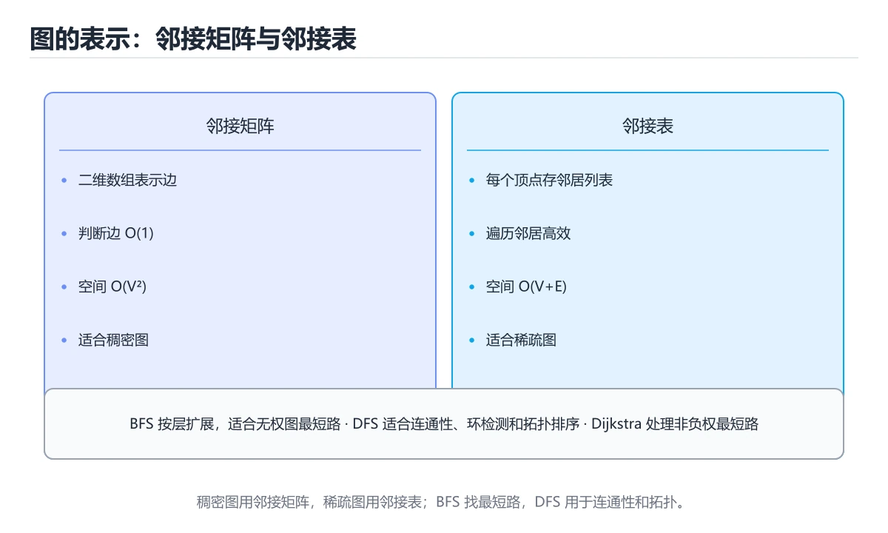

# 图与图算法




> 内容更新时间：2026-10-06 · 学习阶段：高级 · 预计用时：45 分钟

## 本节知识框架

**课程定位**：所属分类 `algorithms`（算法与数据结构），课程主题 `图与图算法`，学习阶段 高级，建议用时 45 分钟。

本课主线：邻接表、BFS/DFS、拓扑排序与 Dijkstra。

**学完本课应当能够**
- 说清 `图` 与 `BFS` 的含义与区别，并各举一个正例和一个反例。
- 用本课示例验证 `DFS` 的行为，记录输入、输出与失败条件。
- 遇到「BFS 用栈实现」这类问题时，能说出触发条件与修复顺序。

### 从概念到验证的学习链条

1. `图`：先掌握 由顶点和边组成、用于表示对象及其关系的结构，再用它解释 `BFS` 为什么会出现。
2. `BFS`：先掌握 广度优先搜索，按层访问图节点，适合无权最短路和层序遍历，再用它解释 `DFS` 为什么会出现。
3. `DFS`：先掌握 深度优先搜索：沿一条路径走到底再回退，用栈或递归实现，可判连通、找环与拓扑排序，再用它解释 `拓扑排序` 为什么会出现。
4. `拓扑排序`：先掌握 把有向无环图排成线性顺序，使所有边都从前指向后，再用它解释 `Dijkstra` 为什么会出现。
5. `Dijkstra`：先掌握 实现上最常见的三个错误：忘记标记已访问导致重复入队（内存暴涨）、Dijkstra 用普通队列导致复杂度退化、在稠密图上用邻接表却仍按 O(V²) 遍历，再用它解释 本课示例的观察结果 为什么会出现。

**先修与衔接**：本课是「算法与数据结构」分类的第 27 课。先修内容：《树与二叉搜索树》。《树与二叉搜索树》里的 `二叉树`、`遍历` 是本课的前提。相关或后续课程：《排序算法家族》。

### 完成判据

- **定义关**：不看正文也能说明 `图` 是 由顶点和边组成、用于表示对象及其关系的结构，并指出一个反例。
- **机制关**：能按“输入 → 转换 → 输出 → 验证”复述 `图与图算法`，而不是只背结论。
- **示例关**：能运行或推演 `图与图算法` 的 `python` 示例，并说明一个真实出现的标识符或字面量。
- **证据关**：能指出 `图与图算法` 示例里的 调用了 `dijkstra()`，并说明它支持或反驳了本课的哪一条结论。
- **排错关**：能复现 BFS 用栈实现，记录现象并按 BFS 必须用队列 修复。
- **迁移关**：能把 `图`、`BFS`、`DFS`、`拓扑排序` 放进一个与 `图与图算法` 不同的项目场景，并保持输入与验证条件可追踪。
- **复盘关**：学完 `图与图算法` 后，用一句话写下仍然不确定的结论，并列出下一次验证需要的输入、环境和成功判据。

### 复习清单

- [ ] 能不看正文复述本课核心术语，并指出一个边界或反例。
- [ ] 能运行或推演本课示例，记录输入、输出与失败现象。
- [ ] 能完成一次自测，并把错题对照错误表定位原因。

## 核心概念定义

| 术语 | 操作性定义 | 常见边界与风险 |
| --- | --- | --- |
| 图 | 由顶点和边组成、用于表示对象及其关系的结构。 | 只在「由顶点和边组成、用于表示对象及其关系的结构」这一前提下成立，换输入或换环境要重新验证。 |
| BFS | 广度优先搜索，按层访问图节点，适合无权最短路和层序遍历。 | 易错：变成 DFS，最短路不成立；正确做法是BFS 必须用队列。 |
| DFS | 深度优先搜索：沿一条路径走到底再回退，用栈或递归实现，可判连通、找环与拓扑排序。 | 易错：变成 DFS，最短路不成立；正确做法是BFS 必须用队列。 |
| 拓扑排序 | 把有向无环图排成线性顺序，使所有边都从前指向后。 | 易错：结果缺少节点却当成合法；正确做法是检查输出长度是否等于节点数。 |
| Dijkstra | 实现上最常见的三个错误：忘记标记已访问导致重复入队（内存暴涨）、Dijkstra 用普通队列导致复杂度退化、在稠密图上用邻接表却仍按 O(V²) 遍历。 | 易错：结果错误；正确做法是负权用 Bellman-Ford 或 SPFA。 |

## 原理与运行机制

### 机制总览

| 阶段 | 关注对象 | 失败时应检查 |
| --- | --- | --- |
| 输入 | 图 | 类型、范围、编码、版本或前置状态是否满足定义。 |
| 处理 | BFS | 顺序、可见性、锁、路由、事务或调度规则是否被破坏。 |
| 输出 | DFS | 结果是否可复现，错误是否被正确传播而不是被吞掉。 |

**教材衔接：图表示与算法选型**

| 目的 | 算法 | 复杂度 | 前提 |
| --- | --- | --- | --- |
| 遍历所有节点 | DFS / BFS | O(V+E) | 无 |
| 无权最短路 | BFS | O(V+E) | 边权相等 |
| 非负权最短路 | Dijkstra | O((V+E)log V) | 边权非负 |
| 含负权最短路 | Bellman-Ford | O(VE) | 可检测负环 |
| 多源最短路 | Floyd-Warshall | O(V³) | 小图 |
| 最小生成树 | Kruskal / Prim | O(E log E) | 无向连通图 |
| 拓扑排序 | Kahn / DFS | O(V+E) | 有向无环图 |
| 连通分量 | DFS / 并查集 | O(V+E) | 无向图 |
| 强连通分量 | Tarjan / Kosaraju | O(V+E) | 有向图 |
| 二分图判定 | 染色 BFS | O(V+E) | 无向图 |

存储方式对照：

| 方式 | 空间 | 适合 | 判断两点相邻 |
| --- | --- | --- | --- |
| 邻接矩阵 | O(V²) | 稠密图、需快速查边 | O(1) |
| 邻接表 | O(V+E) | 稀疏图（大多数场景） | O(deg(v)) |
| 边列表 | O(E) | 只需要遍历边（Kruskal） | O(E) |

```python
from collections import deque
import heapq

def dijkstra(graph, start):
    """graph: {节点: [(邻居, 权重), ...]}，返回最短距离字典。"""
    dist = {start: 0}
    heap = [(0, start)]
    while heap:
        d, node = heapq.heappop(heap)
        if d > dist.get(node, float("inf")):
            continue                       # 过期条目，跳过
        for nxt, weight in graph.get(node, []):
            nd = d + weight
            if nd < dist.get(nxt, float("inf")):
                dist[nxt] = nd
                heapq.heappush(heap, (nd, nxt))
    return dist

def topo_sort(graph, indegree):
    """Kahn 算法：入度为 0 入队，逐个出队削减邻居入度。"""
    queue = deque([n for n in indegree if indegree[n] == 0])
    order = []
    while queue:
        node = queue.popleft()
        order.append(node)
        for nxt in graph.get(node, []):
            indegree[nxt] -= 1
            if indegree[nxt] == 0:
                queue.append(nxt)
    return order if len(order) == len(indegree) else []   # 空表示有环
```

### 机制拆解：每一步的输入、动作与输出

#### 1. `图`
- 输入：`图`；本步把 由顶点和边组成、用于表示对象及其关系的结构 当作判断规则。
- 动作：围绕 `图` 保留中间状态，并记录它与 `BFS` 的对应关系。
- 输出：`BFS`，它可以被下一段代码、测试或记录继续使用。
- `图` 的失败条件：当无向图只加一条边时，会出现反向不可达。

#### 2. `BFS`
- 输入：`图`；本步把 广度优先搜索，按层访问图节点，适合无权最短路和层序遍历 当作判断规则。
- 动作：围绕 `BFS` 保留中间状态，并记录它与 `DFS` 的对应关系。
- 输出：`DFS`，它可以被下一段代码、测试或记录继续使用。
- `BFS` 的失败条件：当BFS 用栈实现时，会出现变成 DFS，最短路不成立。

#### 3. `DFS`
- 输入：`BFS`；本步把 深度优先搜索：沿一条路径走到底再回退，用栈或递归实现，可判连通、找环与拓扑排序 当作判断规则。
- 动作：围绕 `DFS` 保留中间状态，并记录它与 `拓扑排序` 的对应关系。
- 输出：`拓扑排序`，它可以被下一段代码、测试或记录继续使用。
- `DFS` 的失败条件：当BFS 用栈实现时，会出现变成 DFS，最短路不成立。

#### 4. `拓扑排序`
- 输入：`DFS`；本步把 把有向无环图排成线性顺序，使所有边都从前指向后 当作判断规则。
- 动作：围绕 `拓扑排序` 保留中间状态，并记录它与 `Dijkstra` 的对应关系。
- 输出：`Dijkstra`，它可以被下一段代码、测试或记录继续使用。
- `拓扑排序` 的失败条件：当拓扑排序不检测环时，会出现结果缺少节点却当成合法。

#### 5. `Dijkstra`
- 输入：`拓扑排序`；本步把 实现上最常见的三个错误：忘记标记已访问导致重复入队（内存暴涨）、Dijkstra 用普通队列导致复杂度退化、在稠密图上用邻接表却仍按 O(V²) 遍历 当作判断规则。
- 动作：围绕 `Dijkstra` 保留中间状态，并记录它与 `dijkstra` 的对应关系。
- 输出：`dijkstra`，它可以被下一段代码、测试或记录继续使用。
- `Dijkstra` 的失败条件：当Dijkstra 处理负权时，会出现结果错误。

### 示例中的可观察事实

1. 调用了 `dijkstra()`；它对应的课程主题是 `图与图算法`。
2. 调用了 `heappop()`；它对应的课程主题是 `图与图算法`。
3. 调用了 `get()`；它对应的课程主题是 `图与图算法`。
4. 调用了 `float()`；它对应的课程主题是 `图与图算法`。
5. 调用了 `heappush()`；它对应的课程主题是 `图与图算法`。
6. 调用了 `topo_sort()`；它对应的课程主题是 `图与图算法`。
7. 调用了 `deque()`；它对应的课程主题是 `图与图算法`。
8. 调用了 `popleft()`；它对应的课程主题是 `图与图算法`。

### 复现实验记录

- 环境：`图与图算法` 使用 `python` 示例，固定 `图`、`BFS`、`DFS`、`拓扑排序` 作为第一组条件。
- 首轮输入：先确认 调用了 `dijkstra()`，预测 `图` 会怎样变化。
- 基线观察：记录命令、输入、输出和错误原文，不用截图代替可复制的文本。
- 单变量修改：只改变 `图`，观察 `Dijkstra` 是否仍满足定义。
- 失败注入：复现 BFS 用栈实现，确认现象是 变成 DFS，最短路不成立。
- 记录结论：把“修改前、修改后、预期变化、实际变化”写成四列表，这样复盘 `图与图算法` 时才能区分概念错误与实现错误。

## 典型应用场景

| 场景 | 典型输入或前提 | 期望产物 |
| --- | --- | --- |
| 学习验证 | 使用本课最小示例和 图、BFS | 能复现正文结论，并解释每一步。 |
| 工程落地 | 把「图与图算法」放入真实模块或服务边界 | 输出可观测、失败可定位、参数可配置。 |
| 故障排查 | 只改一个版本、规模、输入或依赖条件 | 能区分概念错误、实现错误和环境差异。 |

- **BFS 用栈实现**：典型现象是变成 DFS，最短路不成立；正确做法是BFS 必须用队列。
- **访问标记在出队时才加**：典型现象是同一节点重复入队；正确做法是入队时立即标记。
- **Dijkstra 处理负权**：典型现象是结果错误；正确做法是负权用 Bellman-Ford 或 SPFA。
- **Dijkstra 不跳过过期堆元素**：典型现象是复杂度上升、可能错；正确做法是比较弹出距离与记录距离。

### 最小验证场景

- 准备：保留 `python` 示例的原始输入，先记录 `图与图算法` 的基线输出和完整运行命令。
- 观察：先核对 调用了 `dijkstra()`，再改变一个与 `图` 相关的条件。
- 判定：新结果与 `图与图算法` 的基线不同不等于错误；只有当差异破坏了 `图` 的定义或错误表中的约束，才判定为失败。

### 选择与边界

- 使用 `图` 时，先满足它的定义：由顶点和边组成、用于表示对象及其关系的结构；只在「由顶点和边组成、用于表示对象及其关系的结构」这一前提下成立，换输入或换环境要重新验证。
- 使用 `BFS` 时，先满足它的定义：广度优先搜索，按层访问图节点，适合无权最短路和层序遍历；易错：变成 DFS，最短路不成立；正确做法是BFS 必须用队列。
- 使用 `DFS` 时，先满足它的定义：深度优先搜索：沿一条路径走到底再回退，用栈或递归实现，可判连通、找环与拓扑排序；易错：变成 DFS，最短路不成立；正确做法是BFS 必须用队列。
- 使用 `拓扑排序` 时，先满足它的定义：把有向无环图排成线性顺序，使所有边都从前指向后；易错：结果缺少节点却当成合法；正确做法是检查输出长度是否等于节点数。
- 使用 `Dijkstra` 时，先满足它的定义：实现上最常见的三个错误：忘记标记已访问导致重复入队（内存暴涨）、Dijkstra 用普通队列导致复杂度退化、在稠密图上用邻接表却仍按 O(V²) 遍历；易错：结果错误；正确做法是负权用 Bellman-Ford 或 SPFA。

## 代码/协议/SQL 示例

### 最小可验证示例

```python
# 邻接表：稀疏图首选，空间 O(V + E)
graph = {
    "A": ["B", "C"],
    "B": ["D"],
    "C": ["D", "E"],
    "D": ["E"],
    "E": [],
}

# 邻接矩阵：稠密图或需要 O(1) 判断两点是否相邻时使用，空间 O(V²)
matrix = [
    [0, 1, 1, 0, 0],
    [0, 0, 0, 1, 0],
    [0, 0, 0, 1, 1],
    [0, 0, 0, 0, 1],
    [0, 0, 0, 0, 0],
]
```

**教材衔接：图的表示**

**教材衔接：深度优先与广度优先**

```python
def dfs(graph, start, visited=None):
    visited = visited or set()
    visited.add(start)
    result = [start]
    for neighbor in graph[start]:
        if neighbor not in visited:
            result += dfs(graph, neighbor, visited)
    return result

from collections import deque

def bfs(graph, start):
    visited, queue, order = {start}, deque([start]), []
    while queue:
        node = queue.popleft()
        order.append(node)
        for neighbor in graph[node]:
            if neighbor not in visited:
                visited.add(neighbor)
                queue.append(neighbor)
    return order
```

- DFS 用栈/递归，适合找路径、连通分量、环检测。
- BFS 用队列，适合无权图最短路、层序遍历。

**教材衔接：拓扑排序**

有向无环图（DAG）的线性排序，用于任务调度与依赖解析：

```python
def topological_sort(graph):
    indegree = {node: 0 for node in graph}
    for neighbors in graph.values():
        for neighbor in neighbors:
            indegree[neighbor] += 1
    queue = deque([n for n, d in indegree.items() if d == 0])
    order = []
    while queue:
        node = queue.popleft()
        order.append(node)
        for neighbor in graph[node]:
            indegree[neighbor] -= 1
            if indegree[neighbor] == 0:
                queue.append(neighbor)
    return order if len(order) == len(graph) else []   # 空表示存在环
```

**教材衔接：最短路径**

```python
import heapq

def dijkstra(graph, start):
    dist = {node: float("inf") for node in graph}
    dist[start] = 0
    heap = [(0, start)]
    while heap:
        d, node = heapq.heappop(heap)
        if d > dist[node]:
            continue
        for neighbor, weight in graph[node]:
            new_dist = d + weight
            if new_dist < dist[neighbor]:
                dist[neighbor] = new_dist
                heapq.heappush(heap, (new_dist, neighbor))
    return dist
```

Dijkstra 要求边权非负；有负权用 Bellman-Ford，多源最短路用 Floyd-Warshall。

**教材衔接：三种遍历的对比与选择**

```python
# BFS：队列，按层扩展
from collections import deque
def bfs(graph, start):
    seen, queue = {start}, deque([start])
    while queue:
        node = queue.popleft()
        for nxt in graph[node]:
            if nxt not in seen:
                seen.add(nxt); queue.append(nxt)

# DFS：递归或显式栈
def dfs(graph, node, seen=None):
    seen = seen or set()
    seen.add(node)
    for nxt in graph[node]:
        if nxt not in seen:
            dfs(graph, nxt, seen)

# Dijkstra：优先队列按距离出队（仅适用于非负权）
import heapq
def dijkstra(graph, start):
    dist = {start: 0}; heap = [(0, start)]
    while heap:
        d, node = heapq.heappop(heap)
        if d > dist.get(node, float("inf")): continue
        for nxt, w in graph[node]:
            nd = d + w
            if nd < dist.get(nxt, float("inf")):
                dist[nxt] = nd; heapq.heappush(heap, (nd, nxt))
    return dist
```

| 算法 | 数据结构 | 复杂度 | 适用 |
| --- | --- | --- | --- |
| BFS | 队列 | O(V+E) | 无权最短路、层序、连通分量 |
| DFS | 栈/递归 | O(V+E) | 路径枚举、环检测、拓扑排序基础 |
| Dijkstra | 优先队列 | O((V+E)log V) | 非负权最短路 |

实现上最常见的三个错误：**忘记标记已访问导致重复入队**（内存暴涨）、**Dijkstra 用普通队列导致复杂度退化**、**在稠密图上用邻接表却仍按 O(V²) 遍历**。

**教材衔接：深挖「图」的边界与代价**

这一章只用「图与图算法」自己的正文、代码和测验题，把图推到边界再看一遍：先确认它在什么条件下成立，再估计代价，最后给出可复现的证据。


### 二、把 graph 推到边界

下面是本课第一段代码（python），先原样运行一次作为基线：

| 变式 | 怎么改 | 先写下什么 | 观察点 |
| --- | --- | --- | --- |
| 边界输入 | 把 graph 的输入换成空值或最大值 | 预测输出 | 是否报错、是否静默返回 |
| 只改一处 | 把 matrix 的一个参数改成另一档 | 预测差异来源 | 输出变化能否用本课结论解释 |
| 去掉一步 | 注释掉 graph 之后的一行 | 预测哪一步先失败 | 错误位置是否与预期一致 |

### 三、「图」的代价怎么量

| 观察项 | 怎么测 | 结论怎么写 |
| --- | --- | --- |
| 时间 | 把 图 的输入规模翻倍，记录耗时变化 | 写出增长是线性、对数还是常数，并给出实测数据 |
| 空间 | 记录 BFS 占用的内存或存储峰值 | 说明峰值出现在哪一步，以及能否提前释放 |
| 可读性 | 统计完成同一件事需要多少行代码或多少步操作 | 用具体行数代替「更简洁」这类主观描述 |
| 失败代价 | 触发一次失败，记录恢复所需步骤 | 写清失败后是否有残留状态、如何回滚 |

### 四、测验复盘

| 题号 | 正确答案 | 最容易选错的干扰项 | 复盘动作 |
| --- | --- | --- | --- |
| 1 | 邻接表 | 哈希集合 | 把干扰项改写成一句反例，再说明它违反本课哪条前提 |
| 2 | 学习 图 时要同时说明输入、输出和失败路径，不能只看正常流程 | 只要 图 的常规示例通过，就可以跳过边界与异常路径 | 把干扰项改写成一句反例，再说明它违反本课哪条前提 |
| 3 | 写出最小示例并核对 BFS 的基线结果 | 只改一个变量，记录边界与失败路径的变化 | 把干扰项改写成一句反例，再说明它违反本课哪条前提 |
| 4 | 递归，或用显式栈模拟递归 | 只能用于有向图 | 把干扰项改写成一句反例，再说明它违反本课哪条前提 |
| 5 | 有向图不存在环（是 DAG） | 边的权值必须为正 | 把干扰项改写成一句反例，再说明它违反本课哪条前提 |
| 6 | 邻接表 | 二维数组 | 把干扰项改写成一句反例，再说明它违反本课哪条前提 |

### 五、离开本课前的自检

- [ ] 能用一句话说明 图 解决什么问题、在什么条件下失效。
- [ ] 能指出 BFS 与相邻概念的分工，并各举一个反例。
- [ ] 能在不看解析的情况下重做本课测验，并解释图与图算法中每个错误选项。
- [ ] 能按第二节的表格完成至少两次 图 实验，并留下命令与输出。
- [ ] 能写出「图与图算法」的三条结论，每条都配一个适用边界。

**运行方式**：运行 `图与图算法` 的示例时，保存为 `.py` 文件后用 `python 文件名.py` 运行；第三方依赖先在虚拟环境里安装。

### 示例精读：先找证据，再改一个条件

1. 调用了 `dijkstra()`；它出现在 `图与图算法` 的示例中，阅读时先确认它前后各发生了什么。
2. 调用了 `heappop()`；它出现在 `图与图算法` 的示例中，阅读时先确认它前后各发生了什么。
3. 调用了 `get()`；它出现在 `图与图算法` 的示例中，阅读时先确认它前后各发生了什么。
4. 调用了 `float()`；它出现在 `图与图算法` 的示例中，阅读时先确认它前后各发生了什么。
5. 调用了 `heappush()`；它出现在 `图与图算法` 的示例中，阅读时先确认它前后各发生了什么。
6. 调用了 `topo_sort()`；它出现在 `图与图算法` 的示例中，阅读时先确认它前后各发生了什么。
7. 调用了 `deque()`；它出现在 `图与图算法` 的示例中，阅读时先确认它前后各发生了什么。
8. 调用了 `popleft()`；它出现在 `图与图算法` 的示例中，阅读时先确认它前后各发生了什么。
- 在 `图与图算法` 中与 `图` 对照：示例必须能支持 由顶点和边组成、用于表示对象及其关系的结构，否则说明这一段还缺少实现或验证步骤。
- 在 `图与图算法` 中与 `BFS` 对照：示例必须能支持 广度优先搜索，按层访问图节点，适合无权最短路和层序遍历，否则说明这一段还缺少实现或验证步骤。
- 在 `图与图算法` 中与 `DFS` 对照：示例必须能支持 深度优先搜索：沿一条路径走到底再回退，用栈或递归实现，可判连通、找环与拓扑排序，否则说明这一段还缺少实现或验证步骤。
- 在 `图与图算法` 中与 `拓扑排序` 对照：示例必须能支持 把有向无环图排成线性顺序，使所有边都从前指向后，否则说明这一段还缺少实现或验证步骤。

## 时间/空间复杂度或性能分析

**复杂度证据**：本课正文出现 `O(V + E)`、`O(1)`、`O(V²)`、`O(V+E)`、`O((V+E)`、`O(VE)` 等量级表达式；使用前要同时确认输入规模、最好/平均/最坏情况以及常数项来源。

**测量方法**：以 `图与图算法` 的 `图` 场景为对象，固定输入跑一遍记录基线，再把规模或并发度提高一个数量级复测；两次结果的差值与波动范围才是结论依据。

### 需要控制的变量与记录项

- `图与图算法` 的 `图`：固定它的版本、输入范围和资源上限，分别记录速度、内存与失败率的变化。
- `图与图算法` 的 `BFS`：固定它的版本、输入范围和资源上限，分别记录速度、内存与失败率的变化。
- `图与图算法` 的 `DFS`：固定它的版本、输入范围和资源上限，分别记录速度、内存与失败率的变化。
- `图与图算法` 的 `拓扑排序`：固定它的版本、输入范围和资源上限，分别记录速度、内存与失败率的变化。
- `图与图算法` 的 `Dijkstra`：固定它的版本、输入范围和资源上限，分别记录速度、内存与失败率的变化。
- `图与图算法` 中 `图` 的边界：只在「由顶点和边组成、用于表示对象及其关系的结构」这一前提下成立，换输入或换环境要重新验证。达到边界时不要外推，必须重新测量。
- `图与图算法` 中 `BFS` 的边界：易错：变成 DFS，最短路不成立；正确做法是BFS 必须用队列。达到边界时不要外推，必须重新测量。
- `图与图算法` 中 `DFS` 的边界：易错：变成 DFS，最短路不成立；正确做法是BFS 必须用队列。达到边界时不要外推，必须重新测量。
- `图与图算法` 中 `拓扑排序` 的边界：易错：结果缺少节点却当成合法；正确做法是检查输出长度是否等于节点数。达到边界时不要外推，必须重新测量。
- `图与图算法` 中 `Dijkstra` 的边界：易错：结果错误；正确做法是负权用 Bellman-Ford 或 SPFA。达到边界时不要外推，必须重新测量。
- `图与图算法` 的代码证据：先验证 调用了 `dijkstra()`，再记录该路径的输入规模与耗时；只看代码行数不能推出复杂度。

## 常见误区与易错点

| 容易写错的做法 | 实际现象 | 原因与正确做法 |
| --- | --- | --- |
| BFS 用栈实现 | 变成 DFS，最短路不成立 | BFS 必须用队列 |
| 访问标记在出队时才加 | 同一节点重复入队 | 入队时立即标记 |
| Dijkstra 处理负权 | 结果错误 | 负权用 Bellman-Ford 或 SPFA |
| Dijkstra 不跳过过期堆元素 | 复杂度上升、可能错 | 比较弹出距离与记录距离 |
| 无向图只加一条边 | 反向不可达 | 两个方向都要加 |
| 邻接矩阵用于稀疏大图 | 内存爆掉 | 用邻接表 |
| 拓扑排序不检测环 | 结果缺少节点却当成合法 | 检查输出长度是否等于节点数 |
| 递归 DFS 在深图溢出 | 栈溢出 | 改迭代或增大递归深度 |
| 并查集用于有向图连通性 | 结果错误 | 有向图用 SCC 算法 |
| 忘记孤立节点 | 遍历漏节点 | 从每个未访问节点启动遍历 |

### 现场 1：BFS 用栈实现

**症状**：变成 DFS，最短路不成立。

**根因与修复**：BFS 必须用队列。

**自检**：在本课示例里复现「BFS 用栈实现」，改成BFS 必须用队列后重跑；如果症状消失且失败路径按预期变化，说明定位正确。

### 现场 2：访问标记在出队时才加

**症状**：同一节点重复入队。

**根因与修复**：入队时立即标记。

**自检**：在本课示例里复现「访问标记在出队时才加」，改成入队时立即标记后重跑；如果症状消失且失败路径按预期变化，说明定位正确。

### 现场 3：Dijkstra 处理负权

**症状**：结果错误。

**根因与修复**：负权用 Bellman-Ford 或 SPFA。

**自检**：在本课示例里复现「Dijkstra 处理负权」，改成负权用 Bellman-Ford 或 SPFA后重跑；如果症状消失且失败路径按预期变化，说明定位正确。

### 现场 4：Dijkstra 不跳过过期堆元素

**症状**：复杂度上升、可能错。

**根因与修复**：比较弹出距离与记录距离。

**自检**：在本课示例里复现「Dijkstra 不跳过过期堆元素」，改成比较弹出距离与记录距离后重跑；如果症状消失且失败路径按预期变化，说明定位正确。

### 现场 5：无向图只加一条边

**症状**：反向不可达。

**根因与修复**：两个方向都要加。

**自检**：在本课示例里复现「无向图只加一条边」，改成两个方向都要加后重跑；如果症状消失且失败路径按预期变化，说明定位正确。

### 现场 6：邻接矩阵用于稀疏大图

**症状**：内存爆掉。

**根因与修复**：用邻接表。

**自检**：在本课示例里复现「邻接矩阵用于稀疏大图」，改成用邻接表后重跑；如果症状消失且失败路径按预期变化，说明定位正确。

### 现场 7：拓扑排序不检测环

**症状**：结果缺少节点却当成合法。

**根因与修复**：检查输出长度是否等于节点数。

**自检**：在本课示例里复现「拓扑排序不检测环」，改成检查输出长度是否等于节点数后重跑；如果症状消失且失败路径按预期变化，说明定位正确。

### 现场 8：递归 DFS 在深图溢出

**症状**：栈溢出。

**根因与修复**：改迭代或增大递归深度。

**自检**：在本课示例里复现「递归 DFS 在深图溢出」，改成改迭代或增大递归深度后重跑；如果症状消失且失败路径按预期变化，说明定位正确。

### 现场 9：并查集用于有向图连通性

**症状**：结果错误。

**根因与修复**：有向图用 SCC 算法。

**自检**：在本课示例里复现「并查集用于有向图连通性」，改成有向图用 SCC 算法后重跑；如果症状消失且失败路径按预期变化，说明定位正确。

## 与其他知识点的关系

- **先修**：`树与二叉搜索树`。本课默认这些内容已经掌握。
- **相关或后续**：`排序算法家族`。本课术语会在这些课程里继续使用。
- **术语归属**：`图`、`BFS`、`DFS` 的定义以本课「核心概念定义」为准，换到其他课程时先确认定义是否被改写。
- 同一分类的《栈与队列》也涉及 `BFS`；两课衔接时先确认这个术语的定义是否一致。
- 同一分类的《回溯算法》也涉及 `DFS`；两课衔接时先确认这个术语的定义是否一致。

### 先修与后续术语接口

- `树与二叉搜索树`：两者通过本分类的学习顺序衔接，阅读时重点比较各自的输入与失败条件。
- `排序算法家族`：两者通过本分类的学习顺序衔接，阅读时重点比较各自的输入与失败条件。

### 容易混淆的相邻概念

- `图` 与 `BFS`：前者强调 由顶点和边组成、用于表示对象及其关系的结构；后者强调 广度优先搜索，按层访问图节点，适合无权最短路和层序遍历。判断时分别检查两条定义的适用范围，不要只看名称相似就互换。
- `BFS` 与 `DFS`：前者强调 广度优先搜索，按层访问图节点，适合无权最短路和层序遍历；后者强调 深度优先搜索：沿一条路径走到底再回退，用栈或递归实现，可判连通、找环与拓扑排序。判断时分别检查两条定义的适用范围，不要只看名称相似就互换。
- `DFS` 与 `拓扑排序`：前者强调 深度优先搜索：沿一条路径走到底再回退，用栈或递归实现，可判连通、找环与拓扑排序；后者强调 把有向无环图排成线性顺序，使所有边都从前指向后。判断时分别检查两条定义的适用范围，不要只看名称相似就互换。
- `拓扑排序` 与 `Dijkstra`：前者强调 把有向无环图排成线性顺序，使所有边都从前指向后；后者强调 实现上最常见的三个错误：忘记标记已访问导致重复入队（内存暴涨）、Dijkstra 用普通队列导致复杂度退化、在稠密图上用邻接表却仍按 O(V²) 遍历。判断时分别检查两条定义的适用范围，不要只看名称相似就互换。

## 自测题与参考答案

> 先独立作答，再对照参考答案；答案都能在本课正文、术语表或错误表里找到依据。

### 自测 1（概念复述）

不看正文，写出 `图` 的操作性定义，并说明它与 `BFS` 的区别。

**参考答案**：由顶点和边组成、用于表示对象及其关系的结构。

`BFS` 的定位是：广度优先搜索，按层访问图节点，适合无权最短路和层序遍历；两者的差别要从适用对象与失败模式上说明。

### 自测 2（排错）

本课错误表记录了「BFS 用栈实现」这类做法。请写出它会出现的现象、根因，以及修复顺序。

**参考答案**：现象是变成 DFS，最短路不成立；正确做法是BFS 必须用队列。修复时先复现现象并保留证据，再改动一处假设重跑，确认现象消失。

### 自测 3（动手验证）

运行本课的 `python` 示例，把其中的 `"inf"` 换成一个边界值后重新运行，记录输出与错误信息。

**参考答案**：正常输入下 `python` 示例应当复现正文给出的结果；把 `"inf"` 换成边界值后，如果结果改变或报错，先核对它是否满足 `图与图算法` 中`图` 的适用范围，再检查错误表里是否有同类现象。

### 自测 4（代码阅读）

阅读本课开头的 `python` 示例，说明它体现了`图` 的哪一条性质，并指出改动哪个输入会让这条性质不再成立。

**参考答案**：`图` 的定义是 由顶点和边组成、用于表示对象及其关系的结构，示例正是在实现这条定义。改动与 `图` 有关的一个输入后，如果结果不再符合 `图与图算法` 的正文描述，就说明该性质只在当前前提成立。

### 自测 5（迁移）

把 `图与图算法` 的方法迁移到自己的项目：围绕 `图` 写出一个与错误表同类的风险点，并说明触发条件和检验方式。

**参考答案**：例如「忘记孤立节点」，它会导致遍历漏节点；检验方式是按从每个未访问节点启动遍历改一处再复现，确认现象消失且没有引入新的失败分支。

### 自测 6（对比）

用一个表格对比 `图` 与 `BFS`：各写一行适用场景、一行失败表现。

**参考答案**：`图` 的定义是由顶点和边组成、用于表示对象及其关系的结构；`BFS` 的定义是广度优先搜索，按层访问图节点，适合无权最短路和层序遍历。两者的失败表现分别对应本课错误表里与本术语相关的行。

### 自测 7（排错顺序）

面对「BFS 用栈实现」引发的问题，请把“复现 变成 DFS，最短路不成立 → 保留证据 → BFS 必须用队列 → 回归验证”四步写成可执行的检查清单。

**参考答案**：第一步按变成 DFS，最短路不成立复现；第二步记录输入、版本与完整报错；第三步按BFS 必须用队列只改一处；第四步重跑并确认失败路径也按预期变化。

### 自测 8（边界判断）

针对 `Dijkstra`，分别写出“可以使用”的条件和“结论不再成立”的条件。

**参考答案**：易错：结果错误；正确做法是负权用 Bellman-Ford 或 SPFA。 同时要把 `Dijkstra` 的定义 实现上最常见的三个错误：忘记标记已访问导致重复入队（内存暴涨）、Dijkstra 用普通队列导致复杂度退化、在稠密图上用邻接表却仍按 O(V²) 遍历 与实际输入逐项对照。

### 自测 9（机制重建）

不看正文，按输入、转换、输出、验证四段重建 `图` → `BFS` → `DFS` → `拓扑排序` 的作用链。

**参考答案**：起点是 `图` 的定义 由顶点和边组成、用于表示对象及其关系的结构；中间每一步都保留可观察状态；终点由 `Dijkstra` 检查，失败时回到错误表定位第一个偏离定义的步骤。

### 自测 10（综合排错）

在 `图与图算法` 中，现象是 遍历漏节点。请围绕 忘记孤立节点 写出最小复现、关键证据、修复动作和回归验证，并说明为什么不能只凭一次运行下结论。

**参考答案**：先复现 忘记孤立节点，记录输入与完整错误；再按 从每个未访问节点启动遍历 只改一处。回归时同时跑正常路径和边界路径，只有两次结果都可解释，才把修复视为完成。

### 自测 11（一分钟复述）

用每分钟约 200 字的速度复述 `图与图算法`：先给主问题，再按顺序说出 `图`、`BFS`、`DFS`、`拓扑排序`，最后给一个失败案例。

**自评标准**：主问题必须对应 邻接表、BFS/DFS、拓扑排序与 Dijkstra；每个术语都要能接上一句定义或边界；失败案例必须写成可观察现象，不能用“可能有风险”代替证据。

## 术语速查

| 术语 | 一句话说明 |
| --- | --- |
| `图` | 由顶点和边组成、用于表示对象及其关系的结构。 |
| `BFS` | 广度优先搜索，按层访问图节点，适合无权最短路和层序遍历。 |
| `DFS` | 深度优先搜索：沿一条路径走到底再回退，用栈或递归实现，可判连通、找环与拓扑排序。 |
| `拓扑排序` | 把有向无环图排成线性顺序，使所有边都从前指向后。 |
| `Dijkstra` | 实现上最常见的三个错误：忘记标记已访问导致重复入队（内存暴涨）、Dijkstra 用普通队列导致复杂度退化、在稠密图上用邻接表却仍按 O(V²) 遍历。 |

**术语关系**：`图`（由顶点和边组成、用于表示对象及其关系的结构） → `BFS`（广度优先搜索） → `DFS`（深度优先搜索：沿一条路径走到底再回退） → `拓扑排序`（把有向无环图排成线性顺序）。

## 考点精讲

`图与图算法` 的题库有 6 道题，下面逐题给出题干、正确项与判断依据：先自己作答，再核对正确项，最后回到正文对应小节复核。

### 考点 1：第 1 题

- **题目**：表示稀疏图通常选择？
- **正确项**：邻接表
- **判断依据**：这道题落在术语 `图` 上：由顶点和边组成、用于表示对象及其关系的结构。复习时把 `图` 的定义、适用边界和一个反例一起说清楚，再回到「核心概念定义」核对原文。

### 考点 2：第 2 题

- **题目**：围绕“图与图算法”中的 图、BFS、DFS，下列哪两项是本课强调的实践判断？
- **正确项**：学习 图 时要同时说明输入、输出和失败路径，不能只看正常流程；验证 BFS 时要固定版本并覆盖边界输入，结论才可复现
- **判断依据**：这道题落在术语 `图` 上：由顶点和边组成、用于表示对象及其关系的结构。复习时把 `图` 的定义、适用边界和一个反例一起说清楚，再回到「核心概念定义」核对原文。

### 考点 3：第 3 题

- **题目**：按“图与图算法”中 图、BFS、DFS 的实践顺序，把四个步骤排成从准备到复盘的合理顺序。
- **正确项**：先明确 图 的输入、输出与约束 → 写出最小示例并核对 BFS 的基线结果 → 只改一个变量，记录边界与失败路径的变化 → 固定版本与证据，把“图与图算法”的结论写成可复现记录
- **判断依据**：这道题落在术语 `图` 上：由顶点和边组成、用于表示对象及其关系的结构。复习时把 `图` 的定义、适用边界和一个反例一起说清楚，再回到「核心概念定义」核对原文。

### 考点 4：第 4 题

- **题目**：深度优先搜索（DFS）的典型实现方式是？
- **正确项**：递归，或用显式栈模拟递归
- **判断依据**：这道题落在术语 `DFS` 上：深度优先搜索：沿一条路径走到底再回退，用栈或递归实现，可判连通、找环与拓扑排序。复习时把 `DFS` 的定义、适用边界和一个反例一起说清楚，再回到「核心概念定义」核对原文。

### 考点 5：第 5 题

- **题目**：拓扑排序存在的必要条件是？
- **正确项**：有向图不存在环
- **判断依据**：这道题落在术语 `图` 上：由顶点和边组成、用于表示对象及其关系的结构。复习时把 `图` 的定义、适用边界和一个反例一起说清楚，再回到「核心概念定义」核对原文。

### 考点 6：第 6 题

- **题目**：结合 `图与图算法` 中围绕 `图` 的代码，哪一项说法与“邻接表、BFS/DFS、拓扑排序与 Dijkstra。”一致？
- **正确项**：邻接表
- **判断依据**：这道题落在术语 `图` 上：由顶点和边组成、用于表示对象及其关系的结构。复习时把 `图` 的定义、适用边界和一个反例一起说清楚，再回到「核心概念定义」核对原文。

### 考点 7：`图`

- **要点**：由顶点和边组成、用于表示对象及其关系的结构。
- **图 的边界**：只在「由顶点和边组成、用于表示对象及其关系的结构」这一前提下成立，换输入或换环境要重新验证。

### 考点 8：`BFS`

- **要点**：广度优先搜索，按层访问图节点，适合无权最短路和层序遍历。
- **BFS 的边界**：易错：变成 DFS，最短路不成立；正确做法是BFS 必须用队列。

### 考点 9：`DFS`

- **要点**：深度优先搜索：沿一条路径走到底再回退，用栈或递归实现，可判连通、找环与拓扑排序。
- **DFS 的边界**：易错：变成 DFS，最短路不成立；正确做法是BFS 必须用队列。

### 考点 10：`拓扑排序`

- **要点**：把有向无环图排成线性顺序，使所有边都从前指向后。
- **拓扑排序 的边界**：易错：结果缺少节点却当成合法；正确做法是检查输出长度是否等于节点数。

### 考点 11：`Dijkstra`

- **要点**：实现上最常见的三个错误：忘记标记已访问导致重复入队（内存暴涨）、Dijkstra 用普通队列导致复杂度退化、在稠密图上用邻接表却仍按 O(V²) 遍历。
- **Dijkstra 的边界**：易错：结果错误；正确做法是负权用 Bellman-Ford 或 SPFA。

### 考点 12：排错——BFS 用栈实现

- **现象**：变成 DFS，最短路不成立。
- **处理**：BFS 必须用队列。

### 考点 13：排错——访问标记在出队时才加

- **现象**：同一节点重复入队。
- **处理**：入队时立即标记。

### 考点 14：综合辨析——`图` 与 `Dijkstra`

- **辨析点**：`图` 的定义是 由顶点和边组成、用于表示对象及其关系的结构；`Dijkstra` 的定义是 实现上最常见的三个错误：忘记标记已访问导致重复入队（内存暴涨）、Dijkstra 用普通队列导致复杂度退化、在稠密图上用邻接表却仍按 O(V²) 遍历。
- **答题要求**：面对 `图与图算法` 的题目，先判断描述的是 `图` 还是 `Dijkstra`，再归到对应定义，最后写出一个会让该定义失效的边界输入。

### 考点 15：排错评分点

- **现象分**：能写出 变成 DFS，最短路不成立，而不是只写“程序有错”。
- **证据分**：保留触发 BFS 用栈实现 的输入、版本和错误原文。
- **修复分**：按 BFS 必须用队列 只改一处，并同时回归正常路径与边界路径。

## 内容元数据

- 内容版本：v2.0
- 最后更新：2026-10-06
- 学习阶段：高级
- 适用环境：任意主流语言（伪代码与复杂度为主）；本课聚焦 图。
- 内容来源：内置结构化课程与工程实践整理
- 相关主题：图、BFS、DFS、拓扑排序、Dijkstra
- 质量版本：P0 测验标准 + P1 覆盖扩展 + P2 体验补全

## 参考资料与复核

- 最后复核：2026-10-04
- 下次复核：2027-05-24
- 复核范围：版本兼容、API 行为、安全建议与工程实践
- 来源性质：官方文档、标准或权威教材；本课核对关键词：图、BFS、DFS、拓扑排序、Dijkstra。

| 参考资料 | 本课用途 |
| --- | --- |
| [GeeksforGeeks 算法](https://www.geeksforgeeks.org/fundamentals-of-algorithms/) | 算法专题与实现 |
| [Princeton Algorithms](https://algs4.cs.princeton.edu/home/) | 经典算法与数据结构教材 |
| [VisuAlgo](https://visualgo.net/en) | 算法可视化与交互 |

| [本课术语索引：图与图算法](#核心概念定义) | 按本课输入、术语边界和错误表现逐项核对 |
> 「图与图算法」的链接用于离线阅读后的延伸核对；App 不会自动联网。

<!-- p1-deep-dive:start -->