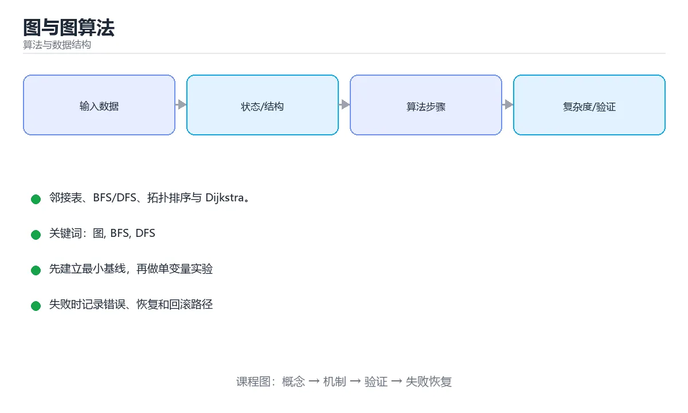

# 图与图算法



> 内容更新时间：2026-10-03 · 学习阶段：高级 · 预计用时：17 分钟

## 学习目标

- 能用自己的话解释「图与图算法」解决了什么问题，而不是只背术语。
- 能说清 「图」、「BFS」、「DFS」、「拓扑排序」 之间的关系，并分别举出一个例子。
- 能把本课知识放回「算法与数据结构」的知识体系，说明它和相邻主题的边界。
- 能完成本课练习，并用验收标准检查自己的结果。

> 一句话摘要：邻接表、BFS/DFS、拓扑排序与 Dijkstra。

## 前置知识

- 先完成上一课《树与二叉搜索树》；如果已经掌握，可以直接用本课练习自测。
- 本课阶段：高级。建议具备同一方向的完整基础，能阅读较长的代码、配置或系统设计说明。
- 开始前先复习：图、BFS、DFS。
- 如果某一步看不懂，先记录具体卡点，完成练习后再回头读一遍。


## 图的表示

```python
# 邻接表：稀疏图首选，空间 O(V + E)
graph = {
    "A": ["B", "C"],
    "B": ["D"],
    "C": ["D", "E"],
    "D": ["E"],
    "E": [],
}

# 邻接矩阵：稠密图或需要 O(1) 判断两点是否相邻时使用，空间 O(V²)
matrix = [
    [0, 1, 1, 0, 0],
    [0, 0, 0, 1, 0],
    [0, 0, 0, 1, 1],
    [0, 0, 0, 0, 1],
    [0, 0, 0, 0, 0],
]
```

## 深度优先与广度优先

```python
def dfs(graph, start, visited=None):
    visited = visited or set()
    visited.add(start)
    result = [start]
    for neighbor in graph[start]:
        if neighbor not in visited:
            result += dfs(graph, neighbor, visited)
    return result

from collections import deque

def bfs(graph, start):
    visited, queue, order = {start}, deque([start]), []
    while queue:
        node = queue.popleft()
        order.append(node)
        for neighbor in graph[node]:
            if neighbor not in visited:
                visited.add(neighbor)
                queue.append(neighbor)
    return order
```

- DFS 用栈/递归，适合找路径、连通分量、环检测。
- BFS 用队列，适合无权图最短路、层序遍历。

## 拓扑排序

有向无环图（DAG）的线性排序，用于任务调度与依赖解析：

```python
def topological_sort(graph):
    indegree = {node: 0 for node in graph}
    for neighbors in graph.values():
        for neighbor in neighbors:
            indegree[neighbor] += 1
    queue = deque([n for n, d in indegree.items() if d == 0])
    order = []
    while queue:
        node = queue.popleft()
        order.append(node)
        for neighbor in graph[node]:
            indegree[neighbor] -= 1
            if indegree[neighbor] == 0:
                queue.append(neighbor)
    return order if len(order) == len(graph) else []   # 空表示存在环
```

## 最短路径

```python
import heapq

def dijkstra(graph, start):
    dist = {node: float("inf") for node in graph}
    dist[start] = 0
    heap = [(0, start)]
    while heap:
        d, node = heapq.heappop(heap)
        if d > dist[node]:
            continue
        for neighbor, weight in graph[node]:
            new_dist = d + weight
            if new_dist < dist[neighbor]:
                dist[neighbor] = new_dist
                heapq.heappush(heap, (new_dist, neighbor))
    return dist
```

Dijkstra 要求边权非负；有负权用 Bellman-Ford，多源最短路用 Floyd-Warshall。

## 三种遍历的对比与选择

```python
# BFS：队列，按层扩展
from collections import deque
def bfs(graph, start):
    seen, queue = {start}, deque([start])
    while queue:
        node = queue.popleft()
        for nxt in graph[node]:
            if nxt not in seen:
                seen.add(nxt); queue.append(nxt)

# DFS：递归或显式栈
def dfs(graph, node, seen=None):
    seen = seen or set()
    seen.add(node)
    for nxt in graph[node]:
        if nxt not in seen:
            dfs(graph, nxt, seen)

# Dijkstra：优先队列按距离出队（仅适用于非负权）
import heapq
def dijkstra(graph, start):
    dist = {start: 0}; heap = [(0, start)]
    while heap:
        d, node = heapq.heappop(heap)
        if d > dist.get(node, float("inf")): continue
        for nxt, w in graph[node]:
            nd = d + w
            if nd < dist.get(nxt, float("inf")):
                dist[nxt] = nd; heapq.heappush(heap, (nd, nxt))
    return dist
```

| 算法 | 数据结构 | 复杂度 | 适用 |
| --- | --- | --- | --- |
| BFS | 队列 | O(V+E) | 无权最短路、层序、连通分量 |
| DFS | 栈/递归 | O(V+E) | 路径枚举、环检测、拓扑排序基础 |
| Dijkstra | 优先队列 | O((V+E)log V) | 非负权最短路 |

实现上最常见的三个错误：**忘记标记已访问导致重复入队**（内存暴涨）、**Dijkstra 用普通队列导致复杂度退化**、**在稠密图上用邻接表却仍按 O(V²) 遍历**。

## 本课小结
图算法先分清三件事：**有没有方向、有没有权重、要不要环**。BFS/DFS 是基础，拓扑排序解决依赖，Dijkstra 解决非负权最短路。


## 图表示与算法选型

| 目的 | 算法 | 复杂度 | 前提 |
| --- | --- | --- | --- |
| 遍历所有节点 | DFS / BFS | O(V+E) | 无 |
| 无权最短路 | BFS | O(V+E) | 边权相等 |
| 非负权最短路 | Dijkstra | O((V+E)log V) | 边权非负 |
| 含负权最短路 | Bellman-Ford | O(VE) | 可检测负环 |
| 多源最短路 | Floyd-Warshall | O(V³) | 小图 |
| 最小生成树 | Kruskal / Prim | O(E log E) | 无向连通图 |
| 拓扑排序 | Kahn / DFS | O(V+E) | 有向无环图 |
| 连通分量 | DFS / 并查集 | O(V+E) | 无向图 |
| 强连通分量 | Tarjan / Kosaraju | O(V+E) | 有向图 |
| 二分图判定 | 染色 BFS | O(V+E) | 无向图 |

存储方式对照：

| 方式 | 空间 | 适合 | 判断两点相邻 |
| --- | --- | --- | --- |
| 邻接矩阵 | O(V²) | 稠密图、需快速查边 | O(1) |
| 邻接表 | O(V+E) | 稀疏图（大多数场景） | O(deg(v)) |
| 边列表 | O(E) | 只需要遍历边（Kruskal） | O(E) |

```python
from collections import deque
import heapq

def dijkstra(graph, start):
    """graph: {节点: [(邻居, 权重), ...]}，返回最短距离字典。"""
    dist = {start: 0}
    heap = [(0, start)]
    while heap:
        d, node = heapq.heappop(heap)
        if d > dist.get(node, float("inf")):
            continue                       # 过期条目，跳过
        for nxt, weight in graph.get(node, []):
            nd = d + weight
            if nd < dist.get(nxt, float("inf")):
                dist[nxt] = nd
                heapq.heappush(heap, (nd, nxt))
    return dist


def topo_sort(graph, indegree):
    """Kahn 算法：入度为 0 入队，逐个出队削减邻居入度。"""
    queue = deque([n for n in indegree if indegree[n] == 0])
    order = []
    while queue:
        node = queue.popleft()
        order.append(node)
        for nxt in graph.get(node, []):
            indegree[nxt] -= 1
            if indegree[nxt] == 0:
                queue.append(nxt)
    return order if len(order) == len(indegree) else []   # 空表示有环
```

## 常见错误对照表

| 容易写错的做法 | 实际现象 | 原因与正确做法 |
| --- | --- | --- |
| BFS 用栈实现 | 变成 DFS，最短路不成立 | BFS 必须用队列 |
| 访问标记在出队时才加 | 同一节点重复入队 | 入队时立即标记 |
| Dijkstra 处理负权 | 结果错误 | 负权用 Bellman-Ford 或 SPFA |
| Dijkstra 不跳过过期堆元素 | 复杂度上升、可能错 | 比较弹出距离与记录距离 |
| 无向图只加一条边 | 反向不可达 | 两个方向都要加 |
| 邻接矩阵用于稀疏大图 | 内存爆掉 | 用邻接表 |
| 拓扑排序不检测环 | 结果缺少节点却当成合法 | 检查输出长度是否等于节点数 |
| 递归 DFS 在深图溢出 | 栈溢出 | 改迭代或增大递归深度 |
| 并查集用于有向图连通性 | 结果错误 | 有向图用 SCC 算法 |
| 忘记孤立节点 | 遍历漏节点 | 从每个未访问节点启动遍历 |

## 自测清单

- [ ] 能按权重与图规模选对最短路算法。
- [ ] BFS 一定用队列并在入队时标记访问。
- [ ] Dijkstra 用优先队列并跳过过期条目。
- [ ] 会根据稠密/稀疏选择邻接矩阵或邻接表。
- [ ] 拓扑排序会检查是否存在环。

## 动手练习


> 本课练习重点：围绕「图、BFS、DFS」完成复述、实验和交付，每个结果都要能被别人检查。

先手算 8 个元素的状态变化，再实现并统计操作次数与复杂度。

### 练习 1：建立心智模型（10 分钟）

合上教程，用 3～5 句话回答：

1. 「图与图算法」解决了什么问题？
2. 如果没有它，会出现什么具体后果？
3. 它和「BFS」是什么关系？

**验收标准**：至少出现一个本课关键词，并写出一个反例、边界条件或失效场景。

### 练习 2：做一次可控实验（20 分钟）

从正文中选一个最小示例，完成以下操作：

1. 先预测修改一个参数、输入或步骤后的结果。
2. 再实际执行或逐步推演，记录真实结果。
3. 如果结果与预测不同，写出差异原因。

**验收标准**：留下「原例 → 改动 → 预测 → 结果 → 原因」五步记录。

### 练习 3：交付一个小结果（30 分钟）

给定 8～12 个手工构造的数据，写出每一步状态，并统计比较或交换次数。

任务要求：

- 结果必须能被别人检查，不能只写“我已经理解了”。
- 至少覆盖「图」和「BFS」两个关键词。
- 写出 1 个仍然不确定的问题，以及下一步如何验证。

> 提示：时间有限时优先做练习 1 和练习 2；练习 3 可以拆成两次完成。


## 考点精讲：把测验题还原成判断过程

本课有 5 个判断点。先自己作答，再看「判断依据」；如果结论正确但理由不完整，回到正文对应章节补足概念。

### 考点 1：表示稀疏图通常选择？

- **正确判断**：邻接表
- **判断依据**：邻接表空间是 O(V+E)，稀疏图下远小于矩阵的 O(V²)。其他选项：稀疏图边数与点数同阶，邻接表更省空间。邻接矩阵是 O(V²)，只适合稠密图。正确项「邻接表」描述正确，能够解释题干场景中的现象与结果。错误项「哈希集合」与课程给出的定义相冲突，不能回答题目所问。错误项「二维数组」适用于其他场景，但与本题的前提不匹配。把题干「表示稀疏图通常选择？」放回《图与图算法》的「邻接表、BFS/DFS、拓扑排序与 Dijkstra」语境，逐项对照定义与边界条件，就能排除其余说法。
- **迁移检查**：遮住选项，只根据定义复述一次答案，再回来看哪个选项与复述一致。

### 考点 2：求无权图两点间最短路径应使用？

- **正确判断**：BFS
- **判断依据**：BFS 按层扩展，第一次到达目标即是最短路径。其他选项：无权图的最短路就是最少边数，BFS 按层扩展即可。Dijkstra 面向带权图，DFS 与拓扑排序不保证最短。正确项「BFS」既符合定义也满足题干限定的场景，因此应当选择。把题干「求无权图两点间最短路径应使用？」放回《图与图算法》的「邻接表、BFS/DFS、拓扑排序与 Dijkstra」语境，逐项对照定义与边界条件，就能排除其余说法。
- **迁移检查**：把题干里的一个条件换成边界值，原来的结论还成立吗？写出判断过程。

### 考点 3：Dijkstra 算法的前提是？

- **正确判断**：边权非负
- **判断依据**：存在负权边时贪心选择不成立，需要改用 Bellman-Ford。其他选项：Dijkstra 要求边权非负，否则已确定的距离会被负权边推翻，此时应改用 Bellman-Ford。正确项「边权非负」是该问题的规范说法，换成其他表述都会丢失条件。错误项「图必须是树」把因果关系颠倒了，不能作为正确结论。错误项「边权必须为负」忽略了题目中的限制条件，因此不成立。错误项「必须是有向图」属于相邻主题的说法，范围与本题要求不一致。把题干「Dijkstra 算法的前提是？」放回《图与图算法》的「邻接表、BFS/DFS、拓扑排序与 Dijkstra」语境，逐项对照定义与边界条件，就能排除其余说法。
- **迁移检查**：把题干里的一个条件换成边界值，原来的结论还成立吗？写出判断过程。

### 考点 4：深度优先搜索（DFS）的典型实现方式是？

- **正确判断**：递归，或用显式栈模拟递归
- **判断依据**：图很深时递归可能栈溢出，工程实现常改成显式栈或增大栈空间。其他选项：DFS 用递归或显式栈实现。优先队列属于 Dijkstra/Prim，并查集用于连通性与成环判定。正确项「递归，或用显式栈模拟递归」正面回答了题目所问，符合课程给出的定义与适用范围。错误项「只能用于有向图」属于相邻主题的说法，范围与本题要求不一致。错误项「必须使用优先队列」与课程给出的定义相冲突，不能回答题目所问。错误项「必须使用并查集」只看到了表面现象，没有解释题干真正考查的机制。把题干「深度优先搜索（DFS）的典型实现方式是？」放回《图与图算法》的「邻接表、BFS/DFS、拓扑排序与 Dijkstra」语境，逐项对照定义与边界条件，就能排除其余说法。
- **迁移检查**：遮住选项，只根据定义复述一次答案，再回来看哪个选项与复述一致。

### 考点 5：拓扑排序存在的必要条件是？

- **正确判断**：有向图不存在环（是 DAG）
- **判断依据**：Kahn 算法（不断取出入度为 0 的点）若无法输出全部节点就说明存在环。其他选项：拓扑排序只对有向无环图成立。连通性、边权符号、是否有向都不是判定条件。正确项「有向图不存在环（是 DAG）」既符合定义也满足题干限定的场景，因此应当选择。错误项「边的权值必须为正」把因果关系颠倒了，不能作为正确结论。错误项「图必须是无向图」忽略了题目中的限制条件，因此不成立。错误项「图必须连通」属于相邻主题的说法，范围与本题要求不一致。把题干「拓扑排序存在的必要条件是？」放回《图与图算法》的「邻接表、BFS/DFS、拓扑排序与 Dijkstra」语境，逐项对照定义与边界条件，就能排除其余说法。
- **迁移检查**：遮住选项，只根据定义复述一次答案，再回来看哪个选项与复述一致。

## 本课复习清单

离开本课前，逐项确认：

- [ ] 不看解析，能说出「表示稀疏图通常选择？」的判断依据。
- [ ] 不看解析，能说出「求无权图两点间最短路径应使用？」的判断依据。
- [ ] 不看解析，能说出「Dijkstra 算法的前提是？」的判断依据。
- [ ] 不看解析，能说出「深度优先搜索（DFS）的典型实现方式是？」的判断依据。
- [ ] 不看解析，能说出「拓扑排序存在的必要条件是？」的判断依据。
- [ ] 至少运行一次本课示例，记录输入、输出和一个边界情况。
- [ ] 把本课最容易混淆的两个概念写成一句话对照。

| 复盘项 | 记录 |
| --- | --- |
| 已经能独立解释的考点 |  |
| 仍然说不清的概念 |  |
| 下一步验证动作 |  |

## English Overview

**Title:** Graphs

**Summary:** Representations, BFS/DFS, topo sort and Dijkstra.

**Category:** Algorithms  
**Level:** 高级  
**Key terms:** 图, BFS, DFS, 拓扑排序, Dijkstra

> The full tutorial is written in Chinese. This bilingual overview helps English readers identify the topic, scope and key terms before studying the detailed examples.

## 内容元数据

- 内容版本：v2.0
- 最后更新：2026-10-03
- 学习阶段：高级
- 适用环境：任意主流语言（伪代码与复杂度为主）
- 内容来源：内置结构化课程与工程实践整理
- 相关主题：图、BFS、DFS、拓扑排序、Dijkstra
- 质量版本：P0 测验标准 + P1 覆盖扩展 + P2 体验补全


## 参考资料与复核

- 最后复核：2026-10-04
- 下次复核：2027-04-04
- 复核范围：版本兼容、API 行为、安全建议与工程实践
- 来源性质：官方文档与标准；本课正文为离线教学重组，不复制原文

| 参考资料 | 本课用途 |
| --- | --- |
| [CP-Algorithms](https://cp-algorithms.com/) | 算法实现与复杂度 |
| [MIT OpenCourseWare 6.006](https://ocw.mit.edu/courses/6-006-introduction-to-algorithms-spring-2020/) | 算法设计与分析 |

> 本课主题：邻接表、BFS/DFS、拓扑排序与 Dijkstra。

> App 完全离线展示文字链接，不会自动联网；需要延伸阅读时可复制链接到浏览器。

