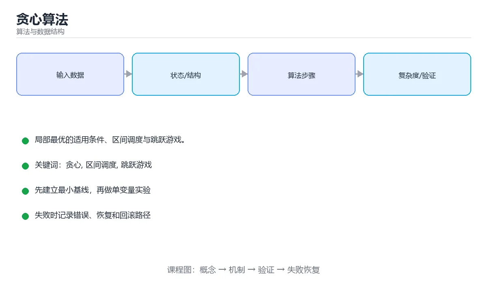

# 贪心算法



> 内容更新时间：2026-10-03 · 学习阶段：进阶 · 预计用时：15 分钟

## 学习目标

- 能用自己的话解释「贪心算法」解决了什么问题，而不是只背术语。
- 能说清 「贪心」、「区间调度」、「跳跃游戏」、「交换论证」 之间的关系，并分别举出一个例子。
- 能把本课知识放回「算法与数据结构」的知识体系，说明它和相邻主题的边界。
- 能完成本课练习，并用验收标准检查自己的结果。

> 一句话摘要：局部最优的适用条件、区间调度与跳跃游戏。

## 前置知识

- 先完成上一课《回溯算法》；如果已经掌握，可以直接用本课练习自测。
- 本课阶段：进阶。建议先掌握同一分类的基础课程，并能独立运行正文中的最小示例。
- 开始前先复习：贪心、区间调度、跳跃游戏。
- 如果某一步看不懂，先记录具体卡点，完成练习后再回头读一遍。


## 核心思想

每一步都选择当前看起来最优的方案，并且**不回头**。它比动态规划更快，但只有满足特定性质时才能得到全局最优。

```text
贪心可行 = 贪心选择性质 + 最优子结构
```

- **贪心选择性质**：局部最优选择能构成全局最优解的一部分。
- **最优子结构**：问题的最优解包含子问题的最优解。

不满足时，贪心会给出「看起来合理但错误」的答案——这也是面试常考的陷阱。

## 经典一：区间调度

在互不重叠的前提下安排最多会议，按**结束时间**升序贪心：

```python
def max_meetings(intervals):
    intervals.sort(key=lambda item: item[1])   # 按结束时间排序
    count, last_end = 0, float("-inf")
    for start, end in intervals:
        if start >= last_end:                  # 不冲突就选它
            count += 1
            last_end = end
    return count
```

为什么按结束时间而不是开始时间？因为结束越早，留给后面的空间越大。可以用交换论证（exchange argument）证明。

## 经典二：零钱兑换（面值规范时）

```python
def coin_change_greedy(coins, amount):
    coins.sort(reverse=True)
    count, remaining = 0, amount
    for coin in coins:
        used, remaining = divmod(remaining, coin)
        count += used
    return count if remaining == 0 else -1
```

注意：面值为 `[1, 3, 4]` 时，凑 6 元贪心得 `4+1+1`（3 枚），最优是 `3+3`（2 枚）。**只有面值满足规范性质（如人民币）贪心才成立**，否则要用动态规划。

## 经典三：跳跃游戏

```python
def can_jump(nums):
    farthest = 0
    for i, step in enumerate(nums):
        if i > farthest:              # 当前位置不可达，说明失败
            return False
        farthest = max(farthest, i + step)
    return True

def jump_times(nums):
    jumps = current_end = farthest = 0
    for i in range(len(nums) - 1):
        farthest = max(farthest, i + nums[i])
        if i == current_end:          # 到达当前区间边界，必须再跳一次
            jumps += 1
            current_end = farthest
    return jumps
```

## 贪心 vs 动态规划

| 对比 | 贪心 | 动态规划 |
| --- | --- | --- |
| 决策方式 | 只看当前最优，不回头 | 枚举并比较所有子问题 |
| 复杂度 | 通常 O(n log n) 或 O(n) | 通常 O(n²) 或更高 |
| 正确性 | 需要证明 | 只要状态与转移正确即可 |
| 典型题 | 区间调度、霍夫曼编码 | 背包、最长递增子序列 |

## 如何判断能不能贪心

1. 先尝试举反例：换一个数据，贪心结果是否变差？
2. 能举出反例就改用动态规划。
3. 举不出反例时，尝试用交换论证或归纳法证明（面试中简单说明思路即可）。

## 本课小结
贪心的代码往往只有十几行，难点在**证明它是对的**。写之前先问自己：这个局部选择会不会堵死更优的全局解？


## 经典贪心问题速查

| 问题 | 贪心策略 | 是否总能最优 |
| --- | --- | --- |
| 活动选择 / 最多不重叠会议 | 按结束时间升序选 | 是 |
| 区间覆盖 | 按起点排序，尽量延伸 | 是 |
| 最小硬币数 | 每次取最大面值 | 仅面值体系规范时（如 1/5/10/25） |
| 分数背包 | 按单位价值降序装 | 是 |
| 0/1 背包 | 无法贪心 | 需要 DP |
| 哈夫曼编码 | 每次合并最小的两个 | 是 |
| 最小生成树（Kruskal） | 按边权升序加边且不成环 | 是 |
| 最小生成树（Prim） | 每次选连接已选集合的最小边 | 是 |
| 最短路（Dijkstra） | 每次确定最小距离节点 | 是（边权非负） |
| 任务调度 | 按截止时间排序，用堆维护 | 是 |

## 贪心与动态规划对照

| 维度 | 贪心 | 动态规划 |
| --- | --- | --- |
| 决策方式 | 每步只做局部最优且不回溯 | 保留多个子问题解并比较 |
| 是否需证明 | 必须证明贪心选择性质与最优子结构 | 只需最优子结构与重叠子问题 |
| 复杂度 | 通常 O(n log n) 或 O(n) | 常为 O(n²) 或 O(nW) |
| 风险 | 直觉错误就得到次优解 | 较难写错但更慢 |
| 验证方法 | 找反例、数学归纳、交换论证 | 与暴力搜索对比小规模结果 |

```python
import heapq

def max_meetings(intervals):
    """最多不重叠会议：按结束时间升序贪心。"""
    intervals = sorted(intervals, key=lambda x: x[1])
    count, last_end = 0, float("-inf")
    for start, end in intervals:
        if start >= last_end:
            count += 1
            last_end = end
    return count


def min_coins(coins, amount):
    """硬币找零：面值不保证规范时必须用 DP，这里给出通用解。"""
    dp = [float("inf")] * (amount + 1)
    dp[0] = 0
    for value in range(1, amount + 1):
        for coin in coins:
            if coin <= value:
                dp[value] = min(dp[value], dp[value - coin] + 1)
    return -1 if dp[amount] == float("inf") else dp[amount]


def schedule_tasks(tasks):
    """按截止时间安排任务，超期时丢弃最耗时的任务。"""
    tasks.sort(key=lambda t: t[1])
    chosen, total = [], 0
    for duration, deadline in tasks:
        total += duration
        heapq.heappush(chosen, -duration)
        if total > deadline:
            total += heapq.heappop(chosen)   # 弹出的负数等于减去该耗时
    return len(chosen)
```

## 常见错误对照表

| 容易写错的做法 | 实际现象 | 原因与正确做法 |
| --- | --- | --- |
| 凭直觉用贪心不验证 | 得到次优解 | 先找反例或用小规模暴力对比 |
| 硬币问题默认贪心可行 | 面值 1/3/4 凑 6 时出错 | 只有规范体系才成立，否则用 DP |
| 活动选择按开始时间排序 | 结果不是最多 | 应按结束时间排序 |
| 0/1 背包用单位价值贪心 | 超重或次优 | 用 DP |
| 贪心选择后无法回退 | 后续无解 | 确认问题具备贪心选择性质 |
| 忽略排序成本 | 复杂度估计偏低 | 通常需 O(n log n) 排序 |
| 用贪心求全局最优但不证明 | 隐含错误 | 用交换论证或归纳法证明 |
| 时间区间边界处理不清 | 端点半开半闭判断错 | 明确区间开闭并统一 |
| 只测正常用例 | 边界反例漏掉 | 覆盖相等端点、空集、单元素 |
| 用贪心替代匹配类算法 | 结果不是最优 | 匹配问题用匈牙利或网络流 |

## 自测清单

- [ ] 能说出贪心成立的两个条件。
- [ ] 活动选择按结束时间排序。
- [ ] 知道硬币找零何时贪心成立、何时必须 DP。
- [ ] 会用交换论证或反例验证贪心正确性。
- [ ] 能区分贪心与 DP 的适用边界。

## 动手练习


> 本课练习重点：围绕「贪心、区间调度、跳跃游戏」完成复述、实验和交付，每个结果都要能被别人检查。

先手算 8 个元素的状态变化，再实现并统计操作次数与复杂度。

### 练习 1：建立心智模型（10 分钟）

合上教程，用 3～5 句话回答：

1. 「贪心算法」解决了什么问题？
2. 如果没有它，会出现什么具体后果？
3. 它和「区间调度」是什么关系？

**验收标准**：至少出现一个本课关键词，并写出一个反例、边界条件或失效场景。

### 练习 2：做一次可控实验（20 分钟）

从正文中选一个最小示例，完成以下操作：

1. 先预测修改一个参数、输入或步骤后的结果。
2. 再实际执行或逐步推演，记录真实结果。
3. 如果结果与预测不同，写出差异原因。

**验收标准**：留下「原例 → 改动 → 预测 → 结果 → 原因」五步记录。

### 练习 3：交付一个小结果（30 分钟）

给定 8～12 个手工构造的数据，写出每一步状态，并统计比较或交换次数。

任务要求：

- 结果必须能被别人检查，不能只写“我已经理解了”。
- 至少覆盖「贪心」和「区间调度」两个关键词。
- 写出 1 个仍然不确定的问题，以及下一步如何验证。

> 提示：时间有限时优先做练习 1 和练习 2；练习 3 可以拆成两次完成。


## 考点精讲：把测验题还原成判断过程

本课有 5 个判断点。先自己作答，再看「判断依据」；如果结论正确但理由不完整，回到正文对应章节补足概念。

### 考点 1：安排最多不重叠会议应按什么排序？

- **正确判断**：结束时间
- **判断依据**：结束越早留给后续的余地越大。其他选项：按结束时间升序能留出最多剩余时间，这是活动选择的经典贪心。按时长或开始时间都不保证最优。正确项「结束时间」描述正确，能够解释题干场景中的现象与结果。错误项「随机」只看到了表面现象，没有解释题干真正考查的机制。把题干「安排最多不重叠会议应按什么排序？」放回《贪心算法》的「局部最优的适用条件、区间调度与跳跃游戏」语境，逐项对照定义与边界条件，就能排除其余说法。
- **迁移检查**：把题干里的一个条件换成边界值，原来的结论还成立吗？写出判断过程。

### 考点 2：贪心能得到全局最优的前提是？

- **正确判断**：满足贪心选择性质与最优子结构
- **判断依据**：缺少这两个性质时局部最优可能堵死全局最优。其他选项：贪心成立需要贪心选择性质与最优子结构，通常要用交换论证或反例验证。正确项「满足贪心选择性质与最优子结构」正面回答了题目所问，符合课程给出的定义与适用范围。错误项「数据量小（仅部分场景成立）」把不同概念混在一起，缺少题干限定的前提。错误项「必须排序」与课程给出的定义相冲突，不能回答题目所问。错误项「必须递归」只看到了表面现象，没有解释题干真正考查的机制。把题干「贪心能得到全局最优的前提是？」放回《贪心算法》的「局部最优的适用条件、区间调度与跳跃游戏」语境，逐项对照定义与边界条件，就能排除其余说法。
- **迁移检查**：把题干里的一个条件换成边界值，原来的结论还成立吗？写出判断过程。

### 考点 3：面值 [1,3,4] 凑 6，贪心得 3 枚而最优为 2 枚，说明？

- **正确判断**：该面值体系不满足贪心性质
- **判断依据**：其他选项：该反例说明面值体系不满足贪心性质（不是规范体系），必须改用动态规划。「应先排序」忽略了题目中的限制条件，因此不成立。正确项「该面值体系不满足贪心性质」抓住了题干的核心条件，是经得起边界检验的表述。错误项「应先用小面值」只看到了表面现象，没有解释题干真正考查的机制。错误项「贪心一定错」在边界或失败路径上会得出错误结果。把题干「面值 [1,3,4] 凑 6，贪心得 3 枚而最优为 2 枚，说明？」放回《贪心算法》的「局部最优的适用条件、区间调度与跳跃游戏」语境，逐项对照定义与边界条件，就能排除其余说法。
- **迁移检查**：把题干里的一个条件换成边界值，原来的结论还成立吗？写出判断过程。

### 考点 4：哈夫曼编码为什么属于贪心算法？

- **正确判断**：每一步都合并当前频率最小的两个节点
- **判断依据**：「局部最优可导出全局最优」是贪心成立的核心，哈夫曼给出了严格证明。其他选项：哈夫曼每步合并频率最小的两个节点，可用交换论证证明最优。它不枚举全部方案，也不查表。正确项「每一步都合并当前频率最小的两个节点」既符合定义也满足题干限定的场景，因此应当选择。错误项「它随机选择合并对象」把因果关系颠倒了，不能作为正确结论。错误项「它使用动态规划表」忽略了题目中的限制条件，因此不成立。错误项「它枚举了所有编码方案」属于相邻主题的说法，范围与本题要求不一致。把题干「哈夫曼编码为什么属于贪心算法？」放回《贪心算法》的「局部最优的适用条件、区间调度与跳跃游戏」语境，逐项对照定义与边界条件，就能排除其余说法。
- **迁移检查**：把题干里的一个条件换成边界值，原来的结论还成立吗？写出判断过程。

### 考点 5：贪心与动态规划最典型的区别是？

- **正确判断**：贪心每步只做局部最优选择且不回溯
- **判断依据**：不确定贪心是否成立时，先写出 DP 再证明单调性往往更稳妥。其他选项：本质区别是贪心不回溯、DP 保留并组合子问题解。「贪心总能得到全局最优」与「两者等价」都是错误认知。正确项「贪心每步只做局部最优选择且不回溯」描述正确，能够解释题干场景中的现象与结果。错误项「DP 不需要状态定义」只看到了表面现象，没有解释题干真正考查的机制。错误项「两者完全等价」适用于其他场景，但与本题的前提不匹配，在题干「贪心与动态规划最典型的区别是？」的语境下并不成立。把题干「贪心与动态规划最典型的区别是？」放回《贪心算法》的「局部最优的适用条件、区间调度与跳跃游戏」语境，逐项对照定义与边界条件，就能排除其余说法。
- **迁移检查**：如果给某个错误选项去掉一个限定词，它会不会变成正确？说明理由。

## 本课复习清单

离开本课前，逐项确认：

- [ ] 不看解析，能说出「安排最多不重叠会议应按什么排序？」的判断依据。
- [ ] 不看解析，能说出「贪心能得到全局最优的前提是？」的判断依据。
- [ ] 不看解析，能说出「面值 [1,3,4] 凑 6，贪心得 3 枚而最优为 2 枚，说明？」的判断依据。
- [ ] 不看解析，能说出「哈夫曼编码为什么属于贪心算法？」的判断依据。
- [ ] 不看解析，能说出「贪心与动态规划最典型的区别是？」的判断依据。
- [ ] 至少运行一次本课示例，记录输入、输出和一个边界情况。
- [ ] 把本课最容易混淆的两个概念写成一句话对照。

| 复盘项 | 记录 |
| --- | --- |
| 已经能独立解释的考点 |  |
| 仍然说不清的概念 |  |
| 下一步验证动作 |  |

## English Overview

**Title:** Greedy Algorithms

**Summary:** When greedy works.

**Category:** Algorithms  
**Level:** 进阶  
**Key terms:** 贪心, 区间调度, 跳跃游戏, 交换论证

> The full tutorial is written in Chinese. This bilingual overview helps English readers identify the topic, scope and key terms before studying the detailed examples.

## 内容元数据

- 内容版本：v2.0
- 最后更新：2026-10-03
- 学习阶段：进阶
- 适用环境：任意主流语言（伪代码与复杂度为主）
- 内容来源：内置结构化课程与工程实践整理
- 相关主题：贪心、区间调度、跳跃游戏、交换论证
- 质量版本：P0 测验标准 + P1 覆盖扩展 + P2 体验补全


## 参考资料与复核

- 最后复核：2026-10-04
- 下次复核：2027-04-04
- 复核范围：版本兼容、API 行为、安全建议与工程实践
- 来源性质：官方文档与标准；本课正文为离线教学重组，不复制原文

| 参考资料 | 本课用途 |
| --- | --- |
| [CP-Algorithms](https://cp-algorithms.com/) | 算法实现与复杂度 |
| [MIT OpenCourseWare 6.006](https://ocw.mit.edu/courses/6-006-introduction-to-algorithms-spring-2020/) | 算法设计与分析 |

> 本课主题：局部最优的适用条件、区间调度与跳跃游戏。

> App 完全离线展示文字链接，不会自动联网；需要延伸阅读时可复制链接到浏览器。

