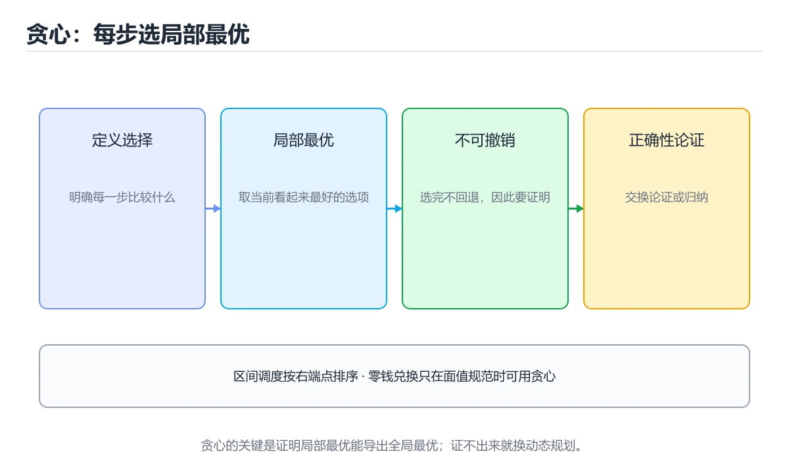

# 贪心算法

> 内容更新时间：2026-10-06 · 学习阶段：进阶 · 预计用时：35 分钟




## 学习目标

- 能用自己的话解释贪心算法解决了什么问题，而不是只背术语。
- 能说清 「贪心」、「区间调度」、「跳跃游戏」、「交换论证」 之间的关系，并分别举出一个例子。
- 能把 贪心 放回「贪心算法」的知识体系，说明它和 区间调度 的边界。
- 能完成本课练习，并用验收标准检查自己的结果。

> 一句话摘要：局部最优的适用条件、区间调度与跳跃游戏。

## 前置知识

- 先完成上一课《回溯算法》；如果已经掌握，可以直接用本课练习自测。
- 本课阶段：进阶。建议先完成「回溯算法」，或确认自己能独立跑通正文里的 coin_change_greedy 示例。
- 开始前先复习：贪心、区间调度、跳跃游戏。
- 如果 核心思想 这一步看不懂，先记录具体卡点，再用 coin_change_greedy 复现一遍。

## 核心思想

每一步都选择当前看起来最优的方案，并且**不回头**。它比动态规划更快，但只有满足特定性质时才能得到全局最优。

```text
贪心可行 = 贪心选择性质 + 最优子结构
```

- **贪心选择性质**：局部最优选择能构成全局最优解的一部分。
- **最优子结构**：问题的最优解包含子问题的最优解。

不满足时，贪心会给出「看起来合理但错误」的答案——这也是面试常考的陷阱。

## 经典一：区间调度

在互不重叠的前提下安排最多会议，按**结束时间**升序贪心：

```python
def max_meetings(intervals):
    intervals.sort(key=lambda item: item[1])   # 按结束时间排序
    count, last_end = 0, float("-inf")
    for start, end in intervals:
        if start >= last_end:                  # 不冲突就选它
            count += 1
            last_end = end
    return count
```

为什么按结束时间而不是开始时间？因为结束越早，留给后面的空间越大。可以用交换论证（exchange argument）证明。

## 经典二：零钱兑换（面值规范时）

```python
def coin_change_greedy(coins, amount):
    coins.sort(reverse=True)
    count, remaining = 0, amount
    for coin in coins:
        used, remaining = divmod(remaining, coin)
        count += used
    return count if remaining == 0 else -1
```

注意：面值为 `[1, 3, 4]` 时，凑 6 元贪心得 `4+1+1`（3 枚），最优是 `3+3`（2 枚）。**只有面值满足规范性质（如人民币）贪心才成立**，否则要用动态规划。

## 经典三：跳跃游戏

```python
def can_jump(nums):
    farthest = 0
    for i, step in enumerate(nums):
        if i > farthest:              # 当前位置不可达，说明失败
            return False
        farthest = max(farthest, i + step)
    return True

def jump_times(nums):
    jumps = current_end = farthest = 0
    for i in range(len(nums) - 1):
        farthest = max(farthest, i + nums[i])
        if i == current_end:          # 到达当前区间边界，必须再跳一次
            jumps += 1
            current_end = farthest
    return jumps
```

## 贪心 vs 动态规划

| 对比 | 贪心 | 动态规划 |
| --- | --- | --- |
| 决策方式 | 只看当前最优，不回头 | 枚举并比较所有子问题 |
| 复杂度 | 通常 O(n log n) 或 O(n) | 通常 O(n²) 或更高 |
| 正确性 | 需要证明 | 只要状态与转移正确即可 |
| 典型题 | 区间调度、霍夫曼编码 | 背包、最长递增子序列 |

## 如何判断能不能贪心

1. 先尝试举反例：换一个数据，贪心结果是否变差？
2. 能举出反例就改用动态规划。
3. 举不出反例时，尝试用交换论证或归纳法证明（面试中简单说明思路即可）。

## 本课小结

贪心的代码往往只有十几行，难点在**证明它是对的**。写之前先问自己：这个局部选择会不会堵死更优的全局解？

## 经典贪心问题速查

| 问题 | 贪心策略 | 是否总能最优 |
| --- | --- | --- |
| 活动选择 / 最多不重叠会议 | 按结束时间升序选 | 是 |
| 区间覆盖 | 按起点排序，尽量延伸 | 是 |
| 最小硬币数 | 每次取最大面值 | 仅面值体系规范时（如 1/5/10/25） |
| 分数背包 | 按单位价值降序装 | 是 |
| 0/1 背包 | 无法贪心 | 需要 DP |
| 哈夫曼编码 | 每次合并最小的两个 | 是 |
| 最小生成树（Kruskal） | 按边权升序加边且不成环 | 是 |
| 最小生成树（Prim） | 每次选连接已选集合的最小边 | 是 |
| 最短路（Dijkstra） | 每次确定最小距离节点 | 是（边权非负） |
| 任务调度 | 按截止时间排序，用堆维护 | 是 |

## 贪心与动态规划对照

| 维度 | 贪心 | 动态规划 |
| --- | --- | --- |
| 决策方式 | 每步只做局部最优且不回溯 | 保留多个子问题解并比较 |
| 是否需证明 | 必须证明贪心选择性质与最优子结构 | 只需最优子结构与重叠子问题 |
| 复杂度 | 通常 O(n log n) 或 O(n) | 常为 O(n²) 或 O(nW) |
| 风险 | 直觉错误就得到次优解 | 较难写错但更慢 |
| 验证方法 | 找反例、数学归纳、交换论证 | 与暴力搜索对比小规模结果 |

```python
import heapq

def max_meetings(intervals):
    """最多不重叠会议：按结束时间升序贪心。"""
    intervals = sorted(intervals, key=lambda x: x[1])
    count, last_end = 0, float("-inf")
    for start, end in intervals:
        if start >= last_end:
            count += 1
            last_end = end
    return count

def min_coins(coins, amount):
    """硬币找零：面值不保证规范时必须用 DP，这里给出通用解。"""
    dp = [float("inf")] * (amount + 1)
    dp[0] = 0
    for value in range(1, amount + 1):
        for coin in coins:
            if coin <= value:
                dp[value] = min(dp[value], dp[value - coin] + 1)
    return -1 if dp[amount] == float("inf") else dp[amount]

def schedule_tasks(tasks):
    """按截止时间安排任务，超期时丢弃最耗时的任务。"""
    tasks.sort(key=lambda t: t[1])
    chosen, total = [], 0
    for duration, deadline in tasks:
        total += duration
        heapq.heappush(chosen, -duration)
        if total > deadline:
            total += heapq.heappop(chosen)   # 弹出的负数等于减去该耗时
    return len(chosen)
```

## 常见错误与排查

| 容易写错的做法 | 实际现象 | 原因与正确做法 |
| --- | --- | --- |
| 凭直觉用贪心不验证 | 得到次优解 | 先找反例或用小规模暴力对比 |
| 硬币问题默认贪心可行 | 面值 1/3/4 凑 6 时出错 | 只有规范体系才成立，否则用 DP |
| 活动选择按开始时间排序 | 结果不是最多 | 应按结束时间排序 |
| 0/1 背包用单位价值贪心 | 超重或次优 | 用 DP |
| 贪心选择后无法回退 | 后续无解 | 确认问题具备贪心选择性质 |
| 忽略排序成本 | 复杂度估计偏低 | 通常需 O(n log n) 排序 |
| 用贪心求全局最优但不证明 | 隐含错误 | 用交换论证或归纳法证明 |
| 时间区间边界处理不清 | 端点半开半闭判断错 | 明确区间开闭并统一 |
| 只测正常用例 | 边界反例漏掉 | 覆盖相等端点、空集、单元素 |
| 用贪心替代匹配类算法 | 结果不是最优 | 匹配问题用匈牙利或网络流 |

## 复习与自测

- [ ] 能说出贪心成立的两个条件。
- [ ] 活动选择按结束时间排序。
- [ ] 知道硬币找零何时贪心成立、何时必须 DP。
- [ ] 会用交换论证或反例验证贪心正确性。
- [ ] 能区分贪心与 DP 的适用边界。

## 动手练习

> 本课练习重点：围绕「贪心、区间调度、跳跃游戏」完成复述、实验和交付，每个结果都要能被别人检查。

先手算 8 个元素在 贪心 中的状态变化，再实现并统计操作次数与复杂度。

### 练习 1：建立心智模型（10 分钟）

合上教程，用 3～5 句话回答：

1. 贪心算法解决了什么问题？
2. 如果没有它，会出现什么具体后果？
3. 它和「区间调度」是什么关系？

验收标准：说明 贪心 与 区间调度 的分工，并写出一个失效场景。

### 练习 2：做一次可控实验（20 分钟）

从正文中选一个最小示例，完成以下操作：

1. 先预测修改一个参数、输入或步骤后的结果。
2. 再实际执行或逐步推演，记录真实结果。
3. 如果结果与预测不同，写出差异原因。

**验收标准**：把 coin_change_greedy 当作原例，改动一次区间调度的取值，记录命令、输出与差异原因；五步里缺任意一步都算未完成。

### 练习 3：交付一个小结果（30 分钟）

用 8～12 个元素手算 coin_change_greedy 的状态变化，再与程序输出对照。

任务要求：

- 结果必须能被别人检查，不能只写“我已经理解了”。
- 至少覆盖「贪心」和「区间调度」两个关键词。
- 写出 1 个仍然不确定的问题，以及下一步如何验证。

> 提示：时间有限时优先做练习 1 和练习 2；练习 3 可以拆成两次完成。

## 可运行练习

### 任务 1：先跑通，再解释

```python
def max_meetings(intervals):
    intervals.sort(key=lambda item: item[1])   # 按结束时间排序
    count, last_end = 0, float("-inf")
    for start, end in intervals:
        if start >= last_end:                  # 不冲突就选它
            count += 1
            last_end = end
    return count
```

### 任务 2：只改一个条件

把「贪心算法」的最小示例复制一份，只改一个条件再跑一次：

- 改动点：只调整 coin_change_greedy 的一个参数，其余条件一律不动。
- 预测：先写下「贪心算法」在改动后的输出或错误信息，再运行。
- 记录：对照改动前后的结果，指出差异出在哪一步。
- 验收：换回原条件能复现原结果，改动只影响贪心。

### 任务 3：迁移到自己的数据

把 coin_change_greedy 换成你自己的输入，先保持步骤不变，再比较输出差异。

## 故障现场

### 现场 1：硬币问题默认贪心可行

**症状**：在《贪心算法》的复现场景中，面值 1/3/4 凑 6 时出错。

**根因**：当出现“硬币问题默认贪心可行”时，执行路径已经绕过了《贪心算法》的关键约束，最终以“面值 1/3/4 凑 6 时出错”暴露出来；修复前必须先确认约束在哪里失效。

**修复**：针对《贪心算法》的问题，只有规范体系才成立，否则用 DP。

**验证**：保留《贪心算法》里触发“面值 1/3/4 凑 6 时出错”的输入、版本和日志，按“只有规范体系才成立，否则用 DP”完成修改后原样重放；只有失败现象消失且相邻场景仍可解释，才保留改动。

### 现场 2：活动选择按开始时间排序

**症状**：在《贪心算法》的复现场景中，结果不是最多。

**根因**：触发点是把“活动选择按开始时间排序”当成安全做法。它没有满足《贪心算法》要求的前提，因此先表现为“结果不是最多”；排查时先完整复现这一段，再核对输入、配置与依赖。

**修复**：针对《贪心算法》的问题，应按结束时间排序。

**验证**：保留《贪心算法》里触发“结果不是最多”的输入、版本和日志，按“应按结束时间排序”完成修改后原样重放；只有失败现象消失且相邻场景仍可解释，才保留改动。

### 现场 3：忽略排序成本

**症状**：在《贪心算法》的复现场景中，复杂度估计偏低。

**根因**：“复杂度估计偏低”只是表层结果。向上追溯会落到“忽略排序成本”这一步，因为它省略了《贪心算法》的约束，使实现行为和预期模型发生了偏离。

**修复**：针对《贪心算法》的问题，通常需 O(n log n) 排序。

**验证**：在《贪心算法》中按“通常需 O(n log n) 排序”调整后，从“忽略排序成本”的触发条件重放同一条路径，确认“复杂度估计偏低”不再出现，并补一个相邻边界用例检查没有引入新问题。

## 本课复习清单

离开本课前，逐项确认：

- [ ] 不看解析，能说出「安排最多不重叠会议应按什么排序？」的判断依据。
- [ ] 不看解析，能说出「贪心能得到全局最优的前提是？」的判断依据。
- [ ] 不看解析，能说出「面值 [1,3,4] 凑 6，贪心得 3 枚而最优为 2 枚，说明？」的判断依据。
- [ ] 不看解析，能说出「哈夫曼编码为什么属于贪心算法？」的判断依据。
- [ ] 不看解析，能说出「贪心与动态规划最典型的区别是？」的判断依据。
- [ ] 跑通「贪心算法」的最小示例，并记录一次失败输入的处理方式。
- [ ] 把本课最容易混淆的两个概念写成一句话对照。

| 复盘项 | 记录 |
| --- | --- |
| 已经能独立解释的考点 |  |
| 仍然说不清的概念 |  |
| 下一步验证动作 |  |

## 术语速查

| 术语 | 一句话说明 |
| --- | --- |
| `贪心` | 不满足时，贪心会给出「看起来合理但错误」的答案——这也是面试常考的陷阱。 |
| `区间调度` | 在多个有起止时间的任务中选择不冲突的最优集合。 |
| `跳跃游戏` | 判断从数组起点能否通过有限步跳到终点，常用贪心维护最远可达位置。 |
| `任务 1：先跑通，再解释` | def max_meetings(intervals)。 |

## 考点精讲

### 考点 1：概念判断·贪心

- **题目**：安排最多不重叠会议应按什么排序？
- **判断依据**：其他选项：按结束时间升序能留出最多剩余时间，这是活动选择的经典贪心。作答时，先用贪心建立输入与输出的基线，再把结束时间代入边界条件核对，结论才能复现。把“结束时间”代回「贪心算法」里“安排最多不重叠会议应按什么排序”的例子核对，条件一旦改变，结论就要用贪心、区间调度、跳跃游戏重新推导。

### 考点 2：多选辨析·贪心

- **题目**：围绕“贪心算法”中的 贪心、区间调度、跳跃游戏，下列哪两项是本课强调的实践判断？
- **判断依据**：本课把贪心算法拆成概念、示例与故障现场三部分，因此判断 贪心 时必须同时交代输入、输出和失败路径，这使“学习 贪心 时要同时说明输入、输出和失败路径，不能只看正常流程”成立。在贪心算法里，判断 区间调度 时要固定版本与边界输入，所以“验证 区间调度 时要固定版本并覆盖边界输入，结论才可复现”才可复现。

### 考点 3：代码补全·贪心

- **题目**：这段 Python 代码是「贪心算法」的示例片段，下面哪一项描述与它一致？
- **判断依据**：在「贪心算法」里，题干的正确项是这段代码把主要逻辑封装在函数或方法里，需要被调用才会执行，在「贪心算法」里封装边界决定贪心从哪一步开始生效。把输入或边界换成空值、极值或失败情况后，结论要以「贪心算法」的实际运行结果为准。在「贪心算法」里判断这道题，要把贪心、区间调度、跳跃游戏的条件、过程与失败路径逐项对齐，换成“这段 Python 代码是贪心算法的”这个场景，只有满足前提的结论才成立。

### 考点 4：概念判断·贪心

- **题目**：哈夫曼编码为什么属于贪心算法？
- **判断依据**：在「贪心算法」里，结论应落在「每一步都合并当前频率最小的两个节点」。「局部最优可导出全局最优」是贪心成立的核心，哈夫曼给出了严格证明。在「贪心算法」里，这道题要求区分概念与边界，「每一步都合并当前频率最小的两个节点」只有在题干给出的前提下才成立，而「它随机选择合并对象」、「它使用动态规划表」缺少同一组条件。

### 考点 5：概念判断·贪心

- **题目**：贪心与动态规划最典型的区别是？
- **判断依据**：在「贪心算法」里，贪心每步只做局部最优选择且不回溯。不确定贪心是否成立时，先写出 DP 再证明单调性往往更稳妥。回到「贪心算法」的正文示例，用“贪心与动态规划最典型的区别是”走一遍贪心、区间调度、跳跃游戏的完整流程，能复现的结论才可以保留。

### 考点 6：填空·贪心

- **题目**：补全代码：「贪心算法」示例中，下面这行代码缺少哪个关键字或函数名？请填入 ____。 `count, ____ = 0, amount`
- **判断依据**：在「贪心算法」里，remaining。回到「贪心算法」的正文示例，用“补全代码”走一遍贪心、区间调度、跳跃游戏的完整流程，能复现的结论才可以保留。“remaining”与术语表相呼应，只有符合贪心、区间调度、跳跃游戏约束的“remaining”才是正文支持的结论。

## English Overview

**Title:** Greedy Algorithms

**Summary:** When greedy works.

**Category:** Algorithms
**Level:** 进阶
**Key terms:** 贪心, 区间调度, 跳跃游戏, 交换论证

## 内容元数据

- 内容版本：v2.0
- 最后更新：2026-10-06
- 学习阶段：进阶
- 适用环境：任意主流语言（伪代码与复杂度为主）；本课聚焦 贪心。
- 内容来源：内置结构化课程与工程实践整理
- 相关主题：贪心、区间调度、跳跃游戏、交换论证
- 质量版本：P0 测验标准 + P1 覆盖扩展 + P2 体验补全

## 参考资料与复核

- 最后复核：2026-10-04
- 下次复核：2027-05-17
- 复核范围：版本兼容、API 行为、安全建议与工程实践
- 来源性质：官方文档、标准或权威教材；正文为离线教学重组

| 参考资料 | 本课用途 |
| --- | --- |
| [CP-Algorithms](https://cp-algorithms.com/) | 算法实现与复杂度 |
| [OI Wiki](https://oi-wiki.org/) | 竞赛算法与数据结构 |
| [Princeton Algorithms](https://algs4.cs.princeton.edu/home/) | 经典算法与数据结构教材 |

> 「贪心算法」的链接用于离线阅读后的延伸核对；App 不会自动联网。

## 复习与迁移

复习目标：把「贪心算法」的判断标准放回可复现的例子里。先自己作答，再对照依据；如果结论正确但理由不完整，回到正文补足前提。

### 概念复述

- 用一句话说明「贪心算法」解决什么问题：局部最优的适用条件、区间调度与跳跃游戏。
- 写出贪心、区间调度、跳跃游戏之间的关系，并各举一个例子。
- 说出本课最容易混淆的两个概念，以及区分它们的判据。

### 正文逐节复核

- **核心思想**：不满足时，贪心会给出「看起来合理但错误」的答案——这也是面试常考的陷阱。
- **经典一：区间调度**：在互不重叠的前提下安排最多会议，按**结束时间**升序贪心：。
- **经典二：零钱兑换（面值规范时）**：注意：面值为 `[1, 3, 4]` 时，凑 6 元贪心得 `4+1+1`（3 枚），最优是 `3+3`（2 枚）。

### 测验回顾

1. 安排最多不重叠会议应按什么排序？
   - 依据：其他选项：按结束时间升序能留出最多剩余时间，这是活动选择的经典贪心。作答时，先用贪心建立输入与输出的基线，再把结束时间代入边界条件核对，结论才能复现。把“结束时间”代回「贪心算法」里“安排最多不重叠会议应按什么排序”的例子核对，条件一旦改变，结论就要用贪心、区间调度、跳跃游戏重新推导。
2. 围绕“贪心算法”中的 贪心、区间调度、跳跃游戏，下列哪两项是本课强调的实践判断？
   - 依据：本课把贪心算法拆成概念、示例与故障现场三部分，因此判断 贪心 时必须同时交代输入、输出和失败路径，这使“学习 贪心 时要同时说明输入、输出和失败路径，不能只看正常流程”成立。在贪心算法里，判断 区间调度 时要固定版本与边界输入，所以“验证 区间调度 时要固定版本并覆盖边界输入，结论才可复现”才可复现。
3. 这段 Python 代码是「贪心算法」的示例片段，下面哪一项描述与它一致？
   - 依据：在「贪心算法」里，题干的正确项是这段代码把主要逻辑封装在函数或方法里，需要被调用才会执行，在「贪心算法」里封装边界决定贪心从哪一步开始生效。把输入或边界换成空值、极值或失败情况后，结论要以「贪心算法」的实际运行结果为准。在「贪心算法」里判断这道题，要把贪心、区间调度、跳跃游戏的条件、过程与失败路径逐项对齐，换成“这段 Python 代码是贪心算法的”这个场景，只有满足前提的结论才成立。
4. 哈夫曼编码为什么属于贪心算法？
   - 依据：在「贪心算法」里，结论应落在「每一步都合并当前频率最小的两个节点」。「局部最优可导出全局最优」是贪心成立的核心，哈夫曼给出了严格证明。在「贪心算法」里，这道题要求区分概念与边界，「每一步都合并当前频率最小的两个节点」只有在题干给出的前提下才成立，而「它随机选择合并对象」、「它使用动态规划表」缺少同一组条件。
5. 贪心与动态规划最典型的区别是？
   - 依据：在「贪心算法」里，贪心每步只做局部最优选择且不回溯。不确定贪心是否成立时，先写出 DP 再证明单调性往往更稳妥。回到「贪心算法」的正文示例，用“贪心与动态规划最典型的区别是”走一遍贪心、区间调度、跳跃游戏的完整流程，能复现的结论才可以保留。
6. 补全代码：「贪心算法」示例中，下面这行代码缺少哪个关键字或函数名？请填入 ____。

`count, ____ = 0, amount`
   - 依据：在「贪心算法」里，remaining。回到「贪心算法」的正文示例，用“补全代码”走一遍贪心、区间调度、跳跃游戏的完整流程，能复现的结论才可以保留。“remaining”与术语表相呼应，只有符合贪心、区间调度、跳跃游戏约束的“remaining”才是正文支持的结论。

### 迁移练习

把「贪心算法」的结论迁移到相邻主题，每次迁移都写清预测与证据：

1. 换输入：用贪心处理一组你自己的数据，对比教材示例的结果差异。
2. 换失败条件：制造一个区间调度相关的错误，说明如何从错误信息定位根因。
3. 换规模：把数据量或并发度提高一个数量级，说明「贪心算法」的结论是否仍成立。

<!-- p1-deep-dive:start -->
## 深挖「贪心」的边界与代价

这一章只用「贪心算法」自己的正文、代码和测验题，把贪心推到边界再看一遍：先确认它在什么条件下成立，再估计代价，最后给出可复现的证据。

### 一、贪心 的关键句与适用条件

| 正文出处 | 原句 | 用之前先确认 |
| --- | --- | --- |
| 核心思想 | 贪心选择性质：局部最优选择能构成全局最优解的一部分。 | 把 贪心 换成边界值时，这一步是否仍然成立 |
| 核心思想 | 不满足时，贪心会给出「看起来合理但错误」的答案——这也是面试常考的陷阱。 | 把 贪心 换成边界值时，这一步是否仍然成立 |
| 经典一：区间调度 | 可以用交换论证（exchange argument）证明。 | 把 交换论证 换成边界值时，这一步是否仍然成立 |
| 经典二：零钱兑换（面值规范时） | 注意：面值为 [1, 3, 4] 时，凑 6 元贪心得 4+1+1（3 枚），最优是 3+3（2 枚）。 | 把 贪心 换成边界值时，这一步是否仍然成立 |
| 如何判断能不能贪心 | 先尝试举反例：换一个数据，贪心结果是否变差？ | 把 贪心 换成边界值时，这一步是否仍然成立 |

读这张表时不要只记结论：每一句都要问「把贪心换成边界值还成立吗」。如果第二列的原句里已经写明前提，第三列就写成「前提不变」；如果原句省略了前提，第三列必须补出来。

### 二、把 贪心算法 推到边界

下面是本课第一段代码（text），先原样运行一次作为基线：

```text
贪心可行 = 贪心选择性质 + 最优子结构
```

| 变式 | 怎么改 | 先写下什么 | 观察点 |
| --- | --- | --- | --- |
| 边界输入 | 把 贪心算法 的输入换成空值或最大值 | 预测输出 | 是否报错、是否静默返回 |
| 只改一处 | 把 贪心算法 的一个参数改成另一档 | 预测差异来源 | 输出变化能否用本课结论解释 |
| 去掉一步 | 注释掉 贪心算法 之后的一行 | 预测哪一步先失败 | 错误位置是否与预期一致 |

三次实验都要保留「原例 → 改动 → 预测 → 结果 → 原因」五步记录；其中「原因」必须引用「贪心算法」正文里的结论，而不是只写「正常」或「报错」。

### 三、「贪心」的代价怎么量

| 观察项 | 怎么测 | 结论怎么写 |
| --- | --- | --- |
| 时间 | 把 贪心 的输入规模翻倍，记录耗时变化 | 写出增长是线性、对数还是常数，并给出实测数据 |
| 空间 | 记录 区间调度 占用的内存或存储峰值 | 说明峰值出现在哪一步，以及能否提前释放 |
| 可读性 | 统计完成同一件事需要多少行代码或多少步操作 | 用具体行数代替「更简洁」这类主观描述 |
| 失败代价 | 触发一次失败，记录恢复所需步骤 | 写清失败后是否有残留状态、如何回滚 |

如果在「贪心算法」里量不出上表的任何一项，说明实验还停留在阅读层面：先把输入规模翻倍，再回来填表。

### 四、测验复盘

| 题号 | 正确答案 | 最容易选错的干扰项 | 复盘动作 |
| --- | --- | --- | --- |
| 1 | 结束时间 | 开始时间 | 把干扰项改写成一句反例，再说明它违反本课哪条前提 |
| 2 | 验证 区间调度 时要固定版本并覆盖边界输入，结论才可复现 | 把 区间调度 的单次运行结果当成所有版本和规模都成立 | 把干扰项改写成一句反例，再说明它违反本课哪条前提 |
| 3 | 这段代码把主要逻辑封装在函数或方法里，需要被调用才会执行。 | 这段代码包含异常处理分支，失败时会走专门的补救路径。 | 把干扰项改写成一句反例，再说明它违反本课哪条前提 |
| 4 | 每一步都合并当前频率最小的两个节点 | 它随机选择合并对象 | 把干扰项改写成一句反例，再说明它违反本课哪条前提 |
| 5 | 贪心每步只做局部最优选择且不回溯 | 贪心总能得到全局最优 | 把干扰项改写成一句反例，再说明它违反本课哪条前提 |
| 6 | 0 | （无干扰项） | 把干扰项改写成一句反例，再说明它违反本课哪条前提 |

复盘「贪心算法」时只写「我记住了」没有意义：每个错误选项都要能对应到本课的一条前提，写完后再回到第一节的关键句表核对一次。

### 五、离开本课前的自检

- [ ] 能用一句话说明 贪心 解决什么问题、在什么条件下失效。
- [ ] 能指出 区间调度 与相邻概念的分工，并各举一个反例。
- [ ] 能在不看解析的情况下重做本课测验，并解释贪心算法中每个错误选项。
- [ ] 能按第二节的表格完成至少两次 贪心 实验，并留下命令与输出。
- [ ] 能写出「贪心算法」的三条结论，每条都配一个适用边界。

全部勾选后，再去做「贪心算法」的测验与练习；只要有一项答不上来，就回到对应小节补一次实验，而不是先背结论。
<!-- p1-deep-dive:end -->
