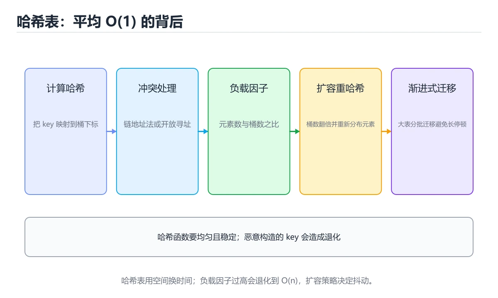
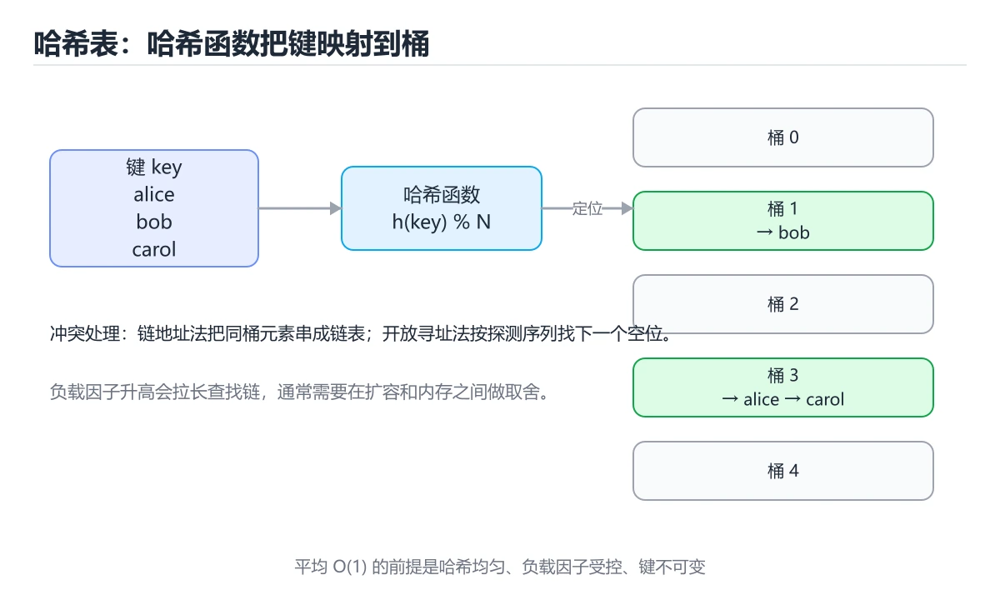

# 哈希表






> 内容更新时间：2026-10-06 · 学习阶段：基础 · 预计用时：45 分钟

## 本节知识框架

**课程定位**：所属分类为「算法与数据结构」，课程主题为「哈希表」，学习阶段为「基础」，建议用时 45 分钟。

**本课要解决的主问题**：哈希函数、冲突处理、负载因子与扩容。

| 学习层次 | 要回答的问题 | 完成判据 |
| --- | --- | --- |
| 概念层 | 「哈希表」有哪些必须区分的对象与术语？ | 能用自己的话定义核心术语，并各举一个正例和一个反例。 |
| 机制层 | 这些对象按什么顺序发生作用，输入如何变成输出？ | 能画出或写出机制步骤，并说明每一步的失败条件。 |
| 应用层 | 什么场景适合使用「哈希表」，什么场景不适合？ | 能给出一个真实场景、一个最小示例和一个边界案例。 |
| 性能层 | 时间、空间、吞吐或延迟受哪些量影响？ | 能说出复杂度或性能瓶颈的证据来源；没有证据时明确写“材料未提供”。 |
| 复习层 | 怎样确认自己不是只记住了结论？ | 能独立完成本课自测，并把错误定位到概念、机制、示例或边界。 |

### 阅读路线

1. 先读「核心概念定义」，建立「哈希表」等对象的精确定义。
2. 再读「原理与运行机制」，把定义串成可重复的过程。
3. 用「代码/协议/SQL 示例」验证过程，并只改一个条件观察结果变化。
4. 最后检查性能、易错点、知识关系与自测题，形成可复习的证据链。

**前置知识**：《时间复杂度》

**学习位置**：本课位于《时间复杂度》之后；如果前一课的自测不能通过，应先回补再继续。

**后续衔接**：下一课《栈与队列》会继续使用本课术语，学完后建议立即完成一次自测。

**教材衔接：学习目标**

- 能用自己的话解释哈希表解决了什么问题，而不是只背术语。
- 能说清 哈希表、「哈希函数」、「冲突」、「负载因子」 之间的关系，并分别举出一个例子。
- 能把 哈希表 放回「哈希表」的知识体系，说明它和 哈希函数 的边界。
- 能完成本课练习，并用验收标准检查自己的结果。

> 一句话摘要：哈希函数、冲突处理、负载因子与扩容。

**教材衔接：前置知识**

- 先完成上一课《时间复杂度》；如果已经掌握，可以直接用本课练习自测。
- 本课阶段：基础。建议先完成「时间复杂度」，或确认自己能独立跑通正文里的 SimpleMap 示例。
- 开始前先复习：哈希表、哈希函数、冲突。
- 如果 核心思想 这一步看不懂，先记录具体卡点，再用 SimpleMap 复现一遍。

**教材衔接：本课小结**

哈希表 = 哈希函数 + 冲突处理 + 动态扩容。记住：**平均 O(1)，最坏 O(n)；键不变、哈希函数均匀是关键**。

## 核心概念定义

> 阅读约定：本课先给「哈希表」相关术语的操作性定义与适用边界；正文里的口语化说法与定义冲突时，以定义和可复现示例为准。

| 术语 | 操作性定义 | 本课中的边界 |
| --- | --- | --- |
| hashCode | 自定义对象要正确实现 hashCode 与 equals（Java/C#），否则查不到。 | 仅在「哈希表」明确给出的输入、版本与资源条件下成立。 |
| 哈希表 | 哈希表 = 哈希函数 + 冲突处理 + 动态扩容。 | 仅在「哈希表」明确给出的输入、版本与资源条件下成立。 |
| 负载因子 | 负载因子 = 元素个数 / 桶数量。 | 仅在「哈希表」明确给出的输入、版本与资源条件下成立。 |
| 哈希冲突 | 不同键映射到同一个桶的现象，用链地址法或开放寻址解决，冲突率由哈希质量与负载因子决定。 | 仅在「哈希表」明确给出的输入、版本与资源条件下成立。 |

### 定义如何使用

在「哈希表」中判断一个说法是否成立，先确认它使用的是哪个对象的定义，再检查输入规模、运行环境与失败路径。定义不是口号，而是后续推导、代码示例和自测题共享的约束。

## 原理与运行机制

### 机制总览

1. **建立输入**：把「hashCode」按本课定义整理成可观察、可重复的输入条件。
2. **执行转换**：围绕「哈希表」执行本课的核心步骤；每一步都记录中间状态，避免只看最终输出。
3. **产生输出**：得到「负载因子」后，用正文示例或协议/SQL 结果核对输出是否符合预期。
4. **改变一个条件**：只替换一个边界条件或环境参数，观察「哈希表」的结论是否仍然成立。

| 阶段 | 关注对象 | 失败时应检查 |
| --- | --- | --- |
| 输入 | hashCode | 类型、范围、编码、版本或前置状态是否满足定义。 |
| 处理 | 哈希表 | 顺序、可见性、锁、路由、事务或调度规则是否被破坏。 |
| 输出 | 负载因子 | 结果是否可复现，错误是否被正确传播而不是被吞掉。 |

本课的机制结论要用「哈希表」自己的示例验证。「哈希表」没有给出某个数量级、吞吐或内存数据时，本课把该判断标为“材料未提供”，不从相邻主题外推。

**教材衔接：哈希冲突**

不同键映射到同一位置称为冲突，两种主流解决方案：

| 方案 | 做法 | 特点 |
| --- | --- | --- |
| 链地址法 | 每个桶挂一个链表/红黑树 | Java HashMap 采用，冲突多时树化 |
| 开放寻址 | 冲突时按规则找下一个空槽 | 缓存友好，删除需标记 |

**教材衔接：使用前提**

- 键必须可哈希且**不可变**（list 不能当 dict 的键，tuple 可以）。
- 自定义对象要正确实现 `hashCode` 与 `equals`（Java/C#），否则查不到。
- 哈希表不保证顺序；需要有序要用 TreeMap/TreeSet 或排序。
- 最坏情况（全部冲突）退化为 `O(n)`。

## 典型应用场景

| 场景 | 典型输入或前提 | 期望产物 |
| --- | --- | --- |
| 学习验证 | 使用本课最小示例和 哈希表、哈希函数 | 能复现正文结论，并解释每一步。 |
| 工程落地 | 把「哈希表」放入真实模块或服务边界 | 输出可观测、失败可定位、参数可配置。 |
| 故障排查 | 只改一个版本、规模、输入或依赖条件 | 能区分概念错误、实现错误和环境差异。 |

判断「哈希表」的场景是否成立，标准是能否写出输入、处理、输出和失败路径；材料中没有出现的数据在本课标注为“材料未提供”，不用推测替代证据。

**课程内置实验入口**：`interactive`，用于动手验证《哈希表》的机制；实验结论不替代概念定义与复杂度分析。

## 代码/协议/SQL 示例

### 最小可验证示例

下面保留《哈希表》原文中的最小示例。先预测《哈希表》示例的输出，再按正文步骤运行或推演；示例依赖外部环境时，同时记录版本与输入。

```text
key = "apple"
hash("apple") = 1037  ->  1037 % 16 = 13  ->  桶 13
```

**教材衔接：核心思想**

哈希表用**哈希函数**把键映射到数组下标，实现平均 `O(1)` 的插入、查找与删除。它用空间换时间，是字典、缓存、去重的底层结构。

```text
key = "apple"
hash("apple") = 1037  ->  1037 % 16 = 13  ->  桶 13
```

**教材衔接：负载因子与扩容**

```text
负载因子 = 元素个数 / 桶数量
```

负载因子过高冲突变多，通常超过 0.75 就扩容（桶数量翻倍）并重新哈希（rehash）。

**教材衔接：代码示例**

```python
# 用字典统计词频（哈希表的典型应用）
words = "the cat the dog the".split()
counter = {}
for word in words:
    counter[word] = counter.get(word, 0) + 1
print(counter)          # {'the': 3, 'cat': 1, 'dog': 1}
```

```python
# 简化版哈希表（链地址法）
class SimpleMap:
    def __init__(self, size=16):
        self.buckets = [[] for _ in range(size)]

    def _index(self, key):
        return hash(key) % len(self.buckets)

    def put(self, key, value):
        bucket = self.buckets[self._index(key)]
        for i, (k, _) in enumerate(bucket):
            if k == key:
                bucket[i] = (key, value)
                return
        bucket.append((key, value))

    def get(self, key, default=None):
        for k, v in self.buckets[self._index(key)]:
            if k == key:
                return v
        return default
```

**教材衔接：关键参数速查**

| 参数 | 典型值 | 说明 |
| --- | --- | --- |
| 初始容量 | 16 | 太小会频繁扩容 |
| 负载因子 | 0.75 | 超过即扩容，空间与冲突的平衡 |
| 树化阈值（Java） | 链表长度 8 | 链表转红黑树 |
| 退化阈值 | 长度 6 | 红黑树转回链表 |
| 扩容倍数 | 2 倍 | 保证重哈希分布更均匀 |

```python
# Python 字典就是哈希表：判断存在性 O(1)
counts = {}
for word in words:
    counts[word] = counts.get(word, 0) + 1

# 用 set 做去重与存在性判断，比 list 快得多
seen = set()
duplicates = [x for x in items if x in seen or seen.add(x)]

# 自定义类型参与哈希：必须同时实现 __hash__ 与 __eq__
class Point:
    __slots__ = ("x", "y")

    def __init__(self, x, y):
        self.x, self.y = x, y

    def __hash__(self):
        return hash((self.x, self.y))     # 用不可变字段组合

    def __eq__(self, other):
        return isinstance(other, Point) and (self.x, self.y) == (other.x, other.y)
```

**教材衔接：深入补充：哈希表**

前面已经建立了基本概念。这一节换一个角度，把哈希表放进真实工程里，
重点回答三件事：哈希表 为什么存在、内部如何运转、什么时候会失效。

### 一、核心模型

哈希表用哈希函数把键映射到桶，以接近 O(1) 的平均时间完成查找、插入和删除；性能取决于哈希质量、冲突处理和负载因子控制。

```text
计算哈希 → 映射到桶 → 比较键 → 命中返回/冲突探测 → 插入或更新 → 超过负载因子扩容
```

### 二、关键机制拆解

1. 哈希函数应把键均匀分散，并保持相等键必须有相同哈希值。
2. 链地址法把冲突元素放入链表或红黑树，开放寻址法在表内探测下一个空位。
3. 负载因子是元素数与桶数之比，过高会增加冲突，过低会浪费空间。
4. 扩容需要重新分配元素，通常采用倍增策略把均摊成本降为 O(1)。
5. 开放寻址删除需要使用墓碑标记，不能直接把位置清空。
6. 哈希表不保证顺序；需要有序遍历时应使用有序结构或额外排序。
7. 恶意构造的键可能造成哈希碰撞攻击，必要时使用随机盐或安全哈希。

### 三、对照表：抓住容易混淆的边界

| 维度 | 一侧 | 另一侧 |
| --- | --- | --- |
| 链地址法 | 每个桶挂链表或树 | 实现简单，指针开销较大 |
| 开放寻址 | 冲突时在表内探测 | 缓存友好但删除复杂 |
| 哈希表 | 平均 O(1) 查找 | 不保证顺序，最坏可能退化 |
| 平衡树 | O(log n) 有序操作 | 稳定但常数和实现复杂度更高 |

### 四、工作示例

实现 LRU 缓存时，用哈希表保存键到链表节点，用双向链表维护访问顺序。哈希表提供 O(1) 定位，链表提供 O(1) 移动和淘汰，两者组合优于单独使用。

### 五、常见误区与失效边界

| 错误做法或假设 | 后果 | 正确做法 |
| --- | --- | --- |
| 哈希函数质量差 | 大量冲突导致性能退化到 O(n) | 使用经过验证的哈希并做分布测试 |
| 负载因子过高不扩容 | 探测和链表变长 | 设置阈值并触发扩容 |
| 开放寻址删除直接清空 | 后续查找中断 | 使用墓碑标记或重排 |
| 在多线程中无锁修改 | 数据损坏或死循环 | 使用锁、分片或并发安全结构 |

### 六、场景推演

服务在处理大量相似字符串时 CPU 飙升。分析发现哈希碰撞率高，链表退化成线性扫描。更换哈希函数并调整容量后，冲突下降、延迟恢复稳定。

### 七、自测问答

**Q1：哈希表平均 O(1) 的前提是什么？**

哈希分布均匀且负载因子受控。

**Q2：链地址法和开放寻址的取舍是什么？**

前者实现简单但指针多，后者缓存友好但删除复杂。

**Q3：为什么扩容要倍增？**

倍增让元素重新分配的均摊成本保持 O(1)。

**Q4：哈希碰撞攻击如何缓解？**

使用随机盐、安全哈希和容量限制。

### 八、小项目：把知识变成可检查的产出

实现链地址法和开放寻址法两个哈希表，使用同一组键测试插入、查找、删除和扩容；统计冲突次数、平均探测长度和不同负载因子下的耗时。

### 九、适用边界

哈希表适合等值查找，不适合范围查询和有序遍历。若需要顺序、前缀或范围能力，应选择树、跳表或专用索引。

### 十、完成检查清单

- [ ] 能设计哈希函数和冲突策略
- [ ] 能分析负载因子与扩容
- [ ] 能正确处理开放寻址删除
- [ ] 能识别最坏情况退化
- [ ] 能用哈希表组合实现缓存结构

### 十一、复习顺序

1. 用自己的话说明 SimpleMap 的作用，再说出它不适用的情况。
2. 再对照表逐行解释容易混淆的概念，每个概念补一个反例。
3. 跟着工作示例做一遍，改变一个条件并预测结果。
4. 用自测问答检查理解，错题回到对应小节重新阅读。
5. 把 哈希函数 的实现、测试与复盘整理成一份可提交的产物。

> 复习不是重读一遍，而是离开原文重新产出：复述、改写、验证、复盘。

## 时间/空间复杂度或性能分析

**复杂度证据**：本课正文出现 `O(1)`、`O(n)`、`O(n²)`、`O(log n)` 等量级表达式；使用前要同时确认输入规模、最好/平均/最坏情况以及常数项来源。

| 维度 | 本课关注点 | 判断依据 |
| --- | --- | --- |
| 时间/延迟 | 「哈希表」的主要步骤是否会随输入规模、并发度或网络往返增长。 | 以正文复杂度、基准数据或可重复测量为准。 |
| 空间/内存 | 中间状态、缓存、副本、连接或索引是否随规模增长。 | 记录峰值内存与数据副本，不只看最终结果。 |
| 吞吐/资源 | 版本、调度、锁、IO、序列化或协议开销是否成为瓶颈。 | 固定环境做对照实验，改变一个变量。 |

评估「哈希表」时要区分“正确性成立”和“性能达标”两件事；材料没有给出基准时，本课只保留量级来源与测量方法，不写不可验证的绝对数字。

## 常见误区与易错点

> 复核《哈希表》的易错点时，优先保留原文的错误表、故障现场与排错路径；每条修正都要能用本课示例复验。

| 易错点 | 常见表现 | 正确做法 |
| --- | --- | --- |
| 只背结论 | 能复述「哈希表」的定义，却说不清输入、输出与边界。 | 回到机制步骤，用最小示例逐一验证。 |
| 混淆相邻概念 | 把本课对象与相邻主题的对象当成同一类。 | 先比较定义、资源归属、生命周期和失败模式。 |
| 忽略版本与环境 | 在开发机通过后直接外推到生产环境。 | 固定版本、输入和资源条件，再记录可复现结果。 |

**教材衔接：常见错误与排查**

| 容易写错的做法 | 实际现象 | 原因与正确做法 |
| --- | --- | --- |
| 用可变对象作键 | `TypeError: unhashable` 或查不到 | 用不可变对象作键 |
| 自定义类只实现 `__eq__` | 实例不可哈希 | 同时实现 `__hash__` |
| 哈希值随字段变化 | 放进集合后「消失」 | 哈希依赖的字段必须不可变 |
| 哈希函数总返回常量 | 全部冲突，退化成 O(n) | 让哈希均匀分布 |
| 用 `list` 做存在性判断 | 循环中 O(n²) | 改用 `set` / `dict` |
| 遍历字典时修改 | `RuntimeError: dictionary changed size` | 先收集键，再统一修改 |
| 认为哈希表有序 | 遍历顺序与插入不一致 | 需要顺序用 `dict`（3.7+ 保序）或有序结构 |
| 负载因子过高不扩容 | 冲突激增、性能骤降 | 合理设置初始容量 |
| 用哈希值判断相等 | 不同对象哈希可能相同 | 哈希相同是必要条件，还需比较值 |
| 在哈希键里用浮点 | 精度问题导致查不到 | 用整数或字符串键 |

**教材衔接：故障现场**

### 现场 1：用可变对象作键

**症状**：在《哈希表》的复现场景中，TypeError: unhashable 或查不到。

**根因**：当出现“用可变对象作键”时，执行路径已经绕过了《哈希表》的关键约束，最终以“TypeError: unhashable 或查不到”暴露出来；修复前必须先确认约束在哪里失效。

**修复**：针对《哈希表》的问题，用不可变对象作键。

**验证**：保留《哈希表》里触发“TypeError: unhashable 或查不到”的输入、版本和日志，按“用不可变对象作键”完成修改后原样重放；只有失败现象消失且相邻场景仍可解释，才保留改动。

### 现场 2：自定义类只实现 __eq__

**症状**：在《哈希表》的复现场景中，实例不可哈希。

**根因**：触发点是把“自定义类只实现 __eq__”当成安全做法。它没有满足《哈希表》要求的前提，因此先表现为“实例不可哈希”；排查时先完整复现这一段，再核对输入、配置与依赖。

**修复**：针对《哈希表》的问题，同时实现 __hash__。

**验证**：在《哈希表》中按“同时实现 __hash__”调整后，从“自定义类只实现 __eq__”的触发条件重放同一条路径，确认“实例不可哈希”不再出现，并补一个相邻边界用例检查没有引入新问题。

### 现场 3：哈希值随字段变化

**症状**：在《哈希表》的复现场景中，放进集合后「消失」。

**根因**：当出现“哈希值随字段变化”时，执行路径已经绕过了《哈希表》的关键约束，最终以“放进集合后「消失」”暴露出来；修复前必须先确认约束在哪里失效。

**修复**：针对《哈希表》的问题，哈希依赖的字段必须不可变。

**验证**：在《哈希表》中按“哈希依赖的字段必须不可变”调整后，从“哈希值随字段变化”的触发条件重放同一条路径，确认“放进集合后「消失」”不再出现，并补一个相邻边界用例检查没有引入新问题。

## 与其他知识点的关系

| 关系 | 课程 | 为什么 |
| --- | --- | --- |
| 先修 | 《时间复杂度》 | 本课会直接使用它的概念或操作前提。 |
| 关联 | 《栈与队列》 | 用于横向比较或把本课结论迁移到相邻主题。 |
| 关联 | 《集合类型：九种语言横向对照》 | 用于横向比较或把本课结论迁移到相邻主题。 |
| 前置顺序 | 《时间复杂度》 | 同分类中安排在本课之前，建议先完成其自测。 |
| 后续顺序 | 《栈与队列》 | 同分类中安排在本课之后，会继续使用本课术语。 |

把「哈希表」放回知识体系时，不只要记住“前面学过什么”，还要说明两个主题在输入、机制、资源边界和失败模式上的差异。这样才能把单课知识迁移到项目、排障和后续课程。

**教材衔接：哈希冲突方案对照**

| 方案 | 做法 | 优点 | 缺点 |
| --- | --- | --- | --- |
| 链地址法 | 每个桶挂链表/红黑树 | 删除简单、负载因子可较高 | 指针开销、缓存不友好 |
| 开放寻址（线性探测） | 依次找下一个空位 | 缓存友好、无指针 | 删除需墓碑标记、易聚集 |
| 二次探测 | 按平方步长探测 | 缓解一次聚集 | 可能出现二次聚集 |
| 双重哈希 | 用第二个哈希定步长 | 分布更好 | 计算成本略高 |
| 再哈希 | 负载过高时扩容重排 | 保持性能 | 扩容瞬间开销大 |

**教材衔接：复习与迁移**

复习目标：把「哈希表」的判断标准放回可复现的例子里。先自己作答，再对照依据；如果结论正确但理由不完整，回到正文补足前提。

### 概念复述

- 用一句话说明「哈希表」解决什么问题：哈希函数、冲突处理、负载因子与扩容。
- 写出哈希表、哈希函数、冲突之间的关系，并各举一个例子。
- 说出本课最容易混淆的两个概念，以及区分它们的判据。

### 正文逐节复核

- **核心思想**：哈希表用**哈希函数**把键映射到数组下标，实现平均 `O(1)` 的插入、查找与删除。
- **哈希冲突**：不同键映射到同一位置称为冲突，两种主流解决方案：。
- **负载因子与扩容**：负载因子过高冲突变多，通常超过 0.75 就扩容（桶数量翻倍）并重新哈希（rehash）。
- **深入补充：哈希表**：前面已经建立了基本概念。这一节换一个角度，把哈希表放进真实工程里，。

### 测验回顾

1. 围绕“哈希表”中的 哈希表、哈希函数、冲突，下列哪两项是本课强调的实践判断？
   - 依据：题干的正确项是学习 哈希表 时要同时说明输入、输出和失败路径，不能只看正常流程；验证 哈希函数 时要固定版本并覆盖边界输入，结论才可复现。“围绕哈希表中的”与「哈希表」的术语表相呼应，只有符合哈希表、哈希函数、冲突约束的“学习 哈希表 时要同时说明输入”才是正文支持的结论。“围绕中的”与术语表相呼应，只有符合哈希表、哈希函数、冲突约束的“学习 哈希表 时要同时说明输入”才是正文支持的结论。
2. 解决哈希冲突的两种主流方案是？
   - 依据：链地址法在桶上挂链表/树，开放寻址在冲突时探测下一个空槽。把“链地址法与开放寻址”代回「哈希表」里“解决哈希冲突的两种主流方案是”的例子核对，条件一旦改变，结论就要用哈希表、哈希函数、冲突重新推导。回到哈希表、哈希函数、冲突本身再看一遍：只有“链地址法与开放寻址”与题干“解决哈希冲突的两种主流方案是”的前提一致，结论才成立。
3. 这段 Python 代码是「哈希表」的示例片段，下面哪一项描述与它一致？
   - 依据：在「哈希表」里，题干的正确项是这段代码会产生可观察的输出，运行后能看到结果，在「哈希表」里要结合哈希表核对输出是否符合预期。这道题的关键在「哈希表」的哈希表、哈希函数、冲突：先确认题干“这段 Python 代码是哈希表的示”问的是哪一步，再排除偷换前提的选项。这道题的关键在哈希表、哈希函数、冲突：先确认题干“Python”问的是哪一步，再排除偷换前提的选项。
4. 哈希表装载因子过高会导致什么？
   - 依据：Java HashMap 在链表过长时会转为红黑树，但根本手段仍是合理扩容。作答时，先用哈希表建立输入与输出的基线，再把冲突概率上升代入边界条件核对，结论才能复现。这道题要求区分概念与边界，「冲突概率上升」只有在题干给出的前提下才成立，而「内存占用下降」、「查找自动变快」缺少同一组条件。
5. 开放寻址与链地址法解决冲突的差别是？
   - 依据：作答时，先用哈希表建立输入与输出的基线，再把开放寻址在表内探测下一个空位代入边界条件核对，结论才能复现。「哈希表」要求先交代哈希表、哈希函数、冲突的前提再下结论，所以“开放寻址在表内探测下一个空位”只在题干“开放寻址与链地址法解决冲突的差别是”给定的条件下成立。
6. 补全代码：「哈希表」示例中，下面这行代码缺少哪个关键字或函数名？请填入 ____。

`def ____(self):`
   - 依据：空格应填写「__hash__」。把“hash”代回「哈希表」里“哈希表示例中”的例子核对，条件一旦改变，结论就要用哈希表、哈希函数、冲突重新推导。这道题的关键在哈希表、哈希函数、冲突：先确认题干“hash”问的是哪一步，再排除偷换前提的选项。“hash”是否可用，取决于哈希表、哈希函数、冲突在题干条件下的表现，不能直接套用相邻结论。

### 迁移练习

把「哈希表」的结论迁移到相邻主题，每次迁移都写清预测与证据：

1. 换输入：用哈希表处理一组你自己的数据，对比教材示例的结果差异。
2. 换失败条件：制造一个哈希函数相关的错误，说明如何从错误信息定位根因。
3. 换规模：把数据量或并发度提高一个数量级，说明「哈希表」的结论是否仍成立。

## 自测题与参考答案

> 先独立作答《哈希表》的自测题，再对照答案与解析；每处判断都要能在本课正文或示例中找到依据。

### 自测 1

围绕“哈希表”中的 哈希表、哈希函数、冲突，下列哪两项是本课强调的实践判断？

A. 把 哈希函数 的单次运行结果当成所有版本和规模都成立
B. 学习 哈希表 时要同时说明输入、输出和失败路径，不能只看正常流程
C. 只要 哈希表 的常规示例通过，就可以跳过边界与异常路径
D. 验证 哈希函数 时要固定版本并覆盖边界输入，结论才可复现

**参考答案**：学习 哈希表 时要同时说明输入、输出和失败路径，不能只看正常流程；验证 哈希函数 时要固定版本并覆盖边界输入，结论才可复现

**解析**：题干的正确项是学习 哈希表 时要同时说明输入、输出和失败路径，不能只看正常流程；验证 哈希函数 时要固定版本并覆盖边界输入，结论才可复现。“围绕哈希表中的”与「哈希表」的术语表相呼应，只有符合哈希表、哈希函数、冲突约束的“学习 哈希表 时要同时说明输入”才是正文支持的结论。“围绕中的”与术语表相呼应，只有符合哈希表、哈希函数、冲突约束的“学习 哈希表 时要同时说明输入”才是正文支持的结论。

### 自测 2

解决哈希冲突的两种主流方案是？

A. 分治与贪心
B. 链地址法与开放寻址
C. 递归与迭代
D. 排序与二分

**参考答案**：链地址法与开放寻址

**解析**：链地址法在桶上挂链表/树，开放寻址在冲突时探测下一个空槽。把“链地址法与开放寻址”代回「哈希表」里“解决哈希冲突的两种主流方案是”的例子核对，条件一旦改变，结论就要用哈希表、哈希函数、冲突重新推导。回到哈希表、哈希函数、冲突本身再看一遍：只有“链地址法与开放寻址”与题干“解决哈希冲突的两种主流方案是”的前提一致，结论才成立。

### 自测 3

这段 Python 代码是「哈希表」的示例片段，下面哪一项描述与它一致？

```python
# 用字典统计词频（哈希表的典型应用） words = "the cat the dog the".split() counter = {} for word in words: counter[word] = counter.get(word, 0) + 1 print(counter) # {'the': 3, 'cat': 1, 'dog': 1}
```

A. 这段代码只做静态声明，没有循环、分支或可观察输出。
B. 这段代码会产生可观察的输出，运行后能看到结果。
C. 这段代码包含异常处理分支，失败时会走专门的补救路径。
D. 这段代码会读取外部输入，结果依赖传入的数据。

**参考答案**：这段代码会产生可观察的输出，运行后能看到结果。

**解析**：在「哈希表」里，题干的正确项是这段代码会产生可观察的输出，运行后能看到结果，在「哈希表」里要结合哈希表核对输出是否符合预期。这道题的关键在「哈希表」的哈希表、哈希函数、冲突：先确认题干“这段 Python 代码是哈希表的示”问的是哪一步，再排除偷换前提的选项。这道题的关键在哈希表、哈希函数、冲突：先确认题干“Python”问的是哪一步，再排除偷换前提的选项。

**教材衔接：复习与自测**

- [ ] 能说出链地址法与开放寻址的取舍。
- [ ] 知道负载因子过高会退化到 O(n)。
- [ ] 自定义类型作键时同时实现哈希与相等。
- [ ] 会用 `set` / `dict` 把 O(n) 判断降到 O(1)。
- [ ] 需要有序遍历时选择合适结构。

**教材衔接：动手练习**

> 本课练习重点：围绕「哈希表、哈希函数、冲突」完成复述、实验和交付，每个结果都要能被别人检查。

用 8 个元素手动走一遍 SimpleMap，把每一步代价与代码里的计数对齐。

### 练习 1：建立心智模型（10 分钟）

合上教程，用 3～5 句话回答：

1. 哈希表解决了什么问题？
2. 如果没有它，会出现什么具体后果？
3. 它和「哈希函数」是什么关系？

验收标准：回答里必须出现 哈希表，并写出一个让结论失效的边界条件。

### 练习 2：做一次可控实验（20 分钟）

从正文中选一个最小示例，完成以下操作：

1. 先预测修改一个参数、输入或步骤后的结果。
2. 再实际执行或逐步推演，记录真实结果。
3. 如果结果与预测不同，写出差异原因。

**验收标准**：五步记录要写进笔记——原例是 SimpleMap，改动落在哈希表上，结论必须能被他人在同一环境里复现。

### 练习 3：交付一个小结果（30 分钟）

用 8～12 个元素手算 SimpleMap 的状态变化，再与程序输出对照。

任务要求：

- 结果必须能被别人检查，不能只写“我已经理解了”。
- 至少覆盖哈希表和「哈希函数」两个关键词。
- 写出 1 个仍然不确定的问题，以及下一步如何验证。

> 提示：时间有限时优先做练习 1 和练习 2；练习 3 可以拆成两次完成。

**教材衔接：可运行练习**

### 任务 1：先跑通，再解释

```python
# 用字典统计词频（哈希表的典型应用）
words = "the cat the dog the".split()
counter = {}
for word in words:
    counter[word] = counter.get(word, 0) + 1
print(counter)          # {'the': 3, 'cat': 1, 'dog': 1}
```

### 任务 2：只改一个条件

把「哈希表」的最小示例复制一份，只改一个条件再跑一次：

- 改动点：只把 哈希表 的输入换成空值、极值或错误输入，其余保持不变。
- 预测：先写下「哈希表」在改动后的输出或错误信息，再运行。
- 记录：对照改动前后的结果，指出差异出在哪一步。
- 验收：换回原条件能复现原结果，改动只影响哈希表。

### 任务 3：迁移到自己的数据

用同一套思路处理一组你自己的 哈希表 数据，保持输出格式与任务 1 一致。

**教材衔接：本课复习清单**

离开本课前，逐项确认：

- [ ] 不看解析，能说出「哈希表查找的平均时间复杂度是？」的判断依据。
- [ ] 不看解析，能说出「解决哈希冲突的两种主流方案是？」的判断依据。
- [ ] 不看解析，能说出「下面哪种类型不能直接作为 Python 字典的键？」的判断依据。
- [ ] 不看解析，能说出「哈希表装载因子过高会导致什么？」的判断依据。
- [ ] 不看解析，能说出「开放寻址与链地址法解决冲突的差别是？」的判断依据。
- [ ] 至少运行一次 SimpleMap 的示例，记录输入、输出和 哈希表 的边界情况。
- [ ] 把本课最容易混淆的两个概念写成一句话对照。

| 复盘项 | 记录 |
| --- | --- |
| 已经能独立解释的考点 |  |
| 仍然说不清的概念 |  |
| 下一步验证动作 |  |

---

## 术语速查

| 术语 | 一句话说明 |
| --- | --- |
| `hashCode` | 自定义对象要正确实现 `hashCode` 与 `equals`（Java/C#），否则查不到。 |
| `哈希表` | 哈希表 = 哈希函数 + 冲突处理 + 动态扩容。 |
| `负载因子` | 负载因子 = 元素个数 / 桶数量。 |
| `哈希冲突` | 不同键映射到同一个桶的现象，用链地址法或开放寻址解决，冲突率由哈希质量与负载因子决定。 |

## 考点精讲

### 考点 1：多选辨析·哈希表

- **题目**：围绕“哈希表”中的 哈希表、哈希函数、冲突，下列哪两项是本课强调的实践判断？
- **判断依据**：题干的正确项是学习 哈希表 时要同时说明输入、输出和失败路径，不能只看正常流程；验证 哈希函数 时要固定版本并覆盖边界输入，结论才可复现。“围绕哈希表中的”与「哈希表」的术语表相呼应，只有符合哈希表、哈希函数、冲突约束的“学习 哈希表 时要同时说明输入”才是正文支持的结论。“围绕中的”与术语表相呼应，只有符合哈希表、哈希函数、冲突约束的“学习 哈希表 时要同时说明输入”才是正文支持的结论。

### 考点 2：概念判断·哈希表

- **题目**：解决哈希冲突的两种主流方案是？
- **判断依据**：链地址法在桶上挂链表/树，开放寻址在冲突时探测下一个空槽。把“链地址法与开放寻址”代回「哈希表」里“解决哈希冲突的两种主流方案是”的例子核对，条件一旦改变，结论就要用哈希表、哈希函数、冲突重新推导。回到哈希表、哈希函数、冲突本身再看一遍：只有“链地址法与开放寻址”与题干“解决哈希冲突的两种主流方案是”的前提一致，结论才成立。

### 考点 3：代码补全·哈希表

- **题目**：这段 Python 代码是「哈希表」的示例片段，下面哪一项描述与它一致？
- **判断依据**：在「哈希表」里，题干的正确项是这段代码会产生可观察的输出，运行后能看到结果，在「哈希表」里要结合哈希表核对输出是否符合预期。这道题的关键在「哈希表」的哈希表、哈希函数、冲突：先确认题干“这段 Python 代码是哈希表的示”问的是哪一步，再排除偷换前提的选项。这道题的关键在哈希表、哈希函数、冲突：先确认题干“Python”问的是哪一步，再排除偷换前提的选项。

### 考点 4：概念判断·哈希表

- **题目**：哈希表装载因子过高会导致什么？
- **判断依据**：Java HashMap 在链表过长时会转为红黑树，但根本手段仍是合理扩容。作答时，先用哈希表建立输入与输出的基线，再把冲突概率上升代入边界条件核对，结论才能复现。这道题要求区分概念与边界，「冲突概率上升」只有在题干给出的前提下才成立，而「内存占用下降」、「查找自动变快」缺少同一组条件。

### 考点 5：概念判断·哈希表

- **题目**：开放寻址与链地址法解决冲突的差别是？
- **判断依据**：作答时，先用哈希表建立输入与输出的基线，再把开放寻址在表内探测下一个空位代入边界条件核对，结论才能复现。「哈希表」要求先交代哈希表、哈希函数、冲突的前提再下结论，所以“开放寻址在表内探测下一个空位”只在题干“开放寻址与链地址法解决冲突的差别是”给定的条件下成立。

### 考点 6：填空·def ____(self)

- **题目**：补全代码：「哈希表」示例中，下面这行代码缺少哪个关键字或函数名？请填入 ____。 `def ____(self):`
- **判断依据**：空格应填写「__hash__」。把“hash”代回「哈希表」里“哈希表示例中”的例子核对，条件一旦改变，结论就要用哈希表、哈希函数、冲突重新推导。这道题的关键在哈希表、哈希函数、冲突：先确认题干“hash”问的是哪一步，再排除偷换前提的选项。“hash”是否可用，取决于哈希表、哈希函数、冲突在题干条件下的表现，不能直接套用相邻结论。

## English Overview

**Title:** Hash Tables

**Summary:** Hash functions, collisions, load factor and resizing.

**Category:** Algorithms
**Level:** 基础
**Key terms:** 哈希表, 哈希函数, 冲突, 负载因子, 字典

## 内容元数据

- 内容版本：v2.0
- 最后更新：2026-10-06
- 学习阶段：基础
- 适用环境：任意主流语言（伪代码与复杂度为主）
；本课聚焦 哈希表。
- 内容来源：内置结构化课程与工程实践整理
- 相关主题：哈希表、哈希函数、冲突、负载因子、字典
- 质量版本：P0 测验标准 + P1 覆盖扩展 + P2 体验补全

## 参考资料与复核

- 最后复核：2026-10-04
- 下次复核：2027-05-24
- 复核范围：版本兼容、API 行为、安全建议与工程实践
- 来源性质：官方文档、标准或权威教材；正文为离线教学重组

| 参考资料 | 本课用途 |
| --- | --- |
| [CP-Algorithms](https://cp-algorithms.com/) | 算法实现与复杂度 |
| [LeetCode 学习](https://leetcode.com/explore/) | 算法题训练与模式 |
| [Princeton Algorithms](https://algs4.cs.princeton.edu/home/) | 经典算法与数据结构教材 |

> 「哈希表」的链接用于离线阅读后的延伸核对；App 不会自动联网。
