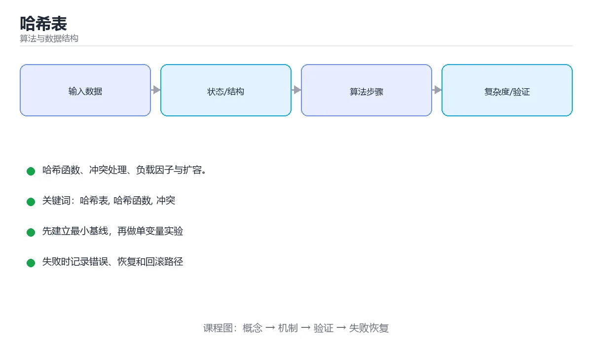

# 哈希表



> 内容更新时间：2026-10-03 · 学习阶段：基础 · 预计用时：14 分钟

## 学习目标

- 能用自己的话解释「哈希表」解决了什么问题，而不是只背术语。
- 能说清 「哈希表」、「哈希函数」、「冲突」、「负载因子」 之间的关系，并分别举出一个例子。
- 能把本课知识放回「算法与数据结构」的知识体系，说明它和相邻主题的边界。
- 能完成本课练习，并用验收标准检查自己的结果。

> 一句话摘要：哈希函数、冲突处理、负载因子与扩容。

## 前置知识

- 先完成上一课《时间复杂度》；如果已经掌握，可以直接用本课练习自测。
- 本课阶段：基础。建议会读写简单代码或命令，并理解变量、输入输出等基本概念。
- 开始前先复习：哈希表、哈希函数、冲突。
- 如果某一步看不懂，先记录具体卡点，完成练习后再回头读一遍。


## 核心思想

哈希表用**哈希函数**把键映射到数组下标，实现平均 `O(1)` 的插入、查找与删除。它用空间换时间，是字典、缓存、去重的底层结构。

```text
key = "apple"
hash("apple") = 1037  ->  1037 % 16 = 13  ->  桶 13
```

## 哈希冲突

不同键映射到同一位置称为冲突，两种主流解决方案：

| 方案 | 做法 | 特点 |
| --- | --- | --- |
| 链地址法 | 每个桶挂一个链表/红黑树 | Java HashMap 采用，冲突多时树化 |
| 开放寻址 | 冲突时按规则找下一个空槽 | 缓存友好，删除需标记 |

## 负载因子与扩容

```text
负载因子 = 元素个数 / 桶数量
```

负载因子过高冲突变多，通常超过 0.75 就扩容（桶数量翻倍）并重新哈希（rehash）。

## 代码示例

```python
# 用字典统计词频（哈希表的典型应用）
words = "the cat the dog the".split()
counter = {}
for word in words:
    counter[word] = counter.get(word, 0) + 1
print(counter)          # {'the': 3, 'cat': 1, 'dog': 1}
```

```python
# 简化版哈希表（链地址法）
class SimpleMap:
    def __init__(self, size=16):
        self.buckets = [[] for _ in range(size)]

    def _index(self, key):
        return hash(key) % len(self.buckets)

    def put(self, key, value):
        bucket = self.buckets[self._index(key)]
        for i, (k, _) in enumerate(bucket):
            if k == key:
                bucket[i] = (key, value)
                return
        bucket.append((key, value))

    def get(self, key, default=None):
        for k, v in self.buckets[self._index(key)]:
            if k == key:
                return v
        return default
```

## 使用前提

- 键必须可哈希且**不可变**（list 不能当 dict 的键，tuple 可以）。
- 自定义对象要正确实现 `hashCode` 与 `equals`（Java/C#），否则查不到。
- 哈希表不保证顺序；需要有序要用 TreeMap/TreeSet 或排序。
- 最坏情况（全部冲突）退化为 `O(n)`。

## 本课小结
哈希表 = 哈希函数 + 冲突处理 + 动态扩容。记住：**平均 O(1)，最坏 O(n)；键不变、哈希函数均匀是关键**。


## 哈希冲突方案对照

| 方案 | 做法 | 优点 | 缺点 |
| --- | --- | --- | --- |
| 链地址法 | 每个桶挂链表/红黑树 | 删除简单、负载因子可较高 | 指针开销、缓存不友好 |
| 开放寻址（线性探测） | 依次找下一个空位 | 缓存友好、无指针 | 删除需墓碑标记、易聚集 |
| 二次探测 | 按平方步长探测 | 缓解一次聚集 | 可能出现二次聚集 |
| 双重哈希 | 用第二个哈希定步长 | 分布更好 | 计算成本略高 |
| 再哈希 | 负载过高时扩容重排 | 保持性能 | 扩容瞬间开销大 |

## 关键参数速查

| 参数 | 典型值 | 说明 |
| --- | --- | --- |
| 初始容量 | 16 | 太小会频繁扩容 |
| 负载因子 | 0.75 | 超过即扩容，空间与冲突的平衡 |
| 树化阈值（Java） | 链表长度 8 | 链表转红黑树 |
| 退化阈值 | 长度 6 | 红黑树转回链表 |
| 扩容倍数 | 2 倍 | 保证重哈希分布更均匀 |

```python
# Python 字典就是哈希表：判断存在性 O(1)
counts = {}
for word in words:
    counts[word] = counts.get(word, 0) + 1

# 用 set 做去重与存在性判断，比 list 快得多
seen = set()
duplicates = [x for x in items if x in seen or seen.add(x)]

# 自定义类型参与哈希：必须同时实现 __hash__ 与 __eq__
class Point:
    __slots__ = ("x", "y")

    def __init__(self, x, y):
        self.x, self.y = x, y

    def __hash__(self):
        return hash((self.x, self.y))     # 用不可变字段组合

    def __eq__(self, other):
        return isinstance(other, Point) and (self.x, self.y) == (other.x, other.y)
```

## 常见错误对照表

| 容易写错的做法 | 实际现象 | 原因与正确做法 |
| --- | --- | --- |
| 用可变对象作键 | `TypeError: unhashable` 或查不到 | 用不可变对象作键 |
| 自定义类只实现 `__eq__` | 实例不可哈希 | 同时实现 `__hash__` |
| 哈希值随字段变化 | 放进集合后「消失」 | 哈希依赖的字段必须不可变 |
| 哈希函数总返回常量 | 全部冲突，退化成 O(n) | 让哈希均匀分布 |
| 用 `list` 做存在性判断 | 循环中 O(n²) | 改用 `set` / `dict` |
| 遍历字典时修改 | `RuntimeError: dictionary changed size` | 先收集键，再统一修改 |
| 认为哈希表有序 | 遍历顺序与插入不一致 | 需要顺序用 `dict`（3.7+ 保序）或有序结构 |
| 负载因子过高不扩容 | 冲突激增、性能骤降 | 合理设置初始容量 |
| 用哈希值判断相等 | 不同对象哈希可能相同 | 哈希相同是必要条件，还需比较值 |
| 在哈希键里用浮点 | 精度问题导致查不到 | 用整数或字符串键 |

## 自测清单

- [ ] 能说出链地址法与开放寻址的取舍。
- [ ] 知道负载因子过高会退化到 O(n)。
- [ ] 自定义类型作键时同时实现哈希与相等。
- [ ] 会用 `set` / `dict` 把 O(n) 判断降到 O(1)。
- [ ] 需要有序遍历时选择合适结构。

## 动手练习


> 本课练习重点：围绕「哈希表、哈希函数、冲突」完成复述、实验和交付，每个结果都要能被别人检查。

先手算 8 个元素的状态变化，再实现并统计操作次数与复杂度。

### 练习 1：建立心智模型（10 分钟）

合上教程，用 3～5 句话回答：

1. 「哈希表」解决了什么问题？
2. 如果没有它，会出现什么具体后果？
3. 它和「哈希函数」是什么关系？

**验收标准**：至少出现一个本课关键词，并写出一个反例、边界条件或失效场景。

### 练习 2：做一次可控实验（20 分钟）

从正文中选一个最小示例，完成以下操作：

1. 先预测修改一个参数、输入或步骤后的结果。
2. 再实际执行或逐步推演，记录真实结果。
3. 如果结果与预测不同，写出差异原因。

**验收标准**：留下「原例 → 改动 → 预测 → 结果 → 原因」五步记录。

### 练习 3：交付一个小结果（30 分钟）

给定 8～12 个手工构造的数据，写出每一步状态，并统计比较或交换次数。

任务要求：

- 结果必须能被别人检查，不能只写“我已经理解了”。
- 至少覆盖「哈希表」和「哈希函数」两个关键词。
- 写出 1 个仍然不确定的问题，以及下一步如何验证。

> 提示：时间有限时优先做练习 1 和练习 2；练习 3 可以拆成两次完成。


## 深入补充：哈希表

前面已经建立了基本概念。这一节换一个角度，把「哈希表」放进真实工程里，
重点回答三件事：它为什么存在、内部如何运转、什么时候会失效。

### 一、核心模型

哈希表用哈希函数把键映射到桶，以接近 O(1) 的平均时间完成查找、插入和删除；性能取决于哈希质量、冲突处理和负载因子控制。

```text
计算哈希 → 映射到桶 → 比较键 → 命中返回/冲突探测 → 插入或更新 → 超过负载因子扩容
```

### 二、关键机制拆解

1. 哈希函数应把键均匀分散，并保持相等键必须有相同哈希值。
2. 链地址法把冲突元素放入链表或红黑树，开放寻址法在表内探测下一个空位。
3. 负载因子是元素数与桶数之比，过高会增加冲突，过低会浪费空间。
4. 扩容需要重新分配元素，通常采用倍增策略把均摊成本降为 O(1)。
5. 开放寻址删除需要使用墓碑标记，不能直接把位置清空。
6. 哈希表不保证顺序；需要有序遍历时应使用有序结构或额外排序。
7. 恶意构造的键可能造成哈希碰撞攻击，必要时使用随机盐或安全哈希。

### 三、对照表：抓住容易混淆的边界

| 维度 | 一侧 | 另一侧 |
| --- | --- | --- |
| 链地址法 | 每个桶挂链表或树 | 实现简单，指针开销较大 |
| 开放寻址 | 冲突时在表内探测 | 缓存友好但删除复杂 |
| 哈希表 | 平均 O(1) 查找 | 不保证顺序，最坏可能退化 |
| 平衡树 | O(log n) 有序操作 | 稳定但常数和实现复杂度更高 |

### 四、工作示例

实现 LRU 缓存时，用哈希表保存键到链表节点，用双向链表维护访问顺序。哈希表提供 O(1) 定位，链表提供 O(1) 移动和淘汰，两者组合优于单独使用。

### 五、常见误区与失效边界

| 错误做法或假设 | 后果 | 正确做法 |
| --- | --- | --- |
| 哈希函数质量差 | 大量冲突导致性能退化到 O(n) | 使用经过验证的哈希并做分布测试 |
| 负载因子过高不扩容 | 探测和链表变长 | 设置阈值并触发扩容 |
| 开放寻址删除直接清空 | 后续查找中断 | 使用墓碑标记或重排 |
| 在多线程中无锁修改 | 数据损坏或死循环 | 使用锁、分片或并发安全结构 |

### 六、场景推演

服务在处理大量相似字符串时 CPU 飙升。分析发现哈希碰撞率高，链表退化成线性扫描。更换哈希函数并调整容量后，冲突下降、延迟恢复稳定。

### 七、自测问答

**Q1：哈希表平均 O(1) 的前提是什么？**

哈希分布均匀且负载因子受控。

**Q2：链地址法和开放寻址的取舍是什么？**

前者实现简单但指针多，后者缓存友好但删除复杂。

**Q3：为什么扩容要倍增？**

倍增让元素重新分配的均摊成本保持 O(1)。

**Q4：哈希碰撞攻击如何缓解？**

使用随机盐、安全哈希和容量限制。

### 八、小项目：把知识变成可检查的产出

实现链地址法和开放寻址法两个哈希表，使用同一组键测试插入、查找、删除和扩容；统计冲突次数、平均探测长度和不同负载因子下的耗时。

### 九、适用边界

哈希表适合等值查找，不适合范围查询和有序遍历。若需要顺序、前缀或范围能力，应选择树、跳表或专用索引。

### 十、完成检查清单

- [ ] 能设计哈希函数和冲突策略
- [ ] 能分析负载因子与扩容
- [ ] 能正确处理开放寻址删除
- [ ] 能识别最坏情况退化
- [ ] 能用哈希表组合实现缓存结构

### 十一、复习顺序

1. 先不看资料复述“核心模型”，确认能说出它解决的三个问题。
2. 再对照表逐行解释容易混淆的概念，每个概念补一个反例。
3. 跟着工作示例做一遍，改变一个条件并预测结果。
4. 用自测问答检查理解，错题回到对应小节重新阅读。
5. 最后完成小项目，把结果、失败记录和复查清单整理成一份可提交产物。

> 复习不是重读一遍，而是离开原文重新产出：复述、改写、验证、复盘。


## 考点精讲：把测验题还原成判断过程

本课有 5 个判断点。先自己作答，再看「判断依据」；如果结论正确但理由不完整，回到正文对应章节补足概念。

### 考点 1：哈希表查找的平均时间复杂度是？

- **正确判断**：O(1)
- **判断依据**：哈希函数直接定位桶，平均 O(1)。大量冲突时最坏退化为 O(n)。其他选项：哈希表平均 O(1)，大量冲突时最坏退化到 O(n)。正确项「O(1)」完整覆盖了题目要求的关键点，没有遗漏前提。错误项「O(n log n)」在边界或失败路径上会得出错误结果。错误项「O(log n)」把因果关系颠倒了，不能作为正确结论。把题干「哈希表查找的平均时间复杂度是？」放回《哈希表》的「哈希函数、冲突处理、负载因子与扩容」语境，逐项对照定义与边界条件，就能排除其余说法。
- **迁移检查**：如果给某个错误选项去掉一个限定词，它会不会变成正确？说明理由。

### 考点 2：解决哈希冲突的两种主流方案是？

- **正确判断**：链地址法与开放寻址
- **判断依据**：链地址法在桶上挂链表/树，开放寻址在冲突时探测下一个空槽。其他选项：冲突处理的两大流派是链地址法与开放寻址。排序、二分、分治、贪心都与冲突解决无关。正确项「链地址法与开放寻址」与本课示例和结论一致，可以直接用于实际编码。错误项「排序与二分」只看到了表面现象，没有解释题干真正考查的机制。错误项「分治与贪心」在边界或失败路径上会得出错误结果。错误项「递归与迭代」把因果关系颠倒了，不能作为正确结论。把题干「解决哈希冲突的两种主流方案是？」放回《哈希表》的「哈希函数、冲突处理、负载因子与扩容」语境，逐项对照定义与边界条件，就能排除其余说法。
- **迁移检查**：遮住选项，只根据定义复述一次答案，再回来看哪个选项与复述一致。

### 考点 3：下面哪种类型不能直接作为 Python 字典的键？

- **正确判断**：列表
- **判断依据**：字典键必须可哈希且不可变，列表可变所以不能作键，元组可以。其他选项：列表内容可变、不可哈希，因此不能作键。元组可哈希，字符串与整数当然也可以。正确项「列表」与本课示例和结论一致，可以直接用于实际编码。把题干「下面哪种类型不能直接作为 Python 字典的键？」放回《哈希表》的「哈希函数、冲突处理、负载因子与扩容」语境，逐项对照定义与边界条件，就能排除其余说法。
- **迁移检查**：把题干里的一个条件换成边界值，原来的结论还成立吗？写出判断过程。

### 考点 4：哈希表装载因子过高会导致什么？

- **正确判断**：冲突概率上升
- **判断依据**：Java HashMap 在链表过长时会转为红黑树，但根本手段仍是合理扩容。其他选项：装载因子过高会让冲突激增、查找退化为遍历，需要扩容并 rehash。正确项「冲突概率上升」既符合定义也满足题干限定的场景，因此应当选择。错误项「内存占用下降」把因果关系颠倒了，不能作为正确结论。错误项「查找自动变快」属于相邻主题的说法，范围与本题要求不一致。错误项「键会自动去重」把不同概念混在一起，缺少题干限定的前提。把题干「哈希表装载因子过高会导致什么？」放回《哈希表》的「哈希函数、冲突处理、负载因子与扩容」语境，逐项对照定义与边界条件，就能排除其余说法。
- **迁移检查**：把题干里的一个条件换成边界值，原来的结论还成立吗？写出判断过程。

### 考点 5：开放寻址与链地址法解决冲突的差别是？

- **正确判断**：开放寻址在表内探测下一个空位
- **判断依据**：开放寻址缓存友好但删除要用墓碑标记。链地址法删除简单但指针开销大。其他选项：开放寻址在表内探测空位（删除需墓碑标记），链地址法在桶上挂链表或树、删除更方便。正确项「开放寻址在表内探测下一个空位」既符合定义也满足题干限定的场景，因此应当选择。错误项「两者都把冲突元素丢弃」忽略了题目中的限制条件，因此不成立。错误项「开放寻址需要额外链表」属于相邻主题的说法，范围与本题要求不一致。错误项「链地址法不能删除元素」把不同概念混在一起，缺少题干限定的前提。把题干「开放寻址与链地址法解决冲突的差别是？」放回《哈希表》的「哈希函数、冲突处理、负载因子与扩容」语境，逐项对照定义与边界条件，就能排除其余说法。
- **迁移检查**：如果给某个错误选项去掉一个限定词，它会不会变成正确？说明理由。

## 本课复习清单

离开本课前，逐项确认：

- [ ] 不看解析，能说出「哈希表查找的平均时间复杂度是？」的判断依据。
- [ ] 不看解析，能说出「解决哈希冲突的两种主流方案是？」的判断依据。
- [ ] 不看解析，能说出「下面哪种类型不能直接作为 Python 字典的键？」的判断依据。
- [ ] 不看解析，能说出「哈希表装载因子过高会导致什么？」的判断依据。
- [ ] 不看解析，能说出「开放寻址与链地址法解决冲突的差别是？」的判断依据。
- [ ] 至少运行一次本课示例，记录输入、输出和一个边界情况。
- [ ] 把本课最容易混淆的两个概念写成一句话对照。

| 复盘项 | 记录 |
| --- | --- |
| 已经能独立解释的考点 |  |
| 仍然说不清的概念 |  |
| 下一步验证动作 |  |

## English Overview

**Title:** Hash Tables

**Summary:** Hash functions, collisions, load factor and resizing.

**Category:** Algorithms  
**Level:** 基础  
**Key terms:** 哈希表, 哈希函数, 冲突, 负载因子, 字典

> The full tutorial is written in Chinese. This bilingual overview helps English readers identify the topic, scope and key terms before studying the detailed examples.

## 内容元数据

- 内容版本：v2.0
- 最后更新：2026-10-03
- 学习阶段：基础
- 适用环境：任意主流语言（伪代码与复杂度为主）
- 内容来源：内置结构化课程与工程实践整理
- 相关主题：哈希表、哈希函数、冲突、负载因子、字典
- 质量版本：P0 测验标准 + P1 覆盖扩展 + P2 体验补全


## 参考资料与复核

- 最后复核：2026-10-04
- 下次复核：2027-04-04
- 复核范围：版本兼容、API 行为、安全建议与工程实践
- 来源性质：官方文档与标准；本课正文为离线教学重组，不复制原文

| 参考资料 | 本课用途 |
| --- | --- |
| [CP-Algorithms](https://cp-algorithms.com/) | 算法实现与复杂度 |
| [MIT OpenCourseWare 6.006](https://ocw.mit.edu/courses/6-006-introduction-to-algorithms-spring-2020/) | 算法设计与分析 |

> 本课主题：哈希函数、冲突处理、负载因子与扩容。

> App 完全离线展示文字链接，不会自动联网；需要延伸阅读时可复制链接到浏览器。

