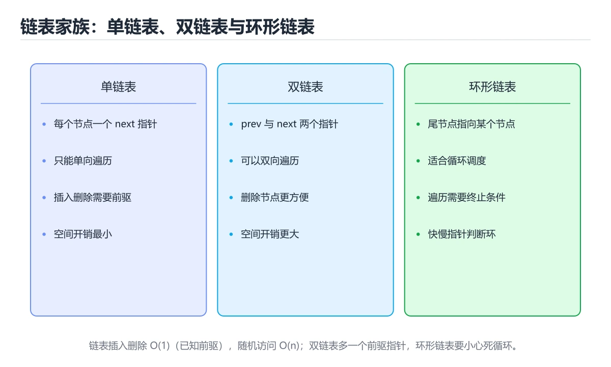
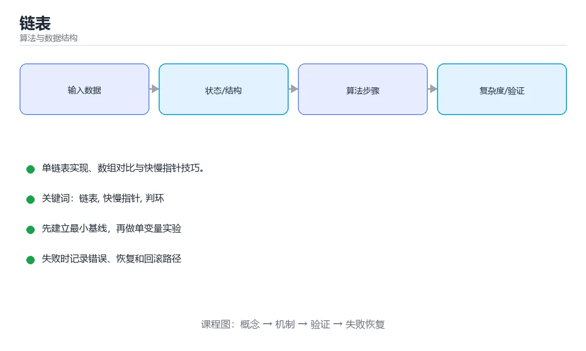

# 链表

> 内容更新时间：2026-10-06 · 学习阶段：进阶 · 预计用时：40 分钟





## 本节知识框架

**课程定位**：所属分类 `algorithms`（算法与数据结构），课程主题 `链表`，学习阶段 进阶，建议用时 40 分钟。

本课主线：单链表实现、数组对比与快慢指针技巧。

**学完本课应当能够**
- 说清 `list` 与 `if` 的含义与区别，并各举一个正例和一个反例。
- 用本课示例验证 `链表` 的行为，记录输入、输出与失败条件。
- 遇到「改指针前不保存 `next`」这类问题时，能说出触发条件与修复顺序。

### 从概念到验证的学习链条

1. `list`：先掌握 实际工程中数组（`list` / `vector`）用得更多，因为缓存友好；链表适合频繁在中间插删、或节点需要在别处被引用的场景，再用它解释 `if` 为什么会出现。
2. `if`：先掌握 链表的核心是**指针操作与边界处理**：加哑节点能省掉一半的 `if`；快慢指针能优雅解决找中点、判环、找倒数第 k 个等问题，再用它解释 `链表` 为什么会出现。
3. `链表`：先掌握 双向链表：节点同时保存 prev 与 next，删除更简单（LRU 缓存用它），再用它解释 `指针` 为什么会出现。
4. `指针`：先掌握 保存内存地址并可通过解引用访问目标对象的变量，再用它解释 本课示例的观察结果 为什么会出现。

**先修与衔接**：本课是「算法与数据结构」分类的第 8 课。先修内容：《栈与队列》。《栈与队列》里的 `deque`、`栈` 是本课的前提。相关或后续课程：《树与二叉搜索树》。

### 完成判据

- **定义关**：不看正文也能说明 `list` 是 实际工程中数组（`list` / `vector`）用得更多，因为缓存友好，链表适合频繁在中间插删、或节点需要在别处被引用的场景，并指出一个反例。
- **机制关**：能按“输入 → 转换 → 输出 → 验证”复述 `链表`，而不是只背结论。
- **示例关**：能运行或推演 `链表` 的 `python` 示例，并说明一个真实出现的标识符或字面量。
- **证据关**：能指出 `链表` 示例里的 调用了 `__init__()`，并说明它支持或反驳了本课的哪一条结论。
- **排错关**：能复现 改指针前不保存 `next`，记录现象并按 先 `nxt = cur.next` 再改指向 修复。
- **迁移关**：能把 `链表`、`快慢指针`、`判环`、`指针` 放进一个与 `链表` 不同的项目场景，并保持输入与验证条件可追踪。
- **复盘关**：学完 `链表` 后，用一句话写下仍然不确定的结论，并列出下一次验证需要的输入、环境和成功判据。

### 复习清单

- [ ] 能不看正文复述本课核心术语，并指出一个边界或反例。
- [ ] 能运行或推演本课示例，记录输入、输出与失败现象。
- [ ] 能完成一次自测，并把错题对照错误表定位原因。

## 核心概念定义

| 术语 | 操作性定义 | 常见边界与风险 |
| --- | --- | --- |
| list | 实际工程中数组（list / vector）用得更多，因为缓存友好；链表适合频繁在中间插删、或节点需要在别处被引用的场景。 | 越界、悬垂引用与释放顺序会破坏结论，必须在边界输入下复验。 |
| if | 链表的核心是**指针操作与边界处理**：加哑节点能省掉一半的 if；快慢指针能优雅解决找中点、判环、找倒数第 k 个等问题。 | 越界、悬垂引用与释放顺序会破坏结论，必须在边界输入下复验。 |
| 链表 | 双向链表：节点同时保存 prev 与 next，删除更简单（LRU 缓存用它）。 | 易错：链表断裂、丢失后续节点；正确做法是先 `nxt = cur.next` 再改指向。 |
| 指针 | 保存内存地址并可通过解引用访问目标对象的变量。 | 易错：链表断裂、丢失后续节点；正确做法是先 `nxt = cur.next` 再改指向。 |

## 原理与运行机制

### 机制总览

**教材衔接：结构与特点**

链表由节点组成，每个节点保存数据与指向下一个节点的指针。它不需要连续内存，插入删除是 `O(1)`，但随机访问是 `O(n)`。

```python
class Node:
    def __init__(self, value, next_node=None):
        self.value = value
        self.next = next_node

class LinkedList:
    def __init__(self):
        self.head = None

    def prepend(self, value):
        self.head = Node(value, self.head)      # 头插：O(1)

    def append(self, value):
        node = Node(value)
        if not self.head:
            self.head = node
            return
        current = self.head
        while current.next:                     # 尾插：O(n)
            current = current.next
        current.next = node

    def remove(self, value):
        dummy = Node(None, self.head)           # 哑节点简化边界处理
        prev, current = dummy, self.head
        while current:
            if current.value == value:
                prev.next = current.next
                break
            prev, current = current, current.next
        self.head = dummy.next

    def to_list(self):
        result, current = [], self.head
        while current:
            result.append(current.value)
            current = current.next
        return result
```

**教材衔接：与数组对比**

| 操作 | 数组 | 链表 |
| --- | --- | --- |
| 随机访问 | O(1) | O(n) |
| 头部插入删除 | O(n) | O(1) |
| 尾部插入 | 均摊 O(1) | O(1)（有尾指针） |
| 内存 | 连续，缓存友好 | 分散，指针有额外开销 |

实际工程中数组（`list` / `vector`）用得更多，因为缓存友好；链表适合频繁在中间插删、或节点需要在别处被引用的场景。

**教材衔接：常见变体**

- **双向链表**：节点同时保存 prev 与 next，删除更简单（LRU 缓存用它）。
- **循环链表**：尾节点指向头节点，适合轮询调度。
- **跳表**：多层链表 + 随机索引，Redis 有序集合的实现基础。

**教材衔接：快慢指针适用问题**

| 问题 | 做法 |
| --- | --- |
| 判断是否有环 | 快指针每次走 2 步，相遇即有环 |
| 找环入口 | 相遇后一指针回到头部，二者同速前进 |
| 找中间节点 | 快指针到尾时慢指针在中间 |
| 找倒数第 k 个 | 快指针先走 k 步，再同速前进 |
| 判断回文链表 | 找中点 + 反转后半段 + 比较 |

### 机制拆解：每一步的输入、动作与输出

#### 1. `list`
- 输入：`链表`；本步把 实际工程中数组（`list` / `vector`）用得更多，因为缓存友好；链表适合频繁在中间插删、或节点需要在别处被引用的场景 当作判断规则。
- 动作：围绕 `list` 保留中间状态，并记录它与 `if` 的对应关系。
- 输出：`if`，它可以被下一段代码、测试或记录继续使用。
- `list` 的失败条件：越界、悬垂引用与释放顺序会破坏结论，必须在边界输入下复验。

#### 2. `if`
- 输入：`list`；本步把 链表的核心是**指针操作与边界处理**：加哑节点能省掉一半的 `if`；快慢指针能优雅解决找中点、判环、找倒数第 k 个等问题 当作判断规则。
- 动作：围绕 `if` 保留中间状态，并记录它与 `链表` 的对应关系。
- 输出：`链表`，它可以被下一段代码、测试或记录继续使用。
- `if` 的失败条件：越界、悬垂引用与释放顺序会破坏结论，必须在边界输入下复验。

#### 3. `链表`
- 输入：`if`；本步把 双向链表：节点同时保存 prev 与 next，删除更简单（LRU 缓存用它） 当作判断规则。
- 动作：围绕 `链表` 保留中间状态，并记录它与 `指针` 的对应关系。
- 输出：`指针`，它可以被下一段代码、测试或记录继续使用。
- `链表` 的失败条件：当改指针前不保存 `next`时，会出现链表断裂、丢失后续节点。

#### 4. `指针`
- 输入：`链表`；本步把 保存内存地址并可通过解引用访问目标对象的变量 当作判断规则。
- 动作：围绕 `指针` 保留中间状态，并记录它与 `__init__` 的对应关系。
- 输出：`__init__`，它可以被下一段代码、测试或记录继续使用。
- `指针` 的失败条件：当改指针前不保存 `next`时，会出现链表断裂、丢失后续节点。

### 示例中的可观察事实

1. 调用了 `__init__()`；它对应的课程主题是 `链表`。
2. 调用了 `prepend()`；它对应的课程主题是 `链表`。
3. 调用了 `Node()`；它对应的课程主题是 `链表`。
4. 调用了 `append()`；它对应的课程主题是 `链表`。
5. 调用了 `remove()`；它对应的课程主题是 `链表`。
6. 调用了 `to_list()`；它对应的课程主题是 `链表`。
7. 调用了 `has_cycle()`；它对应的课程主题是 `链表`。
8. 调用了 `middle_node()`；它对应的课程主题是 `链表`。

### 复现实验记录

- 环境：`链表` 使用 `python` 示例，固定 `链表`、`快慢指针`、`判环`、`指针` 作为第一组条件。
- 首轮输入：先确认 调用了 `__init__()`，预测 `list` 会怎样变化。
- 基线观察：记录命令、输入、输出和错误原文，不用截图代替可复制的文本。
- 单变量修改：只改变 `链表`，观察 `指针` 是否仍满足定义。
- 失败注入：复现 改指针前不保存 `next`，确认现象是 链表断裂、丢失后续节点。
- 记录结论：把“修改前、修改后、预期变化、实际变化”写成四列表，这样复盘 `链表` 时才能区分概念错误与实现错误。

## 典型应用场景

- **改指针前不保存 `next`**：典型现象是链表断裂、丢失后续节点；正确做法是先 `nxt = cur.next` 再改指向。
- **删除节点时没更新前驱**：典型现象是节点仍被引用；正确做法是让 `prev.next = cur.next`。
- **快慢指针没检查 `fast.next`**：典型现象是空指针异常；正确做法是条件写 `while fast and fast.next:`。
- **用哨兵节点后又返回 `dummy`**：典型现象是结果多一个假节点；正确做法是返回 `dummy.next`。

### 最小验证场景

- 准备：保留 `python` 示例的原始输入，先记录 `链表` 的基线输出和完整运行命令。
- 观察：先核对 调用了 `__init__()`，再改变一个与 `list` 相关的条件。
- 判定：新结果与 `链表` 的基线不同不等于错误；只有当差异破坏了 `list` 的定义或错误表中的约束，才判定为失败。

### 选择与边界

- 使用 `list` 时，先满足它的定义：实际工程中数组（`list` / `vector`）用得更多，因为缓存友好；链表适合频繁在中间插删、或节点需要在别处被引用的场景；越界、悬垂引用与释放顺序会破坏结论，必须在边界输入下复验。
- 使用 `if` 时，先满足它的定义：链表的核心是**指针操作与边界处理**：加哑节点能省掉一半的 `if`；快慢指针能优雅解决找中点、判环、找倒数第 k 个等问题；越界、悬垂引用与释放顺序会破坏结论，必须在边界输入下复验。
- 使用 `链表` 时，先满足它的定义：双向链表：节点同时保存 prev 与 next，删除更简单（LRU 缓存用它）；易错：链表断裂、丢失后续节点；正确做法是先 `nxt = cur.next` 再改指向。
- 使用 `指针` 时，先满足它的定义：保存内存地址并可通过解引用访问目标对象的变量；易错：链表断裂、丢失后续节点；正确做法是先 `nxt = cur.next` 再改指向。

## 代码/协议/SQL 示例

### 最小可验证示例

**教材衔接：快慢指针技巧**

```python
def has_cycle(head):
    slow = fast = head
    while fast and fast.next:
        slow = slow.next
        fast = fast.next.next
        if slow is fast:
            return True
    return False

def middle_node(head):
    slow = fast = head
    while fast and fast.next:
        slow = slow.next
        fast = fast.next.next
    return slow.value          # 快指针走两步，慢指针正好在中点
```

**教材衔接：常用操作速查**

| 操作 | 单链表 | 双向链表 | 说明 |
| --- | --- | --- | --- |
| 头部插入/删除 | O(1) | O(1) | 最擅长的场景 |
| 尾部插入 | O(n)（无尾指针） | O(1) | 有尾指针也是 O(1) |
| 已知节点后插入 | O(1) | O(1) | 需要先拿到节点 |
| 删除已知节点 | O(n)（需前驱） | O(1) | 双向链表可直接删 |
| 按下标访问 | O(n) | O(n) | 链表不适合随机访问 |
| 反转 | O(n) | O(n) | 迭代改指针 |

```python
class Node:
    __slots__ = ("value", "next")

    def __init__(self, value, next=None):
        self.value = value
        self.next = next

def reverse(head):
    """迭代反转单链表，空间 O(1)。"""
    prev, cur = None, head
    while cur:
        nxt = cur.next
        cur.next = prev
        prev, cur = cur, nxt
    return prev

def has_cycle(head):
    """快慢指针判环；相遇后一指针回头可找环入口。"""
    slow = fast = head
    while fast and fast.next:
        slow = slow.next
        fast = fast.next.next
        if slow is fast:
            return True
    return False

def merge_sorted(a, b):
    """合并两个有序链表，复用节点不新建。"""
    dummy = Node(0)
    tail = dummy
    while a and b:
        if a.value <= b.value:      # <= 保证稳定
            tail.next, a = a, a.next
        else:
            tail.next, b = b, b.next
        tail = tail.next
    tail.next = a or b
    return dummy.next
```

**运行方式**：运行 `链表` 的示例时，保存为 `.py` 文件后用 `python 文件名.py` 运行；第三方依赖先在虚拟环境里安装。

### 示例精读：先找证据，再改一个条件

1. 调用了 `__init__()`；它出现在 `链表` 的示例中，阅读时先确认它前后各发生了什么。
2. 调用了 `prepend()`；它出现在 `链表` 的示例中，阅读时先确认它前后各发生了什么。
3. 调用了 `Node()`；它出现在 `链表` 的示例中，阅读时先确认它前后各发生了什么。
4. 调用了 `append()`；它出现在 `链表` 的示例中，阅读时先确认它前后各发生了什么。
5. 调用了 `remove()`；它出现在 `链表` 的示例中，阅读时先确认它前后各发生了什么。
6. 调用了 `to_list()`；它出现在 `链表` 的示例中，阅读时先确认它前后各发生了什么。
7. 调用了 `has_cycle()`；它出现在 `链表` 的示例中，阅读时先确认它前后各发生了什么。
8. 调用了 `middle_node()`；它出现在 `链表` 的示例中，阅读时先确认它前后各发生了什么。
- 在 `链表` 中与 `list` 对照：示例必须能支持 实际工程中数组（`list` / `vector`）用得更多，因为缓存友好；链表适合频繁在中间插删、或节点需要在别处被引用的场景，否则说明这一段还缺少实现或验证步骤。
- 在 `链表` 中与 `if` 对照：示例必须能支持 链表的核心是**指针操作与边界处理**：加哑节点能省掉一半的 `if`；快慢指针能优雅解决找中点、判环、找倒数第 k 个等问题，否则说明这一段还缺少实现或验证步骤。
- 在 `链表` 中与 `链表` 对照：示例必须能支持 双向链表：节点同时保存 prev 与 next，删除更简单（LRU 缓存用它），否则说明这一段还缺少实现或验证步骤。
- 在 `链表` 中与 `指针` 对照：示例必须能支持 保存内存地址并可通过解引用访问目标对象的变量，否则说明这一段还缺少实现或验证步骤。

## 时间/空间复杂度或性能分析

**复杂度证据**：本课正文出现 `O(1)`、`O(n)`、`O(n²)`、`O(log n)` 等量级表达式；使用前要同时确认输入规模、最好/平均/最坏情况以及常数项来源。

**测量方法**：以 `链表` 的 `链表` 场景为对象，固定输入跑一遍记录基线，再把规模或并发度提高一个数量级复测；两次结果的差值与波动范围才是结论依据。

### 需要控制的变量与记录项

- `链表` 的 `链表`：固定它的版本、输入范围和资源上限，分别记录速度、内存与失败率的变化。
- `链表` 的 `快慢指针`：固定它的版本、输入范围和资源上限，分别记录速度、内存与失败率的变化。
- `链表` 的 `判环`：固定它的版本、输入范围和资源上限，分别记录速度、内存与失败率的变化。
- `链表` 的 `指针`：固定它的版本、输入范围和资源上限，分别记录速度、内存与失败率的变化。
- `链表` 中 `list` 的边界：越界、悬垂引用与释放顺序会破坏结论，必须在边界输入下复验。达到边界时不要外推，必须重新测量。
- `链表` 中 `if` 的边界：越界、悬垂引用与释放顺序会破坏结论，必须在边界输入下复验。达到边界时不要外推，必须重新测量。
- `链表` 中 `链表` 的边界：易错：链表断裂、丢失后续节点；正确做法是先 `nxt = cur.next` 再改指向。达到边界时不要外推，必须重新测量。
- `链表` 中 `指针` 的边界：易错：链表断裂、丢失后续节点；正确做法是先 `nxt = cur.next` 再改指向。达到边界时不要外推，必须重新测量。
- `链表` 的代码证据：先验证 调用了 `__init__()`，再记录该路径的输入规模与耗时；只看代码行数不能推出复杂度。

## 常见误区与易错点

| 容易写错的做法 | 实际现象 | 原因与正确做法 |
| --- | --- | --- |
| 改指针前不保存 `next` | 链表断裂、丢失后续节点 | 先 `nxt = cur.next` 再改指向 |
| 删除节点时没更新前驱 | 节点仍被引用 | 让 `prev.next = cur.next` |
| 快慢指针没检查 `fast.next` | 空指针异常 | 条件写 `while fast and fast.next:` |
| 用哨兵节点后又返回 `dummy` | 结果多一个假节点 | 返回 `dummy.next` |
| 头节点被删除时忘记更新 head | 结果丢头 | 用哨兵节点简化边界 |
| 认为链表插入总是 O(1) | 忽略了查找前驱的成本 | 明确「已知位置」才是 O(1) |
| 用链表替代数组做随机访问 | 性能极差 | 数组更适合下标访问 |
| 忘记处理空链表与单节点 | 边界崩溃 | 专门测试这两种输入 |
| 反转后没更新头指针 | 遍历不到 | 返回新的头（原尾节点） |
| 链表节点无 `__slots__` | 内存开销大 | 大量节点时用 `__slots__` 优化 |
| 改指针前不保存 next | 链表断裂、丢失后续节点。 | 先 nxt = cur.next 再改指向。 |
| 用哨兵节点后又返回 dummy | 结果多一个假节点。 | 返回 dummy.next。 |

### 现场 1：改指针前不保存 `next`

**症状**：链表断裂、丢失后续节点。

**根因与修复**：先 `nxt = cur.next` 再改指向。

**自检**：在本课示例里复现「改指针前不保存 `next`」，改成先 `nxt = cur.next` 再改指向后重跑；如果症状消失且失败路径按预期变化，说明定位正确。

### 现场 2：删除节点时没更新前驱

**症状**：节点仍被引用。

**根因与修复**：让 `prev.next = cur.next`。

**自检**：在本课示例里复现「删除节点时没更新前驱」，改成让 `prev.next = cur.next`后重跑；如果症状消失且失败路径按预期变化，说明定位正确。

### 现场 3：快慢指针没检查 `fast.next`

**症状**：空指针异常。

**根因与修复**：条件写 `while fast and fast.next:`。

**自检**：在本课示例里复现「快慢指针没检查 `fast.next`」，改成条件写 `while fast and fast.next:`后重跑；如果症状消失且失败路径按预期变化，说明定位正确。

### 现场 4：用哨兵节点后又返回 `dummy`

**症状**：结果多一个假节点。

**根因与修复**：返回 `dummy.next`。

**自检**：在本课示例里复现「用哨兵节点后又返回 `dummy`」，改成返回 `dummy.next`后重跑；如果症状消失且失败路径按预期变化，说明定位正确。

### 现场 5：头节点被删除时忘记更新 head

**症状**：结果丢头。

**根因与修复**：用哨兵节点简化边界。

**自检**：在本课示例里复现「头节点被删除时忘记更新 head」，改成用哨兵节点简化边界后重跑；如果症状消失且失败路径按预期变化，说明定位正确。

### 现场 6：认为链表插入总是 O(1)

**症状**：忽略了查找前驱的成本。

**根因与修复**：明确「已知位置」才是 O(1)。

**自检**：在本课示例里复现「认为链表插入总是 O(1)」，改成明确「已知位置」才是 O(1)后重跑；如果症状消失且失败路径按预期变化，说明定位正确。

### 现场 7：用链表替代数组做随机访问

**症状**：性能极差。

**根因与修复**：数组更适合下标访问。

**自检**：在本课示例里复现「用链表替代数组做随机访问」，改成数组更适合下标访问后重跑；如果症状消失且失败路径按预期变化，说明定位正确。

### 现场 8：忘记处理空链表与单节点

**症状**：边界崩溃。

**根因与修复**：专门测试这两种输入。

**自检**：在本课示例里复现「忘记处理空链表与单节点」，改成专门测试这两种输入后重跑；如果症状消失且失败路径按预期变化，说明定位正确。

### 现场 9：反转后没更新头指针

**症状**：遍历不到。

**根因与修复**：返回新的头（原尾节点）。

**自检**：在本课示例里复现「反转后没更新头指针」，改成返回新的头（原尾节点）后重跑；如果症状消失且失败路径按预期变化，说明定位正确。

## 与其他知识点的关系

**教材衔接：复习与迁移**

### 概念复述

- 用一句话说明「链表」解决什么问题：单链表实现、数组对比与快慢指针技巧。
- 写出链表、快慢指针、判环之间的关系，并各举一个例子。
- 说出本课最容易混淆的两个概念，以及区分它们的判据。

### 正文逐节复核

- **结构与特点**：链表由节点组成，每个节点保存数据与指向下一个节点的指针。
- **与数组对比**：实际工程中数组（`list` / `vector`）用得更多，因为缓存友好；链表适合频繁在中间插删、或节点需要在别处被引用的场景。


### 迁移练习

把「链表」的结论迁移到相邻主题，每次迁移都写清预测与证据：

- **先修**：`栈与队列`。本课默认这些内容已经掌握。
- **相关或后续**：`树与二叉搜索树`。本课术语会在这些课程里继续使用。
- **术语归属**：`list`、`if`、`链表` 的定义以本课「核心概念定义」为准，换到其他课程时先确认定义是否被改写。

### 先修与后续术语接口

- `栈与队列`：两者通过本分类的学习顺序衔接，阅读时重点比较各自的输入与失败条件。
- `树与二叉搜索树`：两者通过本分类的学习顺序衔接，阅读时重点比较各自的输入与失败条件。

### 容易混淆的相邻概念

- `list` 与 `if`：前者强调 实际工程中数组（`list` / `vector`）用得更多，因为缓存友好；链表适合频繁在中间插删、或节点需要在别处被引用的场景；后者强调 链表的核心是**指针操作与边界处理**：加哑节点能省掉一半的 `if`；快慢指针能优雅解决找中点、判环、找倒数第 k 个等问题。判断时分别检查两条定义的适用范围，不要只看名称相似就互换。
- `if` 与 `链表`：前者强调 链表的核心是**指针操作与边界处理**：加哑节点能省掉一半的 `if`；快慢指针能优雅解决找中点、判环、找倒数第 k 个等问题；后者强调 双向链表：节点同时保存 prev 与 next，删除更简单（LRU 缓存用它）。判断时分别检查两条定义的适用范围，不要只看名称相似就互换。
- `链表` 与 `指针`：前者强调 双向链表：节点同时保存 prev 与 next，删除更简单（LRU 缓存用它）；后者强调 保存内存地址并可通过解引用访问目标对象的变量。判断时分别检查两条定义的适用范围，不要只看名称相似就互换。

## 自测题与参考答案

> 先独立作答，再对照参考答案；答案都能在本课正文、术语表或错误表里找到依据。

### 自测 1（概念复述）

不看正文，写出 `list` 的操作性定义，并说明它与 `if` 的区别。

**参考答案**：实际工程中数组（`list` / `vector`）用得更多，因为缓存友好；链表适合频繁在中间插删、或节点需要在别处被引用的场景。

`if` 的定位是：链表的核心是**指针操作与边界处理**：加哑节点能省掉一半的 `if`；快慢指针能优雅解决找中点、判环、找倒数第 k 个等问题；两者的差别要从适用对象与失败模式上说明。

### 自测 2（排错）

本课错误表记录了「改指针前不保存 `next`」这类做法。请写出它会出现的现象、根因，以及修复顺序。

**参考答案**：现象是链表断裂、丢失后续节点；正确做法是先 `nxt = cur.next` 再改指向。修复时先复现现象并保留证据，再改动一处假设重跑，确认现象消失。

### 自测 3（动手验证）

运行本课的 `python` 示例，把其中的 `1` 换成一个边界值后重新运行，记录输出与错误信息。

**参考答案**：正常输入下 `python` 示例应当复现正文给出的结果；把 `1` 换成边界值后，如果结果改变或报错，先核对它是否满足 `链表` 中`list` 的适用范围，再检查错误表里是否有同类现象。

### 自测 4（代码阅读）

阅读本课开头的 `python` 示例，说明它体现了`list` 的哪一条性质，并指出改动哪个输入会让这条性质不再成立。

**参考答案**：`list` 的定义是 实际工程中数组（`list` / `vector`）用得更多，因为缓存友好，链表适合频繁在中间插删、或节点需要在别处被引用的场景，示例正是在实现这条定义。改动与 `list` 有关的一个输入后，如果结果不再符合 `链表` 的正文描述，就说明该性质只在当前前提成立。

### 自测 5（迁移）

把 `链表` 的方法迁移到自己的项目：围绕 `list` 写出一个与错误表同类的风险点，并说明触发条件和检验方式。

**参考答案**：例如「用哨兵节点后又返回 dummy」，它会导致结果多一个假节点；检验方式是按返回 dummy.next改一处再复现，确认现象消失且没有引入新的失败分支。

### 自测 6（对比）

用一个表格对比 `list` 与 `if`：各写一行适用场景、一行失败表现。

**参考答案**：`list` 的定义是实际工程中数组（`list` / `vector`）用得更多，因为缓存友好；链表适合频繁在中间插删、或节点需要在别处被引用的场景；`if` 的定义是链表的核心是**指针操作与边界处理**：加哑节点能省掉一半的 `if`；快慢指针能优雅解决找中点、判环、找倒数第 k 个等问题。两者的失败表现分别对应本课错误表里与本术语相关的行。

### 自测 7（排错顺序）

面对「改指针前不保存 `next`」引发的问题，请把“复现 链表断裂、丢失后续节点 → 保留证据 → 先 `nxt = cur.next` 再改指向 → 回归验证”四步写成可执行的检查清单。

**参考答案**：第一步按链表断裂、丢失后续节点复现；第二步记录输入、版本与完整报错；第三步按先 `nxt = cur.next` 再改指向只改一处；第四步重跑并确认失败路径也按预期变化。

### 自测 8（边界判断）

针对 `指针`，分别写出“可以使用”的条件和“结论不再成立”的条件。

**参考答案**：易错：链表断裂、丢失后续节点；正确做法是先 `nxt = cur.next` 再改指向。 同时要把 `指针` 的定义 保存内存地址并可通过解引用访问目标对象的变量 与实际输入逐项对照。

### 自测 9（机制重建）

不看正文，按输入、转换、输出、验证四段重建 `list` → `if` → `链表` → `指针` 的作用链。

**参考答案**：起点是 `list` 的定义 实际工程中数组（`list` / `vector`）用得更多，因为缓存友好；链表适合频繁在中间插删、或节点需要在别处被引用的场景；中间每一步都保留可观察状态；终点由 `指针` 检查，失败时回到错误表定位第一个偏离定义的步骤。

### 自测 10（综合排错）

在 `链表` 中，现象是 结果多一个假节点。请围绕 用哨兵节点后又返回 dummy 写出最小复现、关键证据、修复动作和回归验证，并说明为什么不能只凭一次运行下结论。

**参考答案**：先复现 用哨兵节点后又返回 dummy，记录输入与完整错误；再按 返回 dummy.next 只改一处。回归时同时跑正常路径和边界路径，只有两次结果都可解释，才把修复视为完成。

### 自测 11（一分钟复述）

用每分钟约 200 字的速度复述 `链表`：先给主问题，再按顺序说出 `list`、`if`、`链表`、`指针`，最后给一个失败案例。

**自评标准**：主问题必须对应 单链表实现、数组对比与快慢指针技巧；每个术语都要能接上一句定义或边界；失败案例必须写成可观察现象，不能用“可能有风险”代替证据。

## 术语速查

| 术语 | 一句话说明 |
| --- | --- |
| `list` | 实际工程中数组（`list` / `vector`）用得更多，因为缓存友好；链表适合频繁在中间插删、或节点需要在别处被引用的场景。 |
| `if` | 链表的核心是**指针操作与边界处理**：加哑节点能省掉一半的 `if`；快慢指针能优雅解决找中点、判环、找倒数第 k 个等问题。 |
| `链表` | 双向链表：节点同时保存 prev 与 next，删除更简单（LRU 缓存用它）。 |
| `指针` | 保存内存地址并可通过解引用访问目标对象的变量。 |

**术语关系**：`list`（实际工程中数组（`list` / `vector`）用得更多） → `if`（链表的核心是**指针操作与边界处理**：加哑节点能省掉一半的 `if`） → `链表`（双向链表：节点同时保存 prev 与 next） → `指针`（保存内存地址并可通过解引用访问目标对象的变量）。

## 考点精讲

`链表` 的题库有 6 道题，下面逐题给出题干、正确项与判断依据：先自己作答，再核对正确项，最后回到正文对应小节复核。

### 考点 1：第 1 题

- **题目**：链表随机访问第 k 个元素的时间复杂度是？
- **正确项**：O(n)
- **判断依据**：这道题落在术语 `链表` 上：双向链表：节点同时保存 prev 与 next，删除更简单（LRU 缓存用它）。复习时把 `链表` 的定义、适用边界和一个反例一起说清楚，再回到「核心概念定义」核对原文。

### 考点 2：第 2 题

- **题目**：围绕“链表”中的 链表、快慢指针、判环，下列哪两项是本课强调的实践判断？
- **正确项**：验证 快慢指针 时要固定版本并覆盖边界输入，结论才可复现；学习 链表 时要同时说明输入、输出和失败路径，不能只看正常流程
- **判断依据**：这道题落在术语 `链表` 上：双向链表：节点同时保存 prev 与 next，删除更简单（LRU 缓存用它）。复习时把 `链表` 的定义、适用边界和一个反例一起说清楚，再回到「核心概念定义」核对原文。

### 考点 3：第 3 题

- **题目**：在链表头部插入一个节点的时间复杂度是？
- **正确项**：O(1)
- **判断依据**：这道题落在术语 `链表` 上：双向链表：节点同时保存 prev 与 next，删除更简单（LRU 缓存用它）。复习时把 `链表` 的定义、适用边界和一个反例一起说清楚，再回到「核心概念定义」核对原文。

### 考点 4：第 4 题

- **题目**：下面这段 `python` 代码来自 `链表`。课程主线是单链表实现、数组对比与快慢指针技巧。代码与 `list` 有关。哪一项是代码里真实出现的内容？
- **正确项**：调用了 `Node()`
- **判断依据**：这道题落在术语 `list` 上：实际工程中数组（`list` / `vector`）用得更多，因为缓存友好，链表适合频繁在中间插删、或节点需要在别处被引用的场景。复习时把 `list` 的定义、适用边界和一个反例一起说清楚，再回到「核心概念定义」核对原文。

### 考点 5：第 5 题

- **题目**：双向链表相比单链表付出的主要代价是？
- **正确项**：每个节点多存一个前驱指针
- **判断依据**：这道题落在术语 `链表` 上：双向链表：节点同时保存 prev 与 next，删除更简单（LRU 缓存用它）。复习时把 `链表` 的定义、适用边界和一个反例一起说清楚，再回到「核心概念定义」核对原文。

### 考点 6：第 6 题

- **题目**：填空：补齐下面这段术语说明中的空缺。课程 `单链表实现、数组对比与快慢指针技巧。`，这段说明是：双向`____`：节点同时保存 prev 与 next，删除更简单（LRU 缓存用它）。空缺处应填哪个术语？
- **正确项**：链表
- **判断依据**：这道题落在术语 `链表` 上：双向链表：节点同时保存 prev 与 next，删除更简单（LRU 缓存用它）。复习时把 `链表` 的定义、适用边界和一个反例一起说清楚，再回到「核心概念定义」核对原文。

### 考点 7：`list`

- **要点**：实际工程中数组（`list` / `vector`）用得更多，因为缓存友好；链表适合频繁在中间插删、或节点需要在别处被引用的场景。
- **list 的边界**：越界、悬垂引用与释放顺序会破坏结论，必须在边界输入下复验。

### 考点 8：`if`

- **要点**：链表的核心是**指针操作与边界处理**：加哑节点能省掉一半的 `if`；快慢指针能优雅解决找中点、判环、找倒数第 k 个等问题。
- **if 的边界**：越界、悬垂引用与释放顺序会破坏结论，必须在边界输入下复验。

### 考点 9：`链表`

- **要点**：双向链表：节点同时保存 prev 与 next，删除更简单（LRU 缓存用它）。
- **链表 的边界**：易错：链表断裂、丢失后续节点；正确做法是先 `nxt = cur.next` 再改指向。

### 考点 10：`指针`

- **要点**：保存内存地址并可通过解引用访问目标对象的变量。
- **指针 的边界**：易错：链表断裂、丢失后续节点；正确做法是先 `nxt = cur.next` 再改指向。

### 考点 11：排错——改指针前不保存 `next`

- **现象**：链表断裂、丢失后续节点。
- **处理**：先 `nxt = cur.next` 再改指向。

### 考点 12：排错——删除节点时没更新前驱

- **现象**：节点仍被引用。
- **处理**：让 `prev.next = cur.next`。

### 考点 13：综合辨析——`list` 与 `指针`

- **辨析点**：`list` 的定义是 实际工程中数组（`list` / `vector`）用得更多，因为缓存友好；链表适合频繁在中间插删、或节点需要在别处被引用的场景；`指针` 的定义是 保存内存地址并可通过解引用访问目标对象的变量。
- **答题要求**：面对 `链表` 的题目，先判断描述的是 `list` 还是 `指针`，再归到对应定义，最后写出一个会让该定义失效的边界输入。

### 考点 14：排错评分点

- **现象分**：能写出 链表断裂、丢失后续节点，而不是只写“程序有错”。
- **证据分**：保留触发 改指针前不保存 `next` 的输入、版本和错误原文。
- **修复分**：按 先 `nxt = cur.next` 再改指向 只改一处，并同时回归正常路径与边界路径。

## 内容元数据

- 内容版本：v2.0
- 最后更新：2026-10-06
- 学习阶段：进阶
- 适用环境：任意主流语言（伪代码与复杂度为主）
；本课聚焦 链表。
- 内容来源：内置结构化课程与工程实践整理
- 相关主题：链表、快慢指针、判环、指针
- 质量版本：P0 测验标准 + P1 覆盖扩展 + P2 体验补全

## 参考资料与复核

- 最后复核：2026-10-04
- 下次复核：2027-05-24
- 复核范围：版本兼容、API 行为、安全建议与工程实践
- 来源性质：官方文档、标准或权威教材；本课核对关键词：链表、快慢指针、判环、指针。

| 参考资料 | 本课用途 |
| --- | --- |
| [CP-Algorithms](https://cp-algorithms.com/) | 算法实现与复杂度 |
| [LeetCode 学习](https://leetcode.com/explore/) | 算法题训练与模式 |
| [OI Wiki](https://oi-wiki.org/) | 竞赛算法与数据结构 |

| [本课术语索引：链表](#核心概念定义) | 按本课输入、术语边界和错误表现逐项核对 |
> 「链表」的链接用于离线阅读后的延伸核对；App 不会自动联网。