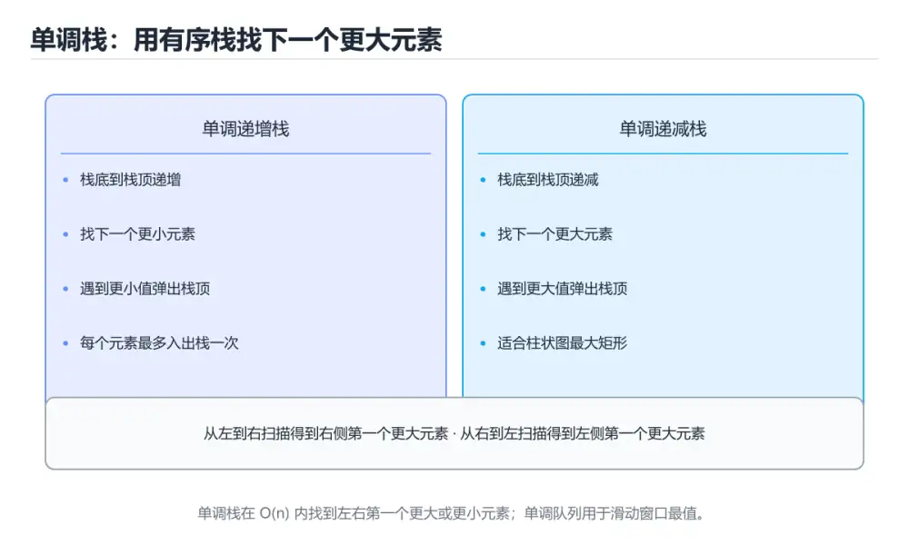
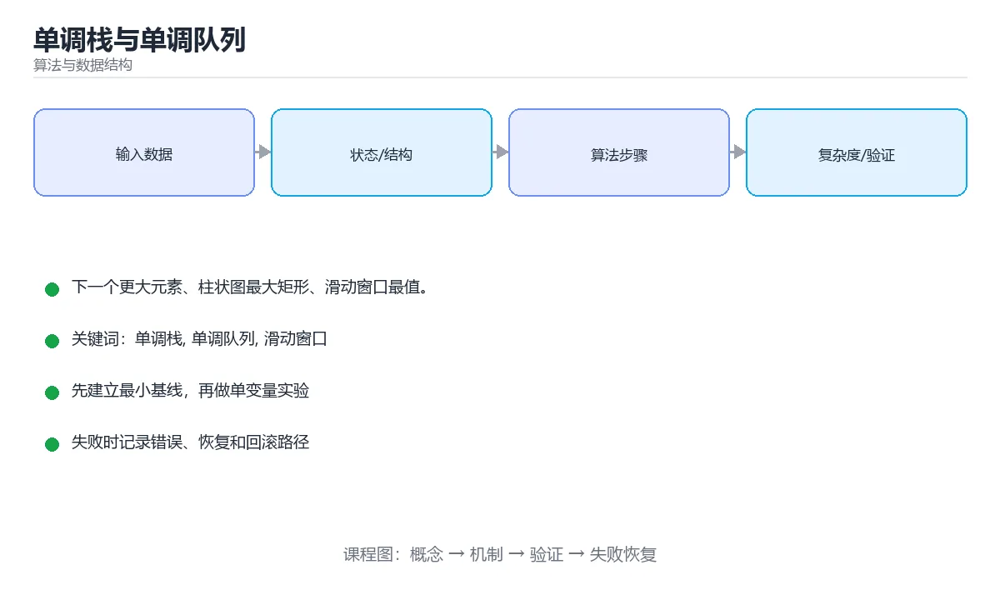

# 单调栈与单调队列

> 内容更新时间：2026-10-06 · 学习阶段：进阶 · 预计用时：45 分钟





## 本节知识框架

**课程定位**：所属分类为「算法与数据结构」，课程主题为「单调栈与单调队列」，学习阶段为「进阶」，建议用时 45 分钟。

**本课要解决的主问题**：下一个更大元素、柱状图最大矩形、滑动窗口最值。

| 学习层次 | 要回答的问题 | 完成判据 |
| --- | --- | --- |
| 概念层 | 「单调栈与单调队列」有哪些必须区分的对象与术语？ | 能用自己的话定义核心术语，并各举一个正例和一个反例。 |
| 机制层 | 这些对象按什么顺序发生作用，输入如何变成输出？ | 能画出或写出机制步骤，并说明每一步的失败条件。 |
| 应用层 | 什么场景适合使用「单调栈与单调队列」，什么场景不适合？ | 能给出一个真实场景、一个最小示例和一个边界案例。 |
| 性能层 | 时间、空间、吞吐或延迟受哪些量影响？ | 能说出复杂度或性能瓶颈的证据来源；没有证据时明确写“材料未提供”。 |
| 复习层 | 怎样确认自己不是只记住了结论？ | 能独立完成本课自测，并把错误定位到概念、机制、示例或边界。 |

### 阅读路线

1. 先读「核心概念定义」，建立「单调栈」等对象的精确定义。
2. 再读「原理与运行机制」，把定义串成可重复的过程。
3. 用「代码/协议/SQL 示例」验证过程，并只改一个条件观察结果变化。
4. 最后检查性能、易错点、知识关系与自测题，形成可复习的证据链。

**前置知识**：没有硬性先修课；仍建议先具备本分类的基础阅读与操作能力。

**学习位置**：本课位于《字典树（Trie）》之后；如果前一课的自测不能通过，应先回补再继续。

**后续衔接**：下一课《二分答案》会继续使用本课术语，学完后建议立即完成一次自测。

**教材衔接：学习目标**

- 能用自己的话解释单调栈与单调队列解决了什么问题，而不是只背术语。
- 能说清 「单调栈」、「单调队列」、「滑动窗口」、「下一个更大元素」 之间的关系，并分别举出一个例子。
- 能把 单调栈 放回「单调栈与单调队列」的知识体系，说明它和 单调队列 的边界。
- 能完成本课练习，并用验收标准检查自己的结果。

> 一句话摘要：下一个更大元素、柱状图最大矩形、滑动窗口最值。

**教材衔接：前置知识**

- 先完成上一课《树状数组与线段树》；如果已经掌握，可以直接用本课练习自测。
- 本课阶段：进阶。建议先掌握同一分类的基础课程，并能独立运行正文里的 daily_temperatures 示例。
- 开始前先复习：单调栈、单调队列、滑动窗口。
- 看不懂就直接缩小例子：只保留 单调栈 相关的两行输入，跑通后再加回其余部分。

**教材衔接：本课小结**

单调结构的本质是**及时淘汰永远不会成为答案的元素**：栈负责「之后的更大值」，队列负责「窗口内的极值」，两者都把 O(n²) 的暴力枚举压到 O(n)。

## 核心概念定义

> 阅读约定：本课先给「单调栈与单调队列」相关术语的操作性定义与适用边界；正文里的口语化说法与定义冲突时，以定义和可复现示例为准。

| 术语 | 操作性定义 | 本课中的边界 |
| --- | --- | --- |
| 单调栈 | 维护单调顺序的栈，用于找下一个更大元素和直方图边界。 | 仅在「单调栈与单调队列」明确给出的输入、版本与资源条件下成立。 |
| 单调队列 | 维护候选值单调顺序的队列，常用滑动窗口最值。 | 仅在「单调栈与单调队列」明确给出的输入、版本与资源条件下成立。 |
| 滑动窗口 | 在时间轴上只统计最近一段窗口内的请求或事件，用平滑突发并限制瞬时速率。 | 仅在「单调栈与单调队列」明确给出的输入、版本与资源条件下成立。 |
| 下一个更大元素 | 右边第一个比当前元素大的位置；用单调栈一遍扫完，复杂度 O(n)。 | 仅在「单调栈与单调队列」明确给出的输入、版本与资源条件下成立。 |

### 定义如何使用

在「单调栈与单调队列」中判断一个说法是否成立，先确认它使用的是哪个对象的定义，再检查输入规模、运行环境与失败路径。定义不是口号，而是后续推导、代码示例和自测题共享的约束。

## 原理与运行机制

### 机制总览

1. **建立输入**：把「单调栈」按本课定义整理成可观察、可重复的输入条件。
2. **执行转换**：围绕「单调队列」执行本课的核心步骤；每一步都记录中间状态，避免只看最终输出。
3. **产生输出**：得到「滑动窗口」后，用正文示例或协议/SQL 结果核对输出是否符合预期。
4. **改变一个条件**：只替换一个边界条件或环境参数，观察「单调栈与单调队列」的结论是否仍然成立。

| 阶段 | 关注对象 | 失败时应检查 |
| --- | --- | --- |
| 输入 | 单调栈 | 类型、范围、编码、版本或前置状态是否满足定义。 |
| 处理 | 单调队列 | 顺序、可见性、锁、路由、事务或调度规则是否被破坏。 |
| 输出 | 滑动窗口 | 结果是否可复现，错误是否被正确传播而不是被吞掉。 |

本课的机制结论要用「单调栈与单调队列」自己的示例验证。「单调栈与单调队列」没有给出某个数量级、吞吐或内存数据时，本课把该判断标为“材料未提供”，不从相邻主题外推。

**教材衔接：识别信号**

| 题目特征 | 结构 |
| --- | --- |
| 下一个更大/更小、左右第一个满足条件的元素 | 单调栈 |
| 柱状图/接雨水/子数组最小值之和 | 单调栈 |
| 固定窗口的最值 | 单调队列 |
| 需要动态维护窗口内极值 | 单调队列 |

**教材衔接：题型识别与模板速记**

| 题目特征 | 用哪个 | 单调方向 |
| --- | --- | --- |
| 右边第一个更大的数 | 单调栈 | 栈内递减（新元素更大则弹出） |
| 右边第一个更小的数 | 单调栈 | 栈内递增 |
| 左边第一个更大/更小 | 从右往左遍历同一模板 | 同上 |
| 固定窗口最大值 | 单调队列 | 队列递减，队首最大 |
| 固定窗口最小值 | 单调队列 | 队列递增 |
| 柱状图最大矩形 | 单调栈 + 哨兵 0 收尾 | 栈内递增 |

模板三行速记：**新元素入栈前，弹出所有破坏单调性的元素并结算它们；然后入栈；遍历结束后清空栈**。每个元素最多进出各一次，所以整体是 O(n)，比暴力枚举区间少一个数量级。窗口题的额外一步是：队首下标滑出窗口时从队首移除。

**教材衔接：题型速查**

| 题目类型 | 结构 | 单调方向 |
| --- | --- | --- |
| 下一个更大元素 | 栈 | 递减（栈顶最小） |
| 下一个更小元素 | 栈 | 递增 |
| 每日温度 | 栈 | 递减 |
| 柱状图最大矩形 | 栈 | 递增 |
| 接雨水 | 栈 / 双指针 | 递增 |
| 滑动窗口最大值 | 队列 | 递减 |
| 滑动窗口最小值 | 队列 | 递增 |
| 去除重复字母（字典序最小） | 栈 + 计数 | 递增 |

## 典型应用场景

| 场景 | 典型输入或前提 | 期望产物 |
| --- | --- | --- |
| 学习验证 | 使用本课最小示例和 单调栈、单调队列 | 能复现正文结论，并解释每一步。 |
| 工程落地 | 把「单调栈与单调队列」放入真实模块或服务边界 | 输出可观测、失败可定位、参数可配置。 |
| 故障排查 | 只改一个版本、规模、输入或依赖条件 | 能区分概念错误、实现错误和环境差异。 |

判断「单调栈与单调队列」的场景是否成立，标准是能否写出输入、处理、输出和失败路径；材料中没有出现的数据在本课标注为“材料未提供”，不用推测替代证据。

**课程内置实验入口**：`interactive`，用于动手验证《单调栈与单调队列》的机制；实验结论不替代概念定义与复杂度分析。

**教材衔接：经典应用**

```python
def largest_rectangle(heights):
    """柱状图中最大矩形面积"""
    stack, best = [], 0
    for i, h in enumerate(heights + [0]):        # 末尾加 0 保证全部弹出
        start = i
        while stack and stack[-1][1] > h:
            index, height = stack.pop()
            best = max(best, height * (i - index))
            start = index
        stack.append((start, h))
    return best

def daily_temperatures(temps):
    """每天要等几天才有更高温度"""
    result, stack = [0] * len(temps), []
    for i, t in enumerate(temps):
        while stack and temps[stack[-1]] < t:
            j = stack.pop()
            result[j] = i - j
        stack.append(i)
    return result
```

## 代码/协议/SQL 示例

### 最小可验证示例

下面保留《单调栈与单调队列》原文中的最小示例。先预测《单调栈与单调队列》示例的输出，再按正文步骤运行或推演；示例依赖外部环境时，同时记录版本与输入。

```python
def next_greater(nums):
    """返回每个元素右侧第一个更大元素的下标，没有则为 -1"""
    result = [-1] * len(nums)
    stack = []                      # 存下标，对应值单调递减
    for i, value in enumerate(nums):
        while stack and nums[stack[-1]] < value:
            result[stack.pop()] = i
        stack.append(i)
    return result

print(next_greater([2, 1, 5, 3, 4]))   # [2, 2, -1, 4, -1]
```

**教材衔接：单调栈：找下一个更大/更小元素**

栈内元素保持单调（递增或递减），新元素入栈前弹出所有破坏单调性的元素——被弹出的元素正好找到了它的答案。

```python
def next_greater(nums):
    """返回每个元素右侧第一个更大元素的下标，没有则为 -1"""
    result = [-1] * len(nums)
    stack = []                      # 存下标，对应值单调递减
    for i, value in enumerate(nums):
        while stack and nums[stack[-1]] < value:
            result[stack.pop()] = i
        stack.append(i)
    return result

print(next_greater([2, 1, 5, 3, 4]))   # [2, 2, -1, 4, -1]
```

每个元素最多入栈出栈一次，复杂度 `O(n)`。

**教材衔接：单调队列：滑动窗口最值**

队列中存下标，值单调递减，队首就是窗口最大值；超出窗口范围的下标从队首弹出。

```python
from collections import deque

def max_sliding_window(nums, k):
    queue, result = deque(), []
    for i, value in enumerate(nums):
        while queue and nums[queue[-1]] <= value:
            queue.pop()                      # 维护单调递减
        queue.append(i)
        if queue[0] <= i - k:
            queue.popleft()                  # 移除滑出窗口的下标
        if i >= k - 1:
            result.append(nums[queue[0]])
    return result

print(max_sliding_window([1, 3, -1, -3, 5, 3], 3))   # [3, 3, 5, 5]
```

用堆也能做，但复杂度是 `O(n log n)`；单调队列是 `O(n)`。

**教材衔接：模板**

```python
from collections import deque

def next_greater(nums):
    """下一个更大元素的下标；不存在记 -1。"""
    result = [-1] * len(nums)
    stack = []                       # 存下标，对应值单调递减
    for i, value in enumerate(nums):
        while stack and nums[stack[-1]] < value:
            result[stack.pop()] = i
        stack.append(i)
    return result

def largest_rectangle(heights):
    """柱状图中最大矩形：单调递增栈，两端补 0 作哨兵。"""
    stack, best = [], 0
    for i, h in enumerate(list(heights) + [0]):
        while stack and heights[stack[-1]] > h:
            height = heights[stack.pop()]
            width = i if not stack else i - stack[-1] - 1
            best = max(best, height * width)
        stack.append(i)
    return best

def sliding_window_max(nums, k):
    """滑动窗口最大值：单调递减队列，队首即最大值。"""
    queue = deque()                  # 存下标
    result = []
    for i, value in enumerate(nums):
        while queue and nums[queue[-1]] <= value:
            queue.pop()              # 比新元素小的都不可能是最大值
        queue.append(i)
        if queue[0] <= i - k:        # 队首已滑出窗口
            queue.popleft()
        if i >= k - 1:
            result.append(nums[queue[0]])
    return result
```

## 时间/空间复杂度或性能分析

**复杂度证据**：本课正文出现 `O(n)`、`O(n log n)`、`O(n²)`、`O(log n)` 等量级表达式；使用前要同时确认输入规模、最好/平均/最坏情况以及常数项来源。

| 维度 | 本课关注点 | 判断依据 |
| --- | --- | --- |
| 时间/延迟 | 「单调栈与单调队列」的主要步骤是否会随输入规模、并发度或网络往返增长。 | 以正文复杂度、基准数据或可重复测量为准。 |
| 空间/内存 | 中间状态、缓存、副本、连接或索引是否随规模增长。 | 记录峰值内存与数据副本，不只看最终结果。 |
| 吞吐/资源 | 版本、调度、锁、IO、序列化或协议开销是否成为瓶颈。 | 固定环境做对照实验，改变一个变量。 |

评估「单调栈与单调队列」时要区分“正确性成立”和“性能达标”两件事；材料没有给出基准时，本课只保留量级来源与测量方法，不写不可验证的绝对数字。

## 常见误区与易错点

> 复核《单调栈与单调队列》的易错点时，优先保留原文的错误表、故障现场与排错路径；每条修正都要能用本课示例复验。

| 易错点 | 常见表现 | 正确做法 |
| --- | --- | --- |
| 只背结论 | 能复述「单调栈与单调队列」的定义，却说不清输入、输出与边界。 | 回到机制步骤，用最小示例逐一验证。 |
| 混淆相邻概念 | 把本课对象与相邻主题的对象当成同一类。 | 先比较定义、资源归属、生命周期和失败模式。 |
| 忽略版本与环境 | 在开发机通过后直接外推到生产环境。 | 固定版本、输入和资源条件，再记录可复现结果。 |

**教材衔接：常见错误与排查**

| 容易写错的做法 | 实际现象 | 原因与正确做法 |
| --- | --- | --- |
| 栈里存值而不存下标 | 无法计算宽度或距离 | 存下标，用时再取值 |
| 比较符号写反 | 得到「更小」而不是「更大」 | 明确单调方向并按题型验证 |
| 弹出条件用 `<=` 还是 `<` 混淆 | 相等元素的处理不同 | 按题意决定是否保留相等元素 |
| 忘记处理栈中剩余元素 | 结果缺少尾部答案 | 遍历结束后清栈或加哨兵 |
| 单调队列忘记移除过期下标 | 结果取到窗口外的值 | 检查 `queue[0] <= i - k` |
| 用双重循环求下一个更大 | O(n²) 超时 | 改成单调栈 O(n) |
| 认为单调栈需要排序 | 多此一举 | 单调性由栈维护，输入无需有序 |
| 复杂度过高 | 误以为每个元素多次入栈 | 每个元素最多入栈出栈各一次，均摊 O(n) |
| 柱状图宽度算错 | 结果偏差 | 宽度为 `i - stack[-1] - 1`，栈空时为 `i` |
| 忘加哨兵 | 边界判断复杂、易错 | 首尾补 0 简化逻辑 |

**教材衔接：故障现场**

### 现场 1：栈里存值而不存下标

**症状**：在《单调栈与单调队列》的复现场景中，无法计算宽度或距离。

**根因**：触发点是把“栈里存值而不存下标”当成安全做法。它没有满足《单调栈与单调队列》要求的前提，因此先表现为“无法计算宽度或距离”；排查时先完整复现这一段，再核对输入、配置与依赖。

**修复**：针对《单调栈与单调队列》的问题，存下标，用时再取值。

**验证**：在《单调栈与单调队列》中按“存下标，用时再取值”调整后，从“栈里存值而不存下标”的触发条件重放同一条路径，确认“无法计算宽度或距离”不再出现，并补一个相邻边界用例检查没有引入新问题。

### 现场 2：比较符号写反

**症状**：在《单调栈与单调队列》的复现场景中，得到「更小」而不是「更大」。

**根因**：“得到「更小」而不是「更大」”只是表层结果。向上追溯会落到“比较符号写反”这一步，因为它省略了《单调栈与单调队列》的约束，使实现行为和预期模型发生了偏离。

**修复**：针对《单调栈与单调队列》的问题，明确单调方向并按题型验证。

**验证**：在《单调栈与单调队列》中按“明确单调方向并按题型验证”调整后，从“比较符号写反”的触发条件重放同一条路径，确认“得到「更小」而不是「更大」”不再出现，并补一个相邻边界用例检查没有引入新问题。

### 现场 3：弹出条件用 <= 还是 < 混淆

**症状**：在《单调栈与单调队列》的复现场景中，相等元素的处理不同。

**根因**：“相等元素的处理不同”只是表层结果。向上追溯会落到“弹出条件用 <= 还是 < 混淆”这一步，因为它省略了《单调栈与单调队列》的约束，使实现行为和预期模型发生了偏离。

**修复**：针对《单调栈与单调队列》的问题，按题意决定是否保留相等元素。

**验证**：先在《单调栈与单调队列》中记录“弹出条件用 <= 还是 < 混淆”留下的失败证据，再执行“按题意决定是否保留相等元素”并重放；确认错误路径变为明确结果，且修复没有掩盖同类故障。

## 与其他知识点的关系

| 关系 | 课程 | 为什么 |
| --- | --- | --- |
| 关联 | 《二分答案》 | 用于横向比较或把本课结论迁移到相邻主题。 |
| 前置顺序 | 《字典树（Trie）》 | 同分类中安排在本课之前，建议先完成其自测。 |
| 后续顺序 | 《二分答案》 | 同分类中安排在本课之后，会继续使用本课术语。 |

把「单调栈与单调队列」放回知识体系时，不只要记住“前面学过什么”，还要说明两个主题在输入、机制、资源边界和失败模式上的差异。这样才能把单课知识迁移到项目、排障和后续课程。

**教材衔接：复习与迁移**

复习目标：把「单调栈与单调队列」的判断标准放回可复现的例子里。先自己作答，再对照依据；如果结论正确但理由不完整，回到正文补足前提。

### 概念复述

- 用一句话说明「单调栈与单调队列」解决什么问题：下一个更大元素、柱状图最大矩形、滑动窗口最值。
- 写出单调栈、单调队列、滑动窗口之间的关系，并各举一个例子。
- 说出本课最容易混淆的两个概念，以及区分它们的判据。

### 正文逐节复核

- **单调队列：滑动窗口最值**：用堆也能做，但复杂度是 `O(n log n)`；单调队列是 `O(n)`。

### 测验回顾

1. 这段 Python 代码是「单调栈与单调队列」的示例片段，下面哪一项描述与它一致？
   - 依据：在「单调栈与单调队列」里，题干的正确项是这段代码把主要逻辑封装在函数或方法里，需要被调用才会执行，在「单调栈与单调队列」里封装边界决定单调栈从哪一步开始生效。把输入或边界换成空值、极值或失败情况后，结论要以「单调栈与单调队列」的实际运行结果为准。「单调栈与单调队列」要求先交代单调栈、单调队列、滑动窗口的前提再下结论，所以“这段代码把主要逻辑封装在函数或方法里”只在题干“这段 Python 代码是单调栈与单调队列的示例片段”给定的条件下成立。
2. 滑动窗口最大值的最优解法是？
   - 依据：在「单调栈与单调队列」里，单调队列 O(n)。单调队列队首即窗口最大值，每个元素最多进出各一次。这道题的关键在「单调栈与单调队列」的单调栈、单调队列、滑动窗口：先确认题干“滑动窗口最大值的最优解法是”问的是哪一步，再排除偷换前提的选项。在「单调栈与单调队列」里，回到单调栈、单调队列、滑动窗口本身再看一遍：只有“单调队列 O(n)”与题干“滑动窗口最大值的最优解法是”的前提一致，结论才成立。
3. 单调栈/队列的整体时间复杂度是？
   - 依据：每个元素最多入队（栈）与出队（栈）各一次。其他选项：每个元素最多入栈一次、出栈一次，整体是 O(n)。在「单调栈与单调队列」里，如果只凭关键词作答，很容易把「O(n log n)」、「O(log n)」与「O(n)」混在一起；“单调栈/队列的整体时间复杂度是”与「单调栈与单调队列」的术语表相呼应，只有符合单调栈、单调队列、滑动窗口约束的“O(n)”才是正文支持的结论。
4. 单调栈为什么能保证 O(n) 复杂度？
   - 依据：在「单调栈与单调队列」里，结论应落在「每个元素最多入栈一次、出栈一次」。均摊分析是单调栈/队列的核心论证方式，与滑动窗口同理。在「单调栈与单调队列」里，这道题要求区分概念与边界，「每个元素最多入栈一次、出栈一次」只有在题干给出的前提下才成立，而「它使用了二分查找」、「它对数组做了排序」缺少同一组条件。
5. 围绕“单调栈与单调队列”中的 单调栈、单调队列、滑动窗口，下列哪两项是本课强调的实践判断？
   - 依据：本课把单调栈与单调队列拆成概念、示例与故障现场三部分，因此判断 单调栈 时必须同时交代输入、输出和失败路径，这使“学习 单调栈 时要同时说明输入、输出和失败路径，不能只看正常流程”成立。在单调栈与单调队列里，判断 单调队列 时要固定版本与边界输入，所以“验证 单调队列 时要固定版本并覆盖边界输入，结论才可复现”才可复现。
6. 补全代码：「单调栈与单调队列」示例中，下面这行代码缺少哪个关键字或函数名？请填入 ____。

`result[____.pop] = i`
   - 依据：在「单调栈与单调队列」里，stack。回到「单调栈与单调队列」的正文示例，用“补全代码”走一遍单调栈、单调队列、滑动窗口的完整流程，能复现的结论才可以保留。“stack”与术语表相呼应，只有符合单调栈、单调队列、滑动窗口约束的“stack”才是正文支持的结论。

### 迁移练习

把「单调栈与单调队列」的结论迁移到相邻主题，每次迁移都写清预测与证据：

1. 换输入：用单调栈处理一组你自己的数据，对比教材示例的结果差异。
2. 换失败条件：制造一个单调队列相关的错误，说明如何从错误信息定位根因。
3. 换规模：把数据量或并发度提高一个数量级，说明「单调栈与单调队列」的结论是否仍成立。

## 自测题与参考答案

> 先独立作答《单调栈与单调队列》的自测题，再对照答案与解析；每处判断都要能在本课正文或示例中找到依据。

### 自测 1

这段 Python 代码是「单调栈与单调队列」的示例片段，下面哪一项描述与它一致？

```python
from collections import deque

def next_greater(nums):
    """下一个更大元素的下标；不存在记 -1。"""
    result = [-1] * len(nums)
    stack = []                       # 存下标，对应值单调递减
    for i, value in enumerate(nums):
        while stack and nums[stack[-1]] < value:
            result[stack.pop()] = i
        stack.append(i)
    return result

def largest_rectangle(heights):
    """柱状图中最大矩形：单调递增栈，两端补 0 作哨兵。"""
    stack, best = [], 0
    for i, h in enumerate(list(heights) + [0]):
        while stack and heights[stack[-1]] > h:
            height = heights[stack.pop()]
            width = i if not stack else i - stack[-1] - 1
            best = max(best, height * width)
        stack.append(i)
    return best

def sliding_window_max(nums, k):
    """滑动窗口最大值：单调递减队列，队首即最大值。"""
    queue = deque()                  # 存下标
    result = []
    for i, value in enumerate(nums):
        while queue and nums[queue[-1]] <= value:
            queue.pop()              # 比新元素小的都不可能是最大值
        queue.append(i)
        if queue[0] <= i - k:        # 队首已滑出窗口
            queue.popleft()
        if i >= k - 1:
            result.append(nums[queue[0]])
    return result
```

A. 这段代码只做静态声明，没有循环、分支或可观察输出。
B. 这段代码包含异常处理分支，失败时会走专门的补救路径。
C. 这段代码把主要逻辑封装在函数或方法里，需要被调用才会执行。
D. 这段代码会产生可观察的输出，运行后能看到结果。

**参考答案**：这段代码把主要逻辑封装在函数或方法里，需要被调用才会执行。

**解析**：在「单调栈与单调队列」里，题干的正确项是这段代码把主要逻辑封装在函数或方法里，需要被调用才会执行，在「单调栈与单调队列」里封装边界决定单调栈从哪一步开始生效。把输入或边界换成空值、极值或失败情况后，结论要以「单调栈与单调队列」的实际运行结果为准。「单调栈与单调队列」要求先交代单调栈、单调队列、滑动窗口的前提再下结论，所以“这段代码把主要逻辑封装在函数或方法里”只在题干“这段 Python 代码是单调栈与单调队列的示例片段”给定的条件下成立。

### 自测 2

滑动窗口最大值的最优解法是？

A. 二分查找
B. 单调队列 O(n)
C. 每次遍历窗口 O(nk)
D. 优先队列 O(n log n)

**参考答案**：单调队列 O(n)

**解析**：在「单调栈与单调队列」里，单调队列 O(n)。单调队列队首即窗口最大值，每个元素最多进出各一次。这道题的关键在「单调栈与单调队列」的单调栈、单调队列、滑动窗口：先确认题干“滑动窗口最大值的最优解法是”问的是哪一步，再排除偷换前提的选项。在「单调栈与单调队列」里，回到单调栈、单调队列、滑动窗口本身再看一遍：只有“单调队列 O(n)”与题干“滑动窗口最大值的最优解法是”的前提一致，结论才成立。

### 自测 3

围绕“单调栈与单调队列”中的 单调栈、单调队列、滑动窗口，下列哪两项是本课强调的实践判断？

A. 只要 单调栈 的常规示例通过，就可以跳过边界与异常路径
B. 验证 单调队列 时要固定版本并覆盖边界输入，结论才可复现
C. 把 单调队列 的单次运行结果当成所有版本和规模都成立
D. 学习 单调栈 时要同时说明输入、输出和失败路径，不能只看正常流程

**参考答案**：验证 单调队列 时要固定版本并覆盖边界输入，结论才可复现；学习 单调栈 时要同时说明输入、输出和失败路径，不能只看正常流程

**解析**：本课把单调栈与单调队列拆成概念、示例与故障现场三部分，因此判断 单调栈 时必须同时交代输入、输出和失败路径，这使“学习 单调栈 时要同时说明输入、输出和失败路径，不能只看正常流程”成立。在单调栈与单调队列里，判断 单调队列 时要固定版本与边界输入，所以“验证 单调队列 时要固定版本并覆盖边界输入，结论才可复现”才可复现。

**教材衔接：复习与自测**

- [ ] 会用单调栈求下一个更大元素。
- [ ] 会用单调队列求滑动窗口最大值。
- [ ] 能说明单调栈均摊 O(n) 的原因。
- [ ] 记得栈内存下标而不是值。
- [ ] 会用哨兵简化边界处理。

**教材衔接：动手练习**

> 本课练习重点：围绕「单调栈、单调队列、滑动窗口」完成复述、实验和交付，每个结果都要能被别人检查。

先手算 8 个元素在 单调栈 中的状态变化，再实现并统计操作次数与复杂度。

### 练习 1：建立心智模型（10 分钟）

合上教程，用 3～5 句话回答：

1. 单调栈与单调队列解决了什么问题？
2. 如果没有它，会出现什么具体后果？
3. 它和「单调队列」是什么关系？

验收标准：用自己的话解释 单调栈，并给出一个它不成立的反例。

### 练习 2：做一次可控实验（20 分钟）

从正文中选一个最小示例，完成以下操作：

1. 先预测修改一个参数、输入或步骤后的结果。
2. 再实际执行或逐步推演，记录真实结果。
3. 如果结果与预测不同，写出差异原因。

**验收标准**：用 daily_temperatures 复现原例后，把单调队列改成边界值，五步记录缺一不可，其中「原因」一栏要写明「单调栈与单调队列」里哪条规则被触发。

### 练习 3：交付一个小结果（30 分钟）

用 8～12 个元素手算 daily_temperatures 的状态变化，再与程序输出对照。

任务要求：

- 结果必须能被别人检查，不能只写“我已经理解了”。
- 至少覆盖「单调栈」和「单调队列」两个关键词。
- 写出 1 个仍然不确定的问题，以及下一步如何验证。

> 提示：时间有限时优先做练习 1 和练习 2；练习 3 可以拆成两次完成。

**教材衔接：可运行练习**

### 任务 1：先跑通，再解释

```python
def next_greater(nums):
    """返回每个元素右侧第一个更大元素的下标，没有则为 -1"""
    result = [-1] * len(nums)
    stack = []                      # 存下标，对应值单调递减
    for i, value in enumerate(nums):
        while stack and nums[stack[-1]] < value:
            result[stack.pop()] = i
        stack.append(i)
    return result

print(next_greater([2, 1, 5, 3, 4]))   # [2, 2, -1, 4, -1]
```

### 任务 2：只改一个条件

把「单调栈与单调队列」的最小示例复制一份，只改一个条件再跑一次：

- 改动点：只调整 daily_temperatures 的一个参数，其余条件一律不动。
- 预测：先写下「单调栈与单调队列」在改动后的输出或错误信息，再运行。
- 记录：对照改动前后的结果，指出差异出在哪一步。
- 验收：换回原条件能复现原结果，改动只影响单调栈。

### 任务 3：迁移到自己的数据

把 daily_temperatures 换成你自己的输入，先保持步骤不变，再比较输出差异。

**教材衔接：本课复习清单**

离开本课前，逐项确认：

- [ ] 不看解析，能说出「单调栈最适合解决哪类问题？」的判断依据。
- [ ] 不看解析，能说出「滑动窗口最大值的最优解法是？」的判断依据。
- [ ] 不看解析，能说出「单调栈/队列的整体时间复杂度是？」的判断依据。
- [ ] 不看解析，能说出「单调栈为什么能保证 O(n) 复杂度？」的判断依据。
- [ ] 不看解析，能说出「求「柱状图中最大矩形」使用的结构是？」的判断依据。
- [ ] 跑通「单调栈与单调队列」的最小示例，并记录一次失败输入的处理方式。
- [ ] 把本课最容易混淆的两个概念写成一句话对照。

| 复盘项 | 记录 |
| --- | --- |
| 已经能独立解释的考点 |  |
| 仍然说不清的概念 |  |
| 下一步验证动作 |  |

---

## 术语速查

把「单调栈与单调队列」里反复出现的术语集中放在一起。复习时先遮住右列，尝试用自己的话解释，再回到正文核对。

| 术语 | 一句话说明 |
| --- | --- |
| `单调栈` | 维护单调顺序的栈，用于找下一个更大元素和直方图边界。 |
| `单调队列` | 维护候选值单调顺序的队列，常用滑动窗口最值。 |
| `滑动窗口` | 在时间轴上只统计最近一段窗口内的请求或事件，用平滑突发并限制瞬时速率。 |
| `下一个更大元素` | 右边第一个比当前元素大的位置；用单调栈一遍扫完，复杂度 O(n)。 |

## 考点精讲

### 考点 1：代码补全·单调栈

- **题目**：这段 Python 代码是「单调栈与单调队列」的示例片段，下面哪一项描述与它一致？
- **判断依据**：在「单调栈与单调队列」里，题干的正确项是这段代码把主要逻辑封装在函数或方法里，需要被调用才会执行，在「单调栈与单调队列」里封装边界决定单调栈从哪一步开始生效。把输入或边界换成空值、极值或失败情况后，结论要以「单调栈与单调队列」的实际运行结果为准。「单调栈与单调队列」要求先交代单调栈、单调队列、滑动窗口的前提再下结论，所以“这段代码把主要逻辑封装在函数或方法里”只在题干“这段 Python 代码是单调栈与单调队列的示例片段”给定的条件下成立。

### 考点 2：概念判断·单调栈

- **题目**：滑动窗口最大值的最优解法是？
- **判断依据**：在「单调栈与单调队列」里，单调队列 O(n)。单调队列队首即窗口最大值，每个元素最多进出各一次。这道题的关键在「单调栈与单调队列」的单调栈、单调队列、滑动窗口：先确认题干“滑动窗口最大值的最优解法是”问的是哪一步，再排除偷换前提的选项。在「单调栈与单调队列」里，回到单调栈、单调队列、滑动窗口本身再看一遍：只有“单调队列 O(n)”与题干“滑动窗口最大值的最优解法是”的前提一致，结论才成立。

### 考点 3：概念判断·单调栈

- **题目**：单调栈/队列的整体时间复杂度是？
- **判断依据**：每个元素最多入队（栈）与出队（栈）各一次。其他选项：每个元素最多入栈一次、出栈一次，整体是 O(n)。在「单调栈与单调队列」里，如果只凭关键词作答，很容易把「O(n log n)」、「O(log n)」与「O(n)」混在一起；“单调栈/队列的整体时间复杂度是”与「单调栈与单调队列」的术语表相呼应，只有符合单调栈、单调队列、滑动窗口约束的“O(n)”才是正文支持的结论。

### 考点 4：概念判断·单调栈

- **题目**：单调栈为什么能保证 O(n) 复杂度？
- **判断依据**：在「单调栈与单调队列」里，结论应落在「每个元素最多入栈一次、出栈一次」。均摊分析是单调栈/队列的核心论证方式，与滑动窗口同理。在「单调栈与单调队列」里，这道题要求区分概念与边界，「每个元素最多入栈一次、出栈一次」只有在题干给出的前提下才成立，而「它使用了二分查找」、「它对数组做了排序，但它只覆盖了部分情况」缺少同一组条件。

### 考点 5：多选辨析·单调栈

- **题目**：围绕“单调栈与单调队列”中的 单调栈、单调队列、滑动窗口，下列哪两项是本课强调的实践判断？
- **判断依据**：本课把单调栈与单调队列拆成概念、示例与故障现场三部分，因此判断 单调栈 时必须同时交代输入、输出和失败路径，这使“学习 单调栈 时要同时说明输入、输出和失败路径，不能只看正常流程”成立。在单调栈与单调队列里，判断 单调队列 时要固定版本与边界输入，所以“验证 单调队列 时要固定版本并覆盖边界输入，结论才可复现”才可复现。

### 考点 6：填空·单调栈

- **题目**：补全代码：「单调栈与单调队列」示例中，下面这行代码缺少哪个关键字或函数名？请填入 ____。 `result[____.pop] = i`
- **判断依据**：在「单调栈与单调队列」里，stack。回到「单调栈与单调队列」的正文示例，用“补全代码”走一遍单调栈、单调队列、滑动窗口的完整流程，能复现的结论才可以保留。“stack”与术语表相呼应，只有符合单调栈、单调队列、滑动窗口约束的“stack”才是正文支持的结论。

## English Overview

**Title:** Monotonic Stack & Queue

**Summary:** Next greater element and sliding window extrema.

**Category:** Algorithms
**Level:** 进阶
**Key terms:** 单调栈, 单调队列, 滑动窗口, 下一个更大元素

## 内容元数据

- 内容版本：v2.0
- 最后更新：2026-10-06
- 学习阶段：进阶
- 适用环境：任意主流语言（伪代码与复杂度为主）；本课聚焦 单调栈。
- 内容来源：内置结构化课程与工程实践整理
- 相关主题：单调栈、单调队列、滑动窗口、下一个更大元素
- 质量版本：P0 测验标准 + P1 覆盖扩展 + P2 体验补全

## 参考资料与复核

- 最后复核：2026-10-04
- 下次复核：2027-05-24
- 复核范围：版本兼容、API 行为、安全建议与工程实践
- 来源性质：官方文档、标准或权威教材；正文为离线教学重组

| 参考资料 | 本课用途 |
| --- | --- |
| [MIT 6.006](https://ocw.mit.edu/courses/6-006-introduction-to-algorithms-spring-2020/) | 算法设计与分析 |
| [OI Wiki](https://oi-wiki.org/) | 竞赛算法与数据结构 |
| [VisuAlgo](https://visualgo.net/en) | 算法可视化与交互 |

> 「单调栈与单调队列」的链接用于离线阅读后的延伸核对；App 不会自动联网。
