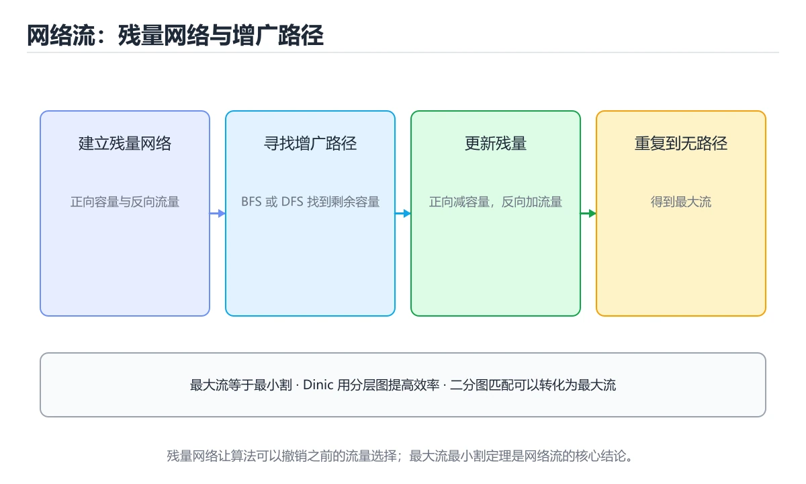
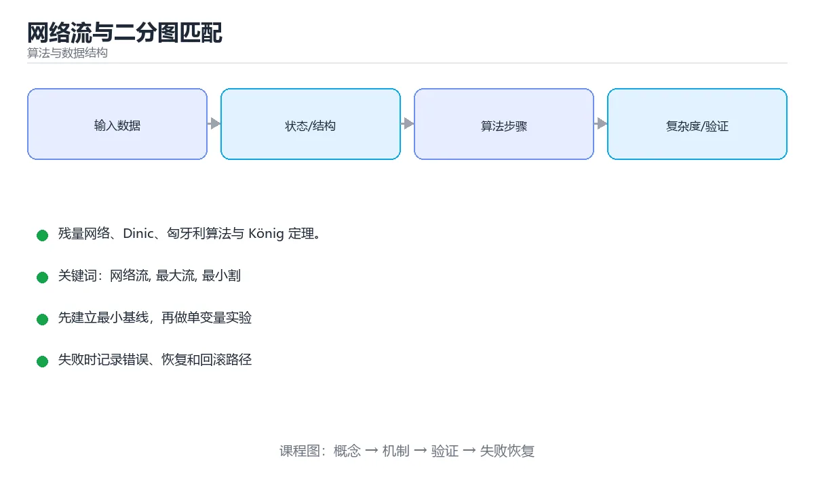

# 网络流与二分图匹配





> 内容更新时间：2026-10-06 · 学习阶段：高级 · 预计用时：25 分钟

## 学习目标

- 能用自己的话解释网络流与二分图匹配解决了什么问题，而不是只背术语。
- 能说清 「网络流」、「最大流」、「最小割」、「二分图匹配」 之间的关系，并分别举出一个例子。
- 能把本课知识放回「算法与数据结构」的知识体系，说明它和相邻主题的边界。
- 能完成本课练习，并用验收标准检查自己的结果。

> 一句话摘要：残量网络、Dinic、匈牙利算法与 König 定理。

## 前置知识

- 先完成上一课《平衡树实现》；如果已经掌握，可以直接用本课练习自测。
- 开始前先复习：网络流、最大流、最小割。
- 如果某一步看不懂，先记录具体卡点，完成练习后再回头读一遍。

## 最大流

在带容量的有向图中求源点 s 到汇点 t 的最大流量，三条核心结论：残量网络（维护反向边以撤销已分配流量）、增广路（沿仍有剩余容量的路径推送，直到不存在即为最大流）、**最大流最小割定理**（最大流量等于最小割容量）。

| 算法 | 复杂度 | 说明 |
| --- | --- | --- |
| Ford-Fulkerson | O(E × maxFlow) | DFS 找增广路，可能很慢 |
| Edmonds-Karp | O(V × E²) | 改用 BFS 找最短增广路 |
| Dinic | O(V² × E) | 分层图 + 阻塞流 + 当前弧优化，工程主力 |

## 二分图匹配

匹配是没有公共端点的边集；最大匹配可用匈牙利算法（增广路思想），也可转成网络流（源→左部→右部→汇，容量 1）。两个定理：**最大匹配 = 最小点覆盖**（König），**最大独立集 = 顶点数 − 最小点覆盖**。

## 典型应用

| 场景 | 建模方式 |
| --- | --- |
| 任务分配 | 人 → 任务容量 1，求最大匹配 |
| 带宽规划 | 链路容量即最大吞吐 |
| 图像分割 | 像素连源汇边，割即边界 |
| 排班调度 | 时间槽与人员做二分匹配 |

## 实现要点

邻接表存边并**成对存储正反向边**（下标 i 与 i^1 互为反向）；整数容量用整数运算；注意重边与自环；无向边拆成两条有向边。

## 本课小结

网络流是把问题建模成流量分配的通用工具：残量网络与增广路求最大流，最小割处理选择与分割，二分图匹配解决分配类问题。

## 概念速查

| 概念 | 含义 |
| --- | --- |
| 最大流 | 从源点到汇点的最大可行流量 |
| 最小割 | 把源点与汇点分开的最小容量边集 |
| 最大流最小割定理 | 最大流值等于最小割容量 |
| 增广路 | 残余网络中还能增加流量的路径 |
| 残余网络 | 剩余容量与前向、反向边构成的图 |
| 二分图匹配 | 左右两侧各选一个，边不共点 |
| König 定理 | 二分图最大匹配数等于最小顶点覆盖数 |
| 费用流 | 在给定流量下最小化总费用 |

Dinic 算法组成：

| 步骤 | 作用 |
| --- | --- |
| BFS 分层 | 计算每个节点到源点的最短距离（层号） |
| DFS 多路增广 | 只沿层号递增的边推进，一次找出多条增广路 |
| 当前弧优化 | 记录每个节点已尝试的边，避免重复扫描 |
| 重复分层 | 直到汇点不可达 |

复杂度：O(V²E)，单位容量二分图上表现接近 O(E√V)。

```python
from collections import deque

class Dinic:
    """最大流：BFS 分层 + DFS 多路增广 + 当前弧优化。"""

    def __init__(self, n: int):
        self.n = n
        self.graph = [[] for _ in range(n)]      # 每条边存 [to, cap, rev_index]

    def add_edge(self, u: int, v: int, cap: int) -> None:
        self.graph[u].append([v, cap, len(self.graph[v])])
        self.graph[v].append([u, 0, len(self.graph[u]) - 1])   # 反向边容量 0

    def _bfs(self, s: int, t: int) -> bool:
        self.level = [-1] * self.n
        self.level[s] = 0
        queue = deque([s])
        while queue:
            u = queue.popleft()
            for v, cap, _ in self.graph[u]:
                if cap > 0 and self.level[v] < 0:
                    self.level[v] = self.level[u] + 1
                    queue.append(v)
        return self.level[t] >= 0

    def _dfs(self, u: int, t: int, flow: int) -> int:
        if u == t:
            return flow
        while self.it[u] < len(self.graph[u]):
            edge = self.graph[u][self.it[u]]
            v, cap, rev = edge
            if cap > 0 and self.level[v] == self.level[u] + 1:
                pushed = self._dfs(v, t, min(flow, cap))
                if pushed > 0:
                    edge[1] -= pushed
                    self.graph[v][rev][1] += pushed
                    return pushed
            self.it[u] += 1                      # 当前弧：这条边已无用
        return 0

    def max_flow(self, s: int, t: int) -> int:
        total = 0
        while self._bfs(s, t):
            self.it = [0] * self.n
            while True:
                pushed = self._dfs(s, t, float("inf"))
                if pushed == 0:
                    break
                total += pushed
        return int(total)
```

## 常见错误与排查

| 容易写错的做法 | 实际现象 | 原因与正确做法 |
| --- | --- | --- |
| 忘记加反向边 | 无法撤销错误流量，结果偏小 | 每条边都建容量为 0 的反向边 |
| 反向边索引记错 | 更新到错误的边 | 存对方列表中的下标并在更新时使用 |
| 分层后不限制层号递增 | 出现环、死循环 | DFS 只走 `level[v] == level[u] + 1` |
| 不做当前弧优化 | 大数据超时 | 用 `it[u]` 记录进度 |
| 用 BFS 单路增广 | 复杂度偏高 | Dinic 一次分层多路增广 |
| 容量用整数但流量用浮点 | 精度问题 | 容量与流量类型统一为整数 |
| 二分图匹配直接建无向边 | 匹配语义错误 | 建源点到左、左到右、右到汇点的有向边 |
| 求最小割却只看最大流值 | 拿不到具体割集 | 分层后 S 侧可达点即最小割一侧 |
| 费用流用最大流算法 | 结果不满足费用最小 | 用连续最短路或消圈法 |
| 节点数与边编号混用 | 越界或错连 | 统一编号规范并写清映射 |

## 复习与自测

- [ ] 能解释最大流最小割定理。
- [ ] 记得每条边都要加容量为 0 的反向边。
- [ ] 会用 Dinic 的分层、多路增广与当前弧优化。
- [ ] 会把二分图匹配建模成最大流。
- [ ] 知道费用流与最大流的目标差异。

## 动手练习

> 本课练习重点：围绕「网络流、最大流、最小割」完成复述、实验和交付，每个结果都要能被别人检查。

先手算 8 个元素的状态变化，再实现并统计操作次数与复杂度。

### 练习 1：建立心智模型（10 分钟）

合上教程，用 3～5 句话回答：

1. 网络流与二分图匹配解决了什么问题？
2. 如果没有它，会出现什么具体后果？
3. 它和「最大流」是什么关系？

**验收标准**：至少出现一个本课关键词，并写出一个反例、边界条件或失效场景。

### 练习 2：做一次可控实验（20 分钟）

从正文中选一个最小示例，完成以下操作：

1. 先预测修改一个参数、输入或步骤后的结果。
2. 再实际执行或逐步推演，记录真实结果。
3. 如果结果与预测不同，写出差异原因。

**验收标准**：留下「原例 → 改动 → 预测 → 结果 → 原因」五步记录。

### 练习 3：交付一个小结果（30 分钟）

给定 8～12 个手工构造的数据，写出每一步状态，并统计比较或交换次数。

任务要求：

- 结果必须能被别人检查，不能只写“我已经理解了”。
- 至少覆盖「网络流」和「最大流」两个关键词。
- 写出 1 个仍然不确定的问题，以及下一步如何验证。

> 提示：时间有限时优先做练习 1 和练习 2；练习 3 可以拆成两次完成。

## 可运行练习

### 任务 1：先跑通，再解释

```python
from collections import deque

class Dinic:
    """最大流：BFS 分层 + DFS 多路增广 + 当前弧优化。"""

    def __init__(self, n: int):
        self.n = n
        self.graph = [[] for _ in range(n)]      # 每条边存 [to, cap, rev_index]

    def add_edge(self, u: int, v: int, cap: int) -> None:
        self.graph[u].append([v, cap, len(self.graph[v])])
        self.graph[v].append([u, 0, len(self.graph[u]) - 1])   # 反向边容量 0

    def _bfs(self, s: int, t: int) -> bool:
        self.level = [-1] * self.n
        self.level[s] = 0
        queue = deque([s])
        while queue:
            u = queue.popleft()
            for v, cap, _ in self.graph[u]:
                if cap > 0 and self.level[v] < 0:
                    self.level[v] = self.level[u] + 1
                    queue.append(v)
        return self.level[t] >= 0

    def _dfs(self, u: int, t: int, flow: int) -> int:
        if u == t:
            return flow
        while self.it[u] < len(self.graph[u]):
            edge = self.graph[u][self.it[u]]
            v, cap, rev = edge
            if cap > 0 and self.level[v] == self.level[u] + 1:
                pushed = self._dfs(v, t, min(flow, cap))
                if pushed > 0:
                    edge[1] -= pushed
                    self.graph[v][rev][1] += pushed
                    return pushed
            self.it[u] += 1                      # 当前弧：这条边已无用
        return 0

    def max_flow(self, s: int, t: int) -> int:
        total = 0
        while self._bfs(s, t):
            self.it = [0] * self.n
            while True:
                pushed = self._dfs(s, t, float("inf"))
                if pushed == 0:
                    break
                total += pushed
        return int(total)
```

### 任务 2：只改一个条件

把「网络流与二分图匹配」的最小示例复制一份，只改一个条件再跑一次：

- 改动点：只把网络流的输入换成空值、极值或错误输入，其余保持不变。
- 预测：先写下「网络流与二分图匹配」在改动后的输出或错误信息，再运行。
- 记录：对照改动前后的结果，指出差异出在哪一步。
- 验收：换回原条件能复现原结果，改动只影响网络流。

### 任务 3：迁移到自己的数据

用同一套思路处理一组你自己的数据或场景，保持输出格式与任务 1 一致。

## 故障现场

### 现场 1：本课的 网络流 常规用例通过，但边界用例失败

**症状**：在本课的练习或生产场景里出现“本课的 网络流 常规用例通过，但边界用例失败”。

**复现**：准备一组最小输入，只保留触发“本课的 网络流 常规用例通过，但边界用例失败”的必要条件，连续运行两次确认结果稳定。

**定位**：围绕“网络流 的前置条件与取值边界没有写进代码，默认值掩盖了空值和极值”检查调用链、输入数据和环境配置，先验证假设再改代码。

**预防**：把“本课的 网络流 常规用例通过，但边界用例失败”写成一条自动化用例，并在本课的验收清单里保留对应检查项。

### 现场 2：本课的 最大流 结果在两次运行之间不一致

**症状**：在本课的练习或生产场景里出现“本课的 最大流 结果在两次运行之间不一致”。

**复现**：准备一组最小输入，只保留触发“本课的 最大流 结果在两次运行之间不一致”的必要条件，连续运行两次确认结果稳定。

**定位**：围绕“最大流 依赖了当前版本、执行顺序或共享状态，单次运行无法暴露差异”检查调用链、输入数据和环境配置，先验证假设再改代码。

**预防**：把“本课的 最大流 结果在两次运行之间不一致”写成一条自动化用例，并在本课的验收清单里保留对应检查项。

### 现场 3：小数据规模结果正确，扩大输入后超时或内存溢出

**定位**：围绕“网络流 的时间或空间复杂度在边界条件下失控，最大流 的常数开销也被低估”检查调用链、输入数据和环境配置，先验证假设再改代码。

## 本课复习清单

离开本课前，逐项确认：

- [ ] 不看解析，能说出「最大流最小割定理说明？」的判断依据。
- [ ] 不看解析，能说出「Dinic 算法由哪些部分组成？」的判断依据。
- [ ] 不看解析，能说出「二分图中最大匹配等于？」的判断依据。
- [ ] 不看解析，能说出「匈牙利算法用于解决什么问题？」的判断依据。
- [ ] 不看解析，能说出「费用流相比最大流多了什么优化目标？」的判断依据。
- [ ] 至少运行一次本课示例，记录输入、输出和一个边界情况。
- [ ] 把本课最容易混淆的两个概念写成一句话对照。

| 复盘项 | 记录 |
| --- | --- |
| 已经能独立解释的考点 |  |
| 仍然说不清的概念 |  |
| 下一步验证动作 |  |

## 术语速查

把「网络流与二分图匹配」里反复出现的术语集中放在一起。复习时先遮住右列，尝试用自己的话解释，再回到正文核对。

| 术语 | 一句话说明 |
| --- | --- |
| `网络流` | 围绕“网络流 的时间或空间复杂度在边界条件下失控，最大流 的常数开销也被低估”检查调用链、输入数据和环境配置，先验证假设再改代码。 |
| `最大流` | 围绕“网络流 的时间或空间复杂度在边界条件下失控，最大流 的常数开销也被低估”检查调用链、输入数据和环境配置，先验证假设再改代码。 |
| `最小割` | “网络流与二分图匹配”中的 网络流、最大流、最小割，下列哪两项是本课强调的实践判断。 |
| `二分图匹配` | 它在「网络流与二分图匹配」里是理解「二分图匹配」的关键术语，用来解释定义、适用条件与失败路径；它与网络流、最大流共同决定这一节的判断边界。复习时回到正文示例核对输入、输出和验证方式。 |
| `Dinic` | Summary: Residual networks, Dinic, Hungarian algorithm and König's theorem.。 |

## 考点精讲

### 考点 1：概念判断·网络流

- **题目**：最大流最小割定理说明？
- **判断依据**：在「网络流与二分图匹配」里，作答时，先用网络流建立输入与输出的基线，再把最大流等于最小割容量代入边界条件核对，结论才能复现。在「网络流与二分图匹配」里判断这道题，要把网络流、最大流、最小割的条件、过程与失败路径逐项对齐，换成“最大流最小割定理说明”这个场景，只有满足前提的结论才成立。

### 考点 2：概念判断·网络流

- **题目**：「网络流与二分图匹配」的核心结论是什么？
- **判断依据**：题干的正确项是网络流与二分图匹配：残量网络、Dinic、匈牙利算法与 König 定理。在「网络流与二分图匹配」里，把网络流、最大流、最小割放进最小示例验证，换成空值或极值后结论仍要成立。回到「网络流与二分图匹配」的正文示例，用“网络流与二分图匹配的核心结论是什么”走一遍网络流、最大流、最小割的完整流程，能复现的结论才可以保留。

### 考点 3：多选辨析·网络流

- **题目**：围绕“网络流与二分图匹配”中的 网络流、最大流、最小割，下列哪两项是本课强调的实践判断？
- **判断依据**：本课把网络流与二分图匹配拆成概念、示例与故障现场三部分，因此判断 网络流 时必须同时交代输入、输出和失败路径，这使“学习 网络流 时要同时说明输入、输出和失败路径，不能只看正常流程”成立。在网络流与二分图匹配里，判断 最大流 时要固定版本与边界输入，所以“验证 最大流 时要固定版本并覆盖边界输入，结论才可复现”才可复现。

### 考点 4：概念判断·网络流

- **题目**：匈牙利算法用于解决什么问题？
- **判断依据**：在「网络流与二分图匹配」里，结论应落在「二分图最大匹配（通过不断寻找增广路）」。它等价于在单位容量网络上的最大流，但实现更轻量。在「网络流与二分图匹配」里，这道题要求区分概念与边界，「二分图最大匹配（通过不断寻找增广路）」只有在题干给出的前提下才成立，而「最小生成树（仅部分场景成立）」、「拓扑排序」缺少同一组条件。

### 考点 5：概念判断·网络流

- **题目**：费用流相比最大流多了什么优化目标？
- **判断依据**：常用连续最短路（SPFA/Dijkstra+势能）逐次增广，也需注意负权与负环。在「网络流与二分图匹配」里，其他选项：费用流在满足给定流量的前提下最小化总费用（每条边带单位费用），常用连续最短路或消圈法。「网络流与二分图匹配」要求先交代网络流、最大流、最小割的前提再下结论，所以“在满足给定流量的前提下最小化总费用（每条”只在题干“费用流相比最大流多了什么优化目标”给定的条件下成立。

### 考点 6：填空·网络流

- **题目**：补全代码：「网络流与二分图匹配」示例中，下面这行代码缺少哪个关键字或函数名？请填入 ____。 `self.____ = [-1] * self.n`
- **判断依据**：在「网络流与二分图匹配」里，level。这道题的关键在「网络流与二分图匹配」的网络流、最大流、最小割：先确认题干“补全代码”问的是哪一步，再排除偷换前提的选项。在「网络流与二分图匹配」里判断这道题，要把网络流、最大流、最小割的条件、过程与失败路径逐项对齐，换成“补全代码”这个场景，只有满足前提的结论才成立。

## English Overview

**Title:** Network Flow & Matching

**Summary:** Residual networks, Dinic, Hungarian algorithm and König's theorem.

**Category:** Algorithms
**Level:** 高级
**Key terms:** 网络流, 最大流, 最小割, 二分图匹配, Dinic

## 内容元数据

- 内容版本：v2.0
- 最后更新：2026-10-06
- 学习阶段：高级
- 适用环境：任意主流语言（伪代码与复杂度为主）
- 内容来源：内置结构化课程与工程实践整理
- 相关主题：网络流、最大流、最小割、二分图匹配、Dinic
- 质量版本：P0 测验标准 + P1 覆盖扩展 + P2 体验补全

## 参考资料与复核

- 最后复核：2026-10-04
- 下次复核：2027-04-04
- 复核范围：版本兼容、API 行为、安全建议与工程实践
- 来源性质：官方文档、标准或权威教材；正文为离线教学重组

| 参考资料 | 本课用途 |
| --- | --- |
| [OI Wiki](https://oi-wiki.org/) | 竞赛算法与数据结构 |
| [Princeton Algorithms](https://algs4.cs.princeton.edu/home/) | 经典算法与数据结构教材 |
| [RFC 算法与协议](https://www.rfc-editor.org/) | 协议中的算法约束 |

> 「网络流与二分图匹配」的链接用于离线阅读后的延伸核对；App 不会自动联网。

## 复习与迁移

复习目标：把「网络流与二分图匹配」的判断标准放回可复现的例子里。先自己作答，再对照依据；如果结论正确但理由不完整，回到正文补足前提。

### 概念复述

- 用一句话说明「网络流与二分图匹配」解决什么问题：残量网络、Dinic、匈牙利算法与 König 定理。
- 写出网络流、最大流、最小割之间的关系，并各举一个例子。
- 说出本课最容易混淆的两个概念，以及区分它们的判据。

### 正文逐节复核

- **最大流**：在带容量的有向图中求源点 s 到汇点 t 的最大流量，三条核心结论：残量网络（维护反向边以撤销已分配流量）、增广路（沿仍有剩余容量的路径推送，直到不存在即为最大流）、**最大流最小割定理**（最大流量等于最小割容量）。
- **二分图匹配**：匹配是没有公共端点的边集；最大匹配可用匈牙利算法（增广路思想），也可转成网络流（源→左部→右部→汇，容量 1）。

### 测验回顾

1. 最大流最小割定理说明？
   - 依据：在「网络流与二分图匹配」里，作答时，先用网络流建立输入与输出的基线，再把最大流等于最小割容量代入边界条件核对，结论才能复现。在「网络流与二分图匹配」里判断这道题，要把网络流、最大流、最小割的条件、过程与失败路径逐项对齐，换成“最大流最小割定理说明”这个场景，只有满足前提的结论才成立。
2. 「网络流与二分图匹配」的核心结论是什么？
   - 依据：题干的正确项是网络流与二分图匹配：残量网络、Dinic、匈牙利算法与 König 定理。在「网络流与二分图匹配」里，把网络流、最大流、最小割放进最小示例验证，换成空值或极值后结论仍要成立。回到「网络流与二分图匹配」的正文示例，用“网络流与二分图匹配的核心结论是什么”走一遍网络流、最大流、最小割的完整流程，能复现的结论才可以保留。
3. 围绕“网络流与二分图匹配”中的 网络流、最大流、最小割，下列哪两项是本课强调的实践判断？
   - 依据：本课把网络流与二分图匹配拆成概念、示例与故障现场三部分，因此判断 网络流 时必须同时交代输入、输出和失败路径，这使“学习 网络流 时要同时说明输入、输出和失败路径，不能只看正常流程”成立。在网络流与二分图匹配里，判断 最大流 时要固定版本与边界输入，所以“验证 最大流 时要固定版本并覆盖边界输入，结论才可复现”才可复现。
4. 匈牙利算法用于解决什么问题？
   - 依据：在「网络流与二分图匹配」里，结论应落在「二分图最大匹配（通过不断寻找增广路）」。它等价于在单位容量网络上的最大流，但实现更轻量。在「网络流与二分图匹配」里，这道题要求区分概念与边界，「二分图最大匹配（通过不断寻找增广路）」只有在题干给出的前提下才成立，而「最小生成树（仅部分场景成立）」、「拓扑排序」缺少同一组条件。
5. 费用流相比最大流多了什么优化目标？
   - 依据：常用连续最短路（SPFA/Dijkstra+势能）逐次增广，也需注意负权与负环。在「网络流与二分图匹配」里，其他选项：费用流在满足给定流量的前提下最小化总费用（每条边带单位费用），常用连续最短路或消圈法。「网络流与二分图匹配」要求先交代网络流、最大流、最小割的前提再下结论，所以“在满足给定流量的前提下最小化总费用（每条”只在题干“费用流相比最大流多了什么优化目标”给定的条件下成立。
6. 补全代码：「网络流与二分图匹配」示例中，下面这行代码缺少哪个关键字或函数名？请填入 ____。

`self.____ = [-1] * self.n`
   - 依据：在「网络流与二分图匹配」里，level。这道题的关键在「网络流与二分图匹配」的网络流、最大流、最小割：先确认题干“补全代码”问的是哪一步，再排除偷换前提的选项。在「网络流与二分图匹配」里判断这道题，要把网络流、最大流、最小割的条件、过程与失败路径逐项对齐，换成“补全代码”这个场景，只有满足前提的结论才成立。

### 迁移练习

把「网络流与二分图匹配」的结论迁移到相邻主题，每次迁移都写清预测与证据：

1. 换输入：用网络流处理一组你自己的数据，对比教材示例的结果差异。
2. 换失败条件：制造一个最大流相关的错误，说明如何从错误信息定位根因。
3. 换规模：把数据量或并发度提高一个数量级，说明「网络流与二分图匹配」的结论是否仍成立。
