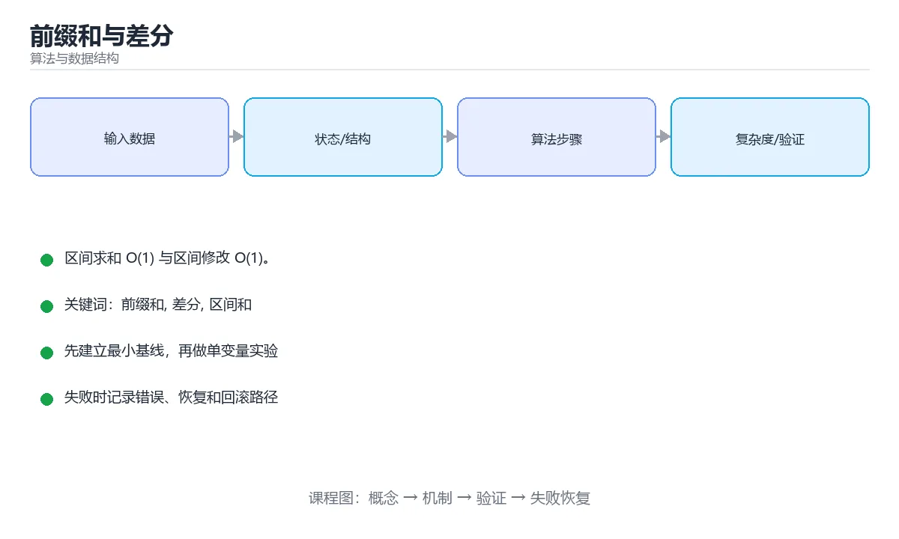

# 前缀和与差分



> 内容更新时间：2026-10-03 · 学习阶段：进阶 · 预计用时：15 分钟

## 学习目标

- 能用自己的话解释「前缀和与差分」解决了什么问题，而不是只背术语。
- 能说清 「前缀和」、「差分」、「区间和」、「二维前缀和」 之间的关系，并分别举出一个例子。
- 能把本课知识放回「算法与数据结构」的知识体系，说明它和相邻主题的边界。
- 能完成本课练习，并用验收标准检查自己的结果。

> 一句话摘要：区间求和 O(1) 与区间修改 O(1)。

## 前置知识

- 先完成上一课《位运算技巧》；如果已经掌握，可以直接用本课练习自测。
- 本课阶段：进阶。建议先掌握同一分类的基础课程，并能独立运行正文中的最小示例。
- 开始前先复习：前缀和、差分、区间和。
- 如果某一步看不懂，先记录具体卡点，完成练习后再回头读一遍。


## 前缀和：把区间求和降到 O(1)

```python
def build_prefix(nums):
    prefix = [0] * (len(nums) + 1)      # prefix[0] = 0，方便处理边界
    for i, value in enumerate(nums):
        prefix[i + 1] = prefix[i] + value
    return prefix

nums = [3, 1, 4, 1, 5]
prefix = build_prefix(nums)             # [0, 3, 4, 8, 9, 14]
def range_sum(left, right):             # 闭区间 [left, right]
    return prefix[right + 1] - prefix[left]
print(range_sum(1, 3))                  # 1 + 4 + 1 = 6
```

预处理 `O(n)`，每次查询 `O(1)`；如果有 m 次查询，总复杂度从 `O(nm)` 降到 `O(n + m)`。

## 二维前缀和

```python
def build_prefix_2d(matrix):
    rows, cols = len(matrix), len(matrix[0])
    prefix = [[0] * (cols + 1) for _ in range(rows + 1)]
    for r in range(rows):
        for c in range(cols):
            prefix[r + 1][c + 1] = (matrix[r][c]
                + prefix[r][c + 1] + prefix[r + 1][c] - prefix[r][c])
    return prefix

def rect_sum(prefix, r1, c1, r2, c2):   # 左上 (r1,c1) 到右下 (r2,c2)
    return (prefix[r2 + 1][c2 + 1] - prefix[r1][c2 + 1]
            - prefix[r2 + 1][c1] + prefix[r1][c1])
```

记忆方式：**大矩形减去上方与左方，再加回被减两次的左上角**。

## 前缀和 + 哈希表：和为 k 的子数组

```python
from collections import defaultdict

def subarray_sum(nums, k):
    count, total = 0, 0
    seen = defaultdict(int)
    seen[0] = 1                      # 前缀和为 0 出现过一次
    for value in nums:
        total += value
        count += seen[total - k]     # 若 total - k 出现过，则存在和为 k 的子数组
        seen[total] += 1
    return count
```

这是把「区间和」转化为「两个前缀和之差」的典型思路。

## 差分：区间修改降到 O(1)

需要给区间 `[l, r]` 同时加上 v，做多次修改后再求最终数组，用差分数组：

```python
def apply_updates(n, updates):
    diff = [0] * (n + 1)
    for left, right, value in updates:
        diff[left] += value
        diff[right + 1] -= value      # 出区间时抵消
    result, running = [], 0
    for i in range(n):
        running += diff[i]            # 前缀和还原
        result.append(running)
    return result
```

```text
原数组:  0 0 0 0 0
操作: [1,3] += 2   ->  diff: [0,+2,0,0,-2]
还原前缀和: 0 2 2 2 0
```

## 什么时候用

| 需求 | 结构 |
| --- | --- |
| 多次区间求和，数据不变 | 前缀和 |
| 多次区间加减，最后统一读取 | 差分 |
| 区间加减 + 区间求和 | 树状数组 / 线段树 |
| 二维区域求和 | 二维前缀和 |

## 本课小结
前缀和解决「多次查询」，差分解决「多次修改」，二者都靠**一次预处理换后续 O(1)**。看到「区间」二字先想这两件工具。


## 前缀和与差分模板

```python
from collections import defaultdict

def build_prefix(nums):
    """一维前缀和：prefix[i] 表示前 i 个元素之和。"""
    prefix = [0] * (len(nums) + 1)
    for i, value in enumerate(nums):
        prefix[i + 1] = prefix[i] + value
    return prefix


def range_sum(prefix, left, right):
    """闭区间 [left, right] 的和，O(1)。"""
    return prefix[right + 1] - prefix[left]


def build_2d_prefix(matrix):
    """二维前缀和：多开一行一列，避免边界判断。"""
    rows, cols = len(matrix), len(matrix[0])
    prefix = [[0] * (cols + 1) for _ in range(rows + 1)]
    for i in range(rows):
        for j in range(cols):
            prefix[i + 1][j + 1] = (
                matrix[i][j]
                + prefix[i][j + 1]
                + prefix[i + 1][j]
                - prefix[i][j]
            )
    return prefix


def sum_region(prefix, r1, c1, r2, c2):
    """子矩阵和（含端点），容斥原理 O(1)。"""
    return (
        prefix[r2 + 1][c2 + 1]
        - prefix[r1][c2 + 1]
        - prefix[r2 + 1][c1]
        + prefix[r1][c1]
    )


def range_add_diff(nums, updates):
    """多次区间加、最后统一求值：差分数组 O(n + q)。"""
    diff = [0] * (len(nums) + 1)
    for left, right, value in updates:
        diff[left] += value
        diff[right + 1] -= value          # 右边界之后要抵消
    result, running = [], 0
    for i, base in enumerate(nums):
        running += diff[i]
        result.append(base + running)
    return result


def subarray_sum_k(nums, k):
    """统计和为 k 的连续子数组个数：前缀和 + 哈希表，O(n)。"""
    seen = defaultdict(int)
    seen[0] = 1                            # 空前缀，处理从头开始的区间
    total = count = 0
    for value in nums:
        total += value
        count += seen[total - k]           # 之前出现过 total - k 的前缀
        seen[total] += 1
    return count
```

## 适用场景速查

| 问题 | 工具 | 复杂度 |
| --- | --- | --- |
| 多次区间求和（数组不变） | 前缀和 | 预处理 O(n)，查询 O(1) |
| 多次区间加、最后读取 | 差分 | 每次 O(1)，最后 O(n) |
| 子矩阵求和 | 二维前缀和 | 预处理 O(mn)，查询 O(1) |
| 和为 k 的连续子数组个数 | 前缀和 + 哈希表 | O(n) |
| 区间加与区间求和混合 | 树状数组 / 线段树 | O(log n) |
| 前缀和与差分互为逆运算 | 可互相还原 | 注意下标偏移 |

## 常见错误对照表

| 容易写错的做法 | 实际现象 | 原因与正确做法 |
| --- | --- | --- |
| 前缀和数组不预留第 0 位 | 边界判断复杂、易越界 | 多开一位且 `prefix[0] = 0` |
| 区间和写成 `prefix[r] - prefix[l]` | 结果少算一个元素 | 应为 `prefix[r+1] - prefix[l]` |
| 二维前缀和忘记加回左上角 | 子矩阵和多减了一块 | 容斥：加回 `prefix[r1][c1]` |
| 差分右边界写成 `diff[right] -= v` | 影响范围多一格 | 应为 `diff[right + 1] -= v` |
| 差分数组不预留一位 | 最后一段越界 | 开 n+1 长度 |
| 哈希表忘记 `seen[0] = 1` | 从头开始的区间被漏掉 | 初始化空前缀计数为 1 |
| 用前缀和求最大子数组和 | 不适用（含负数时结论错） | 用 Kadane 算法 |
| 用滑动窗口处理负数数组 | 结果错误 | 用前缀和加哈希表 |
| 前缀和数组越界访问 | 越界异常 | 明确长度是 n+1 |
| 用浮点累积前缀和 | 误差逐渐放大 | 用整数或分段求和 |

## 自测清单

- [ ] 能写出预留第 0 位的一维前缀和。
- [ ] 区间和公式为 `prefix[r+1] - prefix[l]`。
- [ ] 二维子矩阵和用容斥且下标加 1。
- [ ] 差分修改右边界用 `right + 1` 抵消。
- [ ] 统计和为 k 的子数组时初始化 `seen[0] = 1`。

## 动手练习


> 本课练习重点：围绕「前缀和、差分、区间和」完成复述、实验和交付，每个结果都要能被别人检查。

先手算 8 个元素的状态变化，再实现并统计操作次数与复杂度。

### 练习 1：建立心智模型（10 分钟）

合上教程，用 3～5 句话回答：

1. 「前缀和与差分」解决了什么问题？
2. 如果没有它，会出现什么具体后果？
3. 它和「差分」是什么关系？

**验收标准**：至少出现一个本课关键词，并写出一个反例、边界条件或失效场景。

### 练习 2：做一次可控实验（20 分钟）

从正文中选一个最小示例，完成以下操作：

1. 先预测修改一个参数、输入或步骤后的结果。
2. 再实际执行或逐步推演，记录真实结果。
3. 如果结果与预测不同，写出差异原因。

**验收标准**：留下「原例 → 改动 → 预测 → 结果 → 原因」五步记录。

### 练习 3：交付一个小结果（30 分钟）

给定 8～12 个手工构造的数据，写出每一步状态，并统计比较或交换次数。

任务要求：

- 结果必须能被别人检查，不能只写“我已经理解了”。
- 至少覆盖「前缀和」和「差分」两个关键词。
- 写出 1 个仍然不确定的问题，以及下一步如何验证。

> 提示：时间有限时优先做练习 1 和练习 2；练习 3 可以拆成两次完成。


## 考点精讲：把测验题还原成判断过程

本课有 5 个判断点。先自己作答，再看「判断依据」；如果结论正确但理由不完整，回到正文对应章节补足概念。

### 考点 1：前缀和最适合解决哪类问题？

- **正确判断**：多次区间求和
- **判断依据**：预处理 O(n) 后，每次区间求和只需 O(1)。其他选项：前缀和把区间求和的单次代价从 O(n) 降到 O(1)，适合多次区间查询。单次求最值、匹配、连通性都不是它的场景。正确项「多次区间求和」与本课示例和结论一致，可以直接用于实际编码。错误项「单次求最大值」只看到了表面现象，没有解释题干真正考查的机制。错误项「图的连通性」适用于其他场景，但与本题的前提不匹配。错误项「字符串匹配」把因果关系颠倒了，不能作为正确结论。把题干「前缀和最适合解决哪类问题？」放回《前缀和与差分》的「区间求和 O(1) 与区间修改 O(1)」语境，逐项对照定义与边界条件，就能排除其余说法。
- **迁移检查**：如果给某个错误选项去掉一个限定词，它会不会变成正确？说明理由。

### 考点 2：多次区间加减、最后统一读取结果，应使用？

- **正确判断**：差分数组
- **判断依据**：差分把区间修改变成两个端点操作，最后求前缀和还原。其他选项：差分让区间加变成 O(1) 的两点修改，最后统一前缀和还原。正确项「差分数组」正面回答了题目所问，符合课程给出的定义与适用范围。错误项「线段树」属于相邻主题的说法，范围与本题要求不一致。错误项「哈希表」把不同概念混在一起，缺少题干限定的前提。把题干「多次区间加减、最后统一读取结果，应使用？」放回《前缀和与差分》的「区间求和 O(1) 与区间修改 O(1)」语境，逐项对照定义与边界条件，就能排除其余说法。
- **迁移检查**：把题干里的一个条件换成边界值，原来的结论还成立吗？写出判断过程。

### 考点 3：统计「和为 k 的子数组」个数，推荐做法是？

- **正确判断**：前缀和 + 哈希表
- **判断依据**：把区间和转成两个前缀和之差，用哈希表统计出现次数。其他选项：含负数时窗口不满足单调性，需用前缀和加哈希表统计出现次数。正确项「前缀和 + 哈希表」与题干要求一致，是本课知识点的准确定义。错误项「双指针」忽略了题目中的限制条件，因此不成立。错误项「并查集」属于相邻主题的说法，范围与本题要求不一致。错误项「二分查找」把不同概念混在一起，缺少题干限定的前提。把题干「统计「和为 k 的子数组」个数，推荐做法是？」放回《前缀和与差分》的「区间求和 O(1) 与区间修改 O(1)」语境，逐项对照定义与边界条件，就能排除其余说法。
- **迁移检查**：把题干里的一个条件换成边界值，原来的结论还成立吗？写出判断过程。

### 考点 4：二维前缀和求子矩阵和时为什么要加回 P[x1-1][y1-1]？

- **正确判断**：该区域在前面两次相减中被多减了一次，需要补回来（容斥原理）
- **判断依据**：容斥「加一次、减两次、补一次」是二维前缀和的固定套路。其他选项：容斥原理：该区域在前面被减了两次，所以要加回一次。正确项「该区域在前面两次相减中被多减了一次，需要补回来（容斥原理）」正面回答了题目所问，符合课程给出的定义与适用范围。错误项「为了处理越界」把不同概念混在一起，缺少题干限定的前提。错误项「它能提升精度」与课程给出的定义相冲突，不能回答题目所问。错误项「它是矩阵的边界值（混淆了相邻概念，不能回答本题）」只看到了表面现象，没有解释题干真正考查的机制。把题干「二维前缀和求子矩阵和时为什么要加回 P[x1-1][y1-1]？」放回《前缀和与差分》的「区间求和 O(1) 与区间修改 O(1)」语境，逐项对照定义与边界条件，就能排除其余说法。
- **迁移检查**：如果给某个错误选项去掉一个限定词，它会不会变成正确？说明理由。

### 考点 5：前缀和与差分的关系是？

- **正确判断**：差分是前缀和的逆运算
- **判断依据**：正因为互为逆运算，区间加在差分上是常数操作，最后统一前缀和求值。其他选项：两者互为逆运算，对差分数组求前缀和即还原原数组，这也是「区间加 + 最后求和」的原理。正确项「差分是前缀和的逆运算」与本课示例和结论一致，可以直接用于实际编码。错误项「前缀和不能用于负数」只看到了表面现象，没有解释题干真正考查的机制。错误项「两者完全相同」适用于其他场景，但与本题的前提不匹配。错误项「差分只能用于二维数组」把因果关系颠倒了，不能作为正确结论。把题干「前缀和与差分的关系是？」放回《前缀和与差分》的「区间求和 O(1) 与区间修改 O(1)」语境，逐项对照定义与边界条件，就能排除其余说法。
- **迁移检查**：如果给某个错误选项去掉一个限定词，它会不会变成正确？说明理由。

## 本课复习清单

离开本课前，逐项确认：

- [ ] 不看解析，能说出「前缀和最适合解决哪类问题？」的判断依据。
- [ ] 不看解析，能说出「多次区间加减、最后统一读取结果，应使用？」的判断依据。
- [ ] 不看解析，能说出「统计「和为 k 的子数组」个数，推荐做法是？」的判断依据。
- [ ] 不看解析，能说出「二维前缀和求子矩阵和时为什么要加回 P[x1-1][y1-1]？」的判断依据。
- [ ] 不看解析，能说出「前缀和与差分的关系是？」的判断依据。
- [ ] 至少运行一次本课示例，记录输入、输出和一个边界情况。
- [ ] 把本课最容易混淆的两个概念写成一句话对照。

| 复盘项 | 记录 |
| --- | --- |
| 已经能独立解释的考点 |  |
| 仍然说不清的概念 |  |
| 下一步验证动作 |  |

## English Overview

**Title:** Prefix Sums & Difference Arrays

**Summary:** O(1) range queries and range updates.

**Category:** Algorithms  
**Level:** 进阶  
**Key terms:** 前缀和, 差分, 区间和, 二维前缀和

> The full tutorial is written in Chinese. This bilingual overview helps English readers identify the topic, scope and key terms before studying the detailed examples.

## 内容元数据

- 内容版本：v2.0
- 最后更新：2026-10-03
- 学习阶段：进阶
- 适用环境：任意主流语言（伪代码与复杂度为主）
- 内容来源：内置结构化课程与工程实践整理
- 相关主题：前缀和、差分、区间和、二维前缀和
- 质量版本：P0 测验标准 + P1 覆盖扩展 + P2 体验补全


## 参考资料与复核

- 最后复核：2026-10-04
- 下次复核：2027-04-04
- 复核范围：版本兼容、API 行为、安全建议与工程实践
- 来源性质：官方文档与标准；本课正文为离线教学重组，不复制原文

| 参考资料 | 本课用途 |
| --- | --- |
| [CP-Algorithms](https://cp-algorithms.com/) | 算法实现与复杂度 |
| [MIT OpenCourseWare 6.006](https://ocw.mit.edu/courses/6-006-introduction-to-algorithms-spring-2020/) | 算法设计与分析 |

> 本课主题：区间求和 O(1) 与区间修改 O(1)。

> App 完全离线展示文字链接，不会自动联网；需要延伸阅读时可复制链接到浏览器。

