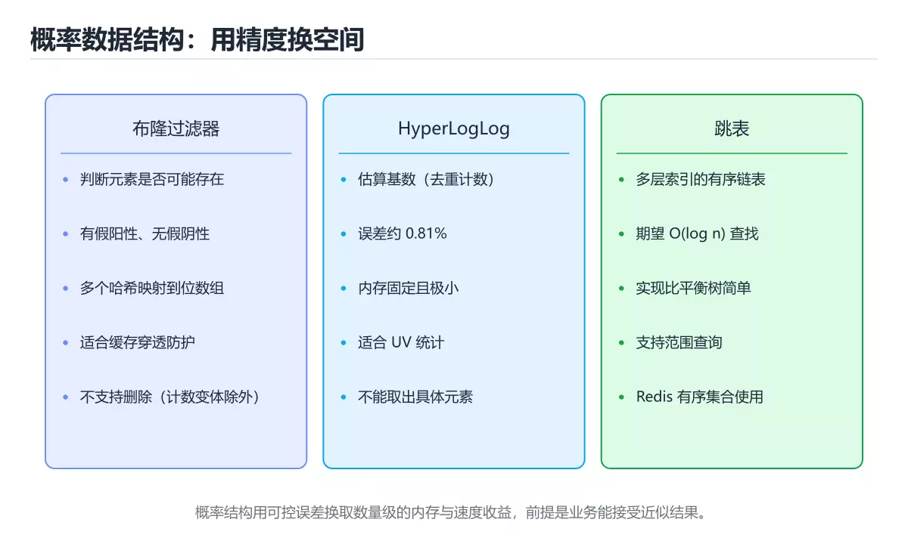
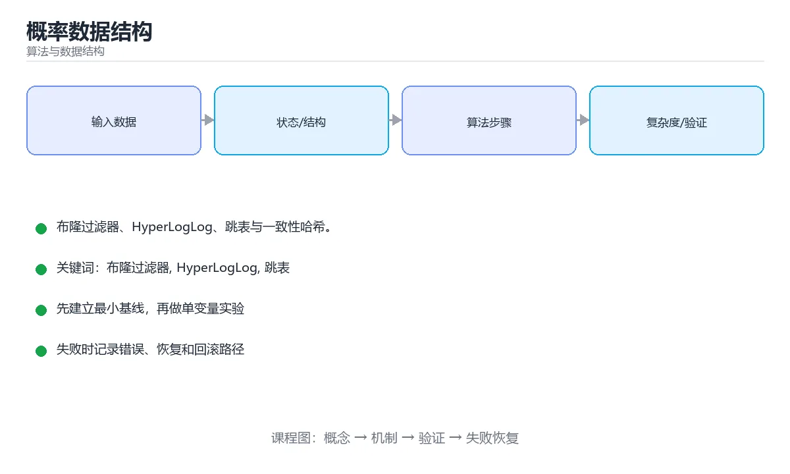

# 概率数据结构

> 内容更新时间：2026-10-06 · 学习阶段：高级 · 预计用时：40 分钟





## 本节知识框架

**课程定位**：所属分类为「算法与数据结构」，课程主题为「概率数据结构」，学习阶段为「高级」，建议用时 40 分钟。

**本课要解决的主问题**：布隆过滤器、HyperLogLog、跳表与一致性哈希。

| 学习层次 | 要回答的问题 | 完成判据 |
| --- | --- | --- |
| 概念层 | 「概率数据结构」有哪些必须区分的对象与术语？ | 能用自己的话定义核心术语，并各举一个正例和一个反例。 |
| 机制层 | 这些对象按什么顺序发生作用，输入如何变成输出？ | 能画出或写出机制步骤，并说明每一步的失败条件。 |
| 应用层 | 什么场景适合使用「概率数据结构」，什么场景不适合？ | 能给出一个真实场景、一个最小示例和一个边界案例。 |
| 性能层 | 时间、空间、吞吐或延迟受哪些量影响？ | 能说出复杂度或性能瓶颈的证据来源；没有证据时明确写“材料未提供”。 |
| 复习层 | 怎样确认自己不是只记住了结论？ | 能独立完成本课自测，并把错误定位到概念、机制、示例或边界。 |

### 阅读路线

1. 先读「核心概念定义」，建立「布隆过滤器」等对象的精确定义。
2. 再读「原理与运行机制」，把定义串成可重复的过程。
3. 用「代码/协议/SQL 示例」验证过程，并只改一个条件观察结果变化。
4. 最后检查性能、易错点、知识关系与自测题，形成可复习的证据链。

**前置知识**：《字符串匹配》

**学习位置**：本课位于《字符串匹配》之后；如果前一课的自测不能通过，应先回补再继续。

**后续衔接**：下一课《网络流与二分图匹配》会继续使用本课术语，学完后建议立即完成一次自测。

**教材衔接：学习目标**

- 能用自己的话解释概率数据结构解决了什么问题，而不是只背术语。
- 能说清 「布隆过滤器」、「HyperLogLog」、「跳表」、「一致性哈希」 之间的关系，并分别举出一个例子。
- 能把 布隆过滤器 放回「概率数据结构」的知识体系，说明它和 HyperLogLog 的边界。
- 能完成本课练习，并用验收标准检查自己的结果。

> 一句话摘要：布隆过滤器、HyperLogLog、跳表与一致性哈希。

**教材衔接：前置知识**

- 先完成上一课《字符串匹配》；如果已经掌握，可以直接用本课练习自测。
- 开始前先复习：布隆过滤器、HyperLogLog、跳表。
- 卡在 布隆过滤器 上时不要跳过：把输入、预期和实际输出写成三行，再回头读正文。

**教材衔接：本课小结**

概率数据结构是**用可控的误差换数量级的内存与速度收益**：布隆做存在性判断，HyperLogLog 做基数估计，跳表做有序索引，一致性哈希做分布式分片。

## 核心概念定义

> 阅读约定：本课先给「概率数据结构」相关术语的操作性定义与适用边界；正文里的口语化说法与定义冲突时，以定义和可复现示例为准。

| 术语 | 操作性定义 | 本课中的边界 |
| --- | --- | --- |
| 布隆过滤器 | 原理：用 k 个哈希函数把元素映射到位数组的 k 个位置并置 1；查询时若任一位置为 0，则一定不存在；全为 1 则可能存在。 | 仅在「概率数据结构」明确给出的输入、版本与资源条件下成立。 |
| HyperLogLog | 通过观察哈希值前导零的最大长度来估计基数，用分桶取调和平均降低方差。Redis 的 PFADD / PFCOUNT 就是它的实现，常用于 UV 统计。 | 仅在「概率数据结构」明确给出的输入、版本与资源条件下成立。 |
| 跳表 | 用多层有序链表和随机索引实现近似对数查找的概率数据结构。 | 仅在「概率数据结构」明确给出的输入、版本与资源条件下成立。 |
| 一致性哈希 | 把节点和键映射到同一环上，使节点增减只影响邻近区间。 | 仅在「概率数据结构」明确给出的输入、版本与资源条件下成立。 |

### 定义如何使用

在「概率数据结构」中判断一个说法是否成立，先确认它使用的是哪个对象的定义，再检查输入规模、运行环境与失败路径。定义不是口号，而是后续推导、代码示例和自测题共享的约束。

## 原理与运行机制

### 机制总览

1. **建立输入**：把「布隆过滤器」按本课定义整理成可观察、可重复的输入条件。
2. **执行转换**：围绕「HyperLogLog」执行本课的核心步骤；每一步都记录中间状态，避免只看最终输出。
3. **产生输出**：得到「跳表」后，用正文示例或协议/SQL 结果核对输出是否符合预期。
4. **改变一个条件**：只替换一个边界条件或环境参数，观察「概率数据结构」的结论是否仍然成立。

| 阶段 | 关注对象 | 失败时应检查 |
| --- | --- | --- |
| 输入 | 布隆过滤器 | 类型、范围、编码、版本或前置状态是否满足定义。 |
| 处理 | HyperLogLog | 顺序、可见性、锁、路由、事务或调度规则是否被破坏。 |
| 输出 | 跳表 | 结果是否可复现，错误是否被正确传播而不是被吞掉。 |

本课的机制结论要用「概率数据结构」自己的示例验证。「概率数据结构」没有给出某个数量级、吞吐或内存数据时，本课把该判断标为“材料未提供”，不从相邻主题外推。

**教材衔接：布隆过滤器**

原理：用 k 个哈希函数把元素映射到位数组的 k 个位置并置 1；查询时若任一位置为 0，则**一定不存在**；全为 1 则**可能存在**。

参数权衡：位数组越大、哈希函数个数越合适，假阳性率越低；元素数量超过设计容量后误判率会急剧上升。典型用途：缓存穿透防护、爬虫 URL 去重、黑名单预筛。

**教材衔接：HyperLogLog**

通过观察哈希值前导零的最大长度来估计基数，用分桶取调和平均降低方差。Redis 的 `PFADD` / `PFCOUNT` 就是它的实现，常用于 UV 统计。它支持合并（`PFMERGE`），但不支持精确列举成员。

**教材衔接：跳表**

多层链表 + 随机晋升：每个节点以概率 1/2 出现在上一层。查找从最高层开始向右走，走不动就下降一层，期望复杂度 O(log n)，实现比平衡树简单，且天然支持范围查询。Redis 的有序集合（ZSet）就同时用了跳表与哈希表。

**教材衔接：一致性哈希**

把节点与数据都映射到哈希环上，数据归属顺时针第一个节点。增删节点时只影响相邻区间，避免全量重分布。引入虚拟节点可以解决数据倾斜。

**教材衔接：使用建议**

1. 先确认业务能否接受假阳性或近似值（如风控黑名单误杀需要兜底）。
2. 按预期元素量设计容量，预留 2 倍以上余量。
3. 概率结构通常不支持删除，需要删除时考虑计数布隆或定期重建。
4. 监控实际误判率，偏离设计值说明容量或哈希参数需要调整。

**教材衔接：参数计算与使用边界**

**布隆过滤器参数估算**：给定预期元素数 n 与可接受误判率 p，最优位数组长度约为 `m ≈ -n·ln p / (ln 2)²`，哈希函数个数约为 `k ≈ (m/n)·ln 2`。举例：n = 100 万、p = 1% 时，m ≈ 960 万位（约 1.2 MB）、k ≈ 7；同样的数据用哈希表存储会占用几十 MB。

| 场景 | 能否使用概率结构 | 说明 |
| --- | --- | --- |
| 缓存穿透防护 | ✅ 布隆过滤器 | 误判只导致多查一次数据库，无业务损失 |
| 账号黑名单拦截 | ⚠️ 需兜底 | 误判会封禁正常用户，必须二次精确校验 |
| UV 统计 | ✅ HyperLogLog | 允许约 0.8% 误差 |
| 订单去重 | ❌ | 误判会导致漏单或重复，必须精确 |
| 存在性预筛（大表 join） | ✅ | 过滤大部分不匹配数据，再用精确查询确认 |

使用边界三条：**误判带来的业务后果可接受**、**不要求删除元素**、**能接受不支持列出全部元素**。三者任一不满足，就应改用精确结构（哈希表、B 树）或"概率结构 + 精确校验"的组合。

**教材衔接：结构选型速查**

| 结构 | 解决的问题 | 误差方向 | 空间 |
| --- | --- | --- | --- |
| 布隆过滤器 | 判断元素「可能存在 / 一定不存在」 | 只会假阳性 | 每元素约 10 bit（1% 误判） |
| 计数布隆过滤器 | 支持删除的布隆变体 | 假阳性 | 每位换成计数器 |
| Cuckoo Filter | 支持删除且空间更省 | 假阳性 | 比布隆更紧凑 |
| Count-Min Sketch | 频率估计 | 只会高估 | O(1/ε · log(1/δ)) |
| HyperLogLog | 基数（去重计数）估计 | 双向小误差（约 0.81%） | 每个基数约 12KB 上限 |
| 跳表 | 有序集合、范围查询 | 无 | O(n) |
| 最小哈希 | 集合相似度（Jaccard） | 估计误差 | 取决于签名长度 |

## 典型应用场景

| 场景 | 典型输入或前提 | 期望产物 |
| --- | --- | --- |
| 学习验证 | 使用本课最小示例和 布隆过滤器、HyperLogLog | 能复现正文结论，并解释每一步。 |
| 工程落地 | 把「概率数据结构」放入真实模块或服务边界 | 输出可观测、失败可定位、参数可配置。 |
| 故障排查 | 只改一个版本、规模、输入或依赖条件 | 能区分概念错误、实现错误和环境差异。 |

判断「概率数据结构」的场景是否成立，标准是能否写出输入、处理、输出和失败路径；材料中没有出现的数据在本课标注为“材料未提供”，不用推测替代证据。

**课程内置实验入口**：`interactive`，用于动手验证《概率数据结构》的机制；实验结论不替代概念定义与复杂度分析。

## 代码/协议/SQL 示例

### 最小可验证示例

下面保留《概率数据结构》原文中的最小示例。先预测《概率数据结构》示例的输出，再按正文步骤运行或推演；示例依赖外部环境时，同时记录版本与输入。

```python
import hashlib
import math

class BloomFilter:
    """布隆过滤器：只会假阳性，绝不会有假阴性。"""

    def __init__(self, capacity: int, error_rate: float = 0.01):
        self.m = max(1, int(-capacity * math.log(error_rate) / (math.log(2) ** 2)))
        self.k = max(1, int((self.m / capacity) * math.log(2)))
        self.bits = bytearray((self.m + 7) // 8)
        self.count = 0

    def _positions(self, item: str):
        data = item.encode("utf-8")
        for i in range(self.k):
            digest = hashlib.blake2b(data, digest_size=8, salt=str(i).encode()).digest()
            yield int.from_bytes(digest, "big") % self.m

    def add(self, item: str) -> None:
        for pos in self._positions(item):
            self.bits[pos >> 3] |= 1 << (pos & 7)
        self.count += 1

    def might_contain(self, item: str) -> bool:
        return all(
            self.bits[pos >> 3] & (1 << (pos & 7)) for pos in self._positions(item)
        )

def hll_estimate_precision() -> None:
    """HyperLogLog 的相对标准误差约为 1.04 / sqrt(m)。"""
    for m in (2**10, 2**12, 2**14):
        print(m, f"{1.04 / math.sqrt(m):.2%}")
```

**教材衔接：参数速查**

| 目标误判率 | 位数组 m/n | 哈希函数个数 k |
| --- | --- | --- |
| 10% | 4.8 | 3 |
| 1% | 9.6 | 7 |
| 0.1% | 14.4 | 10 |
| 0.01% | 19.2 | 13 |

公式：`m/n = -ln(p) / (ln2)²`，`k = (m/n)·ln2`。

```python
import hashlib
import math

class BloomFilter:
    """布隆过滤器：只会假阳性，绝不会有假阴性。"""

    def __init__(self, capacity: int, error_rate: float = 0.01):
        self.m = max(1, int(-capacity * math.log(error_rate) / (math.log(2) ** 2)))
        self.k = max(1, int((self.m / capacity) * math.log(2)))
        self.bits = bytearray((self.m + 7) // 8)
        self.count = 0

    def _positions(self, item: str):
        data = item.encode("utf-8")
        for i in range(self.k):
            digest = hashlib.blake2b(data, digest_size=8, salt=str(i).encode()).digest()
            yield int.from_bytes(digest, "big") % self.m

    def add(self, item: str) -> None:
        for pos in self._positions(item):
            self.bits[pos >> 3] |= 1 << (pos & 7)
        self.count += 1

    def might_contain(self, item: str) -> bool:
        return all(
            self.bits[pos >> 3] & (1 << (pos & 7)) for pos in self._positions(item)
        )

def hll_estimate_precision() -> None:
    """HyperLogLog 的相对标准误差约为 1.04 / sqrt(m)。"""
    for m in (2**10, 2**12, 2**14):
        print(m, f"{1.04 / math.sqrt(m):.2%}")
```

## 时间/空间复杂度或性能分析

**复杂度证据**：本课正文出现 `O(log n)`、`O(1/ε · log(1/δ)`、`O(n)` 等量级表达式；使用前要同时确认输入规模、最好/平均/最坏情况以及常数项来源。

| 维度 | 本课关注点 | 判断依据 |
| --- | --- | --- |
| 时间/延迟 | 「概率数据结构」的主要步骤是否会随输入规模、并发度或网络往返增长。 | 以正文复杂度、基准数据或可重复测量为准。 |
| 空间/内存 | 中间状态、缓存、副本、连接或索引是否随规模增长。 | 记录峰值内存与数据副本，不只看最终结果。 |
| 吞吐/资源 | 版本、调度、锁、IO、序列化或协议开销是否成为瓶颈。 | 固定环境做对照实验，改变一个变量。 |

评估「概率数据结构」时要区分“正确性成立”和“性能达标”两件事；材料没有给出基准时，本课只保留量级来源与测量方法，不写不可验证的绝对数字。

**教材衔接：用少量内存换近似答案**

当数据量极大、内存有限、且允许极小误差时，概率数据结构能以远低于精确结构的空间完成判断。代价是**存在假阳性或近似误差**，且通常不支持删除。

| 结构 | 回答的问题 | 误差类型 |
| --- | --- | --- |
| 布隆过滤器 | 元素「可能存在」或「一定不存在」 | 假阳性，无假阴性 |
| 计数布隆 / Count-Min Sketch | 元素出现频率的近似值 | 高估，不低估 |
| HyperLogLog | 集合基数（去重计数） | 相对误差约 0.8%（1.5KB 可估亿级） |
| 跳表 | 有序集合的增删查（概率平衡） | 无误差，期望 O(log n) |
| 一致性哈希 | 分布式节点映射 | 无误差，解决扩容重分布 |

## 常见误区与易错点

> 复核《概率数据结构》的易错点时，优先保留原文的错误表、故障现场与排错路径；每条修正都要能用本课示例复验。

| 易错点 | 常见表现 | 正确做法 |
| --- | --- | --- |
| 只背结论 | 能复述「概率数据结构」的定义，却说不清输入、输出与边界。 | 回到机制步骤，用最小示例逐一验证。 |
| 混淆相邻概念 | 把本课对象与相邻主题的对象当成同一类。 | 先比较定义、资源归属、生命周期和失败模式。 |
| 忽略版本与环境 | 在开发机通过后直接外推到生产环境。 | 固定版本、输入和资源条件，再记录可复现结果。 |

**教材衔接：常见错误与排查**

| 容易写错的做法 | 实际现象 | 原因与正确做法 |
| --- | --- | --- |
| 把布隆过滤器的「可能存在」当「一定存在」 | 误判数据存在 | 后面必须用精确结构复核 |
| 用布隆过滤器删除元素 | 误删其他元素 | 用计数布隆或 Cuckoo Filter |
| 容量估算过小 | 误判率远高于预期 | 按预期元素数与目标误判率计算 m 与 k |
| 元素数超容量后不扩容 | 误判率急剧上升 | 监控插入量并重建扩容 |
| 哈希函数相关性高 | 误判率上升 | 用独立或双哈希组合 |
| 用 HLL 做精确计数 | 结果有误差 | 明确可接受误差再用 |
| 用 Count-Min 估计热 key 却当精确值 | 高估频率 | 结合精确计数校验 |
| 用跳表替代哈希做精确查找 | 复杂度更高 | 精确查存在性用哈希，需要有序用跳表 |
| 认为概率结构节省空间无代价 | 空间换误差 | 明确误差预算与复核策略 |
| 存储哈希值当数据 | 无法还原原值 | 它只回答「是否可能存在」 |

**教材衔接：故障现场**

### 现场 1：把布隆过滤器的「可能存在」当「一定存在」

**症状**：在《概率数据结构》的复现场景中，误判数据存在。

**根因**：当出现“把布隆过滤器的「可能存在」当「一定存在」”时，执行路径已经绕过了《概率数据结构》的关键约束，最终以“误判数据存在”暴露出来；修复前必须先确认约束在哪里失效。

**修复**：针对《概率数据结构》的问题，后面必须用精确结构复核。

**验证**：在《概率数据结构》中按“后面必须用精确结构复核”调整后，从“把布隆过滤器的「可能存在」当「一定存在」”的触发条件重放同一条路径，确认“误判数据存在”不再出现，并补一个相邻边界用例检查没有引入新问题。

### 现场 2：用布隆过滤器删除元素

**症状**：在《概率数据结构》的复现场景中，误删其他元素。

**根因**：当出现“用布隆过滤器删除元素”时，执行路径已经绕过了《概率数据结构》的关键约束，最终以“误删其他元素”暴露出来；修复前必须先确认约束在哪里失效。

**修复**：针对《概率数据结构》的问题，用计数布隆或 Cuckoo Filter。

**验证**：先在《概率数据结构》中记录“用布隆过滤器删除元素”留下的失败证据，再执行“用计数布隆或 Cuckoo Filter”并重放；确认错误路径变为明确结果，且修复没有掩盖同类故障。

### 现场 3：容量估算过小

**症状**：在《概率数据结构》的复现场景中，误判率远高于预期。

**根因**：当出现“容量估算过小”时，执行路径已经绕过了《概率数据结构》的关键约束，最终以“误判率远高于预期”暴露出来；修复前必须先确认约束在哪里失效。

**修复**：针对《概率数据结构》的问题，按预期元素数与目标误判率计算 m 与 k。

**验证**：在《概率数据结构》中按“按预期元素数与目标误判率计算 m 与 k”调整后，从“容量估算过小”的触发条件重放同一条路径，确认“误判率远高于预期”不再出现，并补一个相邻边界用例检查没有引入新问题。

## 与其他知识点的关系

| 关系 | 课程 | 为什么 |
| --- | --- | --- |
| 先修 | 《字符串匹配》 | 本课会直接使用它的概念或操作前提。 |
| 关联 | 《平衡树实现》 | 用于横向比较或把本课结论迁移到相邻主题。 |
| 前置顺序 | 《字符串匹配》 | 同分类中安排在本课之前，建议先完成其自测。 |
| 后续顺序 | 《网络流与二分图匹配》 | 同分类中安排在本课之后，会继续使用本课术语。 |

把「概率数据结构」放回知识体系时，不只要记住“前面学过什么”，还要说明两个主题在输入、机制、资源边界和失败模式上的差异。这样才能把单课知识迁移到项目、排障和后续课程。

**教材衔接：复习与迁移**

复习目标：把「概率数据结构」的判断标准放回可复现的例子里。先自己作答，再对照依据；如果结论正确但理由不完整，回到正文补足前提。

### 概念复述

- 用一句话说明「概率数据结构」解决什么问题：布隆过滤器、HyperLogLog、跳表与一致性哈希。
- 写出布隆过滤器、HyperLogLog、跳表之间的关系，并各举一个例子。
- 说出本课最容易混淆的两个概念，以及区分它们的判据。

### 正文逐节复核

- **用少量内存换近似答案**：当数据量极大、内存有限、且允许极小误差时，概率数据结构能以远低于精确结构的空间完成判断。

### 测验回顾

1. 布隆过滤器的误差特征是？
   - 依据：判断「不存在」一定准确，判断「存在」可能是误判。在「概率数据结构」里，作答时，先用布隆过滤器建立输入与输出的基线，再把假阳性，不会假阴性代入边界条件核对，结论才能复现。这道题的关键在「概率数据结构」的布隆过滤器、HyperLogLog、跳表：先确认题干“布隆过滤器的误差特征是”问的是哪一步，再排除偷换前提的选项。
2. 这段 Python 代码是「概率数据结构」的示例片段，下面哪一项描述与它一致？
   - 依据：题干的正确项是这段代码会产生可观察的输出，运行后能看到结果，在「概率数据结构」里要结合布隆过滤器核对输出是否符合预期。这段代码出自「概率数据结构」的正文示例，围绕布隆过滤器、HyperLogLog、跳表展开；把输入或边界换成空值、极值或失败情况后，结论要以「概率数据结构」的实际运行结果为准。回到「概率数据结构」的正文示例，用“这段 Python 代码是概率数据结”走一遍布隆过滤器、HyperLogLog、跳表的完整流程，能复现的结论才可以保留。
3. 围绕“概率数据结构”中的 布隆过滤器、HyperLogLog、跳表，下列哪两项是本课强调的实践判断？
   - 依据：本课把概率数据结构拆成概念、示例与故障现场三部分，因此判断 布隆过滤器 时必须同时交代输入、输出和失败路径，这使“学习 布隆过滤器 时要同时说明输入、输出和失败路径，不能只看正常流程”成立。在概率数据结构里，判断 HyperLogLog 时要固定版本与边界输入，所以“验证 HyperLogLog 时要固定版本并覆盖边界输入，结论才可复现”才可复现。
4. 布隆过滤器为什么默认不支持删除元素？
   - 依据：在「概率数据结构」里，结论应落在「一个位可能被多个元素共享」。计数布隆过滤器（counting Bloom）用计数器替代位，可以支持删除。在「概率数据结构」里，这道题要求区分概念与边界，「一个位可能被多个元素共享」只有在题干给出的前提下才成立，而「它不存储元素」、「它只能存数字」缺少同一组条件。
5. Count-Min Sketch 用于解决什么问题？
   - 依据：在「概率数据结构」里，数据流中的频率估计。多组哈希表取最小值可降低高估误差，常用于热点检测与流量统计。「概率数据结构」要求先交代布隆过滤器、HyperLogLog、跳表的前提再下结论，所以“数据流中的频率估计”只在题干“Count-Min Sketch 用于解决什么问题”给定的条件下成立。
6. 补全代码：「概率数据结构」示例中，下面这行代码缺少哪个关键字或函数名？请填入 ____。

`"""____ 的相对标准误差约为 1.04 / sqrt(m)。"""`
   - 依据：这道题的关键在「概率数据结构」的布隆过滤器、HyperLogLog、跳表：先确认题干“补全代码”问的是哪一步，再排除偷换前提的选项。把“HyperLogLog”代回「概率数据结构」里“概率数据结构示例中”的例子核对，条件一旦改变，结论就要用布隆过滤器、HyperLogLog、跳表重新推导。

### 迁移练习

把「概率数据结构」的结论迁移到相邻主题，每次迁移都写清预测与证据：

1. 换输入：用布隆过滤器处理一组你自己的数据，对比教材示例的结果差异。
2. 换失败条件：制造一个HyperLogLog相关的错误，说明如何从错误信息定位根因。
3. 换规模：把数据量或并发度提高一个数量级，说明「概率数据结构」的结论是否仍成立。

## 自测题与参考答案

> 先独立作答《概率数据结构》的自测题，再对照答案与解析；每处判断都要能在本课正文或示例中找到依据。

### 自测 1

布隆过滤器的误差特征是？

A. 假阳性，不会假阴性
B. 会同时出现双向误差
C. 假阴性
D. 无误判

**参考答案**：假阳性，不会假阴性

**解析**：判断「不存在」一定准确，判断「存在」可能是误判。在「概率数据结构」里，作答时，先用布隆过滤器建立输入与输出的基线，再把假阳性，不会假阴性代入边界条件核对，结论才能复现。这道题的关键在「概率数据结构」的布隆过滤器、HyperLogLog、跳表：先确认题干“布隆过滤器的误差特征是”问的是哪一步，再排除偷换前提的选项。

### 自测 2

这段 Python 代码是「概率数据结构」的示例片段，下面哪一项描述与它一致？

```python
import hashlib
import math

class BloomFilter:
    """布隆过滤器：只会假阳性，绝不会有假阴性。"""

    def __init__(self, capacity: int, error_rate: float = 0.01):
        self.m = max(1, int(-capacity * math.log(error_rate) / (math.log(2) ** 2)))
        self.k = max(1, int((self.m / capacity) * math.log(2)))
        self.bits = bytearray((self.m + 7) // 8)
        self.count = 0

    def _positions(self, item: str):
        data = item.encode("utf-8")
        for i in range(self.k):
            digest = hashlib.blake2b(data, digest_size=8, salt=str(i).encode()).digest()
            yield int.from_bytes(digest, "big") % self.m

    def add(self, item: str) -> None:
        for pos in self._positions(item):
            self.bits[pos >> 3] |= 1 << (pos & 7)
        self.count += 1

    def might_contain(self, item: str) -> bool:
        return all(
            self.bits[pos >> 3] & (1 << (pos & 7)) for pos in self._positions(item)
        )

def hll_estimate_precision() -> None:
    """HyperLogLog 的相对标准误差约为 1.04 / sqrt(m)。"""
    for m in (2**10, 2**12, 2**14):
        print(m, f"{1.04 / math.sqrt(m):.2%}")
```

A. 这段代码包含异常处理分支，失败时会走专门的补救路径。
B. 这段代码会读取外部输入，结果依赖传入的数据。
C. 这段代码只做静态声明，没有循环、分支或可观察输出。
D. 这段代码会产生可观察的输出，运行后能看到结果。

**参考答案**：这段代码会产生可观察的输出，运行后能看到结果。

**解析**：题干的正确项是这段代码会产生可观察的输出，运行后能看到结果，在「概率数据结构」里要结合布隆过滤器核对输出是否符合预期。这段代码出自「概率数据结构」的正文示例，围绕布隆过滤器、HyperLogLog、跳表展开；把输入或边界换成空值、极值或失败情况后，结论要以「概率数据结构」的实际运行结果为准。回到「概率数据结构」的正文示例，用“这段 Python 代码是概率数据结”走一遍布隆过滤器、HyperLogLog、跳表的完整流程，能复现的结论才可以保留。

### 自测 3

围绕“概率数据结构”中的 布隆过滤器、HyperLogLog、跳表，下列哪两项是本课强调的实践判断？

A. 验证 HyperLogLog 时要固定版本并覆盖边界输入，结论才可复现
B. 把 HyperLogLog 的单次运行结果当成所有版本和规模都成立
C. 学习 布隆过滤器 时要同时说明输入、输出和失败路径，不能只看正常流程
D. 只要 布隆过滤器 的常规示例通过，就可以跳过边界与异常路径

**参考答案**：验证 HyperLogLog 时要固定版本并覆盖边界输入，结论才可复现；学习 布隆过滤器 时要同时说明输入、输出和失败路径，不能只看正常流程

**解析**：本课把概率数据结构拆成概念、示例与故障现场三部分，因此判断 布隆过滤器 时必须同时交代输入、输出和失败路径，这使“学习 布隆过滤器 时要同时说明输入、输出和失败路径，不能只看正常流程”成立。在概率数据结构里，判断 HyperLogLog 时要固定版本与边界输入，所以“验证 HyperLogLog 时要固定版本并覆盖边界输入，结论才可复现”才可复现。

**教材衔接：复习与自测**

- [ ] 能说出布隆过滤器只有假阳性、没有假阴性。
- [ ] 会按目标误判率估算 m 与 k。
- [ ] 知道布隆默认不能删除，需要计数版本。
- [ ] 清楚 HLL 用于基数估计且存在固定误差。
- [ ] 概率结构后面总要接精确校验。

**教材衔接：动手练习**

> 本课练习重点：围绕「布隆过滤器、HyperLogLog、跳表」完成复述、实验和交付，每个结果都要能被别人检查。

先手算 8 个元素在 布隆过滤器 中的状态变化，再实现并统计操作次数与复杂度。

### 练习 1：建立心智模型（10 分钟）

合上教程，用 3～5 句话回答：

1. 概率数据结构解决了什么问题？
2. 如果没有它，会出现什么具体后果？
3. 它和「HyperLogLog」是什么关系？

验收标准：回答里必须出现 布隆过滤器，并写出一个让结论失效的边界条件。

### 练习 2：做一次可控实验（20 分钟）

从正文中选一个最小示例，完成以下操作：

1. 先预测修改一个参数、输入或步骤后的结果。
2. 再实际执行或逐步推演，记录真实结果。
3. 如果结果与预测不同，写出差异原因。

**验收标准**：把 hll_estimate_precision 当作原例，改动一次HyperLogLog的取值，记录命令、输出与差异原因；五步里缺任意一步都算未完成。

### 练习 3：交付一个小结果（30 分钟）

用 8～12 个元素手算 hll_estimate_precision 的状态变化，再与程序输出对照。

任务要求：

- 结果必须能被别人检查，不能只写“我已经理解了”。
- 至少覆盖「布隆过滤器」和「HyperLogLog」两个关键词。
- 写出 1 个仍然不确定的问题，以及下一步如何验证。

> 提示：时间有限时优先做练习 1 和练习 2；练习 3 可以拆成两次完成。

**教材衔接：可运行练习**

### 任务 1：先跑通，再解释

```python
import hashlib
import math

class BloomFilter:
    """布隆过滤器：只会假阳性，绝不会有假阴性。"""

    def __init__(self, capacity: int, error_rate: float = 0.01):
        self.m = max(1, int(-capacity * math.log(error_rate) / (math.log(2) ** 2)))
        self.k = max(1, int((self.m / capacity) * math.log(2)))
        self.bits = bytearray((self.m + 7) // 8)
        self.count = 0

    def _positions(self, item: str):
        data = item.encode("utf-8")
        for i in range(self.k):
            digest = hashlib.blake2b(data, digest_size=8, salt=str(i).encode()).digest()
            yield int.from_bytes(digest, "big") % self.m

    def add(self, item: str) -> None:
        for pos in self._positions(item):
            self.bits[pos >> 3] |= 1 << (pos & 7)
        self.count += 1

    def might_contain(self, item: str) -> bool:
        return all(
            self.bits[pos >> 3] & (1 << (pos & 7)) for pos in self._positions(item)
        )

def hll_estimate_precision() -> None:
    """HyperLogLog 的相对标准误差约为 1.04 / sqrt(m)。"""
    for m in (2**10, 2**12, 2**14):
        print(m, f"{1.04 / math.sqrt(m):.2%}")
```

### 任务 2：只改一个条件

把「概率数据结构」的最小示例复制一份，只改一个条件再跑一次：

- 改动点：把 HyperLogLog 换成边界值，其他输入保持原样。
- 预测：先写下「概率数据结构」在改动后的输出或错误信息，再运行。
- 记录：对照改动前后的结果，指出差异出在哪一步。
- 验收：换回原条件能复现原结果，改动只影响布隆过滤器。

### 任务 3：迁移到自己的数据

换一个 HyperLogLog 场景重做一次，确认结论不是只对示例数据成立。

**教材衔接：本课复习清单**

离开本课前，逐项确认：

- [ ] 不看解析，能说出「布隆过滤器的误差特征是？」的判断依据。
- [ ] 不看解析，能说出「Redis 统计 UV 常用哪个结构？」的判断依据。
- [ ] 不看解析，能说出「跳表查找的期望复杂度是？」的判断依据。
- [ ] 不看解析，能说出「布隆过滤器为什么默认不支持删除元素？」的判断依据。
- [ ] 不看解析，能说出「Count-Min Sketch 用于解决什么问题？」的判断依据。
- [ ] 至少运行一次 hll_estimate_precision 的示例，记录输入、输出和 布隆过滤器 的边界情况。
- [ ] 把本课最容易混淆的两个概念写成一句话对照。

| 复盘项 | 记录 |
| --- | --- |
| 已经能独立解释的考点 |  |
| 仍然说不清的概念 |  |
| 下一步验证动作 |  |

---

## 术语速查

把「概率数据结构」里反复出现的术语集中放在一起。复习时先遮住右列，尝试用自己的话解释，再回到正文核对。

| 术语 | 一句话说明 |
| --- | --- |
| `布隆过滤器` | 原理：用 k 个哈希函数把元素映射到位数组的 k 个位置并置 1；查询时若任一位置为 0，则一定不存在；全为 1 则可能存在。 |
| `HyperLogLog` | 通过观察哈希值前导零的最大长度来估计基数，用分桶取调和平均降低方差。Redis 的 PFADD / PFCOUNT 就是它的实现，常用于 UV 统计。 |
| `跳表` | 用多层有序链表和随机索引实现近似对数查找的概率数据结构。 |
| `一致性哈希` | 把节点和键映射到同一环上，使节点增减只影响邻近区间。 |

## 考点精讲

### 考点 1：概念判断·布隆过滤器

- **题目**：布隆过滤器的误差特征是？
- **判断依据**：判断「不存在」一定准确，判断「存在」可能是误判。在「概率数据结构」里，作答时，先用布隆过滤器建立输入与输出的基线，再把假阳性，不会假阴性代入边界条件核对，结论才能复现。这道题的关键在「概率数据结构」的布隆过滤器、HyperLogLog、跳表：先确认题干“布隆过滤器的误差特征是”问的是哪一步，再排除偷换前提的选项。

### 考点 2：代码补全·布隆过滤器

- **题目**：这段 Python 代码是「概率数据结构」的示例片段，下面哪一项描述与它一致？
- **判断依据**：题干的正确项是这段代码会产生可观察的输出，运行后能看到结果，在「概率数据结构」里要结合布隆过滤器核对输出是否符合预期。这段代码出自「概率数据结构」的正文示例，围绕布隆过滤器、HyperLogLog、跳表展开；把输入或边界换成空值、极值或失败情况后，结论要以「概率数据结构」的实际运行结果为准。回到「概率数据结构」的正文示例，用“这段 Python 代码是概率数据结”走一遍布隆过滤器、HyperLogLog、跳表的完整流程，能复现的结论才可以保留。

### 考点 3：多选辨析·布隆过滤器

- **题目**：围绕“概率数据结构”中的 布隆过滤器、HyperLogLog、跳表，下列哪两项是本课强调的实践判断？
- **判断依据**：本课把概率数据结构拆成概念、示例与故障现场三部分，因此判断 布隆过滤器 时必须同时交代输入、输出和失败路径，这使“学习 布隆过滤器 时要同时说明输入、输出和失败路径，不能只看正常流程”成立。在概率数据结构里，判断 HyperLogLog 时要固定版本与边界输入，所以“验证 HyperLogLog 时要固定版本并覆盖边界输入，结论才可复现”才可复现。

### 考点 4：概念判断·布隆过滤器

- **题目**：布隆过滤器为什么默认不支持删除元素？
- **判断依据**：在「概率数据结构」里，结论应落在「一个位可能被多个元素共享」。计数布隆过滤器（counting Bloom）用计数器替代位，可以支持删除。在「概率数据结构」里，这道题要求区分概念与边界，「一个位可能被多个元素共享」只有在题干给出的前提下才成立，而「它不存储元素」、「它只能存数字」缺少同一组条件。

### 考点 5：概念判断·布隆过滤器

- **题目**：Count-Min Sketch 用于解决什么问题？
- **判断依据**：在「概率数据结构」里，数据流中的频率估计。多组哈希表取最小值可降低高估误差，常用于热点检测与流量统计。「概率数据结构」要求先交代布隆过滤器、HyperLogLog、跳表的前提再下结论，所以“数据流中的频率估计”只在题干“Count-Min Sketch 用于解决什么问题”给定的条件下成立。

### 考点 6：填空·布隆过滤器

- **题目**：补全代码：「概率数据结构」示例中，下面这行代码缺少哪个关键字或函数名？请填入 ____。 `"""____ 的相对标准误差约为 1.04 / sqrt(m)。"""`
- **判断依据**：这道题的关键在「概率数据结构」的布隆过滤器、HyperLogLog、跳表：先确认题干“补全代码”问的是哪一步，再排除偷换前提的选项。把“HyperLogLog”代回「概率数据结构」里“概率数据结构示例中”的例子核对，条件一旦改变，结论就要用布隆过滤器、HyperLogLog、跳表重新推导。

## English Overview

**Title:** Probabilistic Data Structures

**Summary:** Bloom filters, HyperLogLog, skip lists and consistent hashing.

**Category:** Algorithms
**Level:** 高级
**Key terms:** 布隆过滤器, HyperLogLog, 跳表, 一致性哈希

## 内容元数据

- 内容版本：v2.0
- 最后更新：2026-10-06
- 学习阶段：高级
- 适用环境：任意主流语言（伪代码与复杂度为主）；本课聚焦 布隆过滤器。
- 内容来源：内置结构化课程与工程实践整理
- 相关主题：布隆过滤器、HyperLogLog、跳表、一致性哈希
- 质量版本：P0 测验标准 + P1 覆盖扩展 + P2 体验补全

## 参考资料与复核

- 最后复核：2026-10-04
- 下次复核：2027-09-10
- 复核范围：版本兼容、API 行为、安全建议与工程实践
- 来源性质：官方文档、标准或权威教材；正文为离线教学重组

| 参考资料 | 本课用途 |
| --- | --- |
| [OI Wiki](https://oi-wiki.org/) | 竞赛算法与数据结构 |
| [Princeton Algorithms](https://algs4.cs.princeton.edu/home/) | 经典算法与数据结构教材 |
| [LeetCode 学习](https://leetcode.com/explore/) | 算法题训练与模式 |

> 「概率数据结构」的链接用于离线阅读后的延伸核对；App 不会自动联网。
