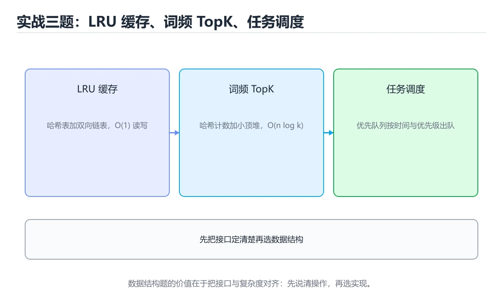
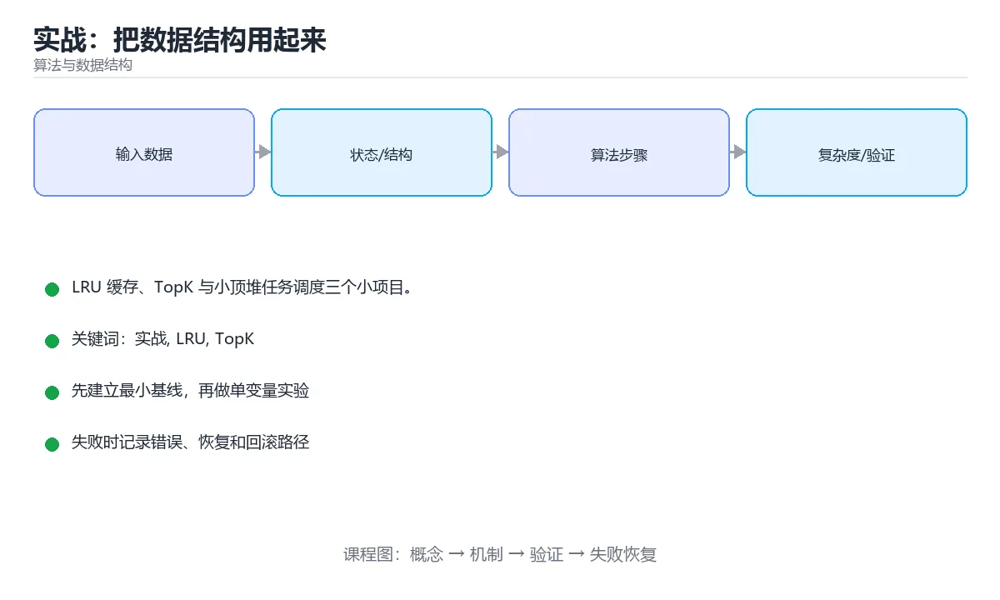

# 实战：把数据结构用起来





> 内容更新时间：2026-10-03 · 学习阶段：高级 · 预计用时：16 分钟

## 学习目标

- 能用自己的话解释「实战：把数据结构用起来」解决了什么问题，而不是只背术语。
- 能说清 「实战」、「LRU」、「TopK」、「堆」 之间的关系，并分别举出一个例子。
- 能把本课知识放回「算法与数据结构」的知识体系，说明它和相邻主题的边界。
- 能完成本课练习，并用验收标准检查自己的结果。

> 一句话摘要：LRU 缓存、TopK 与小顶堆任务调度三个小项目。

## 前置知识

- 先完成上一课《缓存淘汰算法》；如果已经掌握，可以直接用本课练习自测。
- 本课阶段：高级。建议具备同一方向的完整基础，能阅读较长的代码、配置或系统设计说明。
- 开始前先复习：实战、LRU、TopK。
- 如果某一步看不懂，先记录具体卡点，完成练习后再回头读一遍。


## 三个小项目

| 项目 | 用到的结构 | 核心考点 |
| --- | --- | --- |
| LRU 缓存 | 哈希表 + 双向链表 | O(1) 查找与淘汰顺序 |
| 词频 TopK | 哈希表 + 小顶堆 | O(n log k) 优于全排序 |
| 任务调度器 | 优先队列（堆） | 按优先级与截止时间出队 |

## LRU 缓存实现要点

哈希表存 key → 节点，双向链表维护访问顺序：命中时把节点移到表头，插入超容量时删表尾。**为什么不用数组**：数组中间删除是 O(n)。若只要求近似 LRU，可用随机采样（Redis 的做法）。

## 词频 TopK 要点

先用哈希表统计词频（O(n)），再用大小为 k 的小顶堆筛选（O(n log k)）；若 k 接近 n，直接全排序更简单。注意内存：超大文件要分块统计再合并。

## 任务调度器要点

用堆按优先级出队；需要「延时任务」时对比当前时间与执行时间，未到时等待；多线程消费要加锁或用阻塞队列。真实系统的变体是时间轮（Kafka）与延时队列（Redis ZSet）。

## 验收标准

1. 每个结构都写单元测试：命中/未命中、容量边界、重复 key、并发安全。
2. 用基准测试对比不同实现（数组 vs 链表、全排序 vs 堆）。
3. 能说清时间/空间复杂度，以及为什么选这个结构。

## 交付物与评分标准

**交付物**：三个可运行的实现文件（LRU 缓存、TopK、任务调度器）+ 单元测试（含边界用例）+ 基准测试报告（含复杂度实测对比）。

**评分标准**：功能正确 40%（边界与异常全覆盖）、复杂度达标 30%（能实测出与理论一致的增长趋势）、代码质量 20%（命名、注释、结构）、基准报告 10%（含数据与结论）。**低于 70 分说明关键路径没跑通，需要重做而不是打补丁。**

**常见失败案例**：① LRU 用列表实现，删除 O(n)；② TopK 直接全排序，没意识到 k 很小时堆更优；③ 计数器用无界队列，压力测试时内存涨到 OOM；④ 只测正常输入，容量为 0 或重复 key 直接崩。

## 本课小结
数据结构的价值在于**匹配问题形态**：需要顺序淘汰用链表、需要按优先级取用堆、需要快速查找用哈希；把三者组合起来就是真实系统的缓存与调度。


## 实战题型与结构选型

| 需求 | 首选结构 | 复杂度 |
| --- | --- | --- |
| 最近最少使用缓存 | 哈希表 + 双向链表 | get/put O(1) |
| 最高频使用缓存 | 哈希表 + 频次桶 | get/put O(1) |
| 定时过期缓存 | 哈希表 + 最小堆 / 时间轮 | 过期处理 O(log n) |
| TopK 热点 | 大小为 k 的最小堆 | O(n log k) |
| 滑动窗口统计 | 单调队列 / 前缀和 | O(n) |
| 频率统计（海量） | Count-Min Sketch | O(1) 近似 |
| 去重（海量） | 布隆过滤器 + 精确复核 | O(k) |
| 限流（单机） | 令牌桶 / 滑动窗口 | O(1) |
| 限流（分布式） | Redis + Lua | O(1) |
| 排行榜 | 跳表 / 有序集合 | O(log n) |

## 组合示例

```python
import heapq
import time
from collections import OrderedDict, deque

class SlidingWindowLimiter:
    """滑动窗口限流：只保留窗口内的请求时间戳。"""

    def __init__(self, limit: int, window_seconds: float):
        self.limit = limit
        self.window = window_seconds
        self.events: deque[float] = deque()

    def allow(self, now: float | None = None) -> bool:
        now = time.monotonic() if now is None else now
        while self.events and now - self.events[0] >= self.window:
            self.events.popleft()              # 移除过期请求
        if len(self.events) >= self.limit:
            return False
        self.events.append(now)
        return True


class TokenBucket:
    """令牌桶：允许一定突发，平均速率受限于补充速率。"""

    def __init__(self, rate: float, capacity: float):
        self.rate, self.capacity = rate, capacity
        self.tokens = capacity
        self.updated = time.monotonic()

    def allow(self, cost: float = 1.0) -> bool:
        now = time.monotonic()
        elapsed = now - self.updated
        self.tokens = min(self.capacity, self.tokens + elapsed * self.rate)
        self.updated = now
        if self.tokens >= cost:
            self.tokens -= cost
            return True
        return False


def top_k(records, k):
    """TopK：只维护大小为 k 的最小堆，内存 O(k)。"""
    heap = []
    for name, score in records:
        if len(heap) < k:
            heapq.heappush(heap, (score, name))
        elif score > heap[0][0]:
            heapq.heapreplace(heap, (score, name))
    return sorted(heap, key=lambda x: -x[0])


class TTLCache:
    """带过期时间的缓存：惰性删除 + 容量上限。"""

    def __init__(self, capacity: int, ttl: float):
        self.capacity, self.ttl = capacity, ttl
        self.data: OrderedDict = OrderedDict()

    def get(self, key):
        item = self.data.get(key)
        if item is None:
            return None
        value, expire_at = item
        if expire_at < time.monotonic():
            self.data.pop(key, None)           # 惰性删除
            return None
        self.data.move_to_end(key)
        return value

    def put(self, key, value) -> None:
        self.data[key] = (value, time.monotonic() + self.ttl)
        self.data.move_to_end(key)
        while len(self.data) > self.capacity:
            self.data.popitem(last=False)
```

## 工程要点速查

| 要点 | 说明 |
| --- | --- |
| 明确不变量 | 如「链表长度等于 map 大小」 |
| 边界测试 | 容量 1、空缓存、重复键、并发访问 |
| 并发安全 | 单机加锁或分段锁，分布式用共享存储 + 原子操作 |
| 内存上限 | 按条数或按权重限制，避免 OOM |
| 监控指标 | 命中率、淘汰数、平均延迟、错误率 |
| 降级策略 | 缓存不可用时直接回落数据库并限流 |
| 幂等 | 重试不会产生副作用 |
| 单元测试 + 压测 | 正确性靠测试，容量靠压测验证 |

## 常见错误对照表

| 容易踩的做法 | 实际现象 | 原因与正确做法 |
| --- | --- | --- |
| LRU 只用哈希表 | 无法维护访问顺序 | 配合双向链表或有序字典 |
| 限流用固定窗口计数 | 窗口边界出现两倍突发 | 用滑动窗口或令牌桶 |
| 分布式限流用本地计数 | 多实例叠加后超限 | 用 Redis 等共享状态 |
| 令牌桶不记录更新时间 | 令牌计算错误 | 每次按时间差补充令牌 |
| TopK 全量排序 | 内存与时间浪费 | 维护大小为 k 的堆 |
| 缓存不设上限 | 内存持续增长 | 明确容量与淘汰策略 |
| 过期键不清理 | 内存泄漏 | 惰性删除 + 定期清理 |
| 无命中率监控 | 无法评估效果 | 记录命中率与延迟 |
| 只做正确性测试不做压测 | 上线后容量不足 | 压测确认 QPS 与延迟 |
| 并发下直接改共享结构 | 数据竞争 | 加锁或使用并发安全结构 |

## 自测清单

- [ ] 能为每个需求选出合适的数据结构并说明复杂度。
- [ ] 手写过 LRU、限流器与 TopK。
- [ ] 明确缓存容量、过期与降级策略。
- [ ] 有边界用例与并发测试。
- [ ] 压测验证容量，并上线监控命中率与延迟。


## 动手练习

### 练习 1：概念复述（10 分钟）

合上教程，用 3～5 句话解释「实战：把数据结构用起来」解决什么问题，并写出一个边界条件。

**验收标准**：至少使用一个本课关键词，并给出一个反例。

### 练习 2：示例改写（20 分钟）

从正文选一个最小示例，先预测修改一个输入后的结果，再实际验证并记录差异。

**验收标准**：留下「原例 → 改动 → 预测 → 结果 → 原因」五步记录。

### 练习 3：迁移任务（30 分钟）

给定 8～12 个手工构造的数据，写出每一步状态，并统计比较或交换次数。

- 至少覆盖「实战」和「LRU」两个关键词。
- 产出一个别人可以检查的结果。
- 写出一个仍不确定的问题和验证方法。


## 验证命令与预期输出

项目代码不能只看“能编译”，还要能按固定命令复现结果。下表给出最低验证集：

| 阶段 | 命令 | 预期输出 |
| --- | --- | --- |
| 安装依赖 | `python -m pip install -r requirements.txt` | 依赖安装完成，没有版本冲突 |
| 语法检查 | `python -m compileall .` | 所有模块编译通过 |
| 运行测试 | `python -m pytest -q` | 测试全部通过，失败用例数为 0 |
| 启动示例 | `python main.py` | 服务启动并输出监听地址 |

### 验收证据

- [ ] 保存依赖安装和启动命令的完整输出。
- [ ] 至少运行 3 条测试，其中包含一条非法输入或失败路径。
- [ ] 重复执行同一操作两次，确认没有重复写入或副作用。
- [ ] 记录一次失败状态码、错误日志和恢复步骤。
- [ ] 在 README 中写明环境版本、启动方式和回滚方式。

### 回归与回滚

1. 先在一个可丢弃的目录或临时数据库执行，避免污染真实数据。
2. 修改一处逻辑后重跑全部验证命令，确认没有回归。
3. 若失败，回滚到上一个可运行版本并保留失败日志。
4. 定位原因后补一条自动化测试，再重新执行发布流程。
5. 把教训写入项目复盘或本课笔记，形成下一次的检查项。


## 可运行练习

下面 3 个任务围绕“实战：把数据结构用起来”展开，代码可以直接粘贴到 App 的离线沙箱里运行；如果示例会读取标准输入，请按代码注释在沙箱的 stdin 区域填入同样格式的数据。

### 任务 1：先跑通，再解释

```json
{
  "project": "algorithms_project",
  "input": {"case": "normal", "value": 5},
  "expected": {"ok": true, "result": 5},
  "failure_case": {"value": -1, "error": "validation_error"},
  "idempotency_key": "demo-001"
}
```

**预期输出**：沙箱会解析并格式化“实战：把数据结构用起来”中的这段 JSON；请重点检查键名、嵌套层级和数组元素。

**验收标准**：代码能正常运行；逐行解释每个变量的值如何变化，并指出哪一行决定了最终结果。

### 任务 2：只改一个条件

复制上面的代码，只修改一个输入、边界或参数（例如空值、最大值、循环次数、过滤条件），先写出你的预测，再实际运行。

**验收标准**：留下“原结果 → 改动 → 预测 → 实际结果 → 差异原因”五步记录；如果预测错误，要写出修正后的心智模型。

### 任务 3：迁移到自己的数据

用同一套思路处理一组你自己的数据或场景，保持输出格式与任务 1 一致。

**验收标准**：代码不少于 10 行，至少包含 1 个边界检查；把代码和运行结果保存到笔记或片段库。


## 故障现场

这一节把“实战：把数据结构用起来”最常见的失败方式还原成现场记录，练习时按“症状 → 复现 → 定位 → 修复 → 预防”的顺序排查。

### 现场 1：“实战：把数据结构用起来”的 实战 常规用例通过，但边界用例失败

**症状**：在“实战：把数据结构用起来”的练习或生产场景里出现““实战：把数据结构用起来”的 实战 常规用例通过，但边界用例失败”。

**复现**：准备一组最小输入，只保留触发““实战：把数据结构用起来”的 实战 常规用例通过，但边界用例失败”的必要条件，连续运行两次确认结果稳定。

**定位**：围绕“实战 的前置条件与取值边界没有写进代码，默认值掩盖了空值和极值”检查调用链、输入数据和环境配置，先验证假设再改代码。

**修复**：为“实战：把数据结构用起来”补一条空值或极值用例，把前置条件写成断言，并让失败信息直接指出是哪个输入越界

**预防**：把““实战：把数据结构用起来”的 实战 常规用例通过，但边界用例失败”写成一条自动化用例，并在“实战：把数据结构用起来”的验收清单里保留对应检查项。


### 现场 2：“实战：把数据结构用起来”的 LRU 结果在两次运行之间不一致

**症状**：在“实战：把数据结构用起来”的练习或生产场景里出现““实战：把数据结构用起来”的 LRU 结果在两次运行之间不一致”。

**复现**：准备一组最小输入，只保留触发““实战：把数据结构用起来”的 LRU 结果在两次运行之间不一致”的必要条件，连续运行两次确认结果稳定。

**定位**：围绕“LRU 依赖了当前版本、执行顺序或共享状态，单次运行无法暴露差异”检查调用链、输入数据和环境配置，先验证假设再改代码。

**修复**：固定“实战：把数据结构用起来”使用的版本与随机种子，记录两次运行的完整输入和输出，再逐项消除非确定性来源

**预防**：把““实战：把数据结构用起来”的 LRU 结果在两次运行之间不一致”写成一条自动化用例，并在“实战：把数据结构用起来”的验收清单里保留对应检查项。


### 现场 3：小数据规模结果正确，扩大输入后超时或内存溢出

**症状**：在“实战：把数据结构用起来”的练习或生产场景里出现“小数据规模结果正确，扩大输入后超时或内存溢出”。

**复现**：准备一组最小输入，只保留触发“小数据规模结果正确，扩大输入后超时或内存溢出”的必要条件，连续运行两次确认结果稳定。

**定位**：围绕“实战 的时间或空间复杂度在边界条件下失控，LRU 的常数开销也被低估”检查调用链、输入数据和环境配置，先验证假设再改代码。

**修复**：为“实战：把数据结构用起来”记录输入规模与运行时间的对照表，先用更小的样本验证复杂度，再优化热点循环

**预防**：把“小数据规模结果正确，扩大输入后超时或内存溢出”写成一条自动化用例，并在“实战：把数据结构用起来”的验收清单里保留对应检查项。


## 考点精讲：把测验题还原成判断过程

本课有 6 个判断点。先自己作答，再看「判断依据」；如果结论正确但理由不完整，回到正文对应章节补足概念。

### 考点 1：LRU 缓存用哈希表加双向链表的原因是？

- **正确判断**：同时获得 O(1) 查找与 O(1) 顺序调整
- **判断依据**：正确答案是「同时获得 O(1) 查找与 O(1) 顺序调整」，本课在「本课小结」中说明：数据结构的价值在于匹配问题形态：需要顺序淘汰用链表、需要按优先级取用堆、需要快速查找用哈希。数组中间删除是 O(n)，链表才能常数时间移动节点。本课还在「LRU 缓存实现要点」中说明：哈希表存 key → 节点，双向链表维护访问顺序：命中时把节点移到表头，插入超容量时删表尾。本课还在「词频 TopK 要点」中说明：先用哈希表统计词频（O(n)），再用大小为 k 的小顶堆筛选（O(n log k)）。
- **迁移检查**：把题干里的一个条件换成边界值，原来的结论还成立吗？写出判断过程。

### 考点 2：求 TopK（k 远小于 n）的最优做法是？

- **正确判断**：哈希计数加大小为 k 的小顶堆
- **判断依据**：正确答案是「哈希计数加大小为 k 的小顶堆」，本课在「词频 TopK 要点」中说明：先用哈希表统计词频（O(n)），再用大小为 k 的小顶堆筛选（O(n log k)）。复杂度 O(n log k)，比全排序 O(n log n) 更优。本课还在「本课小结」中说明：数据结构的价值在于匹配问题形态：需要顺序淘汰用链表、需要按优先级取用堆、需要快速查找用哈希。本课还在「项目专属规格：实战：把数据结构用起来」中说明：LRU 缓存、TopK 与小顶堆任务调度三个小项目。
- **迁移检查**：把题干里的一个条件换成边界值，原来的结论还成立吗？写出判断过程。

### 考点 3：这类实战的验收重点应放在？

- **正确判断**：边界测试与不同实现的基准对比
- **判断依据**：正确答案是「边界测试与不同实现的基准对比」，本课在「验收标准」中说明：用基准测试对比不同实现（数组 vs 链表、全排序 vs 堆）。要能说明复杂度与选型理由，而不是能跑就行。本课还在「交付物与评分标准」中说明：交付物：三个可运行的实现文件（LRU 缓存、TopK、任务调度器）+ 单元测试（含边界用例）+ 基准测试报告（含复杂度实测对比）。本课还在「交付物与评分标准」中说明：评分标准：功能正确 40%（边界与异常全覆盖）、复杂度达标 30%（能实测出与理论一致的增长趋势）、代码质量 20%（命名、注释、结构）、基准报告 10%（含数据与结论）。
- **迁移检查**：如果给某个错误选项去掉一个限定词，它会不会变成正确？说明理由。

### 考点 4：滑动窗口限流与令牌桶限流的区别是？

- **正确判断**：滑动窗口按时间片统计请求数
- **判断依据**：需要平滑限速用漏桶，允许突发但限制平均速率用令牌桶。其他选项：滑动窗口按时间片统计请求数，两者特性不同。针对「滑动窗口限流与令牌桶限流的区别是，」，本课在「任务调度器要点」中说明：需要「延时任务」时对比当前时间与执行时间，未到时等待。本课还在「任务调度器要点」中说明：真实系统的变体是时间轮（Kafka）与延时队列（Redis ZSet）。本课还在「验收标准」中说明：能说清时间/空间复杂度，以及为什么选这个结构。
- **迁移检查**：遮住选项，只根据定义复述一次答案，再回来看哪个选项与复述一致。

### 考点 5：海量 URL 去重常用的组合是？

- **正确判断**：布隆过滤器初筛 + 哈希分片或精确存储复核
- **判断依据**：正确答案是「布隆过滤器初筛 + 哈希分片或精确存储复核」，本课在「LRU 缓存实现要点」中说明：哈希表存 key → 节点，双向链表维护访问顺序：命中时把节点移到表头，插入超容量时删表尾。布隆过滤器有假阳性，靠精确结构复核可保证正确性，同时把大部分查询挡在前面。本课还在「LRU 缓存实现要点」中说明：为什么不用数组：数组中间删除是 O(n)。本课还在「LRU 缓存实现要点」中说明：若只要求近似 LRU，可用随机采样（Redis 的做法）。
- **迁移检查**：如果给某个错误选项去掉一个限定词，它会不会变成正确？说明理由。

### 考点 6：补全代码：「实战：把数据结构用起来」示例中，下面这行代码缺少哪个关键字或函数名？请填入 ____。 `"project": "____",`

- **正确判断**：algorithms_project
- **判断依据**：正确答案是「algorithms_project」，本课在「验收标准」中说明：每个结构都写单元测试：命中/未命中、容量边界、重复 key、并发安全。本课还在「交付物与评分标准」中说明：评分标准：功能正确 40%（边界与异常全覆盖）、复杂度达标 30%（能实测出与理论一致的增长趋势）、代码质量 20%（命名、注释、结构）、基准报告 10%（含数据与结论）。本课还在「交付物与评分标准」中说明：低于 70 分说明关键路径没跑通，需要重做而不是打补丁。
- **迁移检查**：如果填成相近的另一个函数或关键字，程序会在哪一步出错？

### 补充自测（2 题）

1. 围绕“实战：把数据结构用起来”中的 实战、LRU、TopK，下列哪两项是本课强调的实践判断？
2. 下面这段 Python 代码复现了“实战：把数据结构用起来”中 实战、LRU、TopK 相关的一个常见故障，哪一项最准确地解释了问题？

这些题按“先定位概念、再排除边界错误、最后核对答案”的顺序作答；每题解析都给出了判断依据。


## 本课复习清单

离开本课前，逐项确认：

- [ ] 不看解析，能说出「LRU 缓存用哈希表加双向链表的原因是？」的判断依据。
- [ ] 不看解析，能说出「求 TopK（k 远小于 n）的最优做法是？」的判断依据。
- [ ] 不看解析，能说出「这类实战的验收重点应放在？」的判断依据。
- [ ] 不看解析，能说出「滑动窗口限流与令牌桶限流的区别是？」的判断依据。
- [ ] 不看解析，能说出「海量 URL 去重常用的组合是？」的判断依据。
- [ ] 不看解析，能说出「补全代码：「实战：把数据结构用起来」示例中，下面这行代码缺少哪个关键字或函数名？…」的判断依据。
- [ ] 至少运行一次本课示例，记录输入、输出和一个边界情况。
- [ ] 把本课最容易混淆的两个概念写成一句话对照。

| 复盘项 | 记录 |
| --- | --- |
| 已经能独立解释的考点 |  |
| 仍然说不清的概念 |  |
| 下一步验证动作 |  |

## 术语速查

把本课反复出现的术语集中放在一起。复习时先遮住右列，尝试用自己的话解释，再回到正文核对。

| 术语 | 本课语境 |
| --- | --- |
| `python -m compileall .` | \| 语法检查 \| `python -m compileall .` \| 所有模块编译通过 \| |
| `python -m pytest -q` | \| 运行测试 \| `python -m pytest -q` \| 测试全部通过，失败用例数为 0 \| |
| `python main.py` | \| 启动示例 \| `python main.py` \| 服务启动并输出监听地址 \| |
| `实战` | 本课围绕该主题展开，结合正文与代码示例理解它的适用边界。 |
| `LRU` | 本课围绕该主题展开，结合正文与代码示例理解它的适用边界。 |
| `TopK` | 本课围绕该主题展开，结合正文与代码示例理解它的适用边界。 |
| `堆` | 本课围绕该主题展开，结合正文与代码示例理解它的适用边界。 |
| `调度` | 本课围绕该主题展开，结合正文与代码示例理解它的适用边界。 |

## 面试问答与自测

下面把本课考点换成面试追问。先口述自己的答案，
再对照参考回答检查是否遗漏了前提、边界或失败路径。

### 追问 1：LRU 缓存用哈希表加双向链表的原因是？

**参考回答**：正确答案是「同时获得 O(1) 查找与 O(1) 顺序调整」，本课在「本课小结」中说明：数据结构的价值在于匹配问题形态：需要顺序淘汰用链表、需要按优先级取用堆、需要快速查找用哈希。数组中间删除是 O(n)，链表才能常数时间移动节点。本课还在「LRU 缓存实现要点」中说明：哈希表存 key → 节点，双向链表维护访问顺序：命中时把节点移到表头，插入超容量时删表尾。本课还在「词频 TopK 要点」中说明：先用哈希表统计词频（O(n)），再用大小为 k 的小顶堆筛选（O(n log k)）。

### 追问 2：求 TopK（k 远小于 n）的最优做法是？

**参考回答**：正确答案是「哈希计数加大小为 k 的小顶堆」，本课在「词频 TopK 要点」中说明：先用哈希表统计词频（O(n)），再用大小为 k 的小顶堆筛选（O(n log k)）。复杂度 O(n log k)，比全排序 O(n log n) 更优。本课还在「本课小结」中说明：数据结构的价值在于匹配问题形态：需要顺序淘汰用链表、需要按优先级取用堆、需要快速查找用哈希。本课还在「项目专属规格·实战·把数据结构用起来」中说明：LRU 缓存、TopK 与小顶堆任务调度三个小项目。

### 追问 3：这类实战的验收重点应放在？

**参考回答**：正确答案是「边界测试与不同实现的基准对比」，本课在「验收标准」中说明：用基准测试对比不同实现（数组 vs 链表、全排序 vs 堆）。要能说明复杂度与选型理由，而不是能跑就行。本课还在「交付物与评分标准」中说明：交付物：三个可运行的实现文件（LRU 缓存、TopK、任务调度器）+ 单元测试（含边界用例）+ 基准测试报告（含复杂度实测对比）。本课还在「交付物与评分标准」中说明：评分标准：功能正确 40%（边界与异常全覆盖）、复杂度达标 30%（能实测出与理论一致的增长趋势）、代码质量 20%（命名、注释、结构）、基准报告 10%（含数据与结论）。

### 追问 4：滑动窗口限流与令牌桶限流的区别是？

**参考回答**：需要平滑限速用漏桶，允许突发但限制平均速率用令牌桶。其他选项：滑动窗口按时间片统计请求数，两者特性不同。针对「滑动窗口限流与令牌桶限流的区别是，」，本课在「任务调度器要点」中说明：需要「延时任务」时对比当前时间与执行时间，未到时等待。本课还在「任务调度器要点」中说明：真实系统的变体是时间轮（Kafka）与延时队列（Redis ZSet）。本课还在「验收标准」中说明：能说清时间/空间复杂度，以及为什么选这个结构。

### 追问 5：海量 URL 去重常用的组合是？

**参考回答**：正确答案是「布隆过滤器初筛 + 哈希分片或精确存储复核」，本课在「LRU 缓存实现要点」中说明：哈希表存 key → 节点，双向链表维护访问顺序：命中时把节点移到表头，插入超容量时删表尾。布隆过滤器有假阳性，靠精确结构复核可保证正确性，同时把大部分查询挡在前面。本课还在「LRU 缓存实现要点」中说明：为什么不用数组：数组中间删除是 O(n)。本课还在「LRU 缓存实现要点」中说明：若只要求近似 LRU，可用随机采样（Redis 的做法）。

## English Overview

**Title:** Project: Data Structures in Action

**Summary:** LRU cache, TopK and priority scheduling.

**Category:** Algorithms  
**Level:** 高级  
**Key terms:** 实战, LRU, TopK, 堆, 调度

> The full tutorial is written in Chinese. This bilingual overview helps English readers identify the topic, scope and key terms before studying the detailed examples.

## 内容元数据

- 内容版本：v2.0
- 最后更新：2026-10-03
- 学习阶段：高级
- 适用环境：任意主流语言（伪代码与复杂度为主）
- 内容来源：内置结构化课程与工程实践整理
- 相关主题：实战、LRU、TopK、堆、调度
- 质量版本：P0 测验标准 + P1 覆盖扩展 + P2 体验补全

## 项目专属规格：实战：把数据结构用起来

### 核心场景

LRU 缓存、TopK 与小顶堆任务调度三个小项目。 项目目标是把「实战、LRU、TopK、堆、调度」落实为可运行、可测试、可回滚的交付物。

### 架构与数据流

```text
用户/输入 → 接口或命令 → 领域逻辑 → 存储/外部依赖 → 输出与监控
                         ↘ 失败分类 → 重试/补偿 → 回滚
```

### 最小数据模型

| 对象 | 关键字段 | 约束 |
| --- | --- | --- |
| 输入实体 | 实战、时间、来源 | 必填校验、长度限制、幂等键 |
| 任务实体 | 状态、优先级、创建时间 | 状态迁移合法、不可重复执行 |
| 结果实体 | 输出、错误码、耗时 | 可序列化、错误可解释 |
| 审计记录 | 操作者、动作、结果、时间 | 不可篡改、可查询、脱敏 |

### 验收场景

1. 正常路径：最小输入得到预期输出，并留下日志与指标。
2. 边界路径：空值、最大值、重复数据和超长内容得到明确处理。
3. 失败路径：依赖超时或不可用时能快速失败、重试或降级。
4. 幂等路径：同一请求执行两次不会产生重复副作用。
5. 回滚路径：回滚后数据一致，且能说明恢复时间和影响范围。


## 项目交付物

### 建议仓库结构

```text
src/
tests/
docs/
README.md
```

### 测试矩阵

| 层级 | 覆盖内容 | 最低数量 | 通过标准 |
| --- | --- | ---: | --- |
| 单元测试 | 领域规则、边界和错误分类 | 8 | 正常、边界、失败路径全部通过 |
| 集成测试 | 数据库、网络、文件或平台边界 | 3 | 使用真实边界且可重复运行 |
| 端到端测试 | 核心用户路径 | 1 | 从输入到输出完整跑通 |
| 手动验收 | 文档中列出的 5 个场景 | 5 | 有命令、输出和结论记录 |

### 验收数据

```json
{
  "project": "algorithms_project",
  "input": {"case": "normal", "value": 5},
  "expected": {"ok": true, "result": 5},
  "failure_case": {"value": -1, "error": "validation_error"},
  "idempotency_key": "demo-001"
}
```

### 复盘模板

| 问题 | 记录 |
| --- | --- |
| 原目标是什么？ | 用一句话描述可验收目标 |
| 实际发生了什么？ | 时间线、指标和关键日志 |
| 哪个假设被推翻？ | 根因与促成因素 |
| 如何回滚？ | 步骤、耗时和数据校验 |
| 下一步做什么？ | 负责人、期限和验证方式 |

> 项目验收围绕「实战、LRU、TopK」：至少完成一次正常路径、一次边界输入、一次失败恢复和一次幂等检查。


## 参考资料与复核

- 最后复核：2026-10-04
- 下次复核：2027-04-04
- 复核范围：版本兼容、API 行为、安全建议与工程实践
- 来源性质：官方文档与标准；本课正文为离线教学重组，不复制原文

| 参考资料 | 本课用途 |
| --- | --- |
| [CP-Algorithms](https://cp-algorithms.com/) | 算法实现与复杂度 |
| [MIT OpenCourseWare 6.006](https://ocw.mit.edu/courses/6-006-introduction-to-algorithms-spring-2020/) | 算法设计与分析 |

> 本课主题：LRU 缓存、TopK 与小顶堆任务调度三个小项目。

> App 完全离线展示文字链接，不会自动联网；需要延伸阅读时可复制链接到浏览器。
