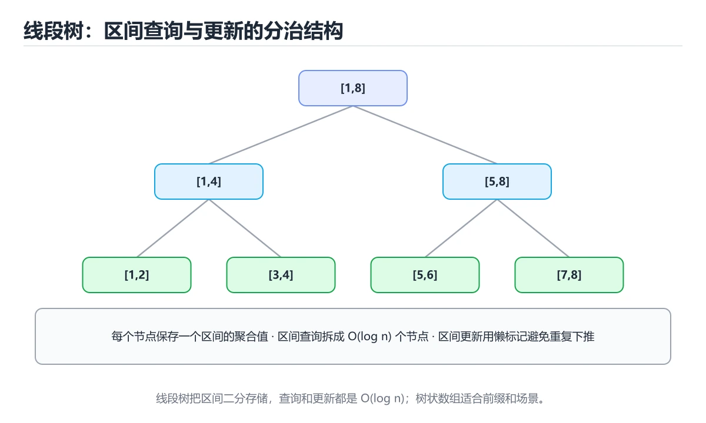
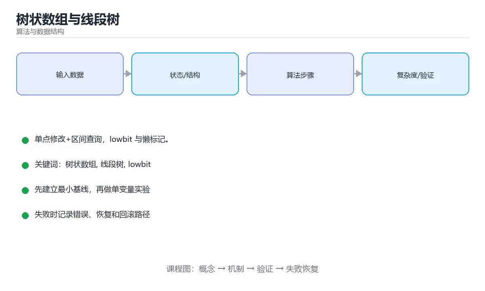

# 树状数组与线段树





> 内容更新时间：2026-10-06 · 学习阶段：高级 · 预计用时：30 分钟

## 学习目标

- 能用自己的话解释树状数组与线段树解决了什么问题，而不是只背术语。
- 能说清 「树状数组」、「线段树」、「lowbit」、「懒标记」 之间的关系，并分别举出一个例子。
- 能把 树状数组 放回「树状数组与线段树」的知识体系，说明它和 线段树 的边界。
- 能完成本课练习，并用验收标准检查自己的结果。

> 一句话摘要：单点修改+区间查询，lowbit 与懒标记。

## 前置知识

- 先完成上一课《字典树（Trie）》；如果已经掌握，可以直接用本课练习自测。
- 开始前先复习：树状数组、线段树、lowbit。
- 卡在 树状数组 上时不要跳过：把输入、预期和实际输出写成三行，再回头读正文。

## 要解决的问题

前缀和擅长「只查不改」，一旦数据会变就失效；树状数组与线段树支持**单点修改 + 区间查询**，线段树还支持区间修改。

| 结构 | 单点修改 | 区间求和 | 区间最值 | 区间修改 |
| --- | --- | --- | --- | --- |
| 前缀和 | O(n) | O(1) | O(n) | 不支持 |
| 树状数组 | O(log n) | O(log n) | 较难 | 差分可支持 |
| 线段树 | O(log n) | O(log n) | O(log n) | 支持（懒标记） |

## 树状数组（Fenwick）

核心是 lowbit：`i & (-i)` 取出 i 最低位的 1，它决定了节点管辖的范围。

```python
class Fenwick:
    def __init__(self, n):
        self.n = n
        self.tree = [0] * (n + 1)          # 下标从 1 开始

    def add(self, i, delta):
        while i <= self.n:
            self.tree[i] += delta
            i += i & (-i)                  # 向上更新

    def prefix_sum(self, i):
        total = 0
        while i > 0:
            total += self.tree[i]
            i -= i & (-i)                  # 向下查询
        return total

    def range_sum(self, left, right):
        return self.prefix_sum(right) - self.prefix_sum(left - 1)
```

代码只有十几行，常数极小；用差分建树还能支持「区间加 + 单点查」。

## 线段树

递归结构，每个节点维护一个区间的聚合值（和、最值、最大子段和等）。

```python
class SegmentTree:
    def __init__(self, nums):
        self.n = len(nums)
        self.tree = [0] * (4 * self.n)
        self._build(1, 0, self.n - 1, nums)

    def _build(self, node, left, right, nums):
        if left == right:
            self.tree[node] = nums[left]
            return
        mid = (left + right) // 2
        self._build(node * 2, left, mid, nums)
        self._build(node * 2 + 1, mid + 1, right, nums)
        self.tree[node] = self.tree[node * 2] + self.tree[node * 2 + 1]

    def update(self, index, value, node=1, left=0, right=None):
        right = self.n - 1 if right is None else right
        if left == right:
            self.tree[node] = value
            return
        mid = (left + right) // 2
        if index <= mid:
            self.update(index, value, node * 2, left, mid)
        else:
            self.update(index, value, node * 2 + 1, mid + 1, right)
        self.tree[node] = self.tree[node * 2] + self.tree[node * 2 + 1]

    def query(self, ql, qr, node=1, left=0, right=None):
        right = self.n - 1 if right is None else right
        if ql <= left and right <= qr:
            return self.tree[node]                # 完全覆盖
        mid = (left + right) // 2
        total = 0
        if ql <= mid:
            total += self.query(ql, qr, node * 2, left, mid)
        if qr > mid:
            total += self.query(ql, qr, node * 2 + 1, mid + 1, right)
        return total
```

区间修改需要**懒标记（lazy）**：把「整个区间都要加 v」记在节点上，等真正需要访问子区间时再下推，从而把复杂度保持在 O(log n)。

## 选型建议

1. 只有单点修改 + 区间求和 → 树状数组（更短更快）。
2. 需要区间最值、区间修改、复杂合并（如最大子段和）→ 线段树。
3. 操作可离线且只需查询 → 想想能不能用前缀和、差分或排序替代。

## 树状数组与线段树的选型速查

| 需求 | 选树状数组 | 选线段树 |
| --- | --- | --- |
| 单点修改 + 前缀和 | ✅ 代码短、常数小 | 可以但偏重 |
| 区间求和 + 区间加 | ✅（差分 + 双树状数组） | ✅（懒标记更直观） |
| 区间最值 | ❌ | ✅ |
| 区间赋值 / 复杂合并（如最大子段和） | ❌ | ✅ |
| 需要可持久化 / 动态开点 | ❌ | ✅ |

实现要点：树状数组**下标从 1 开始**（下标 0 会导致 lowbit 死循环）；线段树数组开 4n 防越界；懒标记下推（pushdown）必须在访问子节点前执行，忘记下推是区间修改最常见的 bug。复杂度上两者都是 O(log n)，差别主要在表达能力与实现成本。

## 本课小结

树状数组用 lowbit 跳着维护前缀，线段树用分治维护任意区间聚合。**它们的共同目标是把「修改 + 查询」都压到 O(log n)**。

## 树状数组模板

```python
class Fenwick:
    """单点修改 + 区间求和，代码短、常数小。"""

    def __init__(self, n: int):
        self.n = n
        self.tree = [0] * (n + 1)

    def add(self, index: int, delta: int) -> None:
        i = index + 1                     # 内部下标从 1 开始
        while i <= self.n:
            self.tree[i] += delta
            i += i & -i                   # lowbit：跳到下一个管辖区间

    def prefix_sum(self, index: int) -> int:
        """前 index 个元素之和（下标 0..index-1）。"""
        total, i = 0, index
        while i > 0:
            total += self.tree[i]
            i -= i & -i
        return total

    def range_sum(self, left: int, right: int) -> int:
        """闭区间 [left, right] 的和。"""
        return self.prefix_sum(right + 1) - self.prefix_sum(left)
```

## 线段树模板（含懒标记）

```python
class SegmentTree:
    """区间加 + 区间求和：懒标记把修改延迟到必要时下推。"""

    def __init__(self, nums):
        self.n = len(nums)
        self.tree = [0] * (4 * self.n)
        self.lazy = [0] * (4 * self.n)
        if self.n:
            self._build(1, 0, self.n - 1, nums)

    def _build(self, node, left, right, nums):
        if left == right:
            self.tree[node] = nums[left]
            return
        mid = (left + right) // 2
        self._build(node * 2, left, mid, nums)
        self._build(node * 2 + 1, mid + 1, right, nums)
        self.tree[node] = self.tree[node * 2] + self.tree[node * 2 + 1]

    def _apply(self, node, left, right, value):
        self.tree[node] += value * (right - left + 1)
        self.lazy[node] += value

    def _push(self, node, left, right):
        if self.lazy[node] == 0 or left == right:
            return
        mid = (left + right) // 2
        value = self.lazy[node]
        self._apply(node * 2, left, mid, value)
        self._apply(node * 2 + 1, mid + 1, right, value)
        self.lazy[node] = 0

    def update(self, ql, qr, value, node=1, left=0, right=None):
        right = self.n - 1 if right is None else right
        if qr < left or right < ql:
            return
        if ql <= left and right <= qr:
            self._apply(node, left, right, value)
            return
        self._push(node, left, right)
        mid = (left + right) // 2
        self.update(ql, qr, value, node * 2, left, mid)
        self.update(ql, qr, value, node * 2 + 1, mid + 1, right)
        self.tree[node] = self.tree[node * 2] + self.tree[node * 2 + 1]

    def query(self, ql, qr, node=1, left=0, right=None):
        right = self.n - 1 if right is None else right
        if qr < left or right < ql:
            return 0
        if ql <= left and right <= qr:
            return self.tree[node]
        self._push(node, left, right)
        mid = (left + right) // 2
        return (
            self.query(ql, qr, node * 2, left, mid)
            + self.query(ql, qr, node * 2 + 1, mid + 1, right)
        )
```

## 选型速查

| 需求 | 结构 | 复杂度 |
| --- | --- | --- |
| 单点改 + 区间和 | 树状数组 | O(log n) |
| 单点改 + 区间最值 | 树状数组（不可逆运算需变体）或线段树 | O(log n) |
| 区间改 + 区间和 | 线段树 + 懒标记 | O(log n) |
| 区间改 + 区间最值 | 线段树 + 懒标记 | O(log n) |
| 可持久化历史版本 | 可持久化线段树 | O(log n) |
| 二维区间查询 | 二维树状数组 / 线段树 | O(log² n) |

## 常见错误与排查

| 容易写错的做法 | 实际现象 | 原因与正确做法 |
| --- | --- | --- |
| 树状数组下标从 0 开始 | 死循环（`i += 0`） | 内部统一用 1 起始下标 |
| lowbit 写成 `i & i - 1` | 结果错误 | 是 `i & -i` |
| 线段树数组只开 n | 越界 | 递归版开 4n |
| 懒标记忘记下推 | 查询结果过旧 | 访问子区间前先 `push` |
| 下推后不清零标记 | 重复累加 | 下推后把 `lazy[node] = 0` |
| 区间改时长度算错 | 求和结果偏大或偏小 | 乘以 `right - left + 1` |
| 区间边界不判断相交 | 死循环或错误结果 | 先判无交集直接返回 |
| 用线段树解决树状数组能解决的问题 | 代码冗余易错 | 只做单点改与区间和时用树状数组 |
| 更新后忘记回溯更新父节点 | 上层数据陈旧 | 递归返回时重新合并 |
| 忘记处理空数组 | 初始化越界 | 长度为 0 时跳过建树 |

## 复习与自测

- [ ] 能默写树状数组的 add 与 prefix_sum。
- [ ] 记得 lowbit 是 `i & -i`，内部下标从 1 开始。
- [ ] 线段树用 4n 开数组并维护懒标记。
- [ ] 能按需求在树状数组与线段树之间选择。
- [ ] 测试覆盖单点、区间、边界与全区间操作。

## 动手练习

> 本课练习重点：围绕「树状数组、线段树、lowbit」完成复述、实验和交付，每个结果都要能被别人检查。

先笔算 线段树 的中间状态，再运行程序验证复杂度结论。

### 练习 1：建立心智模型（10 分钟）

合上教程，用 3～5 句话回答：

1. 树状数组与线段树解决了什么问题？
2. 如果没有它，会出现什么具体后果？
3. 它和「线段树」是什么关系？

验收标准：说明 树状数组 与 线段树 的分工，并写出一个失效场景。

### 练习 2：做一次可控实验（20 分钟）

从正文中选一个最小示例，完成以下操作：

1. 先预测修改一个参数、输入或步骤后的结果。
2. 再实际执行或逐步推演，记录真实结果。
3. 如果结果与预测不同，写出差异原因。

**验收标准**：把 SegmentTree 当作原例，改动一次线段树的取值，记录命令、输出与差异原因；五步里缺任意一步都算未完成。

### 练习 3：交付一个小结果（30 分钟）

手工构造一组数据，逐步记录 线段树 的状态与代价。

任务要求：

- 结果必须能被别人检查，不能只写“我已经理解了”。
- 至少覆盖「树状数组」和「线段树」两个关键词。
- 写出 1 个仍然不确定的问题，以及下一步如何验证。

> 提示：时间有限时优先做练习 1 和练习 2；练习 3 可以拆成两次完成。

## 可运行练习

### 任务 1：先跑通，再解释

```python
class Fenwick:
    def __init__(self, n):
        self.n = n
        self.tree = [0] * (n + 1)          # 下标从 1 开始

    def add(self, i, delta):
        while i <= self.n:
            self.tree[i] += delta
            i += i & (-i)                  # 向上更新

    def prefix_sum(self, i):
        total = 0
        while i > 0:
            total += self.tree[i]
            i -= i & (-i)                  # 向下查询
        return total

    def range_sum(self, left, right):
        return self.prefix_sum(right) - self.prefix_sum(left - 1)
```

### 任务 2：只改一个条件

把「树状数组与线段树」的最小示例复制一份，只改一个条件再跑一次：

- 改动点：把 线段树 换成边界值，其他输入保持原样。
- 预测：先写下「树状数组与线段树」在改动后的输出或错误信息，再运行。
- 记录：对照改动前后的结果，指出差异出在哪一步。
- 验收：换回原条件能复现原结果，改动只影响树状数组。

### 任务 3：迁移到自己的数据

把 SegmentTree 换成你自己的输入，先保持步骤不变，再比较输出差异。

## 故障现场

### 现场 1：树状数组下标从 0 开始

**症状**：在《树状数组与线段树》的复现场景中，死循环（i += 0）。

**根因**：当出现“树状数组下标从 0 开始”时，执行路径已经绕过了《树状数组与线段树》的关键约束，最终以“死循环（i += 0）”暴露出来；修复前必须先确认约束在哪里失效。

**修复**：针对《树状数组与线段树》的问题，内部统一用 1 起始下标。

**验证**：先在《树状数组与线段树》中记录“树状数组下标从 0 开始”留下的失败证据，再执行“内部统一用 1 起始下标”并重放；确认错误路径变为明确结果，且修复没有掩盖同类故障。

### 现场 2：懒标记忘记下推

**症状**：在《树状数组与线段树》的复现场景中，查询结果过旧。

**根因**：“查询结果过旧”只是表层结果。向上追溯会落到“懒标记忘记下推”这一步，因为它省略了《树状数组与线段树》的约束，使实现行为和预期模型发生了偏离。

**修复**：针对《树状数组与线段树》的问题，访问子区间前先 push。

**验证**：保留《树状数组与线段树》里触发“查询结果过旧”的输入、版本和日志，按“访问子区间前先 push”完成修改后原样重放；只有失败现象消失且相邻场景仍可解释，才保留改动。

### 现场 3：区间改时长度算错

**症状**：在《树状数组与线段树》的复现场景中，求和结果偏大或偏小。

**根因**：当出现“区间改时长度算错”时，执行路径已经绕过了《树状数组与线段树》的关键约束，最终以“求和结果偏大或偏小”暴露出来；修复前必须先确认约束在哪里失效。

**修复**：针对《树状数组与线段树》的问题，乘以 right - left + 1。

**验证**：保留《树状数组与线段树》里触发“求和结果偏大或偏小”的输入、版本和日志，按“乘以 right - left + 1”完成修改后原样重放；只有失败现象消失且相邻场景仍可解释，才保留改动。

## 本课复习清单

离开本课前，逐项确认：

- [ ] 不看解析，能说出「只需要「单点修改 + 区间求和」，最轻量的结构是？」的判断依据。
- [ ] 不看解析，能说出「树状数组中 lowbit 表达式 i & (-i) 的作用是？」的判断依据。
- [ ] 不看解析，能说出「线段树支持区间修改的关键是？」的判断依据。
- [ ] 不看解析，能说出「线段树与树状数组的取舍是？」的判断依据。
- [ ] 不看解析，能说出「递归线段树通常把数组开到多大？」的判断依据。
- [ ] 至少运行一次 SegmentTree 的示例，记录输入、输出和 树状数组 的边界情况。
- [ ] 把本课最容易混淆的两个概念写成一句话对照。

| 复盘项 | 记录 |
| --- | --- |
| 已经能独立解释的考点 |  |
| 仍然说不清的概念 |  |
| 下一步验证动作 |  |

## 术语速查

| 术语 | 一句话说明 |
| --- | --- |
| `线段树` | 递归结构，每个节点维护一个区间的聚合值（和、最值、最大子段和等）。 |
| `lowbit` | 核心是 lowbit：i & (-i) 取出 i 最低位的 1，它决定了节点管辖的范围。 |
| `懒标记` | 区间修改先记在节点上，等真正访问子区间时再下推，把区间更新降到 O(log n)。 |
| `树状数组` | 用 lowbit 分层维护前缀和的轻量结构，单点改与区间查都快，但能做的操作比线段树少。 |

## 考点精讲

### 考点 1：概念判断·单点修改 + 区间求和

- **题目**：只需要「单点修改 + 区间求和」，最轻量的结构是？
- **判断依据**：树状数组代码短、常数小，O(log n) 完成两种操作。其他选项：单点修改加区间求和用树状数组最轻量。在「树状数组与线段树」里判断这道题，要把树状数组、线段树、lowbit的条件、过程与失败路径逐项对齐，换成“只需要单点修改 + 区间求和”这个场景，只有满足前提的结论才成立。

### 考点 2：多选辨析·树状数组

- **题目**：围绕“树状数组与线段树”中的 树状数组、线段树、lowbit，下列哪两项是本课强调的实践判断？
- **判断依据**：本课把树状数组与线段树拆成概念、示例与故障现场三部分，因此判断 树状数组 时必须同时交代输入、输出和失败路径，这使“学习 树状数组 时要同时说明输入、输出和失败路径，不能只看正常流程”成立。在树状数组与线段树里，判断 线段树 时要固定版本与边界输入，所以“验证 线段树 时要固定版本并覆盖边界输入，结论才可复现”才可复现。

### 考点 3：概念判断·树状数组

- **题目**：线段树支持区间修改的关键是？
- **判断依据**：懒标记把区间操作暂存在节点上，访问子区间时再下推。在「树状数组与线段树」里，作答时，先用树状数组建立输入与输出的基线，再把懒标记（lazy）代入边界条件核对，结论才能复现。在「树状数组与线段树」里，如果只凭关键词作答，很容易把「先做一次排序，但它只覆盖了部分情况」、「递归」与「懒标记（lazy）」混在一起；这道题的关键在「树状数组与线段树」的树状数组、线段树、lowbit：先确认题干“线段树支持区间修改的关键是”问的是哪一步，再排除偷换前提的选项。

### 考点 4：代码补全·树状数组

- **题目**：阅读「树状数组与线段树」正文里的这段 Python 代码，下面哪一项判断是正确的？
- **判断依据**：在「树状数组与线段树」里，题干的正确项是这段代码把主要逻辑封装在函数或方法里，需要被调用才会执行，在「树状数组与线段树」里封装边界决定树状数组从哪一步开始生效。把输入或边界换成空值、极值或失败情况后，结论要以「树状数组与线段树」的实际运行结果为准。「树状数组与线段树」要求先交代树状数组、线段树、lowbit的前提再下结论，所以“这段代码把主要逻辑封装在函数或方法里”只在题干“阅读树状数组与线段树正文里的这段 Python 代码”给定的条件下成立。

### 考点 5：概念判断·树状数组

- **题目**：递归线段树通常把数组开到多大？
- **判断依据**：迭代式线段树可用 2 的幂次大小的数组，约为 2n。其他选项：递归线段树通常开 4n 以避免越界。作答时，先用树状数组建立输入与输出的基线，再把4n代入边界条件核对，结论才能复现。这道题的关键在「树状数组与线段树」的树状数组、线段树、lowbit：先确认题干“递归线段树通常把数组开到多大”问的是哪一步，再排除偷换前提的选项。

### 考点 6：填空·def ____(self, i)

- **题目**：补全代码：「树状数组与线段树」示例中，下面这行代码缺少哪个关键字或函数名？请填入 ____。 `def ____(self, i):`
- **判断依据**：空格应填写「prefix_sum」。这道题的关键在「树状数组与线段树」的树状数组、线段树、lowbit：先确认题干“补全代码”问的是哪一步，再排除偷换前提的选项。把“prefixsum”代回「树状数组与线段树」里“树状数组与线段树示例中”的例子核对，条件一旦改变，结论就要用树状数组、线段树、lowbit重新推导。

## English Overview

**Title:** Fenwick & Segment Trees

**Summary:** Point updates, range queries and lazy tags.

**Category:** Algorithms
**Level:** 高级
**Key terms:** 树状数组, 线段树, lowbit, 懒标记, 区间查询

## 内容元数据

- 内容版本：v2.0
- 最后更新：2026-10-06
- 学习阶段：高级
- 适用环境：任意主流语言（伪代码与复杂度为主）
；本课聚焦 树状数组。
- 内容来源：内置结构化课程与工程实践整理
- 相关主题：树状数组、线段树、lowbit、懒标记、区间查询
- 质量版本：P0 测验标准 + P1 覆盖扩展 + P2 体验补全

## 参考资料与复核

- 最后复核：2026-10-04
- 下次复核：2027-09-10
- 复核范围：版本兼容、API 行为、安全建议与工程实践
- 来源性质：官方文档、标准或权威教材；正文为离线教学重组

| 参考资料 | 本课用途 |
| --- | --- |
| [OpenDSA](https://opendsa-server.cs.vt.edu/) | 数据结构互动教材 |
| [LeetCode 学习](https://leetcode.com/explore/) | 算法题训练与模式 |
| [OI Wiki](https://oi-wiki.org/) | 竞赛算法与数据结构 |

> 「树状数组与线段树」的链接用于离线阅读后的延伸核对；App 不会自动联网。
