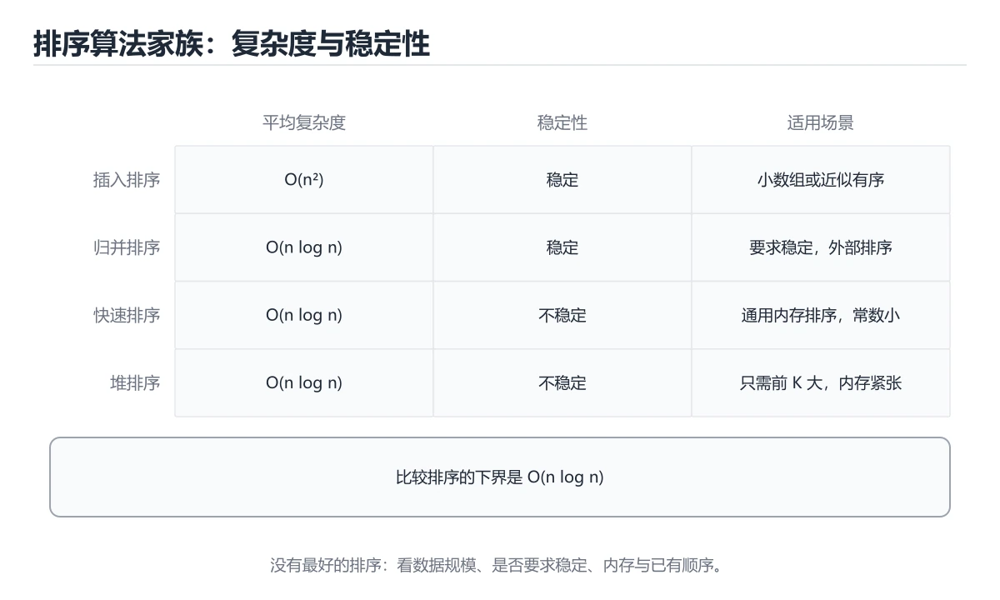
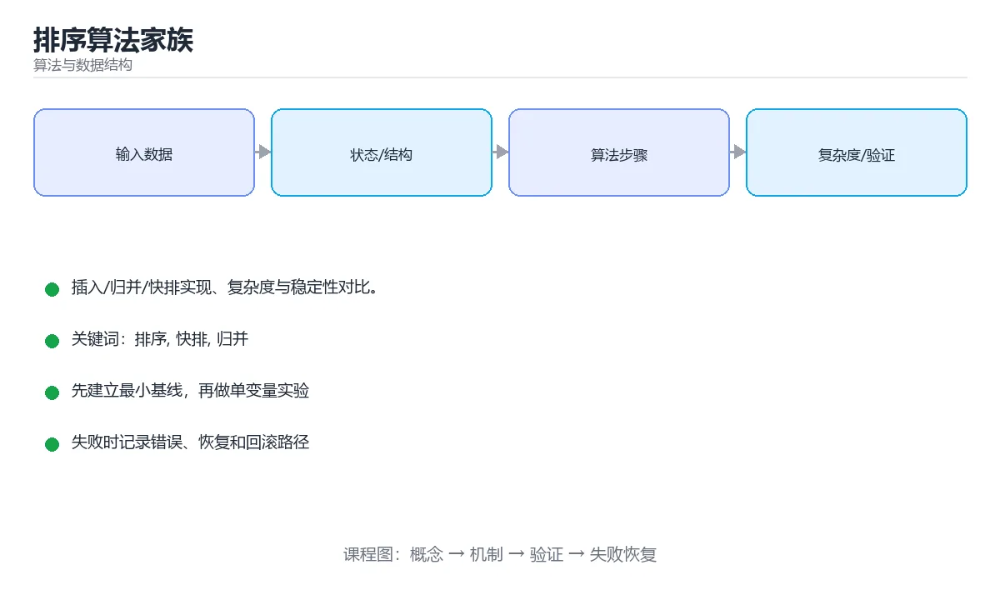

# 排序算法家族





> 内容更新时间：2026-10-06 · 学习阶段：进阶 · 预计用时：35 分钟

## 学习目标

- 能用自己的话解释排序算法家族解决了什么问题，而不是只背术语。
- 能说清 「排序」、「快排」、「归并」、「稳定性」 之间的关系，并分别举出一个例子。
- 能把本课知识放回「算法与数据结构」的知识体系，说明它和相邻主题的边界。
- 能完成本课练习，并用验收标准检查自己的结果。

> 一句话摘要：插入/归并/快排实现、复杂度与稳定性对比。

## 前置知识

- 先完成上一课《图与图算法》；如果已经掌握，可以直接用本课练习自测。
- 本课阶段：进阶。建议先掌握同一分类的基础课程，并能独立运行正文中的最小示例。
- 开始前先复习：排序、快排、归并。
- 如果某一步看不懂，先记录具体卡点，完成练习后再回头读一遍。

## 复杂度与稳定性对比

| 算法 | 平均 | 最坏 | 空间 | 稳定 |
| --- | --- | --- | --- | --- |
| 冒泡排序 | O(n²) | O(n²) | O(1) | 是 |
| 插入排序 | O(n²) | O(n²) | O(1) | 是 |
| 选择排序 | O(n²) | O(n²) | O(1) | 否 |
| 归并排序 | O(n log n) | O(n log n) | O(n) | 是 |
| 快速排序 | O(n log n) | O(n²) | O(log n) | 否 |
| 堆排序 | O(n log n) | O(n log n) | O(1) | 否 |
| 计数排序 | O(n + k) | O(n + k) | O(k) | 是 |

稳定性指相等元素排序后相对顺序不变；多关键字排序时会用到这个性质。

## 插入排序：小数组的性能王者

```python
def insertion_sort(nums):
    for i in range(1, len(nums)):
        current, j = nums[i], i - 1
        while j >= 0 and nums[j] > current:
            nums[j + 1] = nums[j]
            j -= 1
        nums[j + 1] = current
    return nums
```

数据接近有序时接近 `O(n)`，因此常被用作大排序算法在小数组上的收尾。

## 归并排序：稳定 + 分治

```python
def merge_sort(nums):
    if len(nums) <= 1:
        return nums
    mid = len(nums) // 2
    left, right = merge_sort(nums[:mid]), merge_sort(nums[mid:])
    merged, i, j = [], 0, 0
    while i < len(left) and j < len(right):
        if left[i] <= right[j]:      # <= 保证稳定
            merged.append(left[i]); i += 1
        else:
            merged.append(right[j]); j += 1
    merged += left[i:] + right[j:]
    return merged
```

归并排序是**外部排序**与链表排序的基础（不需要随机访问）。

## 快速排序：交换 + 分区

```python
def quick_sort(nums, low=0, high=None):
    high = len(nums) - 1 if high is None else high
    if low >= high:
        return nums
    pivot, i = nums[high], low
    for j in range(low, high):
        if nums[j] < pivot:
            nums[i], nums[j] = nums[j], nums[i]
            i += 1
    nums[i], nums[high] = nums[high], nums[i]
    quick_sort(nums, low, i - 1)
    quick_sort(nums, i + 1, high)
    return nums
```

快排常数小、缓存友好，是通用排序的首选；但取端点作基准遇到有序数据会退化，可用随机基准或三数取中。

## 工程实践

```python
nums = [3, 1, 2]
nums.sort()                        # 原地排序，Timsort：稳定、O(n log n)
sorted(nums, key=lambda x: -x)     # 返回新列表，支持 key 函数
words.sort(key=len)
records.sort(key=lambda r: (r.age, r.name))   # 多关键字
```

Python 的 Timsort 与 Java 的 TimSort 都是「归并 + 插入」的混合算法，对真实数据（部分有序）表现极好。

## 本课小结
面试要能说出各算法的**复杂度、稳定性与适用场景**；工程中直接使用语言内置排序，除非有特殊约束（内存极小、外部排序、只需要 TopK）。

## 选择依据速查

| 需求 | 推荐算法 | 原因 |
| --- | --- | --- |
| 通用排序 | 快速排序 / Timsort | 平均最快、缓存友好 |
| 要求稳定 | 归并排序 / Timsort | 相等元素保持原顺序 |
| 空间受限 | 堆排序 | O(1) 额外空间 |
| 近乎有序 | 插入排序 / Timsort | 接近 O(n) |
| 整数且范围小 | 计数排序 | O(n+k) 线性 |
| 多位数整数或字符串 | 基数排序 | 按位稳定排序 |
| 只取 TopK | 堆 / 快速选择 | 不必全排序 |
| 链表排序 | 归并排序 | 不需要随机访问 |
| 外部大文件 | 外部归并排序 | 分块 + 多路归并 |

稳定性速查：

| 稳定 | 不稳定 |
| --- | --- |
| 冒泡、插入、归并、计数、基数、Timsort | 选择、快速、堆、希尔 |

## 快速排序实现要点

```python
import random

def quick_sort(nums):
    """三路快排：处理大量重复元素更高效，最坏情况用随机主元规避。"""
    if len(nums) <= 1:
        return nums[:]

    pivot = random.choice(nums)               # 随机主元降低最坏概率
    less = [x for x in nums if x < pivot]
    equal = [x for x in nums if x == pivot]
    greater = [x for x in nums if x > pivot]
    return quick_sort(less) + equal + quick_sort(greater)

# 原地分区版（Lomuto）：额外空间 O(1)，递归栈 O(log n)
def partition(arr, low, high):
    pivot = arr[high]
    i = low - 1
    for j in range(low, high):
        if arr[j] <= pivot:
            i += 1
            arr[i], arr[j] = arr[j], arr[i]
    arr[i + 1], arr[high] = arr[high], arr[i + 1]
    return i + 1
```

要点：随机或三数取中选主元可避免已排序数据退化成 O(n²)；小数组（<16）切换插入排序更快；重复元素多用三路分区。

## 语言内置排序速查

| 语言 | 调用 | 稳定性 | 备注 |
| --- | --- | --- | --- |
| Python | `sorted(x)` / `x.sort()` | 稳定 | Timsort，`key` 只调用一次 |
| Java | `Arrays.sort` / `Collections.sort` | 对象稳定，基本类型不稳定 | 并行排序 `parallelSort` |
| JavaScript | `arr.sort(cmp)` | 现代引擎稳定 | 默认按字符串比较，数字必须传比较函数 |
| C++ | `std::sort` / `std::stable_sort` | 前者不稳定 | `sort` 平均 O(n log n) |
| Go | `sort.Slice` / `slices.Sort` | 不稳定 | 稳定版 `slices.SortStableFunc` |
| Rust | `sort` / `sort_by` / `sort_unstable` | 前者稳定 | 不稳定版更快 |

## 常见错误对照表

| 容易写错的做法 | 实际现象 | 原因与正确做法 |
| --- | --- | --- |
| 对已排序数据用固定主元快排 | O(n²) | 随机主元或三数取中 |
| JS 里 `[10, 9, 1].sort()` | 得到 `[1, 10, 9]` | 传 `(a, b) => a - b` |
| 认为所有排序都稳定 | 结果顺序不符合预期 | 明确算法稳定性 |
| 用比较排序排小范围整数 | 不必要的 O(n log n) | 用计数排序 |
| 排序时比较函数不满足严格弱序 | 崩溃或结果错乱 | 保证 `<` 自洽、不返回 true 表示相等 |
| 用 `key` 里做重计算 | 性能下降 | Python 的 `key` 每元素只调用一次，但重活仍要避免 |
| 需要 TopK 却全量排序 | 浪费时间 | 用堆或快速选择 |
| 原地排序后需要原顺序 | 数据被破坏 | 先复制或用稳定排序 |
| 大文件一次性读入排序 | 内存溢出 | 外部归并排序 |
| 忽略比较成本 | 复杂对象比较很慢 | 先提取 key 再排序（Schwartzian 变换） |

## 自测清单

- [ ] 能按稳定性、空间、数据特征选排序算法。
- [ ] 知道快排最坏 O(n²) 的成因与规避手段。
- [ ] 记得 JS 数字排序必须传比较函数。
- [ ] 会用 `key` 提取排序依据，避免重复计算。
- [ ] TopK 问题优先考虑堆或快速选择。

## 动手练习

> 本课练习重点：围绕「排序、快排、归并」完成复述、实验和交付，每个结果都要能被别人检查。

先手算 8 个元素的状态变化，再实现并统计操作次数与复杂度。

### 练习 1：建立心智模型（10 分钟）

合上教程，用 3～5 句话回答：

1. 排序算法家族解决了什么问题？
2. 如果没有它，会出现什么具体后果？
3. 它和「快排」是什么关系？

**验收标准**：至少出现一个本课关键词，并写出一个反例、边界条件或失效场景。

### 练习 2：做一次可控实验（20 分钟）

从正文中选一个最小示例，完成以下操作：

1. 先预测修改一个参数、输入或步骤后的结果。
2. 再实际执行或逐步推演，记录真实结果。
3. 如果结果与预测不同，写出差异原因。

**验收标准**：留下「原例 → 改动 → 预测 → 结果 → 原因」五步记录。

### 练习 3：交付一个小结果（30 分钟）

给定 8～12 个手工构造的数据，写出每一步状态，并统计比较或交换次数。

任务要求：

- 结果必须能被别人检查，不能只写“我已经理解了”。
- 至少覆盖「排序」和「快排」两个关键词。
- 写出 1 个仍然不确定的问题，以及下一步如何验证。

> 提示：时间有限时优先做练习 1 和练习 2；练习 3 可以拆成两次完成。

## 可运行练习

### 任务 1：先跑通，再解释

```python
def insertion_sort(nums):
    for i in range(1, len(nums)):
        current, j = nums[i], i - 1
        while j >= 0 and nums[j] > current:
            nums[j + 1] = nums[j]
            j -= 1
        nums[j + 1] = current
    return nums
```

### 任务 2：只改一个条件

把「排序算法家族」的最小示例复制一份，只改一个条件再跑一次：

- 改动点：只把排序的输入换成空值、极值或错误输入，其余保持不变。
- 预测：先写下「排序算法家族」在改动后的输出或错误信息，再运行。
- 记录：对照改动前后的结果，指出差异出在哪一步。
- 验收：换回原条件能复现原结果，改动只影响排序。

### 任务 3：迁移到自己的数据

用同一套思路处理一组你自己的数据或场景，保持输出格式与任务 1 一致。

## 故障现场

### 现场 1：本课的 排序 常规用例通过，但边界用例失败

**症状**：在本课的练习或生产场景里出现“本课的 排序 常规用例通过，但边界用例失败”。

**复现**：准备一组最小输入，只保留触发“本课的 排序 常规用例通过，但边界用例失败”的必要条件，连续运行两次确认结果稳定。

**定位**：围绕“排序 的前置条件与取值边界没有写进代码，默认值掩盖了空值和极值”检查调用链、输入数据和环境配置，先验证假设再改代码。

**预防**：把“本课的 排序 常规用例通过，但边界用例失败”写成一条自动化用例，并在本课的验收清单里保留对应检查项。

### 现场 2：本课的 快排 结果在两次运行之间不一致

**症状**：在本课的练习或生产场景里出现“本课的 快排 结果在两次运行之间不一致”。

**复现**：准备一组最小输入，只保留触发“本课的 快排 结果在两次运行之间不一致”的必要条件，连续运行两次确认结果稳定。

**定位**：围绕“快排 依赖了当前版本、执行顺序或共享状态，单次运行无法暴露差异”检查调用链、输入数据和环境配置，先验证假设再改代码。

**预防**：把“本课的 快排 结果在两次运行之间不一致”写成一条自动化用例，并在本课的验收清单里保留对应检查项。

### 现场 3：小数据规模结果正确，扩大输入后超时或内存溢出

**定位**：围绕“排序 的时间或空间复杂度在边界条件下失控，快排 的常数开销也被低估”检查调用链、输入数据和环境配置，先验证假设再改代码。

## 本课复习清单

离开本课前，逐项确认：

- [ ] 不看解析，能说出「下面哪个排序算法是稳定的？」的判断依据。
- [ ] 不看解析，能说出「快速排序的最坏时间复杂度是？」的判断依据。
- [ ] 不看解析，能说出「Python 内置 sort 使用的算法是？」的判断依据。
- [ ] 不看解析，能说出「快速排序的平均时间复杂度与递归栈空间是？」的判断依据。
- [ ] 不看解析，能说出「归并排序的主要缺点是？」的判断依据。
- [ ] 至少运行一次本课示例，记录输入、输出和一个边界情况。
- [ ] 把本课最容易混淆的两个概念写成一句话对照。

| 复盘项 | 记录 |
| --- | --- |
| 已经能独立解释的考点 |  |
| 仍然说不清的概念 |  |
| 下一步验证动作 |  |

## 术语速查

| 术语 | 本课语境 |
| --- | --- |
| `O(n)` | 数据接近有序时接近 `O(n)`，因此常被用作大排序算法在小数组上的收尾。 |
| `sorted(x)` | \| Python \| `sorted(x)` / `x.sort()` \| 稳定 \| Timsort，`key` 只调用一次 \| |
| `x.sort()` | \| Python \| `sorted(x)` / `x.sort()` \| 稳定 \| Timsort，`key` 只调用一次 \| |
| `key` | \| Python \| `sorted(x)` / `x.sort()` \| 稳定 \| Timsort，`key` 只调用一次 \| |
| `Arrays.sort` | \| Java \| `Arrays.sort` / `Collections.sort` \| 对象稳定，基本类型不稳定 \| 并行排序 `parallelSort` \| |
| `Collections.sort` | \| Java \| `Arrays.sort` / `Collections.sort` \| 对象稳定，基本类型不稳定 \| 并行排序 `parallelSort` \| |

## 考点精讲

### 考点 1：概念判断·排序

- **题目**：下面哪个排序算法是稳定的？
- **判断依据**：归并排序合并时用 <= 即可保持相等元素的相对顺序。其他选项：归并排序合并时保持相等元素的相对顺序，因此稳定。这道题的关键在「排序算法家族」的排序、快排、归并：先确认题干“下面哪个排序算法是稳定的”问的是哪一步，再排除偷换前提的选项。回到排序、快排、归并本身再看一遍：只有“归并排序”与题干“下面哪个排序算法是稳定的”的前提一致，结论才成立。

### 考点 2：多选辨析·排序

- **题目**：围绕“排序算法家族”中的 排序、快排、归并，下列哪两项是本课强调的实践判断？
- **判断依据**：本课把排序算法家族拆成概念、示例与故障现场三部分，因此判断 排序 时必须同时交代输入、输出和失败路径，这使“学习 排序 时要同时说明输入、输出和失败路径，不能只看正常流程”成立。在排序算法家族里，判断 快排 时要固定版本与边界输入，所以“验证 快排 时要固定版本并覆盖边界输入，结论才可复现”才可复现。

### 考点 3：代码补全·排序

- **题目**：阅读「排序算法家族」正文里的这段 Python 代码，下面哪一项判断是正确的？
- **判断依据**：在「排序算法家族」里，题干的正确项是这段代码只做静态声明，没有循环、分支或可观察输出，在「排序算法家族」里它只能证明排序相关约束存在，不能替代真实运行证据。把输入或边界换成空值、极值或失败情况后，结论要以「排序算法家族」的实际运行结果为准。在「排序算法家族」里判断这道题，要把排序、快排、归并的条件、过程与失败路径逐项对齐，换成“阅读排序算法家族正文里的这段 Pyt”这个场景，只有满足前提的结论才成立。

### 考点 4：概念判断·排序

- **题目**：快速排序的平均时间复杂度与递归栈空间是？
- **判断依据**：在「排序算法家族」里，结论应落在「平均 O(n log n)，栈空间 O(log n)」。结论应落在平均 O(n log n)。随机选主元或三数取中能把出现最坏情况的概率降到极低。在「排序算法家族」里，这道题要求区分概念与边界，「平均 O(n log n)，栈空间 O(log n)」只有在题干给出的前提下才成立，而「平均 O(n²)，栈空间 O(1)」、「平均 O(n)，栈空间 O(n)」缺少同一组条件。

### 考点 5：概念判断·排序

- **题目**：归并排序的主要缺点是？
- **判断依据**：在「排序算法家族」里，需要 O(n) 的额外空间。它的稳定性与稳定的 O(n log n) 是最突出的优点，代价是额外空间。回到「排序算法家族」的正文示例，用“归并排序的主要缺点是”走一遍排序、快排、归并的完整流程，能复现的结论才可以保留。

### 考点 6：填空·排序

- **题目**：补全代码：「排序算法家族」示例中，下面这行代码缺少哪个关键字或函数名？请填入 ____。 `____(nums, key=lambda x: -x) # 返回新列表，支持 key 函数`
- **判断依据**：在「排序算法家族」里，sorted。这道题的关键在「排序算法家族」的排序、快排、归并：先确认题干“补全代码”问的是哪一步，再排除偷换前提的选项。在「排序算法家族」里判断这道题，要把排序、快排、归并的条件、过程与失败路径逐项对齐，换成“补全代码”这个场景，只有满足前提的结论才成立。

## English Overview

**Title:** Sorting Algorithms

**Summary:** Insertion, merge, quick sort and trade-offs.

**Category:** Algorithms
**Level:** 进阶
**Key terms:** 排序, 快排, 归并, 稳定性, Timsort

## 内容元数据

- 内容版本：v2.0
- 最后更新：2026-10-06
- 学习阶段：进阶
- 适用环境：任意主流语言（伪代码与复杂度为主）
- 内容来源：内置结构化课程与工程实践整理
- 相关主题：排序、快排、归并、稳定性、Timsort
- 质量版本：P0 测验标准 + P1 覆盖扩展 + P2 体验补全

## 参考资料与复核

- 最后复核：2026-10-04
- 下次复核：2027-04-04
- 复核范围：版本兼容、API 行为、安全建议与工程实践
- 来源性质：官方文档、标准或权威教材；正文为离线教学重组

| 参考资料 | 本课用途 |
| --- | --- |
| [CP-Algorithms](https://cp-algorithms.com/) | 算法实现与复杂度 |
| [GeeksforGeeks 算法](https://www.geeksforgeeks.org/fundamentals-of-algorithms/) | 算法专题与实现 |
| [VisuAlgo](https://visualgo.net/en) | 算法可视化与交互 |

> 「排序算法家族」的链接用于离线阅读后的延伸核对；App 不会自动联网。

## 工程化精练：决策、失败与验证

这一章把「排序算法家族」从“看懂”推进到“能判断、能验证、能排错”。所有判断都围绕排序、快排与归并展开，并与前文的示例、测验和失败现场互相对照。

### 一、排序 的判断算法

| 步骤 | 要回答的问题 | 判断依据 | 记录什么 |
| --- | --- | --- | --- |
| 1. 定目标 | 「排序算法家族」这一步要解决什么问题？ | 把排序的目标写成一句可验证的结论 | 输入、约束、成功标准 |
| 2. 找边界 | 快排在什么条件下失效？ | 先列空值、极值、重复和失败路径 | 反例与触发条件 |
| 3. 跑基线 | 原始示例的真实输出是什么？ | 命令、版本和环境必须可复现 | 命令、输出、耗时 |
| 4. 只改一处 | 把归并换成另一种取值会怎样？ | 预测写在运行之前 | 预测与实际的差异 |
| 5. 回写结论 | 结论能否被他人复现？ | 把判断写成清单或测试 | 结论、证据、遗留问题 |

这张表的用法不是从上到下浏览，而是每次只填一行：先用「排序算法家族」前文的示例验证第 3 行，再故意破坏一个条件验证第 2 行。当你能在不看解析的情况下说出排序的判断依据，才算真正掌握本课。

- 先从排序入手：把它写成“输入是什么、输出是什么、哪一步最容易出错”。如果这三句话中有一句说不清，说明对「排序算法家族」的理解还停留在术语层面，需要回到正文的最小示例重新观察一次。

- 再把快排当成对照实验的变量：固定其他条件，只改变它的取值，记录输出是否变化。结论“变”或“不变”都要写出理由，并说明这个理由能否被他人独立复现。

- 针对归并做一次失败演练：故意给出空值、极值或错误类型，观察「排序算法家族」的报错位置和处理方式。错误信息只是入口，真正要定位的是哪一层假设被破坏。

- 把「排序算法家族」的结论压缩成一条可执行清单：先检查输入，再检查版本与环境，然后跑最小用例，最后才扩大规模。顺序颠倒会让排错范围成倍增加。

- 如果结论依赖时间或规模，就把数据量提高一个数量级再跑一次。在「排序算法家族」里，小样本成立不代表大样本成立，复杂度、资源占用和失败率都要重新记录。

- 如果结论依赖并发或共享状态，就固定输入并连续运行多次。结果不一致时，优先怀疑「排序算法家族」中排序相关步骤的隐藏状态，而不是先改代码。

- 把「排序算法家族」的判断写成测试：一个正常用例、一个边界用例、一个失败用例。测试通过只是起点，还要确认失败用例确实以预期方式失败。

- 把本课与相邻主题连起来：排序解决的是“怎么做”，快排回答“什么时候不适用”。两者都答得出来，迁移才算完成。

> 第 2 轮复核「排序算法家族」：把上面的结论逐条改写为可验证的问题，并记录仍不确定的部分。

- 先从排序入手：把它写成“输入是什么、输出是什么、哪一步最容易出错”。如果这三句话中有一句说不清，说明对「排序算法家族」的理解还停留在术语层面，需要回到正文的最小示例重新观察一次。

- 再把快排当成对照实验的变量：固定其他条件，只改变它的取值，记录输出是否变化。结论“变”或“不变”都要写出理由，并说明这个理由能否被他人独立复现。

- 针对归并做一次失败演练：故意给出空值、极值或错误类型，观察「排序算法家族」的报错位置和处理方式。错误信息只是入口，真正要定位的是哪一层假设被破坏。

- 把「排序算法家族」的结论压缩成一条可执行清单：先检查输入，再检查版本与环境，然后跑最小用例，最后才扩大规模。顺序颠倒会让排错范围成倍增加。

- 如果结论依赖时间或规模，就把数据量提高一个数量级再跑一次。在「排序算法家族」里，小样本成立不代表大样本成立，复杂度、资源占用和失败率都要重新记录。

### 二、排序算法家族 的机制拆解与自测

把本课考点还原成可回答的问题，再逐题写出依据：

**问题 1**：下面哪个排序算法是稳定的？

- 关联术语：排序
- 判断依据：回到「排序算法家族」正文对应小节，先用最小示例验证再下结论。
- 追问：如果把排序的条件换成边界值，这个结论是否仍然成立？

**问题 2**：围绕“排序算法家族”中的 排序、快排、归并，下列哪两项是本课强调的实践判断？

- 关联术语：快排
- 判断依据：验证 快排 时要固定版本并覆盖边界输入，结论才可复现
- 追问：如果把快排的条件换成边界值，这个结论是否仍然成立？

**问题 3**：阅读「排序算法家族」正文里的这段 Python 代码，下面哪一项判断是正确的？

- 关联术语：归并
- 判断依据：回到「排序算法家族」正文对应小节，先用最小示例验证再下结论。
- 追问：如果把归并的条件换成边界值，这个结论是否仍然成立？

**问题 4**：快速排序的平均时间复杂度与递归栈空间是？

- 关联术语：稳定性
- 判断依据：平均 O(n log n)，栈空间 O(log n)
- 追问：如果把稳定性的条件换成边界值，这个结论是否仍然成立？

**问题 5**：归并排序的主要缺点是？

- 关联术语：Timsort
- 判断依据：需要 O(n) 的额外空间
- 追问：如果把Timsort的条件换成边界值，这个结论是否仍然成立？

**问题 6**：补全代码：「排序算法家族」示例中，下面这行代码缺少哪个关键字或函数名？请填入 ____。

`____(nums, key=lambda x: -x) # 返回新列表，支持 key 函数`

- 关联术语：排序
- 判断依据：回到「排序算法家族」正文对应小节，先用最小示例验证再下结论。
- 追问：如果把排序的条件换成边界值，这个结论是否仍然成立？

### 三、失败模式与修复顺序

| 失败信号 | 常见根因 | 先做什么 | 修复后如何确认 |
| --- | --- | --- | --- |
| 「排序算法家族」中 排序 相关步骤报错 | 输入、版本或前置条件与示例不一致 | 保留第一条错误信息，回到最小输入 | 用验证 快排 时要固定版本并覆盖边界输入，结论才可复现复跑，确认输出可复现 |
| 「排序算法家族」中 快排 相关步骤报错 | 输入、版本或前置条件与示例不一致 | 保留第一条错误信息，回到最小输入 | 用平均 O(n log n)，栈空间 O(log n)复跑，确认输出可复现 |
| 「排序算法家族」中 归并 相关步骤报错 | 输入、版本或前置条件与示例不一致 | 保留第一条错误信息，回到最小输入 | 用需要 O(n) 的额外空间复跑，确认输出可复现 |
| 结果在两次运行之间不一致 | 隐藏状态、并发或环境差异 | 固定版本与输入，记录随机因素 | 连续运行三次得到同一结论 |
| 单次结果正确但规模一大就失效 | 只测了正常路径，没有覆盖边界 | 把数据量或并发度提高一个数量级 | 记录边界值、耗时与失败率 |

排错顺序固定为：先复现，再缩小输入，然后只改一个条件，最后把结论写成回归用例。对「排序算法家族」来说，任何不能复现的“修好了”都不算完成。

### 四、离开本课前的验证清单

| 检查项 | 通过标准 | 证据 |
| --- | --- | --- |
| 能复述 | 用三句话说明「排序算法家族」解决什么问题、边界在哪 | 不看解析写出的结论 |
| 能运行 | 最小示例在本机跑通 | 命令、输出与版本 |
| 能改条件 | 只改一个输入并解释差异 | 预测与实际的对照 |
| 能排错 | 至少制造并修复一个失败 | 错误信息与修复步骤 |
| 能迁移 | 把排序、快排、归并、稳定性、Timsort用到新场景 | 一个自选练习的结论 |

完成标准：能不看解析说清「排序算法家族」全部自测题的依据，并且至少有一条排序相关的结论经过真实运行验证。如果某一步只停留在“感觉懂了”，就把它写成下一轮针对「排序算法家族」的最小验证任务。

### 五、把结论写成可检查的证据

学习「排序算法家族」时，最容易出现的情况是“听过、看懂了，但换一个输入就说不清”。下面把排序与快排放进一条可检查的证据链：每一句结论都要能回答“从哪里来、在什么条件下成立、失败时怎么发现”。

| 证据类型 | 本课要求 | 不合格的表现 |
| --- | --- | --- |
| 概念证据 | 用一句话说明排序的定义与适用场景 | 只背术语，说不出它解决什么问题 |
| 运行证据 | 能复现「排序算法家族」的最小示例 | 输出与记录对不上，或换机器就不一致 |
| 对照证据 | 只改一个条件，说明差异来自哪里 | 一次改多个变量，无法归因 |
| 失败证据 | 故意制造错误并记录恢复步骤 | 只测正常路径，失败时靠猜 |
| 迁移证据 | 把快排用到自选场景 | 换一个例子就完全套不上 |

举例：验证 快排 时要固定版本并覆盖边界输入，结论才可复现。把这个结论代回「排序算法家族」的正文，找出它对应的输入、处理步骤与输出；再换掉其中一个条件，观察结论是否仍然成立。能完成这一步，才说明这条知识已经从“记忆”变成“可用的判断”。

最后留一个自检问题：如果只能保留三条笔记，你会写下哪三句？把答案限定为「排序算法家族」中的可验证结论，并给每条结论配一个反例。这三句加上对应反例，就是本课最值得带入后续课程的复习材料。
