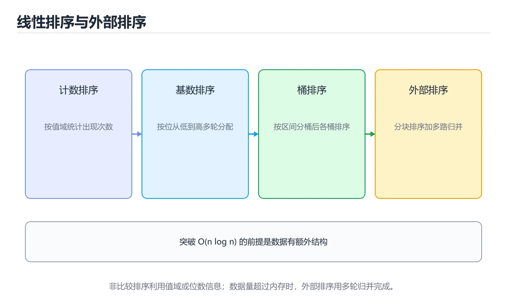
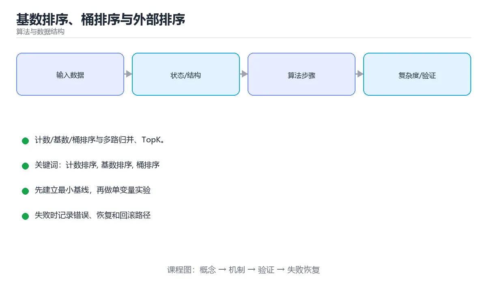

# 基数排序、桶排序与外部排序

> 内容更新时间：2026-10-06 · 学习阶段：进阶 · 预计用时：30 分钟





## 学习目标

- 能用自己的话解释基数排序、桶排序与外部排序解决了什么问题，而不是只背术语。
- 能说清 「计数排序」、「基数排序」、「桶排序」、「外部排序」 之间的关系，并分别举出一个例子。
- 能把 计数排序 放回「基数排序、桶排序与外部排序」的知识体系，说明它和 基数排序 的边界。
- 能完成本课练习，并用验收标准检查自己的结果。

> 一句话摘要：计数/基数/桶排序与多路归并、TopK。

## 前置知识

- 先完成上一课《网络流与二分图匹配》；如果已经掌握，可以直接用本课练习自测。
- 开始前先复习：计数排序、基数排序、桶排序。
- 卡在 计数排序 上时不要跳过：把输入、预期和实际输出写成三行，再回头读正文。

## 突破 O(n log n) 的前提

比较排序的下界是 O(n log n)，非比较排序更快是因为利用了数据的额外信息（值域或分布）。

| 算法 | 复杂度 | 适用 |
| --- | --- | --- |
| 计数排序 | O(n + k) | 值域小的整数 |
| 基数排序 | O(d × (n + k)) | 定长整数、字符串 |
| 桶排序 | 平均 O(n) | 数据均匀分布 |

## 关键点

计数排序统计每个值的出现次数再按序输出，空间 O(k)。基数排序按位从低位到高位反复处理，**每一位必须用稳定排序**，否则低位结果会被破坏；MSD（高位优先）适合字符串与并行实现。桶排序按区间分桶后桶内排序，分布不均时会退化。

## 外部排序

数据大于内存时必须分治到外存：分段读入内存排序写出顺串，再用**多路归并**（最小堆选最小值）反复合并。优化点包括置换选择（加长顺串）、增加归并路数（减少磁盘往返）、缓冲区与异步 IO。

## 海量数据实战

| 问题 | 方案 |
| --- | --- |
| TopK | 小顶堆 O(n log k)，或分治后归并 |
| 去重 | 哈希分桶 + 位图或布隆过滤器 |
| 大文件 Join | 按连接键哈希分桶后桶内连接 |
| 中位数 | 外部排序，或直方图近似 |

核心思路都是**分治 + 外存**：把内存装不下的问题切成能装下的块，再合并结果。

## 本课小结

非比较排序靠数据分布换速度，外部排序靠分治与多路归并突破内存限制；先想清楚数据分布与内存上限，再选算法。

## 非比较排序对照

| 算法 | 复杂度 | 空间 | 稳定 | 适用 |
| --- | --- | --- | --- | --- |
| 计数排序 | O(n+k) | O(n+k) | 是 | 整数、范围小（k 与 n 同量级） |
| 桶排序 | 平均 O(n+k) | O(n+k) | 取决于桶内排序 | 数据均匀分布 |
| 基数排序 LSD | O(d(n+k)) | O(n+k) | 是 | 定长整数、字符串 |
| 基数排序 MSD | O(d(n+k)) | O(n+k) | 是 | 字符串字典序 |

## 模板

```python
def counting_sort(nums, max_value=None):
    """计数排序：适用于整数且值域不大。"""
    if not nums:
        return []
    top = max_value if max_value is not None else max(nums)
    counts = [0] * (top + 1)
    for value in nums:
        counts[value] += 1
    for i in range(1, len(counts)):        # 前缀和，得到每个值的结束位置
        counts[i] += counts[i - 1]
    result = [0] * len(nums)
    for value in reversed(nums):           # 逆序保证稳定性
        counts[value] -= 1
        result[counts[value]] = value
    return result

def radix_sort(nums):
    """LSD 基数排序：按位从低到高，每位必须是稳定排序。"""
    if not nums:
        return []
    arr = nums[:]
    exp = 1
    top = max(arr)
    while top // exp > 0:
        buckets = [[] for _ in range(10)]
        for value in arr:
            buckets[(value // exp) % 10].append(value)
        arr = [value for bucket in buckets for value in bucket]
        exp *= 10
    return arr

def external_sort_chunks(records, chunk_size):
    """外部排序第一步：分块排序后写临时文件（示意）。"""
    chunks = []
    for start in range(0, len(records), chunk_size):
        chunk = sorted(records[start:start + chunk_size])
        chunks.append(chunk)               # 实际实现应写入磁盘
    return chunks                          # 第二步：用最小堆做多路归并

import heapq

def k_way_merge(chunks):
    """多路归并：最小堆维护每路当前最小值。"""
    heap = []
    for index, chunk in enumerate(chunks):
        if chunk:
            heapq.heappush(heap, (chunk[0], index, 0))
    result = []
    while heap:
        value, chunk_index, offset = heapq.heappop(heap)
        result.append(value)
        nxt = offset + 1
        chunk = chunks[chunk_index]
        if nxt < len(chunk):
            heapq.heappush(heap, (chunk[nxt], chunk_index, nxt))
    return result
```

## 常见错误与排查

| 容易写错的做法 | 实际现象 | 原因与正确做法 |
| --- | --- | --- |
| 计数排序用于值域极大的数据 | 数组开不下 | 值域 k 必须与 n 同量级 |
| 直接排序负数 | 下标为负越界 | 先求最小值并整体平移 |
| 计数排序不逆序写回 | 失去稳定性 | 逆序遍历原数组 |
| 基数排序某位用不稳定排序 | 结果错乱 | 每位必须稳定（常用计数排序） |
| 基数排序处理负数 | 分组错误 | 分离符号或用偏移 |
| 桶排序数据分布不均匀 | 退化成 O(n²) | 数据需近似均匀，或桶内换更好算法 |
| 外部排序一次读入全量 | 内存溢出 | 分块排序 + 多路归并 |
| 多路归并每轮扫所有路 | 复杂度升高 | 用最小堆取当前最小 |
| 认为非比较排序通用 | 只能用于整数或可分解的键 | 需要比较语义时仍用比较排序 |
| 忽略稳定性需求 | 结果顺序不符合业务预期 | 明确是否需要稳定 |

## 复习与自测

- [ ] 能说出计数/桶/基数排序的适用条件。
- [ ] 计数排序用前缀和确定位置并逆序写回。
- [ ] 基数排序每位使用稳定排序。
- [ ] 外部排序 = 分块排序 + 多路归并。
- [ ] 能用最小堆实现 k 路归并。

## 动手练习

> 本课练习重点：围绕「计数排序、基数排序、桶排序」完成复述、实验和交付，每个结果都要能被别人检查。

用 8 个元素手动走一遍 external_sort_chunks，把每一步代价与代码里的计数对齐。

### 练习 1：建立心智模型（10 分钟）

合上教程，用 3～5 句话回答：

1. 基数排序、桶排序与外部排序解决了什么问题？
2. 如果没有它，会出现什么具体后果？
3. 它和「基数排序」是什么关系？

验收标准：回答里必须出现 计数排序，并写出一个让结论失效的边界条件。

### 练习 2：做一次可控实验（20 分钟）

从正文中选一个最小示例，完成以下操作：

1. 先预测修改一个参数、输入或步骤后的结果。
2. 再实际执行或逐步推演，记录真实结果。
3. 如果结果与预测不同，写出差异原因。

**验收标准**：用 external_sort_chunks 复现原例后，把基数排序改成边界值，五步记录缺一不可，其中「原因」一栏要写明「基数排序、桶排序与外部排序」里哪条规则被触发。

### 练习 3：交付一个小结果（30 分钟）

手工构造一组数据，逐步记录 基数排序 的状态与代价。

任务要求：

- 结果必须能被别人检查，不能只写“我已经理解了”。
- 至少覆盖「计数排序」和「基数排序」两个关键词。
- 写出 1 个仍然不确定的问题，以及下一步如何验证。

> 提示：时间有限时优先做练习 1 和练习 2；练习 3 可以拆成两次完成。

## 深入补充：基数排序、桶排序与外部排序

前面已经建立了基本概念。这一节换一个角度，把基数排序、桶排序与外部排序放进真实工程里，
重点回答三件事：external_sort_chunks 解决什么问题、依赖哪些前提、在什么条件下失效。

### 一、核心模型

基数排序、桶排序和外部排序跳出比较排序的 O(n log n) 下界：前两者利用键的分布做分配，外部排序则把大数据拆块、排序、归并，降低磁盘 I/O。

```text
分析键分布 → 选择桶或基数 → 分配到桶位 → 桶内排序/逐位处理 → 归并结果 → 外部场景分块落盘并多路归并
```

### 二、关键机制拆解

1. 基数排序按位从低位到高位稳定排序，最终结果有序；位数和基数决定时间与空间。
2. 桶排序假设数据近似均匀分布，桶内可用插入排序，分布极端时会退化成 O(n²)。
3. 计数排序适合小范围整数，用计数数组直接确定位置，时间 O(n+k)。
4. 外部排序先用可用内存把数据分成多个有序块写盘，再做多路归并。
5. 多路归并用最小堆选择当前最小块，I/O 次数与块数和归并路数相关。
6. 稳定性在基数排序和多关键字排序中至关重要，不稳定实现会破坏前一轮顺序。
7. 分布式排序通过范围分区或采样划分，让每个节点负责一段有序区间。

### 三、对照表：抓住容易混淆的边界

| 维度 | 一侧 | 另一侧 |
| --- | --- | --- |
| 比较排序 | 通过元素比较确定顺序 | 下界 O(n log n) |
| 计数排序 | 用值域计数直接定位 | 适合小范围整数 |
| 桶排序 | 按区间分桶后桶内排序 | 依赖均匀分布 |
| 外部排序 | 分块排序后多路归并 | 处理内存放不下的数据 |

### 四、工作示例

对 10 亿条手机号排序，内存无法一次容纳。先按号段范围分成多个文件，每个文件在内存排序后写回，再用 16 路归并生成最终有序文件；整个过程以顺序 I/O 为主。

### 五、常见误区与失效边界

| 错误做法或假设 | 后果 | 正确做法 |
| --- | --- | --- |
| 基数排序不稳定 | 高位排序破坏低位结果 | 使用稳定计数排序实现每一位 |
| 桶数量拍脑袋 | 桶过大或过多 | 根据数据量和分布选择桶数 |
| 外部归并路数过多 | 同时打开文件过多 | 控制归并路数并复用缓冲区 |
| 分区严重倾斜 | 单节点处理大部分数据 | 采样确定边界并使用范围分区 |

### 六、场景推演

日志按时间排序但数据横跨多天，单机内存不足。正确方案是按天或小时分块，块内排序，再按时间多路归并；同时压缩中间文件，减少磁盘 I/O。

### 七、自测问答

**Q1：基数排序为什么能做到线性时间？**

它不靠比较，而是按位分配和收集，复杂度与位数和基数相关。

**Q2：桶排序最怕什么数据分布？**

极端不均匀，所有元素落入同一个桶。

**Q3：外部排序的核心代价是什么？**

磁盘 I/O 次数和归并过程中的缓冲区管理。

**Q4：多关键字排序为什么要求稳定？**

后一次排序不会打乱前一次排序确定的顺序。

### 八、小项目：把知识变成可检查的产出

生成 1000 万条随机整数，分别用内存排序、桶排序和外部多路归并排序处理；统计耗时、内存峰值、临时文件大小和 I/O 次数。

### 九、适用边界

非比较排序依赖键的范围和分布，通用性不如比较排序。选择算法前必须了解数据规模、值域、分布、稳定性和内存限制。

### 十、完成检查清单

- [ ] 能解释计数、桶和基数排序
- [ ] 能判断稳定性要求
- [ ] 能设计外部排序流程
- [ ] 能控制多路归并的资源
- [ ] 能处理分布式排序倾斜

### 十一、复习顺序

1. 不看资料讲清「基数排序、桶排序与外部排序」的核心模型，并各举一个正例和反例。
2. 再对照表逐行解释容易混淆的概念，每个概念补一个反例。
3. 跟着工作示例做一遍，改变一个条件并预测结果。
4. 用自测问答检查理解，错题回到对应小节重新阅读。
5. 最后完成 计数排序 的小项目，把结果、失败记录和复查清单整理成可提交产物。

> 复习不是重读一遍，而是离开原文重新产出：复述、改写、验证、复盘。

## 可运行练习

### 任务 1：先跑通，再解释

```python
def counting_sort(nums, max_value=None):
    """计数排序：适用于整数且值域不大。"""
    if not nums:
        return []
    top = max_value if max_value is not None else max(nums)
    counts = [0] * (top + 1)
    for value in nums:
        counts[value] += 1
    for i in range(1, len(counts)):        # 前缀和，得到每个值的结束位置
        counts[i] += counts[i - 1]
    result = [0] * len(nums)
    for value in reversed(nums):           # 逆序保证稳定性
        counts[value] -= 1
        result[counts[value]] = value
    return result

def radix_sort(nums):
    """LSD 基数排序：按位从低到高，每位必须是稳定排序。"""
    if not nums:
        return []
    arr = nums[:]
    exp = 1
    top = max(arr)
    while top // exp > 0:
        buckets = [[] for _ in range(10)]
        for value in arr:
            buckets[(value // exp) % 10].append(value)
        arr = [value for bucket in buckets for value in bucket]
        exp *= 10
    return arr

def external_sort_chunks(records, chunk_size):
    """外部排序第一步：分块排序后写临时文件（示意）。"""
    chunks = []
    for start in range(0, len(records), chunk_size):
        chunk = sorted(records[start:start + chunk_size])
        chunks.append(chunk)               # 实际实现应写入磁盘
    return chunks                          # 第二步：用最小堆做多路归并

import heapq

def k_way_merge(chunks):
    """多路归并：最小堆维护每路当前最小值。"""
    heap = []
    for index, chunk in enumerate(chunks):
        if chunk:
            heapq.heappush(heap, (chunk[0], index, 0))
    result = []
    while heap:
        value, chunk_index, offset = heapq.heappop(heap)
        result.append(value)
        nxt = offset + 1
        chunk = chunks[chunk_index]
        if nxt < len(chunk):
            heapq.heappush(heap, (chunk[nxt], chunk_index, nxt))
    return result
```

### 任务 2：只改一个条件

把「基数排序、桶排序与外部排序」的最小示例复制一份，只改一个条件再跑一次：

- 改动点：把 基数排序 换成边界值，其他输入保持原样。
- 预测：先写下「基数排序、桶排序与外部排序」在改动后的输出或错误信息，再运行。
- 记录：对照改动前后的结果，指出差异出在哪一步。
- 验收：换回原条件能复现原结果，改动只影响计数排序。

### 任务 3：迁移到自己的数据

把 external_sort_chunks 换成你自己的输入，先保持步骤不变，再比较输出差异。

## 故障现场

### 现场 1：直接排序负数

**症状**：在《基数排序、桶排序与外部排序》的复现场景中，下标为负越界。

**根因**：“下标为负越界”只是表层结果。向上追溯会落到“直接排序负数”这一步，因为它省略了《基数排序、桶排序与外部排序》的约束，使实现行为和预期模型发生了偏离。

**修复**：针对《基数排序、桶排序与外部排序》的问题，先求最小值并整体平移。

**验证**：在《基数排序、桶排序与外部排序》中按“先求最小值并整体平移”调整后，从“直接排序负数”的触发条件重放同一条路径，确认“下标为负越界”不再出现，并补一个相邻边界用例检查没有引入新问题。

### 现场 2：桶排序数据分布不均匀

**症状**：在《基数排序、桶排序与外部排序》的复现场景中，退化成 O(n²)。

**根因**：触发点是把“桶排序数据分布不均匀”当成安全做法。它没有满足《基数排序、桶排序与外部排序》要求的前提，因此先表现为“退化成 O(n²)”；排查时先完整复现这一段，再核对输入、配置与依赖。

**修复**：针对《基数排序、桶排序与外部排序》的问题，数据需近似均匀，或桶内换更好算法。

**验证**：先在《基数排序、桶排序与外部排序》中记录“桶排序数据分布不均匀”留下的失败证据，再执行“数据需近似均匀，或桶内换更好算法”并重放；确认错误路径变为明确结果，且修复没有掩盖同类故障。

### 现场 3：认为非比较排序通用

**症状**：在《基数排序、桶排序与外部排序》的复现场景中，只能用于整数或可分解的键。

**根因**：“只能用于整数或可分解的键”只是表层结果。向上追溯会落到“认为非比较排序通用”这一步，因为它省略了《基数排序、桶排序与外部排序》的约束，使实现行为和预期模型发生了偏离。

**修复**：针对《基数排序、桶排序与外部排序》的问题，需要比较语义时仍用比较排序。

**验证**：保留《基数排序、桶排序与外部排序》里触发“只能用于整数或可分解的键”的输入、版本和日志，按“需要比较语义时仍用比较排序”完成修改后原样重放；只有失败现象消失且相邻场景仍可解释，才保留改动。

## 本课复习清单

离开本课前，逐项确认：

- [ ] 不看解析，能说出「基数排序每一位必须使用什么排序？」的判断依据。
- [ ] 不看解析，能说出「计数排序最适合什么数据？」的判断依据。
- [ ] 不看解析，能说出「外部排序的核心步骤是？」的判断依据。
- [ ] 不看解析，能说出「基数排序的时间复杂度与什么有关？」的判断依据。
- [ ] 不看解析，能说出「外部排序中「置换选择」的作用是？」的判断依据。
- [ ] 跑通「基数排序、桶排序与外部排序」的最小示例，并记录一次失败输入的处理方式。
- [ ] 把本课最容易混淆的两个概念写成一句话对照。

| 复盘项 | 记录 |
| --- | --- |
| 已经能独立解释的考点 |  |
| 仍然说不清的概念 |  |
| 下一步验证动作 |  |

## 术语速查

| 术语 | 一句话说明 |
| --- | --- |
| `计数排序` | 用值域计数确定元素位置的非比较排序，适合范围较小的整数。 |
| `基数排序` | 基数排序、桶排序和外部排序跳出比较排序的 O(n log n) 下界：前两者利用键的分布做分配，外部排序则把大数据拆块、排序、归并，降低磁盘 I/O。 |
| `桶排序` | 把元素分到多个桶内分别排序，再按桶顺序合并。 |
| `外部排序` | 数据大于内存时必须分治到外存：分段读入内存排序写出顺串，再用多路归并（最小堆选最小值）反复合并。优化点包括置换选择（加长顺串）、增加归并路数（减少磁盘往返）、缓冲区与异步 IO。 |
| `TopK` | 从大量候选中找出最大或最小的 k 个元素，常用堆或快速选择实现。 |

## 考点精讲

### 考点 1：概念判断·计数排序

- **题目**：基数排序每一位必须使用什么排序？
- **判断依据**：只有稳定排序才能保留低位已排好的相对顺序。其他选项：基数排序按位处理，每一位必须稳定，否则之前几位的排序结果会被破坏。「基数排序、桶排序与外部排序」要求先交代计数排序、基数排序、桶排序的前提再下结论，所以“稳定排序”只在题干“基数排序每一位必须使用什么排序”给定的条件下成立。把“稳定排序”代回「基数排序、桶排序与外部排序」里“基数排序每一位必须使用什么排序”的例子核对，条件一旦改变，结论就要用计数排序、基数排序、桶排序重新推导。

### 考点 2：概念判断·计数排序

- **题目**：计数排序最适合什么数据？
- **判断依据**：复杂度 O(n+k)，k 为值域大小，值域过大不划算。作答时，先用计数排序建立输入与输出的基线，再把值域较小的整数代入边界条件核对，结论才能复现。回到「基数排序、桶排序与外部排序」的正文示例，用“计数排序最适合什么数据”走一遍计数排序、基数排序、桶排序的完整流程，能复现的结论才可以保留。

### 考点 3：顺序排列·计数排序

- **题目**：按“基数排序、桶排序与外部排序”中 计数排序、基数排序、桶排序 的实践顺序，把四个步骤排成从准备到复盘的合理顺序。
- **判断依据**：在「基数排序、桶排序与外部排序」里，在本课的练习里，顺序应当是：先明确 计数排序 的输入、输出与约束 → 写出最小示例并核对 基数排序 的基线结果 → 只改一个变量，记录边界与失败路径的变化 → 固定版本与证据，把本课的结论写成可复现记录。这个顺序把 计数排序 的输入、输出和约束放在最前面，在基数排序、桶排序与外部排序里避免概念没对齐就开始调参。第二步用 基数排序 建立可核对的基线，在基数排序、桶排序与外部排序里第三步才允许改变一个变量并观察失败路径。

### 考点 4：代码阅读·计数排序

- **题目**：阅读计数排序实现，下面哪项判断是正确的？
- **正确判断**：逆序回填是为了保持稳定性，相同值的元素仍按原始先后顺序排列
- **判断依据**：正确判断是逆序回填是为了保持稳定性，相同值的元素仍按原始先后顺序排列。计数排序不做元素比较，时间复杂度是 O(n + k)，k 为值域大小，因此只适合值域不大的整数；前缀和给出每个值的结束位置，逆序回填时后出现的相同值先落到更靠后的位置，稳定性由此成立。值域远大于元素个数或元素不是整数时，应改用基数排序、外部排序或基于比较的排序。

### 考点 5：概念判断·置换选择

- **题目**：外部排序中「置换选择」的作用是？
- **判断依据**：配合多路归并与败者树，可以把几趟归并压缩到一两趟。在「基数排序、桶排序与外部排序」里，其他选项：置换选择能生成更长的初始归并段，从而减少归并趟数与磁盘读写量。“外部排序中置换选择的作用是”与「基数排序、桶排序与外部排序」的术语表相呼应，只有符合计数排序、基数排序、桶排序约束的“生成更长的初始归并段”才是正文支持的结论。

### 考点 6：多选辨析·计数排序

- **题目**：以下哪些术语与「基数排序、桶排序与外部排序」直接相关？（多选）
- **判断依据**：基数排序是否完整覆盖题干的输入、输出和失败路径，并排除计数排序、OAuth这类相邻概念。在「基数排序、桶排序与外部排序」里判断这道题，要把计数排序、基数排序、桶排序的条件、过程与失败路径逐项对齐，换成“以下哪些术语与基数排序、桶排序与外部”这个场景，只有满足前提的结论才成立。“以下哪些术语与基数排序”与「基数排序、桶排序与外部排序」的术语表相呼应，只有符合计数排序、基数排序、桶排序约束的“计数排序”才是正文支持的结论。

## English Overview

**Title:** Non-comparison & External Sorts

**Summary:** Counting/radix/bucket sort and external merge.

**Category:** Algorithms
**Level:** 高级
**Key terms:** 计数排序, 基数排序, 桶排序, 外部排序, TopK

## 内容元数据

- 内容版本：v2.0
- 最后更新：2026-10-06
- 学习阶段：进阶
- 适用环境：任意主流语言（伪代码与复杂度为主）；本课聚焦 计数排序。
- 内容来源：内置结构化课程与工程实践整理
- 相关主题：计数排序、基数排序、桶排序、外部排序、TopK
- 质量版本：P0 测验标准 + P1 覆盖扩展 + P2 体验补全

## 参考资料与复核

- 最后复核：2026-10-04
- 下次复核：2027-09-10
- 复核范围：版本兼容、API 行为、安全建议与工程实践
- 来源性质：官方文档、标准或权威教材；正文为离线教学重组

| 参考资料 | 本课用途 |
| --- | --- |
| [CP-Algorithms](https://cp-algorithms.com/) | 算法实现与复杂度 |
| [Princeton Algorithms](https://algs4.cs.princeton.edu/home/) | 经典算法与数据结构教材 |
| [Big-O Cheat Sheet](https://www.bigocheatsheet.com/) | 复杂度速查 |

> 「基数排序、桶排序与外部排序」的链接用于离线阅读后的延伸核对；App 不会自动联网。
