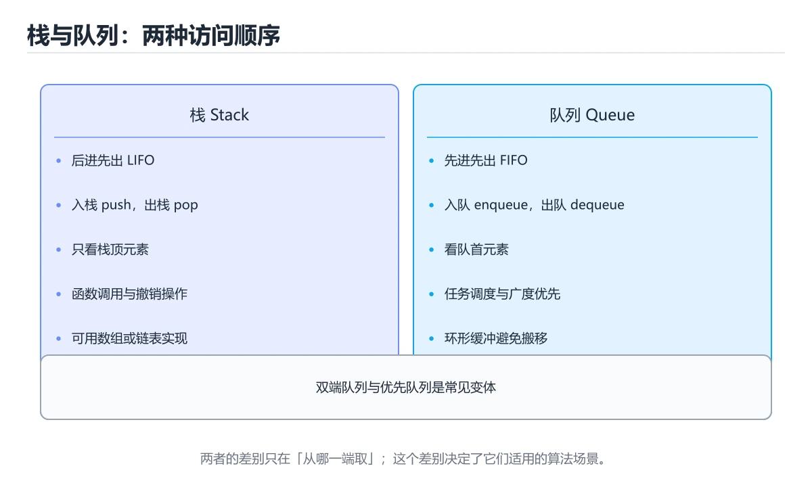

# 栈与队列




> 内容更新时间：2026-10-03 · 学习阶段：基础 · 预计用时：13 分钟

## 学习目标

- 能用自己的话解释栈与队列解决了什么问题，而不是只背术语。
- 能说清 「栈」、「队列」、「deque」、「BFS」 之间的关系，并分别举出一个例子。
- 能把本课知识放回「算法与数据结构」的知识体系，说明它和相邻主题的边界。
- 能完成本课练习，并用验收标准检查自己的结果。

> 一句话摘要：LIFO 与 FIFO、括号匹配、BFS/DFS 与优先队列。

## 前置知识

- 先完成上一课《哈希表》；如果已经掌握，可以直接用本课练习自测。
- 本课阶段：基础。建议会读写简单代码或命令，并理解变量、输入输出等基本概念。
- 开始前先复习：栈、队列、deque。
- 如果某一步看不懂，先记录具体卡点，完成练习后再回头读一遍。

## 栈：后进先出（LIFO）

```text
push(1) push(2) push(3)   ->  栈顶 [3, 2, 1] 栈底
pop() -> 3
```

```python
stack = []
stack.append(1)      # 入栈
stack.append(2)
top = stack[-1]      # 查看栈顶
value = stack.pop()  # 出栈：2
is_empty = not stack
```

栈的典型应用：函数调用栈、括号匹配、表达式求值、撤销操作、深度优先搜索（DFS）。

```python
def is_valid_brackets(text):
    pairs = {")": "(", "]": "[", "}": "{"}
    stack = []
    for ch in text:
        if ch in "([{":
            stack.append(ch)
        elif ch in pairs:
            if not stack or stack.pop() != pairs[ch]:
                return False
    return not stack
```

## 队列：先进先出（FIFO）

```text
enqueue(1) enqueue(2) enqueue(3)  ->  队首 [1, 2, 3] 队尾
dequeue() -> 1
```

```python
from collections import deque

queue = deque()
queue.append("a")        # 入队
queue.append("b")
first = queue.popleft()  # 出队：a
```

不要用 `list.pop(0)` 实现队列：每次都要搬移元素，复杂度 `O(n)`；`deque` 的两端操作都是 `O(1)`。

队列的典型应用：任务调度、消息队列、广度优先搜索（BFS）、缓冲区。

## 变体

| 结构 | 规则 | 场景 |
| --- | --- | --- |
| 双端队列 deque | 两端都可进出 | 滑动窗口最大值 |
| 优先队列 / 堆 | 每次取最大/最小 | 任务优先级、TopK |
| 循环队列 | 固定数组首尾相连 | 嵌入式、Ring Buffer |

```python
import heapq

heap = [3, 1, 2]
heapq.heapify(heap)
heapq.heappush(heap, 0)
print(heapq.heappop(heap))   # 0
```

## 本课小结
栈解决「最近相关」问题，队列解决「按顺序公平」问题；BFS 用队列、DFS 用栈（或递归），优先队列用堆实现。

## 应用场景速查

| 结构 | 特性 | 典型应用 |
| --- | --- | --- |
| 栈 | 后进先出 | 括号匹配、表达式求值、DFS、撤销、调用栈 |
| 队列 | 先进先出 | BFS、任务调度、缓冲区 |
| 双端队列 | 两端 O(1) | 单调队列、滑动窗口最大值 |
| 优先队列 / 堆 | 按优先级出队 | TopK、任务优先级、Dijkstra |
| 循环队列 | 固定空间复用 | 环形缓冲区、生产者消费者 |

```python
from collections import deque

# 括号匹配：栈的经典用法
def is_balanced(text: str) -> bool:
    pairs = {")": "(", "]": "[", "}": "{"}
    stack = []
    for ch in text:
        if ch in "([{":
            stack.append(ch)
        elif ch in pairs:
            if not stack or stack.pop() != pairs[ch]:
                return False
    return not stack

# 队列用 deque，两端都是 O(1)
def bfs(graph, start):
    queue = deque([start])
    visited = {start}
    order = []
    while queue:
        node = queue.popleft()       # 不要用 list.pop(0)
        order.append(node)
        for nxt in graph.get(node, []):
            if nxt not in visited:
                visited.add(nxt)
                queue.append(nxt)
    return order
```

## 实现方式对照

| 实现 | 栈 | 队列 |
| --- | --- | --- |
| 动态数组 | `append` / `pop()` 都 O(1) | `pop(0)` 是 O(n)，不可取 |
| 链表 | 头插头取 O(1) | 头取尾插 O(1) |
| `collections.deque` | 两端 O(1) | 两端 O(1)，首选 |
| 固定数组（环形） | 需管理下标 | 空间固定，适合流式数据 |
| 两个栈 | 可实现 | 入队 O(1)，出队均摊 O(1) |

## 常见错误对照表

| 容易写错的做法 | 实际现象 | 原因与正确做法 |
| --- | --- | --- |
| 用 `list.pop(0)` 当队列 | 数据量大时极慢 | 用 `deque.popleft()` |
| 空栈上 `pop()` | `IndexError` | 先判空或捕获异常 |
| 括号匹配只看开括号计数 | 会把 `([)]` 判为合法 | 必须检查类型匹配 |
| 入队与出队混用同一端 | 变成栈 | 明确 FIFO 语义 |
| 循环队列不判空与满 | 覆盖数据 | 用 `size` 计数或留一个空位区分 |
| BFS 忘记标记已访问 | 死循环或重复入队 | 入队时立刻标记 |
| DFS 递归深度过大 | 栈溢出 | 改用显式栈 |
| 优先队列用排序列表实现 | 每次插入 O(n) | 用堆（`heapq` / `PriorityQueue`） |
| `heapq` 存自定义对象 | 无法比较报错 | 存元组 `(priority, counter, item)` |
| 多线程共享队列用普通列表 | 竞态 | 用 `queue.Queue` 或加锁 |

## 自测清单

- [ ] 能用栈解决括号匹配与逆序问题。
- [ ] 队列一律用 `deque`，不用 `list.pop(0)`。
- [ ] BFS 入队即标记已访问。
- [ ] 需要优先级时使用堆而不是排序列表。
- [ ] 知道循环队列如何区分空与满。

## 动手练习

> 本课练习重点：围绕「栈、队列、deque」完成复述、实验和交付，每个结果都要能被别人检查。

先手算 8 个元素的状态变化，再实现并统计操作次数与复杂度。

### 练习 1：建立心智模型（10 分钟）

合上教程，用 3～5 句话回答：

1. 栈与队列解决了什么问题？
2. 如果没有它，会出现什么具体后果？
3. 它和「队列」是什么关系？

**验收标准**：至少出现一个本课关键词，并写出一个反例、边界条件或失效场景。

### 练习 2：做一次可控实验（20 分钟）

从正文中选一个最小示例，完成以下操作：

1. 先预测修改一个参数、输入或步骤后的结果。
2. 再实际执行或逐步推演，记录真实结果。
3. 如果结果与预测不同，写出差异原因。

**验收标准**：留下「原例 → 改动 → 预测 → 结果 → 原因」五步记录。

### 练习 3：交付一个小结果（30 分钟）

给定 8～12 个手工构造的数据，写出每一步状态，并统计比较或交换次数。

任务要求：

- 结果必须能被别人检查，不能只写“我已经理解了”。
- 至少覆盖「栈」和「队列」两个关键词。
- 写出 1 个仍然不确定的问题，以及下一步如何验证。

> 提示：时间有限时优先做练习 1 和练习 2；练习 3 可以拆成两次完成。

## 深入补充：栈与队列

前面已经建立了基本概念。这一节换一个角度，把栈与队列放进真实工程里，
重点回答三件事：它为什么存在、内部如何运转、什么时候会失效。

### 一、核心模型

栈是后进先出，队列是先进先出；它们既是基础数据结构，也是函数调用、表达式求值、任务调度、广度优先搜索和消息缓冲的核心模型。

```text
元素入栈/入队 → 状态变化 → 出栈/出队 → 返回最新或最早元素 → 处理边界与容量
```

### 二、关键机制拆解

1. 栈只允许在一端插入和删除，支持 push、pop、peek，操作复杂度通常为 O(1)。
2. 队列在尾部入队、头部出队，数组实现要注意循环复用空间，链表实现要注意节点释放。
3. 双端队列允许两端插入删除，可同时实现栈和队列。
4. 单调栈用于寻找下一个更大/更小元素，单调队列用于滑动窗口最值。
5. 表达式求值用栈处理运算符优先级，括号匹配用栈检查嵌套结构。
6. BFS 使用队列按层扩展，DFS 使用栈或递归探索纵深。
7. 并发队列必须明确阻塞、超时、容量和关闭语义，否则会产生生产者消费者问题。

### 三、对照表：抓住容易混淆的边界

| 维度 | 一侧 | 另一侧 |
| --- | --- | --- |
| 栈 | 后进先出 | 适合递归、回溯和表达式 |
| 队列 | 先进先出 | 适合调度、BFS 和缓冲 |
| 循环队列 | 复用数组空间 | 需要区分空和满 |
| 优先队列 | 按优先级出队 | 通常用堆实现 |

### 四、工作示例

判断括号是否匹配：遇到左括号入栈，遇到右括号时检查栈顶是否匹配并弹出；遍历结束后栈为空才合法。若用队列，就无法正确处理最近未闭合的左括号。

### 五、常见误区与失效边界

| 错误做法或假设 | 后果 | 正确做法 |
| --- | --- | --- |
| 栈空时继续弹出 | 空指针或异常 | 先检查容量和空状态 |
| 循环队列无法区分空满 | 覆盖未消费数据 | 使用计数或保留一个空位 |
| 用数组头部删除实现队列 | 每次 O(n) 搬移 | 使用循环数组或链表 |
| 并发队列关闭后继续写入 | 数据丢失或异常 | 定义关闭、排空和拒绝语义 |

### 六、场景推演

任务调度器使用无界队列，生产速度大于消费速度，内存持续上涨。修复方案是设置容量和背压策略：队列满时阻塞、丢弃低优先级任务或返回明确错误，并监控队列长度。

### 七、自测问答

**Q1：为什么括号匹配适合用栈？**

右括号需要匹配最近的未闭合左括号，符合后进先出。

**Q2：BFS 为什么用队列？**

它按发现顺序逐层扩展，先进先出保证层序正确。

**Q3：循环队列如何区分空和满？**

可以维护元素计数，或保留一个空位并单独判断。

**Q4：无界队列的风险是什么？**

生产快于消费时会耗尽内存并推高延迟。

### 八、小项目：把知识变成可检查的产出

实现栈、循环队列和优先队列三种结构，并分别解决括号匹配、BFS 最短路径和任务优先级调度三个小问题；补齐空结构、满结构和重复元素测试。

### 九、适用边界

栈和队列提供访问顺序，不解决容量和并发本身。真实系统还要考虑背压、持久化、优先级、公平性和故障恢复。

### 十、完成检查清单

- [ ] 能手写栈和循环队列
- [ ] 能分析各操作复杂度
- [ ] 能用栈解决表达式和括号问题
- [ ] 能用队列实现 BFS
- [ ] 能说明并发队列的关闭与背压语义

### 十一、复习顺序

1. 先不看资料复述“核心模型”，确认能说出它解决的三个问题。
2. 再对照表逐行解释容易混淆的概念，每个概念补一个反例。
3. 跟着工作示例做一遍，改变一个条件并预测结果。
4. 用自测问答检查理解，错题回到对应小节重新阅读。
5. 最后完成小项目，把结果、失败记录和复查清单整理成一份可提交产物。

> 复习不是重读一遍，而是离开原文重新产出：复述、改写、验证、复盘。

## 可运行练习

### 任务 1：先跑通，再解释

```python
import heapq

heap = [3, 1, 2]
heapq.heapify(heap)
heapq.heappush(heap, 0)
print(heapq.heappop(heap))   # 0
```

### 任务 2：只改一个条件

把「栈与队列」的最小示例复制一份，只改一个条件再跑一次：

- 改动点：只把栈的输入换成空值、极值或错误输入，其余保持不变。
- 预测：先写下「栈与队列」在改动后的输出或错误信息，再运行。
- 记录：对照改动前后的结果，指出差异出在哪一步。
- 验收：换回原条件能复现原结果，改动只影响栈。

### 任务 3：迁移到自己的数据

用同一套思路处理一组你自己的数据或场景，保持输出格式与任务 1 一致。

## 故障现场

### 现场 1：本课的 栈 常规用例通过，但边界用例失败

**症状**：在本课的练习或生产场景里出现“本课的 栈 常规用例通过，但边界用例失败”。

**复现**：准备一组最小输入，只保留触发“本课的 栈 常规用例通过，但边界用例失败”的必要条件，连续运行两次确认结果稳定。

**定位**：围绕“栈 的前置条件与取值边界没有写进代码，默认值掩盖了空值和极值”检查调用链、输入数据和环境配置，先验证假设再改代码。

**预防**：把“本课的 栈 常规用例通过，但边界用例失败”写成一条自动化用例，并在本课的验收清单里保留对应检查项。

### 现场 2：本课的 队列 结果在两次运行之间不一致

**症状**：在本课的练习或生产场景里出现“本课的 队列 结果在两次运行之间不一致”。

**复现**：准备一组最小输入，只保留触发“本课的 队列 结果在两次运行之间不一致”的必要条件，连续运行两次确认结果稳定。

**定位**：围绕“队列 依赖了当前版本、执行顺序或共享状态，单次运行无法暴露差异”检查调用链、输入数据和环境配置，先验证假设再改代码。

**预防**：把“本课的 队列 结果在两次运行之间不一致”写成一条自动化用例，并在本课的验收清单里保留对应检查项。

### 现场 3：小数据规模结果正确，扩大输入后超时或内存溢出

**定位**：围绕“栈 的时间或空间复杂度在边界条件下失控，队列 的常数开销也被低估”检查调用链、输入数据和环境配置，先验证假设再改代码。

## 本课复习清单

离开本课前，逐项确认：

- [ ] 不看解析，能说出「栈的特点是？」的判断依据。
- [ ] 不看解析，能说出「广度优先搜索（BFS）通常借助什么实现？」的判断依据。
- [ ] 不看解析，能说出「为什么不要用 list.pop(0) 实现队列？」的判断依据。
- [ ] 不看解析，能说出「用两个栈实现队列，出队操作的均摊复杂度是？」的判断依据。
- [ ] 不看解析，能说出「双端队列（deque）相比普通队列多了什么能力？」的判断依据。
- [ ] 至少运行一次本课示例，记录输入、输出和一个边界情况。
- [ ] 把本课最容易混淆的两个概念写成一句话对照。

| 复盘项 | 记录 |
| --- | --- |
| 已经能独立解释的考点 |  |
| 仍然说不清的概念 |  |
| 下一步验证动作 |  |

## 术语速查

| 术语 | 本课语境 |
| --- | --- |
| `list.pop(0)` | 不要用 `list.pop(0)` 实现队列：每次都要搬移元素，复杂度 `O(n)`；`deque` 的两端操作都是 `O(1)`。 |
| `O(n)` | 不要用 `list.pop(0)` 实现队列：每次都要搬移元素，复杂度 `O(n)`；`deque` 的两端操作都是 `O(1)`。 |
| `deque` | 不要用 `list.pop(0)` 实现队列：每次都要搬移元素，复杂度 `O(n)`；`deque` 的两端操作都是 `O(1)`。 |
| `O(1)` | 不要用 `list.pop(0)` 实现队列：每次都要搬移元素，复杂度 `O(n)`；`deque` 的两端操作都是 `O(1)`。 |
| `append` | \| 动态数组 \| `append` / `pop()` 都 O(1) \| `pop(0)` 是 O(n)，不可取 \| |
| `pop()` | \| 动态数组 \| `append` / `pop()` 都 O(1) \| `pop(0)` 是 O(n)，不可取 \| |

## 考点精讲

### 考点 1：多选辨析·栈

- **题目**：围绕“栈与队列”中的 栈、队列、deque，下列哪两项是本课强调的实践判断？
- **判断依据**：本课把栈与队列拆成概念、示例与故障现场三部分，因此判断 栈 时必须同时交代输入、输出和失败路径，这使“学习 栈 时要同时说明输入、输出和失败路径，不能只看正常流程”成立。在栈与队列里，判断 队列 时要固定版本与边界输入，所以“验证 队列 时要固定版本并覆盖边界输入，结论才可复现”才可复现。

### 考点 2：概念判断·栈

- **题目**：广度优先搜索（BFS）通常借助什么实现？
- **判断依据**：BFS 按层扩展，用队列保证先进先出。其他选项：BFS 按层扩展需要先进先出，因此用队列。回到「栈与队列」的正文示例，用“广度优先搜索（BFS）通常借助什么实”走一遍栈、队列、deque的完整流程，能复现的结论才可以保留。回到栈、队列、deque本身再看一遍：只有“队列”与题干“广度优先搜索（BFS）通常借助什么实现”的前提一致，结论才成立。

### 考点 3：代码补全·栈

- **题目**：下面这段 Python 代码摘自「栈与队列」的正文示例。关于这段代码，下面哪一项说法与实际内容相符？
- **判断依据**：题干的正确项是这段代码包含循环结构，同一段逻辑会被重复执行，在「栈与队列」里循环次数与栈的输入规模直接相关。这段代码出自「栈与队列」的正文示例，围绕栈、队列、deque展开；把输入或边界换成空值、极值或失败情况后，结论要以「栈与队列」的实际运行结果为准。在「栈与队列」里判断这道题，要把栈、队列、deque的条件、过程与失败路径逐项对齐，换成“下面这段 Python 代码摘自栈与”这个场景，只有满足前提的结论才成立。

### 考点 4：概念判断·栈

- **题目**：用两个栈实现队列，出队操作的均摊复杂度是？
- **判断依据**：每个元素最多被搬移到出栈一次，均摊下来是常数时间。其他选项：每个元素最多被搬移一次，均摊 O(1)。这道题要求区分概念与边界，「O(1)」只有在题干给出的前提下才成立，而「O(n) 每次」、「O(n²)」缺少同一组条件。回到「栈与队列」的正文示例，用“用两个栈实现队列”走一遍栈、队列、deque的完整流程，能复现的结论才可以保留。

### 考点 5：概念判断·栈

- **题目**：双端队列（deque）相比普通队列多了什么能力？
- **判断依据**：在「栈与队列」里，两端都能 O(1) 插入与删除。单调队列与滑动窗口最大值都依赖 deque 的两端操作能力。这道题的关键在「栈与队列」的栈、队列、deque：先确认题干“双端队列（deque）相比普通队列多”问的是哪一步，再排除偷换前提的选项。

### 考点 6：填空·栈

- **题目**：补全代码：「栈与队列」示例中，下面这行代码缺少哪个关键字或函数名？请填入 ____。 `first = queue.____ # 出队：a`
- **判断依据**：这道题的关键在「栈与队列」的栈、队列、deque：先确认题干“补全代码”问的是哪一步，再排除偷换前提的选项。把“popleft”代回「栈与队列」里“栈与队列示例中”的例子核对，条件一旦改变，结论就要用栈、队列、deque重新推导。回到栈、队列、deque本身再看一遍：只有“popleft”与题干“popleft”的前提一致，结论才成立。

## English Overview

**Title:** Stacks & Queues

**Summary:** LIFO/FIFO, bracket matching, BFS/DFS and priority queues.

**Category:** Algorithms
**Level:** 基础
**Key terms:** 栈, 队列, deque, BFS, DFS, 优先队列

## 内容元数据

- 内容版本：v2.0
- 最后更新：2026-10-03
- 学习阶段：基础
- 适用环境：任意主流语言（伪代码与复杂度为主）
- 内容来源：内置结构化课程与工程实践整理
- 相关主题：栈、队列、deque、BFS、DFS、优先队列
- 质量版本：P0 测验标准 + P1 覆盖扩展 + P2 体验补全

## 参考资料与复核

- 最后复核：2026-10-04
- 下次复核：2027-04-04
- 复核范围：版本兼容、API 行为、安全建议与工程实践
- 来源性质：官方文档、标准或权威教材；正文为离线教学重组

| 参考资料 | 本课用途 |
| --- | --- |
| [CP-Algorithms](https://cp-algorithms.com/) | 算法实现与复杂度 |
| [LeetCode 学习](https://leetcode.com/explore/) | 算法题训练与模式 |
| [MIT 6.006](https://ocw.mit.edu/courses/6-006-introduction-to-algorithms-spring-2020/) | 算法设计与分析 |

> 「栈与队列」的链接用于离线阅读后的延伸核对；App 不会自动联网。

## 工程化精练：决策、失败与验证

这一章把「栈与队列」从“看懂”推进到“能判断、能验证、能排错”。所有判断都围绕栈、队列与deque展开，并与前文的示例、测验和失败现场互相对照。

### 一、栈 的判断算法

| 步骤 | 要回答的问题 | 判断依据 | 记录什么 |
| --- | --- | --- | --- |
| 1. 定目标 | 「栈与队列」这一步要解决什么问题？ | 把栈的目标写成一句可验证的结论 | 输入、约束、成功标准 |
| 2. 找边界 | 队列在什么条件下失效？ | 先列空值、极值、重复和失败路径 | 反例与触发条件 |
| 3. 跑基线 | 原始示例的真实输出是什么？ | 命令、版本和环境必须可复现 | 命令、输出、耗时 |
| 4. 只改一处 | 把deque换成另一种取值会怎样？ | 预测写在运行之前 | 预测与实际的差异 |
| 5. 回写结论 | 结论能否被他人复现？ | 把判断写成清单或测试 | 结论、证据、遗留问题 |

这张表的用法不是从上到下浏览，而是每次只填一行：先用「栈与队列」前文的示例验证第 3 行，再故意破坏一个条件验证第 2 行。当你能在不看解析的情况下说出栈的判断依据，才算真正掌握本课。

- 先从栈入手：把它写成“输入是什么、输出是什么、哪一步最容易出错”。如果这三句话中有一句说不清，说明对「栈与队列」的理解还停留在术语层面，需要回到正文的最小示例重新观察一次。

- 再把队列当成对照实验的变量：固定其他条件，只改变它的取值，记录输出是否变化。结论“变”或“不变”都要写出理由，并说明这个理由能否被他人独立复现。

- 针对deque做一次失败演练：故意给出空值、极值或错误类型，观察「栈与队列」的报错位置和处理方式。错误信息只是入口，真正要定位的是哪一层假设被破坏。

- 把「栈与队列」的结论压缩成一条可执行清单：先检查输入，再检查版本与环境，然后跑最小用例，最后才扩大规模。顺序颠倒会让排错范围成倍增加。

- 如果结论依赖时间或规模，就把数据量提高一个数量级再跑一次。在「栈与队列」里，小样本成立不代表大样本成立，复杂度、资源占用和失败率都要重新记录。

- 如果结论依赖并发或共享状态，就固定输入并连续运行多次。结果不一致时，优先怀疑「栈与队列」中栈相关步骤的隐藏状态，而不是先改代码。

- 把「栈与队列」的判断写成测试：一个正常用例、一个边界用例、一个失败用例。测试通过只是起点，还要确认失败用例确实以预期方式失败。

- 把本课与相邻主题连起来：栈解决的是“怎么做”，队列回答“什么时候不适用”。两者都答得出来，迁移才算完成。

> 第 2 轮复核「栈与队列」：把上面的结论逐条改写为可验证的问题，并记录仍不确定的部分。

- 先从栈入手：把它写成“输入是什么、输出是什么、哪一步最容易出错”。如果这三句话中有一句说不清，说明对「栈与队列」的理解还停留在术语层面，需要回到正文的最小示例重新观察一次。

### 二、栈与队列 的机制拆解与自测

把本课考点还原成可回答的问题，再逐题写出依据：

**问题 1**：围绕“栈与队列”中的 栈、队列、deque，下列哪两项是本课强调的实践判断？

- 关联术语：栈
- 判断依据：学习 栈 时要同时说明输入、输出和失败路径，不能只看正常流程
- 追问：如果把栈的条件换成边界值，这个结论是否仍然成立？

**问题 2**：广度优先搜索（BFS）通常借助什么实现？

- 关联术语：队列
- 判断依据：回到「栈与队列」正文对应小节，先用最小示例验证再下结论。
- 追问：如果把队列的条件换成边界值，这个结论是否仍然成立？

**问题 3**：下面这段 Python 代码摘自「栈与队列」的正文示例。关于这段代码，下面哪一项说法与实际内容相符？

- 关联术语：deque
- 判断依据：回到「栈与队列」正文对应小节，先用最小示例验证再下结论。
- 追问：如果把deque的条件换成边界值，这个结论是否仍然成立？

**问题 4**：用两个栈实现队列，出队操作的均摊复杂度是？

- 关联术语：BFS
- 判断依据：回到「栈与队列」正文对应小节，先用最小示例验证再下结论。
- 追问：如果把BFS的条件换成边界值，这个结论是否仍然成立？

**问题 5**：双端队列（deque）相比普通队列多了什么能力？

- 关联术语：DFS
- 判断依据：两端都能 O(1) 插入与删除
- 追问：如果把DFS的条件换成边界值，这个结论是否仍然成立？

**问题 6**：补全代码：「栈与队列」示例中，下面这行代码缺少哪个关键字或函数名？请填入 ____。

`first = queue.____ # 出队：a`

- 关联术语：优先队列
- 判断依据：回到「栈与队列」正文对应小节，先用最小示例验证再下结论。
- 追问：如果把优先队列的条件换成边界值，这个结论是否仍然成立？

### 三、失败模式与修复顺序

| 失败信号 | 常见根因 | 先做什么 | 修复后如何确认 |
| --- | --- | --- | --- |
| 「栈与队列」中 栈 相关步骤报错 | 输入、版本或前置条件与示例不一致 | 保留第一条错误信息，回到最小输入 | 用学习 栈 时要同时说明输入、输出和失败路径，不能只看正常流程复跑，确认输出可复现 |
| 「栈与队列」中 队列 相关步骤报错 | 输入、版本或前置条件与示例不一致 | 保留第一条错误信息，回到最小输入 | 用两端都能 O(1) 插入与删除复跑，确认输出可复现 |
| 「栈与队列」中 deque 相关步骤报错 | 输入、版本或前置条件与示例不一致 | 保留第一条错误信息，回到最小输入 | 用学习 栈 时要同时说明输入、输出和失败路径，不能只看正常流程复跑，确认输出可复现 |
| 结果在两次运行之间不一致 | 隐藏状态、并发或环境差异 | 固定版本与输入，记录随机因素 | 连续运行三次得到同一结论 |
| 单次结果正确但规模一大就失效 | 只测了正常路径，没有覆盖边界 | 把数据量或并发度提高一个数量级 | 记录边界值、耗时与失败率 |

排错顺序固定为：先复现，再缩小输入，然后只改一个条件，最后把结论写成回归用例。对「栈与队列」来说，任何不能复现的“修好了”都不算完成。

### 四、离开本课前的验证清单

| 检查项 | 通过标准 | 证据 |
| --- | --- | --- |
| 能复述 | 用三句话说明「栈与队列」解决什么问题、边界在哪 | 不看解析写出的结论 |
| 能运行 | 最小示例在本机跑通 | 命令、输出与版本 |
| 能改条件 | 只改一个输入并解释差异 | 预测与实际的对照 |
| 能排错 | 至少制造并修复一个失败 | 错误信息与修复步骤 |
| 能迁移 | 把栈、队列、deque、BFS、DFS、优先队列用到新场景 | 一个自选练习的结论 |

完成标准：能不看解析说清「栈与队列」全部自测题的依据，并且至少有一条栈相关的结论经过真实运行验证。如果某一步只停留在“感觉懂了”，就把它写成下一轮针对「栈与队列」的最小验证任务。

### 五、把结论写成可检查的证据

学习「栈与队列」时，最容易出现的情况是“听过、看懂了，但换一个输入就说不清”。下面把栈与队列放进一条可检查的证据链：每一句结论都要能回答“从哪里来、在什么条件下成立、失败时怎么发现”。

| 证据类型 | 本课要求 | 不合格的表现 |
| --- | --- | --- |
| 概念证据 | 用一句话说明栈的定义与适用场景 | 只背术语，说不出它解决什么问题 |
| 运行证据 | 能复现「栈与队列」的最小示例 | 输出与记录对不上，或换机器就不一致 |
| 对照证据 | 只改一个条件，说明差异来自哪里 | 一次改多个变量，无法归因 |
| 失败证据 | 故意制造错误并记录恢复步骤 | 只测正常路径，失败时靠猜 |
| 迁移证据 | 把队列用到自选场景 | 换一个例子就完全套不上 |

举例：学习 栈 时要同时说明输入、输出和失败路径，不能只看正常流程。把这个结论代回「栈与队列」的正文，找出它对应的输入、处理步骤与输出；再换掉其中一个条件，观察结论是否仍然成立。能完成这一步，才说明这条知识已经从“记忆”变成“可用的判断”。

最后留一个自检问题：如果只能保留三条笔记，你会写下哪三句？把答案限定为「栈与队列」中的可验证结论，并给每条结论配一个反例。这三句加上对应反例，就是本课最值得带入后续课程的复习材料。
