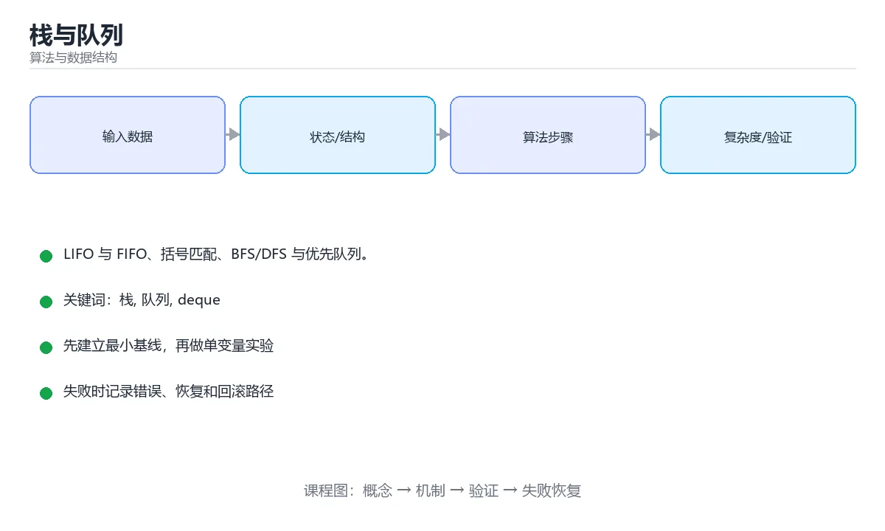

# 栈与队列



> 内容更新时间：2026-10-03 · 学习阶段：基础 · 预计用时：13 分钟

## 学习目标

- 能用自己的话解释「栈与队列」解决了什么问题，而不是只背术语。
- 能说清 「栈」、「队列」、「deque」、「BFS」 之间的关系，并分别举出一个例子。
- 能把本课知识放回「算法与数据结构」的知识体系，说明它和相邻主题的边界。
- 能完成本课练习，并用验收标准检查自己的结果。

> 一句话摘要：LIFO 与 FIFO、括号匹配、BFS/DFS 与优先队列。

## 前置知识

- 先完成上一课《哈希表》；如果已经掌握，可以直接用本课练习自测。
- 本课阶段：基础。建议会读写简单代码或命令，并理解变量、输入输出等基本概念。
- 开始前先复习：栈、队列、deque。
- 如果某一步看不懂，先记录具体卡点，完成练习后再回头读一遍。


## 栈：后进先出（LIFO）

```text
push(1) push(2) push(3)   ->  栈顶 [3, 2, 1] 栈底
pop() -> 3
```

```python
stack = []
stack.append(1)      # 入栈
stack.append(2)
top = stack[-1]      # 查看栈顶
value = stack.pop()  # 出栈：2
is_empty = not stack
```

栈的典型应用：函数调用栈、括号匹配、表达式求值、撤销操作、深度优先搜索（DFS）。

```python
def is_valid_brackets(text):
    pairs = {")": "(", "]": "[", "}": "{"}
    stack = []
    for ch in text:
        if ch in "([{":
            stack.append(ch)
        elif ch in pairs:
            if not stack or stack.pop() != pairs[ch]:
                return False
    return not stack
```

## 队列：先进先出（FIFO）

```text
enqueue(1) enqueue(2) enqueue(3)  ->  队首 [1, 2, 3] 队尾
dequeue() -> 1
```

```python
from collections import deque

queue = deque()
queue.append("a")        # 入队
queue.append("b")
first = queue.popleft()  # 出队：a
```

不要用 `list.pop(0)` 实现队列：每次都要搬移元素，复杂度 `O(n)`；`deque` 的两端操作都是 `O(1)`。

队列的典型应用：任务调度、消息队列、广度优先搜索（BFS）、缓冲区。

## 变体

| 结构 | 规则 | 场景 |
| --- | --- | --- |
| 双端队列 deque | 两端都可进出 | 滑动窗口最大值 |
| 优先队列 / 堆 | 每次取最大/最小 | 任务优先级、TopK |
| 循环队列 | 固定数组首尾相连 | 嵌入式、Ring Buffer |

```python
import heapq

heap = [3, 1, 2]
heapq.heapify(heap)
heapq.heappush(heap, 0)
print(heapq.heappop(heap))   # 0
```

## 本课小结
栈解决「最近相关」问题，队列解决「按顺序公平」问题；BFS 用队列、DFS 用栈（或递归），优先队列用堆实现。

<!-- appendix:v1 -->

## 应用场景速查

| 结构 | 特性 | 典型应用 |
| --- | --- | --- |
| 栈 | 后进先出 | 括号匹配、表达式求值、DFS、撤销、调用栈 |
| 队列 | 先进先出 | BFS、任务调度、缓冲区 |
| 双端队列 | 两端 O(1) | 单调队列、滑动窗口最大值 |
| 优先队列 / 堆 | 按优先级出队 | TopK、任务优先级、Dijkstra |
| 循环队列 | 固定空间复用 | 环形缓冲区、生产者消费者 |

```python
from collections import deque

# 括号匹配：栈的经典用法
def is_balanced(text: str) -> bool:
    pairs = {")": "(", "]": "[", "}": "{"}
    stack = []
    for ch in text:
        if ch in "([{":
            stack.append(ch)
        elif ch in pairs:
            if not stack or stack.pop() != pairs[ch]:
                return False
    return not stack

# 队列用 deque，两端都是 O(1)
def bfs(graph, start):
    queue = deque([start])
    visited = {start}
    order = []
    while queue:
        node = queue.popleft()       # 不要用 list.pop(0)
        order.append(node)
        for nxt in graph.get(node, []):
            if nxt not in visited:
                visited.add(nxt)
                queue.append(nxt)
    return order
```

## 实现方式对照

| 实现 | 栈 | 队列 |
| --- | --- | --- |
| 动态数组 | `append` / `pop()` 都 O(1) | `pop(0)` 是 O(n)，不可取 |
| 链表 | 头插头取 O(1) | 头取尾插 O(1) |
| `collections.deque` | 两端 O(1) | 两端 O(1)，首选 |
| 固定数组（环形） | 需管理下标 | 空间固定，适合流式数据 |
| 两个栈 | 可实现 | 入队 O(1)，出队均摊 O(1) |

## 常见错误对照表

| 容易写错的做法 | 实际现象 | 原因与正确做法 |
| --- | --- | --- |
| 用 `list.pop(0)` 当队列 | 数据量大时极慢 | 用 `deque.popleft()` |
| 空栈上 `pop()` | `IndexError` | 先判空或捕获异常 |
| 括号匹配只看开括号计数 | 会把 `([)]` 判为合法 | 必须检查类型匹配 |
| 入队与出队混用同一端 | 变成栈 | 明确 FIFO 语义 |
| 循环队列不判空与满 | 覆盖数据 | 用 `size` 计数或留一个空位区分 |
| BFS 忘记标记已访问 | 死循环或重复入队 | 入队时立刻标记 |
| DFS 递归深度过大 | 栈溢出 | 改用显式栈 |
| 优先队列用排序列表实现 | 每次插入 O(n) | 用堆（`heapq` / `PriorityQueue`） |
| `heapq` 存自定义对象 | 无法比较报错 | 存元组 `(priority, counter, item)` |
| 多线程共享队列用普通列表 | 竞态 | 用 `queue.Queue` 或加锁 |

## 自测清单

- [ ] 能用栈解决括号匹配与逆序问题。
- [ ] 队列一律用 `deque`，不用 `list.pop(0)`。
- [ ] BFS 入队即标记已访问。
- [ ] 需要优先级时使用堆而不是排序列表。
- [ ] 知道循环队列如何区分空与满。

## 动手练习

<!-- practice-diversified:v1 -->

> 本课练习重点：围绕「栈、队列、deque」完成复述、实验和交付，每个结果都要能被别人检查。

先手算 8 个元素的状态变化，再实现并统计操作次数与复杂度。

### 练习 1：建立心智模型（10 分钟）

合上教程，用 3～5 句话回答：

1. 「栈与队列」解决了什么问题？
2. 如果没有它，会出现什么具体后果？
3. 它和「队列」是什么关系？

**验收标准**：至少出现一个本课关键词，并写出一个反例、边界条件或失效场景。

### 练习 2：做一次可控实验（20 分钟）

从正文中选一个最小示例，完成以下操作：

1. 先预测修改一个参数、输入或步骤后的结果。
2. 再实际执行或逐步推演，记录真实结果。
3. 如果结果与预测不同，写出差异原因。

**验收标准**：留下「原例 → 改动 → 预测 → 结果 → 原因」五步记录。

### 练习 3：交付一个小结果（30 分钟）

给定 8～12 个手工构造的数据，写出每一步状态，并统计比较或交换次数。

任务要求：

- 结果必须能被别人检查，不能只写“我已经理解了”。
- 至少覆盖「栈」和「队列」两个关键词。
- 写出 1 个仍然不确定的问题，以及下一步如何验证。

> 提示：时间有限时优先做练习 1 和练习 2；练习 3 可以拆成两次完成。

<!-- scaffold:v1 -->

<!-- deep-dive:v1 -->

## 深入补充：栈与队列

前面已经建立了基本概念。这一节换一个角度，把「栈与队列」放进真实工程里，
重点回答三件事：它为什么存在、内部如何运转、什么时候会失效。

### 一、核心模型

栈是后进先出，队列是先进先出；它们既是基础数据结构，也是函数调用、表达式求值、任务调度、广度优先搜索和消息缓冲的核心模型。

```text
元素入栈/入队 → 状态变化 → 出栈/出队 → 返回最新或最早元素 → 处理边界与容量
```

### 二、关键机制拆解

1. 栈只允许在一端插入和删除，支持 push、pop、peek，操作复杂度通常为 O(1)。
2. 队列在尾部入队、头部出队，数组实现要注意循环复用空间，链表实现要注意节点释放。
3. 双端队列允许两端插入删除，可同时实现栈和队列。
4. 单调栈用于寻找下一个更大/更小元素，单调队列用于滑动窗口最值。
5. 表达式求值用栈处理运算符优先级，括号匹配用栈检查嵌套结构。
6. BFS 使用队列按层扩展，DFS 使用栈或递归探索纵深。
7. 并发队列必须明确阻塞、超时、容量和关闭语义，否则会产生生产者消费者问题。

### 三、对照表：抓住容易混淆的边界

| 维度 | 一侧 | 另一侧 |
| --- | --- | --- |
| 栈 | 后进先出 | 适合递归、回溯和表达式 |
| 队列 | 先进先出 | 适合调度、BFS 和缓冲 |
| 循环队列 | 复用数组空间 | 需要区分空和满 |
| 优先队列 | 按优先级出队 | 通常用堆实现 |

### 四、工作示例

判断括号是否匹配：遇到左括号入栈，遇到右括号时检查栈顶是否匹配并弹出；遍历结束后栈为空才合法。若用队列，就无法正确处理最近未闭合的左括号。

### 五、常见误区与失效边界

| 错误做法或假设 | 后果 | 正确做法 |
| --- | --- | --- |
| 栈空时继续弹出 | 空指针或异常 | 先检查容量和空状态 |
| 循环队列无法区分空满 | 覆盖未消费数据 | 使用计数或保留一个空位 |
| 用数组头部删除实现队列 | 每次 O(n) 搬移 | 使用循环数组或链表 |
| 并发队列关闭后继续写入 | 数据丢失或异常 | 定义关闭、排空和拒绝语义 |

### 六、场景推演

任务调度器使用无界队列，生产速度大于消费速度，内存持续上涨。修复方案是设置容量和背压策略：队列满时阻塞、丢弃低优先级任务或返回明确错误，并监控队列长度。

### 七、自测问答

**Q1：为什么括号匹配适合用栈？**

右括号需要匹配最近的未闭合左括号，符合后进先出。

**Q2：BFS 为什么用队列？**

它按发现顺序逐层扩展，先进先出保证层序正确。

**Q3：循环队列如何区分空和满？**

可以维护元素计数，或保留一个空位并单独判断。

**Q4：无界队列的风险是什么？**

生产快于消费时会耗尽内存并推高延迟。

### 八、小项目：把知识变成可检查的产出

实现栈、循环队列和优先队列三种结构，并分别解决括号匹配、BFS 最短路径和任务优先级调度三个小问题；补齐空结构、满结构和重复元素测试。

### 九、适用边界

栈和队列提供访问顺序，不解决容量和并发本身。真实系统还要考虑背压、持久化、优先级、公平性和故障恢复。

### 十、完成检查清单

- [ ] 能手写栈和循环队列
- [ ] 能分析各操作复杂度
- [ ] 能用栈解决表达式和括号问题
- [ ] 能用队列实现 BFS
- [ ] 能说明并发队列的关闭与背压语义

### 十一、复习顺序

1. 先不看资料复述“核心模型”，确认能说出它解决的三个问题。
2. 再对照表逐行解释容易混淆的概念，每个概念补一个反例。
3. 跟着工作示例做一遍，改变一个条件并预测结果。
4. 用自测问答检查理解，错题回到对应小节重新阅读。
5. 最后完成小项目，把结果、失败记录和复查清单整理成一份可提交产物。

> 复习不是重读一遍，而是离开原文重新产出：复述、改写、验证、复盘。

<!-- p2-enrichment:v1 -->

## English Overview

**Title:** Stacks & Queues

**Summary:** LIFO/FIFO, bracket matching, BFS/DFS and priority queues.

**Category:** Algorithms  
**Level:** 基础  
**Key terms:** 栈, 队列, deque, BFS, DFS, 优先队列

> The full tutorial is written in Chinese. This bilingual overview helps English readers identify the topic, scope and key terms before studying the detailed examples.

## 内容元数据

- 内容版本：v2.0
- 最后更新：2026-10-03
- 学习阶段：基础
- 适用环境：任意主流语言（伪代码与复杂度为主）
- 内容来源：内置结构化课程与工程实践整理
- 相关主题：栈、队列、deque、BFS、DFS、优先队列
- 质量版本：P0 测验标准 + P1 覆盖扩展 + P2 体验补全

<!-- p2-references:v1 -->

## 参考资料与复核

- 最后复核：2026-10-04
- 下次复核：2027-04-04
- 复核范围：版本兼容、API 行为、安全建议与工程实践
- 来源性质：官方文档与标准；本课正文为离线教学重组，不复制原文

| 参考资料 | 本课用途 |
| --- | --- |
| [CP-Algorithms](https://cp-algorithms.com/) | 算法实现与复杂度 |
| [MIT OpenCourseWare 6.006](https://ocw.mit.edu/courses/6-006-introduction-to-algorithms-spring-2020/) | 算法设计与分析 |

> 本课主题：LIFO 与 FIFO、括号匹配、BFS/DFS 与优先队列。

> App 完全离线展示文字链接，不会自动联网；需要延伸阅读时可复制链接到浏览器。

