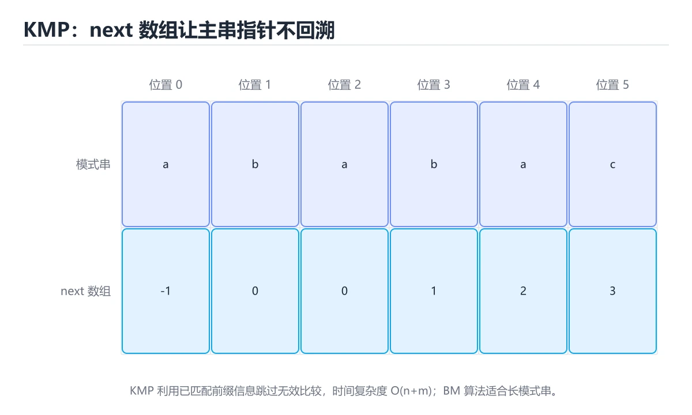
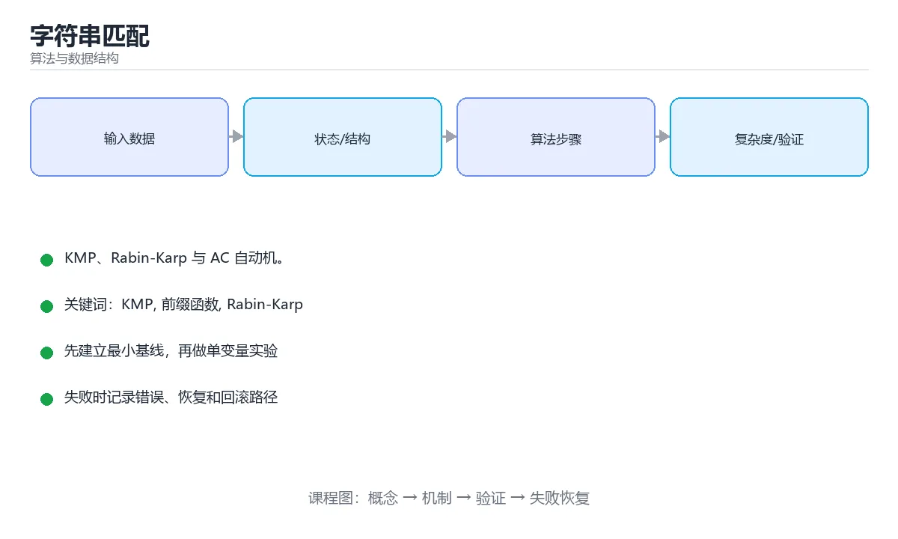

# 字符串匹配





> 内容更新时间：2026-10-03 · 学习阶段：高级 · 预计用时：15 分钟

## 学习目标

- 能用自己的话解释「字符串匹配」解决了什么问题，而不是只背术语。
- 能说清 「KMP」、「前缀函数」、「Rabin-Karp」、「AC 自动机」 之间的关系，并分别举出一个例子。
- 能把本课知识放回「算法与数据结构」的知识体系，说明它和相邻主题的边界。
- 能完成本课练习，并用验收标准检查自己的结果。

> 一句话摘要：KMP、Rabin-Karp 与 AC 自动机。

## 前置知识

- 先完成上一课《二分答案》；如果已经掌握，可以直接用本课练习自测。
- 本课阶段：高级。建议具备同一方向的完整基础，能阅读较长的代码、配置或系统设计说明。
- 开始前先复习：KMP、前缀函数、Rabin-Karp。
- 如果某一步看不懂，先记录具体卡点，完成练习后再回头读一遍。


## 问题定义

在文本串 T 中查找模式串 P 首次（或所有）出现的位置。暴力做法逐个位置比较，最坏复杂度 O(n×m)。

## KMP：利用已匹配的信息

核心是 **next 数组（部分匹配表 / 前缀函数）**：当失配时，模式串指针不必回到开头，而是跳到「最长相等前后缀」的下一位，避免重复比较。

| 要点 | 说明 |
| --- | --- |
| 前缀函数 π[i] | P[0..i] 的最长相等真前后缀长度 |
| 失配跳转 | 主串指针不回退，模式指针跳到 π[i-1] |
| 复杂度 | 预处理 O(m) + 匹配 O(n) |
| 典型用途 | 子串查找、循环节判断、字符串周期 |

构造与匹配都用同一个思路：**在失配时沿着前缀函数向前回退，直到能继续匹配或回到起点**。

## Rabin-Karp：用哈希快速筛选

把每个长度为 m 的子串滚动哈希，与模式串哈希比较；哈希相等时再做一次精确比较以排除碰撞。平均 O(n+m)，适合多模式或二维匹配，缺点是最坏情况退化（可通过随机基数缓解）。

## 其他算法

| 算法 | 特点 | 适用 |
| --- | --- | --- |
| Boyer-Moore | 从右往左比较，坏字符与好后缀规则，实践中很快 | 大文本搜索 |
| Aho-Corasick | Trie + 失配指针，一次扫描匹配多个模式 | 敏感词过滤、IDS |
| 后缀数组 / 后缀自动机 | 预处理后支持多种子串查询 | 复杂字符串问题 |
| Z 函数 | 求每个后缀与原串的 LCP | 等价于 KMP 的一类问题 |

## 工程中使用

实际开发很少手写 KMP：语言标准库的 `indexOf`、`find`、`strings.Index` 已高度优化；正则适合复杂模式但有回溯风险。需要自己实现的场景通常是：自定义多模式匹配、流式匹配或算法题。

## 常见坑

1. 前缀函数下标从 0 还是 1 开始，容易混淆。
2. 模式串为空或比文本长时的边界处理。
3. 用哈希法时忽略哈希碰撞，未做二次校验。
4. 正则表达式在大文本上出现灾难性回溯，应改用 AC 自动机。

## 算法选择与实现要点

| 场景 | 推荐 | 复杂度 |
| --- | --- | --- |
| 单模式、要求最坏有保证 | KMP | O(n+m) |
| 单模式、实践中要快 | Boyer-Moore / BMH | 平均亚线性 |
| 多模式（敏感词、IDS） | Aho-Corasick | O(n + 总模式长 + 匹配数) |
| 大量子串查询 | 后缀数组 / 后缀自动机 | 预处理后 O(m) 或 O(log n) |
| 只需概率匹配且可容忍校验 | Rabin-Karp | 平均 O(n+m) |

实现要点：① KMP 的 next 数组要区分"下标从 0 还是 1 开始"，两种写法不能混；② 用字符串哈希时**必须做二次精确校验**，否则碰撞会给出错误结果；③ AC 自动机构建分两步——先建 Trie，再 BFS 求 fail 指针（fail 指向最长后缀），匹配时失配就沿 fail 跳；④ 处理空模式串与模式长于主串的边界。

工程经验：日常查找直接用语言内置的 `indexOf/find`（多数已高度优化）；只有在需要多模式匹配或流式匹配时才自己实现。

## 本课小结
字符串匹配的进化路线是：**暴力 → 利用已匹配信息（KMP）→ 哈希筛选（Rabin-Karp）→ 多模式自动机（AC）**。理解前缀函数，是掌握这一类算法的钥匙。


## 算法选型速查

| 算法 | 预处理 | 匹配 | 适用 |
| --- | --- | --- | --- |
| 朴素匹配 | 无 | O(nm) | 极短文本 |
| KMP | O(m) | O(n+m) | 单模式、需要线性保证 |
| Rabin-Karp | O(m) | 平均 O(n+m) | 多模式、二维匹配、滚动哈希 |
| Z 算法 | O(n+m) | O(n+m) | 与前缀相关的问题 |
| AC 自动机 | O(总模式长) | O(n + 匹配数) | 多模式匹配（敏感词过滤） |
| 后缀数组 / 后缀自动机 | O(n log n) | O(m log n) | 子串统计、最长重复子串 |

## KMP 模板

```python
def build_lps(pattern: str):
    """lps[i] = pattern[0..i] 的最长相等前后缀长度。"""
    lps = [0] * len(pattern)
    length = 0                      # 当前最长前缀长度
    i = 1
    while i < len(pattern):
        if pattern[i] == pattern[length]:
            length += 1
            lps[i] = length
            i += 1
        elif length:
            length = lps[length - 1]   # 失配：回退到次长前后缀
        else:
            lps[i] = 0
            i += 1
    return lps


def kmp_search(text: str, pattern: str):
    """返回所有匹配起始下标，O(n + m)。"""
    if not pattern:
        return [0]
    lps = build_lps(pattern)
    result, j, i = [], 0, 0
    while i < len(text):
        if text[i] == pattern[j]:
            i += 1
            j += 1
            if j == len(pattern):
                result.append(i - j)
                j = lps[j - 1]          # 继续找下一次匹配
        elif j:
            j = lps[j - 1]
        else:
            i += 1
    return result


def rabin_karp(text: str, pattern: str, base: int = 131, mod: int = 10**9 + 7):
    """滚动哈希：平均线性，哈希相同时再精确比较，避免碰撞误判。"""
    n, m = len(text), len(pattern)
    if m == 0 or m > n:
        return []
    power = pow(base, m - 1, mod)
    target = 0
    window = 0
    for ch in pattern:
        target = (target * base + ord(ch)) % mod
    for ch in text[:m]:
        window = (window * base + ord(ch)) % mod
    result = []
    for i in range(n - m + 1):
        if window == target and text[i:i + m] == pattern:
            result.append(i)
        if i < n - m:
            window = ((window - ord(text[i]) * power) * base + ord(text[i + m])) % mod
    return result
```

## 常见错误对照表

| 容易写错的做法 | 实际现象 | 原因与正确做法 |
| --- | --- | --- |
| KMP 失配时把 `i` 回退 | 退化成 O(nm) | 失配只回退 `j`，`i` 不回退 |
| `lps` 定义记错（长度 vs 位置） | 跳转错位 | 明确 `lps[i]` 表示前缀长度并统一 |
| 忘记处理后缀重叠匹配 | 漏掉重叠出现 | 匹配成功后 `j = lps[j-1]` 继续 |
| 空模式串未处理 | 越界或死循环 | 单独返回 `[0]` 或按约定处理 |
| Rabin-Karp 只比哈希不验证 | 碰撞导致误报 | 哈希相等后再逐字符比较 |
| 滚动哈希忘记取模 | 整数溢出 | 每步取模 |
| 减法后出现负数 | 哈希错误 | 加模数再取模 |
| 用哈希值判断子串相等 | 可能误判 | 需要确定性时用 KMP 或后缀结构 |
| 模式串比文本长 | 越界 | 先判断长度 |
| 用 `str.find` 却要求线性最坏 | 实现依赖具体引擎 | 有严格要求时自己实现 KMP |

## 自测清单

- [ ] 能独立写出 `build_lps` 与 `kmp_search`。
- [ ] 说明 KMP 为什么是 O(n+m)。
- [ ] 会用滚动哈希处理多模式或二维匹配。
- [ ] 知道哈希碰撞的处理方式。
- [ ] 多模式匹配优先考虑 AC 自动机。

## 动手练习


> 本课练习重点：围绕「KMP、前缀函数、Rabin-Karp」完成复述、实验和交付，每个结果都要能被别人检查。

先手算 8 个元素的状态变化，再实现并统计操作次数与复杂度。

### 练习 1：建立心智模型（10 分钟）

合上教程，用 3～5 句话回答：

1. 「字符串匹配」解决了什么问题？
2. 如果没有它，会出现什么具体后果？
3. 它和「前缀函数」是什么关系？

**验收标准**：至少出现一个本课关键词，并写出一个反例、边界条件或失效场景。

### 练习 2：做一次可控实验（20 分钟）

从正文中选一个最小示例，完成以下操作：

1. 先预测修改一个参数、输入或步骤后的结果。
2. 再实际执行或逐步推演，记录真实结果。
3. 如果结果与预测不同，写出差异原因。

**验收标准**：留下「原例 → 改动 → 预测 → 结果 → 原因」五步记录。

### 练习 3：交付一个小结果（30 分钟）

给定 8～12 个手工构造的数据，写出每一步状态，并统计比较或交换次数。

任务要求：

- 结果必须能被别人检查，不能只写“我已经理解了”。
- 至少覆盖「KMP」和「前缀函数」两个关键词。
- 写出 1 个仍然不确定的问题，以及下一步如何验证。

> 提示：时间有限时优先做练习 1 和练习 2；练习 3 可以拆成两次完成。


## 考点精讲：把测验题还原成判断过程

本课有 6 个判断点。先自己作答，再看「判断依据」；如果结论正确但理由不完整，回到正文对应章节补足概念。

### 考点 1：KMP 算法的核心是？

- **正确判断**：前缀函数（next 数组）
- **判断依据**：失配时利用最长相等前后缀跳转，主串指针不回退。其他选项：KMP 的核心是前缀函数（next 数组），失配时按最长相等前后缀跳转，主串指针不回退。针对「KMP 算法的核心是，」，本课在「本课小结」中说明：字符串匹配的进化路线是：暴力 → 利用已匹配信息（KMP）→ 哈希筛选（Rabin-Karp）→ 多模式自动机（AC）。本课还在「KMP：利用已匹配的信息」中说明：核心是 next 数组（部分匹配表 / 前缀函数）：当失配时，模式串指针不必回到开头，而是跳到「最长相等前后缀」的下一位，避免重复比较。
- **迁移检查**：遮住选项，只根据定义复述一次答案，再回来看哪个选项与复述一致。

### 考点 2：KMP 的时间复杂度是？

- **正确判断**：O(n+m)
- **判断依据**：预处理 O(m)，匹配 O(n)。其他选项：预处理 O(m) 加匹配 O(n) 得到 O(n+m)，优于朴素匹配的 O(n×m)。针对「KMP 的时间复杂度是，」，本课在「本课小结」中说明：字符串匹配的进化路线是：暴力 → 利用已匹配信息（KMP）→ 哈希筛选（Rabin-Karp）→ 多模式自动机（AC）。本课还在「KMP：利用已匹配的信息」中说明：构造与匹配都用同一个思路：在失配时沿着前缀函数向前回退，直到能继续匹配或回到起点。
- **迁移检查**：遮住选项，只根据定义复述一次答案，再回来看哪个选项与复述一致。

### 考点 3：一次扫描同时匹配多个模式串，应使用？

- **正确判断**：Aho-Corasick
- **判断依据**：正确答案是「Aho-Corasick」，本课在「KMP：利用已匹配的信息」中说明：核心是 next 数组（部分匹配表 / 前缀函数）：当失配时，模式串指针不必回到开头，而是跳到「最长相等前后缀」的下一位，避免重复比较。AC 自动机是 Trie 加失配指针，适合敏感词过滤等场景。本课还在「常见坑」中说明：前缀函数下标从 0 还是 1 开始，容易混淆。本课还在「KMP：利用已匹配的信息」中说明：构造与匹配都用同一个思路：在失配时沿着前缀函数向前回退，直到能继续匹配或回到起点。
- **迁移检查**：遮住选项，只根据定义复述一次答案，再回来看哪个选项与复述一致。

### 考点 4：Rabin-Karp 算法的核心思想是？

- **正确判断**：用滚动哈希快速比较子串指纹
- **判断依据**：正确答案是「用滚动哈希快速比较子串指纹」，本课在「Rabin-Karp：用哈希快速筛选」中说明：把每个长度为 m 的子串滚动哈希，与模式串哈希比较。平均线性、实现简单，适合多模式或二维匹配，但要注意哈希冲突与模数选择。本课还在「算法选择与实现要点」中说明：③ AC 自动机构建分两步——先建 Trie，再 BFS 求 fail 指针（fail 指向最长后缀），匹配时失配就沿 fail 跳。本课还在「常见坑」中说明：前缀函数下标从 0 还是 1 开始，容易混淆。
- **迁移检查**：遮住选项，只根据定义复述一次答案，再回来看哪个选项与复述一致。

### 考点 5：KMP 中 next（前缀函数）记录的是？

- **正确判断**：每个位置的最长相等前后缀长度
- **判断依据**：它保证指针不回退，从而把匹配复杂度降到 O(n + m)。其他选项：next 记录每个位置的最长相等前后缀长度，用于失配跳转。针对「KMP 中 next（前缀函数）记录的是，」，本课在「问题定义」中说明：在文本串 T 中查找模式串 P 首次（或所有）出现的位置。本课还在「常见坑」中说明：正则表达式在大文本上出现灾难性回溯，应改用 AC 自动机。本课还在「算法选择与实现要点」中说明：③ AC 自动机构建分两步——先建 Trie，再 BFS 求 fail 指针（fail 指向最长后缀），匹配时失配就沿 fail 跳。
- **迁移检查**：把题干里的一个条件换成边界值，原来的结论还成立吗？写出判断过程。

### 考点 6：补全代码：「字符串匹配」示例中，下面这行代码缺少哪个关键字或函数名？请填入 ____。 `def ____(text: str, pattern: str):`

- **正确判断**：kmp_search
- **判断依据**：正确答案是「kmp_search」，本课在「算法选择与实现要点」中说明：② 用字符串哈希时必须做二次精确校验，否则碰撞会给出错误结果。本课还在「算法选择与实现要点」中说明：只有在需要多模式匹配或流式匹配时才自己实现。本课还在「工程中使用」中说明：实际开发很少手写 KMP：语言标准库的 indexOf、find、strings.Index 已高度优化。
- **迁移检查**：不看题干，用自己的话补全这句话，再与标准答案对照。

## 本课复习清单

离开本课前，逐项确认：

- [ ] 不看解析，能说出「KMP 算法的核心是？」的判断依据。
- [ ] 不看解析，能说出「KMP 的时间复杂度是？」的判断依据。
- [ ] 不看解析，能说出「一次扫描同时匹配多个模式串，应使用？」的判断依据。
- [ ] 不看解析，能说出「Rabin-Karp 算法的核心思想是？」的判断依据。
- [ ] 不看解析，能说出「KMP 中 next（前缀函数）记录的是？」的判断依据。
- [ ] 不看解析，能说出「补全代码：「字符串匹配」示例中，下面这行代码缺少哪个关键字或函数名？请填入 __…」的判断依据。
- [ ] 至少运行一次本课示例，记录输入、输出和一个边界情况。
- [ ] 把本课最容易混淆的两个概念写成一句话对照。

| 复盘项 | 记录 |
| --- | --- |
| 已经能独立解释的考点 |  |
| 仍然说不清的概念 |  |
| 下一步验证动作 |  |

## 术语速查

把本课反复出现的术语集中放在一起。复习时先遮住右列，尝试用自己的话解释，再回到正文核对。

| 术语 | 本课语境 |
| --- | --- |
| `indexOf` | 实际开发很少手写 KMP：语言标准库的 `indexOf`、`find`、`strings.Index` 已高度优化；正则适合复杂模式但有回溯风险。需要自己实现的场景通常是：自定义多模式匹配、流式匹配或算法题。 |
| `find` | 实际开发很少手写 KMP：语言标准库的 `indexOf`、`find`、`strings.Index` 已高度优化；正则适合复杂模式但有回溯风险。需要自己实现的场景通常是：自定义多模式匹配、流式匹配或算法题。 |
| `strings.Index` | 实际开发很少手写 KMP：语言标准库的 `indexOf`、`find`、`strings.Index` 已高度优化；正则适合复杂模式但有回溯风险。需要自己实现的场景通常是：自定义多模式匹配、流式匹配或算法题。 |
| `indexOf/find` | 工程经验：日常查找直接用语言内置的 `indexOf/find`（多数已高度优化）；只有在需要多模式匹配或流式匹配时才自己实现。 |
| `回退 | 退化成 O(nm) | 失配只回退` | \| KMP 失配时把 `i` 回退 \| 退化成 O(nm) \| 失配只回退 `j`，`i` 不回退 \| |
| `lps` | \| `lps` 定义记错（长度 vs 位置） \| 跳转错位 \| 明确 `lps[i]` 表示前缀长度并统一 \| |
| `lps[i]` | \| `lps` 定义记错（长度 vs 位置） \| 跳转错位 \| 明确 `lps[i]` 表示前缀长度并统一 \| |
| `j = lps[j-1]` | \| 忘记处理后缀重叠匹配 \| 漏掉重叠出现 \| 匹配成功后 `j = lps[j-1]` 继续 \| |
| `[0]` | \| 空模式串未处理 \| 越界或死循环 \| 单独返回 `[0]` 或按约定处理 \| |
| `str.find` | \| 用 `str.find` 却要求线性最坏 \| 实现依赖具体引擎 \| 有严格要求时自己实现 KMP \| |
| `build_lps` | [ ] 能独立写出 `build_lps` 与 `kmp_search`。 |
| `kmp_search` | [ ] 能独立写出 `build_lps` 与 `kmp_search`。 |

## 面试问答与自测

下面把本课考点换成面试追问。先口述自己的答案，
再对照参考回答检查是否遗漏了前提、边界或失败路径。

### 追问 1：KMP 算法的核心是？

**参考回答**：失配时利用最长相等前后缀跳转，主串指针不回退。其他选项：KMP 的核心是前缀函数（next 数组），失配时按最长相等前后缀跳转，主串指针不回退。针对「KMP 算法的核心是，」，本课在「本课小结」中说明：字符串匹配的进化路线是：暴力 → 利用已匹配信息（KMP）→ 哈希筛选（Rabin-Karp）→ 多模式自动机（AC）。本课还在「KMP·利用已匹配的信息」中说明：核心是 next 数组（部分匹配表 / 前缀函数）：当失配时，模式串指针不必回到开头，而是跳到「最长相等前后缀」的下一位，避免重复比较。

### 追问 2：KMP 的时间复杂度是？

**参考回答**：预处理 O(m)，匹配 O(n)。其他选项：预处理 O(m) 加匹配 O(n) 得到 O(n+m)，优于朴素匹配的 O(n×m)。针对「KMP 的时间复杂度是，」，本课在「本课小结」中说明：字符串匹配的进化路线是：暴力 → 利用已匹配信息（KMP）→ 哈希筛选（Rabin-Karp）→ 多模式自动机（AC）。本课还在「KMP·利用已匹配的信息」中说明：构造与匹配都用同一个思路：在失配时沿着前缀函数向前回退，直到能继续匹配或回到起点。

### 追问 3：一次扫描同时匹配多个模式串，应使用？

**参考回答**：正确答案是「Aho-Corasick」，本课在「KMP·利用已匹配的信息」中说明：核心是 next 数组（部分匹配表 / 前缀函数）：当失配时，模式串指针不必回到开头，而是跳到「最长相等前后缀」的下一位，避免重复比较。AC 自动机是 Trie 加失配指针，适合敏感词过滤等场景。本课还在「常见坑」中说明：前缀函数下标从 0 还是 1 开始，容易混淆。本课还在「KMP·利用已匹配的信息」中说明：构造与匹配都用同一个思路：在失配时沿着前缀函数向前回退，直到能继续匹配或回到起点。

### 追问 4：Rabin-Karp 算法的核心思想是？

**参考回答**：正确答案是「用滚动哈希快速比较子串指纹」，本课在「Rabin-Karp·用哈希快速筛选」中说明：把每个长度为 m 的子串滚动哈希，与模式串哈希比较。平均线性、实现简单，适合多模式或二维匹配，但要注意哈希冲突与模数选择。本课还在「算法选择与实现要点」中说明：③ AC 自动机构建分两步——先建 Trie，再 BFS 求 fail 指针（fail 指向最长后缀），匹配时失配就沿 fail 跳。本课还在「常见坑」中说明：前缀函数下标从 0 还是 1 开始，容易混淆。

### 追问 5：KMP 中 next（前缀函数）记录的是？

**参考回答**：它保证指针不回退，从而把匹配复杂度降到 O(n + m)。其他选项：next 记录每个位置的最长相等前后缀长度，用于失配跳转。针对「KMP 中 next（前缀函数）记录的是，」，本课在「问题定义」中说明：在文本串 T 中查找模式串 P 首次（或所有）出现的位置。本课还在「常见坑」中说明：正则表达式在大文本上出现灾难性回溯，应改用 AC 自动机。本课还在「算法选择与实现要点」中说明：③ AC 自动机构建分两步——先建 Trie，再 BFS 求 fail 指针（fail 指向最长后缀），匹配时失配就沿 fail 跳。

## English Overview

**Title:** String Matching

**Summary:** KMP, Rabin-Karp and Aho-Corasick.

**Category:** Algorithms  
**Level:** 高级  
**Key terms:** KMP, 前缀函数, Rabin-Karp, AC 自动机

> The full tutorial is written in Chinese. This bilingual overview helps English readers identify the topic, scope and key terms before studying the detailed examples.

## 内容元数据

- 内容版本：v2.0
- 最后更新：2026-10-03
- 学习阶段：高级
- 适用环境：任意主流语言（伪代码与复杂度为主）
- 内容来源：内置结构化课程与工程实践整理
- 相关主题：KMP、前缀函数、Rabin-Karp、AC 自动机
- 质量版本：P0 测验标准 + P1 覆盖扩展 + P2 体验补全


## 参考资料与复核

- 最后复核：2026-10-04
- 下次复核：2027-04-04
- 复核范围：版本兼容、API 行为、安全建议与工程实践
- 来源性质：官方文档与标准；本课正文为离线教学重组，不复制原文

| 参考资料 | 本课用途 |
| --- | --- |
| [CP-Algorithms](https://cp-algorithms.com/) | 算法实现与复杂度 |
| [MIT OpenCourseWare 6.006](https://ocw.mit.edu/courses/6-006-introduction-to-algorithms-spring-2020/) | 算法设计与分析 |

> 本课主题：KMP、Rabin-Karp 与 AC 自动机。

> App 完全离线展示文字链接，不会自动联网；需要延伸阅读时可复制链接到浏览器。
