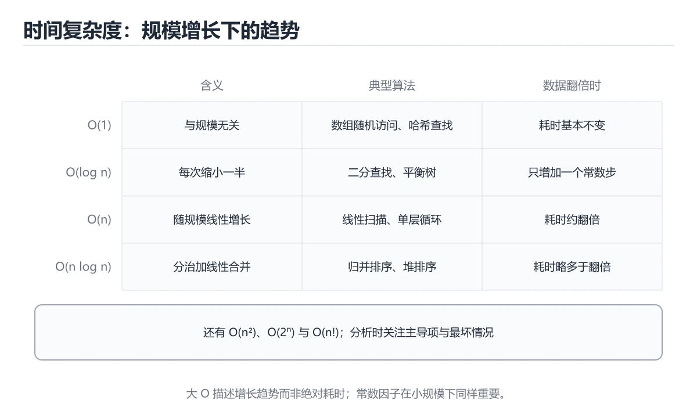
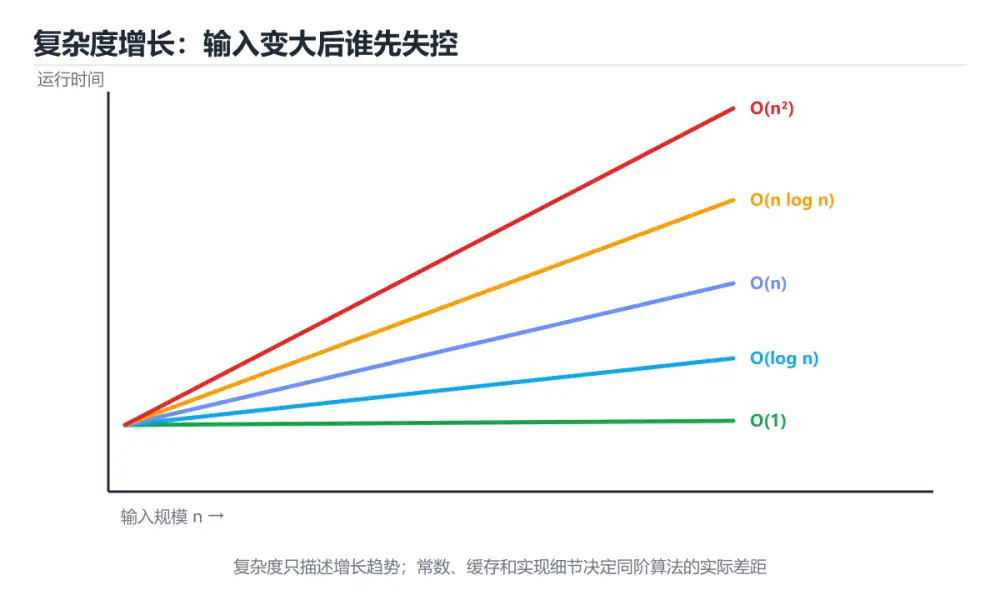

# 时间复杂度






> 内容更新时间：2026-10-06 · 学习阶段：基础 · 预计用时：35 分钟

## 学习目标

- 能用自己的话解释时间复杂度解决了什么问题，而不是只背术语。
- 能说清 时间复杂度、「大O」、「复杂度」、「空间复杂度」 之间的关系，并分别举出一个例子。
- 能把本课知识放回「算法与数据结构」的知识体系，说明它和相邻主题的边界。
- 能完成本课练习，并用验收标准检查自己的结果。

> 一句话摘要：用大 O 描述运行时间随规模增长的趋势。

## 前置知识

- 先完成上一课《冒泡排序》；如果已经掌握，可以直接用本课练习自测。
- 本课阶段：基础。建议会读写简单代码或命令，并理解变量、输入输出等基本概念。
- 开始前先复习：时间复杂度、大O、复杂度。
- 如果某一步看不懂，先记录具体卡点，完成练习后再回头读一遍。

## 为什么需要复杂度

同一段代码在不同电脑上运行时间不同，所以我们要忽略硬件差异，只描述**运行时间随数据规模增长的趋势**。这就是大 O 表示法。

## 大 O 表示法

```text
O(1) < O(log n) < O(n) < O(n log n) < O(n²) < O(2ⁿ) < O(n!)
```

常见代码与复杂度对照：

```python
# O(1)：执行次数与 n 无关
def first(nums):
    return nums[0]

# O(n)：一次遍历
def total(nums):
    result = 0
    for x in nums:
        result += x
    return result

# O(n²)：嵌套两层循环
def pairs(nums):
    count = 0
    for a in nums:
        for b in nums:
            count += 1
    return count
```

## 如何分析

1. 只看最高阶项，忽略常数和低阶项：`3n² + 5n + 100` 记作 `O(n²)`。
2. 顺序执行取最大的复杂度：先 `O(n)` 再 `O(n²)`，整体是 `O(n²)`。
3. 循环看迭代次数，嵌套循环用乘法。
4. 递归用递推式或递归树分析。

```python
# 对数复杂度：每次规模减半
def count_halving(n):
    steps = 0
    while n > 1:
        n = n // 2
        steps += 1
    return steps      # 约等于 log2(n)
```

## 最好、最坏与平均

以线性查找为例：

```python
def find(nums, target):
    for i, value in enumerate(nums):
        if value == target:
            return i
    return -1
```

- 最好情况：第一个就是目标，`O(1)`。
- 最坏情况：目标在末尾或不存在，`O(n)`。
- 平均情况：约 `O(n)`。

不加说明时，通常讨论**最坏时间复杂度**。

## 空间复杂度

复杂度不只描述时间。额外申请一个长度为 n 的数组，空间复杂度就是 `O(n)`；只用几个变量则是 `O(1)`。

```python
def copy_list(nums):
    return nums[:]        # 额外 O(n) 空间
```

## 复杂度对照与分析方法

| 复杂度 | n=10 | n=1,000 | n=10⁶ | 典型算法 |
| --- | --- | --- | --- | --- |
| O(1) | 1 | 1 | 1 | 哈希查找、数组下标 |
| O(log n) | 4 | 10 | 20 | 二分查找、平衡树 |
| O(n) | 10 | 10³ | 10⁶ | 一次遍历、计数排序 |
| O(n log n) | 33 | 10⁴ | 2×10⁷ | 快排/归并、堆排序 |
| O(n²) | 100 | 10⁶ | 10¹² | 冒泡、双重循环 |
| O(2ⁿ) | 1024 | 爆炸 | 不可行 | 子集枚举、朴素递归 |

经验判断：**n ≤ 20 可用指数级，n ≤ 5000 可用 O(n²)，n ≥ 10⁵ 必须 O(n log n) 及以下**。拿到题目先看数据规模，就能反推需要的复杂度，这是解题最实用的一步。

## 分析方法与常见误判

1. 只保留最高阶项：`3n² + 5n + 100` → O(n²)。
2. 循环看迭代次数，嵌套相乘；但内层依赖外层时要单独分析（如 `for i: for j in range(i)` 是 O(n²/2) = O(n²)）。
3. 递归用递推式：`T(n)=2T(n/2)+O(n)` → O(n log n)；快速排序最坏 `T(n)=T(n-1)+O(n)` → O(n²)。
4. 别忽略隐藏成本：字符串拼接、切片、`in` 判断、哈希冲突、内存分配都可能改变实际复杂度。
5. 均摊分析：动态数组 `append` 单次可能 O(n)，但均摊为 O(1)。

## 本课小结
分析复杂度时，问自己两个问题：**基本操作执行了多少次**、**额外开了多少空间**。

## 复杂度速查表

| 复杂度 | 名称 | n=10³ 量级 | 典型算法 |
| --- | --- | --- | --- |
| O(1) | 常数 | 1 | 哈希查找、数组下标 |
| O(log n) | 对数 | 约 10 | 二分查找、平衡树查找 |
| O(n) | 线性 | 1000 | 一次遍历、前缀和 |
| O(n log n) | 线性对数 | 约 10⁴ | 归并/快排、堆排序 |
| O(n²) | 平方 | 10⁶ | 冒泡/插入排序、双重循环 |
| O(n³) | 立方 | 10⁹ | 朴素矩阵乘法、区间 DP |
| O(2ⁿ) | 指数 | 巨大 | 子集枚举、朴素递归 |
| O(n!) | 阶乘 | 不可行 | 全排列暴力 |

数据结构操作对照：

| 结构 | 访问 | 查找 | 插入 | 删除 |
| --- | --- | --- | --- | --- |
| 数组 | O(1) | O(n) | O(n) | O(n) |
| 链表 | O(n) | O(n) | O(1)（已知位置） | O(1)（已知位置） |
| 哈希表 | 不适用 | 平均 O(1) | 平均 O(1) | 平均 O(1) |
| 平衡树 | O(log n) | O(log n) | O(log n) | O(log n) |
| 堆 | O(1) 取顶 | O(n) | O(log n) | O(log n) 取顶 |

## 数据规模与算法选择

| n 的规模 | 可接受复杂度 | 常见做法 |
| --- | --- | --- |
| ≤ 10 | O(n!) | 全排列、暴力搜索 |
| ≤ 20 | O(2ⁿ) | 状态压缩、子集枚举 |
| ≤ 500 | O(n³) | 区间 DP、Floyd |
| ≤ 5000 | O(n²) | 双重循环、简单 DP |
| ≤ 10⁶ | O(n log n) | 排序、二分、堆 |
| ≤ 10⁸ | O(n) | 一次扫描、前缀和 |

## 分析与优化技巧

| 技巧 | 说明 |
| --- | --- |
| 只看最高阶项 | `3n² + 5n + 100` 记作 O(n²) |
| 忽略常数因子 | `2n` 与 `n` 同阶，但常数在工程中很重要 |
| 嵌套循环相乘、顺序循环相加 | `for i { for j }` 是 O(n·m) |
| 均摊分析 | 动态数组 `append` 单次最坏 O(n)，均摊 O(1) |
| 空间换时间 | 哈希表、缓存、前缀和 |
| 提前终止 | 找到即返回、`any` 短路 |
| 分治降阶 | 归并排序、快速选择 |

```python
import timeit

# 实测比空想更可靠：用 timeit 对比两种写法
setup = "data = list(range(10000))"
loop = "total = 0\nfor x in data:\n    total += x"
builtin = "total = sum(data)"

print(timeit.timeit(loop, setup=setup, number=1000))
print(timeit.timeit(builtin, setup=setup, number=1000))   # 通常快数倍
```

## 常见错误对照表

| 容易写错的做法 | 实际现象 | 原因与正确做法 |
| --- | --- | --- |
| 把 O(2n) 当成 O(n²) | 复杂度判断错误 | 常数因子忽略，`2n` 仍是 O(n) |
| 忽略 Python 内置函数是 C 实现 | 自己写循环反而更慢 | 优先用 `sum`、`sorted`、`in` 等内置 |
| 认为哈希表永远 O(1) | 冲突严重时退化 | 最坏 O(n)，取决于哈希质量与负载因子 |
| 忘记 `in` 在列表上是 O(n) | 循环里嵌套 `in` 导致 O(n²) | 改用 `set` 判断存在性 |
| 用字符串 `+=` 拼接大量内容 | 实际是 O(n²) | 用 `join` 或 `StringBuilder` 等价结构 |
| 只测一次就下结论 | 结果被噪声干扰 | 多轮运行取统计值 |
| 忽略空间复杂度 | 内存溢出 | 同时评估时间与空间 |
| 认为递归一定更慢 | 结论片面 | 递归有栈开销，但可能更简洁；尾递归在部分语言有优化 |
| 忽略输入分布 | 平均与最坏差异巨大 | 明确最坏情况是否可接受 |
| 过早优化 | 代码复杂但收益小 | 先剖析定位真正的热点 |

## 自测清单

- [ ] 能写出常见复杂度并按大小排序。
- [ ] 能根据 n 的规模反推可接受的复杂度。
- [ ] 知道均摊复杂度的含义（动态数组 append）。
- [ ] 会用 `set`/`dict` 把 `in` 判断从 O(n) 降到 O(1)。
- [ ] 优化前先测量，不凭感觉。

## 动手练习

> 本课练习重点：围绕「时间复杂度、大O、复杂度」完成复述、实验和交付，每个结果都要能被别人检查。

先手算 8 个元素的状态变化，再实现并统计操作次数与复杂度。

### 练习 1：建立心智模型（10 分钟）

合上教程，用 3～5 句话回答：

1. 时间复杂度解决了什么问题？
2. 如果没有它，会出现什么具体后果？
3. 它和「大O」是什么关系？

**验收标准**：至少出现一个本课关键词，并写出一个反例、边界条件或失效场景。

### 练习 2：做一次可控实验（20 分钟）

从正文中选一个最小示例，完成以下操作：

1. 先预测修改一个参数、输入或步骤后的结果。
2. 再实际执行或逐步推演，记录真实结果。
3. 如果结果与预测不同，写出差异原因。

**验收标准**：留下「原例 → 改动 → 预测 → 结果 → 原因」五步记录。

### 练习 3：交付一个小结果（30 分钟）

给定 8～12 个手工构造的数据，写出每一步状态，并统计比较或交换次数。

任务要求：

- 结果必须能被别人检查，不能只写“我已经理解了”。
- 至少覆盖时间复杂度和「大O」两个关键词。
- 写出 1 个仍然不确定的问题，以及下一步如何验证。

> 提示：时间有限时优先做练习 1 和练习 2；练习 3 可以拆成两次完成。

## 可运行练习

### 任务 1：先跑通，再解释

```python
import timeit

# 实测比空想更可靠：用 timeit 对比两种写法
setup = "data = list(range(10000))"
loop = "total = 0\nfor x in data:\n    total += x"
builtin = "total = sum(data)"

print(timeit.timeit(loop, setup=setup, number=1000))
print(timeit.timeit(builtin, setup=setup, number=1000))   # 通常快数倍
```

### 任务 2：只改一个条件

把「时间复杂度」的最小示例复制一份，只改一个条件再跑一次：

- 改动点：只把时间复杂度的输入换成空值、极值或错误输入，其余保持不变。
- 预测：先写下「时间复杂度」在改动后的输出或错误信息，再运行。
- 记录：对照改动前后的结果，指出差异出在哪一步。
- 验收：换回原条件能复现原结果，改动只影响时间复杂度。

### 任务 3：迁移到自己的数据

用同一套思路处理一组你自己的数据或场景，保持输出格式与任务 1 一致。

## 故障现场

### 现场 1：本课的 时间复杂度 常规用例通过，但边界用例失败

把这条结论放回「时间复杂度」的完整流程里展开：

- 正文依据：能说清 时间复杂度、「大O」、「复杂度」、「空间复杂度」 之间的关系，并分别举出一个例子。
- 落地检查：把「现场 1：本课的 时间复杂度 常规用例通过，但边界用例失败」改写成一条可执行的核对项，逐条验证输入、超时与失败路径。

### 现场 2：本课的 大O 结果在两次运行之间不一致

**症状**：在本课的练习或生产场景里出现“本课的 大O 结果在两次运行之间不一致”。

**复现**：准备一组最小输入，只保留触发“本课的 大O 结果在两次运行之间不一致”的必要条件，连续运行两次确认结果稳定。

**定位**：围绕“大O 依赖了当前版本、执行顺序或共享状态，单次运行无法暴露差异”检查调用链、输入数据和环境配置，先验证假设再改代码。

**预防**：把“本课的 大O 结果在两次运行之间不一致”写成一条自动化用例，并在本课的验收清单里保留对应检查项。

### 现场 3：小数据规模结果正确，扩大输入后超时或内存溢出

**定位**：围绕“时间复杂度 的时间或空间复杂度在边界条件下失控，大O 的常数开销也被低估”检查调用链、输入数据和环境配置，先验证假设再改代码。

## 本课复习清单

离开本课前，逐项确认：

- [ ] 不看解析，能说出「表达式 3n² + 5n + 100 用大 O 表示应为？」的判断依据。
- [ ] 不看解析，能说出「每次把问题规模减半的循环，时间复杂度通常是？」的判断依据。
- [ ] 不看解析，能说出「两层嵌套循环，每层都遍历 n 个元素，时间复杂度是？」的判断依据。
- [ ] 不看解析，能说出的判断依据。
- [ ] 至少运行一次本课示例，记录输入、输出和一个边界情况。
- [ ] 把本课最容易混淆的两个概念写成一句话对照。

| 复盘项 | 记录 |
| --- | --- |
| 已经能独立解释的考点 |  |
| 仍然说不清的概念 |  |
| 下一步验证动作 |  |

## 术语速查

| 术语 | 本课语境 |
| --- | --- |
| `3n² + 5n + 100` | 只看最高阶项，忽略常数和低阶项：`3n² + 5n + 100` 记作 `O(n²)`。 |
| `O(n²)` | 只看最高阶项，忽略常数和低阶项：`3n² + 5n + 100` 记作 `O(n²)`。 |
| `O(n)` | 顺序执行取最大的复杂度：先 `O(n)` 再 `O(n²)`，整体是 `O(n²)`。 |
| `O(1)` | 最好情况：第一个就是目标，`O(1)`。 |
| `for i: for j in range(i)` | 循环看迭代次数，嵌套相乘；但内层依赖外层时要单独分析（如 `for i: for j in range(i)` 是 O(n²/2) = O(n²)）。 |
| `T(n)=2T(n/2)+O(n)` | 递归用递推式：`T(n)=2T(n/2)+O(n)` → O(n log n)；快速排序最坏 `T(n)=T(n-1)+O(n)` → O(n²)。 |

## 考点精讲

### 考点 1：概念判断·时间复杂度

- **题目**：表达式 3n² + 5n + 100 用大 O 表示应为？
- **判断依据**：大 O 只保留最高阶项并忽略常数系数，因此记作 O(n²)。其他选项：大 O 只保留最高阶项并忽略常数，所以是 O(n²)。在「时间复杂度」里判断这道题，要把时间复杂度、大O、复杂度的条件、过程与失败路径逐项对齐，换成“表达式 3n² + 5n + 100”这个场景，只有满足前提的结论才成立。

### 考点 2：多选辨析·时间复杂度

- **题目**：围绕“时间复杂度”中的 时间复杂度、大O、复杂度，下列哪两项是本课强调的实践判断？
- **判断依据**：在「时间复杂度」里，题干的正确项是验证 大O 时要固定版本并覆盖边界输入，结论才可复现；学习 时间复杂度 时要同时说明输入、输出和失败路径，不能只看正常流程。“围绕时间复杂度中的”与「时间复杂度」的术语表相呼应，只有符合时间复杂度、大O、复杂度约束的“验证 大O 时要固定版本并覆盖边界输入”才是正文支持的结论。

### 考点 3：代码补全·时间复杂度

- **题目**：阅读「时间复杂度」正文里的这段 Python 代码，下面哪一项判断是正确的？
- **判断依据**：在「时间复杂度」里，题干的正确项是这段代码包含循环结构，同一段逻辑会被重复执行，在「时间复杂度」里循环次数与时间复杂度的输入规模直接相关。“阅读时间复杂度正文里的这段”与「时间复杂度」的术语表相呼应，只有符合时间复杂度、大O、复杂度约束的“这段代码包含循环结构”才是正文支持的结论。“阅读正文里的这段”与术语表相呼应，只有符合时间复杂度、大O、复杂度约束的“这段代码包含循环结构”才是正文支持的结论。

### 考点 4：概念判断·时间复杂度

- **题目**：n = 10 万时，O(n log n) 与 O(n^2) 的运算量级差约多少倍？
- **判断依据**：结论应落在「约 1000 倍」。n^2=10^10，n log n 约 1.7x10^6，相差约三个数量级，这正是算法选型的关键。这道题要求区分概念与边界，「约 1000 倍」只有在题干给出的前提下才成立，而「约 2 倍」、「完全相同」缺少同一组条件。在「时间复杂度」里判断这道题，要把时间复杂度、大O、复杂度的条件、过程与失败路径逐项对齐，换成“n = 10 万时”这个场景，只有满足前提的结论才成立。

### 考点 5：概念判断·时间复杂度

- **题目**：动态数组（如 Python list）的 append 单次最坏 O(n)，其均摊复杂度是？
- **判断依据**：扩容次数与总插入次数成正比，均摊到每次是 O(1)。其他选项：扩容单次虽然 O(n)，但均摊到每次追加仍是 O(1)，所以动态数组可以放心 append。这道题的关键在「时间复杂度」的时间复杂度、大O、复杂度：先确认题干“动态数组（如 Python list”问的是哪一步，再排除偷换前提的选项。

### 考点 6：填空·时间复杂度

- **题目**：补全代码：「时间复杂度」示例中，下面这行代码缺少哪个关键字或函数名？请填入 ____。 `setup = "data = list(____(10000))"`
- **判断依据**：把“range”代回「时间复杂度」里“时间复杂度示例中”的例子核对，条件一旦改变，结论就要用时间复杂度、大O、复杂度重新推导。这道题的关键在时间复杂度、大O、复杂度：先确认题干“range”问的是哪一步，再排除偷换前提的选项。回到时间复杂度、大O、复杂度本身再看一遍：只有“range”与题干“range”的前提一致，结论才成立。

## English Overview

**Title:** Time Complexity

**Summary:** Describe growth rates with Big O notation.

**Category:** Algorithms
**Level:** 基础
**Key terms:** 时间复杂度, 大O, 复杂度, 空间复杂度, 性能

## 内容元数据

- 内容版本：v2.0
- 最后更新：2026-10-06
- 学习阶段：基础
- 适用环境：任意主流语言（伪代码与复杂度为主）
- 内容来源：内置结构化课程与工程实践整理
- 相关主题：时间复杂度、大O、复杂度、空间复杂度、性能
- 质量版本：P0 测验标准 + P1 覆盖扩展 + P2 体验补全

## Full English Study Guide

### Overview

**Time Complexity** focuses on Describe growth rates with Big O notation.

### Learning Outcomes

- Explain what **Time Complexity** solves and when it should be used.

### Glossary

- Topic: **Time Complexity**
- Related terms: 时间复杂度, 大O, 复杂度, 空间复杂度

## Bilingual Section Outline

| 中文小节 | English section |
| --- | --- |
| 学习目标 | Learning objectives |
| 前置知识 | Prerequisites |
| 为什么需要复杂度 | 为什么需要复杂度 |
| 大 O 表示法 | 大 O 表示法 |
| 如何分析 | 如何分析 |
| 最好、最坏与平均 | 最好、最坏与平均 |
| 空间复杂度 | 空间复杂度 |
| 复杂度对照与分析方法 | 复杂度对照与分析方法 |
| 分析方法与常见误判 | 分析方法与常见误判 |
| 本课小结 | Summary |

## 参考资料与复核

- 最后复核：2026-10-04
- 下次复核：2027-04-04
- 复核范围：版本兼容、API 行为、安全建议与工程实践
- 来源性质：官方文档、标准或权威教材；正文为离线教学重组

| 参考资料 | 本课用途 |
| --- | --- |
| [Big-O Cheat Sheet](https://www.bigocheatsheet.com/) | 复杂度速查 |
| [MIT 6.006](https://ocw.mit.edu/courses/6-006-introduction-to-algorithms-spring-2020/) | 算法设计与分析 |
| [LeetCode 学习](https://leetcode.com/explore/) | 算法题训练与模式 |

> 「时间复杂度」的链接用于离线阅读后的延伸核对；App 不会自动联网。

## 工程化精练：决策、失败与验证

这一章把「时间复杂度」从“看懂”推进到“能判断、能验证、能排错”。所有判断都围绕时间复杂度、大O与复杂度展开，并与前文的示例、测验和失败现场互相对照。

### 一、时间复杂度 的判断算法

| 步骤 | 要回答的问题 | 判断依据 | 记录什么 |
| --- | --- | --- | --- |
| 1. 定目标 | 「时间复杂度」这一步要解决什么问题？ | 把时间复杂度的目标写成一句可验证的结论 | 输入、约束、成功标准 |
| 2. 找边界 | 大O在什么条件下失效？ | 先列空值、极值、重复和失败路径 | 反例与触发条件 |
| 3. 跑基线 | 原始示例的真实输出是什么？ | 命令、版本和环境必须可复现 | 命令、输出、耗时 |
| 4. 只改一处 | 把复杂度换成另一种取值会怎样？ | 预测写在运行之前 | 预测与实际的差异 |
| 5. 回写结论 | 结论能否被他人复现？ | 把判断写成清单或测试 | 结论、证据、遗留问题 |

这张表的用法不是从上到下浏览，而是每次只填一行：先用「时间复杂度」前文的示例验证第 3 行，再故意破坏一个条件验证第 2 行。当你能在不看解析的情况下说出时间复杂度的判断依据，才算真正掌握本课。

- 先从时间复杂度入手：把它写成“输入是什么、输出是什么、哪一步最容易出错”。如果这三句话中有一句说不清，说明对「时间复杂度」的理解还停留在术语层面，需要回到正文的最小示例重新观察一次。

- 再把大O当成对照实验的变量：固定其他条件，只改变它的取值，记录输出是否变化。结论“变”或“不变”都要写出理由，并说明这个理由能否被他人独立复现。

- 针对复杂度做一次失败演练：故意给出空值、极值或错误类型，观察「时间复杂度」的报错位置和处理方式。错误信息只是入口，真正要定位的是哪一层假设被破坏。

- 把「时间复杂度」的结论压缩成一条可执行清单：先检查输入，再检查版本与环境，然后跑最小用例，最后才扩大规模。顺序颠倒会让排错范围成倍增加。

- 如果结论依赖时间或规模，就把数据量提高一个数量级再跑一次。在「时间复杂度」里，小样本成立不代表大样本成立，复杂度、资源占用和失败率都要重新记录。

- 如果结论依赖并发或共享状态，就固定输入并连续运行多次。结果不一致时，优先怀疑「时间复杂度」中时间复杂度相关步骤的隐藏状态，而不是先改代码。

- 把「时间复杂度」的判断写成测试：一个正常用例、一个边界用例、一个失败用例。测试通过只是起点，还要确认失败用例确实以预期方式失败。

- 把本课与相邻主题连起来：时间复杂度解决的是“怎么做”，大O回答“什么时候不适用”。两者都答得出来，迁移才算完成。

> 第 2 轮复核「时间复杂度」：把上面的结论逐条改写为可验证的问题，并记录仍不确定的部分。

- 先从时间复杂度入手：把它写成“输入是什么、输出是什么、哪一步最容易出错”。如果这三句话中有一句说不清，说明对「时间复杂度」的理解还停留在术语层面，需要回到正文的最小示例重新观察一次。

### 二、时间复杂度 的机制拆解与自测

把本课考点还原成可回答的问题，再逐题写出依据：

**问题 1**：表达式 3n² + 5n + 100 用大 O 表示应为？

- 关联术语：时间复杂度
- 判断依据：回到「时间复杂度」正文对应小节，先用最小示例验证再下结论。
- 追问：如果把时间复杂度的条件换成边界值，这个结论是否仍然成立？

**问题 2**：围绕“时间复杂度”中的 时间复杂度、大O、复杂度，下列哪两项是本课强调的实践判断？

- 关联术语：大O
- 判断依据：验证 大O 时要固定版本并覆盖边界输入，结论才可复现
- 追问：如果把大O的条件换成边界值，这个结论是否仍然成立？

**问题 3**：阅读「时间复杂度」正文里的这段 Python 代码，下面哪一项判断是正确的？

- 关联术语：复杂度
- 判断依据：回到「时间复杂度」正文对应小节，先用最小示例验证再下结论。
- 追问：如果把复杂度的条件换成边界值，这个结论是否仍然成立？

**问题 4**：n = 10 万时，O(n log n) 与 O(n^2) 的运算量级差约多少倍？

- 关联术语：空间复杂度
- 判断依据：约 1000 倍
- 追问：如果把空间复杂度的条件换成边界值，这个结论是否仍然成立？

**问题 5**：动态数组（如 Python list）的 append 单次最坏 O(n)，其均摊复杂度是？

- 关联术语：性能
- 判断依据：回到「时间复杂度」正文对应小节，先用最小示例验证再下结论。
- 追问：如果把性能的条件换成边界值，这个结论是否仍然成立？

**问题 6**：补全代码：「时间复杂度」示例中，下面这行代码缺少哪个关键字或函数名？请填入 ____。

`setup = "data = list(____(10000))"`

- 关联术语：时间复杂度
- 判断依据：回到「时间复杂度」正文对应小节，先用最小示例验证再下结论。
- 追问：如果把时间复杂度的条件换成边界值，这个结论是否仍然成立？

### 三、失败模式与修复顺序

| 失败信号 | 常见根因 | 先做什么 | 修复后如何确认 |
| --- | --- | --- | --- |
| 「时间复杂度」中 时间复杂度 相关步骤报错 | 输入、版本或前置条件与示例不一致 | 保留第一条错误信息，回到最小输入 | 用验证 大O 时要固定版本并覆盖边界输入，结论才可复现复跑，确认输出可复现 |
| 「时间复杂度」中 大O 相关步骤报错 | 输入、版本或前置条件与示例不一致 | 保留第一条错误信息，回到最小输入 | 用约 1000 倍复跑，确认输出可复现 |
| 「时间复杂度」中 复杂度 相关步骤报错 | 输入、版本或前置条件与示例不一致 | 保留第一条错误信息，回到最小输入 | 用验证 大O 时要固定版本并覆盖边界输入，结论才可复现复跑，确认输出可复现 |
| 结果在两次运行之间不一致 | 隐藏状态、并发或环境差异 | 固定版本与输入，记录随机因素 | 连续运行三次得到同一结论 |
| 单次结果正确但规模一大就失效 | 只测了正常路径，没有覆盖边界 | 把数据量或并发度提高一个数量级 | 记录边界值、耗时与失败率 |

排错顺序固定为：先复现，再缩小输入，然后只改一个条件，最后把结论写成回归用例。对「时间复杂度」来说，任何不能复现的“修好了”都不算完成。

### 四、离开本课前的验证清单

| 检查项 | 通过标准 | 证据 |
| --- | --- | --- |
| 能复述 | 用三句话说明「时间复杂度」解决什么问题、边界在哪 | 不看解析写出的结论 |
| 能运行 | 最小示例在本机跑通 | 命令、输出与版本 |
| 能改条件 | 只改一个输入并解释差异 | 预测与实际的对照 |
| 能排错 | 至少制造并修复一个失败 | 错误信息与修复步骤 |
| 能迁移 | 把时间复杂度、大O、复杂度、空间复杂度、性能用到新场景 | 一个自选练习的结论 |

完成标准：能不看解析说清「时间复杂度」全部自测题的依据，并且至少有一条时间复杂度相关的结论经过真实运行验证。如果某一步只停留在“感觉懂了”，就把它写成下一轮针对「时间复杂度」的最小验证任务。

### 五、把结论写成可检查的证据

学习「时间复杂度」时，最容易出现的情况是“听过、看懂了，但换一个输入就说不清”。下面把时间复杂度与大O放进一条可检查的证据链：每一句结论都要能回答“从哪里来、在什么条件下成立、失败时怎么发现”。

| 证据类型 | 本课要求 | 不合格的表现 |
| --- | --- | --- |
| 概念证据 | 用一句话说明时间复杂度的定义与适用场景 | 只背术语，说不出它解决什么问题 |
| 运行证据 | 能复现「时间复杂度」的最小示例 | 输出与记录对不上，或换机器就不一致 |
| 对照证据 | 只改一个条件，说明差异来自哪里 | 一次改多个变量，无法归因 |
| 失败证据 | 故意制造错误并记录恢复步骤 | 只测正常路径，失败时靠猜 |
| 迁移证据 | 把大O用到自选场景 | 换一个例子就完全套不上 |

举例：验证 大O 时要固定版本并覆盖边界输入，结论才可复现。把这个结论代回「时间复杂度」的正文，找出它对应的输入、处理步骤与输出；再换掉其中一个条件，观察结论是否仍然成立。能完成这一步，才说明这条知识已经从“记忆”变成“可用的判断”。

最后留一个自检问题：如果只能保留三条笔记，你会写下哪三句？把答案限定为「时间复杂度」中的可验证结论，并给每条结论配一个反例。这三句加上对应反例，就是本课最值得带入后续课程的复习材料。
