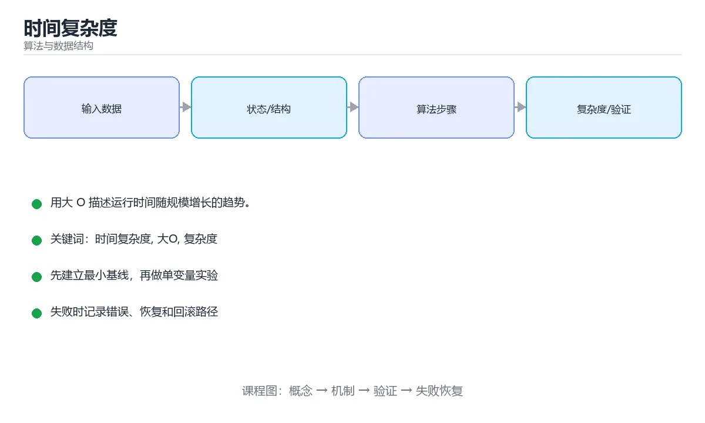

# 时间复杂度



> 内容更新时间：2026-10-03 · 学习阶段：基础 · 预计用时：14 分钟

## 学习目标

- 能用自己的话解释「时间复杂度」解决了什么问题，而不是只背术语。
- 能说清 「时间复杂度」、「大O」、「复杂度」、「空间复杂度」 之间的关系，并分别举出一个例子。
- 能把本课知识放回「算法与数据结构」的知识体系，说明它和相邻主题的边界。
- 能完成本课练习，并用验收标准检查自己的结果。

> 一句话摘要：用大 O 描述运行时间随规模增长的趋势。

## 前置知识

- 先完成上一课《冒泡排序》；如果已经掌握，可以直接用本课练习自测。
- 本课阶段：基础。建议会读写简单代码或命令，并理解变量、输入输出等基本概念。
- 开始前先复习：时间复杂度、大O、复杂度。
- 如果某一步看不懂，先记录具体卡点，完成练习后再回头读一遍。


## 为什么需要复杂度

同一段代码在不同电脑上运行时间不同，所以我们要忽略硬件差异，只描述**运行时间随数据规模增长的趋势**。这就是大 O 表示法。

## 大 O 表示法

```text
O(1) < O(log n) < O(n) < O(n log n) < O(n²) < O(2ⁿ) < O(n!)
```

常见代码与复杂度对照：

```python
# O(1)：执行次数与 n 无关
def first(nums):
    return nums[0]

# O(n)：一次遍历
def total(nums):
    result = 0
    for x in nums:
        result += x
    return result

# O(n²)：嵌套两层循环
def pairs(nums):
    count = 0
    for a in nums:
        for b in nums:
            count += 1
    return count
```

## 如何分析

1. 只看最高阶项，忽略常数和低阶项：`3n² + 5n + 100` 记作 `O(n²)`。
2. 顺序执行取最大的复杂度：先 `O(n)` 再 `O(n²)`，整体是 `O(n²)`。
3. 循环看迭代次数，嵌套循环用乘法。
4. 递归用递推式或递归树分析。

```python
# 对数复杂度：每次规模减半
def count_halving(n):
    steps = 0
    while n > 1:
        n = n // 2
        steps += 1
    return steps      # 约等于 log2(n)
```

## 最好、最坏与平均

以线性查找为例：

```python
def find(nums, target):
    for i, value in enumerate(nums):
        if value == target:
            return i
    return -1
```

- 最好情况：第一个就是目标，`O(1)`。
- 最坏情况：目标在末尾或不存在，`O(n)`。
- 平均情况：约 `O(n)`。

不加说明时，通常讨论**最坏时间复杂度**。

## 空间复杂度

复杂度不只描述时间。额外申请一个长度为 n 的数组，空间复杂度就是 `O(n)`；只用几个变量则是 `O(1)`。

```python
def copy_list(nums):
    return nums[:]        # 额外 O(n) 空间
```

## 复杂度对照与分析方法

| 复杂度 | n=10 | n=1,000 | n=10⁶ | 典型算法 |
| --- | --- | --- | --- | --- |
| O(1) | 1 | 1 | 1 | 哈希查找、数组下标 |
| O(log n) | 4 | 10 | 20 | 二分查找、平衡树 |
| O(n) | 10 | 10³ | 10⁶ | 一次遍历、计数排序 |
| O(n log n) | 33 | 10⁴ | 2×10⁷ | 快排/归并、堆排序 |
| O(n²) | 100 | 10⁶ | 10¹² | 冒泡、双重循环 |
| O(2ⁿ) | 1024 | 爆炸 | 不可行 | 子集枚举、朴素递归 |

经验判断：**n ≤ 20 可用指数级，n ≤ 5000 可用 O(n²)，n ≥ 10⁵ 必须 O(n log n) 及以下**。拿到题目先看数据规模，就能反推需要的复杂度，这是解题最实用的一步。

## 分析方法与常见误判

1. 只保留最高阶项：`3n² + 5n + 100` → O(n²)。
2. 循环看迭代次数，嵌套相乘；但内层依赖外层时要单独分析（如 `for i: for j in range(i)` 是 O(n²/2) = O(n²)）。
3. 递归用递推式：`T(n)=2T(n/2)+O(n)` → O(n log n)；快速排序最坏 `T(n)=T(n-1)+O(n)` → O(n²)。
4. 别忽略隐藏成本：字符串拼接、切片、`in` 判断、哈希冲突、内存分配都可能改变实际复杂度。
5. 均摊分析：动态数组 `append` 单次可能 O(n)，但均摊为 O(1)。

## 本课小结
分析复杂度时，问自己两个问题：**基本操作执行了多少次**、**额外开了多少空间**。


## 复杂度速查表

| 复杂度 | 名称 | n=10³ 量级 | 典型算法 |
| --- | --- | --- | --- |
| O(1) | 常数 | 1 | 哈希查找、数组下标 |
| O(log n) | 对数 | 约 10 | 二分查找、平衡树查找 |
| O(n) | 线性 | 1000 | 一次遍历、前缀和 |
| O(n log n) | 线性对数 | 约 10⁴ | 归并/快排、堆排序 |
| O(n²) | 平方 | 10⁶ | 冒泡/插入排序、双重循环 |
| O(n³) | 立方 | 10⁹ | 朴素矩阵乘法、区间 DP |
| O(2ⁿ) | 指数 | 巨大 | 子集枚举、朴素递归 |
| O(n!) | 阶乘 | 不可行 | 全排列暴力 |

数据结构操作对照：

| 结构 | 访问 | 查找 | 插入 | 删除 |
| --- | --- | --- | --- | --- |
| 数组 | O(1) | O(n) | O(n) | O(n) |
| 链表 | O(n) | O(n) | O(1)（已知位置） | O(1)（已知位置） |
| 哈希表 | 不适用 | 平均 O(1) | 平均 O(1) | 平均 O(1) |
| 平衡树 | O(log n) | O(log n) | O(log n) | O(log n) |
| 堆 | O(1) 取顶 | O(n) | O(log n) | O(log n) 取顶 |

## 数据规模与算法选择

| n 的规模 | 可接受复杂度 | 常见做法 |
| --- | --- | --- |
| ≤ 10 | O(n!) | 全排列、暴力搜索 |
| ≤ 20 | O(2ⁿ) | 状态压缩、子集枚举 |
| ≤ 500 | O(n³) | 区间 DP、Floyd |
| ≤ 5000 | O(n²) | 双重循环、简单 DP |
| ≤ 10⁶ | O(n log n) | 排序、二分、堆 |
| ≤ 10⁸ | O(n) | 一次扫描、前缀和 |

## 分析与优化技巧

| 技巧 | 说明 |
| --- | --- |
| 只看最高阶项 | `3n² + 5n + 100` 记作 O(n²) |
| 忽略常数因子 | `2n` 与 `n` 同阶，但常数在工程中很重要 |
| 嵌套循环相乘、顺序循环相加 | `for i { for j }` 是 O(n·m) |
| 均摊分析 | 动态数组 `append` 单次最坏 O(n)，均摊 O(1) |
| 空间换时间 | 哈希表、缓存、前缀和 |
| 提前终止 | 找到即返回、`any` 短路 |
| 分治降阶 | 归并排序、快速选择 |

```python
import timeit

# 实测比空想更可靠：用 timeit 对比两种写法
setup = "data = list(range(10000))"
loop = "total = 0\nfor x in data:\n    total += x"
builtin = "total = sum(data)"

print(timeit.timeit(loop, setup=setup, number=1000))
print(timeit.timeit(builtin, setup=setup, number=1000))   # 通常快数倍
```

## 常见错误对照表

| 容易写错的做法 | 实际现象 | 原因与正确做法 |
| --- | --- | --- |
| 把 O(2n) 当成 O(n²) | 复杂度判断错误 | 常数因子忽略，`2n` 仍是 O(n) |
| 忽略 Python 内置函数是 C 实现 | 自己写循环反而更慢 | 优先用 `sum`、`sorted`、`in` 等内置 |
| 认为哈希表永远 O(1) | 冲突严重时退化 | 最坏 O(n)，取决于哈希质量与负载因子 |
| 忘记 `in` 在列表上是 O(n) | 循环里嵌套 `in` 导致 O(n²) | 改用 `set` 判断存在性 |
| 用字符串 `+=` 拼接大量内容 | 实际是 O(n²) | 用 `join` 或 `StringBuilder` 等价结构 |
| 只测一次就下结论 | 结果被噪声干扰 | 多轮运行取统计值 |
| 忽略空间复杂度 | 内存溢出 | 同时评估时间与空间 |
| 认为递归一定更慢 | 结论片面 | 递归有栈开销，但可能更简洁；尾递归在部分语言有优化 |
| 忽略输入分布 | 平均与最坏差异巨大 | 明确最坏情况是否可接受 |
| 过早优化 | 代码复杂但收益小 | 先剖析定位真正的热点 |

## 自测清单

- [ ] 能写出常见复杂度并按大小排序。
- [ ] 能根据 n 的规模反推可接受的复杂度。
- [ ] 知道均摊复杂度的含义（动态数组 append）。
- [ ] 会用 `set`/`dict` 把 `in` 判断从 O(n) 降到 O(1)。
- [ ] 优化前先测量，不凭感觉。

## 动手练习


> 本课练习重点：围绕「时间复杂度、大O、复杂度」完成复述、实验和交付，每个结果都要能被别人检查。

先手算 8 个元素的状态变化，再实现并统计操作次数与复杂度。

### 练习 1：建立心智模型（10 分钟）

合上教程，用 3～5 句话回答：

1. 「时间复杂度」解决了什么问题？
2. 如果没有它，会出现什么具体后果？
3. 它和「大O」是什么关系？

**验收标准**：至少出现一个本课关键词，并写出一个反例、边界条件或失效场景。

### 练习 2：做一次可控实验（20 分钟）

从正文中选一个最小示例，完成以下操作：

1. 先预测修改一个参数、输入或步骤后的结果。
2. 再实际执行或逐步推演，记录真实结果。
3. 如果结果与预测不同，写出差异原因。

**验收标准**：留下「原例 → 改动 → 预测 → 结果 → 原因」五步记录。

### 练习 3：交付一个小结果（30 分钟）

给定 8～12 个手工构造的数据，写出每一步状态，并统计比较或交换次数。

任务要求：

- 结果必须能被别人检查，不能只写“我已经理解了”。
- 至少覆盖「时间复杂度」和「大O」两个关键词。
- 写出 1 个仍然不确定的问题，以及下一步如何验证。

> 提示：时间有限时优先做练习 1 和练习 2；练习 3 可以拆成两次完成。


## 考点精讲：把测验题还原成判断过程

本课有 5 个判断点。先自己作答，再看「判断依据」；如果结论正确但理由不完整，回到正文对应章节补足概念。

### 考点 1：表达式 3n² + 5n + 100 用大 O 表示应为？

- **正确判断**：O(n²)
- **判断依据**：大 O 只保留最高阶项并忽略常数系数，因此记作 O(n²)。其他选项：大 O 只保留最高阶项并忽略常数，所以是 O(n²)。O(3n²) 与 O(n²+n) 都不是标准写法。正确项「O(n²)」与题干要求一致，是本课知识点的准确定义。错误项「O(n)」忽略了题目中的限制条件，因此不成立。错误项「O(n² + n)」与课程给出的定义相冲突，不能回答题目所问。把题干「表达式 3n² + 5n + 100 用大 O 表示应为？」放回《时间复杂度》的「用大 O 描述运行时间随规模增长的趋势」语境，逐项对照定义与边界条件，就能排除其余说法。
- **迁移检查**：如果给某个错误选项去掉一个限定词，它会不会变成正确？说明理由。

### 考点 2：每次把问题规模减半的循环，时间复杂度通常是？

- **正确判断**：O(log n)
- **判断依据**：规模每次除以 2，需要 log₂n 次才能降到 1，因此是 O(log n)。其他选项：规模每次减半对应对数复杂度，二分查找与平衡树查找都是这个量级。正确项「O(log n)」描述正确，能够解释题干场景中的现象与结果。错误项「O(n²)」与课程给出的定义相冲突，不能回答题目所问。错误项「O(1)」只看到了表面现象，没有解释题干真正考查的机制。错误项「O(n)」适用于其他场景，但与本题的前提不匹配。把题干「每次把问题规模减半的循环，时间复杂度通常是？」放回《时间复杂度》的「用大 O 描述运行时间随规模增长的趋势」语境，逐项对照定义与边界条件，就能排除其余说法。
- **迁移检查**：遮住选项，只根据定义复述一次答案，再回来看哪个选项与复述一致。

### 考点 3：两层嵌套循环，每层都遍历 n 个元素，时间复杂度是？

- **正确判断**：O(n²)
- **判断依据**：嵌套循环的次数相乘，n × n = n²。其他选项：嵌套循环相乘：n × n = O(n²)。O(2n) 会把两层循环误当成顺序执行。正确项「O(n²)」与题干要求一致，是本课知识点的准确定义。错误项「O(log n)」忽略了题目中的限制条件，因此不成立。错误项「O(n)」属于相邻主题的说法，范围与本题要求不一致。把题干「两层嵌套循环，每层都遍历 n 个元素，时间复杂度是？」放回《时间复杂度》的「用大 O 描述运行时间随规模增长的趋势」语境，逐项对照定义与边界条件，就能排除其余说法。
- **迁移检查**：如果给某个错误选项去掉一个限定词，它会不会变成正确？说明理由。

### 考点 4：n = 10 万时，O(n log n) 与 O(n^2) 的运算量级差约多少倍？

- **正确判断**：约 1000 倍
- **判断依据**：n^2=10^10，n log n 约 1.7x10^6，相差约三个数量级，这正是算法选型的关键。其他选项：n=10 万时 n log n 约 1.7×10⁶，n² 是 10¹⁰，量级差数千倍。10 倍或 2 倍都严重低估。正确项「约 1000 倍」与题干要求一致，是本课知识点的准确定义。错误项「约 2 倍」属于相邻主题的说法，范围与本题要求不一致。错误项「完全相同」把不同概念混在一起，缺少题干限定的前提。错误项「约 10 倍」与课程给出的定义相冲突，不能回答题目所问。把题干「n = 10 万时，O(n log n) 与 O(n^2) 的运算量级差约多少倍？」放回《时间复杂度》的「用大 O 描述运行时间随规模增长的趋势」语境，逐项对照定义与边界条件，就能排除其余说法。
- **迁移检查**：遮住选项，只根据定义复述一次答案，再回来看哪个选项与复述一致。

### 考点 5：动态数组（如 Python list）的 append 单次最坏 O(n)，其均摊复杂度是？

- **正确判断**：O(1)
- **判断依据**：扩容次数与总插入次数成正比，均摊到每次是 O(1)。其他选项：扩容单次虽然 O(n)，但均摊到每次追加仍是 O(1)，所以动态数组可以放心 append。正确项「O(1)」与本课示例和结论一致，可以直接用于实际编码。错误项「O(log n)」只看到了表面现象，没有解释题干真正考查的机制。错误项「O(n log n)」适用于其他场景，但与本题的前提不匹配。把题干「动态数组（如 Python list）的 append 单次最坏 O(n)，其均摊复杂度是？」放回《时间复杂度》的「用大 O 描述运行时间随规模增长的趋势」语境，逐项对照定义与边界条件，就能排除其余说法。
- **迁移检查**：如果给某个错误选项去掉一个限定词，它会不会变成正确？说明理由。

## 本课复习清单

离开本课前，逐项确认：

- [ ] 不看解析，能说出「表达式 3n² + 5n + 100 用大 O 表示应为？」的判断依据。
- [ ] 不看解析，能说出「每次把问题规模减半的循环，时间复杂度通常是？」的判断依据。
- [ ] 不看解析，能说出「两层嵌套循环，每层都遍历 n 个元素，时间复杂度是？」的判断依据。
- [ ] 不看解析，能说出「n = 10 万时，O(n log n) 与 O(n^2) 的运算量级差约多少倍…」的判断依据。
- [ ] 不看解析，能说出「动态数组（如 Python list）的 append 单次最坏 O(n)，其均…」的判断依据。
- [ ] 至少运行一次本课示例，记录输入、输出和一个边界情况。
- [ ] 把本课最容易混淆的两个概念写成一句话对照。

| 复盘项 | 记录 |
| --- | --- |
| 已经能独立解释的考点 |  |
| 仍然说不清的概念 |  |
| 下一步验证动作 |  |

## English Overview

**Title:** Time Complexity

**Summary:** Describe growth rates with Big O notation.

**Category:** Algorithms  
**Level:** 基础  
**Key terms:** 时间复杂度, 大O, 复杂度, 空间复杂度, 性能

> The full tutorial is written in Chinese. This bilingual overview helps English readers identify the topic, scope and key terms before studying the detailed examples.

## 内容元数据

- 内容版本：v2.0
- 最后更新：2026-10-03
- 学习阶段：基础
- 适用环境：任意主流语言（伪代码与复杂度为主）
- 内容来源：内置结构化课程与工程实践整理
- 相关主题：时间复杂度、大O、复杂度、空间复杂度、性能
- 质量版本：P0 测验标准 + P1 覆盖扩展 + P2 体验补全


## Full English Study Guide

### Overview

**Time Complexity** focuses on Describe growth rates with Big O notation.

### Learning Outcomes

- Explain what **Time Complexity** solves and when it should be used.
- Identify inputs, outputs, state and failure boundaries.
- Build a minimal reproducible example and observe the real result.
- Test normal, boundary and failure paths.
- Measure performance, resource cost or security impact before optimizing.
- Document the decision, rollback path and remaining uncertainty.

### Core Mental Model

1. **Problem first:** define the exact problem before choosing a tool or pattern.
2. **Smallest example:** reduce the system to one input and one observable output.
3. **State and flow:** trace how data, control or responsibility moves through the system.
4. **Boundaries:** identify invalid input, resource limits, timeouts and permission edges.
5. **Evidence:** use tests, logs, metrics or reproductions instead of intuition.
6. **Trade-offs:** compare correctness, latency, cost, complexity and operability.

### Step-by-step Study Plan

1. Read the Chinese lesson once and write down the main problem in one sentence.
2. Run the smallest example and save the exact command and output.
3. Change only one input or parameter and predict the result before running it.
4. Introduce one failure and record how the system detects, reports and recovers.
5. Write one test or checklist item for the normal, boundary and failure paths.
6. Complete the quiz and explain every wrong answer in your own words.

### Practice Tasks

- Rebuild the minimal example from an empty directory.
- Add one boundary test and one failure test.
- Produce a short report containing the baseline, change, result and rollback.

### Common Failure Modes

- Treating a happy-path demo as production readiness.
- Skipping boundary values and invalid inputs.
- Optimizing before establishing a measurable baseline.
- Hiding errors, permissions or resource limits.

### Self-check Questions

1. What is the smallest observable result that proves this lesson works?
2. What input or state is most likely to break it?
3. Which metric or test would reveal a regression?
4. What is the rollback path?
5. What is the cost of using this approach at 10x scale?
6. Which adjacent topic is most often confused with this one?

### Glossary

- Topic: **Time Complexity**
- Related terms: 时间复杂度, 大O, 复杂度, 空间复杂度
- Primary evidence: command output, tests, logs, metrics or reproductions

> This guide is an English study companion for the detailed Chinese lesson. It covers the learning path, mental model and acceptance questions; code examples and engineering details remain in the main tutorial.


## Bilingual Section Outline

| 中文小节 | English section |
| --- | --- |
| 学习目标 | Learning objectives |
| 前置知识 | Prerequisites |
| 为什么需要复杂度 | 为什么需要复杂度 |
| 大 O 表示法 | 大 O 表示法 |
| 如何分析 | 如何分析 |
| 最好、最坏与平均 | 最好、最坏与平均 |
| 空间复杂度 | 空间复杂度 |
| 复杂度对照与分析方法 | 复杂度对照与分析方法 |
| 分析方法与常见误判 | 分析方法与常见误判 |
| 本课小结 | Summary |

> 该大纲把每个中文小节映射为英文标题，配合 Full English Study Guide 使用。


## 参考资料与复核

- 最后复核：2026-10-04
- 下次复核：2027-04-04
- 复核范围：版本兼容、API 行为、安全建议与工程实践
- 来源性质：官方文档与标准；本课正文为离线教学重组，不复制原文

| 参考资料 | 本课用途 |
| --- | --- |
| [CP-Algorithms](https://cp-algorithms.com/) | 算法实现与复杂度 |
| [MIT OpenCourseWare 6.006](https://ocw.mit.edu/courses/6-006-introduction-to-algorithms-spring-2020/) | 算法设计与分析 |

> 本课主题：用大 O 描述运行时间随规模增长的趋势。

> App 完全离线展示文字链接，不会自动联网；需要延伸阅读时可复制链接到浏览器。

