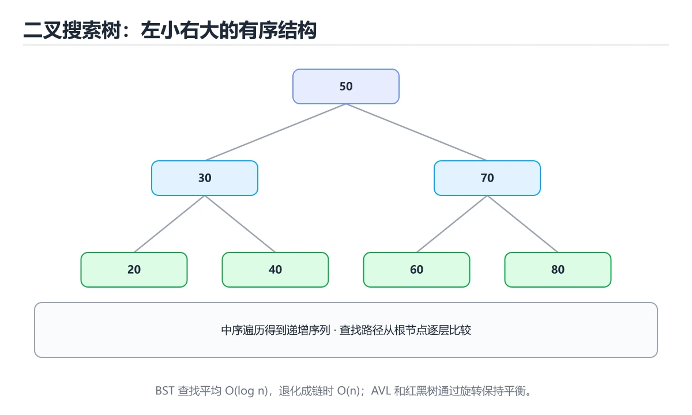
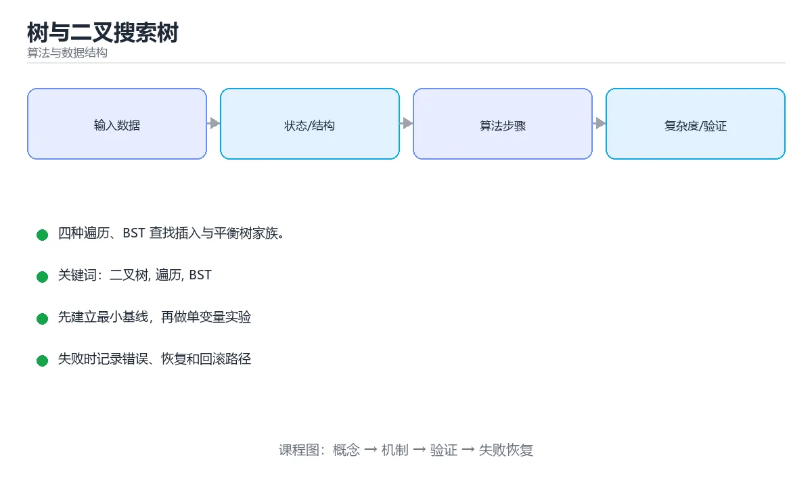

# 本课主题

> 内容更新时间：2026-10-03





## 学习目标

- 能用自己的话解释本课主题解决了什么问题，而不是只背术语。
- 能说清 「二叉树」、「遍历」、「BST」、「红黑树」 之间的关系，并分别举出一个例子。
- 能把本课知识放回「算法与数据结构」的知识体系，说明它和相邻主题的边界。
- 能完成本课练习，并用验收标准检查自己的结果。

> 一句话摘要：四种遍历、BST 查找插入与平衡树家族。

## 前置知识

- 先完成上一课《链表》；如果已经掌握，可以直接用本课练习自测。
- 本课阶段：进阶。建议先掌握同一分类的基础课程，并能独立运行正文中的最小示例。
- 开始前先复习：二叉树、遍历、BST。
- 如果某一步看不懂，先记录具体卡点，完成练习后再回头读一遍。

## 二叉树基础

每个节点最多两个子节点（left / right）。常见术语：根节点、叶子节点、深度、高度、子树。

```python
class TreeNode:
    def __init__(self, value, left=None, right=None):
        self.value = value
        self.left = left
        self.right = right
```

## 四种遍历

```python
def preorder(node):        # 根 -> 左 -> 右
    if not node:
        return []
    return [node.value] + preorder(node.left) + preorder(node.right)

def inorder(node):         # 左 -> 根 -> 右：二叉搜索树得到升序
    if not node:
        return []
    return inorder(node.left) + [node.value] + inorder(node.right)

def postorder(node):       # 左 -> 右 -> 根：适合释放资源
    if not node:
        return []
    return postorder(node.left) + postorder(node.right) + [node.value]

from collections import deque

def level_order(root):     # 层序遍历（BFS）
    if not root:
        return []
    result, queue = [], deque([root])
    while queue:
        level = []
        for _ in range(len(queue)):
            node = queue.popleft()
            level.append(node.value)
            if node.left:
                queue.append(node.left)
            if node.right:
                queue.append(node.right)
        result.append(level)
    return result
```

## 二叉搜索树（BST）

性质：任意节点的左子树全部小于它，右子树全部大于它。

```python
def search(node, target):
    while node:
        if target == node.value:
            return node
        node = node.left if target < node.value else node.right
    return None

def insert(node, value):
    if not node:
        return TreeNode(value)
    if value < node.value:
        node.left = insert(node.left, value)
    elif value > node.value:
        node.right = insert(node.right, value)
    return node
```

平均查找 `O(log n)`，但插入有序数据会退化成链表，最坏 `O(n)`。

## 平衡树家族

| 结构 | 特点 |
| --- | --- |
| AVL 树 | 严格平衡，查找快，旋转较频繁 |
| 红黑树 | 近似平衡，插入删除代价低（Java TreeMap、C++ map） |
| B / B+ 树 | 多路平衡，磁盘友好（数据库索引） |
| 堆 | 完全二叉树，取最值 O(1)，常配合优先队列 |

## 本课小结
树的价值在于**分层与对数复杂度**。掌握四种遍历与 BST 查找插入，再看平衡树与堆就不会吃力。

## 遍历速查

| 遍历 | 顺序 | 典型用途 | 实现方式 |
| --- | --- | --- | --- |
| 前序 | 根 → 左 → 右 | 复制树、序列化 | 递归 / 栈 |
| 中序 | 左 → 根 → 右 | BST 得到升序序列 | 递归 / 栈 |
| 后序 | 左 → 右 → 根 | 释放树、计算子树聚合 | 递归 / 栈 |
| 层序 | 逐层从左到右 | 求深度、按层处理 | 队列 |

```python
from collections import deque

class TreeNode:
    __slots__ = ("value", "left", "right")

    def __init__(self, value, left=None, right=None):
        self.value, self.left, self.right = value, left, right

def inorder(root):
    """迭代版中序遍历：BST 上得到升序序列。"""
    result, stack = [], []
    cur = root
    while cur or stack:
        while cur:              # 一路向左压栈
            stack.append(cur)
            cur = cur.left
        cur = stack.pop()
        result.append(cur.value)
        cur = cur.right
    return result

def level_order(root):
    """层序遍历，按层返回列表。"""
    if not root:
        return []
    levels, queue = [], deque([root])
    while queue:
        level = []
        for _ in range(len(queue)):     # 固定当前层长度
            node = queue.popleft()
            level.append(node.value)
            if node.left:
                queue.append(node.left)
            if node.right:
                queue.append(node.right)
        levels.append(level)
    return levels

def insert(root, value):
    """BST 插入：小于走左、大于走右，重复值不插入。"""
    if root is None:
        return TreeNode(value)
    if value < root.value:
        root.left = insert(root.left, value)
    elif value > root.value:
        root.right = insert(root.right, value)
    return root
```

## BST 操作与平衡

| 操作 | 平均 | 最坏（退化成链） |
| --- | --- | --- |
| 查找 | O(log n) | O(n) |
| 插入 | O(log n) | O(n) |
| 删除 | O(log n) | O(n) |
| 中序遍历 | O(n) | O(n) |

| 平衡结构 | 平衡条件 | 特点 |
| --- | --- | --- |
| AVL 树 | 左右子树高度差 ≤ 1 | 查询更快，旋转更频繁 |
| 红黑树 | 颜色性质约束黑高 | 插入删除旋转少，工程常用 |
| B+ 树 | 多路平衡 | 磁盘索引，扇出大、树矮 |

## 常见错误对照表

| 容易写错的做法 | 实际现象 | 原因与正确做法 |
| --- | --- | --- |
| 有序数据依次插入 BST | 退化成链表，O(n) | 使用平衡树或先打乱插入 |
| 层序遍历不固定层长度 | 无法区分层级 | `for _ in range(len(queue))` |
| 删除双子节点直接删除 | 树结构被破坏 | 用中序后继或前驱替换后再删 |
| 递归遍历没有终止条件 | 无限递归 | 以 `if not node: return` 开头 |
| 递归深度过大 | 栈溢出 | 树很深时改迭代或增大栈 |
| 认为 BST 一定平衡 | 最坏性能退化 | 明确是「平均」还是「保证」 |
| 用 `<=` 插入重复值 | 重复元素堆在同一侧 | 明确重复值策略（计数、丢弃、右子树） |
| 释放树用前序 | 访问已释放节点 | 用后序或迭代 |
| 遍历时修改树结构 | 行为不确定 | 先收集结果再修改 |
| 用数组下标表示任意二叉树 | 稀疏树浪费大量空间 | 用节点指针或哈希表 |

## 自测清单

- [ ] 能写出三种深度优先遍历的递归与迭代版本。
- [ ] 层序遍历会按层分组。
- [ ] 知道 BST 退化场景与平衡树的作用。
- [ ] 删除双子节点用中序后继替换。
- [ ] 知道数据库索引用 B+ 树而非二叉树的原因。

## 动手练习

> 本课练习重点：围绕「二叉树、遍历、BST」完成复述、实验和交付，每个结果都要能被别人检查。

先手算 8 个元素的状态变化，再实现并统计操作次数与复杂度。

### 练习 1：建立心智模型（10 分钟）

合上教程，用 3～5 句话回答：

1. 本课主题解决了什么问题？
2. 如果没有它，会出现什么具体后果？
3. 它和「遍历」是什么关系？

**验收标准**：至少出现一个本课关键词，并写出一个反例、边界条件或失效场景。

### 练习 2：做一次可控实验（20 分钟）

从正文中选一个最小示例，完成以下操作：

1. 先预测修改一个参数、输入或步骤后的结果。
2. 再实际执行或逐步推演，记录真实结果。
3. 如果结果与预测不同，写出差异原因。

**验收标准**：留下「原例 → 改动 → 预测 → 结果 → 原因」五步记录。

### 练习 3：交付一个小结果（30 分钟）

给定 8～12 个手工构造的数据，写出每一步状态，并统计比较或交换次数。

任务要求：

- 结果必须能被别人检查，不能只写“我已经理解了”。
- 至少覆盖「二叉树」和「遍历」两个关键词。
- 写出 1 个仍然不确定的问题，以及下一步如何验证。

> 提示：时间有限时优先做练习 1 和练习 2；练习 3 可以拆成两次完成。

## 可运行练习

### 任务 1：先跑通，再解释

```python
class TreeNode:
    def __init__(self, value, left=None, right=None):
        self.value = value
        self.left = left
        self.right = right
```

### 任务 2：只改一个条件

### 任务 3：迁移到自己的数据

用同一套思路处理一组你自己的数据或场景，保持输出格式与任务 1 一致。

## 故障现场

### 现场 1：本课的 二叉树 常规用例通过，但边界用例失败

**症状**：在本课的练习或生产场景里出现“本课的 二叉树 常规用例通过，但边界用例失败”。

**复现**：准备一组最小输入，只保留触发“本课的 二叉树 常规用例通过，但边界用例失败”的必要条件，连续运行两次确认结果稳定。

**定位**：围绕“二叉树 的前置条件与取值边界没有写进代码，默认值掩盖了空值和极值”检查调用链、输入数据和环境配置，先验证假设再改代码。

**预防**：把“本课的 二叉树 常规用例通过，但边界用例失败”写成一条自动化用例，并在本课的验收清单里保留对应检查项。

### 现场 2：本课的 遍历 结果在两次运行之间不一致

**症状**：在本课的练习或生产场景里出现“本课的 遍历 结果在两次运行之间不一致”。

**复现**：准备一组最小输入，只保留触发“本课的 遍历 结果在两次运行之间不一致”的必要条件，连续运行两次确认结果稳定。

**定位**：围绕“遍历 依赖了当前版本、执行顺序或共享状态，单次运行无法暴露差异”检查调用链、输入数据和环境配置，先验证假设再改代码。

**预防**：把“本课的 遍历 结果在两次运行之间不一致”写成一条自动化用例，并在本课的验收清单里保留对应检查项。

### 现场 3：小数据规模结果正确，扩大输入后超时或内存溢出

**定位**：围绕“二叉树 的时间或空间复杂度在边界条件下失控，遍历 的常数开销也被低估”检查调用链、输入数据和环境配置，先验证假设再改代码。

## 本课复习清单

离开本课前，逐项确认：

- [ ] 不看解析，能说出「对二叉搜索树做哪种遍历能得到升序序列？」的判断依据。
- [ ] 不看解析，能说出「层序遍历需要借助哪种数据结构？」的判断依据。
- [ ] 不看解析，能说出「向二叉搜索树依次插入有序数据会怎样？」的判断依据。
- [ ] 不看解析，能说出「平衡二叉搜索树能把查找、插入、删除的复杂度控制在？」的判断依据。
- [ ] 不看解析，能说出「删除二叉搜索树中「有两个孩子」的节点，常用做法是？」的判断依据。
- [ ] 至少运行一次本课示例，记录输入、输出和一个边界情况。
- [ ] 把本课最容易混淆的两个概念写成一句话对照。

| 复盘项 | 记录 |
| --- | --- |
| 已经能独立解释的考点 |  |
| 仍然说不清的概念 |  |
| 下一步验证动作 |  |

## 术语速查

| 术语 | 本课语境 |
| --- | --- |
| `O(log n)` | 平均查找 `O(log n)`，但插入有序数据会退化成链表，最坏 `O(n)`。 |
| `O(n)` | 平均查找 `O(log n)`，但插入有序数据会退化成链表，最坏 `O(n)`。 |
| `for _ in range(len(queue))` | \| 层序遍历不固定层长度 \| 无法区分层级 \| `for _ in range(len(queue))` \| |
| `if not node: return` | \| 递归遍历没有终止条件 \| 无限递归 \| 以 `if not node: return` 开头 \| |
| `<=` | \| 用 `<=` 插入重复值 \| 重复元素堆在同一侧 \| 明确重复值策略（计数、丢弃、右子树） \| |
| `，判断时要把题干限定的输入、边界与目标逐项对齐。本课示例中还能看到` | 判断依据**：正确答案是「range」，这道题在问补全代码：本课主题示例中，下面这行代码缺少哪个…in____(len(queue)):`，判断时要把题干限定的输入、边界与目标逐项对齐。本课示例中还能看到 `for… |

## 考点精讲

### 考点 1：对二叉搜索树做哪种遍历能得到升序序列？

- **判断依据**：中序遍历顺序是左-根-右，正好符合 BST 左小右大的性质。其他选项：中序遍历按「左、根、右」访问，正好得到升序。判断这类题时，要把「中序」放回题干限定的对象、输入和边界，「前序」、「后序」 等说法虽然包含相关术语，但范围或前提与本题不一致。

### 考点 2：层序遍历需要借助哪种数据结构？

- **判断依据**：层序是广度优先，用队列保证按层顺序访问。其他选项：层序需要先进先出，因此用队列。作答时，先用二叉树建立输入与输出的基线，再把队列代入边界条件核对，结论才能复现。解题的关键不是记住孤立术语，而是确认「队列」是否完整覆盖题干的输入、输出和失败路径，并排除「堆」、「哈希表」这类相邻概念。

### 考点 3：下面这段 Python 代码复现了“树与二叉搜索树”中 二叉树、遍历、BST 相关的一个常见故障，哪一项最准确地解释了问题？

- **判断依据**：符合题干条件的是「默认参数 bucket=[] 只在定义时创建一次，两次调用共享同一个列表」。符合题干条件的是默认参数 bucket=[] 只在定义时创建一次，两次调用共享同一个列表（treebst 第 3 题）。在这个复现里，第二次调用看到的是 二叉树 留下的内容。在这个复现里，把 遍历 相关的默认值改成 None，并在函数体内按需创建新列表，才能让每次调用都从干净状态开始。

### 考点 4：围绕“树与二叉搜索树”中的 二叉树、遍历、BST，下列哪两项是本课强调的实践判断？

- **判断依据**：正确答案包括「学习 二叉树 时要同时说明输入、输出和失败路径，不能只看正常流程」、「验证 遍历 时要固定版本并覆盖边界输入，结论才可复现」。结论应落在学习 二叉树 时要同时说明输入、输出和失败路径。本课把本课主题拆成概念、示例与故障现场三部分，因此判断 二叉树 时必须同时交代输入、输出和失败路径，这使“学习 二叉树 时要同时说明输入、输出和失败路径，不能只看正常流程”成立。在本课主题里，判断 遍历 时要固定版本与边界输入，所以“验证 遍历 时要固定版本并覆盖边界输入，结论才可复现”才可复现。

### 考点 5：删除二叉搜索树中「有两个孩子」的节点，常用做法是？

- **判断依据**：正确答案是「用中序后继（右子树最小）或中序前驱替换后递归删除」。替换后仍满足 BST 的有序性质，是标准的删除实现。判断这类题时，要把「用中序后继（右子树最小）或中序前驱替换后递归删除」放回题干限定的对象、输入和边界，「直接删除并断开子树（仅部分场景成立）」、「整棵树重建」 等说法虽然包含相关术语，但范围或前提与本题不一致。

### 考点 6：补全代码：「树与二叉搜索树」示例中，下面这行代码缺少哪个关键字或函数名？请填入 ____。

`for _ in ____(len(queue)):`

- **判断依据**：围绕 补全代码：本课主题示例中，下面这行代码缺少哪个关键字或函数… 作答时，先用二叉树建立输入与输出的基线，再把range代入边界条件核对，结论才能复现。解题的关键不是记住孤立术语，而是确认「range」是否完整覆盖题干的输入、输出和失败路径，并排除这类相邻概念。

## English Overview

**Title:** Trees & BST

**Summary:** Traversals, BST operations and balanced trees.

**Category:** Algorithms
**Level:** 进阶
**Key terms:** 二叉树, 遍历, BST, 红黑树, 堆

## 内容元数据

- 内容版本：v2.0
- 最后更新：2026-10-03
- 学习阶段：进阶
- 适用环境：任意主流语言（伪代码与复杂度为主）
- 内容来源：内置结构化课程与工程实践整理
- 相关主题：二叉树、遍历、BST、红黑树、堆
- 质量版本：P0 测验标准 + P1 覆盖扩展 + P2 体验补全


## 参考资料与复核

- 最后复核：2026-10-04
- 下次复核：2027-04-04
- 复核范围：版本兼容、API 行为、安全建议与工程实践
- 来源性质：官方文档、标准或权威教材；正文为离线教学重组

| 参考资料 | 本课用途 |
| --- | --- |
| [Princeton Algorithms](https://algs4.cs.princeton.edu/home/) | 经典算法与数据结构教材 |
| [VisuAlgo](https://visualgo.net/en) | 算法可视化与交互 |
| [MIT 6.006](https://ocw.mit.edu/courses/6-006-introduction-to-algorithms-spring-2020/) | 算法设计与分析 |

> 「树与二叉搜索树」的链接用于离线阅读后的延伸核对；App 不会自动联网。

## 复习与迁移

- 围绕「对二叉搜索树做哪种遍历能得到升序序列？」做迁移时，先记录输入、边界和预期，再观察二叉树对结果的影响，并用「中序」解释正常与失败路径。
- 把遍历放进最小实验：固定版本和输入，只改变一个条件，记录输出差异，并说明「队列」在什么前提下成立。
- 复习「下面这段 Python 代码复现了本课主题中 二叉树、遍历、BST 相关的一个常见故障，哪一项最…」时，不要只背结论；用BST的边界值复现一次，再把现象、原因和修复写成三步记录。

<!-- p0p1-review:start -->
## 复习与迁移

- 围绕「对二叉搜索树做哪种遍历能得到升序序列？」做迁移时，先记录输入、边界和预期，再观察二叉树对结果的影响，并用「中序」解释正常与失败路径。
- 把遍历放进最小实验：固定版本和输入，只改变一个条件，记录输出差异，并说明「队列」在什么前提下成立。
- 复习「下面这段 Python 代码复现了本课主题中 二叉树、遍历、BST 相关的一个常见故障，哪一项最…」时，不要只背结论；用BST的边界值复现一次，再把现象、原因和修复写成三步记录。
- 如果把红黑树换成空值、极值或并发输入，「学习 二叉树 时要同时说明输入、输出和失败路径，不能只看正常流程；验证 遍历 时要固…」是否仍然成立？写出验证命令和观察到的结果。
- 围绕「删除二叉搜索树中「有两个孩子」的节点，常用做法是？」做迁移时，先记录输入、边界和预期，再观察堆对结果的影响，并用「用中序后继（右子树最小）或中序前驱替换后递归删除」解释正常与失败路径。
- 把二叉树放进最小实验：固定版本和输入，只改变一个条件，记录输出差异，并说明「range」在什么前提下成立。
- 复习「对二叉搜索树做哪种遍历能得到升序序列？」时，不要只背结论；用遍历的边界值复现一次，再把现象、原因和修复写成三步记录。
<!-- p0p1-review:end -->
