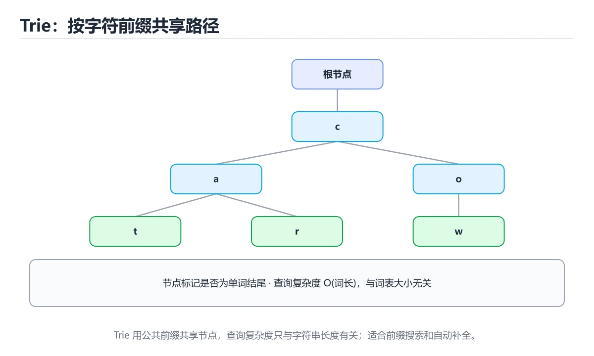

# 字典树（Trie）

> 内容更新时间：2026-10-06




## 学习目标

- 能用自己的话解释字典树（Trie）解决了什么问题，而不是只背术语。
- 能说清 「字典树」、「Trie」、「前缀」、「自动补全」 之间的关系，并分别举出一个例子。
- 能把本课知识放回「算法与数据结构」的知识体系，说明它和相邻主题的边界。
- 能完成本课练习，并用验收标准检查自己的结果。

> 一句话摘要：前缀树结构、搜索联想与 Trie vs 哈希表。

## 前置知识

- 先完成上一课《并查集》；如果已经掌握，可以直接用本课练习自测。
- 本课阶段：进阶。建议先掌握同一分类的基础课程，并能独立运行正文中的最小示例。
- 开始前先复习：字典树、Trie、前缀。
- 如果某一步看不懂，先记录具体卡点，完成练习后再回头读一遍。

## 结构与特点

字典树把字符串按字符逐层存储，公共前缀只存一份。查找、插入的时间复杂度都是 `O(L)`（L 为字符串长度），与词典规模无关。

```text
插入 cat、car、dog 后：
        root
       /    \
      c      d
      |      |
      a      o
     / \     |
    t   r    g
   (end)(end)(end)
```

## 实现

```python
class TrieNode:
    __slots__ = ("children", "is_end", "count")
    def __init__(self):
        self.children = {}
        self.is_end = False      # 是否是某个单词的结尾
        self.count = 0           # 经过该节点的单词数（用于前缀统计）

class Trie:
    def __init__(self):
        self.root = TrieNode()

    def insert(self, word: str) -> None:
        node = self.root
        for ch in word:
            node = node.children.setdefault(ch, TrieNode())
            node.count += 1
        node.is_end = True

    def search(self, word: str) -> bool:
        node = self._walk(word)
        return node is not None and node.is_end

    def starts_with(self, prefix: str) -> bool:
        return self._walk(prefix) is not None

    def count_prefix(self, prefix: str) -> int:
        node = self._walk(prefix)
        return node.count if node else 0

    def _walk(self, text: str):
        node = self.root
        for ch in text:
            if ch not in node.children:
                return None
            node = node.children[ch]
        return node
```

用 `__slots__` 可以显著减少大量节点带来的内存开销。

## 典型应用

| 场景 | 说明 |
| --- | --- |
| 搜索联想 | 输入前缀返回候选词（按 count 排序） |
| 拼写检查 | 判断是否为合法单词，或找最接近的前缀 |
| IP 路由 | 二进制 Trie 做最长前缀匹配 |
| 敏感词过滤 | 一次扫描文本匹配多模式（Aho-Corasick 是 Trie 的扩展） |
| 异或最大值 | 01-Trie 按位贪心求最大异或对 |

## 用 Trie 实现搜索联想

```python
def suggest(trie: Trie, prefix: str, limit: int = 5):
    node = trie._walk(prefix)
    if node is None:
        return []
    results = []
    def dfs(current, path):
        if len(results) >= limit:
            return
        if current.is_end:
            results.append(prefix + path)
        for ch in sorted(current.children):
            dfs(current.children[ch], path + ch)
    dfs(node, "")
    return results
```

## 与哈希表的对比

| 对比 | 哈希表 | 字典树 |
| --- | --- | --- |
| 精确查找 | O(1) 平均 | O(L) |
| 前缀查询 | 不支持（需全量扫描） | 天然支持 |
| 内存 | 小 | 大（指针开销明显） |
| 有序遍历 | 需额外排序 | 按字符顺序天然有序 |

实践建议：只需要精确查找用哈希表；需要前缀、自动补全、多模式匹配时再上 Trie。

## 本课小结
字典树的本质是**用空间换前缀信息**。抓住「节点表示前缀、`is_end` 表示单词结尾」这两点，插入、查找、前缀统计都能快速写出。

## 模板

```python
class Trie:
    """前缀树：支持插入、整词查询与前缀查询。"""

    def __init__(self):
        # 子节点用字典，字符集大时比定长数组省空间
        self.root = {"children": {}, "is_end": False, "count": 0}

    def insert(self, word: str) -> None:
        node = self.root
        for ch in word:
            node = node["children"].setdefault(
                ch, {"children": {}, "is_end": False, "count": 0}
            )
            node["count"] += 1          # 记录经过次数，可用于前缀统计
        node["is_end"] = True

    def search(self, word: str) -> bool:
        node = self._walk(word)
        return bool(node and node["is_end"])

    def starts_with(self, prefix: str) -> bool:
        return self._walk(prefix) is not None

    def count_prefix(self, prefix: str) -> int:
        node = self._walk(prefix)
        return node["count"] if node else 0

    def _walk(self, text: str):
        node = self.root
        for ch in text:
            node = node["children"].get(ch)
            if node is None:
                return None
        return node

def find_word(board, word: str) -> bool:
    """单词搜索 II 的基础：Trie + DFS 回溯，避免重复扫描前缀。"""
    trie = Trie()
    trie.insert(word)
    rows, cols = len(board), len(board[0])
    path = set()

    def dfs(r, c, node):
        if r < 0 or r >= rows or c < 0 or c >= cols:
            return False
        if (r, c) in path:
            return False
        ch = board[r][c]
        nxt = node["children"].get(ch)
        if nxt is None:
            return False
        if nxt["is_end"]:
            return True
        path.add((r, c))
        found = (
            dfs(r + 1, c, nxt) or dfs(r - 1, c, nxt)
            or dfs(r, c + 1, nxt) or dfs(r, c - 1, nxt)
        )
        path.discard((r, c))
        return found

    return any(dfs(r, c, trie.root) for r in range(rows) for c in range(cols))
```

## 变体与应用速查

| 变体 | 说明 |
| --- | --- |
| 压缩 Trie（radix tree） | 把单链合并成一个节点，省空间 |
| 双数组 Trie | 用两个数组实现，查询快、构建复杂 |
| 后缀 Trie / 后缀树 | 处理子串查询、最长重复子串 |
| AC 自动机 | Trie + 失配指针，多模式串匹配 |
| 0-1 Trie | 按二进制位建树，求最大异或对 |

| 应用 | 说明 |
| --- | --- |
| 自动补全 | 按前缀遍历子树 |
| 拼写检查 | 前缀匹配 + 编辑距离 |
| IP 路由（前缀匹配） | 最长前缀匹配 |
| 敏感词过滤 | AC 自动机实现线性扫描 |
| 词频统计 | 节点上记录计数 |

## 常见错误对照表

| 容易写错的做法 | 实际现象 | 原因与正确做法 |
| --- | --- | --- |
| 用完整字符串比较代替 Trie | 前缀查询退化 | 需要前缀能力时用 Trie |
| 忘记 `is_end` 标记 | 无法区分「单词」与「前缀」 | 结尾节点单独标记 |
| 定长数组建 26 叉树处理 Unicode | 内存爆炸 | 用哈希表存子节点 |
| 只支持小写字母却输入大写 | 查不到 | 统一大小写或扩充字符集 |
| 需要精确查找却用 Trie | 空间开销更大 | 精确查找优先哈希表 |
| DFS 搜索不回退访问标记 | 结果错误或死循环 | 成对加入与移除 |
| 前缀统计算法用错字段 | 计数不准 | 在节点上维护 `count` |
| 删除元素直接删节点 | 破坏其他单词 | 需要引用计数或标记删除 |
| 建树后修改词库 | 一致性丢失 | 明确重建时机 |
| 忽略序列化需求 | 进程重启后丢失 | 需要持久化时序列化或改用其他结构 |

## 自测清单

- [ ] 能实现 insert / search / startsWith / countPrefix。
- [ ] 知道 Trie 查询复杂度是 O(L)，与词库大小无关。
- [ ] 了解压缩 Trie、0-1 Trie 与 AC 自动机的用途。
- [ ] 精确查找场景优先选哈希表。
- [ ] 词库频繁变更时明确重建或增量更新策略。

## 动手练习

> 本课练习重点：围绕「字典树、Trie、前缀」完成复述、实验和交付，每个结果都要能被别人检查。

先手算 8 个元素的状态变化，再实现并统计操作次数与复杂度。

### 练习 1：建立心智模型（10 分钟）

合上教程，用 3～5 句话回答：

1. 字典树（Trie）解决了什么问题？
2. 如果没有它，会出现什么具体后果？
3. 它和「Trie」是什么关系？

**验收标准**：至少出现一个本课关键词，并写出一个反例、边界条件或失效场景。

### 练习 2：做一次可控实验（20 分钟）

从正文中选一个最小示例，完成以下操作：

1. 先预测修改一个参数、输入或步骤后的结果。
2. 再实际执行或逐步推演，记录真实结果。
3. 如果结果与预测不同，写出差异原因。

**验收标准**：留下「原例 → 改动 → 预测 → 结果 → 原因」五步记录。

### 练习 3：交付一个小结果（30 分钟）

给定 8～12 个手工构造的数据，写出每一步状态，并统计比较或交换次数。

任务要求：

- 结果必须能被别人检查，不能只写“我已经理解了”。
- 至少覆盖「字典树」和「Trie」两个关键词。
- 写出 1 个仍然不确定的问题，以及下一步如何验证。

> 提示：时间有限时优先做练习 1 和练习 2；练习 3 可以拆成两次完成。

## 可运行练习

### 任务 1：先跑通，再解释

```python
def suggest(trie: Trie, prefix: str, limit: int = 5):
    node = trie._walk(prefix)
    if node is None:
        return []
    results = []
    def dfs(current, path):
        if len(results) >= limit:
            return
        if current.is_end:
            results.append(prefix + path)
        for ch in sorted(current.children):
            dfs(current.children[ch], path + ch)
    dfs(node, "")
    return results
```

### 任务 2：只改一个条件

把「字典树（Trie）」的最小示例复制一份，只改一个条件再跑一次：

- 改动点：只把字典树的输入换成空值、极值或错误输入，其余保持不变。
- 预测：先写下「字典树（Trie）」在改动后的输出或错误信息，再运行。
- 记录：对照改动前后的结果，指出差异出在哪一步。
- 验收：换回原条件能复现原结果，改动只影响字典树。

### 任务 3：迁移到自己的数据

用同一套思路处理一组你自己的数据或场景，保持输出格式与任务 1 一致。

## 故障现场

### 现场 1：本课的 字典树 常规用例通过，但边界用例失败

**症状**：在本课的练习或生产场景里出现“本课的 字典树 常规用例通过，但边界用例失败”。

**复现**：准备一组最小输入，只保留触发“本课的 字典树 常规用例通过，但边界用例失败”的必要条件，连续运行两次确认结果稳定。

**定位**：围绕“字典树 的前置条件与取值边界没有写进代码，默认值掩盖了空值和极值”检查调用链、输入数据和环境配置，先验证假设再改代码。

**预防**：把“本课的 字典树 常规用例通过，但边界用例失败”写成一条自动化用例，并在本课的验收清单里保留对应检查项。

### 现场 2：本课的 Trie 结果在两次运行之间不一致

**症状**：在本课的练习或生产场景里出现“本课的 Trie 结果在两次运行之间不一致”。

**复现**：准备一组最小输入，只保留触发“本课的 Trie 结果在两次运行之间不一致”的必要条件，连续运行两次确认结果稳定。

**定位**：围绕“Trie 依赖了当前版本、执行顺序或共享状态，单次运行无法暴露差异”检查调用链、输入数据和环境配置，先验证假设再改代码。

**预防**：把“本课的 Trie 结果在两次运行之间不一致”写成一条自动化用例，并在本课的验收清单里保留对应检查项。

### 现场 3：小数据规模结果正确，扩大输入后超时或内存溢出

**定位**：围绕“字典树 的时间或空间复杂度在边界条件下失控，Trie 的常数开销也被低估”检查调用链、输入数据和环境配置，先验证假设再改代码。

## 本课复习清单

离开本课前，逐项确认：

- [ ] 不看解析，能说出「字典树相比哈希表的核心优势是？」的判断依据。
- [ ] 不看解析，能说出「节点上的 is_end 标记表示？」的判断依据。
- [ ] 不看解析，能说出「只需要精确查找、不需要前缀能力时，应优先选择？」的判断依据。
- [ ] 不看解析，能说出「Trie 的空间开销主要来自哪里？」的判断依据。
- [ ] 不看解析，能说出「在 Trie 中查询长度为 L 的字符串的复杂度是？」的判断依据。
- [ ] 至少运行一次本课示例，记录输入、输出和一个边界情况。
- [ ] 把本课最容易混淆的两个概念写成一句话对照。

| 复盘项 | 记录 |
| --- | --- |
| 已经能独立解释的考点 |  |
| 仍然说不清的概念 |  |
| 下一步验证动作 |  |

## 术语速查

把「字典树（Trie）」里反复出现的术语集中放在一起。复习时先遮住右列，尝试用自己的话解释，再回到正文核对。

| 术语 | 本课语境 |
| --- | --- |
| `字典树` | 围绕“字典树 的时间或空间复杂度在边界条件下失控，Trie 的常数开销也被低估”检查调用链、输入数据和环境配置，先验证假设再改代码。 |
| `Trie` | 围绕“字典树 的时间或空间复杂度在边界条件下失控，Trie 的常数开销也被低估”检查调用链、输入数据和环境配置，先验证假设再改代码。 |
| `前缀` | 它在「字典树（Trie）」里是理解「前缀」的关键术语，用来解释定义、适用条件与失败路径；它与字典树、Trie共同决定这一节的判断边界。复习时回到正文示例核对输入、输出和验证方式。 |
| `自动补全` | 实践建议：只需要精确查找用哈希表；需要前缀、自动补全、多模式匹配时再上 Trie。 |
| `多模式匹配` | 它在「字典树（Trie）」里是理解「多模式匹配」的关键术语，用来解释定义、适用条件与失败路径；它与字典树、Trie共同决定这一节的判断边界。复习时回到正文示例核对输入、输出和验证方式。 |

## 考点精讲

### 考点 1：多选辨析·字典树

- **题目**：围绕“字典树（Trie）”中的 字典树、Trie、前缀，下列哪两项是本课强调的实践判断？
- **判断依据**：本课把字典树（Trie）拆成概念、示例与故障现场三部分，因此判断 字典树 时必须同时交代输入、输出和失败路径，这使“学习 字典树 时要同时说明输入、输出和失败路径，不能只看正常流程”成立。在字典树（Trie）里，判断 Trie 时要固定版本与边界输入，所以“验证 Trie 时要固定版本并覆盖边界输入，结论才可复现”才可复现。

### 考点 2：概念判断·字典树

- **题目**：节点上的 is_end 标记表示？
- **判断依据**：查找单词时必须同时满足路径存在且 isend 为真。在「字典树（Trie）」里，作答时，先用字典树建立输入与输出的基线，再把该节点是一个单词的结尾代入边界条件核对，结论才能复现。「字典树（Trie）」要求先交代字典树、Trie、前缀的前提再下结论，所以“该节点是一个单词的结尾”只在题干“节点上的 isend 标记表示”给定的条件下成立。

### 考点 3：代码补全·字典树

- **题目**：下面这段 Python 代码摘自「字典树（Trie）」的正文示例。关于这段代码，下面哪一项说法与实际内容相符？
- **判断依据**：在「字典树（Trie）」里，题干的正确项是这段代码包含循环结构，同一段逻辑会被重复执行，在「字典树（Trie）」里循环次数与字典树的输入规模直接相关。把输入或边界换成空值、极值或失败情况后，结论要以「字典树（Trie）」的实际运行结果为准。把“这段代码包含循环结构”代回「字典树（Trie）」里“下面这段 Python 代码摘自字典树（Trie）的正文示例”的例子核对，条件一旦改变，结论就要用字典树、Trie、前缀重新推导。

### 考点 4：概念判断·字典树

- **题目**：Trie 的空间开销主要来自哪里？
- **判断依据**：可用压缩 Trie（radix tree）或数组/位图代替哈希表来降低开销。作答时，先用字典树建立输入与输出的基线，再把节点数量多代入边界条件核对，结论才能复现。这道题要求区分概念与边界，「节点数量多」只有在题干给出的前提下才成立，而「需要额外排序」、「需要哈希计算」缺少同一组条件。

### 考点 5：概念判断·字典树

- **题目**：在 Trie 中查询长度为 L 的字符串的复杂度是？
- **判断依据**：在「字典树（Trie）」里，O(L)，与词库大小无关。逐字符沿边下行即可，这个特性让 Trie 非常适合前缀联想与自动补全。这道题的关键在「字典树（Trie）」的字典树、Trie、前缀：先确认题干“在 Trie 中查询长度为 L 的字”问的是哪一步，再排除偷换前提的选项。

### 考点 6：填空·trie.____(word)

- **题目**：补全代码：「字典树（Trie）」示例中，下面这行代码缺少哪个关键字或函数名？请填入 ____。 `trie.____(word)`
- **判断依据**：这道题的关键在「字典树（Trie）」的字典树、Trie、前缀：先确认题干“补全代码”问的是哪一步，再排除偷换前提的选项。「字典树（Trie）」要求先交代字典树、Trie、前缀的前提再下结论，所以“insert”只在题干“字典树（Trie）示例中”给定的条件下成立。“insert”与术语表相呼应，只有符合字典树、Trie、前缀约束的“insert”才是正文支持的结论。

## English Overview

**Title:** Trie

**Summary:** Prefix trees, autocomplete and trade-offs.

**Category:** Algorithms
**Level:** 进阶
**Key terms:** 字典树, Trie, 前缀, 自动补全, 多模式匹配

## 内容元数据

- 内容版本：v2.0
- 最后更新：2026-10-06
- 学习阶段：进阶
- 适用环境：任意主流语言（伪代码与复杂度为主）
- 内容来源：内置结构化课程与工程实践整理
- 相关主题：字典树、Trie、前缀、自动补全、多模式匹配
- 质量版本：P0 测验标准 + P1 覆盖扩展 + P2 体验补全

## 参考资料与复核

- 最后复核：2026-10-04
- 下次复核：2027-04-04
- 复核范围：版本兼容、API 行为、安全建议与工程实践
- 来源性质：官方文档、标准或权威教材；正文为离线教学重组

| 参考资料 | 本课用途 |
| --- | --- |
| [OpenDSA](https://opendsa-server.cs.vt.edu/) | 数据结构互动教材 |
| [LeetCode 学习](https://leetcode.com/explore/) | 算法题训练与模式 |
| [MIT 6.006](https://ocw.mit.edu/courses/6-006-introduction-to-algorithms-spring-2020/) | 算法设计与分析 |

> 「字典树（Trie）」的链接用于离线阅读后的延伸核对；App 不会自动联网。
