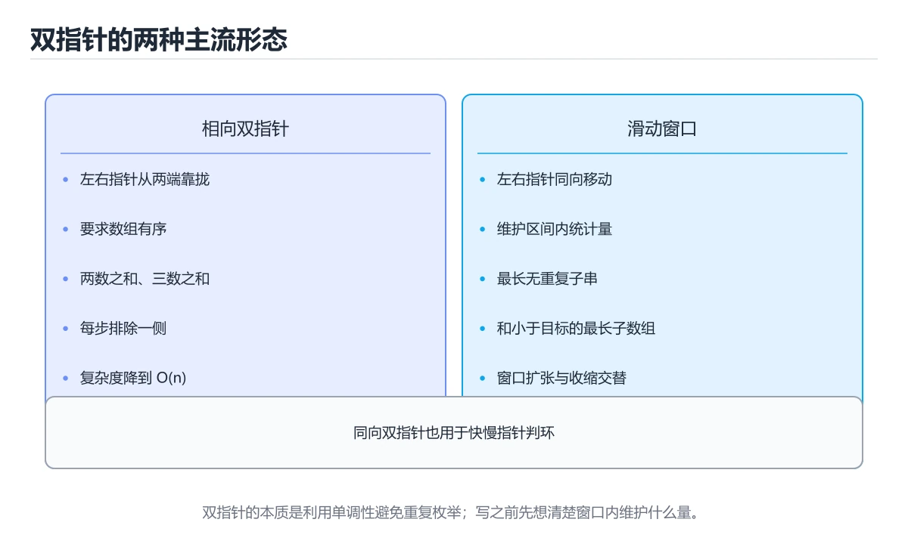
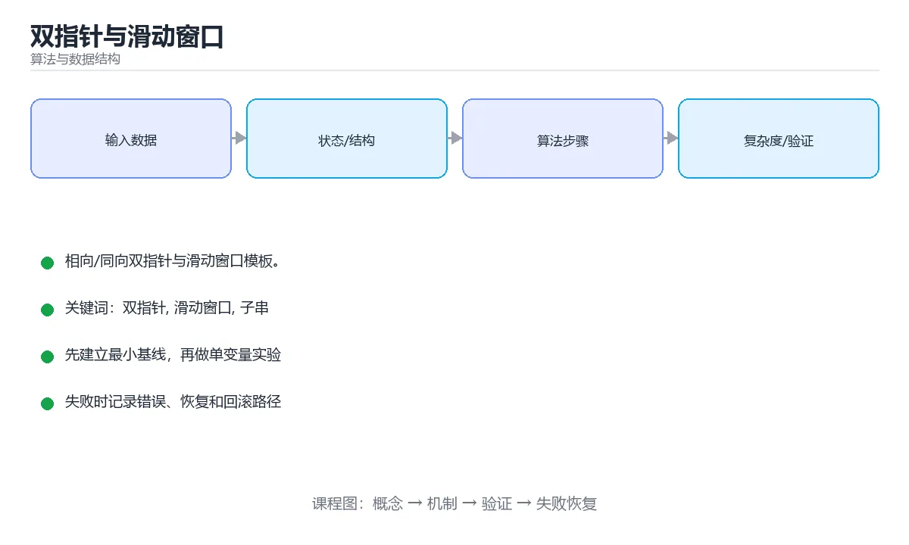

# 双指针与滑动窗口

> 内容更新时间：2026-10-06 · 学习阶段：进阶 · 预计用时：45 分钟





## 本节知识框架

**课程定位**：所属分类为「算法与数据结构」，课程主题为「双指针与滑动窗口」，学习阶段为「进阶」，建议用时 45 分钟。

**本课要解决的主问题**：相向/同向双指针与滑动窗口模板。

| 学习层次 | 要回答的问题 | 完成判据 |
| --- | --- | --- |
| 概念层 | 「双指针与滑动窗口」有哪些必须区分的对象与术语？ | 能用自己的话定义核心术语，并各举一个正例和一个反例。 |
| 机制层 | 这些对象按什么顺序发生作用，输入如何变成输出？ | 能画出或写出机制步骤，并说明每一步的失败条件。 |
| 应用层 | 什么场景适合使用「双指针与滑动窗口」，什么场景不适合？ | 能给出一个真实场景、一个最小示例和一个边界案例。 |
| 性能层 | 时间、空间、吞吐或延迟受哪些量影响？ | 能说出复杂度或性能瓶颈的证据来源；没有证据时明确写“材料未提供”。 |
| 复习层 | 怎样确认自己不是只记住了结论？ | 能独立完成本课自测，并把错误定位到概念、机制、示例或边界。 |

### 阅读路线

1. 先读「核心概念定义」，建立「双指针」等对象的精确定义。
2. 再读「原理与运行机制」，把定义串成可重复的过程。
3. 用「代码/协议/SQL 示例」验证过程，并只改一个条件观察结果变化。
4. 最后检查性能、易错点、知识关系与自测题，形成可复习的证据链。

**前置知识**：没有硬性先修课；仍建议先具备本分类的基础阅读与操作能力。

**学习位置**：本课位于《排序算法家族》之后；如果前一课的自测不能通过，应先回补再继续。

**后续衔接**：下一课《回溯算法》会继续使用本课术语，学完后建议立即完成一次自测。

**教材衔接：学习目标**

- 能用自己的话解释双指针与滑动窗口解决了什么问题，而不是只背术语。
- 能说清 「双指针」、「滑动窗口」、「子串」、「子数组」 之间的关系，并分别举出一个例子。
- 能把 双指针 放回「双指针与滑动窗口」的知识体系，说明它和 滑动窗口 的边界。
- 能完成本课练习，并用验收标准检查自己的结果。

> 一句话摘要：相向/同向双指针与滑动窗口模板。

**教材衔接：前置知识**

- 先完成上一课《动态规划入门》；如果已经掌握，可以直接用本课练习自测。
- 本课阶段：进阶。建议先掌握同一分类的基础课程，并能独立运行正文里的 longest_unique_substring 示例。
- 开始前先复习：双指针、滑动窗口、子串。
- 如果 双指针的三种形态 这一步看不懂，先记录具体卡点，再用 longest_unique_substring 复现一遍。

**教材衔接：本课小结**

双指针靠**有序性**减少搜索，滑动窗口靠**单调性**避免重复检查。写窗口题时先想清楚：什么时候扩大、什么时候收缩、答案在哪一步更新。

## 核心概念定义

> 阅读约定：本课先给「双指针与滑动窗口」相关术语的操作性定义与适用边界；正文里的口语化说法与定义冲突时，以定义和可复现示例为准。

| 术语 | 操作性定义 | 本课中的边界 |
| --- | --- | --- |
| 滑动窗口 | 在时间轴上只统计最近一段窗口内的请求或事件，用平滑突发并限制瞬时速率。 | 仅在「双指针与滑动窗口」明确给出的输入、版本与资源条件下成立。 |
| 对撞指针 | 两个指针从两端向中间收拢，用于有序数组的两数之和、去重与收缩判定。 | 仅在「双指针与滑动窗口」明确给出的输入、版本与资源条件下成立。 |
| 单调性 | 指针移动后答案只可能朝一个方向变化，这是滑动窗口能不回头的前提。 | 仅在「双指针与滑动窗口」明确给出的输入、版本与资源条件下成立。 |
| 快慢指针 | 一快一慢两个指针同向推进，用来判环、找中点或定位倒数第 k 个节点。 | 仅在「双指针与滑动窗口」明确给出的输入、版本与资源条件下成立。 |

### 定义如何使用

在「双指针与滑动窗口」中判断一个说法是否成立，先确认它使用的是哪个对象的定义，再检查输入规模、运行环境与失败路径。定义不是口号，而是后续推导、代码示例和自测题共享的约束。

## 原理与运行机制

### 机制总览

1. **建立输入**：把「滑动窗口」按本课定义整理成可观察、可重复的输入条件。
2. **执行转换**：围绕「对撞指针」执行本课的核心步骤；每一步都记录中间状态，避免只看最终输出。
3. **产生输出**：得到「单调性」后，用正文示例或协议/SQL 结果核对输出是否符合预期。
4. **改变一个条件**：只替换一个边界条件或环境参数，观察「双指针与滑动窗口」的结论是否仍然成立。

| 阶段 | 关注对象 | 失败时应检查 |
| --- | --- | --- |
| 输入 | 滑动窗口 | 类型、范围、编码、版本或前置状态是否满足定义。 |
| 处理 | 对撞指针 | 顺序、可见性、锁、路由、事务或调度规则是否被破坏。 |
| 输出 | 单调性 | 结果是否可复现，错误是否被正确传播而不是被吞掉。 |

本课的机制结论要用「双指针与滑动窗口」自己的示例验证。「双指针与滑动窗口」没有给出某个数量级、吞吐或内存数据时，本课把该判断标为“材料未提供”，不从相邻主题外推。

**教材衔接：双指针的三种形态**

| 形态 | 移动方式 | 适用 |
| --- | --- | --- |
| 相向双指针 | 一头一尾向中间靠 | 有序数组求和、反转、盛水问题 |
| 同向双指针 | 都从头出发，速度不同 | 快慢指针、原地去重 |
| 滑动窗口 | 右指针扩张、左指针收缩 | 子数组 / 子串的连续区间问题 |

核心价值：把「枚举所有区间」的 `O(n²)` 优化到 `O(n)`，代价是需要问题具备**单调性**。

**教材衔接：什么题适合滑动窗口**

1. 求**连续**子数组或子串（不连续就不能用）。
2. 窗口扩大或缩小时，判断条件具有单调性（如「和只增不减」）。
3. 常见问法：最长 / 最短 / 恰好满足某条件的区间。

反例：求和为 k 的**子序列**（不要求连续）就不能用滑动窗口，应考虑前缀和 + 哈希表。

## 典型应用场景

| 场景 | 典型输入或前提 | 期望产物 |
| --- | --- | --- |
| 学习验证 | 使用本课最小示例和 双指针、滑动窗口 | 能复现正文结论，并解释每一步。 |
| 工程落地 | 把「双指针与滑动窗口」放入真实模块或服务边界 | 输出可观测、失败可定位、参数可配置。 |
| 故障排查 | 只改一个版本、规模、输入或依赖条件 | 能区分概念错误、实现错误和环境差异。 |

判断「双指针与滑动窗口」的场景是否成立，标准是能否写出输入、处理、输出和失败路径；材料中没有出现的数据在本课标注为“材料未提供”，不用推测替代证据。

**课程内置实验入口**：`interactive`，用于动手验证《双指针与滑动窗口》的机制；实验结论不替代概念定义与复杂度分析。

## 代码/协议/SQL 示例

### 最小可验证示例

下面保留《双指针与滑动窗口》原文中的最小示例。先预测《双指针与滑动窗口》示例的输出，再按正文步骤运行或推演；示例依赖外部环境时，同时记录版本与输入。

```python
def two_sum_sorted(nums, target):
    left, right = 0, len(nums) - 1
    while left < right:
        total = nums[left] + nums[right]
        if total == target:
            return [left, right]
        if total < target:
            left += 1        # 和太小，只能增大左值
        else:
            right -= 1       # 和太大，只能减小右值
    return []
```

**教材衔接：相向双指针：两数之和（有序数组）**

```python
def two_sum_sorted(nums, target):
    left, right = 0, len(nums) - 1
    while left < right:
        total = nums[left] + nums[right]
        if total == target:
            return [left, right]
        if total < target:
            left += 1        # 和太小，只能增大左值
        else:
            right -= 1       # 和太大，只能减小右值
    return []
```

**教材衔接：滑动窗口：最短覆盖子串长度**

```python
from collections import Counter

def min_window_length(s, t):
    need, missing = Counter(t), len(t)
    left = 0
    best = float("inf")
    for right, ch in enumerate(s):
        if need[ch] > 0:
            missing -= 1
        need[ch] -= 1
        while missing == 0:              # 窗口已满足条件，尝试收缩
            best = min(best, right - left + 1)
            need[s[left]] += 1
            if need[s[left]] > 0:
                missing += 1
            left += 1
    return 0 if best == float("inf") else best
```

模板可以概括为四步：**右指针扩张 → 判断是否满足 → 左指针收缩 → 更新答案**。

**教材衔接：无重复字符的最长子串**

```python
def longest_unique(s):
    last_seen, left, best = {}, 0, 0
    for right, ch in enumerate(s):
        if ch in last_seen and last_seen[ch] >= left:
            left = last_seen[ch] + 1     # 跳过重复字符
        last_seen[ch] = right
        best = max(best, right - left + 1)
    return best
```

**教材衔接：三类双指针速查**

| 类型 | 移动方式 | 适用问题 | 前提 |
| --- | --- | --- | --- |
| 相向双指针 | 左右向中间靠拢 | 有序数组两数之和、回文判断、盛水容器 | 单调性（通常已排序） |
| 同向双指针 | 一快一慢 | 原地去重、删除元素、链表找中点 | 只需一次扫描 |
| 滑动窗口 | 右扩左缩 | 最长或最短子串、满足条件的连续区间 | 窗口性质随扩张收缩单调 |

```python
def two_sum_sorted(nums, target):
    """有序数组两数之和：相向双指针 O(n)。"""
    left, right = 0, len(nums) - 1
    while left < right:
        total = nums[left] + nums[right]
        if total == target:
            return [left, right]
        if total < target:
            left += 1          # 和太小，左指针右移
        else:
            right -= 1         # 和太大，右指针左移
    return []

def longest_unique_substring(text: str) -> int:
    """最长无重复字符子串：滑动窗口 + 哈希表记录位置。"""
    last_seen = {}
    left = best = 0
    for right, ch in enumerate(text):
        if ch in last_seen and last_seen[ch] >= left:
            left = last_seen[ch] + 1     # 收缩到重复字符之后
        last_seen[ch] = right
        best = max(best, right - left + 1)
    return best

def min_window(nums, target):
    """和大于等于 target 的最短连续子数组长度（均为正数）。"""
    left = total = 0
    best = float("inf")
    for right, value in enumerate(nums):
        total += value
        while total >= target:           # 满足条件就尝试收缩
            best = min(best, right - left + 1)
            total -= nums[left]
            left += 1
    return 0 if best == float("inf") else best
```

**教材衔接：滑动窗口模板**

```text
left = 0
for right in range(n):
    把 nums[right] 加入窗口
    while 窗口不满足条件:
        把 nums[left] 移出窗口
        left += 1
    此时窗口是「以 right 结尾的最优窗口」，更新答案
```

判断能否用滑动窗口：窗口扩大或缩小时，条件是否**单调变化**。含有负数的「和为 k 的子数组」不满足单调性，应改用前缀和加哈希表。

## 时间/空间复杂度或性能分析

**复杂度证据**：本课正文出现 `O(n²)`、`O(n)` 等量级表达式；使用前要同时确认输入规模、最好/平均/最坏情况以及常数项来源。

| 维度 | 本课关注点 | 判断依据 |
| --- | --- | --- |
| 时间/延迟 | 「双指针与滑动窗口」的主要步骤是否会随输入规模、并发度或网络往返增长。 | 以正文复杂度、基准数据或可重复测量为准。 |
| 空间/内存 | 中间状态、缓存、副本、连接或索引是否随规模增长。 | 记录峰值内存与数据副本，不只看最终结果。 |
| 吞吐/资源 | 版本、调度、锁、IO、序列化或协议开销是否成为瓶颈。 | 固定环境做对照实验，改变一个变量。 |

评估「双指针与滑动窗口」时要区分“正确性成立”和“性能达标”两件事；材料没有给出基准时，本课只保留量级来源与测量方法，不写不可验证的绝对数字。

## 常见误区与易错点

> 复核《双指针与滑动窗口》的易错点时，优先保留原文的错误表、故障现场与排错路径；每条修正都要能用本课示例复验。

| 易错点 | 常见表现 | 正确做法 |
| --- | --- | --- |
| 只背结论 | 能复述「双指针与滑动窗口」的定义，却说不清输入、输出与边界。 | 回到机制步骤，用最小示例逐一验证。 |
| 混淆相邻概念 | 把本课对象与相邻主题的对象当成同一类。 | 先比较定义、资源归属、生命周期和失败模式。 |
| 忽略版本与环境 | 在开发机通过后直接外推到生产环境。 | 固定版本、输入和资源条件，再记录可复现结果。 |

**教材衔接：常见错误与排查**

| 容易写错的做法 | 实际现象 | 原因与正确做法 |
| --- | --- | --- |
| 对无序数组用相向双指针 | 结果错误 | 先排序，或用哈希表 |
| 收缩用 `if` 而非 `while` | 窗口未完全收缩，答案偏大 | 需要连续收缩时用 `while` |
| 窗口左边界回退 | 复杂度退化为 O(n²) | 左右指针只能单向移动 |
| 记录位置时忘记判断 `>= left` | 左边界被旧位置拉回 | 条件加 `last_seen[ch] >= left` |
| 更新答案时机不对 | 得到次优解 | 明确是扩张后还是收缩后更新 |
| 对含负数的数组用滑窗 | 结果错误 | 用前缀和加哈希表 |
| 忘记处理空数组 | 越界 | 循环前判空 |
| 原地删除却不写回 | 数组未改变 | 用 `slow` 写回并返回新长度 |
| 慢指针移动条件写反 | 保留了不该保留的元素 | 明确保留条件 |
| 回文判断忽略非字母数字 | 判定错误 | 先过滤或跳过非目标字符 |

**教材衔接：故障现场**

### 现场 1：收缩用 if 而非 while

**症状**：在《双指针与滑动窗口》的复现场景中，窗口未完全收缩，答案偏大。

**根因**：当出现“收缩用 if 而非 while”时，执行路径已经绕过了《双指针与滑动窗口》的关键约束，最终以“窗口未完全收缩，答案偏大”暴露出来；修复前必须先确认约束在哪里失效。

**修复**：针对《双指针与滑动窗口》的问题，需要连续收缩时用 while。

**验证**：先在《双指针与滑动窗口》中记录“收缩用 if 而非 while”留下的失败证据，再执行“需要连续收缩时用 while”并重放；确认错误路径变为明确结果，且修复没有掩盖同类故障。

### 现场 2：窗口左边界回退

**症状**：在《双指针与滑动窗口》的复现场景中，复杂度退化为 O(n²)。

**根因**：“复杂度退化为 O(n²)”只是表层结果。向上追溯会落到“窗口左边界回退”这一步，因为它省略了《双指针与滑动窗口》的约束，使实现行为和预期模型发生了偏离。

**修复**：针对《双指针与滑动窗口》的问题，左右指针只能单向移动。

**验证**：保留《双指针与滑动窗口》里触发“复杂度退化为 O(n²)”的输入、版本和日志，按“左右指针只能单向移动”完成修改后原样重放；只有失败现象消失且相邻场景仍可解释，才保留改动。

### 现场 3：记录位置时忘记判断 >= left

**症状**：在《双指针与滑动窗口》的复现场景中，左边界被旧位置拉回。

**根因**：触发点是把“记录位置时忘记判断 >= left”当成安全做法。它没有满足《双指针与滑动窗口》要求的前提，因此先表现为“左边界被旧位置拉回”；排查时先完整复现这一段，再核对输入、配置与依赖。

**修复**：针对《双指针与滑动窗口》的问题，条件加 last_seen[ch] >= left。

**验证**：在《双指针与滑动窗口》中按“条件加 last_seen[ch] >= left”调整后，从“记录位置时忘记判断 >= left”的触发条件重放同一条路径，确认“左边界被旧位置拉回”不再出现，并补一个相邻边界用例检查没有引入新问题。

## 与其他知识点的关系

| 关系 | 课程 | 为什么 |
| --- | --- | --- |
| 关联 | 《回溯算法》 | 用于横向比较或把本课结论迁移到相邻主题。 |
| 前置顺序 | 《排序算法家族》 | 同分类中安排在本课之前，建议先完成其自测。 |
| 后续顺序 | 《回溯算法》 | 同分类中安排在本课之后，会继续使用本课术语。 |

把「双指针与滑动窗口」放回知识体系时，不只要记住“前面学过什么”，还要说明两个主题在输入、机制、资源边界和失败模式上的差异。这样才能把单课知识迁移到项目、排障和后续课程。

**教材衔接：复习与迁移**

复习目标：把「双指针与滑动窗口」的判断标准放回可复现的例子里。先自己作答，再对照依据；如果结论正确但理由不完整，回到正文补足前提。

### 概念复述

- 用一句话说明「双指针与滑动窗口」解决什么问题：相向/同向双指针与滑动窗口模板。
- 写出双指针、滑动窗口、子串之间的关系，并各举一个例子。
- 说出本课最容易混淆的两个概念，以及区分它们的判据。

### 正文逐节复核

- **什么题适合滑动窗口**：反例：求和为 k 的**子序列**（不要求连续）就不能用滑动窗口，应考虑前缀和 + 哈希表。
- **滑动窗口模板**：判断能否用滑动窗口：窗口扩大或缩小时，条件是否**单调变化**。

### 测验回顾

1. 滑动窗口适用于哪类问题？
   - 依据：在「双指针与滑动窗口」里，连续子数组或子串且条件单调。窗口靠扩张与收缩维持条件，要求区间连续且判断单调。在「双指针与滑动窗口」里判断这道题，要把双指针、滑动窗口、子串的条件、过程与失败路径逐项对齐，换成“滑动窗口适用于哪类问题”这个场景，只有满足前提的结论才成立。“滑动窗口适用于哪类问题”与「双指针与滑动窗口」的术语表相呼应，只有符合双指针、滑动窗口、子串约束的“连续子数组或子串且条件单调”才是正文支持的结论。
2. 下面这段 Python 代码摘自「双指针与滑动窗口」的正文示例。关于这段代码，下面哪一项说法与实际内容相符？
   - 依据：题干的正确项是这段代码包含循环结构，同一段逻辑会被重复执行，在「双指针与滑动窗口」里循环次数与双指针的输入规模直接相关。这段代码出自「双指针与滑动窗口」的正文示例，围绕双指针、滑动窗口、子串展开；把输入或边界换成空值、极值或失败情况后，结论要以「双指针与滑动窗口」的实际运行结果为准。回到「双指针与滑动窗口」的正文示例，用“下面这段 Python 代码摘自双指”走一遍双指针、滑动窗口、子串的完整流程，能复现的结论才可以保留。
3. 围绕“双指针与滑动窗口”中的 双指针、滑动窗口、子串，下列哪两项是本课强调的实践判断？
   - 依据：本课把双指针与滑动窗口拆成概念、示例与故障现场三部分，因此判断 双指针 时必须同时交代输入、输出和失败路径，这使“学习 双指针 时要同时说明输入、输出和失败路径，不能只看正常流程”成立。在双指针与滑动窗口里，判断 滑动窗口 时要固定版本与边界输入，所以“验证 滑动窗口 时要固定版本并覆盖边界输入，结论才可复现”才可复现。
4. 滑动窗口模板中什么时候收缩左边界？
   - 依据：在「双指针与滑动窗口」里，结论应落在「窗口不再满足条件（或需要找更短的可行窗口）时收缩，直到重新满足条件」。结论应落在窗口不再满足条件（或需要找更短的可行窗口）时收缩。右指针负责扩张、左指针负责收缩，每个元素进出窗口各一次，整体 O(n)。在「双指针与滑动窗口」里，这道题要求区分概念与边界，「窗口不再满足条件（或需要找更短的可行窗口）时收缩，直到重新满足条件」只有在题干给出的前提下才成立，而「永远不收缩」、「只在窗口为空时收缩（只在边界情况下成立，不能回答本题）」缺少同一组条件。
5. 双指针能把 O(n²) 降到 O(n) 的根本原因是？
   - 依据：在「双指针与滑动窗口」里，利用了单调性，让每个指针只单向移动。只要指针会回退，复杂度优势就会消失，这也是判断能否用双指针的关键。在「双指针与滑动窗口」里判断这道题，要把双指针、滑动窗口、子串的条件、过程与失败路径逐项对齐，换成“双指针能把 O(n²) 降到 O(n”这个场景，只有满足前提的结论才成立。
6. 补全代码：「双指针与滑动窗口」示例中，下面这行代码缺少哪个关键字或函数名？请填入 ____。

`____, left, best = {}, 0, 0`
   - 依据：空格应填写「last_seen」。在「双指针与滑动窗口」里判断这道题，要把双指针、滑动窗口、子串的条件、过程与失败路径逐项对齐，换成“补全代码”这个场景，只有满足前提的结论才成立。“双指针与滑动窗口示例中”与「双指针与滑动窗口」的术语表相呼应，只有符合双指针、滑动窗口、子串约束的“lastseen”才是正文支持的结论。

### 迁移练习

把「双指针与滑动窗口」的结论迁移到相邻主题，每次迁移都写清预测与证据：

1. 换输入：用双指针处理一组你自己的数据，对比教材示例的结果差异。
2. 换失败条件：制造一个滑动窗口相关的错误，说明如何从错误信息定位根因。
3. 换规模：把数据量或并发度提高一个数量级，说明「双指针与滑动窗口」的结论是否仍成立。

## 自测题与参考答案

> 先独立作答《双指针与滑动窗口》的自测题，再对照答案与解析；每处判断都要能在本课正文或示例中找到依据。

### 自测 1

滑动窗口适用于哪类问题？

A. 连续子数组或子串且条件单调
B. 排序
C. 图最短路
D. 适用于任意子序列的组合，但它只覆盖了部分情况

**参考答案**：连续子数组或子串且条件单调

**解析**：在「双指针与滑动窗口」里，连续子数组或子串且条件单调。窗口靠扩张与收缩维持条件，要求区间连续且判断单调。在「双指针与滑动窗口」里判断这道题，要把双指针、滑动窗口、子串的条件、过程与失败路径逐项对齐，换成“滑动窗口适用于哪类问题”这个场景，只有满足前提的结论才成立。“滑动窗口适用于哪类问题”与「双指针与滑动窗口」的术语表相呼应，只有符合双指针、滑动窗口、子串约束的“连续子数组或子串且条件单调”才是正文支持的结论。

### 自测 2

下面这段 Python 代码摘自「双指针与滑动窗口」的正文示例。关于这段代码，下面哪一项说法与实际内容相符？

```python
def two_sum_sorted(nums, target):
    """有序数组两数之和：相向双指针 O(n)。"""
    left, right = 0, len(nums) - 1
    while left < right:
        total = nums[left] + nums[right]
        if total == target:
            return [left, right]
        if total < target:
            left += 1          # 和太小，左指针右移
        else:
            right -= 1         # 和太大，右指针左移
    return []

def longest_unique_substring(text: str) -> int:
    """最长无重复字符子串：滑动窗口 + 哈希表记录位置。"""
    last_seen = {}
    left = best = 0
    for right, ch in enumerate(text):
        if ch in last_seen and last_seen[ch] >= left:
            left = last_seen[ch] + 1     # 收缩到重复字符之后
        last_seen[ch] = right
        best = max(best, right - left + 1)
    return best

def min_window(nums, target):
    """和大于等于 target 的最短连续子数组长度（均为正数）。"""
    left = total = 0
    best = float("inf")
    for right, value in enumerate(nums):
        total += value
        while total >= target:           # 满足条件就尝试收缩
            best = min(best, right - left + 1)
            total -= nums[left]
            left += 1
    return 0 if best == float("inf") else best
```

A. 这段代码只做静态声明，没有循环、分支或可观察输出。
B. 这段代码包含异常处理分支，失败时会走专门的补救路径。
C. 这段代码包含循环结构，同一段逻辑会被重复执行。
D. 这段代码会产生可观察的输出，运行后能看到结果。

**参考答案**：这段代码包含循环结构，同一段逻辑会被重复执行。

**解析**：题干的正确项是这段代码包含循环结构，同一段逻辑会被重复执行，在「双指针与滑动窗口」里循环次数与双指针的输入规模直接相关。这段代码出自「双指针与滑动窗口」的正文示例，围绕双指针、滑动窗口、子串展开；把输入或边界换成空值、极值或失败情况后，结论要以「双指针与滑动窗口」的实际运行结果为准。回到「双指针与滑动窗口」的正文示例，用“下面这段 Python 代码摘自双指”走一遍双指针、滑动窗口、子串的完整流程，能复现的结论才可以保留。

### 自测 3

围绕“双指针与滑动窗口”中的 双指针、滑动窗口、子串，下列哪两项是本课强调的实践判断？

A. 把 滑动窗口 的单次运行结果当成所有版本和规模都成立
B. 学习 双指针 时要同时说明输入、输出和失败路径，不能只看正常流程
C. 只要 双指针 的常规示例通过，就可以跳过边界与异常路径
D. 验证 滑动窗口 时要固定版本并覆盖边界输入，结论才可复现

**参考答案**：学习 双指针 时要同时说明输入、输出和失败路径，不能只看正常流程；验证 滑动窗口 时要固定版本并覆盖边界输入，结论才可复现

**解析**：本课把双指针与滑动窗口拆成概念、示例与故障现场三部分，因此判断 双指针 时必须同时交代输入、输出和失败路径，这使“学习 双指针 时要同时说明输入、输出和失败路径，不能只看正常流程”成立。在双指针与滑动窗口里，判断 滑动窗口 时要固定版本与边界输入，所以“验证 滑动窗口 时要固定版本并覆盖边界输入，结论才可复现”才可复现。

**教材衔接：复习与自测**

- [ ] 能按问题类型选对三种双指针之一。
- [ ] 会写「右扩左缩」的滑动窗口模板。
- [ ] 知道滑动窗口要求条件单调。
- [ ] 明确在哪个时机更新答案。
- [ ] 会用快慢指针原地删除元素并返回新长度。

**教材衔接：动手练习**

> 本课练习重点：围绕「双指针、滑动窗口、子串」完成复述、实验和交付，每个结果都要能被别人检查。

用 8 个元素手动走一遍 longest_unique_substring，把每一步代价与代码里的计数对齐。

### 练习 1：建立心智模型（10 分钟）

合上教程，用 3～5 句话回答：

1. 双指针与滑动窗口解决了什么问题？
2. 如果没有它，会出现什么具体后果？
3. 它和「滑动窗口」是什么关系？

验收标准：回答里必须出现 双指针，并写出一个让结论失效的边界条件。

### 练习 2：做一次可控实验（20 分钟）

从正文中选一个最小示例，完成以下操作：

1. 先预测修改一个参数、输入或步骤后的结果。
2. 再实际执行或逐步推演，记录真实结果。
3. 如果结果与预测不同，写出差异原因。

**验收标准**：五步记录要写进笔记——原例是 longest_unique_substring，改动落在双指针上，结论必须能被他人在同一环境里复现。

### 练习 3：交付一个小结果（30 分钟）

给定 8～12 个手工构造的数据，写出 双指针 每一步的状态并统计操作次数。

任务要求：

- 结果必须能被别人检查，不能只写“我已经理解了”。
- 至少覆盖「双指针」和「滑动窗口」两个关键词。
- 写出 1 个仍然不确定的问题，以及下一步如何验证。

> 提示：时间有限时优先做练习 1 和练习 2；练习 3 可以拆成两次完成。

**教材衔接：可运行练习**

### 任务 1：先跑通，再解释

```python
def two_sum_sorted(nums, target):
    left, right = 0, len(nums) - 1
    while left < right:
        total = nums[left] + nums[right]
        if total == target:
            return [left, right]
        if total < target:
            left += 1        # 和太小，只能增大左值
        else:
            right -= 1       # 和太大，只能减小右值
    return []
```

### 任务 2：只改一个条件

把「双指针与滑动窗口」的最小示例复制一份，只改一个条件再跑一次：

- 改动点：把 滑动窗口 换成边界值，其他输入保持原样。
- 预测：先写下「双指针与滑动窗口」在改动后的输出或错误信息，再运行。
- 记录：对照改动前后的结果，指出差异出在哪一步。
- 验收：换回原条件能复现原结果，改动只影响双指针。

### 任务 3：迁移到自己的数据

换一个 滑动窗口 场景重做一次，确认结论不是只对示例数据成立。

**教材衔接：本课复习清单**

离开本课前，逐项确认：

- [ ] 不看解析，能说出「滑动窗口适用于哪类问题？」的判断依据。
- [ ] 不看解析，能说出「有序数组找两数之和等于目标，最优做法是？」的判断依据。
- [ ] 不看解析，能说出「「和为 k 的子序列」（不要求连续）能用滑动窗口吗？」的判断依据。
- [ ] 不看解析，能说出「滑动窗口模板中什么时候收缩左边界？」的判断依据。
- [ ] 不看解析，能说出「双指针能把 O(n²) 降到 O(n) 的根本原因是？」的判断依据。
- [ ] 用 双指针 构造一个正常输入和一个边界输入，分别记录输出与判断依据。
- [ ] 把本课最容易混淆的两个概念写成一句话对照。

| 复盘项 | 记录 |
| --- | --- |
| 已经能独立解释的考点 |  |
| 仍然说不清的概念 |  |
| 下一步验证动作 |  |

---

## 术语速查

| 术语 | 一句话说明 |
| --- | --- |
| `滑动窗口` | 在时间轴上只统计最近一段窗口内的请求或事件，用平滑突发并限制瞬时速率。 |
| `对撞指针` | 两个指针从两端向中间收拢，用于有序数组的两数之和、去重与收缩判定。 |
| `单调性` | 指针移动后答案只可能朝一个方向变化，这是滑动窗口能不回头的前提。 |
| `快慢指针` | 一快一慢两个指针同向推进，用来判环、找中点或定位倒数第 k 个节点。 |

## 考点精讲

### 考点 1：概念判断·双指针

- **题目**：滑动窗口适用于哪类问题？
- **判断依据**：在「双指针与滑动窗口」里，连续子数组或子串且条件单调。窗口靠扩张与收缩维持条件，要求区间连续且判断单调。在「双指针与滑动窗口」里判断这道题，要把双指针、滑动窗口、子串的条件、过程与失败路径逐项对齐，换成“滑动窗口适用于哪类问题”这个场景，只有满足前提的结论才成立。“滑动窗口适用于哪类问题”与「双指针与滑动窗口」的术语表相呼应，只有符合双指针、滑动窗口、子串约束的“连续子数组或子串且条件单调”才是正文支持的结论。

### 考点 2：代码补全·双指针

- **题目**：下面这段 Python 代码摘自「双指针与滑动窗口」的正文示例。关于这段代码，下面哪一项说法与实际内容相符？
- **判断依据**：题干的正确项是这段代码包含循环结构，同一段逻辑会被重复执行，在「双指针与滑动窗口」里循环次数与双指针的输入规模直接相关。这段代码出自「双指针与滑动窗口」的正文示例，围绕双指针、滑动窗口、子串展开；把输入或边界换成空值、极值或失败情况后，结论要以「双指针与滑动窗口」的实际运行结果为准。回到「双指针与滑动窗口」的正文示例，用“下面这段 Python 代码摘自双指”走一遍双指针、滑动窗口、子串的完整流程，能复现的结论才可以保留。

### 考点 3：多选辨析·双指针

- **题目**：围绕“双指针与滑动窗口”中的 双指针、滑动窗口、子串，下列哪两项是本课强调的实践判断？
- **判断依据**：本课把双指针与滑动窗口拆成概念、示例与故障现场三部分，因此判断 双指针 时必须同时交代输入、输出和失败路径，这使“学习 双指针 时要同时说明输入、输出和失败路径，不能只看正常流程”成立。在双指针与滑动窗口里，判断 滑动窗口 时要固定版本与边界输入，所以“验证 滑动窗口 时要固定版本并覆盖边界输入，结论才可复现”才可复现。

### 考点 4：概念判断·双指针

- **题目**：滑动窗口模板中什么时候收缩左边界？
- **判断依据**：在「双指针与滑动窗口」里，结论应落在「窗口不再满足条件（或需要找更短的可行窗口）时收缩，直到重新满足条件」。结论应落在窗口不再满足条件（或需要找更短的可行窗口）时收缩。右指针负责扩张、左指针负责收缩，每个元素进出窗口各一次，整体 O(n)。在「双指针与滑动窗口」里，这道题要求区分概念与边界，「窗口不再满足条件（或需要找更短的可行窗口）时收缩，直到重新满足条件」只有在题干给出的前提下才成立，而「永远不收缩」、「只在窗口为空时收缩」缺少同一组条件。

### 考点 5：概念判断·双指针

- **题目**：双指针能把 O(n²) 降到 O(n) 的根本原因是？
- **判断依据**：在「双指针与滑动窗口」里，利用了单调性，让每个指针只单向移动。只要指针会回退，复杂度优势就会消失，这也是判断能否用双指针的关键。在「双指针与滑动窗口」里判断这道题，要把双指针、滑动窗口、子串的条件、过程与失败路径逐项对齐，换成“双指针能把 O(n²) 降到 O(n”这个场景，只有满足前提的结论才成立。

### 考点 6：填空·双指针

- **题目**：补全代码：「双指针与滑动窗口」示例中，下面这行代码缺少哪个关键字或函数名？请填入 ____。 `____, left, best = {}, 0, 0`
- **判断依据**：空格应填写「last_seen」。在「双指针与滑动窗口」里判断这道题，要把双指针、滑动窗口、子串的条件、过程与失败路径逐项对齐，换成“补全代码”这个场景，只有满足前提的结论才成立。“双指针与滑动窗口示例中”与「双指针与滑动窗口」的术语表相呼应，只有符合双指针、滑动窗口、子串约束的“lastseen”才是正文支持的结论。

## English Overview

**Title:** Two Pointers & Sliding Window

**Summary:** Pointer patterns and sliding window.

**Category:** Algorithms
**Level:** 进阶
**Key terms:** 双指针, 滑动窗口, 子串, 子数组

## 内容元数据

- 内容版本：v2.0
- 最后更新：2026-10-06
- 学习阶段：进阶
- 适用环境：任意主流语言（伪代码与复杂度为主）
；本课聚焦 双指针。
- 内容来源：内置结构化课程与工程实践整理
- 相关主题：双指针、滑动窗口、子串、子数组
- 质量版本：P0 测验标准 + P1 覆盖扩展 + P2 体验补全

## 参考资料与复核

- 最后复核：2026-10-04
- 下次复核：2027-09-10
- 复核范围：版本兼容、API 行为、安全建议与工程实践
- 来源性质：官方文档、标准或权威教材；正文为离线教学重组

| 参考资料 | 本课用途 |
| --- | --- |
| [CP-Algorithms](https://cp-algorithms.com/) | 算法实现与复杂度 |
| [MIT 6.006](https://ocw.mit.edu/courses/6-006-introduction-to-algorithms-spring-2020/) | 算法设计与分析 |
| [OI Wiki](https://oi-wiki.org/) | 竞赛算法与数据结构 |

> 「双指针与滑动窗口」的链接用于离线阅读后的延伸核对；App 不会自动联网。
