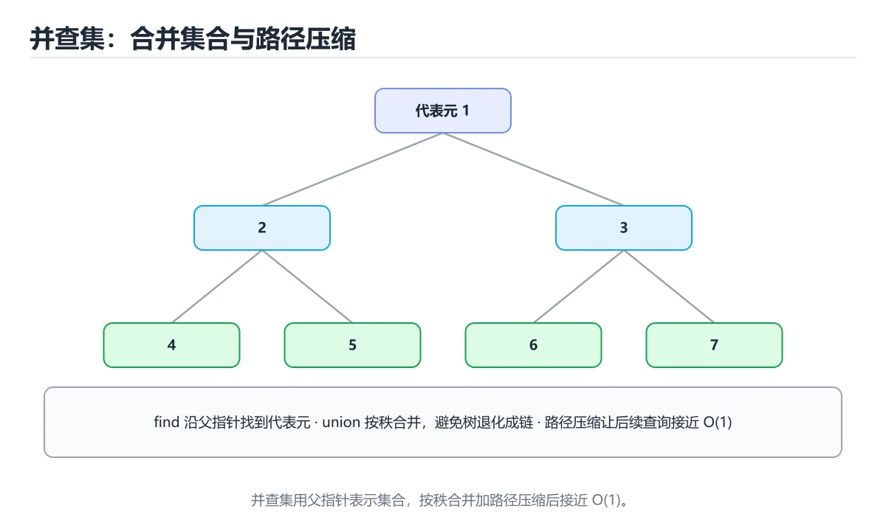
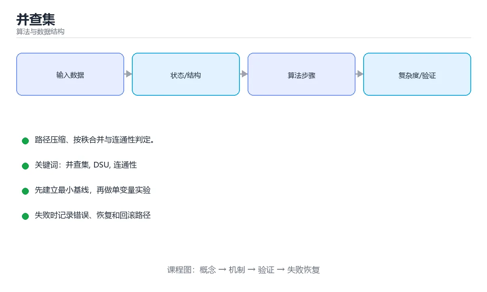

# 并查集

> 内容更新时间：2026-10-06 · 学习阶段：进阶 · 预计用时：40 分钟





## 本节知识框架

**课程定位**：所属分类为「算法与数据结构」，课程主题为「并查集」，学习阶段为「进阶」，建议用时 40 分钟。

**本课要解决的主问题**：路径压缩、按秩合并与连通性判定。

| 学习层次 | 要回答的问题 | 完成判据 |
| --- | --- | --- |
| 概念层 | 「并查集」有哪些必须区分的对象与术语？ | 能用自己的话定义核心术语，并各举一个正例和一个反例。 |
| 机制层 | 这些对象按什么顺序发生作用，输入如何变成输出？ | 能画出或写出机制步骤，并说明每一步的失败条件。 |
| 应用层 | 什么场景适合使用「并查集」，什么场景不适合？ | 能给出一个真实场景、一个最小示例和一个边界案例。 |
| 性能层 | 时间、空间、吞吐或延迟受哪些量影响？ | 能说出复杂度或性能瓶颈的证据来源；没有证据时明确写“材料未提供”。 |
| 复习层 | 怎样确认自己不是只记住了结论？ | 能独立完成本课自测，并把错误定位到概念、机制、示例或边界。 |

### 阅读路线

1. 先读「核心概念定义」，建立「并查集」等对象的精确定义。
2. 再读「原理与运行机制」，把定义串成可重复的过程。
3. 用「代码/协议/SQL 示例」验证过程，并只改一个条件观察结果变化。
4. 最后检查性能、易错点、知识关系与自测题，形成可复习的证据链。

**前置知识**：《前缀和与差分》

**学习位置**：本课位于《前缀和与差分》之后；如果前一课的自测不能通过，应先回补再继续。

**后续衔接**：下一课《字典树（Trie）》会继续使用本课术语，学完后建议立即完成一次自测。

**教材衔接：学习目标**

- 能用自己的话解释并查集解决了什么问题，而不是只背术语。
- 能说清 并查集、「DSU」、「连通性」、「Kruskal」 之间的关系，并分别举出一个例子。
- 能把 并查集 放回「并查集」的知识体系，说明它和 DSU 的边界。
- 能完成本课练习，并用验收标准检查自己的结果。

> 一句话摘要：路径压缩、按秩合并与连通性判定。

**教材衔接：前置知识**

- 先完成上一课《前缀和与差分》；如果已经掌握，可以直接用本课练习自测。
- 本课阶段：进阶。建议先完成「前缀和与差分」，或确认自己能独立跑通正文里的 count_islands 示例。
- 开始前先复习：并查集、DSU、连通性。
- 如果 解决什么问题 这一步看不懂，先记录具体卡点，再用 count_islands 复现一遍。

**教材衔接：本课小结**

并查集的代码只有三十行，但能解决一大类连通性问题。记住两点：**find 负责路径压缩，union 负责按秩合并**；需要判环时 union 返回 false 即说明成环。

## 核心概念定义

> 阅读约定：本课先给「并查集」相关术语的操作性定义与适用边界；正文里的口语化说法与定义冲突时，以定义和可复现示例为准。

| 术语 | 操作性定义 | 本课中的边界 |
| --- | --- | --- |
| 并查集（DSU） | 维护不相交集合的数据结构，支持合并与查询是否同属一个集合。 | 仅在「并查集」明确给出的输入、版本与资源条件下成立。 |
| 代表元（根） | 每个集合选一个代表元素，判断是否连通就是比较两个根。 | 仅在「并查集」明确给出的输入、版本与资源条件下成立。 |
| 路径压缩 | 查询时把沿途节点直接挂到根上，让后续查询接近常数时间。 | 仅在「并查集」明确给出的输入、版本与资源条件下成立。 |
| 按秩合并 | 合并时把矮树挂到高树下，避免树退化成链。 | 仅在「并查集」明确给出的输入、版本与资源条件下成立。 |
| 连通分量 | 并查集里的每个集合就是一个连通分量，常用于 Kruskal 建最小生成树。 | 仅在「并查集」明确给出的输入、版本与资源条件下成立。 |

### 定义如何使用

在「并查集」中判断一个说法是否成立，先确认它使用的是哪个对象的定义，再检查输入规模、运行环境与失败路径。定义不是口号，而是后续推导、代码示例和自测题共享的约束。

## 原理与运行机制

### 机制总览

1. **建立输入**：把「并查集（DSU）」按本课定义整理成可观察、可重复的输入条件。
2. **执行转换**：围绕「代表元（根）」执行本课的核心步骤；每一步都记录中间状态，避免只看最终输出。
3. **产生输出**：得到「路径压缩」后，用正文示例或协议/SQL 结果核对输出是否符合预期。
4. **改变一个条件**：只替换一个边界条件或环境参数，观察「并查集」的结论是否仍然成立。

| 阶段 | 关注对象 | 失败时应检查 |
| --- | --- | --- |
| 输入 | 并查集（DSU） | 类型、范围、编码、版本或前置状态是否满足定义。 |
| 处理 | 代表元（根） | 顺序、可见性、锁、路由、事务或调度规则是否被破坏。 |
| 输出 | 路径压缩 | 结果是否可复现，错误是否被正确传播而不是被吞掉。 |

本课的机制结论要用「并查集」自己的示例验证。「并查集」没有给出某个数量级、吞吐或内存数据时，本课把该判断标为“材料未提供”，不从相邻主题外推。

**教材衔接：基础实现**

```python
class DSU:
    def __init__(self, n):
        self.parent = list(range(n))   # 每个元素自成一个集合
        self.rank = [1] * n            # 按秩合并：记录树高/大小

    def find(self, x):
        while self.parent[x] != x:
            self.parent[x] = self.parent[self.parent[x]]   # 路径压缩（隔代压缩）
            x = self.parent[x]
        return x

    def union(self, a, b):
        root_a, root_b = self.find(a), self.find(b)
        if root_a == root_b:
            return False               # 已经同集合，可用于判环
        if self.rank[root_a] < self.rank[root_b]:
            root_a, root_b = root_b, root_a
        self.parent[root_b] = root_a
        self.rank[root_a] += self.rank[root_b]
        return True

    def connected(self, a, b):
        return self.find(a) == self.find(b)
```

递归版 `find` 更简洁，但链很长时可能爆栈，工程中推荐上面的迭代写法。

**教材衔接：常见变体**

- **带权并查集**：维护节点到根的相对关系（如距离、比例），用于「食物链」「等式方程可满足性」。
- **可撤销并查集**：按秩合并 + 不压缩路径，支持回滚，配合线段树分治。

## 典型应用场景

| 场景 | 典型输入或前提 | 期望产物 |
| --- | --- | --- |
| 学习验证 | 使用本课最小示例和 并查集、DSU | 能复现正文结论，并解释每一步。 |
| 工程落地 | 把「并查集」放入真实模块或服务边界 | 输出可观测、失败可定位、参数可配置。 |
| 故障排查 | 只改一个版本、规模、输入或依赖条件 | 能区分概念错误、实现错误和环境差异。 |

判断「并查集」的场景是否成立，标准是能否写出输入、处理、输出和失败路径；材料中没有出现的数据在本课标注为“材料未提供”，不用推测替代证据。

**课程内置实验入口**：`interactive`，用于动手验证《并查集》的机制；实验结论不替代概念定义与复杂度分析。

**教材衔接：典型应用一：岛屿数量**

```python
def count_islands(grid):
    if not grid:
        return 0
    rows, cols = len(grid), len(grid[0])
    dsu = DSU(rows * cols)
    water = 0
    for r in range(rows):
        for c in range(cols):
            if grid[r][c] == "0":
                water += 1
                continue
            for dr, dc in ((1, 0), (0, 1)):       # 只向右、向下合并
                nr, nc = r + dr, c + dc
                if nr < rows and nc < cols and grid[nr][nc] == "1":
                    dsu.union(r * cols + c, nr * cols + nc)
    roots = {dsu.find(i) for i in range(rows * cols)}
    return len(roots) - water
```

**教材衔接：典型应用二：Kruskal 最小生成树**

```python
def kruskal(n, edges):
    dsu, total, used = DSU(n), 0, 0
    for weight, u, v in sorted(edges):        # 按权重升序
        if dsu.union(u, v):                   # 不成环才选用
            total += weight
            used += 1
            if used == n - 1:
                break
    return total if used == n - 1 else -1
```

**教材衔接：应用速查**

| 问题 | 并查集的用法 |
| --- | --- |
| 连通分量个数 | 维护 `count`，每次成功合并减一 |
| 判断无向图是否有环 | 遍历边，若两端已同集合则有环 |
| 最小生成树（Kruskal） | 按边权升序尝试加边 |
| 账户合并、好友关系 | 把同组元素 union 起来 |
| 等式方程可满足性 | 等式 union，不等式判断是否冲突 |
| 网格连通、岛屿问题 | 把相邻格子 union |

## 代码/协议/SQL 示例

### 最小可验证示例

下面保留《并查集》原文中的最小示例。先预测《并查集》示例的输出，再按正文步骤运行或推演；示例依赖外部环境时，同时记录版本与输入。

```text
find(x)          查询 x 属于哪个集合（返回代表元）
union(x, y)      合并 x 与 y 所在的两个集合
```

**教材衔接：解决什么问题**

并查集（Disjoint Set Union，DSU）维护一组不相交的集合，支持两种操作：

```text
find(x)          查询 x 属于哪个集合（返回代表元）
union(x, y)      合并 x 与 y 所在的两个集合
```

几乎以 O(1) 的均摊代价完成，常用于连通性判断、朋友圈计数、Kruskal 最小生成树、动态连通图。

**教材衔接：模板（路径压缩 + 按秩合并）**

```python
class UnionFind:
    """近乎 O(1) 的合并与查询：路径压缩 + 按大小合并。"""

    def __init__(self, n: int):
        self.parent = list(range(n))
        self.size = [1] * n          # 用大小代替秩，效果相同
        self.count = n               # 连通分量个数

    def find(self, x: int) -> int:
        root = x
        while self.parent[root] != root:      # 先找根
            root = self.parent[root]
        while self.parent[x] != root:         # 再压缩路径
            self.parent[x], x = root, self.parent[x]
        return root

    def union(self, a: int, b: int) -> bool:
        ra, rb = self.find(a), self.find(b)
        if ra == rb:
            return False                      # 已在同一集合，说明这条边成环
        if self.size[ra] < self.size[rb]:
            ra, rb = rb, ra                   # 小树挂到大树上
        self.parent[rb] = ra
        self.size[ra] += self.size[rb]
        self.count -= 1
        return True

    def connected(self, a: int, b: int) -> bool:
        return self.find(a) == self.find(b)

def kruskal(n, edges):
    """最小生成树：按边权升序加边，不成环即选。"""
    uf = UnionFind(n)
    total = 0
    used = 0
    for weight, u, v in sorted(edges):
        if uf.union(u, v):
            total += weight
            used += 1
            if used == n - 1:
                break
    return total if used == n - 1 else -1     # -1 表示图不连通
```

## 时间/空间复杂度或性能分析

**复杂度证据**：本课正文出现 `O(1)`、`O(α(n)`、`O(n)`、`O(log n)` 等量级表达式；使用前要同时确认输入规模、最好/平均/最坏情况以及常数项来源。

| 维度 | 本课关注点 | 判断依据 |
| --- | --- | --- |
| 时间/延迟 | 「并查集」的主要步骤是否会随输入规模、并发度或网络往返增长。 | 以正文复杂度、基准数据或可重复测量为准。 |
| 空间/内存 | 中间状态、缓存、副本、连接或索引是否随规模增长。 | 记录峰值内存与数据副本，不只看最终结果。 |
| 吞吐/资源 | 版本、调度、锁、IO、序列化或协议开销是否成为瓶颈。 | 固定环境做对照实验，改变一个变量。 |

评估「并查集」时要区分“正确性成立”和“性能达标”两件事；材料没有给出基准时，本课只保留量级来源与测量方法，不写不可验证的绝对数字。

**教材衔接：两个优化**

| 优化 | 做法 | 效果 |
| --- | --- | --- |
| 路径压缩 | find 时把节点直接挂到根上 | 查询接近 O(1) |
| 按秩/按大小合并 | 小树接到大树下 | 树高保持对数级 |

两者结合后，单次操作的均摊复杂度是 `O(α(n))`（反阿克曼函数），实际可视为常数。

**教材衔接：复杂度与优化**

| 组合 | 单次操作复杂度 |
| --- | --- |
| 朴素实现 | 最坏 O(n) |
| 仅路径压缩 | 均摊 O(log n) |
| 仅按秩合并 | O(log n) |
| 路径压缩 + 按秩合并 | 均摊 O(α(n))，可视作常数 |

## 常见误区与易错点

> 复核《并查集》的易错点时，优先保留原文的错误表、故障现场与排错路径；每条修正都要能用本课示例复验。

| 易错点 | 常见表现 | 正确做法 |
| --- | --- | --- |
| 只背结论 | 能复述「并查集」的定义，却说不清输入、输出与边界。 | 回到机制步骤，用最小示例逐一验证。 |
| 混淆相邻概念 | 把本课对象与相邻主题的对象当成同一类。 | 先比较定义、资源归属、生命周期和失败模式。 |
| 忽略版本与环境 | 在开发机通过后直接外推到生产环境。 | 固定版本、输入和资源条件，再记录可复现结果。 |

**教材衔接：常见错误与排查**

> 说明：本表由《并查集》的核心知识整理（2026-10-07），人工复核进度见 docs/content_review_batches.md。

| 易错点 | 容易踩的做法 | 正确结论 |
| --- | --- | --- |
| 查找不做路径压缩 | 树高退化，重复查询很慢 | 查找时顺手压缩路径，把沿途节点挂到根上 |
| 合并只按大小不看秩 | 极端输入下树高仍会变高 | 按秩或按大小合并，两种口径选一种并保持一致 |
| 忘记初始化父节点 | 查找越界或把不同集合误判成同一集合 | 初始化时让每个元素的父节点指向自己，集合数等于元素数 |

**教材衔接：故障现场**

### 现场 1：查找不做路径压缩

**症状**：在《并查集》的复现场景中，树高退化，重复查询很慢。

**根因**：触发点是把“查找不做路径压缩”当成安全做法。它没有满足《并查集》要求的前提，因此先表现为“树高退化，重复查询很慢”；排查时先完整复现这一段，再核对输入、配置与依赖。

**修复**：针对《并查集》的问题，查找时顺手压缩路径，把沿途节点挂到根上。

**验证**：先在《并查集》中记录“查找不做路径压缩”留下的失败证据，再执行“查找时顺手压缩路径，把沿途节点挂到根上”并重放；确认错误路径变为明确结果，且修复没有掩盖同类故障。

### 现场 2：合并只按大小不看秩

**症状**：在《并查集》的复现场景中，极端输入下树高仍会变高。

**根因**：“极端输入下树高仍会变高”只是表层结果。向上追溯会落到“合并只按大小不看秩”这一步，因为它省略了《并查集》的约束，使实现行为和预期模型发生了偏离。

**修复**：针对《并查集》的问题，按秩或按大小合并，两种口径选一种并保持一致。

**验证**：保留《并查集》里触发“极端输入下树高仍会变高”的输入、版本和日志，按“按秩或按大小合并，两种口径选一种并保持一致”完成修改后原样重放；只有失败现象消失且相邻场景仍可解释，才保留改动。

### 现场 3：忘记初始化父节点

**症状**：在《并查集》的复现场景中，查找越界或把不同集合误判成同一集合。

**根因**：“查找越界或把不同集合误判成同一集合”只是表层结果。向上追溯会落到“忘记初始化父节点”这一步，因为它省略了《并查集》的约束，使实现行为和预期模型发生了偏离。

**修复**：针对《并查集》的问题，初始化时让每个元素的父节点指向自己，集合数等于元素数。

**验证**：先在《并查集》中记录“忘记初始化父节点”留下的失败证据，再执行“初始化时让每个元素的父节点指向自己，集合数等于元素数”并重放；确认错误路径变为明确结果，且修复没有掩盖同类故障。

## 与其他知识点的关系

| 关系 | 课程 | 为什么 |
| --- | --- | --- |
| 先修 | 《前缀和与差分》 | 本课会直接使用它的概念或操作前提。 |
| 关联 | 《字典树（Trie）》 | 用于横向比较或把本课结论迁移到相邻主题。 |
| 前置顺序 | 《前缀和与差分》 | 同分类中安排在本课之前，建议先完成其自测。 |
| 后续顺序 | 《字典树（Trie）》 | 同分类中安排在本课之后，会继续使用本课术语。 |

把「并查集」放回知识体系时，不只要记住“前面学过什么”，还要说明两个主题在输入、机制、资源边界和失败模式上的差异。这样才能把单课知识迁移到项目、排障和后续课程。

**教材衔接：复习与迁移**

复习目标：把「并查集」的判断标准放回可复现的例子里。先自己作答，再对照依据；如果结论正确但理由不完整，回到正文补足前提。

### 概念复述

- 用一句话说明「并查集」解决什么问题：路径压缩、按秩合并与连通性判定。
- 写出并查集、DSU、连通性之间的关系，并各举一个例子。
- 说出本课最容易混淆的两个概念，以及区分它们的判据。

### 正文逐节复核

- **解决什么问题**：并查集（Disjoint Set Union，DSU）维护一组不相交的集合，支持两种操作：。

### 测验回顾

1. 围绕“并查集”中的 并查集、DSU、连通性，下列哪两项是本课强调的实践判断？
   - 依据：题干的正确项是学习 并查集 时要同时说明输入、输出和失败路径，不能只看正常流程。在「并查集」里，验证 DSU 时要固定版本并覆盖边界输入，结论才可复现。在「并查集」里判断这道题，要把并查集、DSU、连通性的条件、过程与失败路径逐项对齐，换成“围绕并查集中的 并查集、DSU、连通”这个场景，只有满足前提的结论才成立。
2. union(a, b) 返回 false 说明？
   - 依据：在「并查集」里，a 与 b 已经在同一集合（再加边会成环）。这正是 Kruskal 判环与「多余连接」问题的解法。回到「并查集」的正文示例，用“union(a”走一遍并查集、DSU、连通性的完整流程，能复现的结论才可以保留。回到正文示例，用“union(a”走一遍并查集、DSU、连通性的完整流程，能复现的结论才可以保留。
3. 这段 Python 代码是「并查集」的示例片段，下面哪一项描述与它一致？
   - 依据：在「并查集」里，题干的正确项是这段代码把主要逻辑封装在函数或方法里，需要被调用才会执行，在「并查集」里封装边界决定并查集从哪一步开始生效。回到「并查集」的正文示例，用“这段 Python 代码是并查集的示”走一遍并查集、DSU、连通性的完整流程，能复现的结论才可以保留。回到正文示例，用“Python”走一遍并查集、DSU、连通性的完整流程，能复现的结论才可以保留。
4. 路径压缩与按秩合并同时使用时，均摊复杂度约为？
   - 依据：α 是反阿克曼函数，在现实规模下不超过 5，因此并查集接近常数时间。作答时，先用并查集建立输入与输出的基线，再把O(α(n))，可视作常数代入边界条件核对，结论才能复现。在「并查集」里，这道题要求区分概念与边界，「O(α(n))，可视作常数」只有在题干给出的前提下才成立，而「O(n)」、「O(log n)」缺少同一组条件。
5. 标准并查集不擅长支持的操作是？
   - 依据：把“删除元素或分裂集合”代回「并查集」里“标准并查集不擅长支持的操作是”的例子核对，条件一旦改变，结论就要用并查集、DSU、连通性重新推导。「并查集」要求先交代并查集、DSU、连通性的前提再下结论，所以“删除元素或分裂集合”只在题干“标准不擅长支持的操作是”给定的条件下成立。“标准不擅长支持的操作是”与术语表相呼应，只有符合并查集、DSU、连通性约束的“删除元素或分裂集合”才是正文支持的结论。
6. 补全代码：「并查集」示例中，下面这行代码缺少哪个关键字或函数名？请填入 ____。

`def ____(n, edges):`
   - 依据：题干的正确项是kruskal。回到「并查集」的正文示例，用“补全代码”走一遍并查集、DSU、连通性的完整流程，能复现的结论才可以保留。在「并查集」里判断这道题，要把并查集、DSU、连通性的条件、过程与失败路径逐项对齐，换成“kruskal”这个场景，只有满足前提的结论才成立。回到正文示例，用“kruskal”走一遍并查集、DSU、连通性的完整流程，能复现的结论才可以保留。

### 迁移练习

把「并查集」的结论迁移到相邻主题，每次迁移都写清预测与证据：

1. 换输入：用并查集处理一组你自己的数据，对比教材示例的结果差异。
2. 换失败条件：制造一个DSU相关的错误，说明如何从错误信息定位根因。
3. 换规模：把数据量或并发度提高一个数量级，说明「并查集」的结论是否仍成立。

## 自测题与参考答案

> 先独立作答《并查集》的自测题，再对照答案与解析；每处判断都要能在本课正文或示例中找到依据。

### 自测 1

围绕“并查集”中的 并查集、DSU、连通性，下列哪两项是本课强调的实践判断？

A. 把 DSU 的单次运行结果当成所有版本和规模都成立
B. 学习 并查集 时要同时说明输入、输出和失败路径，不能只看正常流程
C. 只要 并查集 的常规示例通过，就可以跳过边界与异常路径
D. 验证 DSU 时要固定版本并覆盖边界输入，结论才可复现

**参考答案**：学习 并查集 时要同时说明输入、输出和失败路径，不能只看正常流程；验证 DSU 时要固定版本并覆盖边界输入，结论才可复现

**解析**：题干的正确项是学习 并查集 时要同时说明输入、输出和失败路径，不能只看正常流程。在「并查集」里，验证 DSU 时要固定版本并覆盖边界输入，结论才可复现。在「并查集」里判断这道题，要把并查集、DSU、连通性的条件、过程与失败路径逐项对齐，换成“围绕并查集中的 并查集、DSU、连通”这个场景，只有满足前提的结论才成立。

### 自测 2

union(a, b) 返回 false 说明？

A. 需要路径压缩，但这会引入新的复杂度，需要额外的验证与维护
B. 参数非法
C. 内存不足
D. a 与 b 已经在同一集合（再加边会成环）

**参考答案**：a 与 b 已经在同一集合（再加边会成环）

**解析**：在「并查集」里，a 与 b 已经在同一集合（再加边会成环）。这正是 Kruskal 判环与「多余连接」问题的解法。回到「并查集」的正文示例，用“union(a”走一遍并查集、DSU、连通性的完整流程，能复现的结论才可以保留。回到正文示例，用“union(a”走一遍并查集、DSU、连通性的完整流程，能复现的结论才可以保留。

### 自测 3

这段 Python 代码是「并查集」的示例片段，下面哪一项描述与它一致？

```python
def kruskal(n, edges):
    dsu, total, used = DSU(n), 0, 0
    for weight, u, v in sorted(edges):        # 按权重升序
        if dsu.union(u, v):                   # 不成环才选用
            total += weight
            used += 1
            if used == n - 1:
                break
    return total if used == n - 1 else -1
```

A. 这段代码会读取外部输入，结果依赖传入的数据。
B. 这段代码把主要逻辑封装在函数或方法里，需要被调用才会执行。
C. 这段代码只做静态声明，没有循环、分支或可观察输出。
D. 这段代码包含异常处理分支，失败时会走专门的补救路径。

**参考答案**：这段代码把主要逻辑封装在函数或方法里，需要被调用才会执行。

**解析**：在「并查集」里，题干的正确项是这段代码把主要逻辑封装在函数或方法里，需要被调用才会执行，在「并查集」里封装边界决定并查集从哪一步开始生效。回到「并查集」的正文示例，用“这段 Python 代码是并查集的示”走一遍并查集、DSU、连通性的完整流程，能复现的结论才可以保留。回到正文示例，用“Python”走一遍并查集、DSU、连通性的完整流程，能复现的结论才可以保留。

**教材衔接：复习与自测**

- [ ] 能默写路径压缩与按大小合并的 `find` 和 `union`。
- [ ] 知道并查集均摊复杂度接近常数。
- [ ] 会用并查集判无向图环与 Kruskal。
- [ ] 明确并查集不支持删除与分裂。
- [ ] 下标范围与初始化长度保持一致。

**教材衔接：动手练习**

> 本课练习重点：围绕「并查集、DSU、连通性」完成复述、实验和交付，每个结果都要能被别人检查。

用 8 个元素手动走一遍 count_islands，把每一步代价与代码里的计数对齐。

### 练习 1：建立心智模型（10 分钟）

合上教程，用 3～5 句话回答：

1. 并查集解决了什么问题？
2. 如果没有它，会出现什么具体后果？
3. 它和「DSU」是什么关系？

验收标准：回答里必须出现 并查集，并写出一个让结论失效的边界条件。

### 练习 2：做一次可控实验（20 分钟）

从正文中选一个最小示例，完成以下操作：

1. 先预测修改一个参数、输入或步骤后的结果。
2. 再实际执行或逐步推演，记录真实结果。
3. 如果结果与预测不同，写出差异原因。

**验收标准**：五步记录要写进笔记——原例是 count_islands，改动落在并查集上，结论必须能被他人在同一环境里复现。

### 练习 3：交付一个小结果（30 分钟）

用 8～12 个元素手算 count_islands 的状态变化，再与程序输出对照。

任务要求：

- 结果必须能被别人检查，不能只写“我已经理解了”。
- 至少覆盖并查集和「DSU」两个关键词。
- 写出 1 个仍然不确定的问题，以及下一步如何验证。

> 提示：时间有限时优先做练习 1 和练习 2；练习 3 可以拆成两次完成。

**教材衔接：可运行练习**

### 任务 1：先跑通，再解释

```python
def count_islands(grid):
    if not grid:
        return 0
    rows, cols = len(grid), len(grid[0])
    dsu = DSU(rows * cols)
    water = 0
    for r in range(rows):
        for c in range(cols):
            if grid[r][c] == "0":
                water += 1
                continue
            for dr, dc in ((1, 0), (0, 1)):       # 只向右、向下合并
                nr, nc = r + dr, c + dc
                if nr < rows and nc < cols and grid[nr][nc] == "1":
                    dsu.union(r * cols + c, nr * cols + nc)
    roots = {dsu.find(i) for i in range(rows * cols)}
    return len(roots) - water
```

### 任务 2：只改一个条件

把「并查集」的最小示例复制一份，只改一个条件再跑一次：

- 改动点：只把 并查集 的输入换成空值、极值或错误输入，其余保持不变。
- 预测：先写下「并查集」在改动后的输出或错误信息，再运行。
- 记录：对照改动前后的结果，指出差异出在哪一步。
- 验收：换回原条件能复现原结果，改动只影响并查集。

### 任务 3：迁移到自己的数据

用同一套思路处理一组你自己的 并查集 数据，保持输出格式与任务 1 一致。

**教材衔接：本课复习清单**

离开本课前，逐项确认：

- [ ] 不看解析，能说出「并查集的两个核心优化是？」的判断依据。
- [ ] 不看解析，能说出「union(a, b) 返回 false 说明？」的判断依据。
- [ ] 不看解析，能说出「Kruskal 最小生成树中并查集的作用是？」的判断依据。
- [ ] 不看解析，能说出「路径压缩与按秩合并同时使用时，均摊复杂度约为？」的判断依据。
- [ ] 不看解析，能说出「标准并查集不擅长支持的操作是？」的判断依据。
- [ ] 至少运行一次 count_islands 的示例，记录输入、输出和 并查集 的边界情况。
- [ ] 把本课最容易混淆的两个概念写成一句话对照。

| 复盘项 | 记录 |
| --- | --- |
| 已经能独立解释的考点 |  |
| 仍然说不清的概念 |  |
| 下一步验证动作 |  |

---

## 术语速查

把「并查集」里反复出现的术语集中放在一起。复习时先遮住右列，尝试用自己的话解释，再回到正文核对。

| 术语 | 一句话说明 |
| --- | --- |
| `并查集（DSU）` | 维护不相交集合的数据结构，支持合并与查询是否同属一个集合。 |
| `代表元（根）` | 每个集合选一个代表元素，判断是否连通就是比较两个根。 |
| `路径压缩` | 查询时把沿途节点直接挂到根上，让后续查询接近常数时间。 |
| `按秩合并` | 合并时把矮树挂到高树下，避免树退化成链。 |
| `连通分量` | 并查集里的每个集合就是一个连通分量，常用于 Kruskal 建最小生成树。 |

## 考点精讲

### 考点 1：多选辨析·并查集

- **题目**：围绕“并查集”中的 并查集、DSU、连通性，下列哪两项是本课强调的实践判断？
- **判断依据**：题干的正确项是学习 并查集 时要同时说明输入、输出和失败路径，不能只看正常流程。在「并查集」里，验证 DSU 时要固定版本并覆盖边界输入，结论才可复现。在「并查集」里判断这道题，要把并查集、DSU、连通性的条件、过程与失败路径逐项对齐，换成“围绕并查集中的 并查集、DSU、连通”这个场景，只有满足前提的结论才成立。

### 考点 2：概念判断·并查集

- **题目**：union(a, b) 返回 false 说明？
- **判断依据**：在「并查集」里，a 与 b 已经在同一集合（再加边会成环）。这正是 Kruskal 判环与「多余连接」问题的解法。回到「并查集」的正文示例，用“union(a”走一遍并查集、DSU、连通性的完整流程，能复现的结论才可以保留。回到正文示例，用“union(a”走一遍并查集、DSU、连通性的完整流程，能复现的结论才可以保留。

### 考点 3：代码补全·并查集

- **题目**：这段 Python 代码是「并查集」的示例片段，下面哪一项描述与它一致？
- **判断依据**：在「并查集」里，题干的正确项是这段代码把主要逻辑封装在函数或方法里，需要被调用才会执行，在「并查集」里封装边界决定并查集从哪一步开始生效。回到「并查集」的正文示例，用“这段 Python 代码是并查集的示”走一遍并查集、DSU、连通性的完整流程，能复现的结论才可以保留。回到正文示例，用“Python”走一遍并查集、DSU、连通性的完整流程，能复现的结论才可以保留。

### 考点 4：概念判断·并查集

- **题目**：路径压缩与按秩合并同时使用时，均摊复杂度约为？
- **判断依据**：α 是反阿克曼函数，在现实规模下不超过 5，因此并查集接近常数时间。作答时，先用并查集建立输入与输出的基线，再把O(α(n))，可视作常数代入边界条件核对，结论才能复现。在「并查集」里，这道题要求区分概念与边界，「O(α(n))，可视作常数」只有在题干给出的前提下才成立，而「O(n)」、「O(log n)」缺少同一组条件。

### 考点 5：概念判断·并查集

- **题目**：标准并查集不擅长支持的操作是？
- **判断依据**：把“删除元素或分裂集合”代回「并查集」里“标准并查集不擅长支持的操作是”的例子核对，条件一旦改变，结论就要用并查集、DSU、连通性重新推导。「并查集」要求先交代并查集、DSU、连通性的前提再下结论，所以“删除元素或分裂集合”只在题干“标准不擅长支持的操作是”给定的条件下成立。“标准不擅长支持的操作是”与术语表相呼应，只有符合并查集、DSU、连通性约束的“删除元素或分裂集合”才是正文支持的结论。

### 考点 6：填空·并查集

- **题目**：补全代码：「并查集」示例中，下面这行代码缺少哪个关键字或函数名？请填入 ____。 `def ____(n, edges):`
- **判断依据**：题干的正确项是kruskal。回到「并查集」的正文示例，用“补全代码”走一遍并查集、DSU、连通性的完整流程，能复现的结论才可以保留。在「并查集」里判断这道题，要把并查集、DSU、连通性的条件、过程与失败路径逐项对齐，换成“kruskal”这个场景，只有满足前提的结论才成立。回到正文示例，用“kruskal”走一遍并查集、DSU、连通性的完整流程，能复现的结论才可以保留。

## English Overview

**Title:** Union-Find (DSU)

**Summary:** Path compression, union by rank and connectivity.

**Category:** Algorithms
**Level:** 进阶
**Key terms:** 并查集, DSU, 连通性, Kruskal

## 内容元数据

- 内容版本：v2.0
- 最后更新：2026-10-06
- 学习阶段：进阶
- 适用环境：任意主流语言（伪代码与复杂度为主）
；本课聚焦 并查集。
- 内容来源：内置结构化课程与工程实践整理
- 相关主题：并查集、DSU、连通性、Kruskal
- 质量版本：P0 测验标准 + P1 覆盖扩展 + P2 体验补全

## 参考资料与复核

- 最后复核：2026-10-04
- 下次复核：2027-09-10
- 复核范围：版本兼容、API 行为、安全建议与工程实践
- 来源性质：官方文档、标准或权威教材；正文为离线教学重组

| 参考资料 | 本课用途 |
| --- | --- |
| [CP-Algorithms](https://cp-algorithms.com/) | 算法实现与复杂度 |
| [OI Wiki](https://oi-wiki.org/) | 竞赛算法与数据结构 |
| [RFC 算法与协议](https://www.rfc-editor.org/) | 协议中的算法约束 |

> 「并查集」的链接用于离线阅读后的延伸核对；App 不会自动联网。
