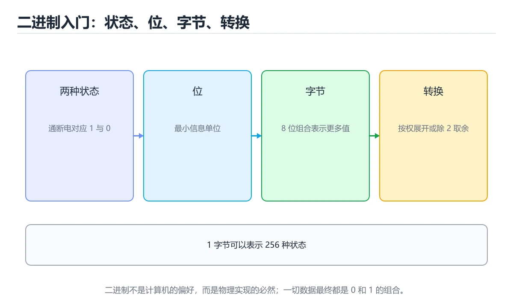
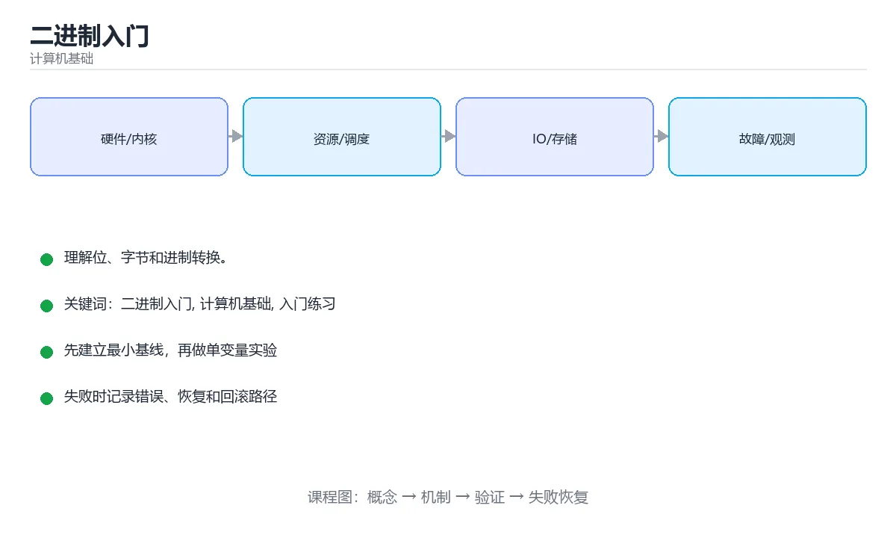

# 二进制入门





> 内容更新时间：2026-10-03 · 学习阶段：入门 · 预计用时：15 分钟

## 学习目标

- 先认识「二进制入门」需要的工具、输入和输出。
- 按步骤运行最小示例，并记录结果与错误。
- 用一个边界输入验证自己是否真正掌握。

## 前置知识

- 会进行基本的文件或命令行操作。
- 不需要预先掌握「计算机基础」的高级知识。

## 一句话入门

理解位、字节和进制转换。

## 最小示例

```python
value = 0b1011
print(value, bin(11), hex(value))
```

## 预期输出

```text
11 0b1011 0xb
```

## 常见错误

- 输入或环境与示例不一致，导致结果不符合预期。
- 复制命令时遗漏空格、引号或必要参数。

## 动手练习

1. 原样运行最小示例，保存命令和输出。
2. 把数字 2 改成 10，预测并验证新结果。
3. 制造一个错误输入，写出错误信息和修复方法。

## 本课小结

- 入门阶段先保证能运行、能观察、能解释，再追求复杂功能。
- 每次只改一个变量，记录预测与实际结果。
- 遇到错误先看第一条错误信息，再回到最小示例。


## 位、字节与位置计数法

二进制只有 0 和 1 两个数码，但它的表达能力不来自“两个数字很少”，而来自位置权重。一个二进制数从右往左的权重依次是 1、2、4、8、16……也就是 2 的幂。`1011` 展开为 `1×8 + 0×4 + 1×2 + 1×1 = 11`。十进制转换到二进制可以反复除以 2，把每次的余数从下往上读；二进制转换到十六进制则四位一组，因为 16 正好是 2 的 4 次方。

8 个二进制位组成 1 个字节，能表示 2⁸ = 256 种状态。无符号字节的范围是 0～255；如果有符号数采用补码，最高位表示符号位，8 位整数的范围是 -128～127。补码的价值在于让加法和减法共用同一套电路：`-1` 用全 1 表示，`5 + (-1)` 直接按位相加就能得到 4。溢出不是“程序算错了”，而是结果超出了当前位宽能表示的范围，例如 8 位无符号的 `255 + 1` 会回绕成 0。

位运算常用于压缩状态、权限和性能敏感的代码。按位与 `&` 可以检查某一位是否为 1，按位或 `|` 可以打开标志位，异或 `^` 可以在不使用临时变量的情况下判断两个位是否不同，左移右移分别对应乘以或除以 2 的幂。位运算的前提是明确数据位宽和符号规则，否则在不同语言和平台上可能得到不同结果。

## 补码、溢出与边界验证

理解二进制还要区分“数值”和“内存中的字节表示”。同一个字节序列，按无符号整数解释、按有符号整数解释或按字符编码解释，可能得到完全不同的值；而多字节整数还要面对端序问题：大端把高位放在低地址，小端把低位放在低地址。网络协议通常规定统一使用大端，本地机器则可能是小端，因此跨平台传输时必须显式转换。

验证进制转换时，不要只看一个正数。至少测试 0、1、最大值、最小值、负数、跨越字节边界的值，以及一个带前导零的字符串。对于溢出场景，要明确语言的行为：有些语言抛异常，有些回绕，有些属于未定义行为。把“输入范围、位宽、解释方式、溢出策略”四件事写清楚，再去写代码或分析二进制数据，才能避免把表示层的问题误判成业务逻辑。

## 代码实验：把示例跑成证据

这一节不引入新语法，而是把「二进制入门」的最小示例变成可以复现、可以对照的实验。每次只改变一个条件，先写预测，再运行，最后解释差异。

### 实验一：建立基线

```python
value = 0b1011
print(value, bin(11), hex(value))
```

先原样运行上面的代码，记录命令、完整输出和退出状态。然后把输出与正文的预期输出逐字对照，不要用“看起来差不多”代替核对；空格、大小写、换行和错误流向都可能暴露环境差异。

### 实验二：只改一个输入

从代码中选一个会影响结果的字面量、参数或输入，把它替换成边界值：数值可尝试 0、1、最大值和最小值，字符串可尝试空串和超长文本，集合可尝试空集合、单元素和重复元素。先写出预测，再运行并记录实际结果。

### 实验三：制造一个可控错误

把复合语句末尾的冒号删掉，或者把字符串直接参与数值运算。先记录解释器报出的第一行错误和行号，再修复并重跑基线。

| 实验 | 改动 | 预测 | 实际 | 结论 |
| --- | --- | --- | --- | --- |
| 基线 | 保持原样 |  |  |  |
| 边界 |  |  |  |  |
| 失败 |  |  |  |  |

### 实验四：用三句话复述

1. 输入是什么，哪些输入属于合法范围，哪些属于边界或非法范围？
2. 程序按什么顺序处理输入，在哪一步产生了状态变化或副作用？
3. 输出如何验证，失败时第一条可观察证据是什么？

## 考点精讲：把测验题还原成判断过程

本课有 5 个判断点。先自己作答，再看「判断依据」；如果结论正确但理由不完整，回到正文对应章节补足概念。

### 考点 1：一个字节等于多少位？

- **正确判断**：8 位，每位取值 0 或 1
- **判断依据**：正确答案是「8 位，每位取值 0 或 1」，本课在「位、字节与位置计数法」中说明：二进制转换到十六进制则四位一组，因为 16 正好是 2 的 4 次方。现代计算机中一个字节固定为 8 位，能表示 0 到 255 共 256 种状态。本课还在「位、字节与位置计数法」中说明：个二进制位组成 1 个字节，能表示 2⁸ = 256 种状态。本课还在「补码、溢出与边界验证」中说明：同一个字节序列，按无符号整数解释、按有符号整数解释或按字符编码解释，可能得到完全不同的值。
- **迁移检查**：遮住选项，只根据定义复述一次答案，再回来看哪个选项与复述一致。

### 考点 2：二进制 0b1011 对应的十进制数值是？

- **正确判断**：11，按 8+0+2+1 累加得到
- **判断依据**：正确答案是「11，按 8+0+2+1 累加得到」，本课在「补码、溢出与边界验证」中说明：把“输入范围、位宽、解释方式、溢出策略”四件事写清楚，再去写代码或分析二进制数据，才能避免把表示层的问题误判成业务逻辑。二进制每位对应 2 的幂：从右往左依次是 1、2、4、8，所以 0b1011 = 8 + 0 + 2 + 1 = 11。本课还在「位、字节与位置计数法」中说明：一个二进制数从右往左的权重依次是 1、2、4、8、16……也就是 2 的幂。
- **迁移检查**：如果给某个错误选项去掉一个限定词，它会不会变成正确？说明理由。

### 考点 3：十六进制 0xb 与二进制 0b1011 的数值关系是？

- **正确判断**：两者都等于十进制 11，只是进制写法不同
- **判断依据**：正确答案是「两者都等于十进制 11，只是进制写法不同」，本课在「位、字节与位置计数法」中说明：二进制转换到十六进制则四位一组，因为 16 正好是 2 的 4 次方。十六进制每位对应 4 个二进制位，b 表示 11，与二进制 1011 完全等价。本课还在「位、字节与位置计数法」中说明：十进制转换到二进制可以反复除以 2，把每次的余数从下往上读。本课还在「补码、溢出与边界验证」中说明：理解二进制还要区分“数值”和“内存中的字节表示”。
- **迁移检查**：如果给某个错误选项去掉一个限定词，它会不会变成正确？说明理由。

### 考点 4：二进制示例运行后输出什么？

- **正确判断**：11 0b1011 0xb，十进制
- **判断依据**：正确答案是「11 0b1011 0xb，十进制」，本课在「位、字节与位置计数法」中说明：十进制转换到二进制可以反复除以 2，把每次的余数从下往上读。value 保存二进制字面量 0b1011，其数值是 11。本课还在「位、字节与位置计数法」中说明：二进制只有 0 和 1 两个数码，但它的表达能力不来自“两个数字很少”，而来自位置权重。本课还在「补码、溢出与边界验证」中说明：理解二进制还要区分“数值”和“内存中的字节表示”。
- **迁移检查**：遮住选项，只根据定义复述一次答案，再回来看哪个选项与复述一致。

### 考点 5：填空：「二进制入门」术语速查中，表示「二进制只有 0 和 1 两个数码，但它的表达能力不来自“两个数字很少”，而来自位置权重。一个二进制数从右往左的权重依次是 1、2、4、8、16……也就是 2 的幂。`____` 展开为 `1×8 + 0×4 + 1×2 + 1×1 = 11…」的术语是什么？

- **正确判断**：1011
- **判断依据**：正确答案是「1011」，本课在「位、字节与位置计数法」中说明：二进制只有 0 和 1 两个数码，但它的表达能力不来自“两个数字很少”，而来自位置权重。本课还在「位、字节与位置计数法」中说明：一个二进制数从右往左的权重依次是 1、2、4、8、16……也就是 2 的幂。本课还在「位、字节与位置计数法」中说明：1011 展开为 1×8 + 0×4 + 1×2 + 1×1 = 11。
- **迁移检查**：不看题干，用自己的话补全这句话，再与标准答案对照。

## 本课复习清单

离开本课前，逐项确认：

- [ ] 不看解析，能说出「一个字节等于多少位？」的判断依据。
- [ ] 不看解析，能说出「二进制 0b1011 对应的十进制数值是？」的判断依据。
- [ ] 不看解析，能说出「十六进制 0xb 与二进制 0b1011 的数值关系是？」的判断依据。
- [ ] 不看解析，能说出「二进制示例运行后输出什么？」的判断依据。
- [ ] 不看解析，能说出「填空：「二进制入门」术语速查中，表示「二进制只有 0 和 1 两个数码，但它的表…」的判断依据。
- [ ] 至少运行一次本课示例，记录输入、输出和一个边界情况。
- [ ] 把本课最容易混淆的两个概念写成一句话对照。

| 复盘项 | 记录 |
| --- | --- |
| 已经能独立解释的考点 |  |
| 仍然说不清的概念 |  |
| 下一步验证动作 |  |

## 逐节复习与自检

下面按正文顺序回顾每一节，并给出一个自检问题；说不清的地方回到原章节补课。

### 最小示例

```python
value = 0b1011
print(value, bin(11), hex(value))
```

自检：这一节与相邻主题的边界在哪里？

### 预期输出

```text
11 0b1011 0xb
```

自检：这一节与相邻主题的边界在哪里？

### 常见错误

输入或环境与示例不一致，导致结果不符合预期。

自检：把这一节讲给没学过的人，最需要强调哪一点？

### 动手练习

把数字 2 改成 10，预测并验证新结果。制造一个错误输入，写出错误信息和修复方法。

自检：如果去掉这一节里的一个前提，结论会怎样变化？

### 位、字节与位置计数法

二进制只有 0 和 1 两个数码，但它的表达能力不来自“两个数字很少”，而来自位置权重。一个二进制数从右往左的权重依次是 1、2、4、8、16……也就是 2 的幂。

自检：这一节与相邻主题的边界在哪里？

### 补码、溢出与边界验证

理解二进制还要区分“数值”和“内存中的字节表示”。同一个字节序列，按无符号整数解释、按有符号整数解释或按字符编码解释，可能得到完全不同的值；而多字节整数还要面对端序问题：大端把高位放在低地址，小端把低位放在低地址。

自检：用自己的话复述这一节，并举一个反例。

## 术语速查

把本课反复出现的术语集中放在一起。复习时先遮住右列，尝试用自己的话解释，再回到正文核对。

| 术语 | 本课语境 |
| --- | --- |
| `1×8 + 0×4 + 1×2 + 1×1 = 11` | 二进制只有 0 和 1 两个数码，但它的表达能力不来自“两个数字很少”，而来自位置权重。一个二进制数从右往左的权重依次是 1、2、4、8、16……也就是 2 的幂。`1011` 展开为 `1×8 + 0×4 + 1×2 … |
| `-1` | 个二进制位组成 1 个字节，能表示 2⁸ = 256 种状态。无符号字节的范围是 0～255；如果有符号数采用补码，最高位表示符号位，8 位整数的范围是 -128～127。补码的价值在于让加法和减法共用同一套电路：`-1… |
| `5 + (-1)` | 个二进制位组成 1 个字节，能表示 2⁸ = 256 种状态。无符号字节的范围是 0～255；如果有符号数采用补码，最高位表示符号位，8 位整数的范围是 -128～127。补码的价值在于让加法和减法共用同一套电路：`-1… |
| `255 + 1` | 个二进制位组成 1 个字节，能表示 2⁸ = 256 种状态。无符号字节的范围是 0～255；如果有符号数采用补码，最高位表示符号位，8 位整数的范围是 -128～127。补码的价值在于让加法和减法共用同一套电路：`-1… |
| `可以检查某一位是否为 1，按位或` | 位运算常用于压缩状态、权限和性能敏感的代码。按位与 `&` 可以检查某一位是否为 1，按位或 `\|` 可以打开标志位，异或 `^` 可以在不使用临时变量的情况下判断两个位是否不同，左移右移分别对应乘以或除以 2 的幂。… |
| `可以打开标志位，异或` | 位运算常用于压缩状态、权限和性能敏感的代码。按位与 `&` 可以检查某一位是否为 1，按位或 `\|` 可以打开标志位，异或 `^` 可以在不使用临时变量的情况下判断两个位是否不同，左移右移分别对应乘以或除以 2 的幂。… |

## 面试问答与自测

下面把本课考点换成面试追问。先口述自己的答案，
再对照参考回答检查是否遗漏了前提、边界或失败路径。

### 追问 1：一个字节等于多少位？

**参考回答**：正确答案是「8 位，每位取值 0 或 1」，本课在「位、字节与位置计数法」中说明：二进制转换到十六进制则四位一组，因为 16 正好是 2 的 4 次方。现代计算机中一个字节固定为 8 位，能表示 0 到 255 共 256 种状态。本课还在「位、字节与位置计数法」中说明：个二进制位组成 1 个字节，能表示 2⁸ = 256 种状态。本课还在「补码、溢出与边界验证」中说明：同一个字节序列，按无符号整数解释、按有符号整数解释或按字符编码解释，可能得到完全不同的值。

### 追问 2：二进制 0b1011 对应的十进制数值是？

**参考回答**：正确答案是「11，按 8+0+2+1 累加得到」，本课在「补码、溢出与边界验证」中说明：把“输入范围、位宽、解释方式、溢出策略”四件事写清楚，再去写代码或分析二进制数据，才能避免把表示层的问题误判成业务逻辑。二进制每位对应 2 的幂：从右往左依次是 1、2、4、8，所以 0b1011 = 8 + 0 + 2 + 1 = 11。本课还在「位、字节与位置计数法」中说明：一个二进制数从右往左的权重依次是 1、2、4、8、16……也就是 2 的幂。

### 追问 3：十六进制 0xb 与二进制 0b1011 的数值关系是？

**参考回答**：正确答案是「两者都等于十进制 11，只是进制写法不同」，本课在「位、字节与位置计数法」中说明：二进制转换到十六进制则四位一组，因为 16 正好是 2 的 4 次方。十六进制每位对应 4 个二进制位，b 表示 11，与二进制 1011 完全等价。本课还在「位、字节与位置计数法」中说明：十进制转换到二进制可以反复除以 2，把每次的余数从下往上读。本课还在「补码、溢出与边界验证」中说明：理解二进制还要区分“数值”和“内存中的字节表示”。

### 追问 4：二进制示例运行后输出什么？

**参考回答**：正确答案是「11 0b1011 0xb，十进制」，本课在「位、字节与位置计数法」中说明：十进制转换到二进制可以反复除以 2，把每次的余数从下往上读。value 保存二进制字面量 0b1011，其数值是 11。本课还在「位、字节与位置计数法」中说明：二进制只有 0 和 1 两个数码，但它的表达能力不来自“两个数字很少”，而来自位置权重。本课还在「补码、溢出与边界验证」中说明：理解二进制还要区分“数值”和“内存中的字节表示”。

### 追问 5：填空：「二进制入门」术语速查中，表示「二进制只有 0 和 1 两个数码，但它的表达能力不来自“两个数字很少”，而来自位置权重。一个二进制数从右往左的权重依次是 1、2、4、8、16……也就是 2 的幂。`____` 展开为 `1×8 + 0×4 + 1×2 + 1×1 = 11…」的术语是什么？

**参考回答**：正确答案是「1011」，本课在「位、字节与位置计数法」中说明：二进制只有 0 和 1 两个数码，但它的表达能力不来自“两个数字很少”，而来自位置权重。本课还在「位、字节与位置计数法」中说明：一个二进制数从右往左的权重依次是 1、2、4、8、16……也就是 2 的幂。本课还在「位、字节与位置计数法」中说明：1011 展开为 1×8 + 0×4 + 1×2 + 1×1 = 11。

## English Overview

**Title:** Binary Basics

**Summary:** Learn bits, bytes and base conversion.

**Category:** Fundamentals  
**Level:** 基础  
**Key terms:** 二进制入门, 计算机基础, 入门练习

> The full tutorial is written in Chinese. This bilingual overview helps English readers identify the topic, scope and key terms before studying the detailed examples.

## 内容元数据

- 内容版本：v2.0
- 最后更新：2026-10-03
- 学习阶段：基础
- 适用环境：通用计算机体系结构知识
- 内容来源：内置结构化课程与工程实践整理
- 相关主题：二进制入门、计算机基础、入门练习
- 质量版本：P0 测验标准 + P1 覆盖扩展 + P2 体验补全


## 参考资料与复核

- 最后复核：2026-10-04
- 下次复核：2027-04-04
- 复核范围：版本兼容、API 行为、安全建议与工程实践
- 来源性质：官方文档与标准；本课正文为离线教学重组，不复制原文

| 参考资料 | 本课用途 |
| --- | --- |
| [Linux Kernel Docs](https://docs.kernel.org/) | 操作系统与硬件接口 |
| [Arm Architecture](https://developer.arm.com/documentation) | 处理器与内存体系结构 |

> 本课主题：理解位、字节和进制转换。

> App 完全离线展示文字链接，不会自动联网；需要延伸阅读时可复制链接到浏览器。
