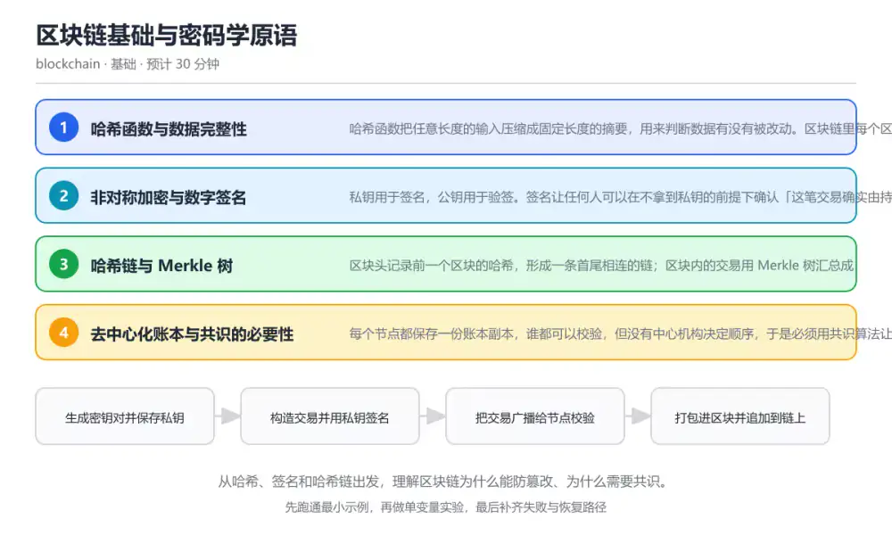
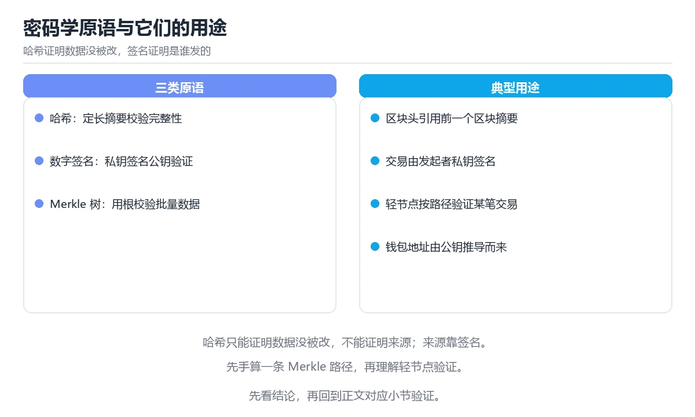

# 区块链基础与密码学原语

> 内容更新时间：2026-10-06 · 学习阶段：基础 · 预计用时：45 分钟

分类：blockchain。关键词：哈希、数字签名、Merkle 树、账本、共识。从哈希、签名和哈希链出发，理解区块链为什么能防篡改、为什么需要共识。

学习建议：先通读《区块链基础与密码学原语》的核心知识与关键流程，再运行可运行练习并完成测验；遇到不确定的结论，回到「故障现场」按症状、根因、修复、验证四步核对。



## 本节知识框架

**课程定位**：所属分类为「区块链与 Web3」，课程主题为「区块链基础与密码学原语」，学习阶段为「基础」，建议用时 45 分钟。

**本课要解决的主问题**：从哈希、签名和哈希链出发，理解区块链为什么能防篡改、为什么需要共识。

| 学习层次 | 要回答的问题 | 完成判据 |
| --- | --- | --- |
| 概念层 | 「区块链基础与密码学原语」有哪些必须区分的对象与术语？ | 能用自己的话定义核心术语，并各举一个正例和一个反例。 |
| 机制层 | 这些对象按什么顺序发生作用，输入如何变成输出？ | 能画出或写出机制步骤，并说明每一步的失败条件。 |
| 应用层 | 什么场景适合使用「区块链基础与密码学原语」，什么场景不适合？ | 能给出一个真实场景、一个最小示例和一个边界案例。 |
| 性能层 | 时间、空间、吞吐或延迟受哪些量影响？ | 能说出复杂度或性能瓶颈的证据来源；没有证据时明确写“材料未提供”。 |
| 复习层 | 怎样确认自己不是只记住了结论？ | 能独立完成本课自测，并把错误定位到概念、机制、示例或边界。 |

### 阅读路线

1. 先读「核心概念定义」，建立「哈希」等对象的精确定义。
2. 再读「原理与运行机制」，把定义串成可重复的过程。
3. 用「代码/协议/SQL 示例」验证过程，并只改一个条件观察结果变化。
4. 最后检查性能、易错点、知识关系与自测题，形成可复习的证据链。

**前置知识**：没有硬性先修课；仍建议先具备本分类的基础阅读与操作能力。

**学习位置**：本课是当前分类的第一课，建议从本页开始建立术语表。

**后续衔接**：下一课《钱包、密钥与签名》会继续使用本课术语，学完后建议立即完成一次自测。

**教材衔接：学习目标**

- 能解释哈希函数的三条性质：确定性、雪崩效应和单向性。
- 能画出「交易 → 签名 → 区块 → 链」的数据流，并说明每一步校验什么。
- 能区分区块链防篡改来自哈希链与共识，而不是来自「加密」。

**教材衔接：前置知识**

- 了解二进制与位运算的基本概念，知道十六进制字符串如何表示字节。
- 能运行一段最简 JavaScript 或 Python 程序并观察输出。
- 知道公钥密码学解决的是「证明身份」而不是「隐藏内容」。

**教材衔接：本课小结**

- 区块链基础与密码学原语围绕哈希、数字签名、Merkle 树展开，先建立基线再讨论优化。
- 哈希函数把任意长度的输入压缩成固定长度的摘要，用来判断数据有没有被改动。区块链里每个区块、每笔交易都靠摘要互相引用。
- 排查 数字签名 时保留原始错误信息，不要先改代码。

## 核心概念定义

> 阅读约定：本课先给「区块链基础与密码学原语」相关术语的操作性定义与适用边界；正文里的口语化说法与定义冲突时，以定义和可复现示例为准。

| 术语 | 操作性定义 | 本课中的边界 |
| --- | --- | --- |
| 哈希函数 | 把任意长度输入映射为固定长度摘要的单向函数，用于完整性校验。 | 仅在「区块链基础与密码学原语」明确给出的输入、版本与资源条件下成立。 |
| 数字签名 | 用私钥生成、用公钥验证的凭证，证明消息来源与未被篡改。 | 仅在「区块链基础与密码学原语」明确给出的输入、版本与资源条件下成立。 |
| Merkle 树 | 把多条数据两两哈希向上归并的树结构，可用短证明验证单条数据存在。 | 仅在「区块链基础与密码学原语」明确给出的输入、版本与资源条件下成立。 |
| 区块头 | 记录前块哈希、Merkle 根、时间戳与共识字段的固定结构。 | 仅在「区块链基础与密码学原语」明确给出的输入、版本与资源条件下成立。 |
| 共识算法 | 在无中心机构时让节点对账本顺序达成一致的规则集合。 | 仅在「区块链基础与密码学原语」明确给出的输入、版本与资源条件下成立。 |

### 定义如何使用

在「区块链基础与密码学原语」中判断一个说法是否成立，先确认它使用的是哪个对象的定义，再检查输入规模、运行环境与失败路径。定义不是口号，而是后续推导、代码示例和自测题共享的约束。

## 原理与运行机制

### 机制总览

1. **建立输入**：把「哈希函数」按本课定义整理成可观察、可重复的输入条件。
2. **执行转换**：围绕「数字签名」执行本课的核心步骤；每一步都记录中间状态，避免只看最终输出。
3. **产生输出**：得到「Merkle 树」后，用正文示例或协议/SQL 结果核对输出是否符合预期。
4. **改变一个条件**：只替换一个边界条件或环境参数，观察「区块链基础与密码学原语」的结论是否仍然成立。

| 阶段 | 关注对象 | 失败时应检查 |
| --- | --- | --- |
| 输入 | 哈希函数 | 类型、范围、编码、版本或前置状态是否满足定义。 |
| 处理 | 数字签名 | 顺序、可见性、锁、路由、事务或调度规则是否被破坏。 |
| 输出 | Merkle 树 | 结果是否可复现，错误是否被正确传播而不是被吞掉。 |

本课的机制结论要用「区块链基础与密码学原语」自己的示例验证。「区块链基础与密码学原语」没有给出某个数量级、吞吐或内存数据时，本课把该判断标为“材料未提供”，不从相邻主题外推。

**教材衔接：核心知识**

### 1. 哈希函数与数据完整性

哈希函数把任意长度的输入压缩成固定长度的摘要，用来判断数据有没有被改动。区块链里每个区块、每笔交易都靠摘要互相引用。

SHA-256 对输入做分组扩散运算，输出 256 位摘要。输入改动一个比特，输出会大幅变化，这叫雪崩效应；同时哈希是单向的，无法从摘要反推原文。

在区块链基础与密码学原语里可以这样验证：把「hello」和「hello!」分别做 SHA-256，比较两个摘要的差异程度；再把同一段数据算两次，确认结果完全一致。

边界：哈希只能证明数据未被改动，不能证明数据来源可信，也不能防止别人重新计算一份「合法」的假数据。

工程视角：落库时同时保存算法标识与摘要，算法要可升级；摘要比对要用常数时间比较，避免旁路泄漏。

### 2. 非对称加密与数字签名

私钥用于签名，公钥用于验签。签名让任何人可以在不拿到私钥的前提下确认「这笔交易确实由持有私钥的人发出」。

签名算法先对消息摘要运算，再用私钥生成签名的两个整数。验签时用公钥和消息摘要验证等式成立，等式不成立说明消息被改或签名伪造。

在区块链基础与密码学原语里可以这样验证：生成一对密钥，对一段交易文本签名，然后分别用正确的公钥和被改动一个字符的公钥验签，观察结果差异。

边界：签名不提供保密性，链上数据默认公开；私钥一旦泄露，攻击者可以伪造任何以你名义发出的交易。

工程视角：私钥必须离线或放入硬件模块保存，签名随机数绝不能复用；同一私钥不要跨链跨协议混用。

### 3. 哈希链与 Merkle 树

区块头记录前一个区块的哈希，形成一条首尾相连的链；区块内的交易用 Merkle 树汇总成一个根哈希，便于按路径证明某笔交易存在。

Merkle 树把交易两两哈希向上合并，树根写入区块头。验证某笔交易时只需要同层的兄弟哈希，也就是 Merkle 路径，复杂度从全量 O(n) 降到 O(log n)。

在区块链基础与密码学原语里可以这样验证：用四笔交易构造 Merkle 树，手算每条叶子到根的路径；然后改动其中一笔交易，观察根哈希和区块哈希如何同时变化。

边界：Merkle 证明只说明「这笔交易在树里」，不说明交易本身是否合法；合法性仍要靠交易规则和共识校验。

工程视角：轻客户端、跨链证明和空投快照都依赖 Merkle 证明；实现时要统一叶子哈希前缀，避免第二原像攻击。

### 4. 去中心化账本与共识的必要性

每个节点都保存一份账本副本，谁都可以校验，但没有中心机构决定顺序，于是必须用共识算法让所有节点对「哪条链是主链」达成一致。

共识把「打包区块」的权力和成本绑定在一起：工作量证明付出算力，权益证明锁定资产；作恶要让收益小于成本，诚实参与反而更划算。

在区块链基础与密码学原语里可以这样验证：对比中心化数据库与区块链账本：同样是转账，前者由数据库管理员写入，后者由矿工或验证者竞争打包，再由全网节点复核。

边界：节点数量多不等于去中心化；如果出块权、升级权或 RPC 访问集中在少数实体手里，实际信任模型仍然是中心化的。

工程视角：评估一条链时要看验证者分布、客户端多样性、升级流程与 RPC 提供方；只统计节点数会误判风险。

**教材衔接：关键流程**

```text
生成密钥对并保存私钥 → 构造交易并用私钥签名 → 把交易广播给节点校验 → 打包进区块并追加到链上
```

1. 生成密钥对并保存私钥
2. 构造交易并用私钥签名
3. 把交易广播给节点校验
4. 打包进区块并追加到链上

## 典型应用场景

| 场景 | 典型输入或前提 | 期望产物 |
| --- | --- | --- |
| 学习验证 | 使用本课最小示例和 哈希、数字签名 | 能复现正文结论，并解释每一步。 |
| 工程落地 | 把「区块链基础与密码学原语」放入真实模块或服务边界 | 输出可观测、失败可定位、参数可配置。 |
| 故障排查 | 只改一个版本、规模、输入或依赖条件 | 能区分概念错误、实现错误和环境差异。 |

判断「区块链基础与密码学原语」的场景是否成立，标准是能否写出输入、处理、输出和失败路径；材料中没有出现的数据在本课标注为“材料未提供”，不用推测替代证据。

**教材衔接：深度拓展与实战**

这一节把区块链基础与密码学原语的机制拆开验证：每一步都给出输入、判断标准和失败信号，便于在真实项目里复用。

### 机制拆解 1：哈希函数与数据完整性

SHA-256 对输入做分组扩散运算，输出 256 位摘要。输入改动一个比特，输出会大幅变化，这叫雪崩效应；同时哈希是单向的，无法从摘要反推原文。

落地时先确认前提：哈希只能证明数据未被改动，不能证明数据来源可信，也不能防止别人重新计算一份「合法」的假数据。；再把结论写进检查表，让下一位同学可以按同样的输入复现。

工程做法：落库时同时保存算法标识与摘要，算法要可升级；摘要比对要用常数时间比较，避免旁路泄漏。

### 机制拆解 2：非对称加密与数字签名

签名算法先对消息摘要运算，再用私钥生成签名的两个整数。验签时用公钥和消息摘要验证等式成立，等式不成立说明消息被改或签名伪造。

落地时先确认前提：签名不提供保密性，链上数据默认公开；私钥一旦泄露，攻击者可以伪造任何以你名义发出的交易。；再把结论写进检查表，让下一位同学可以按同样的输入复现。

工程做法：私钥必须离线或放入硬件模块保存，签名随机数绝不能复用；同一私钥不要跨链跨协议混用。

### 机制拆解 3：哈希链与 Merkle 树

Merkle 树把交易两两哈希向上合并，树根写入区块头。验证某笔交易时只需要同层的兄弟哈希，也就是 Merkle 路径，复杂度从全量 O(n) 降到 O(log n)。

落地时先确认前提：Merkle 证明只说明「这笔交易在树里」，不说明交易本身是否合法；合法性仍要靠交易规则和共识校验。；再把结论写进检查表，让下一位同学可以按同样的输入复现。

工程做法：轻客户端、跨链证明和空投快照都依赖 Merkle 证明；实现时要统一叶子哈希前缀，避免第二原像攻击。

### 机制拆解 4：去中心化账本与共识的必要性

共识把「打包区块」的权力和成本绑定在一起：工作量证明付出算力，权益证明锁定资产；作恶要让收益小于成本，诚实参与反而更划算。

落地时先确认前提：节点数量多不等于去中心化；如果出块权、升级权或 RPC 访问集中在少数实体手里，实际信任模型仍然是中心化的。；再把结论写进检查表，让下一位同学可以按同样的输入复现。

工程做法：评估一条链时要看验证者分布、客户端多样性、升级流程与 RPC 提供方；只统计节点数会误判风险。

### 机制对照表

| 概念 | 解决什么问题 | 关键前提 | 失败信号 |
| --- | --- | --- | --- |
| 哈希函数与数据完整性 | 哈希函数把任意长度的输入压缩成固定长度的摘要，用来判断数据有没有被改动。区块链里 | 哈希只能证明数据未被改动，不能证明数据来源可信，也不能防止别人重新计算一 | 落库时同时保存算法标识与摘要，算法要可升级；摘要比对要用常数时间比较，避 |
| 非对称加密与数字签名 | 私钥用于签名，公钥用于验签。签名让任何人可以在不拿到私钥的前提下确认「这笔交易确 | 签名不提供保密性，链上数据默认公开；私钥一旦泄露，攻击者可以伪造任何以你 | 私钥必须离线或放入硬件模块保存，签名随机数绝不能复用；同一私钥不要跨链跨 |
| 哈希链与 Merkle 树 | 区块头记录前一个区块的哈希，形成一条首尾相连的链；区块内的交易用 Merkle  | Merkle 证明只说明「这笔交易在树里」，不说明交易本身是否合法；合法 | 轻客户端、跨链证明和空投快照都依赖 Merkle 证明；实现时要统一叶子 |
| 去中心化账本与共识的必要性 | 每个节点都保存一份账本副本，谁都可以校验，但没有中心机构决定顺序，于是必须用共识 | 节点数量多不等于去中心化；如果出块权、升级权或 RPC 访问集中在少数实 | 评估一条链时要看验证者分布、客户端多样性、升级流程与 RPC 提供方；只 |

### 自测问答

**问 1**：关于哈希函数的雪崩效应，下列说法正确的是？

**答**：输入改动一个比特，输出摘要会大幅变化。雪崩效应指输入微小变化会让输出近似完全改变，这是哈希能用于完整性校验的原因；如果输出只随对应位变化，攻击者就能逐步逼近原文。 正确选项「输入改动一个比特，输出摘要会大幅变化」对应《区块链基础与密码学原语》的要点「哈希函数与数据完整性」：哈希函数把任意长度的输入压缩成固定长度的摘要，用来判断数据有没有被改动。区块链里每个区块、每笔交易都靠摘要互相引用。判断「哈希函数与数据完整性」时先确认前提是否成立，再回到《区块链基础与密码学原语》的示例核对一次；把别的语言或框架的默认做法直接搬到哈希函数与数据完整性上，往往会在本课的边界条件里失效。

**问 2**：区块链的防篡改主要来自哪一组机制？

**答**：哈希链加共识规则。哈希链让改动历史必然改变后续所有区块哈希，共识规则决定哪条链被接受；两者结合才让篡改成本高于收益，单独加密或日志都无法防止重写历史。 正确选项「哈希链加共识规则」对应《区块链基础与密码学原语》的要点「非对称加密与数字签名」：私钥用于签名，公钥用于验签。签名让任何人可以在不拿到私钥的前提下确认「这笔交易确实由持有私钥的人发出」。判断「非对称加密与数字签名」时先确认前提是否成立，再回到《区块链基础与密码学原语》的示例核对一次；借鉴相邻主题的经验之前，先核对非对称加密与数字签名的前提是否成立。

**问 3**：以下哪些属于数字签名能提供的保证？（多选）

**答**：消息来源可验证；消息内容未被修改；签名者无法否认签名行为。签名用私钥生成、公钥验证，可确认来源与完整性，并具备不可否认性；但签名不隐藏内容，链上数据默认公开，需要保密必须另行加密。 正确选项「消息来源可验证；消息内容未被修改；签名者无法否认签名行为」对应《区块链基础与密码学原语》的要点「哈希链与 Merkle 树」：区块头记录前一个区块的哈希，形成一条首尾相连的链；区块内的交易用 Merkle 树汇总成一个根哈希，便于按路径证明某笔交易存在。判断「哈希链与 Merkle 树」时先确认前提是否成立，再回到《区块链基础与密码学原语》的示例核对一次；记住哈希链与 Merkle 树的结论之外还要记住适用条件，换一个输入往往就不成立了。

**问 4**：请按交易进入区块链的顺序排列下面的步骤。

**答**：打包进区块并广播。完整顺序是：先有密钥对，再构造并签名交易，节点校验通过后才被打包进区块广播全网；顺序颠倒会出现未签名先广播或未校验先入块的错误流程。 正确选项「生成密钥对并保管私钥；构造交易并签名；节点校验交易签名与余额；打包进区块并广播」对应《区块链基础与密码学原语》的要点「去中心化账本与共识的必要性」：每个节点都保存一份账本副本，谁都可以校验，但没有中心机构决定顺序，于是必须用共识算法让所有节点对「哪条链是主链」达成一致。判断「去中心化账本与共识的必要性」时先确认前提是否成立，再回到《区块链基础与密码学原语》的示例核对一次；干扰项常常是相邻主题里成立的结论，只有按去中心化账本与共识的必要性的输入与约束判断才能排除。

**问 5**：读下面的代码片段，哪一项描述正确？

**答**：篡改交易后 Merkle 根会改变，可据此发现改动。代码只做哈希与拼接，没有加密，因此不提供保密性；Merkle 根随交易内容变化，这说明它能发现改动，但固定长度摘要并不代表不同输入会得到相同输出。 正确选项「篡改交易后 Merkle 根会改变，可据此发现改动」对应《区块链基础与密码学原语》的要点「哈希函数与数据完整性」：哈希函数把任意长度的输入压缩成固定长度的摘要，用来判断数据有没有被改动。区块链里每个区块、每笔交易都靠摘要互相引用。判断「哈希函数与数据完整性」时先确认前提是否成立，再回到《区块链基础与密码学原语》的示例核对一次；把哈希函数与数据完整性的做法换到别的约束下未必成立，先确认边界再决定答案。

### 排错速查

- 看到「认为「数据上链前做了哈希，所以内容被保密了」」时，先按「哈希只保证完整性；需要保密要在上链前加密，并想清楚密钥由谁保管」处理，再用区块链基础与密码学原语的最小示例确认结论是否恢复。
- 看到「把私钥写在配置文件或聊天记录里，随节点一起部署」时，先按「私钥放硬件钱包或密钥管理服务，签名服务与业务服务分离」处理，再用区块链基础与密码学原语的最小示例确认结论是否恢复。
- 看到「只比对当前交易摘要，不校验它与前序区块的连接」时，先按「从创世块或可信检查点开始重建链，逐块校验哈希链接与共识规则」处理，再用区块链基础与密码学原语的最小示例确认结论是否恢复。

### 工程检查表

- [ ] 生成密钥对并保存私钥
- [ ] 构造交易并用私钥签名
- [ ] 把交易广播给节点校验
- [ ] 打包进区块并追加到链上
- [ ] 【哈希函数与数据完整性】落库时同时保存算法标识与摘要，算法要可升级；摘要比对要用常数时间比较，避免旁路泄漏。
- [ ] 【非对称加密与数字签名】私钥必须离线或放入硬件模块保存，签名随机数绝不能复用；同一私钥不要跨链跨协议混用。
- [ ] 【哈希链与 Merkle 树】轻客户端、跨链证明和空投快照都依赖 Merkle 证明；实现时要统一叶子哈希前缀，避免第二原像攻击。
- [ ] 【去中心化账本与共识的必要性】评估一条链时要看验证者分布、客户端多样性、升级流程与 RPC 提供方；只统计节点数会误判风险。

### 迁移练习

把区块链基础与密码学原语的方法用到一个真实场景：写下哈希、数字签名、Merkle 树在你的场景里分别对应什么，再记录一次失败尝试和它的恢复步骤。

### 延伸阅读与下一步

- 复习哈希、数字签名、Merkle 树、账本、共识时，优先回看「哈希函数与数据完整性」与「去中心化账本与共识的必要性」两节。
- 把从「生成密钥对并保存私钥」到「打包进区块并追加到链上」的流程画成一张图，放进自己的笔记。
- 一周后重做本课测验，只把答错的题留到下一轮复习。

### 结论与下一步

学完区块链基础与密码学原语，应该能独立完成三件事：先用最小示例确认哈希的行为，再用一个边界输入验证结论，最后把失败路径写成可重复的检查。下一步把本课术语加入复习清单，并在两周内用一次真实任务检验记忆是否牢固。

## 代码/协议/SQL 示例

### 最小可验证示例

下面保留《区块链基础与密码学原语》原文中的最小示例。先预测《区块链基础与密码学原语》示例的输出，再按正文步骤运行或推演；示例依赖外部环境时，同时记录版本与输入。

```text
生成密钥对并保存私钥 → 构造交易并用私钥签名 → 把交易广播给节点校验 → 打包进区块并追加到链上
```

**教材衔接：原文最小示例**

```text
生成密钥对并保存私钥 → 构造交易并用私钥签名 → 把交易广播给节点校验 → 打包进区块并追加到链上
```

## 时间/空间复杂度或性能分析

**复杂度证据**：本课正文出现 `O(n)`、`O(log n)` 等量级表达式；使用前要同时确认输入规模、最好/平均/最坏情况以及常数项来源。

| 维度 | 本课关注点 | 判断依据 |
| --- | --- | --- |
| 时间/延迟 | 「区块链基础与密码学原语」的主要步骤是否会随输入规模、并发度或网络往返增长。 | 以正文复杂度、基准数据或可重复测量为准。 |
| 空间/内存 | 中间状态、缓存、副本、连接或索引是否随规模增长。 | 记录峰值内存与数据副本，不只看最终结果。 |
| 吞吐/资源 | 版本、调度、锁、IO、序列化或协议开销是否成为瓶颈。 | 固定环境做对照实验，改变一个变量。 |

评估「区块链基础与密码学原语」时要区分“正确性成立”和“性能达标”两件事；材料没有给出基准时，本课只保留量级来源与测量方法，不写不可验证的绝对数字。

## 常见误区与易错点

> 复核《区块链基础与密码学原语》的易错点时，优先保留原文的错误表、故障现场与排错路径；每条修正都要能用本课示例复验。

| 易错点 | 常见表现 | 正确做法 |
| --- | --- | --- |
| 只背结论 | 能复述「区块链基础与密码学原语」的定义，却说不清输入、输出与边界。 | 回到机制步骤，用最小示例逐一验证。 |
| 混淆相邻概念 | 把本课对象与相邻主题的对象当成同一类。 | 先比较定义、资源归属、生命周期和失败模式。 |
| 忽略版本与环境 | 在开发机通过后直接外推到生产环境。 | 固定版本、输入和资源条件，再记录可复现结果。 |

**教材衔接：常见错误与排查**

> 说明：本表由《区块链基础与密码学原语》的核心知识整理（2026-10-06），人工复核进度见 docs/content_review_batches.md。

| 易错点 | 容易踩的做法 | 正确结论 |
| --- | --- | --- |
| 把哈希当成加密 | 认为「数据上链前做了哈希，所以内容被保密了」 | 哈希只保证完整性；需要保密要在上链前加密，并想清楚密钥由谁保管 |
| 私钥在线保存 | 把私钥写在配置文件或聊天记录里，随节点一起部署 | 私钥放硬件钱包或密钥管理服务，签名服务与业务服务分离 |
| 只校验单条记录 | 只比对当前交易摘要，不校验它与前序区块的连接 | 从创世块或可信检查点开始重建链，逐块校验哈希链接与共识规则 |

**教材衔接：故障现场**

### 现场 1：把哈希当成加密

**症状**：在《区块链基础与密码学原语》的复现场景中，认为「数据上链前做了哈希，所以内容被保密了」。

**根因**：触发点是把“把哈希当成加密”当成安全做法。它没有满足《区块链基础与密码学原语》要求的前提，因此先表现为“认为「数据上链前做了哈希，所以内容被保密了」”；排查时先完整复现这一段，再核对输入、配置与依赖。

**修复**：针对《区块链基础与密码学原语》的问题，哈希只保证完整性；需要保密要在上链前加密，并想清楚密钥由谁保管。

**验证**：先在《区块链基础与密码学原语》中记录“把哈希当成加密”留下的失败证据，再执行“哈希只保证完整性；需要保密要在上链前加密，并想清楚密钥由谁保管”并重放；确认错误路径变为明确结果，且修复没有掩盖同类故障。

### 现场 2：私钥在线保存

**症状**：在《区块链基础与密码学原语》的复现场景中，把私钥写在配置文件或聊天记录里，随节点一起部署。

**根因**：“把私钥写在配置文件或聊天记录里，随节点一起部署”只是表层结果。向上追溯会落到“私钥在线保存”这一步，因为它省略了《区块链基础与密码学原语》的约束，使实现行为和预期模型发生了偏离。

**修复**：针对《区块链基础与密码学原语》的问题，私钥放硬件钱包或密钥管理服务，签名服务与业务服务分离。

**验证**：在《区块链基础与密码学原语》中按“私钥放硬件钱包或密钥管理服务，签名服务与业务服务分离”调整后，从“私钥在线保存”的触发条件重放同一条路径，确认“把私钥写在配置文件或聊天记录里，随节点一起部署”不再出现，并补一个相邻边界用例检查没有引入新问题。

### 现场 3：只校验单条记录

**症状**：在《区块链基础与密码学原语》的复现场景中，只比对当前交易摘要，不校验它与前序区块的连接。

**根因**：“只比对当前交易摘要，不校验它与前序区块的连接”只是表层结果。向上追溯会落到“只校验单条记录”这一步，因为它省略了《区块链基础与密码学原语》的约束，使实现行为和预期模型发生了偏离。

**修复**：针对《区块链基础与密码学原语》的问题，从创世块或可信检查点开始重建链，逐块校验哈希链接与共识规则。

**验证**：保留《区块链基础与密码学原语》里触发“只比对当前交易摘要，不校验它与前序区块的连接”的输入、版本和日志，按“从创世块或可信检查点开始重建链，逐块校验哈希链接与共识规则”完成修改后原样重放；只有失败现象消失且相邻场景仍可解释，才保留改动。

## 与其他知识点的关系

| 关系 | 课程 | 为什么 |
| --- | --- | --- |
| 后续顺序 | 《钱包、密钥与签名》 | 同分类中安排在本课之后，会继续使用本课术语。 |

把「区块链基础与密码学原语」放回知识体系时，不只要记住“前面学过什么”，还要说明两个主题在输入、机制、资源边界和失败模式上的差异。这样才能把单课知识迁移到项目、排障和后续课程。

**教材衔接：复习与迁移**

### 概念复述

不看正文，把区块链基础与密码学原语讲给一个没学过的同事：先讲它解决什么问题，再讲一个最小例子，最后说明一个不适用场景。

### 测验回顾

回到《区块链基础与密码学原语》测验，只重做答错或犹豫的题；对每道题写一句「我为什么改选这个答案」，写不出理由就回到对应小节。

### 迁移练习

把《区块链基础与密码学原语》的方法用到一个你自己的真实场景：说明输入、约束与验证方式，并列出仍然不确定、需要下一次实验回答的问题。

## 自测题与参考答案

> 先独立作答《区块链基础与密码学原语》的自测题，再对照答案与解析；每处判断都要能在本课正文或示例中找到依据。

### 自测 1

关于哈希函数的雪崩效应，下列说法正确的是？

A. 相同输入在不同机器上得到不同摘要
B. 输入改动一个比特，输出摘要会大幅变化
C. 输入改动一个比特，输出只有对应位变化
D. 输出长度随输入长度线性增长

**参考答案**：输入改动一个比特，输出摘要会大幅变化

**解析**：雪崩效应指输入微小变化会让输出近似完全改变，这是哈希能用于完整性校验的原因；如果输出只随对应位变化，攻击者就能逐步逼近原文。 正确选项「输入改动一个比特，输出摘要会大幅变化」对应《区块链基础与密码学原语》的要点「哈希函数与数据完整性」：哈希函数把任意长度的输入压缩成固定长度的摘要，用来判断数据有没有被改动。区块链里每个区块、每笔交易都靠摘要互相引用。判断「哈希函数与数据完整性」时先确认前提是否成立，再回到《区块链基础与密码学原语》的示例核对一次；把别的语言或框架的默认做法直接搬到哈希函数与数据完整性上，往往会在本课的边界条件里失效。

### 自测 2

以下哪些属于数字签名能提供的保证？（多选）

A. 消息来源可验证
B. 消息内容未被修改
C. 消息内容对外保密
D. 签名者无法否认签名行为

**参考答案**：消息来源可验证；消息内容未被修改；签名者无法否认签名行为

**解析**：签名用私钥生成、公钥验证，可确认来源与完整性，并具备不可否认性；但签名不隐藏内容，链上数据默认公开，需要保密必须另行加密。 正确选项「消息来源可验证；消息内容未被修改；签名者无法否认签名行为」对应《区块链基础与密码学原语》的要点「哈希链与 Merkle 树」：区块头记录前一个区块的哈希，形成一条首尾相连的链；区块内的交易用 Merkle 树汇总成一个根哈希，便于按路径证明某笔交易存在。判断「哈希链与 Merkle 树」时先确认前提是否成立，再回到《区块链基础与密码学原语》的示例核对一次；记住哈希链与 Merkle 树的结论之外还要记住适用条件，换一个输入往往就不成立了。

### 自测 3

请按交易进入区块链的顺序排列下面的步骤。

A. 打包进区块并广播
B. 生成密钥对并保管私钥
C. 节点校验交易签名与余额
D. 构造交易并签名

**参考答案**：生成密钥对并保管私钥 → 构造交易并签名 → 节点校验交易签名与余额 → 打包进区块并广播

**解析**：完整顺序是：先有密钥对，再构造并签名交易，节点校验通过后才被打包进区块广播全网；顺序颠倒会出现未签名先广播或未校验先入块的错误流程。 正确选项「生成密钥对并保管私钥；构造交易并签名；节点校验交易签名与余额；打包进区块并广播」对应《区块链基础与密码学原语》的要点「去中心化账本与共识的必要性」：每个节点都保存一份账本副本，谁都可以校验，但没有中心机构决定顺序，于是必须用共识算法让所有节点对「哪条链是主链」达成一致。判断「去中心化账本与共识的必要性」时先确认前提是否成立，再回到《区块链基础与密码学原语》的示例核对一次；干扰项常常是相邻主题里成立的结论，只有按去中心化账本与共识的必要性的输入与约束判断才能排除。

**教材衔接：动手练习**

1. 把示例里的两笔交易扩成四笔，画出 Merkle 树并写出每笔交易的证明路径。
2. 用同一段文本连续哈希两次，再改动一个字符哈希一次，记录三次摘要的差异。
3. 查找一个真实公链的区块浏览器，读出一个区块的哈希、前块哈希与交易数量。

**验收标准**：留下 createHash 的输入、命令、输出和结论，让别人能按记录复现。

**教材衔接：可运行练习**

### 任务 1：先跑通，再解释

```javascript
const crypto = require('crypto');

const hash = (data) => crypto.createHash('sha256').update(data).digest('hex');

// 1. 构造两条交易并计算摘要
const tx1 = 'alice->bob:10';
const tx2 = 'bob->carol:4';
console.log('tx1', hash(tx1));
console.log('tx2', hash(tx2));

// 2. 两两哈希得到 Merkle 根
const root = hash(hash(tx1) + hash(tx2));
console.log('merkle root', root);

// 3. 篡改交易，观察根哈希变化
const tampered = hash(tx1) + hash('bob->carol:40');
console.log('tampered root', hash(tampered));
console.log('root changed:', root !== hash(tampered));
```

这段代码先算两笔交易的摘要，再合并成 Merkle 根；最后篡改第二笔金额，根哈希随之改变，直观说明为什么链上数据改一个字节就会暴露。

### 任务 2：只改一个条件

复制上面的示例，只改一个输入或参数再跑一次；先写下预测，再和真实输出对照，并说明差异来自区块链基础与密码学原语的哪条机制。

### 任务 3：迁移到自己的数据

把《区块链基础与密码学原语》里的示例换成你自己的一小段数据或场景，保持结构不变；如果换不动，说明还有哪条前提没有理解，回到核心知识对应小节。

**教材衔接：本课复习清单**

离开本课前，逐项确认：

- [ ] 能说出哈希、签名、Merkle 树各自解决哪一类问题。
- [ ] 能解释为什么哈希上链不等于数据保密。
- [ ] 能说明共识算法要付出的成本与得到的保证。
- [ ] 至少运行一次 createHash 的示例，记录输入、输出和 哈希 的边界情况。
- [ ] 把本课最容易混淆的两个概念写成一句话对照。

| 复盘项 | 记录 |
| --- | --- |
| 已经能独立解释的考点 |  |
| 仍然说不清的概念 |  |
| 下一步验证动作 |  |

**教材衔接：复习与自测**

### 核心知识

遮住正文回答：区块链基础与密码学原语解决什么问题、依赖哪些前提、失败时先看哪个信号？三问都能答清楚，再进入下一节。

### 动手练习

把《区块链基础与密码学原语》里「只改一个条件」的练习再做一遍，这次先写预测再运行；预测和结果不一致的地方，就是需要回读的章节。

### 最小可运行示例

```javascript
const crypto = require('crypto');

const hash = (data) => crypto.createHash('sha256').update(data).digest('hex');

// 1. 构造两条交易并计算摘要
const tx1 = 'alice->bob:10';
const tx2 = 'bob->carol:4';
console.log('tx1', hash(tx1));
console.log('tx2', hash(tx2));

// 2. 两两哈希得到 Merkle 根
const root = hash(hash(tx1) + hash(tx2));
console.log('merkle root', root);

// 3. 篡改交易，观察根哈希变化
const tampered = hash(tx1) + hash('bob->carol:40');
console.log('tampered root', hash(tampered));
console.log('root changed:', root !== hash(tampered));
```

### 预期输出

```text
tx1 与 tx2 是两个 64 位十六进制摘要；merkle root 由两个摘要拼接后再哈希得到；篡改后 root changed: true。
```

### 验证步骤

1. 确认输入数据与运行环境和示例一致。
2. 运行示例，记录输出与耗时等可观测指标。
3. 换一个边界输入重跑，确认结论仍然成立。
4. 把两次结果写成一句话结论，注明前提与局限。

---

## 术语速查

先遮住右列，尝试用自己的话解释，再回到正文核对。

| 术语 | 一句话说明 |
| --- | --- |
| `哈希函数` | 把任意长度输入映射为固定长度摘要的单向函数，用于完整性校验。 |
| `数字签名` | 用私钥生成、用公钥验证的凭证，证明消息来源与未被篡改。 |
| `Merkle 树` | 把多条数据两两哈希向上归并的树结构，可用短证明验证单条数据存在。 |
| `区块头` | 记录前块哈希、Merkle 根、时间戳与共识字段的固定结构。 |
| `共识算法` | 在无中心机构时让节点对账本顺序达成一致的规则集合。 |

## 考点精讲

### 考点 1：关于哈希函数的雪崩效应，下列说法正确的是

题型：概念判断。题干：关于哈希函数的雪崩效应，下列说法正确的是？

判断要点：输入改动一个比特，输出摘要会大幅变化。雪崩效应指输入微小变化会让输出近似完全改变，这是哈希能用于完整性校验的原因；如果输出只随对应位变化，攻击者就能逐步逼近原文。 正确选项「输入改动一个比特，输出摘要会大幅变化」对应《区块链基础与密码学原语》的要点「哈希函数与数据完整性」：哈希函数把任意长度的输入压缩成固定长度的摘要，用来判断数据有没有被改动。区块链里每个区块、每笔交易都靠摘要互相引用。判断「哈希函数与数据完整性」时先确认前提是否成立，再回到《区块链基础与密码学原语》的示例核对一次；把别的语言或框架的默认做法直接搬到哈希函数与数据完整性上，往往会在本课的边界条件里失效。

### 考点 2：区块链的防篡改主要来自哪一组机制？

题型：概念判断。题干：区块链的防篡改主要来自哪一组机制？

判断要点：哈希链加共识规则。哈希链让改动历史必然改变后续所有区块哈希，共识规则决定哪条链被接受；两者结合才让篡改成本高于收益，单独加密或日志都无法防止重写历史。 正确选项「哈希链加共识规则」对应《区块链基础与密码学原语》的要点「非对称加密与数字签名」：私钥用于签名，公钥用于验签。签名让任何人可以在不拿到私钥的前提下确认「这笔交易确实由持有私钥的人发出」。判断「非对称加密与数字签名」时先确认前提是否成立，再回到《区块链基础与密码学原语》的示例核对一次；借鉴相邻主题的经验之前，先核对非对称加密与数字签名的前提是否成立。

### 考点 3：以下哪些属于数字签名能提供的保证？（多选

题型：多选辨析。题干：以下哪些属于数字签名能提供的保证？（多选）

判断要点：消息来源可验证；消息内容未被修改；签名者无法否认签名行为。签名用私钥生成、公钥验证，可确认来源与完整性，并具备不可否认性；但签名不隐藏内容，链上数据默认公开，需要保密必须另行加密。 正确选项「消息来源可验证；消息内容未被修改；签名者无法否认签名行为」对应《区块链基础与密码学原语》的要点「哈希链与 Merkle 树」：区块头记录前一个区块的哈希，形成一条首尾相连的链；区块内的交易用 Merkle 树汇总成一个根哈希，便于按路径证明某笔交易存在。判断「哈希链与 Merkle 树」时先确认前提是否成立，再回到《区块链基础与密码学原语》的示例核对一次；记住哈希链与 Merkle 树的结论之外还要记住适用条件，换一个输入往往就不成立了。

### 考点 4：请按交易进入区块链的顺序排列下面的步骤。

题型：顺序排列。题干：请按交易进入区块链的顺序排列下面的步骤。

判断要点：打包进区块并广播。完整顺序是：先有密钥对，再构造并签名交易，节点校验通过后才被打包进区块广播全网；顺序颠倒会出现未签名先广播或未校验先入块的错误流程。 正确选项「生成密钥对并保管私钥；构造交易并签名；节点校验交易签名与余额；打包进区块并广播」对应《区块链基础与密码学原语》的要点「去中心化账本与共识的必要性」：每个节点都保存一份账本副本，谁都可以校验，但没有中心机构决定顺序，于是必须用共识算法让所有节点对「哪条链是主链」达成一致。判断「去中心化账本与共识的必要性」时先确认前提是否成立，再回到《区块链基础与密码学原语》的示例核对一次；干扰项常常是相邻主题里成立的结论，只有按去中心化账本与共识的必要性的输入与约束判断才能排除。

### 考点 5：读下面的代码片段，哪一项描述正确？

题型：排错。题干：读下面的代码片段，哪一项描述正确？

判断要点：篡改交易后 Merkle 根会改变，可据此发现改动。代码只做哈希与拼接，没有加密，因此不提供保密性；Merkle 根随交易内容变化，这说明它能发现改动，但固定长度摘要并不代表不同输入会得到相同输出。 正确选项「篡改交易后 Merkle 根会改变，可据此发现改动」对应《区块链基础与密码学原语》的要点「哈希函数与数据完整性」：哈希函数把任意长度的输入压缩成固定长度的摘要，用来判断数据有没有被改动。区块链里每个区块、每笔交易都靠摘要互相引用。判断「哈希函数与数据完整性」时先确认前提是否成立，再回到《区块链基础与密码学原语》的示例核对一次；把哈希函数与数据完整性的做法换到别的约束下未必成立，先确认边界再决定答案。

## English Overview

Blockchain Fundamentals and Cryptographic Primitives

This lesson introduces the primitives behind every blockchain: hash functions for integrity, digital signatures for authenticity, Merkle trees for compact proofs, and consensus for ordering transactions without a central authority. You will build a tiny hash chain, tamper with it, and observe how the root changes.



## 内容元数据

- 内容版本：v2.0
- 最后更新：2026-10-06
- 学习阶段：基础

| 字段 | 值 |
| --- | --- |
| 课程 ID | `blockchain_basics` |
| 所属分类 | `blockchain` |
| 难度 | 基础 |
| 预计用时 | 30 分钟 |
| 关键词 | 哈希、数字签名、Merkle 树、账本、共识 |
| 配图 | `images/lesson_blockchain_basics.webp` |
| 参考资料 | 3 条 |
| 内容更新时间 | 2026-10-06 |

## 参考资料与复核

- 最后复核：2026-10-04
- 下次复核：2027-01-17
- 复核范围：版本兼容、API 行为与工程实践

下面列出的资料用于核对本课结论，复习时可以对照阅读：
- [Bitcoin: A Peer-to-Peer Electronic Cash System](https://bitcoin.org/bitcoin.pdf)
- [NIST FIPS 180-4 安全哈希标准](https://nvlpubs.nist.gov/nistpubs/FIPS/NIST.FIPS.180-4.pdf)
- [Merkle Tree（维基百科）](https://en.wikipedia.org/wiki/Merkle_tree)

> 复核提示：《区块链基础与密码学原语》的结论如与资料冲突，以资料中的规范文本为准，并在笔记里记录差异与日期。
