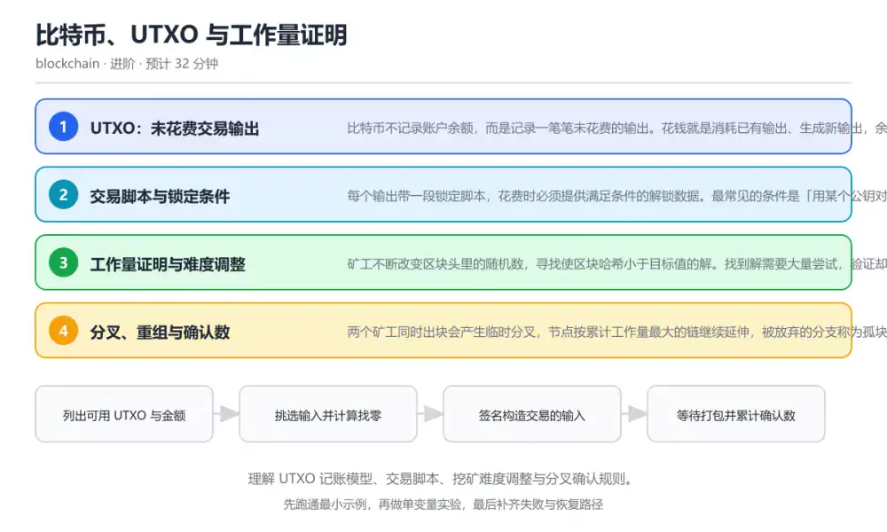
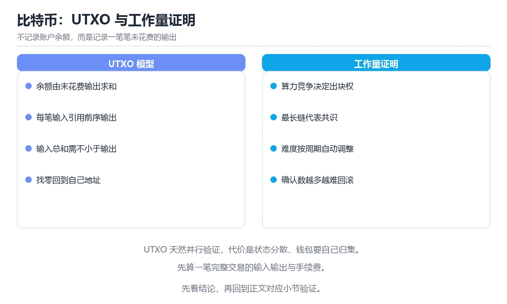

# 比特币、UTXO 与工作量证明

> 内容更新时间：2026-10-06 · 学习阶段：进阶 · 预计用时：45 分钟

分类：blockchain。关键词：UTXO、工作量证明、难度调整、分叉、确认数。理解 UTXO 记账模型、交易脚本、挖矿难度调整与分叉确认规则。

学习建议：先通读《比特币、UTXO 与工作量证明》的核心知识与关键流程，再运行可运行练习并完成测验；遇到不确定的结论，回到「故障现场」按症状、根因、修复、验证四步核对。



## 本节知识框架

**课程定位**：所属分类为「区块链与 Web3」，课程主题为「比特币、UTXO 与工作量证明」，学习阶段为「进阶」，建议用时 45 分钟。

**本课要解决的主问题**：理解 UTXO 记账模型、交易脚本、挖矿难度调整与分叉确认规则。

| 学习层次 | 要回答的问题 | 完成判据 |
| --- | --- | --- |
| 概念层 | 「比特币、UTXO 与工作量证明」有哪些必须区分的对象与术语？ | 能用自己的话定义核心术语，并各举一个正例和一个反例。 |
| 机制层 | 这些对象按什么顺序发生作用，输入如何变成输出？ | 能画出或写出机制步骤，并说明每一步的失败条件。 |
| 应用层 | 什么场景适合使用「比特币、UTXO 与工作量证明」，什么场景不适合？ | 能给出一个真实场景、一个最小示例和一个边界案例。 |
| 性能层 | 时间、空间、吞吐或延迟受哪些量影响？ | 能说出复杂度或性能瓶颈的证据来源；没有证据时明确写“材料未提供”。 |
| 复习层 | 怎样确认自己不是只记住了结论？ | 能独立完成本课自测，并把错误定位到概念、机制、示例或边界。 |

### 阅读路线

1. 先读「核心概念定义」，建立「UTXO」等对象的精确定义。
2. 再读「原理与运行机制」，把定义串成可重复的过程。
3. 用「代码/协议/SQL 示例」验证过程，并只改一个条件观察结果变化。
4. 最后检查性能、易错点、知识关系与自测题，形成可复习的证据链。

**前置知识**：《区块链基础与密码学原语》

**学习位置**：本课位于《钱包、密钥与签名》之后；如果前一课的自测不能通过，应先回补再继续。

**后续衔接**：下一课《以太坊、EVM 与智能合约》会继续使用本课术语，学完后建议立即完成一次自测。

**教材衔接：学习目标**

- 能用 UTXO 模型算出一笔交易的输入、输出与找零。
- 能解释难度调整如何把出块间隔稳定在十分钟附近。
- 能说明确认数、分叉与双花风险之间的关系。

**教材衔接：前置知识**

- 已理解哈希链与数字签名的作用，知道区块头记录前块哈希。
- 知道什么是交易手续费，以及矿工为什么愿意打包交易。
- 能读懂简单的 Python 函数与列表推导。

**教材衔接：本课小结**

- 比特币、UTXO 与工作量证明围绕UTXO、工作量证明、难度调整展开，先建立基线再讨论优化。
- 比特币不记录账户余额，而是记录一笔笔未花费的输出。花钱就是消耗已有输出、生成新输出，余额由钱包把所有可用输出加起来算出。
- 处理 UTXO 的问题时按「症状 → 根因 → 修复 → 验证」的顺序推进，不跳过验证。

## 核心概念定义

> 阅读约定：本课先给「比特币、UTXO 与工作量证明」相关术语的操作性定义与适用边界；正文里的口语化说法与定义冲突时，以定义和可复现示例为准。

| 术语 | 操作性定义 | 本课中的边界 |
| --- | --- | --- |
| UTXO | 未花费交易输出，是比特币账本里可直接被后续交易引用的资金单元。 | 仅在「比特币、UTXO 与工作量证明」明确给出的输入、版本与资源条件下成立。 |
| 找零输出 | 把输入金额减去付款与手续费后的余额发回自己地址的输出。 | 仅在「比特币、UTXO 与工作量证明」明确给出的输入、版本与资源条件下成立。 |
| 工作量证明 | 通过寻找满足目标值的区块哈希来竞争记账权的共识机制。 | 仅在「比特币、UTXO 与工作量证明」明确给出的输入、版本与资源条件下成立。 |
| 难度调整 | 按周期根据实际出块速度自动调整目标值，维持稳定出块间隔。 | 仅在「比特币、UTXO 与工作量证明」明确给出的输入、版本与资源条件下成立。 |
| 链重组 | 节点切换到累计工作量更大的分支，导致部分已打包交易回到待确认状态。 | 仅在「比特币、UTXO 与工作量证明」明确给出的输入、版本与资源条件下成立。 |
| 确认数 | 确认数只是概率保证，不是数学上的绝对最终性；算力骤降或共识规则变更会改变实际风险 | 仅在「比特币、UTXO 与工作量证明」明确给出的输入、版本与资源条件下成立。 |

### 定义如何使用

在「比特币、UTXO 与工作量证明」中判断一个说法是否成立，先确认它使用的是哪个对象的定义，再检查输入规模、运行环境与失败路径。定义不是口号，而是后续推导、代码示例和自测题共享的约束。

## 原理与运行机制

### 机制总览

1. **建立输入**：把「UTXO」按本课定义整理成可观察、可重复的输入条件。
2. **执行转换**：围绕「找零输出」执行本课的核心步骤；每一步都记录中间状态，避免只看最终输出。
3. **产生输出**：得到「工作量证明」后，用正文示例或协议/SQL 结果核对输出是否符合预期。
4. **改变一个条件**：只替换一个边界条件或环境参数，观察「比特币、UTXO 与工作量证明」的结论是否仍然成立。

| 阶段 | 关注对象 | 失败时应检查 |
| --- | --- | --- |
| 输入 | UTXO | 类型、范围、编码、版本或前置状态是否满足定义。 |
| 处理 | 找零输出 | 顺序、可见性、锁、路由、事务或调度规则是否被破坏。 |
| 输出 | 工作量证明 | 结果是否可复现，错误是否被正确传播而不是被吞掉。 |

本课的机制结论要用「比特币、UTXO 与工作量证明」自己的示例验证。「比特币、UTXO 与工作量证明」没有给出某个数量级、吞吐或内存数据时，本课把该判断标为“材料未提供”，不从相邻主题外推。

**教材衔接：核心知识**

### 1. UTXO：未花费交易输出

比特币不记录账户余额，而是记录一笔笔未花费的输出。花钱就是消耗已有输出、生成新输出，余额由钱包把所有可用输出加起来算出。

每笔交易的输入必须引用之前某笔交易的输出并解锁它，输出则写明金额和锁定条件。节点校验输入总和大于等于输出总和，差额就是手续费。

在比特币、UTXO 与工作量证明里可以这样验证：钱包里有 0.4 和 0.7 两个 UTXO，要支付 0.9：选择两个输入，输出 0.9 给收款方、0.199 找零给自己、0.001 作为手续费。

边界：UTXO 不能部分花费，找零必须显式生成新输出；忘记找零会把差额全部当成手续费送给矿工。

工程视角：钱包要做币种选择与找零管理，避免产生大量小额 UTXO；UTXO 越多，单笔交易的体积和手续费越高。

### 2. 交易脚本与锁定条件

每个输出带一段锁定脚本，花费时必须提供满足条件的解锁数据。最常见的条件是「用某个公钥对应的私钥签名」。

验证时先执行解锁脚本，再执行锁定脚本，最终栈顶为真即通过。多签、时间锁、哈希锁等条件都是在脚本层组合出来的。

在比特币、UTXO 与工作量证明里可以这样验证：对比单签输出与 2-of-3 多签输出：前者只需一个签名，后者要三个公钥中的任意两个签名才能花费。

边界：脚本表达能力有限且容易写错，复杂条件通常用更高层的协议实现；写错锁定脚本可能导致资产永久无法花费。

工程视角：托管和机构钱包优先使用经过审计的多签方案；上线前在测试网验证解锁路径和恢复流程。

### 3. 工作量证明与难度调整

矿工不断改变区块头里的随机数，寻找使区块哈希小于目标值的解。找到解需要大量尝试，验证却只需一次哈希。

全网每 2016 个区块按实际耗时调整目标值：出块太快就提高难度，太慢就降低难度，使平均间隔回到十分钟左右。

在比特币、UTXO 与工作量证明里可以这样验证：把目标值前缀的 0 的个数增加一位，手工估算哈希尝试次数如何成倍上升，理解难度与算力的关系。

边界：工作量证明保证的是重写历史成本高，不是交易立刻最终确认；算力集中会让 51% 攻击的假设变弱。

工程视角：监控矿池算力分布与出块延迟；交易所对大额入账设置更高确认数，降低重组风险。

### 4. 分叉、重组与确认数

两个矿工同时出块会产生临时分叉，节点按累计工作量最大的链继续延伸，被放弃的分支称为孤块，其中的交易回到待打包状态。

每多一个区块，重组到该区块之前的代价就翻倍上升；因此确认数越多，交易被认为最终确定的可信度越高。

在比特币、UTXO 与工作量证明里可以这样验证：小额支付 1 次确认即可接受，大额转账等待 6 次确认，观察历史上出现过的深度重组案例作为风险参考。

边界：确认数只是概率保证，不是数学上的绝对最终性；算力骤降或共识规则变更会改变实际风险。

工程视角：入账策略按金额分层设置确认数，并记录交易所在链的高度与区块哈希，便于重组后回溯。

**教材衔接：关键流程**

```text
列出可用 UTXO 与金额 → 挑选输入并计算找零 → 签名构造交易的输入 → 等待打包并累计确认数
```

1. 列出可用 UTXO 与金额
2. 挑选输入并计算找零
3. 签名构造交易的输入
4. 等待打包并累计确认数

## 典型应用场景

| 场景 | 典型输入或前提 | 期望产物 |
| --- | --- | --- |
| 学习验证 | 使用本课最小示例和 UTXO、工作量证明 | 能复现正文结论，并解释每一步。 |
| 工程落地 | 把「比特币、UTXO 与工作量证明」放入真实模块或服务边界 | 输出可观测、失败可定位、参数可配置。 |
| 故障排查 | 只改一个版本、规模、输入或依赖条件 | 能区分概念错误、实现错误和环境差异。 |

判断「比特币、UTXO 与工作量证明」的场景是否成立，标准是能否写出输入、处理、输出和失败路径；材料中没有出现的数据在本课标注为“材料未提供”，不用推测替代证据。

**教材衔接：深度拓展与实战**

这一节把比特币、UTXO 与工作量证明的机制拆开验证：每一步都给出输入、判断标准和失败信号，便于在真实项目里复用。

### 机制拆解 1：UTXO：未花费交易输出

每笔交易的输入必须引用之前某笔交易的输出并解锁它，输出则写明金额和锁定条件。节点校验输入总和大于等于输出总和，差额就是手续费。

落地时先确认前提：UTXO 不能部分花费，找零必须显式生成新输出；忘记找零会把差额全部当成手续费送给矿工。；再把结论写进检查表，让下一位同学可以按同样的输入复现。

工程做法：钱包要做币种选择与找零管理，避免产生大量小额 UTXO；UTXO 越多，单笔交易的体积和手续费越高。

### 机制拆解 2：交易脚本与锁定条件

验证时先执行解锁脚本，再执行锁定脚本，最终栈顶为真即通过。多签、时间锁、哈希锁等条件都是在脚本层组合出来的。

落地时先确认前提：脚本表达能力有限且容易写错，复杂条件通常用更高层的协议实现；写错锁定脚本可能导致资产永久无法花费。；再把结论写进检查表，让下一位同学可以按同样的输入复现。

工程做法：托管和机构钱包优先使用经过审计的多签方案；上线前在测试网验证解锁路径和恢复流程。

### 机制拆解 3：工作量证明与难度调整

全网每 2016 个区块按实际耗时调整目标值：出块太快就提高难度，太慢就降低难度，使平均间隔回到十分钟左右。

落地时先确认前提：工作量证明保证的是重写历史成本高，不是交易立刻最终确认；算力集中会让 51% 攻击的假设变弱。；再把结论写进检查表，让下一位同学可以按同样的输入复现。

工程做法：监控矿池算力分布与出块延迟；交易所对大额入账设置更高确认数，降低重组风险。

### 机制拆解 4：分叉、重组与确认数

每多一个区块，重组到该区块之前的代价就翻倍上升；因此确认数越多，交易被认为最终确定的可信度越高。

落地时先确认前提：确认数只是概率保证，不是数学上的绝对最终性；算力骤降或共识规则变更会改变实际风险。；再把结论写进检查表，让下一位同学可以按同样的输入复现。

工程做法：入账策略按金额分层设置确认数，并记录交易所在链的高度与区块哈希，便于重组后回溯。

### 机制对照表

| 概念 | 解决什么问题 | 关键前提 | 失败信号 |
| --- | --- | --- | --- |
| UTXO：未花费交易输出 | 比特币不记录账户余额，而是记录一笔笔未花费的输出。花钱就是消耗已有输出、生成新输 | UTXO 不能部分花费，找零必须显式生成新输出；忘记找零会把差额全部当成 | 钱包要做币种选择与找零管理，避免产生大量小额 UTXO；UTXO 越多， |
| 交易脚本与锁定条件 | 每个输出带一段锁定脚本，花费时必须提供满足条件的解锁数据。最常见的条件是「用某个 | 脚本表达能力有限且容易写错，复杂条件通常用更高层的协议实现；写错锁定脚本 | 托管和机构钱包优先使用经过审计的多签方案；上线前在测试网验证解锁路径和恢 |
| 工作量证明与难度调整 | 矿工不断改变区块头里的随机数，寻找使区块哈希小于目标值的解。找到解需要大量尝试， | 工作量证明保证的是重写历史成本高，不是交易立刻最终确认；算力集中会让 5 | 监控矿池算力分布与出块延迟；交易所对大额入账设置更高确认数，降低重组风险 |
| 分叉、重组与确认数 | 两个矿工同时出块会产生临时分叉，节点按累计工作量最大的链继续延伸，被放弃的分支称 | 确认数只是概率保证，不是数学上的绝对最终性；算力骤降或共识规则变更会改变 | 入账策略按金额分层设置确认数，并记录交易所在链的高度与区块哈希，便于重组 |

### 自测问答

**问 1**：钱包显示余额 1.1，实际含义是什么？

**答**：所有可用未花费交易输出的金额之和。UTXO 模型没有账户余额字段，余额是钱包把该地址可用的未花费输出相加得到的派生结果；因此花费时必须指定具体输出，而不是从某个数字里扣减。 正确选项「所有可用未花费交易输出的金额之和」对应《比特币、UTXO 与工作量证明》的要点「UTXO：未花费交易输出」：比特币不记录账户余额，而是记录一笔笔未花费的输出。花钱就是消耗已有输出、生成新输出，余额由钱包把所有可用输出加起来算出。判断「UTXO：未花费交易输出」时先确认前提是否成立，再回到《比特币、UTXO 与工作量证明》的示例核对一次；把别的语言或框架的默认做法直接搬到UTXO：未花费交易输出上，往往会在本课的边界条件里失效。

**问 2**：一笔交易的手续费如何计算？

**答**：输入总额减去输出总额。手续费是输入与输出的差额，矿工把差额计入自己的收益；这解释了为什么忘记写找零输出会让差额全部变成手续费。 正确选项「输入总额减去输出总额」对应《比特币、UTXO 与工作量证明》的要点「交易脚本与锁定条件」：每个输出带一段锁定脚本，花费时必须提供满足条件的解锁数据。最常见的条件是「用某个公钥对应的私钥签名」。判断「交易脚本与锁定条件」时先确认前提是否成立，再回到《比特币、UTXO 与工作量证明》的示例核对一次；借鉴相邻主题的经验之前，先核对交易脚本与锁定条件的前提是否成立。

**问 3**：以下哪些因素会提高一笔交易被确认的可信度？（多选）

**答**：累计确认数增加；交易所在区块被更多后续区块覆盖；全网算力保持分散。后续区块越多，重写历史的成本越高；算力分散可降低 51% 攻击风险；而在内存池等待时间变长只说明手续费可能偏低，与最终确认可信度无关。 正确选项「累计确认数增加；交易所在区块被更多后续区块覆盖；全网算力保持分散」对应《比特币、UTXO 与工作量证明》的要点「工作量证明与难度调整」：矿工不断改变区块头里的随机数，寻找使区块哈希小于目标值的解。找到解需要大量尝试，验证却只需一次哈希。判断「工作量证明与难度调整」时先确认前提是否成立，再回到《比特币、UTXO 与工作量证明》的示例核对一次；记住工作量证明与难度调整的结论之外还要记住适用条件，换一个输入往往就不成立了。

**问 4**：请按一笔比特币交易的生命周期排列步骤。

**答**：交易被打包进区块并获得确认。正确顺序是选择 UTXO、签名、广播进内存池、最后被打包并累计确认；如果先广播未签名交易，节点会直接拒绝，无法进入后续环节。 正确选项「钱包选择 UTXO 并构造输入输出；用私钥对交易签名；交易广播到节点内存池等待打包；交易被打包进区块并获得确认」对应《比特币、UTXO 与工作量证明》的要点「分叉、重组与确认数」：两个矿工同时出块会产生临时分叉，节点按累计工作量最大的链继续延伸，被放弃的分支称为孤块，其中的交易回到待打包状态。判断「分叉、重组与确认数」时先确认前提是否成立，再回到《比特币、UTXO 与工作量证明》的示例核对一次；干扰项常常是相邻主题里成立的结论，只有按分叉、重组与确认数的输入与约束判断才能排除。

**问 5**：阅读下面的 UTXO 选择代码，哪项判断正确？

**答**：代码按面额从大到小选择输入，并显式计算找零。代码按金额降序挑选输出、累计到覆盖付款与手续费，再用差额算出找零；UTXO 不可拆分，剩余金额必须通过新输出返还，因此该判断正确。 正确选项「代码按面额从大到小选择输入，并显式计算找零」对应《比特币、UTXO 与工作量证明》的要点「UTXO：未花费交易输出」：比特币不记录账户余额，而是记录一笔笔未花费的输出。花钱就是消耗已有输出、生成新输出，余额由钱包把所有可用输出加起来算出。判断「UTXO：未花费交易输出」时先确认前提是否成立，再回到《比特币、UTXO 与工作量证明》的示例核对一次；把UTXO：未花费交易输出的做法换到别的约束下未必成立，先确认边界再决定答案。

### 排错速查

- 看到「输入 0.7 只输出 0.4，剩下的差额没有找零」时，先按「输入减去输出与实际手续费的差额必须显式作为找零输出发回自己的地址」处理，再用比特币、UTXO 与工作量证明的最小示例确认结论是否恢复。
- 看到「1 次确认就把大额交易标记为不可撤销」时，先按「按金额分层设置确认数，并保留区块哈希以便处理链重组」处理，再用比特币、UTXO 与工作量证明的最小示例确认结论是否恢复。
- 看到「用明文文件保存签名私钥，并与业务进程同机部署」时，先按「使用硬件签名设备或专业托管方案，签名与业务权限分离」处理，再用比特币、UTXO 与工作量证明的最小示例确认结论是否恢复。

### 工程检查表

- [ ] 列出可用 UTXO 与金额
- [ ] 挑选输入并计算找零
- [ ] 签名构造交易的输入
- [ ] 等待打包并累计确认数
- [ ] 【UTXO：未花费交易输出】钱包要做币种选择与找零管理，避免产生大量小额 UTXO；UTXO 越多，单笔交易的体积和手续费越高。
- [ ] 【交易脚本与锁定条件】托管和机构钱包优先使用经过审计的多签方案；上线前在测试网验证解锁路径和恢复流程。
- [ ] 【工作量证明与难度调整】监控矿池算力分布与出块延迟；交易所对大额入账设置更高确认数，降低重组风险。
- [ ] 【分叉、重组与确认数】入账策略按金额分层设置确认数，并记录交易所在链的高度与区块哈希，便于重组后回溯。

### 迁移练习

把比特币、UTXO 与工作量证明的方法用到一个真实场景：写下UTXO、工作量证明、难度调整在你的场景里分别对应什么，再记录一次失败尝试和它的恢复步骤。

### 延伸阅读与下一步

- 复习UTXO、工作量证明、难度调整、分叉、确认数时，优先回看「UTXO：未花费交易输出」与「分叉、重组与确认数」两节。
- 把从「列出可用 UTXO 与金额」到「等待打包并累计确认数」的流程画成一张图，放进自己的笔记。
- 一周后重做本课测验，只把答错的题留到下一轮复习。

### 结论与下一步

学完比特币、UTXO 与工作量证明，应该能独立完成三件事：先用最小示例确认UTXO的行为，再用一个边界输入验证结论，最后把失败路径写成可重复的检查。下一步把本课术语加入复习清单，并在两周内用一次真实任务检验记忆是否牢固。

## 代码/协议/SQL 示例

### 最小可验证示例

下面保留《比特币、UTXO 与工作量证明》原文中的最小示例。先预测《比特币、UTXO 与工作量证明》示例的输出，再按正文步骤运行或推演；示例依赖外部环境时，同时记录版本与输入。

```text
列出可用 UTXO 与金额 → 挑选输入并计算找零 → 签名构造交易的输入 → 等待打包并累计确认数
```

**教材衔接：原文最小示例**

```text
列出可用 UTXO 与金额 → 挑选输入并计算找零 → 签名构造交易的输入 → 等待打包并累计确认数
```

## 时间/空间复杂度或性能分析

**复杂度证据**：「比特币、UTXO 与工作量证明」的现有材料没有给出渐近时间或空间复杂度的明确结论，本课只做定性检查，不补写未经验证的 $O$ 记号。

| 维度 | 本课关注点 | 判断依据 |
| --- | --- | --- |
| 时间/延迟 | 「比特币、UTXO 与工作量证明」的主要步骤是否会随输入规模、并发度或网络往返增长。 | 以正文复杂度、基准数据或可重复测量为准。 |
| 空间/内存 | 中间状态、缓存、副本、连接或索引是否随规模增长。 | 记录峰值内存与数据副本，不只看最终结果。 |
| 吞吐/资源 | 版本、调度、锁、IO、序列化或协议开销是否成为瓶颈。 | 固定环境做对照实验，改变一个变量。 |

评估「比特币、UTXO 与工作量证明」时要区分“正确性成立”和“性能达标”两件事；材料没有给出基准时，本课只保留量级来源与测量方法，不写不可验证的绝对数字。

## 常见误区与易错点

> 复核《比特币、UTXO 与工作量证明》的易错点时，优先保留原文的错误表、故障现场与排错路径；每条修正都要能用本课示例复验。

| 易错点 | 常见表现 | 正确做法 |
| --- | --- | --- |
| 只背结论 | 能复述「比特币、UTXO 与工作量证明」的定义，却说不清输入、输出与边界。 | 回到机制步骤，用最小示例逐一验证。 |
| 混淆相邻概念 | 把本课对象与相邻主题的对象当成同一类。 | 先比较定义、资源归属、生命周期和失败模式。 |
| 忽略版本与环境 | 在开发机通过后直接外推到生产环境。 | 固定版本、输入和资源条件，再记录可复现结果。 |

**教材衔接：常见错误与排查**

> 说明：本表由《比特币、UTXO 与工作量证明》的核心知识整理（2026-10-06），人工复核进度见 docs/content_review_batches.md。

| 易错点 | 容易踩的做法 | 正确结论 |
| --- | --- | --- |
| 忘记生成找零输出 | 输入 0.7 只输出 0.4，剩下的差额没有找零 | 输入减去输出与实际手续费的差额必须显式作为找零输出发回自己的地址 |
| 把确认数当成绝对最终性 | 1 次确认就把大额交易标记为不可撤销 | 按金额分层设置确认数，并保留区块哈希以便处理链重组 |
| 在上线环境手工管理私钥 | 用明文文件保存签名私钥，并与业务进程同机部署 | 使用硬件签名设备或专业托管方案，签名与业务权限分离 |

**教材衔接：故障现场**

### 现场 1：忘记生成找零输出

**症状**：在《比特币、UTXO 与工作量证明》的复现场景中，输入 0.7 只输出 0.4，剩下的差额没有找零。

**根因**：触发点是把“忘记生成找零输出”当成安全做法。它没有满足《比特币、UTXO 与工作量证明》要求的前提，因此先表现为“输入 0.7 只输出 0.4，剩下的差额没有找零”；排查时先完整复现这一段，再核对输入、配置与依赖。

**修复**：针对《比特币、UTXO 与工作量证明》的问题，输入减去输出与实际手续费的差额必须显式作为找零输出发回自己的地址。

**验证**：先在《比特币、UTXO 与工作量证明》中记录“忘记生成找零输出”留下的失败证据，再执行“输入减去输出与实际手续费的差额必须显式作为找零输出发回自己的地址”并重放；确认错误路径变为明确结果，且修复没有掩盖同类故障。

### 现场 2：把确认数当成绝对最终性

**症状**：在《比特币、UTXO 与工作量证明》的复现场景中，1 次确认就把大额交易标记为不可撤销。

**根因**：触发点是把“把确认数当成绝对最终性”当成安全做法。它没有满足《比特币、UTXO 与工作量证明》要求的前提，因此先表现为“1 次确认就把大额交易标记为不可撤销”；排查时先完整复现这一段，再核对输入、配置与依赖。

**修复**：针对《比特币、UTXO 与工作量证明》的问题，按金额分层设置确认数，并保留区块哈希以便处理链重组。

**验证**：在《比特币、UTXO 与工作量证明》中按“按金额分层设置确认数，并保留区块哈希以便处理链重组”调整后，从“把确认数当成绝对最终性”的触发条件重放同一条路径，确认“1 次确认就把大额交易标记为不可撤销”不再出现，并补一个相邻边界用例检查没有引入新问题。

### 现场 3：在上线环境手工管理私钥

**症状**：在《比特币、UTXO 与工作量证明》的复现场景中，用明文文件保存签名私钥，并与业务进程同机部署。

**根因**：触发点是把“在上线环境手工管理私钥”当成安全做法。它没有满足《比特币、UTXO 与工作量证明》要求的前提，因此先表现为“用明文文件保存签名私钥，并与业务进程同机部署”；排查时先完整复现这一段，再核对输入、配置与依赖。

**修复**：针对《比特币、UTXO 与工作量证明》的问题，使用硬件签名设备或专业托管方案，签名与业务权限分离。

**验证**：先在《比特币、UTXO 与工作量证明》中记录“在上线环境手工管理私钥”留下的失败证据，再执行“使用硬件签名设备或专业托管方案，签名与业务权限分离”并重放；确认错误路径变为明确结果，且修复没有掩盖同类故障。

## 与其他知识点的关系

| 关系 | 课程 | 为什么 |
| --- | --- | --- |
| 先修 | 《区块链基础与密码学原语》 | 本课会直接使用它的概念或操作前提。 |
| 前置顺序 | 《钱包、密钥与签名》 | 同分类中安排在本课之前，建议先完成其自测。 |
| 后续顺序 | 《以太坊、EVM 与智能合约》 | 同分类中安排在本课之后，会继续使用本课术语。 |

把「比特币、UTXO 与工作量证明」放回知识体系时，不只要记住“前面学过什么”，还要说明两个主题在输入、机制、资源边界和失败模式上的差异。这样才能把单课知识迁移到项目、排障和后续课程。

**教材衔接：复习与迁移**

### 概念复述

不看正文，把比特币、UTXO 与工作量证明讲给一个没学过的同事：先讲它解决什么问题，再讲一个最小例子，最后说明一个不适用场景。

### 测验回顾

回到《比特币、UTXO 与工作量证明》测验，只重做答错或犹豫的题；对每道题写一句「我为什么改选这个答案」，写不出理由就回到对应小节。

### 迁移练习

把《比特币、UTXO 与工作量证明》的方法用到一个你自己的真实场景：说明输入、约束与验证方式，并列出仍然不确定、需要下一次实验回答的问题。

## 自测题与参考答案

> 先独立作答《比特币、UTXO 与工作量证明》的自测题，再对照答案与解析；每处判断都要能在本课正文或示例中找到依据。

### 自测 1

钱包显示余额 1.1，实际含义是什么？

A. 最近一笔交易的输出金额
B. 矿工为该地址预留的额度
C. 所有可用未花费交易输出的金额之和
D. 账户字段里保存的一个数字

**参考答案**：所有可用未花费交易输出的金额之和

**解析**：UTXO 模型没有账户余额字段，余额是钱包把该地址可用的未花费输出相加得到的派生结果；因此花费时必须指定具体输出，而不是从某个数字里扣减。 正确选项「所有可用未花费交易输出的金额之和」对应《比特币、UTXO 与工作量证明》的要点「UTXO：未花费交易输出」：比特币不记录账户余额，而是记录一笔笔未花费的输出。花钱就是消耗已有输出、生成新输出，余额由钱包把所有可用输出加起来算出。判断「UTXO：未花费交易输出」时先确认前提是否成立，再回到《比特币、UTXO 与工作量证明》的示例核对一次；把别的语言或框架的默认做法直接搬到UTXO：未花费交易输出上，往往会在本课的边界条件里失效。

### 自测 2

以下哪些因素会提高一笔交易被确认的可信度？（多选）

A. 累计确认数增加
B. 交易所在区块被更多后续区块覆盖
C. 交易进入节点内存池的时间变长
D. 全网算力保持分散

**参考答案**：累计确认数增加；交易所在区块被更多后续区块覆盖；全网算力保持分散

**解析**：后续区块越多，重写历史的成本越高；算力分散可降低 51% 攻击风险；而在内存池等待时间变长只说明手续费可能偏低，与最终确认可信度无关。 正确选项「累计确认数增加；交易所在区块被更多后续区块覆盖；全网算力保持分散」对应《比特币、UTXO 与工作量证明》的要点「工作量证明与难度调整」：矿工不断改变区块头里的随机数，寻找使区块哈希小于目标值的解。找到解需要大量尝试，验证却只需一次哈希。判断「工作量证明与难度调整」时先确认前提是否成立，再回到《比特币、UTXO 与工作量证明》的示例核对一次；记住工作量证明与难度调整的结论之外还要记住适用条件，换一个输入往往就不成立了。

### 自测 3

请按一笔比特币交易的生命周期排列步骤。

A. 交易被打包进区块并获得确认
B. 钱包选择 UTXO 并构造输入输出
C. 交易广播到节点内存池等待打包
D. 用私钥对交易签名

**参考答案**：钱包选择 UTXO 并构造输入输出 → 用私钥对交易签名 → 交易广播到节点内存池等待打包 → 交易被打包进区块并获得确认

**解析**：正确顺序是选择 UTXO、签名、广播进内存池、最后被打包并累计确认；如果先广播未签名交易，节点会直接拒绝，无法进入后续环节。 正确选项「钱包选择 UTXO 并构造输入输出；用私钥对交易签名；交易广播到节点内存池等待打包；交易被打包进区块并获得确认」对应《比特币、UTXO 与工作量证明》的要点「分叉、重组与确认数」：两个矿工同时出块会产生临时分叉，节点按累计工作量最大的链继续延伸，被放弃的分支称为孤块，其中的交易回到待打包状态。判断「分叉、重组与确认数」时先确认前提是否成立，再回到《比特币、UTXO 与工作量证明》的示例核对一次；干扰项常常是相邻主题里成立的结论，只有按分叉、重组与确认数的输入与约束判断才能排除。

**教材衔接：动手练习**

1. 给示例加上优先使用小额 UTXO 的策略，比较两种策略选出的输入数量。
2. 手算一笔 3 输入 2 输出的交易手续费，并说明找零金额。
3. 在测试网浏览器上找一笔真实交易，标出输入、输出、找零与手续费。

**验收标准**：记录 UTXO 的输入、实际输出与差异解释，缺一项都不算完成。

**教材衔接：可运行练习**

### 任务 1：先跑通，再解释

```python
utxos = [('a:0', 0.4), ('b:1', 0.7), ('c:2', 0.25)]
fee = 0.001
payment = 0.9

selected, total = [], 0.0
for outpoint, value in sorted(utxos, key=lambda item: -item[1]):
    selected.append((outpoint, value))
    total += value
    if total >= payment + fee:
        break

change = round(total - payment - fee, 8)
print('inputs:', selected)
print('total:', round(total, 8), 'change:', change)
print('utxo left:', [item for item in utxos if item not in selected])
```

这段代码按面额从大到小挑选 UTXO，直到覆盖付款金额与手续费，并计算找零；运行后可以看到输入、找零和剩余 UTXO 的对应关系。

### 任务 2：只改一个条件

复制上面的示例，只改一个输入或参数再跑一次；先写下预测，再和真实输出对照，并说明差异来自比特币、UTXO 与工作量证明的哪条机制。

### 任务 3：迁移到自己的数据

把《比特币、UTXO 与工作量证明》里的示例换成你自己的一小段数据或场景，保持结构不变；如果换不动，说明还有哪条前提没有理解，回到核心知识对应小节。

**教材衔接：本课复习清单**

离开本课前，逐项确认：

- [ ] 能用 UTXO 模型算出输入、输出、找零与手续费。
- [ ] 能解释难度调整为什么能稳住出块间隔。
- [ ] 能说明确认数背后的概率含义。
- [ ] 跑通「比特币、UTXO 与工作量证明」的最小示例，并记录一次失败输入的处理方式。
- [ ] 把本课最容易混淆的两个概念写成一句话对照。

| 复盘项 | 记录 |
| --- | --- |
| 已经能独立解释的考点 |  |
| 仍然说不清的概念 |  |
| 下一步验证动作 |  |

**教材衔接：复习与自测**

### 核心知识

遮住正文回答：比特币、UTXO 与工作量证明解决什么问题、依赖哪些前提、失败时先看哪个信号？三问都能答清楚，再进入下一节。

### 动手练习

把《比特币、UTXO 与工作量证明》里「只改一个条件」的练习再做一遍，这次先写预测再运行；预测和结果不一致的地方，就是需要回读的章节。

### 最小可运行示例

```python
utxos = [('a:0', 0.4), ('b:1', 0.7), ('c:2', 0.25)]
fee = 0.001
payment = 0.9

selected, total = [], 0.0
for outpoint, value in sorted(utxos, key=lambda item: -item[1]):
    selected.append((outpoint, value))
    total += value
    if total >= payment + fee:
        break

change = round(total - payment - fee, 8)
print('inputs:', selected)
print('total:', round(total, 8), 'change:', change)
print('utxo left:', [item for item in utxos if item not in selected])
```

### 预期输出

```text
inputs 为 b:1 与 a:0 两个输出，合计 1.1；change 为 0.199；剩余 UTXO 是 c:2。
```

### 验证步骤

1. 确认输入数据与运行环境和示例一致。
2. 运行示例，记录输出与耗时等可观测指标。
3. 换一个边界输入重跑，确认结论仍然成立。
4. 把两次结果写成一句话结论，注明前提与局限。

---

## 术语速查

先遮住右列，尝试用自己的话解释，再回到正文核对。

| 术语 | 一句话说明 |
| --- | --- |
| `UTXO` | 未花费交易输出，是比特币账本里可直接被后续交易引用的资金单元。 |
| `找零输出` | 把输入金额减去付款与手续费后的余额发回自己地址的输出。 |
| `工作量证明` | 通过寻找满足目标值的区块哈希来竞争记账权的共识机制。 |
| `难度调整` | 按周期根据实际出块速度自动调整目标值，维持稳定出块间隔。 |
| `链重组` | 节点切换到累计工作量更大的分支，导致部分已打包交易回到待确认状态。 |
| `确认数` | 确认数只是概率保证，不是数学上的绝对最终性；算力骤降或共识规则变更会改变实际风险 |

## 考点精讲

### 考点 1：钱包显示余额 1.1，实际含义是什么？

题型：概念判断。题干：钱包显示余额 1.1，实际含义是什么？

判断要点：所有可用未花费交易输出的金额之和。UTXO 模型没有账户余额字段，余额是钱包把该地址可用的未花费输出相加得到的派生结果；因此花费时必须指定具体输出，而不是从某个数字里扣减。 正确选项「所有可用未花费交易输出的金额之和」对应《比特币、UTXO 与工作量证明》的要点「UTXO：未花费交易输出」：比特币不记录账户余额，而是记录一笔笔未花费的输出。花钱就是消耗已有输出、生成新输出，余额由钱包把所有可用输出加起来算出。判断「UTXO：未花费交易输出」时先确认前提是否成立，再回到《比特币、UTXO 与工作量证明》的示例核对一次；把别的语言或框架的默认做法直接搬到UTXO：未花费交易输出上，往往会在本课的边界条件里失效。

### 考点 2：一笔交易的手续费如何计算？

题型：概念判断。题干：一笔交易的手续费如何计算？

判断要点：输入总额减去输出总额。手续费是输入与输出的差额，矿工把差额计入自己的收益；这解释了为什么忘记写找零输出会让差额全部变成手续费。 正确选项「输入总额减去输出总额」对应《比特币、UTXO 与工作量证明》的要点「交易脚本与锁定条件」：每个输出带一段锁定脚本，花费时必须提供满足条件的解锁数据。最常见的条件是「用某个公钥对应的私钥签名」。判断「交易脚本与锁定条件」时先确认前提是否成立，再回到《比特币、UTXO 与工作量证明》的示例核对一次；借鉴相邻主题的经验之前，先核对交易脚本与锁定条件的前提是否成立。

### 考点 3：以下哪些因素会提高一笔交易被确认的可信度

题型：多选辨析。题干：以下哪些因素会提高一笔交易被确认的可信度？（多选）

判断要点：累计确认数增加；交易所在区块被更多后续区块覆盖；全网算力保持分散。后续区块越多，重写历史的成本越高；算力分散可降低 51% 攻击风险；而在内存池等待时间变长只说明手续费可能偏低，与最终确认可信度无关。 正确选项「累计确认数增加；交易所在区块被更多后续区块覆盖；全网算力保持分散」对应《比特币、UTXO 与工作量证明》的要点「工作量证明与难度调整」：矿工不断改变区块头里的随机数，寻找使区块哈希小于目标值的解。找到解需要大量尝试，验证却只需一次哈希。判断「工作量证明与难度调整」时先确认前提是否成立，再回到《比特币、UTXO 与工作量证明》的示例核对一次；记住工作量证明与难度调整的结论之外还要记住适用条件，换一个输入往往就不成立了。

### 考点 4：请按一笔比特币交易的生命周期排列步骤。

题型：顺序排列。题干：请按一笔比特币交易的生命周期排列步骤。

判断要点：交易被打包进区块并获得确认。正确顺序是选择 UTXO、签名、广播进内存池、最后被打包并累计确认；如果先广播未签名交易，节点会直接拒绝，无法进入后续环节。 正确选项「钱包选择 UTXO 并构造输入输出；用私钥对交易签名；交易广播到节点内存池等待打包；交易被打包进区块并获得确认」对应《比特币、UTXO 与工作量证明》的要点「分叉、重组与确认数」：两个矿工同时出块会产生临时分叉，节点按累计工作量最大的链继续延伸，被放弃的分支称为孤块，其中的交易回到待打包状态。判断「分叉、重组与确认数」时先确认前提是否成立，再回到《比特币、UTXO 与工作量证明》的示例核对一次；干扰项常常是相邻主题里成立的结论，只有按分叉、重组与确认数的输入与约束判断才能排除。

### 考点 5：阅读下面的 UTXO 选择代码，哪项判断

题型：排错。题干：阅读下面的 UTXO 选择代码，哪项判断正确？

判断要点：代码按面额从大到小选择输入，并显式计算找零。代码按金额降序挑选输出、累计到覆盖付款与手续费，再用差额算出找零；UTXO 不可拆分，剩余金额必须通过新输出返还，因此该判断正确。 正确选项「代码按面额从大到小选择输入，并显式计算找零」对应《比特币、UTXO 与工作量证明》的要点「UTXO：未花费交易输出」：比特币不记录账户余额，而是记录一笔笔未花费的输出。花钱就是消耗已有输出、生成新输出，余额由钱包把所有可用输出加起来算出。判断「UTXO：未花费交易输出」时先确认前提是否成立，再回到《比特币、UTXO 与工作量证明》的示例核对一次；把UTXO：未花费交易输出的做法换到别的约束下未必成立，先确认边界再决定答案。

## English Overview

Bitcoin, UTXO Model and Proof of Work

Bitcoin tracks unspent transaction outputs instead of account balances. This lesson walks through input selection, change outputs, script-based locking conditions, proof-of-work difficulty adjustment, and how confirmations reduce reorganisation risk.



## 内容元数据

- 内容版本：v2.0
- 最后更新：2026-10-06
- 学习阶段：进阶

| 字段 | 值 |
| --- | --- |
| 课程 ID | `blockchain_bitcoin_consensus` |
| 所属分类 | `blockchain` |
| 难度 | 进阶 |
| 预计用时 | 32 分钟 |
| 关键词 | UTXO、工作量证明、难度调整、分叉、确认数 |
| 配图 | `images/lesson_blockchain_bitcoin_consensus.webp` |
| 参考资料 | 2 条 |
| 内容更新时间 | 2026-10-06 |

## 参考资料与复核

- 最后复核：2026-10-04
- 下次复核：2027-01-17
- 复核范围：版本兼容、API 行为与工程实践

下面列出的资料用于核对本课结论，复习时可以对照阅读：
- [Bitcoin Developer Guide: Transactions](https://developer.bitcoin.org/devguide/transactions.html)
- [Bitcoin Wiki: Transaction](https://en.bitcoin.it/wiki/Transaction)

> 复核提示：《比特币、UTXO 与工作量证明》的结论如与资料冲突，以资料中的规范文本为准，并在笔记里记录差异与日期。
