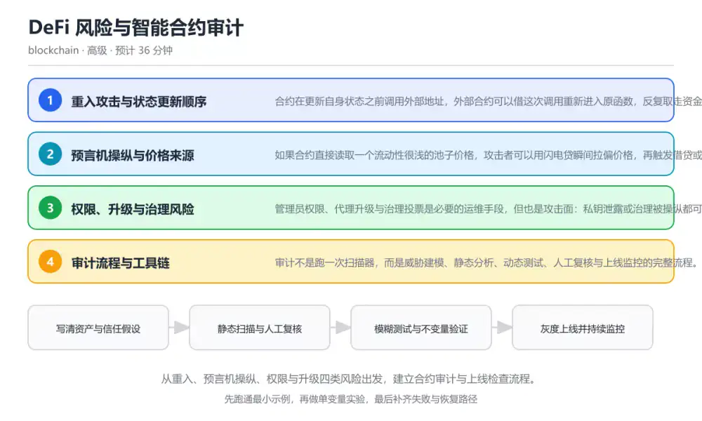
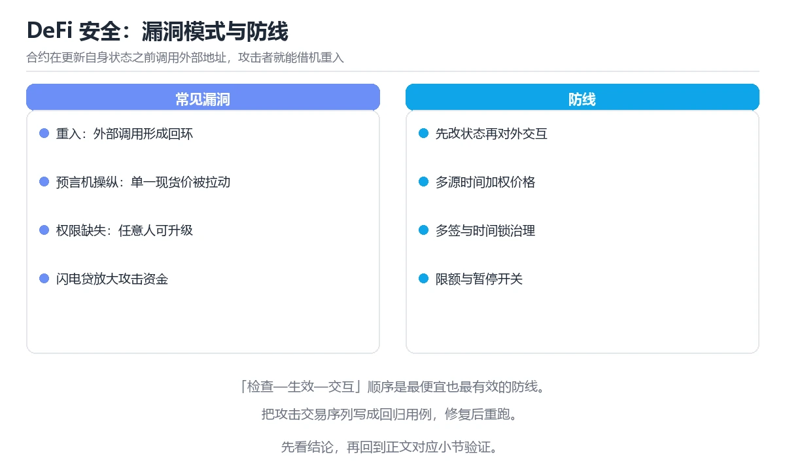

# DeFi 风险与智能合约审计

> 内容更新时间：2026-10-06 · 学习阶段：高级 · 预计用时：30 分钟

分类：blockchain。关键词：重入攻击、预言机、权限控制、审计、闪电贷。从重入、预言机操纵、权限与升级四类风险出发，建立合约审计与上线检查流程。

学习建议：先通读《DeFi 风险与智能合约审计》的核心知识与关键流程，再运行可运行练习并完成测验；遇到不确定的结论，回到「故障现场」按症状、根因、修复、验证四步核对。



## 学习目标

- 能复现重入攻击的最小场景，并用检查-生效-交互的顺序修复。
- 能说明价格预言机被操纵的条件与防护手段。
- 能列出合约上线前的审计清单与应急响应步骤。

## 前置知识

- 已能读懂 Solidity 合约的函数、状态变量与事件。
- 知道 DeFi 的常见业务：借贷、兑换、质押与清算。
- 理解交易的原子性：一次交易里所有调用要么全部生效，要么全部回滚。

## 核心知识

### 1. 重入攻击与状态更新顺序

合约在更新自身状态之前调用外部地址，外部合约可以借这次调用重新进入原函数，反复取走资金。

外部调用会把控制权交给对方，对方在回调里再次调用提现函数；此时余额还没扣减，检查仍然通过。修复方式是把状态更新放在外部调用之前，或加互斥锁。

在DeFi 风险与智能合约审计里可以这样验证：写一个先转账后扣余额的提现函数，用攻击合约在回调里再次提现，观察余额被重复取走。

边界：只加互斥锁能挡住重入，但不能挡住跨合约的读取型攻击；跨函数共享状态时要统一锁粒度。

工程视角：遵循检查-生效-交互顺序，必要时再加互斥锁并限制回调行为，把关键路径写成不变量测试。

### 2. 预言机操纵与价格来源

如果合约直接读取一个流动性很浅的池子价格，攻击者可以用闪电贷瞬间拉偏价格，再触发借贷或清算获利。

攻击在单笔交易内完成：借入巨额资金、在目标池子交易抬高或压低价格、按被操纵价格与协议交互、最后归还贷款。

在DeFi 风险与智能合约审计里可以这样验证：用时间加权平均价格替换即时价格，比较两种方式在短时间内被大额交易影响的程度。

边界：时间加权平均价能提高操纵成本，但极端行情下会滞后；多源预言机也可能同时被同一事件影响。

工程视角：使用多源、带偏差与心跳校验的价格源，并给清算与借贷加上限速与暂停开关。

### 3. 权限、升级与治理风险

管理员权限、代理升级与治理投票是必要的运维手段，但也是攻击面：私钥泄露或治理被操纵都可能直接改变协议规则。

常见做法是代理合约保存实现地址，管理员可切换逻辑；若升级函数没有时间锁或多签，单点即可替换全部逻辑。

在DeFi 风险与智能合约审计里可以这样验证：对比单签管理员与多签加时间锁的升级流程，列出攻击者要成功篡改需要跨越的步骤。

边界：完全不可升级又会让漏洞无法修复，因此要在可修复性与信任最小化之间做出明确取舍。

工程视角：升级走多签加时间锁，关键参数变更提前公告；为应急暂停准备独立权限，并定期演练。

### 4. 审计流程与工具链

审计不是跑一次扫描器，而是威胁建模、静态分析、动态测试、人工复核与上线监控的完整流程。

静态分析找常见模式，模糊测试与不变量测试验证极端输入，人工复核专注经济激励与组合风险，上线后用监控与熔断兜底。

在DeFi 风险与智能合约审计里可以这样验证：为一个借贷合约编写不变量测试：任何操作序列结束后，协议资产总量必须不小于用户负债总量。

边界：审计通过不代表没有漏洞，只代表在给定假设与范围内未发现问题；跨协议组合风险通常超出单个项目审计范围。

工程视角：保留审计范围、版本与遗留问题清单；上线后持续跑不变量测试与链上监控，发现异常先暂停再定位。

## 关键流程

```text
写清资产与信任假设 → 静态扫描与人工复核 → 模糊测试与不变量验证 → 灰度上线并持续监控
```

1. 写清资产与信任假设
2. 静态扫描与人工复核
3. 模糊测试与不变量验证
4. 灰度上线并持续监控

## 动手练习

1. 在一个测试合约里故意把状态更新放到转账之后，重新构造重入并观察余额变化。
2. 为一个借贷合约写三条不变量，说明每条不变量在什么条件下会被破坏。
3. 整理一份上线前检查清单，至少覆盖权限、价格源、暂停机制与监控四项。

验收标准：把 重入攻击 的变量、命令和结果写在一起，使他人可以复现同一结论。

## 常见错误与排查

> 说明：本表由《DeFi 风险与智能合约审计》的核心知识整理（2026-10-06），人工复核进度见 docs/content_review_batches.md。

| 易错点 | 容易踩的做法 | 正确结论 |
| --- | --- | --- |
| 先转账后扣余额 | 在外部调用之后才更新用户余额 | 把状态更新提前到外部调用之前，必要时再加互斥锁 |
| 直接读取现货价格 | 用单个浅池子的即时价格作为清算依据 | 改用多源时间加权价格，并加上偏差阈值与暂停开关 |
| 管理员权限单点化 | 用一个热钱包私钥控制升级与资金提取 | 升级与提现走多签加时间锁，权限分离并定期演练应急流程 |

## 可运行练习

### 任务 1：先跑通，再解释

```solidity
// SPDX-License-Identifier: MIT
pragma solidity ^0.8.20;

contract Vault {
    mapping(address => uint256) public balance;

    function deposit() external payable {
        balance[msg.sender] += msg.value;
    }

    function withdraw() external {
        uint256 amount = balance[msg.sender];
        require(amount > 0, "empty");
        balance[msg.sender] = 0;
        (bool ok, ) = msg.sender.call{value: amount}("");
        require(ok, "transfer failed");
    }
}
```

这段提现实现先把余额清零再转账，属于检查-生效-交互顺序；即使调用方在回调里再次调用 withdraw，第二次执行时余额已经是 0，会被 require 拒绝。

### 任务 2：只改一个条件

复制上面的示例，只改一个输入或参数再跑一次；先写下预测，再和真实输出对照，并说明差异来自DeFi 风险与智能合约审计的哪条机制。

### 任务 3：迁移到自己的数据

把《DeFi 风险与智能合约审计》里的示例换成你自己的一小段数据或场景，保持结构不变；如果换不动，说明还有哪条前提没有理解，回到核心知识对应小节。

## 故障现场

### 现场 1：先转账后扣余额

**症状**：在《DeFi 风险与智能合约审计》的复现场景中，在外部调用之后才更新用户余额。

**根因**：“在外部调用之后才更新用户余额”只是表层结果。向上追溯会落到“先转账后扣余额”这一步，因为它省略了《DeFi 风险与智能合约审计》的约束，使实现行为和预期模型发生了偏离。

**修复**：针对《DeFi 风险与智能合约审计》的问题，把状态更新提前到外部调用之前，必要时再加互斥锁。

**验证**：在《DeFi 风险与智能合约审计》中按“把状态更新提前到外部调用之前，必要时再加互斥锁”调整后，从“先转账后扣余额”的触发条件重放同一条路径，确认“在外部调用之后才更新用户余额”不再出现，并补一个相邻边界用例检查没有引入新问题。

### 现场 2：直接读取现货价格

**症状**：在《DeFi 风险与智能合约审计》的复现场景中，用单个浅池子的即时价格作为清算依据。

**根因**：“用单个浅池子的即时价格作为清算依据”只是表层结果。向上追溯会落到“直接读取现货价格”这一步，因为它省略了《DeFi 风险与智能合约审计》的约束，使实现行为和预期模型发生了偏离。

**修复**：针对《DeFi 风险与智能合约审计》的问题，改用多源时间加权价格，并加上偏差阈值与暂停开关。

**验证**：在《DeFi 风险与智能合约审计》中按“改用多源时间加权价格，并加上偏差阈值与暂停开关”调整后，从“直接读取现货价格”的触发条件重放同一条路径，确认“用单个浅池子的即时价格作为清算依据”不再出现，并补一个相邻边界用例检查没有引入新问题。

### 现场 3：管理员权限单点化

**症状**：在《DeFi 风险与智能合约审计》的复现场景中，用一个热钱包私钥控制升级与资金提取。

**根因**：当出现“管理员权限单点化”时，执行路径已经绕过了《DeFi 风险与智能合约审计》的关键约束，最终以“用一个热钱包私钥控制升级与资金提取”暴露出来；修复前必须先确认约束在哪里失效。

**修复**：针对《DeFi 风险与智能合约审计》的问题，升级与提现走多签加时间锁，权限分离并定期演练应急流程。

**验证**：先在《DeFi 风险与智能合约审计》中记录“管理员权限单点化”留下的失败证据，再执行“升级与提现走多签加时间锁，权限分离并定期演练应急流程”并重放；确认错误路径变为明确结果，且修复没有掩盖同类故障。

## 本课复习清单

离开本课前，逐项确认：

- [ ] 能写出检查-生效-交互的安全提现流程。
- [ ] 能说明预言机操纵的前提与缓解手段。
- [ ] 能列出升级与权限控制的上线检查项。
- [ ] 至少运行一次 solidity 的示例，记录输入、输出和 重入攻击 的边界情况。
- [ ] 把本课最容易混淆的两个概念写成一句话对照。

| 复盘项 | 记录 |
| --- | --- |
| 已经能独立解释的考点 |  |
| 仍然说不清的概念 |  |
| 下一步验证动作 |  |

## 复习与自测

### 核心知识

遮住正文回答：DeFi 风险与智能合约审计解决什么问题、依赖哪些前提、失败时先看哪个信号？三问都能答清楚，再进入下一节。

### 动手练习

把《DeFi 风险与智能合约审计》里「只改一个条件」的练习再做一遍，这次先写预测再运行；预测和结果不一致的地方，就是需要回读的章节。

### 最小可运行示例

```solidity
// SPDX-License-Identifier: MIT
pragma solidity ^0.8.20;

contract Vault {
    mapping(address => uint256) public balance;

    function deposit() external payable {
        balance[msg.sender] += msg.value;
    }

    function withdraw() external {
        uint256 amount = balance[msg.sender];
        require(amount > 0, "empty");
        balance[msg.sender] = 0;
        (bool ok, ) = msg.sender.call{value: amount}("");
        require(ok, "transfer failed");
    }
}
```

### 预期输出

```text
正常提现后 balance 归零且转账成功；攻击合约在回调中重入 withdraw 时会因 empty 断言失败而回滚，资金不会被重复取走。
```

### 验证步骤

1. 确认输入数据与运行环境和示例一致。
2. 运行示例，记录输出与耗时等可观测指标。
3. 换一个边界输入重跑，确认结论仍然成立。
4. 把两次结果写成一句话结论，注明前提与局限。

## 术语速查

先遮住右列，尝试用自己的话解释，再回到正文核对。

| 术语 | 一句话说明 |
| --- | --- |
| `重入攻击` | 在外部调用回调中重新进入原函数，利用未更新的状态重复获利。 |
| `闪电贷` | 在同一笔交易内借出并归还的无抵押贷款，常被用于放大攻击资金。 |
| `预言机` | 为链上合约提供外部数据的服务，价格来源与更新方式是主要风险点。 |
| `时间锁` | 让关键操作延迟生效的机制，为社区审查与应急响应留出时间。 |
| `不变量测试` | 断言任何操作序列后都必须成立的性质，用于捕捉状态被破坏的情况。 |
| `升级` | 升级走多签加时间锁，关键参数变更提前公告；为应急暂停准备独立权限，并定期演练 |

## 考点精讲

### 考点 1：避免重入攻击最关键的做法是什么？

题型：概念判断。题干：避免重入攻击最关键的做法是什么？

判断要点：先更新状态再调用外部地址。重入能得手的前提是状态尚未更新，攻击者趁机重复执行；把状态更新放在外部调用之前，第二次进入时检查就会失败，这是最核心的修复方式。 正确选项「先更新状态再调用外部地址」对应《DeFi 风险与智能合约审计》的要点「重入攻击与状态更新顺序」：合约在更新自身状态之前调用外部地址，外部合约可以借这次调用重新进入原函数，反复取走资金。判断「重入攻击与状态更新顺序」时先确认前提是否成立，再回到《DeFi 风险与智能合约审计》的示例核对一次；把别的语言或框架的默认做法直接搬到重入攻击与状态更新顺序上，往往会在本课的边界条件里失效。

### 考点 2：闪电贷为什么能放大预言机操纵？

题型：概念判断。题干：闪电贷为什么能放大预言机操纵？

判断要点：它可以在单笔交易内获得巨额资金拉偏价格。闪电贷把巨额资金压缩在同一笔交易内使用，攻击者用它把浅池子价格推到极端再与协议交互；手续费与存储变量都不受影响，真正的问题是价格来源过于脆弱。 正确选项「它可以在单笔交易内获得巨额资金拉偏价格」对应《DeFi 风险与智能合约审计》的要点「预言机操纵与价格来源」：如果合约直接读取一个流动性很浅的池子价格，攻击者可以用闪电贷瞬间拉偏价格，再触发借贷或清算获利。判断「预言机操纵与价格来源」时先确认前提是否成立，再回到《DeFi 风险与智能合约审计》的示例核对一次；借鉴相邻主题的经验之前，先核对预言机操纵与价格来源的前提是否成立。

### 考点 3：以下哪些属于合约上线的必要检查？（多选）

题型：多选辨析。题干：以下哪些属于合约上线的必要检查？（多选）

判断要点：关键权限是否多签与时间锁；价格源是否有偏差与暂停机制；是否有不变量测试与监控告警。权限、价格源韧性、不变量测试与监控都是上线前必须确认的项；而把管理员私钥放进前端代码等于公开权限，是必须消除的做法。 正确选项「关键权限是否多签与时间锁；价格源是否有偏差与暂停机制；是否有不变量测试与监控告警」对应《DeFi 风险与智能合约审计》的要点「权限、升级与治理风险」：管理员权限、代理升级与治理投票是必要的运维手段，但也是攻击面：私钥泄露或治理被操纵都可能直接改变协议规则。判断「权限、升级与治理风险」时先确认前提是否成立，再回到《DeFi 风险与智能合约审计》的示例核对一次；记住权限、升级与治理风险的结论之外还要记住适用条件，换一个输入往往就不成立了。

### 考点 4：请按审计流程排列下面的步骤。

题型：顺序排列。题干：请按审计流程排列下面的步骤。

判断要点：动态测试与不变量验证。先明确资产与假设，再做静态与人工复核，随后用动态测试验证，最后才是上线监控与演练；顺序颠倒会出现假设未定就开始扫工具或未验证就上线的断点。 正确选项「明确资产与信任假设；静态扫描与人工复核；动态测试与不变量验证；上线监控与应急演练」对应《DeFi 风险与智能合约审计》的要点「审计流程与工具链」：审计不是跑一次扫描器，而是威胁建模、静态分析、动态测试、人工复核与上线监控的完整流程。判断「审计流程与工具链」时先确认前提是否成立，再回到《DeFi 风险与智能合约审计》的示例核对一次；干扰项常常是相邻主题里成立的结论，只有按审计流程与工具链的输入与约束判断才能排除。

### 考点 5：阅读提现函数，哪项判断正确？

题型：排错。题干：阅读提现函数，哪项判断正确？

判断要点：状态先清零再转账，可以挡住大多数重入提现。先清零再转账让重入时的余额检查直接失败，是标准的检查-生效-交互写法；call 本身不是问题，真正的风险来自状态更新与外部调用的先后顺序。 正确选项「状态先清零再转账，可以挡住大多数重入提现」对应《DeFi 风险与智能合约审计》的要点「重入攻击与状态更新顺序」：合约在更新自身状态之前调用外部地址，外部合约可以借这次调用重新进入原函数，反复取走资金。判断「重入攻击与状态更新顺序」时先确认前提是否成立，再回到《DeFi 风险与智能合约审计》的示例核对一次；把重入攻击与状态更新顺序的做法换到别的约束下未必成立，先确认边界再决定答案。

## English Overview

DeFi Risks and Smart Contract Auditing

Most DeFi losses come from a small set of patterns: reentrancy, oracle manipulation, over-powerful admin keys and upgrade mistakes. This lesson reproduces a reentrancy, explains price-source hardening, and builds an audit checklist that continues after deployment.



## 本课小结

- DeFi 风险与智能合约审计围绕重入攻击、预言机、权限控制展开，先建立基线再讨论优化。
- 合约在更新自身状态之前调用外部地址，外部合约可以借这次调用重新进入原函数，反复取走资金。
- 处理 重入攻击 的问题时按「症状 → 根因 → 修复 → 验证」的顺序推进，不跳过验证。

## 内容元数据

- 内容版本：v2.0
- 最后更新：2026-10-06
- 学习阶段：高级

| 字段 | 值 |
| --- | --- |
| 课程 ID | `blockchain_defi_security` |
| 所属分类 | `blockchain` |
| 难度 | 高级 |
| 预计用时 | 36 分钟 |
| 关键词 | 重入攻击、预言机、权限控制、审计、闪电贷 |
| 配图 | `images/lesson_blockchain_defi_security.webp` |
| 参考资料 | 2 条 |
| 内容更新时间 | 2026-10-06 |

## 参考资料与复核

- 最后复核：2026-10-04
- 下次复核：2027-01-17
- 复核范围：版本兼容、API 行为与工程实践

下面列出的资料用于核对本课结论，复习时可以对照阅读：
- [ConsenSys 智能合约安全最佳实践](https://consensys.github.io/smart-contract-best-practices/)
- [SWC 智能合约弱点分类](https://swcregistry.io/)

> 复核提示：《DeFi 风险与智能合约审计》的结论如与资料冲突，以资料中的规范文本为准，并在笔记里记录差异与日期。

## 复习与迁移

### 概念复述

不看正文，把DeFi 风险与智能合约审计讲给一个没学过的同事：先讲它解决什么问题，再讲一个最小例子，最后说明一个不适用场景。

### 测验回顾

回到《DeFi 风险与智能合约审计》测验，只重做答错或犹豫的题；对每道题写一句「我为什么改选这个答案」，写不出理由就回到对应小节。

### 迁移练习

把《DeFi 风险与智能合约审计》的方法用到一个你自己的真实场景：说明输入、约束与验证方式，并列出仍然不确定、需要下一次实验回答的问题。

## 深度拓展与实战

这一节把DeFi 风险与智能合约审计的机制拆开验证：每一步都给出输入、判断标准和失败信号，便于在真实项目里复用。

### 机制拆解 1：重入攻击与状态更新顺序

外部调用会把控制权交给对方，对方在回调里再次调用提现函数；此时余额还没扣减，检查仍然通过。修复方式是把状态更新放在外部调用之前，或加互斥锁。

落地时先确认前提：只加互斥锁能挡住重入，但不能挡住跨合约的读取型攻击；跨函数共享状态时要统一锁粒度。；再把结论写进检查表，让下一位同学可以按同样的输入复现。

工程做法：遵循检查-生效-交互顺序，必要时再加互斥锁并限制回调行为，把关键路径写成不变量测试。

### 机制拆解 2：预言机操纵与价格来源

攻击在单笔交易内完成：借入巨额资金、在目标池子交易抬高或压低价格、按被操纵价格与协议交互、最后归还贷款。

落地时先确认前提：时间加权平均价能提高操纵成本，但极端行情下会滞后；多源预言机也可能同时被同一事件影响。；再把结论写进检查表，让下一位同学可以按同样的输入复现。

工程做法：使用多源、带偏差与心跳校验的价格源，并给清算与借贷加上限速与暂停开关。

### 机制拆解 3：权限、升级与治理风险

常见做法是代理合约保存实现地址，管理员可切换逻辑；若升级函数没有时间锁或多签，单点即可替换全部逻辑。

落地时先确认前提：完全不可升级又会让漏洞无法修复，因此要在可修复性与信任最小化之间做出明确取舍。；再把结论写进检查表，让下一位同学可以按同样的输入复现。

工程做法：升级走多签加时间锁，关键参数变更提前公告；为应急暂停准备独立权限，并定期演练。

### 机制拆解 4：审计流程与工具链

静态分析找常见模式，模糊测试与不变量测试验证极端输入，人工复核专注经济激励与组合风险，上线后用监控与熔断兜底。

落地时先确认前提：审计通过不代表没有漏洞，只代表在给定假设与范围内未发现问题；跨协议组合风险通常超出单个项目审计范围。；再把结论写进检查表，让下一位同学可以按同样的输入复现。

工程做法：保留审计范围、版本与遗留问题清单；上线后持续跑不变量测试与链上监控，发现异常先暂停再定位。

### 机制对照表

| 概念 | 解决什么问题 | 关键前提 | 失败信号 |
| --- | --- | --- | --- |
| 重入攻击与状态更新顺序 | 合约在更新自身状态之前调用外部地址，外部合约可以借这次调用重新进入原函数，反复取 | 只加互斥锁能挡住重入，但不能挡住跨合约的读取型攻击；跨函数共享状态时要统 | 遵循检查-生效-交互顺序，必要时再加互斥锁并限制回调行为，把关键路径写成 |
| 预言机操纵与价格来源 | 如果合约直接读取一个流动性很浅的池子价格，攻击者可以用闪电贷瞬间拉偏价格，再触发 | 时间加权平均价能提高操纵成本，但极端行情下会滞后；多源预言机也可能同时被 | 使用多源、带偏差与心跳校验的价格源，并给清算与借贷加上限速与暂停开关。 |
| 权限、升级与治理风险 | 管理员权限、代理升级与治理投票是必要的运维手段，但也是攻击面：私钥泄露或治理被操 | 完全不可升级又会让漏洞无法修复，因此要在可修复性与信任最小化之间做出明确 | 升级走多签加时间锁，关键参数变更提前公告；为应急暂停准备独立权限，并定期 |
| 审计流程与工具链 | 审计不是跑一次扫描器，而是威胁建模、静态分析、动态测试、人工复核与上线监控的完整 | 审计通过不代表没有漏洞，只代表在给定假设与范围内未发现问题；跨协议组合风 | 保留审计范围、版本与遗留问题清单；上线后持续跑不变量测试与链上监控，发现 |

### 自测问答

**问 1**：避免重入攻击最关键的做法是什么？

**答**：先更新状态再调用外部地址。重入能得手的前提是状态尚未更新，攻击者趁机重复执行；把状态更新放在外部调用之前，第二次进入时检查就会失败，这是最核心的修复方式。 正确选项「先更新状态再调用外部地址」对应《DeFi 风险与智能合约审计》的要点「重入攻击与状态更新顺序」：合约在更新自身状态之前调用外部地址，外部合约可以借这次调用重新进入原函数，反复取走资金。判断「重入攻击与状态更新顺序」时先确认前提是否成立，再回到《DeFi 风险与智能合约审计》的示例核对一次；把别的语言或框架的默认做法直接搬到重入攻击与状态更新顺序上，往往会在本课的边界条件里失效。

**问 2**：闪电贷为什么能放大预言机操纵？

**答**：它可以在单笔交易内获得巨额资金拉偏价格。闪电贷把巨额资金压缩在同一笔交易内使用，攻击者用它把浅池子价格推到极端再与协议交互；手续费与存储变量都不受影响，真正的问题是价格来源过于脆弱。 正确选项「它可以在单笔交易内获得巨额资金拉偏价格」对应《DeFi 风险与智能合约审计》的要点「预言机操纵与价格来源」：如果合约直接读取一个流动性很浅的池子价格，攻击者可以用闪电贷瞬间拉偏价格，再触发借贷或清算获利。判断「预言机操纵与价格来源」时先确认前提是否成立，再回到《DeFi 风险与智能合约审计》的示例核对一次；借鉴相邻主题的经验之前，先核对预言机操纵与价格来源的前提是否成立。

**问 3**：以下哪些属于合约上线的必要检查？（多选）

**答**：关键权限是否多签与时间锁；价格源是否有偏差与暂停机制；是否有不变量测试与监控告警。权限、价格源韧性、不变量测试与监控都是上线前必须确认的项；而把管理员私钥放进前端代码等于公开权限，是必须消除的做法。 正确选项「关键权限是否多签与时间锁；价格源是否有偏差与暂停机制；是否有不变量测试与监控告警」对应《DeFi 风险与智能合约审计》的要点「权限、升级与治理风险」：管理员权限、代理升级与治理投票是必要的运维手段，但也是攻击面：私钥泄露或治理被操纵都可能直接改变协议规则。判断「权限、升级与治理风险」时先确认前提是否成立，再回到《DeFi 风险与智能合约审计》的示例核对一次；记住权限、升级与治理风险的结论之外还要记住适用条件，换一个输入往往就不成立了。

**问 4**：请按审计流程排列下面的步骤。

**答**：动态测试与不变量验证。先明确资产与假设，再做静态与人工复核，随后用动态测试验证，最后才是上线监控与演练；顺序颠倒会出现假设未定就开始扫工具或未验证就上线的断点。 正确选项「明确资产与信任假设；静态扫描与人工复核；动态测试与不变量验证；上线监控与应急演练」对应《DeFi 风险与智能合约审计》的要点「审计流程与工具链」：审计不是跑一次扫描器，而是威胁建模、静态分析、动态测试、人工复核与上线监控的完整流程。判断「审计流程与工具链」时先确认前提是否成立，再回到《DeFi 风险与智能合约审计》的示例核对一次；干扰项常常是相邻主题里成立的结论，只有按审计流程与工具链的输入与约束判断才能排除。

**问 5**：阅读提现函数，哪项判断正确？

**答**：状态先清零再转账，可以挡住大多数重入提现。先清零再转账让重入时的余额检查直接失败，是标准的检查-生效-交互写法；call 本身不是问题，真正的风险来自状态更新与外部调用的先后顺序。 正确选项「状态先清零再转账，可以挡住大多数重入提现」对应《DeFi 风险与智能合约审计》的要点「重入攻击与状态更新顺序」：合约在更新自身状态之前调用外部地址，外部合约可以借这次调用重新进入原函数，反复取走资金。判断「重入攻击与状态更新顺序」时先确认前提是否成立，再回到《DeFi 风险与智能合约审计》的示例核对一次；把重入攻击与状态更新顺序的做法换到别的约束下未必成立，先确认边界再决定答案。

### 排错速查

- 看到「在外部调用之后才更新用户余额」时，先按「把状态更新提前到外部调用之前，必要时再加互斥锁」处理，再用DeFi 风险与智能合约审计的最小示例确认结论是否恢复。
- 看到「用单个浅池子的即时价格作为清算依据」时，先按「改用多源时间加权价格，并加上偏差阈值与暂停开关」处理，再用DeFi 风险与智能合约审计的最小示例确认结论是否恢复。
- 看到「用一个热钱包私钥控制升级与资金提取」时，先按「升级与提现走多签加时间锁，权限分离并定期演练应急流程」处理，再用DeFi 风险与智能合约审计的最小示例确认结论是否恢复。

### 工程检查表

- [ ] 写清资产与信任假设
- [ ] 静态扫描与人工复核
- [ ] 模糊测试与不变量验证
- [ ] 灰度上线并持续监控
- [ ] 【重入攻击与状态更新顺序】遵循检查-生效-交互顺序，必要时再加互斥锁并限制回调行为，把关键路径写成不变量测试。
- [ ] 【预言机操纵与价格来源】使用多源、带偏差与心跳校验的价格源，并给清算与借贷加上限速与暂停开关。
- [ ] 【权限、升级与治理风险】升级走多签加时间锁，关键参数变更提前公告；为应急暂停准备独立权限，并定期演练。
- [ ] 【审计流程与工具链】保留审计范围、版本与遗留问题清单；上线后持续跑不变量测试与链上监控，发现异常先暂停再定位。

### 迁移练习

把DeFi 风险与智能合约审计的方法用到一个真实场景：写下重入攻击、预言机、权限控制在你的场景里分别对应什么，再记录一次失败尝试和它的恢复步骤。

### 延伸阅读与下一步

- 复习重入攻击、预言机、权限控制、审计、闪电贷时，优先回看「重入攻击与状态更新顺序」与「审计流程与工具链」两节。
- 把从「写清资产与信任假设」到「灰度上线并持续监控」的流程画成一张图，放进自己的笔记。
- 一周后重做本课测验，只把答错的题留到下一轮复习。

### 结论与下一步

学完DeFi 风险与智能合约审计，应该能独立完成三件事：先用最小示例确认重入攻击的行为，再用一个边界输入验证结论，最后把失败路径写成可重复的检查。下一步把本课术语加入复习清单，并在两周内用一次真实任务检验记忆是否牢固。

