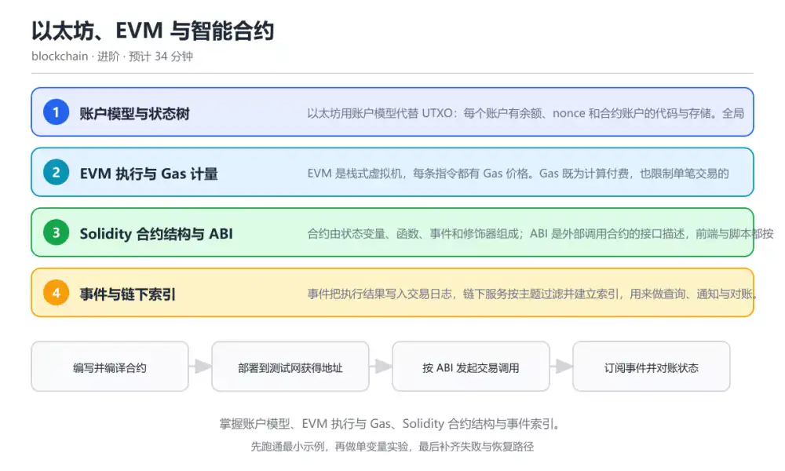
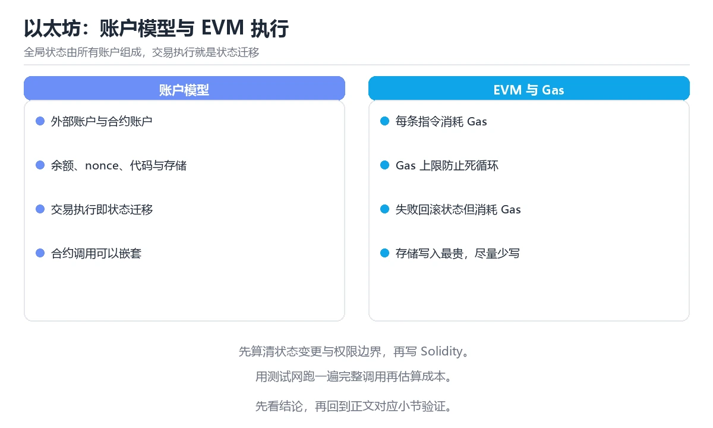

# 以太坊、EVM 与智能合约

> 内容更新时间：2026-10-06 · 学习阶段：进阶 · 预计用时：35 分钟

分类：blockchain。关键词：EVM、Solidity、Gas、ABI、事件。掌握账户模型、EVM 执行与 Gas、Solidity 合约结构与事件索引。

学习建议：先通读《以太坊、EVM 与智能合约》的核心知识与关键流程，再运行可运行练习并完成测验；遇到不确定的结论，回到「故障现场」按症状、根因、修复、验证四步核对。



## 学习目标

- 能区分外部账户与合约账户，说明 nonce 与余额的作用。
- 能读懂一段最小 Solidity 合约并解释每个存储变量的可见性。
- 能估算一次调用的 Gas 成本，并说明失败回滚时 Gas 的去向。

## 前置知识

- 已掌握哈希链、签名与共识的基本概念。
- 有至少一门静态类型语言的基础，能读懂函数与类型声明。
- 知道区块链上的写入需要付费，读操作通常免费。

## 核心知识

### 1. 账户模型与状态树

以太坊用账户模型代替 UTXO：每个账户有余额、nonce 和合约账户的代码与存储。全局状态由所有账户组成，交易执行就是状态迁移。

外部账户由私钥控制，合约账户由代码控制。nonce 保证同一账户的交易不会被重复执行，也决定交易顺序。

在以太坊、EVM 与智能合约里可以这样验证：对比两种模型：UTXO 需要选择输出，以太坊只需指定 from、to、value 与 data，余额不足或 nonce 冲突都会直接拒绝。

边界：账户模型更容易表达复杂状态，但也带来重放与授权风险；一次授权可能长期有效，必须显式撤销。

工程视角：合约里记录关键状态时要同时记录版本与所有者；升级或迁移前先冻结写入，避免状态不一致。

### 2. EVM 执行与 Gas 计量

EVM 是栈式虚拟机，每条指令都有 Gas 价格。Gas 既为计算付费，也限制单笔交易的执行步数，防止死循环拖垮全网。

交易先按 gas limit 预扣，执行结束后按实际消耗结算，剩余退还；如果中途失败，状态回滚但已消耗的 Gas 不退。

在以太坊、EVM 与智能合约里可以这样验证：写一个循环写入 storage 的函数，逐步增加循环次数，观察 Gas 消耗随存储写入线性上升。

边界：Gas 价格随网络拥堵波动，同样的调用成本可能差很多；把关键逻辑放在链上循环里会迅速变得不可用。

工程视角：把批量逻辑拆成可分批执行的任务，避免单笔交易超过区块 Gas 上限；用事件记录结果，把重计算放到链下。

### 3. Solidity 合约结构与 ABI

合约由状态变量、函数、事件和修饰器组成；ABI 是外部调用合约的接口描述，前端与脚本都按 ABI 编码调用数据。

函数可见性决定谁能调用，状态可变性决定是否写入链上。ABI 把函数选择器与参数编码成 calldata，返回值再解码回调用方。

在以太坊、EVM 与智能合约里可以这样验证：部署一个带计数器的合约，先调用 increment 写入状态，再调用 count 读取，对比两次调用的成本与返回方式。

边界：可见性写错会让内部函数暴露给任何人；ABI 变化会让已部署的前端调用失败，需要版本管理。

工程视角：合约接口一旦上线就难以更改，发布前冻结 ABI 并生成类型化客户端；升级用代理模式时明确存储布局兼容规则。

### 4. 事件与链下索引

事件把执行结果写入交易日志，链下服务按主题过滤并建立索引，用来做查询、通知与对账。

事件参数分为可索引与不可索引两类，索引字段进入主题列表，便于按地址或编号过滤；日志不参与合约状态读取。

在以太坊、EVM 与智能合约里可以这样验证：为转账事件加上发送方与接收方索引字段，链下服务按接收方订阅，实时把到账记录写入数据库。

边界：日志不是状态，合约无法读取历史事件；链重组时链下索引也要回滚重放，否则数据会与链上不一致。

工程视角：索引服务要记录处理到的区块高度与哈希，支持重组回滚；关键对账要用链上状态复核事件结果。

## 关键流程

```text
编写并编译合约 → 部署到测试网获得地址 → 按 ABI 发起交易调用 → 订阅事件并对账状态
```

1. 编写并编译合约
2. 部署到测试网获得地址
3. 按 ABI 发起交易调用
4. 订阅事件并对账状态

## 动手练习

1. 给示例合约加一个 pause 开关，只有 owner 可以暂停 increment。
2. 在测试网部署合约并用脚本完成一次调用，记录交易哈希与事件内容。
3. 比较三次调用 increment 的 Gas 消耗，解释差异来源。

**验收标准**：记录 EVM 的输入、实际输出与差异解释，缺一项都不算完成。

## 常见错误与排查

> 说明：本表由《以太坊、EVM 与智能合约》的核心知识整理（2026-10-06），人工复核进度见 docs/content_review_batches.md。

| 易错点 | 容易踩的做法 | 正确结论 |
| --- | --- | --- |
| 权限校验缺失 | 把所有写函数都设为 public 且不校验调用者 | 用 owner 或角色控制限制关键函数，并在链上校验而不是依赖前端隐藏入口 |
| 在链上做重循环 | 在一个函数里遍历可能无限增长的数组 | 限制单次处理数量，或改用分批任务与链下计算，避免交易超出 Gas 上限 |
| 忽略事件重组回滚 | 链下索引只做插入，不记录区块高度与哈希 | 索引服务保存处理进度，检测到重组时回滚并重放到最新高度 |

## 可运行练习

### 任务 1：先跑通，再解释

```solidity
// SPDX-License-Identifier: MIT
pragma solidity ^0.8.20;

contract Counter {
    uint256 public count;
    address public immutable owner;

    event Incremented(address indexed by, uint256 newValue);

    constructor() {
        owner = msg.sender;
    }

    function increment() external {
        count += 1;
        emit Incremented(msg.sender, count);
    }

    function reset() external {
        require(msg.sender == owner, "not owner");
        count = 0;
    }
}
```

合约用一个存储变量保存计数，increment 任何人都能调用并发出事件，reset 通过 owner 校验限制权限；事件里的调用者字段可索引，方便链下按地址过滤。

### 任务 2：只改一个条件

复制上面的示例，只改一个输入或参数再跑一次；先写下预测，再和真实输出对照，并说明差异来自以太坊、EVM 与智能合约的哪条机制。

### 任务 3：迁移到自己的数据

把《以太坊、EVM 与智能合约》里的示例换成你自己的一小段数据或场景，保持结构不变；如果换不动，说明还有哪条前提没有理解，回到核心知识对应小节。

## 故障现场

### 现场 1：权限校验缺失

**症状**：在《以太坊、EVM 与智能合约》的复现场景中，把所有写函数都设为 public 且不校验调用者。

**根因**：当出现“权限校验缺失”时，执行路径已经绕过了《以太坊、EVM 与智能合约》的关键约束，最终以“把所有写函数都设为 public 且不校验调用者”暴露出来；修复前必须先确认约束在哪里失效。

**修复**：针对《以太坊、EVM 与智能合约》的问题，用 owner 或角色控制限制关键函数，并在链上校验而不是依赖前端隐藏入口。

**验证**：保留《以太坊、EVM 与智能合约》里触发“把所有写函数都设为 public 且不校验调用者”的输入、版本和日志，按“用 owner 或角色控制限制关键函数，并在链上校验而不是依赖前端隐藏入口”完成修改后原样重放；只有失败现象消失且相邻场景仍可解释，才保留改动。

### 现场 2：在链上做重循环

**症状**：在《以太坊、EVM 与智能合约》的复现场景中，在一个函数里遍历可能无限增长的数组。

**根因**：当出现“在链上做重循环”时，执行路径已经绕过了《以太坊、EVM 与智能合约》的关键约束，最终以“在一个函数里遍历可能无限增长的数组”暴露出来；修复前必须先确认约束在哪里失效。

**修复**：针对《以太坊、EVM 与智能合约》的问题，限制单次处理数量，或改用分批任务与链下计算，避免交易超出 Gas 上限。

**验证**：先在《以太坊、EVM 与智能合约》中记录“在链上做重循环”留下的失败证据，再执行“限制单次处理数量，或改用分批任务与链下计算，避免交易超出 Gas 上限”并重放；确认错误路径变为明确结果，且修复没有掩盖同类故障。

### 现场 3：忽略事件重组回滚

**症状**：在《以太坊、EVM 与智能合约》的复现场景中，链下索引只做插入，不记录区块高度与哈希。

**根因**：当出现“忽略事件重组回滚”时，执行路径已经绕过了《以太坊、EVM 与智能合约》的关键约束，最终以“链下索引只做插入，不记录区块高度与哈希”暴露出来；修复前必须先确认约束在哪里失效。

**修复**：针对《以太坊、EVM 与智能合约》的问题，索引服务保存处理进度，检测到重组时回滚并重放到最新高度。

**验证**：先在《以太坊、EVM 与智能合约》中记录“忽略事件重组回滚”留下的失败证据，再执行“索引服务保存处理进度，检测到重组时回滚并重放到最新高度”并重放；确认错误路径变为明确结果，且修复没有掩盖同类故障。

## 本课复习清单

离开本课前，逐项确认：

- [ ] 能区分外部账户与合约账户，说明 nonce 与余额的作用。
- [ ] 能解释 Gas 在失败执行中的去留规则。
- [ ] 能设计一个带权限和事件的合约接口。
- [ ] 至少运行一次 newValue 的示例，记录输入、输出和 EVM 的边界情况。
- [ ] 把本课最容易混淆的两个概念写成一句话对照。

| 复盘项 | 记录 |
| --- | --- |
| 已经能独立解释的考点 |  |
| 仍然说不清的概念 |  |
| 下一步验证动作 |  |

## 复习与自测

### 核心知识

遮住正文回答：以太坊、EVM 与智能合约解决什么问题、依赖哪些前提、失败时先看哪个信号？三问都能答清楚，再进入下一节。

### 动手练习

把《以太坊、EVM 与智能合约》里「只改一个条件」的练习再做一遍，这次先写预测再运行；预测和结果不一致的地方，就是需要回读的章节。

### 最小可运行示例

```solidity
// SPDX-License-Identifier: MIT
pragma solidity ^0.8.20;

contract Counter {
    uint256 public count;
    address public immutable owner;

    event Incremented(address indexed by, uint256 newValue);

    constructor() {
        owner = msg.sender;
    }

    function increment() external {
        count += 1;
        emit Incremented(msg.sender, count);
    }

    function reset() external {
        require(msg.sender == owner, "not owner");
        count = 0;
    }
}
```

### 预期输出

```text
count() 返回当前数值；调用 increment 后事件 Incremented 的 newValue 递增；非 owner 调用 reset 会被 require 拒绝并回滚。
```

### 验证步骤

1. 确认输入数据与运行环境和示例一致。
2. 运行示例，记录输出与耗时等可观测指标。
3. 换一个边界输入重跑，确认结论仍然成立。
4. 把两次结果写成一句话结论，注明前提与局限。

## 术语速查

先遮住右列，尝试用自己的话解释，再回到正文核对。

| 术语 | 一句话说明 |
| --- | --- |
| `EVM` | 以太坊的栈式虚拟机，按 Gas 计量执行合约字节码。 |
| `Gas` | 衡量计算与存储开销的计量单位，也是防止滥用的付费机制。 |
| `ABI` | 描述合约函数与参数编码方式的接口定义，供链下调用使用。 |
| `事件日志` | 合约执行时写入的日志记录，供链下服务索引和通知。 |
| `nonce` | 账户已发送交易的数量计数，用于排序并防止重放。 |
| `事件` | 事件把执行结果写入交易日志，链下服务按主题过滤并建立索引，用来做查询、通知与对账 |

## 考点精讲

### 考点 1：以太坊交易执行失败时，Gas 会怎样处理

题型：概念判断。题干：以太坊交易执行失败时，Gas 会怎样处理？

判断要点：状态回滚，但已消耗的 Gas 不退。执行失败会回滚状态变更，已消耗的计算资源仍需付费，因此 Gas 不退；这条规则让攻击者无法用失败交易免费占用网络资源。 正确选项「状态回滚，但已消耗的 Gas 不退」对应《以太坊、EVM 与智能合约》的要点「账户模型与状态树」：以太坊用账户模型代替 UTXO：每个账户有余额、nonce 和合约账户的代码与存储。全局状态由所有账户组成，交易执行就是状态迁移。判断「账户模型与状态树」时先确认前提是否成立，再回到《以太坊、EVM 与智能合约》的示例核对一次；把别的语言或框架的默认做法直接搬到账户模型与状态树上，往往会在本课的边界条件里失效。

### 考点 2：nonce 在账户模型里的主要作用是什么

题型：概念判断。题干：nonce 在账户模型里的主要作用是什么？

判断要点：标记交易顺序并防止重放。每个账户的 nonce 随交易递增，节点据此排序并拒绝重复交易；它不负责加密，也不直接表示余额或存储状态。 正确选项「标记交易顺序并防止重放」对应《以太坊、EVM 与智能合约》的要点「EVM 执行与 Gas 计量」：EVM 是栈式虚拟机，每条指令都有 Gas 价格。Gas 既为计算付费，也限制单笔交易的执行步数，防止死循环拖垮全网。判断「EVM 执行与 Gas 计量」时先确认前提是否成立，再回到《以太坊、EVM 与智能合约》的示例核对一次；借鉴相邻主题的经验之前，先核对EVM 执行与 Gas 计量的前提是否成立。

### 考点 3：以下哪些做法能降低合约的 Gas 成本？

题型：多选辨析。题干：以下哪些做法能降低合约的 Gas 成本？（多选）

判断要点：减少不必要的存储写入；把重计算移到链下并用事件记录结果；用批量任务代替单笔大循环。存储写入与循环最耗 Gas，减少写入、链下计算、分批处理都能显著降本；而放开循环上限会让交易更容易超出区块 Gas 上限直接失败。 正确选项「减少不必要的存储写入；把重计算移到链下并用事件记录结果；用批量任务代替单笔大循环」对应《以太坊、EVM 与智能合约》的要点「Solidity 合约结构与 ABI」：合约由状态变量、函数、事件和修饰器组成；ABI 是外部调用合约的接口描述，前端与脚本都按 ABI 编码调用数据。判断「Solidity 合约结构与 ABI」时先确认前提是否成立，再回到《以太坊、EVM 与智能合约》的示例核对一次；记住Solidity 合约结构与 ABI的结论之外还要记住适用条件，换一个输入往往就不成立了。

### 考点 4：请按合约从开发到对账的顺序排列步骤。

题型：顺序排列。题干：请按合约从开发到对账的顺序排列步骤。

判断要点：订阅事件并写入链下索引。先写合约并编译，再部署拿地址，然后按 ABI 调用，最后订阅事件做链下索引；没有地址就无法调用，没有交易也不会产生可索引的事件。 正确选项「编写并编译 Solidity 合约；部署到测试网获得合约地址；按 ABI 发起交易调用；订阅事件并写入链下索引」对应《以太坊、EVM 与智能合约》的要点「事件与链下索引」：事件把执行结果写入交易日志，链下服务按主题过滤并建立索引，用来做查询、通知与对账。判断「事件与链下索引」时先确认前提是否成立，再回到《以太坊、EVM 与智能合约》的示例核对一次；干扰项常常是相邻主题里成立的结论，只有按事件与链下索引的输入与约束判断才能排除。

### 考点 5：阅读合约片段，哪项判断正确？

题型：排错。题干：阅读合约片段，哪项判断正确？

判断要点：只有 owner 能调用 reset，increment 任何人可调用。构造函数记录部署者，reset 用 require 校验调用者，increment 没有任何限制；public 状态变量会自动生成读取函数，链下可以查询 count 值。 正确选项「只有 owner 能调用 reset，increment 任何人可调用」对应《以太坊、EVM 与智能合约》的要点「账户模型与状态树」：以太坊用账户模型代替 UTXO：每个账户有余额、nonce 和合约账户的代码与存储。全局状态由所有账户组成，交易执行就是状态迁移。判断「账户模型与状态树」时先确认前提是否成立，再回到《以太坊、EVM 与智能合约》的示例核对一次；把账户模型与状态树的做法换到别的约束下未必成立，先确认边界再决定答案。

## English Overview

Ethereum, EVM and Smart Contracts

Ethereum replaces UTXOs with accounts and executes smart contracts on the EVM. This lesson explains state transitions, gas metering, Solidity structure, ABI calls and event indexing, then shows how to reason about failure rollback.



## 本课小结

- 以太坊、EVM 与智能合约围绕EVM、Solidity、Gas展开，先建立基线再讨论优化。
- 以太坊用账户模型代替 UTXO：每个账户有余额、nonce 和合约账户的代码与存储。全局状态由所有账户组成，交易执行就是状态迁移。
- 处理 EVM 的问题时按「症状 → 根因 → 修复 → 验证」的顺序推进，不跳过验证。

## 内容元数据

- 内容版本：v2.0
- 最后更新：2026-10-06
- 学习阶段：进阶

| 字段 | 值 |
| --- | --- |
| 课程 ID | `blockchain_ethereum_smart_contract` |
| 所属分类 | `blockchain` |
| 难度 | 进阶 |
| 预计用时 | 34 分钟 |
| 关键词 | EVM、Solidity、Gas、ABI、事件 |
| 配图 | `images/lesson_blockchain_ethereum_smart_contract.webp` |
| 参考资料 | 3 条 |
| 内容更新时间 | 2026-10-06 |

## 参考资料与复核

- 最后复核：2026-10-04
- 下次复核：2027-01-17
- 复核范围：版本兼容、API 行为与工程实践

下面列出的资料用于核对本课结论，复习时可以对照阅读：
- [Ethereum 开发者文档](https://ethereum.org/zh/developers/docs/)
- [Solidity 官方文档](https://docs.soliditylang.org/)
- [Ethereum EVM 说明](https://ethereum.org/zh/developers/docs/evm/)

> 复核提示：《以太坊、EVM 与智能合约》的结论如与资料冲突，以资料中的规范文本为准，并在笔记里记录差异与日期。

## 复习与迁移

### 概念复述

不看正文，把以太坊、EVM 与智能合约讲给一个没学过的同事：先讲它解决什么问题，再讲一个最小例子，最后说明一个不适用场景。

### 测验回顾

回到《以太坊、EVM 与智能合约》测验，只重做答错或犹豫的题；对每道题写一句「我为什么改选这个答案」，写不出理由就回到对应小节。

### 迁移练习

把《以太坊、EVM 与智能合约》的方法用到一个你自己的真实场景：说明输入、约束与验证方式，并列出仍然不确定、需要下一次实验回答的问题。

## 深度拓展与实战

这一节把以太坊、EVM 与智能合约的机制拆开验证：每一步都给出输入、判断标准和失败信号，便于在真实项目里复用。

### 机制拆解 1：账户模型与状态树

外部账户由私钥控制，合约账户由代码控制。nonce 保证同一账户的交易不会被重复执行，也决定交易顺序。

落地时先确认前提：账户模型更容易表达复杂状态，但也带来重放与授权风险；一次授权可能长期有效，必须显式撤销。；再把结论写进检查表，让下一位同学可以按同样的输入复现。

工程做法：合约里记录关键状态时要同时记录版本与所有者；升级或迁移前先冻结写入，避免状态不一致。

### 机制拆解 2：EVM 执行与 Gas 计量

交易先按 gas limit 预扣，执行结束后按实际消耗结算，剩余退还；如果中途失败，状态回滚但已消耗的 Gas 不退。

落地时先确认前提：Gas 价格随网络拥堵波动，同样的调用成本可能差很多；把关键逻辑放在链上循环里会迅速变得不可用。；再把结论写进检查表，让下一位同学可以按同样的输入复现。

工程做法：把批量逻辑拆成可分批执行的任务，避免单笔交易超过区块 Gas 上限；用事件记录结果，把重计算放到链下。

### 机制拆解 3：Solidity 合约结构与 ABI

函数可见性决定谁能调用，状态可变性决定是否写入链上。ABI 把函数选择器与参数编码成 calldata，返回值再解码回调用方。

落地时先确认前提：可见性写错会让内部函数暴露给任何人；ABI 变化会让已部署的前端调用失败，需要版本管理。；再把结论写进检查表，让下一位同学可以按同样的输入复现。

工程做法：合约接口一旦上线就难以更改，发布前冻结 ABI 并生成类型化客户端；升级用代理模式时明确存储布局兼容规则。

### 机制拆解 4：事件与链下索引

事件参数分为可索引与不可索引两类，索引字段进入主题列表，便于按地址或编号过滤；日志不参与合约状态读取。

落地时先确认前提：日志不是状态，合约无法读取历史事件；链重组时链下索引也要回滚重放，否则数据会与链上不一致。；再把结论写进检查表，让下一位同学可以按同样的输入复现。

工程做法：索引服务要记录处理到的区块高度与哈希，支持重组回滚；关键对账要用链上状态复核事件结果。

### 机制对照表

| 概念 | 解决什么问题 | 关键前提 | 失败信号 |
| --- | --- | --- | --- |
| 账户模型与状态树 | 以太坊用账户模型代替 UTXO：每个账户有余额、nonce 和合约账户的代码与存 | 账户模型更容易表达复杂状态，但也带来重放与授权风险；一次授权可能长期有效 | 合约里记录关键状态时要同时记录版本与所有者；升级或迁移前先冻结写入，避免 |
| EVM 执行与 Gas 计量 | EVM 是栈式虚拟机，每条指令都有 Gas 价格。Gas 既为计算付费，也限制单 | Gas 价格随网络拥堵波动，同样的调用成本可能差很多；把关键逻辑放在链上 | 把批量逻辑拆成可分批执行的任务，避免单笔交易超过区块 Gas 上限；用事 |
| Solidity 合约结构与 ABI | 合约由状态变量、函数、事件和修饰器组成；ABI 是外部调用合约的接口描述，前端与 | 可见性写错会让内部函数暴露给任何人；ABI 变化会让已部署的前端调用失败 | 合约接口一旦上线就难以更改，发布前冻结 ABI 并生成类型化客户端；升级 |
| 事件与链下索引 | 事件把执行结果写入交易日志，链下服务按主题过滤并建立索引，用来做查询、通知与对账 | 日志不是状态，合约无法读取历史事件；链重组时链下索引也要回滚重放，否则数 | 索引服务要记录处理到的区块高度与哈希，支持重组回滚；关键对账要用链上状态 |

### 自测问答

**问 1**：以太坊交易执行失败时，Gas 会怎样处理？

**答**：状态回滚，但已消耗的 Gas 不退。执行失败会回滚状态变更，已消耗的计算资源仍需付费，因此 Gas 不退；这条规则让攻击者无法用失败交易免费占用网络资源。 正确选项「状态回滚，但已消耗的 Gas 不退」对应《以太坊、EVM 与智能合约》的要点「账户模型与状态树」：以太坊用账户模型代替 UTXO：每个账户有余额、nonce 和合约账户的代码与存储。全局状态由所有账户组成，交易执行就是状态迁移。判断「账户模型与状态树」时先确认前提是否成立，再回到《以太坊、EVM 与智能合约》的示例核对一次；把别的语言或框架的默认做法直接搬到账户模型与状态树上，往往会在本课的边界条件里失效。

**问 2**：nonce 在账户模型里的主要作用是什么？

**答**：标记交易顺序并防止重放。每个账户的 nonce 随交易递增，节点据此排序并拒绝重复交易；它不负责加密，也不直接表示余额或存储状态。 正确选项「标记交易顺序并防止重放」对应《以太坊、EVM 与智能合约》的要点「EVM 执行与 Gas 计量」：EVM 是栈式虚拟机，每条指令都有 Gas 价格。Gas 既为计算付费，也限制单笔交易的执行步数，防止死循环拖垮全网。判断「EVM 执行与 Gas 计量」时先确认前提是否成立，再回到《以太坊、EVM 与智能合约》的示例核对一次；借鉴相邻主题的经验之前，先核对EVM 执行与 Gas 计量的前提是否成立。

**问 3**：以下哪些做法能降低合约的 Gas 成本？（多选）

**答**：减少不必要的存储写入；把重计算移到链下并用事件记录结果；用批量任务代替单笔大循环。存储写入与循环最耗 Gas，减少写入、链下计算、分批处理都能显著降本；而放开循环上限会让交易更容易超出区块 Gas 上限直接失败。 正确选项「减少不必要的存储写入；把重计算移到链下并用事件记录结果；用批量任务代替单笔大循环」对应《以太坊、EVM 与智能合约》的要点「Solidity 合约结构与 ABI」：合约由状态变量、函数、事件和修饰器组成；ABI 是外部调用合约的接口描述，前端与脚本都按 ABI 编码调用数据。判断「Solidity 合约结构与 ABI」时先确认前提是否成立，再回到《以太坊、EVM 与智能合约》的示例核对一次；记住Solidity 合约结构与 ABI的结论之外还要记住适用条件，换一个输入往往就不成立了。

**问 4**：请按合约从开发到对账的顺序排列步骤。

**答**：订阅事件并写入链下索引。先写合约并编译，再部署拿地址，然后按 ABI 调用，最后订阅事件做链下索引；没有地址就无法调用，没有交易也不会产生可索引的事件。 正确选项「编写并编译 Solidity 合约；部署到测试网获得合约地址；按 ABI 发起交易调用；订阅事件并写入链下索引」对应《以太坊、EVM 与智能合约》的要点「事件与链下索引」：事件把执行结果写入交易日志，链下服务按主题过滤并建立索引，用来做查询、通知与对账。判断「事件与链下索引」时先确认前提是否成立，再回到《以太坊、EVM 与智能合约》的示例核对一次；干扰项常常是相邻主题里成立的结论，只有按事件与链下索引的输入与约束判断才能排除。

**问 5**：阅读合约片段，哪项判断正确？

**答**：只有 owner 能调用 reset，increment 任何人可调用。构造函数记录部署者，reset 用 require 校验调用者，increment 没有任何限制；public 状态变量会自动生成读取函数，链下可以查询 count 值。 正确选项「只有 owner 能调用 reset，increment 任何人可调用」对应《以太坊、EVM 与智能合约》的要点「账户模型与状态树」：以太坊用账户模型代替 UTXO：每个账户有余额、nonce 和合约账户的代码与存储。全局状态由所有账户组成，交易执行就是状态迁移。判断「账户模型与状态树」时先确认前提是否成立，再回到《以太坊、EVM 与智能合约》的示例核对一次；把账户模型与状态树的做法换到别的约束下未必成立，先确认边界再决定答案。

### 排错速查

- 看到「把所有写函数都设为 public 且不校验调用者」时，先按「用 owner 或角色控制限制关键函数，并在链上校验而不是依赖前端隐藏入口」处理，再用以太坊、EVM 与智能合约的最小示例确认结论是否恢复。
- 看到「在一个函数里遍历可能无限增长的数组」时，先按「限制单次处理数量，或改用分批任务与链下计算，避免交易超出 Gas 上限」处理，再用以太坊、EVM 与智能合约的最小示例确认结论是否恢复。
- 看到「链下索引只做插入，不记录区块高度与哈希」时，先按「索引服务保存处理进度，检测到重组时回滚并重放到最新高度」处理，再用以太坊、EVM 与智能合约的最小示例确认结论是否恢复。

### 工程检查表

- [ ] 编写并编译合约
- [ ] 部署到测试网获得地址
- [ ] 按 ABI 发起交易调用
- [ ] 订阅事件并对账状态
- [ ] 【账户模型与状态树】合约里记录关键状态时要同时记录版本与所有者；升级或迁移前先冻结写入，避免状态不一致。
- [ ] 【EVM 执行与 Gas 计量】把批量逻辑拆成可分批执行的任务，避免单笔交易超过区块 Gas 上限；用事件记录结果，把重计算放到链下。
- [ ] 【Solidity 合约结构与 ABI】合约接口一旦上线就难以更改，发布前冻结 ABI 并生成类型化客户端；升级用代理模式时明确存储布局兼容规则。
- [ ] 【事件与链下索引】索引服务要记录处理到的区块高度与哈希，支持重组回滚；关键对账要用链上状态复核事件结果。

### 迁移练习

把以太坊、EVM 与智能合约的方法用到一个真实场景：写下EVM、Solidity、Gas在你的场景里分别对应什么，再记录一次失败尝试和它的恢复步骤。

### 延伸阅读与下一步

- 复习EVM、Solidity、Gas、ABI、事件时，优先回看「账户模型与状态树」与「事件与链下索引」两节。
- 把从「编写并编译合约」到「订阅事件并对账状态」的流程画成一张图，放进自己的笔记。
- 一周后重做本课测验，只把答错的题留到下一轮复习。

### 结论与下一步

学完以太坊、EVM 与智能合约，应该能独立完成三件事：先用最小示例确认EVM的行为，再用一个边界输入验证结论，最后把失败路径写成可重复的检查。下一步把本课术语加入复习清单，并在两周内用一次真实任务检验记忆是否牢固。

