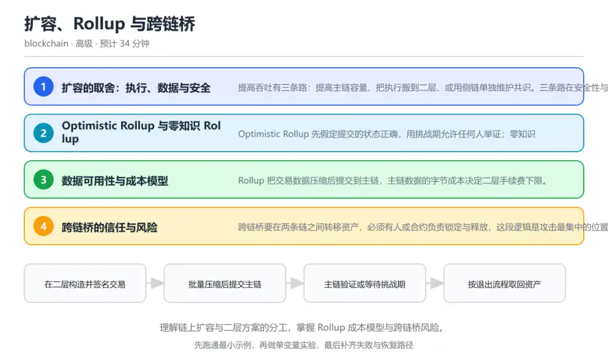
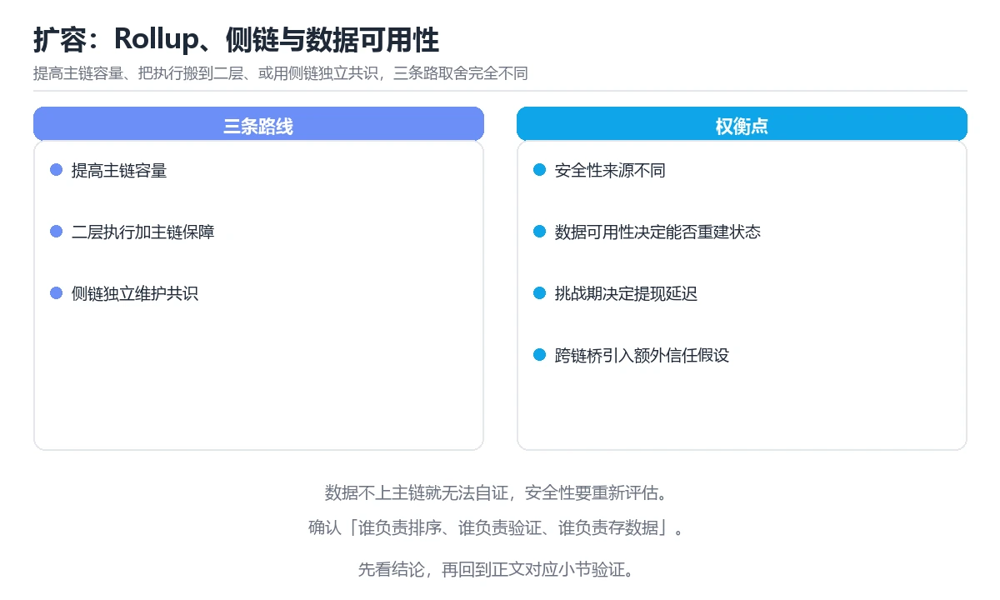

# 扩容、Rollup 与跨链桥

> 内容更新时间：2026-10-06 · 学习阶段：高级 · 预计用时：45 分钟

分类：blockchain。关键词：Rollup、数据可用性、跨链桥、扩容、手续费。理解链上扩容与二层方案的分工，掌握 Rollup 成本模型与跨链桥风险。

学习建议：先通读《扩容、Rollup 与跨链桥》的核心知识与关键流程，再运行可运行练习并完成测验；遇到不确定的结论，回到「故障现场」按症状、根因、修复、验证四步核对。



## 本节知识框架

**课程定位**：所属分类为「区块链与 Web3」，课程主题为「扩容、Rollup 与跨链桥」，学习阶段为「高级」，建议用时 45 分钟。

**本课要解决的主问题**：理解链上扩容与二层方案的分工，掌握 Rollup 成本模型与跨链桥风险。

| 学习层次 | 要回答的问题 | 完成判据 |
| --- | --- | --- |
| 概念层 | 「扩容、Rollup 与跨链桥」有哪些必须区分的对象与术语？ | 能用自己的话定义核心术语，并各举一个正例和一个反例。 |
| 机制层 | 这些对象按什么顺序发生作用，输入如何变成输出？ | 能画出或写出机制步骤，并说明每一步的失败条件。 |
| 应用层 | 什么场景适合使用「扩容、Rollup 与跨链桥」，什么场景不适合？ | 能给出一个真实场景、一个最小示例和一个边界案例。 |
| 性能层 | 时间、空间、吞吐或延迟受哪些量影响？ | 能说出复杂度或性能瓶颈的证据来源；没有证据时明确写“材料未提供”。 |
| 复习层 | 怎样确认自己不是只记住了结论？ | 能独立完成本课自测，并把错误定位到概念、机制、示例或边界。 |

### 阅读路线

1. 先读「核心概念定义」，建立「Rollup」等对象的精确定义。
2. 再读「原理与运行机制」，把定义串成可重复的过程。
3. 用「代码/协议/SQL 示例」验证过程，并只改一个条件观察结果变化。
4. 最后检查性能、易错点、知识关系与自测题，形成可复习的证据链。

**前置知识**：《以太坊、EVM 与智能合约》

**学习位置**：本课位于《DeFi 风险与智能合约审计》之后；如果前一课的自测不能通过，应先回补再继续。

**后续衔接**：本课之后可进入项目实战或综合复习，把本课结论用于一个完整任务。

**教材衔接：学习目标**

- 能区分链上扩容、Rollup 与侧链在信任假设上的差别。
- 能用数据与计算成本解释 Rollup 手续费为什么更低。
- 能列出跨链桥的主要风险与验证方式。

**教材衔接：前置知识**

- 已理解以太坊交易执行、Gas 与事件机制。
- 知道区块空间有限，交易需要竞价打包。
- 了解哈希证明与状态根的基本概念。

**教材衔接：本课小结**

- 扩容、Rollup 与跨链桥围绕Rollup、数据可用性、跨链桥展开，先建立基线再讨论优化。
- 提高吞吐有三条路：提高主链容量、把执行搬到二层、或用侧链单独维护共识。三条路在安全性与成本上的取舍完全不同。
- 排查 数据可用性 时保留原始错误信息，不要先改代码。

## 核心概念定义

> 阅读约定：本课先给「扩容、Rollup 与跨链桥」相关术语的操作性定义与适用边界；正文里的口语化说法与定义冲突时，以定义和可复现示例为准。

| 术语 | 操作性定义 | 本课中的边界 |
| --- | --- | --- |
| Rollup | 把执行移到二层、把数据提交主链的扩容方案，分乐观与零知识两类。 | 仅在「扩容、Rollup 与跨链桥」明确给出的输入、版本与资源条件下成立。 |
| 数据可用性 | 交易数据可被任何人获取并重建状态的性质，是二层安全的前提。 | 仅在「扩容、Rollup 与跨链桥」明确给出的输入、版本与资源条件下成立。 |
| 欺诈证明 | 允许参与者在挑战期内证明某个状态转换错误的机制。 | 仅在「扩容、Rollup 与跨链桥」明确给出的输入、版本与资源条件下成立。 |
| 跨链桥 | 在两条链之间转移资产或消息的中介系统，通常是攻击重点目标。 | 仅在「扩容、Rollup 与跨链桥」明确给出的输入、版本与资源条件下成立。 |
| 挑战期 | 乐观方案中允许提交欺诈证明的等待窗口，提现需要等其结束。 | 仅在「扩容、Rollup 与跨链桥」明确给出的输入、版本与资源条件下成立。 |

### 定义如何使用

在「扩容、Rollup 与跨链桥」中判断一个说法是否成立，先确认它使用的是哪个对象的定义，再检查输入规模、运行环境与失败路径。定义不是口号，而是后续推导、代码示例和自测题共享的约束。

## 原理与运行机制

### 机制总览

1. **建立输入**：把「Rollup」按本课定义整理成可观察、可重复的输入条件。
2. **执行转换**：围绕「数据可用性」执行本课的核心步骤；每一步都记录中间状态，避免只看最终输出。
3. **产生输出**：得到「欺诈证明」后，用正文示例或协议/SQL 结果核对输出是否符合预期。
4. **改变一个条件**：只替换一个边界条件或环境参数，观察「扩容、Rollup 与跨链桥」的结论是否仍然成立。

| 阶段 | 关注对象 | 失败时应检查 |
| --- | --- | --- |
| 输入 | Rollup | 类型、范围、编码、版本或前置状态是否满足定义。 |
| 处理 | 数据可用性 | 顺序、可见性、锁、路由、事务或调度规则是否被破坏。 |
| 输出 | 欺诈证明 | 结果是否可复现，错误是否被正确传播而不是被吞掉。 |

本课的机制结论要用「扩容、Rollup 与跨链桥」自己的示例验证。「扩容、Rollup 与跨链桥」没有给出某个数量级、吞吐或内存数据时，本课把该判断标为“材料未提供”，不从相邻主题外推。

**教材衔接：核心知识**

### 1. 扩容的取舍：执行、数据与安全

提高吞吐有三条路：提高主链容量、把执行搬到二层、或用侧链单独维护共识。三条路在安全性与成本上的取舍完全不同。

主链扩容受节点硬件约束，二层把执行移出主链但保留主链的数据与争议解决能力，侧链则自己维护验证者集合，安全性取决于那组验证者。

在扩容、Rollup 与跨链桥里可以这样验证：对比同一笔转账在主链、Rollup 和侧链上的手续费、确认时间与信任假设，列出三者的差异表。

边界：二层降低手续费的前提是批量提交，交易量不足时单笔成本可能反而更高。

工程视角：选型时先写清安全假设与退出路径，再比较费用；不要把侧链当成与主链同等安全的方案。

### 2. Optimistic Rollup 与零知识 Rollup

Optimistic Rollup 先假定提交的状态正确，用挑战期允许任何人举证；零知识 Rollup 为每批交易生成有效性证明，主链验证通过才接受状态。

前者依赖欺诈证明与挑战窗口，提现要等待挑战期结束；后者依赖证明系统，提现更快但证明生成成本更高。

在扩容、Rollup 与跨链桥里可以这样验证：对比两类方案的提现时间、证明成本与信任假设，说明各自更适合的场景。

边界：零知识证明保证计算正确，但数据不可用时用户仍无法自行重建状态，因此数据可用性同样关键。

工程视角：接入二层时优先使用官方桥，记录挑战期与提现流程；大额资金分批次跨链并保留凭证。

### 3. 数据可用性与成本模型

Rollup 把交易数据压缩后提交到主链，主链数据的字节成本决定二层手续费下限。

手续费大致等于压缩后字节数乘以数据单价，再加上二层执行成本；批量越大，单笔分摊的数据成本越低。

在扩容、Rollup 与跨链桥里可以这样验证：给定数据单价与批量大小，估算把一笔转账打包进批次的成本，并比较批量翻倍后的变化。

边界：只优化计算成本而忽略数据成本会误判收益；数据单价随主链拥堵波动，估算要用区间而不是单点。

工程视角：监控数据单价与批次大小，按成本波动调整提交策略；对用户费用做上限保护，避免极端行情下亏损。

### 4. 跨链桥的信任与风险

跨链桥要在两条链之间转移资产，必须有人或合约负责锁定与释放，这段逻辑是攻击最集中的位置。

常见模式是锁定-铸造与销毁-释放，验证方式包括多签、轻客户端验证与外部验证者；验证集合越大、越去中心，信任假设越弱。

在扩容、Rollup 与跨链桥里可以这样验证：列出一次跨链转账的完整步骤，标注每一步的信任假设与失败后的资金位置。

边界：桥的资产总量往往超过其验证成本，攻击收益极高；跨链消息重放与验证缺失是历史损失的主要原因。

工程视角：限制单笔与单日跨链额度，验证消息唯一性，桥接资产与原生资产分开记账，并准备暂停开关。

**教材衔接：关键流程**

```text
在二层构造并签名交易 → 批量压缩后提交主链 → 主链验证或等待挑战期 → 按退出流程取回资产
```

1. 在二层构造并签名交易
2. 批量压缩后提交主链
3. 主链验证或等待挑战期
4. 按退出流程取回资产

## 典型应用场景

| 场景 | 典型输入或前提 | 期望产物 |
| --- | --- | --- |
| 学习验证 | 使用本课最小示例和 Rollup、数据可用性 | 能复现正文结论，并解释每一步。 |
| 工程落地 | 把「扩容、Rollup 与跨链桥」放入真实模块或服务边界 | 输出可观测、失败可定位、参数可配置。 |
| 故障排查 | 只改一个版本、规模、输入或依赖条件 | 能区分概念错误、实现错误和环境差异。 |

判断「扩容、Rollup 与跨链桥」的场景是否成立，标准是能否写出输入、处理、输出和失败路径；材料中没有出现的数据在本课标注为“材料未提供”，不用推测替代证据。

**教材衔接：深度拓展与实战**

这一节把扩容、Rollup 与跨链桥的机制拆开验证：每一步都给出输入、判断标准和失败信号，便于在真实项目里复用。

### 机制拆解 1：扩容的取舍：执行、数据与安全

主链扩容受节点硬件约束，二层把执行移出主链但保留主链的数据与争议解决能力，侧链则自己维护验证者集合，安全性取决于那组验证者。

落地时先确认前提：二层降低手续费的前提是批量提交，交易量不足时单笔成本可能反而更高。；再把结论写进检查表，让下一位同学可以按同样的输入复现。

工程做法：选型时先写清安全假设与退出路径，再比较费用；不要把侧链当成与主链同等安全的方案。

### 机制拆解 2：Optimistic Rollup 与零知识 Rollup

前者依赖欺诈证明与挑战窗口，提现要等待挑战期结束；后者依赖证明系统，提现更快但证明生成成本更高。

落地时先确认前提：零知识证明保证计算正确，但数据不可用时用户仍无法自行重建状态，因此数据可用性同样关键。；再把结论写进检查表，让下一位同学可以按同样的输入复现。

工程做法：接入二层时优先使用官方桥，记录挑战期与提现流程；大额资金分批次跨链并保留凭证。

### 机制拆解 3：数据可用性与成本模型

手续费大致等于压缩后字节数乘以数据单价，再加上二层执行成本；批量越大，单笔分摊的数据成本越低。

落地时先确认前提：只优化计算成本而忽略数据成本会误判收益；数据单价随主链拥堵波动，估算要用区间而不是单点。；再把结论写进检查表，让下一位同学可以按同样的输入复现。

工程做法：监控数据单价与批次大小，按成本波动调整提交策略；对用户费用做上限保护，避免极端行情下亏损。

### 机制拆解 4：跨链桥的信任与风险

常见模式是锁定-铸造与销毁-释放，验证方式包括多签、轻客户端验证与外部验证者；验证集合越大、越去中心，信任假设越弱。

落地时先确认前提：桥的资产总量往往超过其验证成本，攻击收益极高；跨链消息重放与验证缺失是历史损失的主要原因。；再把结论写进检查表，让下一位同学可以按同样的输入复现。

工程做法：限制单笔与单日跨链额度，验证消息唯一性，桥接资产与原生资产分开记账，并准备暂停开关。

### 机制对照表

| 概念 | 解决什么问题 | 关键前提 | 失败信号 |
| --- | --- | --- | --- |
| 扩容的取舍：执行、数据与安全 | 提高吞吐有三条路：提高主链容量、把执行搬到二层、或用侧链单独维护共识。三条路在安 | 二层降低手续费的前提是批量提交，交易量不足时单笔成本可能反而更高。 | 选型时先写清安全假设与退出路径，再比较费用；不要把侧链当成与主链同等安全 |
| Optimistic Rollup 与零知识 Rollup | Optimistic Rollup 先假定提交的状态正确，用挑战期允许任何人举证 | 零知识证明保证计算正确，但数据不可用时用户仍无法自行重建状态，因此数据可 | 接入二层时优先使用官方桥，记录挑战期与提现流程；大额资金分批次跨链并保留 |
| 数据可用性与成本模型 | Rollup 把交易数据压缩后提交到主链，主链数据的字节成本决定二层手续费下限。 | 只优化计算成本而忽略数据成本会误判收益；数据单价随主链拥堵波动，估算要用 | 监控数据单价与批次大小，按成本波动调整提交策略；对用户费用做上限保护，避 |
| 跨链桥的信任与风险 | 跨链桥要在两条链之间转移资产，必须有人或合约负责锁定与释放，这段逻辑是攻击最集中 | 桥的资产总量往往超过其验证成本，攻击收益极高；跨链消息重放与验证缺失是历 | 限制单笔与单日跨链额度，验证消息唯一性，桥接资产与原生资产分开记账，并准 |

### 自测问答

**问 1**：Rollup 手续费更低的主要原因是什么？

**答**：大量交易压缩后共享同一份主链数据成本。Rollup 把执行搬到二层，只把压缩数据提交主链；批量越大，单笔分摊的数据成本越低，这才是费用下降的来源，而二层仍然需要验证与数据可用性。 正确选项「大量交易压缩后共享同一份主链数据成本」对应《扩容、Rollup 与跨链桥》的要点「扩容的取舍：执行、数据与安全」：提高吞吐有三条路：提高主链容量、把执行搬到二层、或用侧链单独维护共识。三条路在安全性与成本上的取舍完全不同。判断「扩容的取舍：执行、数据与安全」时先确认前提是否成立，再回到《扩容、Rollup 与跨链桥》的示例核对一次；把别的语言或框架的默认做法直接搬到扩容的取舍：执行、数据与安全上，往往会在本课的边界条件里失效。

**问 2**：乐观 Rollup 与零知识 Rollup 在提现上的典型差别是？

**答**：乐观方案要等挑战期结束，零知识方案验证证明后即可提现。乐观方案假定状态正确，必须先度过挑战期才能确保没有欺诈证明；零知识方案在上链时已验证有效性证明，因此提现流程更快。 正确选项「乐观方案要等挑战期结束，零知识方案验证证明后即可提现」对应《扩容、Rollup 与跨链桥》的要点「Optimistic Rollup 与零知识 Rollup」：Optimistic Rollup 先假定提交的状态正确，用挑战期允许任何人举证；零知识 Rollup 为每批交易生成有效性证明，主链验证通过才接受状态。判断「Optimistic Rollup 与零知识 Rollup」时先确认前提是否成立，再回到《扩容、Rollup 与跨链桥》的示例核对一次；借鉴相邻主题的经验之前，先核对Optimistic Rollup 与零知识 Rollup的前提是否成立。

**问 3**：以下哪些会显著增加跨链桥风险？（多选）

**答**：验证者集合过小且可被收买；跨链消息缺少唯一性校验；单笔与单日额度没有上限。验证者过小、消息可重放、缺少额度限制都会放大损失；而桥接资产与原生资产分开记账是降低风险的常见做法，不属于风险来源。 正确选项「验证者集合过小且可被收买；跨链消息缺少唯一性校验；单笔与单日额度没有上限」对应《扩容、Rollup 与跨链桥》的要点「数据可用性与成本模型」：Rollup 把交易数据压缩后提交到主链，主链数据的字节成本决定二层手续费下限。判断「数据可用性与成本模型」时先确认前提是否成立，再回到《扩容、Rollup 与跨链桥》的示例核对一次；记住数据可用性与成本模型的结论之外还要记住适用条件，换一个输入往往就不成立了。

**问 4**：请按用户把资产从二层取回主链的顺序排列步骤。

**答**：主链合约释放资产。先在二层发起提现，再经过挑战期或证明验证，主链确认状态后才释放资产；顺序颠倒会出现未确认状态就放款的漏洞。 正确选项「在二层发起提现交易；等待挑战期或生成有效性证明；二层状态被主链确认；主链合约释放资产」对应《扩容、Rollup 与跨链桥》的要点「跨链桥的信任与风险」：跨链桥要在两条链之间转移资产，必须有人或合约负责锁定与释放，这段逻辑是攻击最集中的位置。判断「跨链桥的信任与风险」时先确认前提是否成立，再回到《扩容、Rollup 与跨链桥》的示例核对一次；干扰项常常是相邻主题里成立的结论，只有按跨链桥的信任与风险的输入与约束判断才能排除。

**问 5**：阅读成本估算代码，哪项判断正确？

**答**：数据成本按字节数乘以单价计算，可与二层执行成本相加。代码明确把数据成本与执行成本分开计算再相加，因此字节数越大数据成本越高；压缩的目标是减少提交字节数，从而降低这一部分成本。 正确选项「数据成本按字节数乘以单价计算，可与二层执行成本相加」对应《扩容、Rollup 与跨链桥》的要点「扩容的取舍：执行、数据与安全」：提高吞吐有三条路：提高主链容量、把执行搬到二层、或用侧链单独维护共识。三条路在安全性与成本上的取舍完全不同。判断「扩容的取舍：执行、数据与安全」时先确认前提是否成立，再回到《扩容、Rollup 与跨链桥》的示例核对一次；把扩容的取舍：执行、数据与安全的做法换到别的约束下未必成立，先确认边界再决定答案。

### 排错速查

- 看到「认为侧链与主链享有同样的安全保障，大额资产直接长期停留」时，先按「先写清验证者集合与退出路径，把侧链资产按更高风险额度管理」处理，再用扩容、Rollup 与跨链桥的最小示例确认结论是否恢复。
- 看到「按主链确认时间规划二层提现，导致资金周转计划落空」时，先按「把挑战期写进资金计划，大额提现提前安排或使用可信的流动性通道」处理，再用扩容、Rollup 与跨链桥的最小示例确认结论是否恢复。
- 看到「压缩数据单元价格变化后，手续费模型完全失效」时，先按「同时跟踪数据单价与批量大小，按区间估算并给用户费用设置上限」处理，再用扩容、Rollup 与跨链桥的最小示例确认结论是否恢复。

### 工程检查表

- [ ] 在二层构造并签名交易
- [ ] 批量压缩后提交主链
- [ ] 主链验证或等待挑战期
- [ ] 按退出流程取回资产
- [ ] 【扩容的取舍：执行、数据与安全】选型时先写清安全假设与退出路径，再比较费用；不要把侧链当成与主链同等安全的方案。
- [ ] 【Optimistic Rollup 与零知识 Rollup】接入二层时优先使用官方桥，记录挑战期与提现流程；大额资金分批次跨链并保留凭证。
- [ ] 【数据可用性与成本模型】监控数据单价与批次大小，按成本波动调整提交策略；对用户费用做上限保护，避免极端行情下亏损。
- [ ] 【跨链桥的信任与风险】限制单笔与单日跨链额度，验证消息唯一性，桥接资产与原生资产分开记账，并准备暂停开关。

### 迁移练习

把扩容、Rollup 与跨链桥的方法用到一个真实场景：写下Rollup、数据可用性、跨链桥在你的场景里分别对应什么，再记录一次失败尝试和它的恢复步骤。

### 延伸阅读与下一步

- 复习Rollup、数据可用性、跨链桥、扩容、手续费时，优先回看「扩容的取舍：执行、数据与安全」与「跨链桥的信任与风险」两节。
- 把从「在二层构造并签名交易」到「按退出流程取回资产」的流程画成一张图，放进自己的笔记。
- 一周后重做本课测验，只把答错的题留到下一轮复习。

### 结论与下一步

学完扩容、Rollup 与跨链桥，应该能独立完成三件事：先用最小示例确认Rollup的行为，再用一个边界输入验证结论，最后把失败路径写成可重复的检查。下一步把本课术语加入复习清单，并在两周内用一次真实任务检验记忆是否牢固。

## 代码/协议/SQL 示例

### 最小可验证示例

下面保留《扩容、Rollup 与跨链桥》原文中的最小示例。先预测《扩容、Rollup 与跨链桥》示例的输出，再按正文步骤运行或推演；示例依赖外部环境时，同时记录版本与输入。

```text
在二层构造并签名交易 → 批量压缩后提交主链 → 主链验证或等待挑战期 → 按退出流程取回资产
```

**教材衔接：原文最小示例**

```text
在二层构造并签名交易 → 批量压缩后提交主链 → 主链验证或等待挑战期 → 按退出流程取回资产
```

## 时间/空间复杂度或性能分析

**复杂度证据**：「扩容、Rollup 与跨链桥」的现有材料没有给出渐近时间或空间复杂度的明确结论，本课只做定性检查，不补写未经验证的 $O$ 记号。

| 维度 | 本课关注点 | 判断依据 |
| --- | --- | --- |
| 时间/延迟 | 「扩容、Rollup 与跨链桥」的主要步骤是否会随输入规模、并发度或网络往返增长。 | 以正文复杂度、基准数据或可重复测量为准。 |
| 空间/内存 | 中间状态、缓存、副本、连接或索引是否随规模增长。 | 记录峰值内存与数据副本，不只看最终结果。 |
| 吞吐/资源 | 版本、调度、锁、IO、序列化或协议开销是否成为瓶颈。 | 固定环境做对照实验，改变一个变量。 |

评估「扩容、Rollup 与跨链桥」时要区分“正确性成立”和“性能达标”两件事；材料没有给出基准时，本课只保留量级来源与测量方法，不写不可验证的绝对数字。

## 常见误区与易错点

> 复核《扩容、Rollup 与跨链桥》的易错点时，优先保留原文的错误表、故障现场与排错路径；每条修正都要能用本课示例复验。

| 易错点 | 常见表现 | 正确做法 |
| --- | --- | --- |
| 只背结论 | 能复述「扩容、Rollup 与跨链桥」的定义，却说不清输入、输出与边界。 | 回到机制步骤，用最小示例逐一验证。 |
| 混淆相邻概念 | 把本课对象与相邻主题的对象当成同一类。 | 先比较定义、资源归属、生命周期和失败模式。 |
| 忽略版本与环境 | 在开发机通过后直接外推到生产环境。 | 固定版本、输入和资源条件，再记录可复现结果。 |

**教材衔接：常见错误与排查**

> 说明：本表由《扩容、Rollup 与跨链桥》的核心知识整理（2026-10-06），人工复核进度见 docs/content_review_batches.md。

| 易错点 | 容易踩的做法 | 正确结论 |
| --- | --- | --- |
| 把侧链当作二层 | 认为侧链与主链享有同样的安全保障，大额资产直接长期停留 | 先写清验证者集合与退出路径，把侧链资产按更高风险额度管理 |
| 忽略提现挑战期 | 按主链确认时间规划二层提现，导致资金周转计划落空 | 把挑战期写进资金计划，大额提现提前安排或使用可信的流动性通道 |
| 只估算计算成本 | 压缩数据单元价格变化后，手续费模型完全失效 | 同时跟踪数据单价与批量大小，按区间估算并给用户费用设置上限 |

**教材衔接：故障现场**

### 现场 1：把侧链当作二层

**症状**：在《扩容、Rollup 与跨链桥》的复现场景中，认为侧链与主链享有同样的安全保障，大额资产直接长期停留。

**根因**：“认为侧链与主链享有同样的安全保障，大额资产直接长期停留”只是表层结果。向上追溯会落到“把侧链当作二层”这一步，因为它省略了《扩容、Rollup 与跨链桥》的约束，使实现行为和预期模型发生了偏离。

**修复**：针对《扩容、Rollup 与跨链桥》的问题，先写清验证者集合与退出路径，把侧链资产按更高风险额度管理。

**验证**：保留《扩容、Rollup 与跨链桥》里触发“认为侧链与主链享有同样的安全保障，大额资产直接长期停留”的输入、版本和日志，按“先写清验证者集合与退出路径，把侧链资产按更高风险额度管理”完成修改后原样重放；只有失败现象消失且相邻场景仍可解释，才保留改动。

### 现场 2：忽略提现挑战期

**症状**：在《扩容、Rollup 与跨链桥》的复现场景中，按主链确认时间规划二层提现，导致资金周转计划落空。

**根因**：“按主链确认时间规划二层提现，导致资金周转计划落空”只是表层结果。向上追溯会落到“忽略提现挑战期”这一步，因为它省略了《扩容、Rollup 与跨链桥》的约束，使实现行为和预期模型发生了偏离。

**修复**：针对《扩容、Rollup 与跨链桥》的问题，把挑战期写进资金计划，大额提现提前安排或使用可信的流动性通道。

**验证**：保留《扩容、Rollup 与跨链桥》里触发“按主链确认时间规划二层提现，导致资金周转计划落空”的输入、版本和日志，按“把挑战期写进资金计划，大额提现提前安排或使用可信的流动性通道”完成修改后原样重放；只有失败现象消失且相邻场景仍可解释，才保留改动。

### 现场 3：只估算计算成本

**症状**：在《扩容、Rollup 与跨链桥》的复现场景中，压缩数据单元价格变化后，手续费模型完全失效。

**根因**：当出现“只估算计算成本”时，执行路径已经绕过了《扩容、Rollup 与跨链桥》的关键约束，最终以“压缩数据单元价格变化后，手续费模型完全失效”暴露出来；修复前必须先确认约束在哪里失效。

**修复**：针对《扩容、Rollup 与跨链桥》的问题，同时跟踪数据单价与批量大小，按区间估算并给用户费用设置上限。

**验证**：先在《扩容、Rollup 与跨链桥》中记录“只估算计算成本”留下的失败证据，再执行“同时跟踪数据单价与批量大小，按区间估算并给用户费用设置上限”并重放；确认错误路径变为明确结果，且修复没有掩盖同类故障。

## 与其他知识点的关系

| 关系 | 课程 | 为什么 |
| --- | --- | --- |
| 先修 | 《以太坊、EVM 与智能合约》 | 本课会直接使用它的概念或操作前提。 |
| 前置顺序 | 《DeFi 风险与智能合约审计》 | 同分类中安排在本课之前，建议先完成其自测。 |

把「扩容、Rollup 与跨链桥」放回知识体系时，不只要记住“前面学过什么”，还要说明两个主题在输入、机制、资源边界和失败模式上的差异。这样才能把单课知识迁移到项目、排障和后续课程。

**教材衔接：复习与迁移**

### 概念复述

不看正文，把扩容、Rollup 与跨链桥讲给一个没学过的同事：先讲它解决什么问题，再讲一个最小例子，最后说明一个不适用场景。

### 测验回顾

回到《扩容、Rollup 与跨链桥》测验，只重做答错或犹豫的题；对每道题写一句「我为什么改选这个答案」，写不出理由就回到对应小节。

### 迁移练习

把《扩容、Rollup 与跨链桥》的方法用到一个你自己的真实场景：说明输入、约束与验证方式，并列出仍然不确定、需要下一次实验回答的问题。

## 自测题与参考答案

> 先独立作答《扩容、Rollup 与跨链桥》的自测题，再对照答案与解析；每处判断都要能在本课正文或示例中找到依据。

### 自测 1

Rollup 手续费更低的主要原因是什么？

A. 二层交易完全不写入链上数据，但它只覆盖了部分情况
B. 主链会为二层交易提供补贴
C. 大量交易压缩后共享同一份主链数据成本
D. 二层不需要任何验证者

**参考答案**：大量交易压缩后共享同一份主链数据成本

**解析**：Rollup 把执行搬到二层，只把压缩数据提交主链；批量越大，单笔分摊的数据成本越低，这才是费用下降的来源，而二层仍然需要验证与数据可用性。 正确选项「大量交易压缩后共享同一份主链数据成本」对应《扩容、Rollup 与跨链桥》的要点「扩容的取舍：执行、数据与安全」：提高吞吐有三条路：提高主链容量、把执行搬到二层、或用侧链单独维护共识。三条路在安全性与成本上的取舍完全不同。判断「扩容的取舍：执行、数据与安全」时先确认前提是否成立，再回到《扩容、Rollup 与跨链桥》的示例核对一次；把别的语言或框架的默认做法直接搬到扩容的取舍：执行、数据与安全上，往往会在本课的边界条件里失效。

### 自测 2

以下哪些会显著增加跨链桥风险？（多选）

A. 验证者集合过小且可被收买
B. 跨链消息缺少唯一性校验
C. 单笔与单日额度没有上限
D. 桥接资产与原生资产分开记账

**参考答案**：验证者集合过小且可被收买；跨链消息缺少唯一性校验；单笔与单日额度没有上限

**解析**：验证者过小、消息可重放、缺少额度限制都会放大损失；而桥接资产与原生资产分开记账是降低风险的常见做法，不属于风险来源。 正确选项「验证者集合过小且可被收买；跨链消息缺少唯一性校验；单笔与单日额度没有上限」对应《扩容、Rollup 与跨链桥》的要点「数据可用性与成本模型」：Rollup 把交易数据压缩后提交到主链，主链数据的字节成本决定二层手续费下限。判断「数据可用性与成本模型」时先确认前提是否成立，再回到《扩容、Rollup 与跨链桥》的示例核对一次；记住数据可用性与成本模型的结论之外还要记住适用条件，换一个输入往往就不成立了。

### 自测 3

请按用户把资产从二层取回主链的顺序排列步骤。

A. 主链合约释放资产
B. 在二层发起提现交易
C. 等待挑战期或生成有效性证明
D. 二层状态被主链确认

**参考答案**：在二层发起提现交易 → 等待挑战期或生成有效性证明 → 二层状态被主链确认 → 主链合约释放资产

**解析**：先在二层发起提现，再经过挑战期或证明验证，主链确认状态后才释放资产；顺序颠倒会出现未确认状态就放款的漏洞。 正确选项「在二层发起提现交易；等待挑战期或生成有效性证明；二层状态被主链确认；主链合约释放资产」对应《扩容、Rollup 与跨链桥》的要点「跨链桥的信任与风险」：跨链桥要在两条链之间转移资产，必须有人或合约负责锁定与释放，这段逻辑是攻击最集中的位置。判断「跨链桥的信任与风险」时先确认前提是否成立，再回到《扩容、Rollup 与跨链桥》的示例核对一次；干扰项常常是相邻主题里成立的结论，只有按跨链桥的信任与风险的输入与约束判断才能排除。

**教材衔接：动手练习**

1. 按你所在地区常用的二层网络查一次真实提现记录，记录挑战期与实际到账时间。
2. 给成本模型加一个批量大小参数，画出批量翻倍时单笔成本的变化趋势。
3. 为一个跨链桥设计三条风控规则，并说明每条规则拦截的攻击场景。

**验收标准**：记录 Rollup 的输入、实际输出与差异解释，缺一项都不算完成。

**教材衔接：可运行练习**

### 任务 1：先跑通，再解释

```javascript
// 估算把一笔交易放进 Rollup 批次的数据成本
function batchCost({ bytesPerTx, dataPricePerByte, l2ExecutionCost }) {
  const dataCost = bytesPerTx * dataPricePerByte;
  return { dataCost, total: dataCost + l2ExecutionCost };
}

const single = batchCost({ bytesPerTx: 120, dataPricePerByte: 0.00002, l2ExecutionCost: 0.0004 });
const amortized = batchCost({ bytesPerTx: 12, dataPricePerByte: 0.00002, l2ExecutionCost: 0.0004 });
console.log('single tx', single);
console.log('amortized', amortized);
console.log('saving', (single.total - amortized.total).toFixed(6));
```

代码把数据成本与二层执行成本分开计算：第一组代表未压缩的单笔交易，第二组代表压缩后分摊到批次的字节数，差值就是 Rollup 摊薄数据成本带来的节省。

### 任务 2：只改一个条件

复制上面的示例，只改一个输入或参数再跑一次；先写下预测，再和真实输出对照，并说明差异来自扩容、Rollup 与跨链桥的哪条机制。

### 任务 3：迁移到自己的数据

把《扩容、Rollup 与跨链桥》里的示例换成你自己的一小段数据或场景，保持结构不变；如果换不动，说明还有哪条前提没有理解，回到核心知识对应小节。

**教材衔接：本课复习清单**

离开本课前，逐项确认：

- [ ] 能说明 Rollup 与侧链在信任假设上的差别。
- [ ] 能用数据成本解释二层手续费优势。
- [ ] 能列出跨链桥的主要风险与验证方式。
- [ ] 至少运行一次 dataPricePerByte 的示例，记录输入、输出和 Rollup 的边界情况。
- [ ] 把本课最容易混淆的两个概念写成一句话对照。

| 复盘项 | 记录 |
| --- | --- |
| 已经能独立解释的考点 |  |
| 仍然说不清的概念 |  |
| 下一步验证动作 |  |

**教材衔接：复习与自测**

### 核心知识

遮住正文回答：扩容、Rollup 与跨链桥解决什么问题、依赖哪些前提、失败时先看哪个信号？三问都能答清楚，再进入下一节。

### 动手练习

把《扩容、Rollup 与跨链桥》里「只改一个条件」的练习再做一遍，这次先写预测再运行；预测和结果不一致的地方，就是需要回读的章节。

### 最小可运行示例

```javascript
// 估算把一笔交易放进 Rollup 批次的数据成本
function batchCost({ bytesPerTx, dataPricePerByte, l2ExecutionCost }) {
  const dataCost = bytesPerTx * dataPricePerByte;
  return { dataCost, total: dataCost + l2ExecutionCost };
}

const single = batchCost({ bytesPerTx: 120, dataPricePerByte: 0.00002, l2ExecutionCost: 0.0004 });
const amortized = batchCost({ bytesPerTx: 12, dataPricePerByte: 0.00002, l2ExecutionCost: 0.0004 });
console.log('single tx', single);
console.log('amortized', amortized);
console.log('saving', (single.total - amortized.total).toFixed(6));
```

### 预期输出

```text
single 的 dataCost 为 0.0024，total 为 0.0028；amortized 的 dataCost 为 0.00024，total 为 0.00064；saving 约为 0.00216。
```

### 验证步骤

1. 确认输入数据与运行环境和示例一致。
2. 运行示例，记录输出与耗时等可观测指标。
3. 换一个边界输入重跑，确认结论仍然成立。
4. 把两次结果写成一句话结论，注明前提与局限。

---

## 术语速查

先遮住右列，尝试用自己的话解释，再回到正文核对。

| 术语 | 一句话说明 |
| --- | --- |
| `Rollup` | 把执行移到二层、把数据提交主链的扩容方案，分乐观与零知识两类。 |
| `数据可用性` | 交易数据可被任何人获取并重建状态的性质，是二层安全的前提。 |
| `欺诈证明` | 允许参与者在挑战期内证明某个状态转换错误的机制。 |
| `跨链桥` | 在两条链之间转移资产或消息的中介系统，通常是攻击重点目标。 |
| `挑战期` | 乐观方案中允许提交欺诈证明的等待窗口，提现需要等其结束。 |

## 考点精讲

### 考点 1：Rollup 手续费更低的主要原因是什么

题型：概念判断。题干：Rollup 手续费更低的主要原因是什么？

判断要点：大量交易压缩后共享同一份主链数据成本。Rollup 把执行搬到二层，只把压缩数据提交主链；批量越大，单笔分摊的数据成本越低，这才是费用下降的来源，而二层仍然需要验证与数据可用性。 正确选项「大量交易压缩后共享同一份主链数据成本」对应《扩容、Rollup 与跨链桥》的要点「扩容的取舍：执行、数据与安全」：提高吞吐有三条路：提高主链容量、把执行搬到二层、或用侧链单独维护共识。三条路在安全性与成本上的取舍完全不同。判断「扩容的取舍：执行、数据与安全」时先确认前提是否成立，再回到《扩容、Rollup 与跨链桥》的示例核对一次；把别的语言或框架的默认做法直接搬到扩容的取舍：执行、数据与安全上，往往会在本课的边界条件里失效。

### 考点 2：乐观 Rollup 与零知识 Rollu

题型：概念判断。题干：乐观 Rollup 与零知识 Rollup 在提现上的典型差别是？

判断要点：乐观方案要等挑战期结束，零知识方案验证证明后即可提现。乐观方案假定状态正确，必须先度过挑战期才能确保没有欺诈证明；零知识方案在上链时已验证有效性证明，因此提现流程更快。 正确选项「乐观方案要等挑战期结束，零知识方案验证证明后即可提现」对应《扩容、Rollup 与跨链桥》的要点「Optimistic Rollup 与零知识 Rollup」：Optimistic Rollup 先假定提交的状态正确，用挑战期允许任何人举证；零知识 Rollup 为每批交易生成有效性证明，主链验证通过才接受状态。判断「Optimistic Rollup 与零知识 Rollup」时先确认前提是否成立，再回到《扩容、Rollup 与跨链桥》的示例核对一次；借鉴相邻主题的经验之前，先核对Optimistic Rollup 与零知识 Rollup的前提是否成立。

### 考点 3：以下哪些会显著增加跨链桥风险？（多选）

题型：多选辨析。题干：以下哪些会显著增加跨链桥风险？（多选）

判断要点：验证者集合过小且可被收买；跨链消息缺少唯一性校验；单笔与单日额度没有上限。验证者过小、消息可重放、缺少额度限制都会放大损失；而桥接资产与原生资产分开记账是降低风险的常见做法，不属于风险来源。 正确选项「验证者集合过小且可被收买；跨链消息缺少唯一性校验；单笔与单日额度没有上限」对应《扩容、Rollup 与跨链桥》的要点「数据可用性与成本模型」：Rollup 把交易数据压缩后提交到主链，主链数据的字节成本决定二层手续费下限。判断「数据可用性与成本模型」时先确认前提是否成立，再回到《扩容、Rollup 与跨链桥》的示例核对一次；记住数据可用性与成本模型的结论之外还要记住适用条件，换一个输入往往就不成立了。

### 考点 4：请按用户把资产从二层取回主链的顺序排列步

题型：顺序排列。题干：请按用户把资产从二层取回主链的顺序排列步骤。

判断要点：主链合约释放资产。先在二层发起提现，再经过挑战期或证明验证，主链确认状态后才释放资产；顺序颠倒会出现未确认状态就放款的漏洞。 正确选项「在二层发起提现交易；等待挑战期或生成有效性证明；二层状态被主链确认；主链合约释放资产」对应《扩容、Rollup 与跨链桥》的要点「跨链桥的信任与风险」：跨链桥要在两条链之间转移资产，必须有人或合约负责锁定与释放，这段逻辑是攻击最集中的位置。判断「跨链桥的信任与风险」时先确认前提是否成立，再回到《扩容、Rollup 与跨链桥》的示例核对一次；干扰项常常是相邻主题里成立的结论，只有按跨链桥的信任与风险的输入与约束判断才能排除。

### 考点 5：阅读成本估算代码，哪项判断正确？

题型：排错。题干：阅读成本估算代码，哪项判断正确？

判断要点：数据成本按字节数乘以单价计算，可与二层执行成本相加。代码明确把数据成本与执行成本分开计算再相加，因此字节数越大数据成本越高；压缩的目标是减少提交字节数，从而降低这一部分成本。 正确选项「数据成本按字节数乘以单价计算，可与二层执行成本相加」对应《扩容、Rollup 与跨链桥》的要点「扩容的取舍：执行、数据与安全」：提高吞吐有三条路：提高主链容量、把执行搬到二层、或用侧链单独维护共识。三条路在安全性与成本上的取舍完全不同。判断「扩容的取舍：执行、数据与安全」时先确认前提是否成立，再回到《扩容、Rollup 与跨链桥》的示例核对一次；把扩容的取舍：执行、数据与安全的做法换到别的约束下未必成立，先确认边界再决定答案。

## English Overview

Scaling, Rollups and Bridges

Scaling a blockchain means choosing where execution and data live. This lesson compares L1 scaling, optimistic rollups, zero-knowledge rollups and sidechains, builds a simple fee model from data and execution cost, and reviews the trust assumptions behind bridges.



## 内容元数据

- 内容版本：v2.0
- 最后更新：2026-10-06
- 学习阶段：高级

| 字段 | 值 |
| --- | --- |
| 课程 ID | `blockchain_scaling_layer2` |
| 所属分类 | `blockchain` |
| 难度 | 高级 |
| 预计用时 | 34 分钟 |
| 关键词 | Rollup、数据可用性、跨链桥、扩容、手续费 |
| 配图 | `images/lesson_blockchain_scaling_layer2.webp` |
| 参考资料 | 3 条 |
| 内容更新时间 | 2026-10-06 |

## 参考资料与复核

- 最后复核：2026-10-04
- 下次复核：2027-01-17
- 复核范围：版本兼容、API 行为与工程实践

下面列出的资料用于核对本课结论，复习时可以对照阅读：
- [Ethereum 扩容方案总览](https://ethereum.org/zh/developers/docs/scaling/)
- [Optimistic Rollup 说明](https://ethereum.org/zh/developers/docs/scaling/optimistic-rollups/)
- [EIP-4844 数据块提案](https://eips.ethereum.org/EIPS/eip-4844)

> 复核提示：《扩容、Rollup 与跨链桥》的结论如与资料冲突，以资料中的规范文本为准，并在笔记里记录差异与日期。
