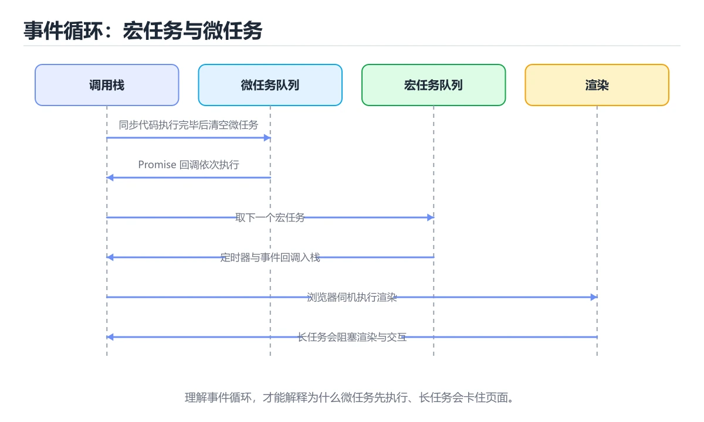
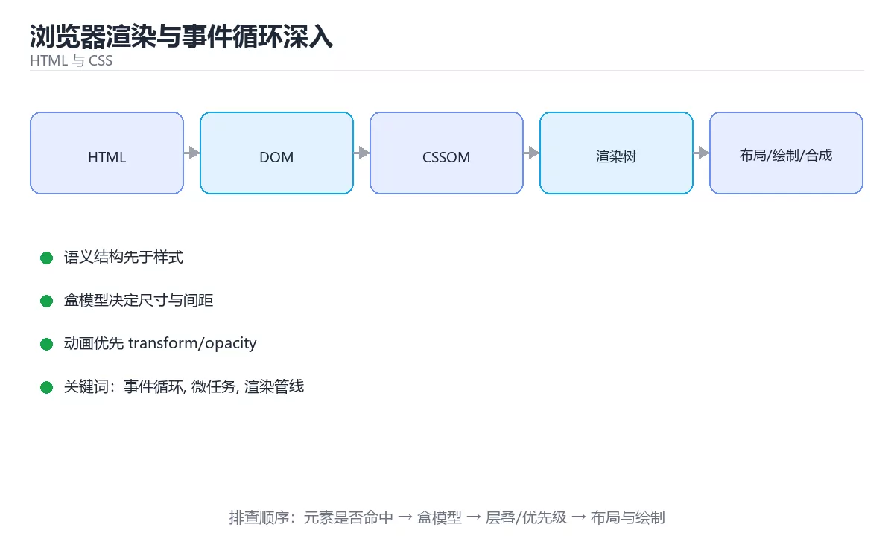

# 本课主题





> 内容更新时间：2026-10-03 · 学习阶段：高级 · 预计用时：18 分钟

## 学习目标

- 能用自己的话解释本课主题解决了什么问题，而不是只背术语。
- 能说清 「事件循环」、「微任务」、「渲染管线」、「强制同步布局」 之间的关系，并分别举出一个例子。
- 能把本课知识放回「HTML 与 CSS」的知识体系，说明它和相邻主题的边界。
- 能完成本课练习，并用验收标准检查自己的结果。

> 一句话摘要：宏任务微任务顺序、强制同步布局与长任务拆片。

## 前置知识

- 先完成上一课《可访问性与 ARIA 实战》；如果已经掌握，可以直接用本课练习自测。
- 开始前先复习：事件循环、微任务、渲染管线。
- 如果某一步看不懂，先记录具体卡点，完成练习后再回头读一遍。

## 事件循环速查

| 队列 | 例子 | 执行时机 |
| --- | --- | --- |
| 宏任务（task） | `setTimeout`、事件回调、网络回调 | 每轮取一个执行 |
| 微任务（microtask） | Promise 回调、`queueMicrotask`、`MutationObserver` | 每个宏任务之后清空全部 |
| 渲染步骤 | 样式、布局、绘制、合成 | 需要呈现时在宏任务之间执行 |
| 空闲回调 | `requestIdleCallback` | 帧末尾有空闲时 |

关键结论：**微任务会在渲染之前全部执行完**。如果微任务里再产生微任务，会一直占住主线程，导致页面不刷新。

```javascript
console.log("1 sync");
setTimeout(() => console.log("4 macrotask"), 0);
Promise.resolve().then(() => console.log("3 microtask"));
console.log("2 sync");
// 输出顺序：1 sync → 2 sync → 3 microtask → 4 macrotask
```

## 渲染管线速查

| 阶段 | 何时发生 | 代价 |
| --- | --- | --- |
| 样式计算 | 选择器匹配、变量变化 | 中 |
| 布局 | 几何属性变化 | 高 |
| 绘制 | 颜色、阴影、背景变化 | 中 |
| 合成 | transform、opacity | 低 |

避免布局抖动的关键：**不要把读操作与写操作交错执行**，否则每写一次都会强制同步布局。

```javascript
// 反例：读-写-读-写 交错，触发多次强制同步布局
function bad(elements) {
  for (const el of elements) {
    el.style.height = `${el.offsetHeight + 10}px`;   // 写后立刻读，强制回流
  }
}

// 正例：先批量读，再批量写
function good(elements) {
  const heights = elements.map((el) => el.offsetHeight);   // 只读
  elements.forEach((el, index) => {
    el.style.height = `${heights[index] + 10}px`;          // 只写
  });
}
```

```javascript
// 长任务拆片：把大批量处理切到多帧，保证输入响应（改善 INP）
async function processInIdle(items, handler) {
  const CHUNK = 200;
  for (let index = 0; index < items.length; index += CHUNK) {
    const slice = items.slice(index, index + CHUNK);
    slice.forEach(handler);
    // 让出主线程：下一轮事件循环继续
    await new Promise((resolve) => setTimeout(resolve, 0));
  }
}

// 用 PerformanceObserver 观察长任务
if ("PerformanceObserver" in window) {
  new PerformanceObserver((list) => {
    for (const entry of list.getEntries()) {
      if (entry.duration > 50) {
        console.warn("长任务", Math.round(entry.duration), "ms");
      }
    }
  }).observe({ entryTypes: ["longtask"] });
}
```

## 滚动与布局优化速查

| 问题 | 手段 |
| --- | --- |
| 滚动卡顿 | 用 `transform` 做位移动画，避免监听 `scroll` 改布局 |
| 频繁滚动回调 | 用 `passive: true` 或 `IntersectionObserver` 替代 |
| 图片懒加载 | `loading="lazy"` 或 `IntersectionObserver` |
| 列表过长 | 虚拟滚动，只渲染可见区域 |
| 布局抖动 | 预留尺寸、`contain: layout` 隔离影响范围 |
| 大量 DOM 更新 | 批量写入、`DocumentFragment`、一次性替换 |

## 渲染阻塞速查

| 资源 | 是否阻塞解析 | 建议 |
| --- | --- | --- |
| `<script>` 同步 | 阻塞 | 用 `defer` 或 `type="module"` |
| `<script async>` | 不阻塞 | 无依赖的独立脚本 |
| `<style>` / `<link rel=stylesheet>` | 阻塞渲染 | 关键 CSS 内联，其余异步加载 |
| 字体 | 触发文字延迟 | `font-display: swap` + 预加载 |
| 大图与视频 | 影响 LCP | 压缩、尺寸适配、`fetchpriority` |

## 常见错误对照表

| 容易踩的做法 | 实际现象 | 原因与正确做法 |
| --- | --- | --- |
| 认为 `setTimeout(0)` 立即执行 | 顺序与预期不符 | 宏任务要等当前任务与微任务清空 |
| 在微任务里递归排队 | 页面完全卡死 | 改用宏任务或拆片让出线程 |
| 读写字交错 | 强制同步布局，掉帧严重 | 先批量读、再批量写 |
| 用 `scroll` 事件改布局 | 滚动抖动 | 用 `passive` 监听或观察器替代 |
| 同步脚本放 `<head>` | 首屏空白 | 用 `defer` / `async` / 模块脚本 |
| 关键 CSS 依赖网络 | 首屏样式闪烁 | 内联关键样式 |
| 忽略长任务 | 输入延迟（INP 差） | 拆片、Worker、`requestIdleCallback` |
| 用 `left/top` 做动画 | 每帧布局 | 用 `transform` |

## 自测清单

- [ ] 能准确说出宏任务、微任务与渲染的执行顺序。
- [ ] 知道微任务不结束就不会渲染。
- [ ] 避免读写交错导致的强制同步布局。
- [ ] 长任务会拆片，保证输入响应。
- [ ] 关键 CSS 内联，脚本使用 `defer` 或模块。

## 补充：重排重绘与关键渲染路径优化

### 哪些属性会触发什么

| 变更属性 | 触发的阶段 | 代价 |
| --- | --- | --- |
| `width`、`height`、`margin`、`top/left` | 布局 + 绘制 + 合成 | **最高（重排）** |
| `color`、`background`、`box-shadow` | 绘制 + 合成 | 中 |
| `transform`、`opacity` | 仅合成 | **最低** |
| `visibility` | 绘制 + 合成 | 中 |
| `filter`（部分） | 合成（GPU） | 低 |

```text
一句话原则：动画只改 transform 与 opacity
  · 它们可以由合成器单独处理，不触发 layout 与 paint
  · top/left 做动画等价于每帧重排，是典型的性能反模式
```

### 强制同步布局：最常见的隐形杀手

```javascript
// 反例：读 → 写 → 读 → 写，每次都强制浏览器立刻重排
for (const el of items) {
  el.style.width = el.offsetWidth + 10 + "px";   // 读 offsetWidth 触发同步布局
}

// 正例：先批量读，再批量写
const widths = items.map((el) => el.offsetWidth);
items.forEach((el, i) => { el.style.width = widths[i] + 10 + "px"; });
```

| 触发同步布局的属性 | 说明 |
| --- | --- |
| `offsetTop/Left/Width/Height` | 读取即需要最新布局 |
| `scrollTop/scrollHeight` | 同上 |
| `getComputedStyle()` | 强制样式计算 |
| `getBoundingClientRect()` | 强制布局 |

### 关键渲染路径的五步与可优化点

```text
HTML → DOM 树 ┐
              ├→ 渲染树 → 布局 → 绘制 → 合成
CSS  → CSSOM ┘

可优化点
  · HTML：减少嵌套层级、避免巨型 DOM（数千节点以上要考虑虚拟列表）
  · CSS：关键样式内联，非关键样式异步加载
  · 脚本：用 defer/async，避免同步脚本阻塞解析
  · 图片：预留尺寸（width/height 或 aspect-ratio）避免 CLS
  · 字体：font-display: swap，避免文字长时间不可见
```

```html
<!-- 关键 CSS 内联，其余异步加载 -->
<style>/* 首屏必需的最小样式 */</style>
<link rel="preload" as="style" href="/full.css" onload="this.rel='stylesheet'">

<!-- 脚本不阻塞解析 -->
<script src="/app.js" defer></script>

<!-- 图片预留尺寸，避免布局偏移 -->

```

### 合成层与 will-change

```text
把元素提升为独立合成层的常见方式
  · transform: translateZ(0) 或 will-change: transform
  · position: fixed、video、canvas 天然可能独立成层

好处：动画由 GPU 合成，主线程只更新少量属性
代价：每个层都要显存，层过多会拖慢合成与内存

结论：will-change 只在动画开始前短时间加上，结束后移除
```

### 优化前后怎么验证

| 工具 | 看什么 | 结论 |
| --- | --- | --- |
| DevTools Performance | 是否有紫色 Layout 条 | 有则存在重排 |
| Layers 面板 | 合成层数量与大小 | 层过多 → 显存压力 |
| Lighthouse | LCP、CLS、INP | 按指标定位资源或长任务 |
| Rendering → Paint flashing | 绿色闪烁区域 | 闪烁说明发生了重绘 |

```text
三个指标的常见对策
  LCP 高 → 优化首屏图片与关键 CSS，或预加载主图
  CLS 高 → 给图片/广告位预留尺寸，避免动态插入内容
  INP 高 → 拆分长任务，减少主线程占用
```

### 自查清单

- [ ] 动画只使用 transform 与 opacity
- [ ] 没有「读 → 写 → 读 → 写」的强制同步布局
- [ ] 脚本用 defer/async，关键 CSS 内联
- [ ] 图片与广告位预留尺寸，避免 CLS
- [ ] 用 Performance 面板验证过重排与合成层数量

## 动手练习

> 本课练习重点：围绕「事件循环、微任务、渲染管线」完成复述、实验和交付，每个结果都要能被别人检查。

先写最小语义结构，再调整布局与样式，最后检查键盘、窄屏和对比度。

### 练习 1：建立心智模型（10 分钟）

合上教程，用 3～5 句话回答：

1. 本课主题解决了什么问题？
2. 如果没有它，会出现什么具体后果？
3. 它和「微任务」是什么关系？

**验收标准**：至少出现一个本课关键词，并写出一个反例、边界条件或失效场景。

### 练习 2：做一次可控实验（20 分钟）

从正文中选一个最小示例，完成以下操作：

1. 先预测修改一个参数、输入或步骤后的结果。
2. 再实际执行或逐步推演，记录真实结果。
3. 如果结果与预测不同，写出差异原因。

**验收标准**：留下「原例 → 改动 → 预测 → 结果 → 原因」五步记录。

### 练习 3：交付一个小结果（30 分钟）

做一个只有标题、卡片和按钮的最小页面，并用浏览器设备模式检查窄屏。

任务要求：

- 结果必须能被别人检查，不能只写“我已经理解了”。
- 至少覆盖「事件循环」和「微任务」两个关键词。
- 写出 1 个仍然不确定的问题，以及下一步如何验证。

> 提示：时间有限时优先做练习 1 和练习 2；练习 3 可以拆成两次完成。

## 本课小结

- 核心问题：本课主题不是孤立术语，而是在「HTML 与 CSS」中解决一类具体问题。
- 关键关系：先分清「事件循环」与「微任务」的职责，再理解「渲染管线」的适用边界。
- 判断标准：能解释正常场景、边界条件和失败场景，才算真正掌握。
- 下一步：完成练习后，用自己的话写下 3 条要点，再去做本课测验。

## 可运行练习

### 任务 1：先跑通，再解释

```javascript
console.log("1 sync");
setTimeout(() => console.log("4 macrotask"), 0);
Promise.resolve().then(() => console.log("3 microtask"));
console.log("2 sync");
// 输出顺序：1 sync → 2 sync → 3 microtask → 4 macrotask
```

**预期输出**：2 sync

### 任务 2：只改一个条件

### 任务 3：迁移到自己的数据

用同一套思路处理一组你自己的数据或场景，保持输出格式与任务 1 一致。

## 故障现场

### 现场 1：本课的 事件循环 常规用例通过，但边界用例失败

**症状**：在本课的练习或生产场景里出现“本课的 事件循环 常规用例通过，但边界用例失败”。

**复现**：准备一组最小输入，只保留触发“本课的 事件循环 常规用例通过，但边界用例失败”的必要条件，连续运行两次确认结果稳定。

**定位**：围绕“事件循环 的前置条件与取值边界没有写进代码，默认值掩盖了空值和极值”检查调用链、输入数据和环境配置，先验证假设再改代码。

**预防**：把“本课的 事件循环 常规用例通过，但边界用例失败”写成一条自动化用例，并在本课的验收清单里保留对应检查项。

### 现场 2：本课的 微任务 结果在两次运行之间不一致

**症状**：在本课的练习或生产场景里出现“本课的 微任务 结果在两次运行之间不一致”。

**复现**：准备一组最小输入，只保留触发“本课的 微任务 结果在两次运行之间不一致”的必要条件，连续运行两次确认结果稳定。

**定位**：围绕“微任务 依赖了当前版本、执行顺序或共享状态，单次运行无法暴露差异”检查调用链、输入数据和环境配置，先验证假设再改代码。

**预防**：把“本课的 微任务 结果在两次运行之间不一致”写成一条自动化用例，并在本课的验收清单里保留对应检查项。

### 现场 3：本课的验证只在开发机通过

**症状**：在本课的练习或生产场景里出现“本课的验证只在开发机通过”。

**定位**：围绕“环境版本、配置和输入规模与目标环境不同，事件循环 缺少可重复的验证记录”检查调用链、输入数据和环境配置，先验证假设再改代码。

## 本课复习清单

离开本课前，逐项确认：

- [ ] 不看解析，能说出「下面代码的输出顺序是？ console.log(1); setTimeout((…」的判断依据。
- [ ] 不看解析，能说出「在微任务中不断产生新的微任务会怎样？」的判断依据。
- [ ] 不看解析，能说出「下面哪种写法最容易触发强制同步布局？」的判断依据。
- [ ] 不看解析，能说出「优化输入响应（INP）最直接的手段是？」的判断依据。
- [ ] 不看解析，能说出「为避免脚本阻塞首屏渲染，推荐做法是？」的判断依据。
- [ ] 不看解析，能说出「补全代码：本课主题示例中，下面这行代码缺少哪个关键字或函数名…」的判断依据。
- [ ] 至少运行一次本课示例，记录输入、输出和一个边界情况。
- [ ] 把本课最容易混淆的两个概念写成一句话对照。

| 复盘项 | 记录 |
| --- | --- |
| 已经能独立解释的考点 |  |
| 仍然说不清的概念 |  |
| 下一步验证动作 |  |

## 术语速查

| 术语 | 本课语境 |
| --- | --- |
| `setTimeout` | \| 宏任务（task） \| `setTimeout`、事件回调、网络回调 \| 每轮取一个执行 \| |
| `queueMicrotask` | \| 微任务（microtask） \| Promise 回调、`queueMicrotask`、`MutationObserver` \| 每个宏任务之后清空全部 \| |
| `MutationObserver` | \| 微任务（microtask） \| Promise 回调、`queueMicrotask`、`MutationObserver` \| 每个宏任务之后清空全部 \| |
| `requestIdleCallback` | \| 空闲回调 \| `requestIdleCallback` \| 帧末尾有空闲时 \| |
| `transform` | \| 滚动卡顿 \| 用 `transform` 做位移动画，避免监听 `scroll` 改布局 \| |
| `scroll` | \| 滚动卡顿 \| 用 `transform` 做位移动画，避免监听 `scroll` 改布局 \| |
| `passive: true` | \| 频繁滚动回调 \| 用 `passive: true` 或 `IntersectionObserver` 替代 \| |
| `IntersectionObserver` | \| 频繁滚动回调 \| 用 `passive: true` 或 `IntersectionObserver` 替代 \| |
| `loading="lazy"` | \| 图片懒加载 \| `loading="lazy"` 或 `IntersectionObserver` \| |
| `contain: layout` | \| 布局抖动 \| 预留尺寸、`contain: layout` 隔离影响范围 \| |
| `DocumentFragment` | \| 大量 DOM 更新 \| 批量写入、`DocumentFragment`、一次性替换 \| |
| `<script>` | \| `<script>` 同步 \| 阻塞 \| 用 `defer` 或 `type="module"` \| |

## 考点精讲

### 考点 1：下面代码的输出顺序是？ console.log(1); setTimeout(()=>console.log(2),0); Promise.resolve().then(()=>console.log(3)); console.log(4);

- **判断依据**：正确答案是「1, 4, 3, 2」。同步代码先执行（1、4），随后清空微任务（3），最后执行宏任务（2）。判断这类题时，要把「1, 4, 3, 2」放回题干限定的对象、输入和边界，「1, 4, 2, 3」、「1, 3, 4, 2」 等说法虽然包含相关术语，但范围或前提与本题不一致。

### 考点 2：在微任务中不断产生新的微任务会怎样？

- **判断依据**：本题应选「微任务队列无法清空」。渲染发生在微任务清空之后，微任务源源不断就永远轮不到渲染。解题的关键不是记住孤立术语，而是确认「微任务队列无法清空」是否完整覆盖题干的输入、输出和失败路径，并排除「浏览器会抛出异常」、「宏任务优先执行」这类相邻概念。

### 考点 3：按“浏览器渲染与事件循环深入”中 事件循环、微任务、渲染管线 的实践顺序，把四个步骤排成从准备到复盘的合理顺序。

- **判断依据**：正确的执行顺序是「先明确 事件循环 的输入、输出与约束」 → 「写出最小示例并核对 微任务 的基线结果」 → 「只改一个变量，记录边界与失败路径的变化」 → 「固定版本与证据，把本课的结论写成可复现记录」。在本课的练习里，顺序应当是：先明确 事件循环 的输入、输出与约束 → 写出最小示例并核对 微任务 的基线结果 → 只改一个变量，记录边界与失败路径的变化 → 固定版本与证据，把本课的结论写成可复现记录。这个顺序把 事件循环 的输入、输出和约束放在最前面，在本课主题里避免概念没对齐就开始调参。第二步用 微任务 建立可核对的基线，在本课主题里第三步才允许改变一个变量并观察失败路径。

### 考点 4：围绕“浏览器渲染与事件循环深入”中的 事件循环、微任务、渲染管线，下列哪两项是本课强调的实践判断？

- **判断依据**：正确答案包括「学习 事件循环 时要同时说明输入、输出和失败路径，不能只看正常流程」、「验证 微任务 时要固定版本并覆盖边界输入，结论才可复现」。结论应落在学习 事件循环 时要同时说明输入、输出和失败路径。本课把本课主题拆成概念、示例与故障现场三部分，因此判断 事件循环 时必须同时交代输入、输出和失败路径，这使“学习 事件循环 时要同时说明输入、输出和失败路径，不能只看正常流程”成立。在本课主题里，判断 微任务 时要固定版本与边界输入，所以“验证 微任务 时要固定版本并覆盖边界输入，结论才可复现”才可复现。

### 考点 5：为避免脚本阻塞首屏渲染，推荐做法是？

- **判断依据**：正确答案是「使用 defer 或 type=module」。defer 与模块脚本不阻塞解析、按顺序在 DOM 就绪后执行，关键样式内联可避免首屏样式闪烁。判断这类题时，要把「使用 defer 或 type=module」放回题干限定的对象、输入和边界，「把所有 CSS 改成外链同步加载」、「把图片改成 base64 内联」 等说法虽然包含相关术语，但范围或前提与本题不一致。

### 考点 6：阅读「浏览器渲染与事件循环深入」的代码片段，下面哪项判断是正确的？

- **判断依据**：本题应选「1, 4, 3, 2」。同步代码先执行（1、4），随后清空微任务（3），最后执…在本课中，如果只改一个条件，输出通常会随之改变，因此不能脱离代码前提作答。解题的关键不是记住孤立术语，而是确认「1, 4, 3, 2」是否完整覆盖题干的输入、输出和失败路径，并排除「1, 3, 4, 2」、「1, 4, 2, 3」这类相邻概念。

## English Overview

**Title:** Rendering & Event Loop

**Summary:** Task queues, forced reflow and long task splitting.

**Category:** HTML & CSS
**Level:** 高级
**Key terms:** 事件循环, 微任务, 渲染管线, 强制同步布局, 长任务, INP

## 内容元数据

- 内容版本：v2.0
- 最后更新：2026-10-03
- 学习阶段：高级
- 适用环境：现代浏览器（Chrome/Firefox/Safari）
- 内容来源：内置结构化课程与工程实践整理
- 相关主题：事件循环、微任务、渲染管线、强制同步布局、长任务、INP
- 质量版本：P0 测验标准 + P1 覆盖扩展 + P2 体验补全


## 参考资料与复核

- 最后复核：2026-10-04
- 下次复核：2027-04-04
- 复核范围：版本兼容、API 行为、安全建议与工程实践
- 来源性质：官方文档、标准或权威教材；正文为离线教学重组

| 参考资料 | 本课用途 |
| --- | --- |
| [MDN DOM](https://developer.mozilla.org/docs/Web/API/Document_Object_Model) | DOM 树与浏览器 API |
| [MDN JavaScript](https://developer.mozilla.org/docs/Web/JavaScript) | 浏览器脚本语言 |
| [web.dev 学习平台](https://web.dev/learn/) | 现代 Web 性能与最佳实践 |

> 「浏览器渲染与事件循环深入」的链接用于离线阅读后的延伸核对；App 不会自动联网。
