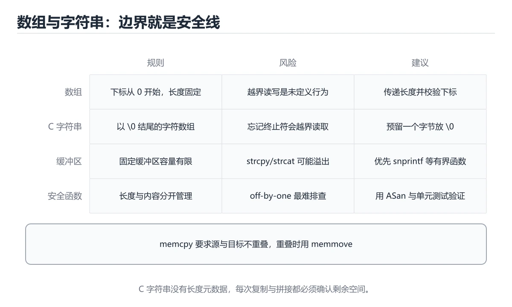
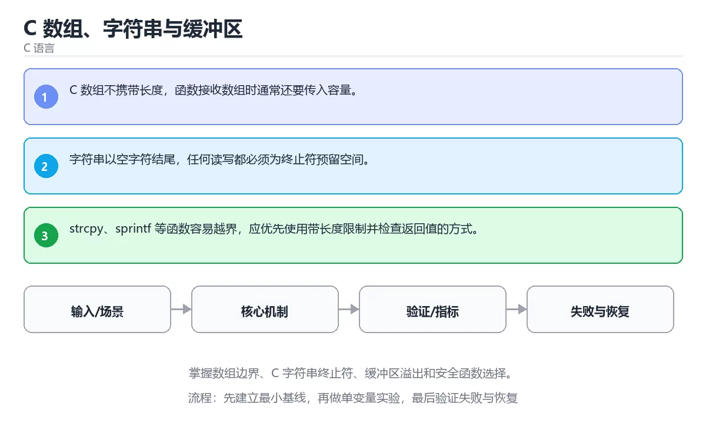

# C 数组、字符串与缓冲区





> 内容更新时间：2026-10-06 · 学习阶段：进阶 · 预计用时：35 分钟

## 学习目标

- 能用自己的话解释：C 数组不携带长度，函数接收数组时通常还要传入容量。
- 能用自己的话解释：字符串以空字符结尾，任何读写都必须为终止符预留空间。
- 能用自己的话解释：strcpy、sprintf 等函数容易越界，应优先使用带长度限制并检查返回值的方式。
- 能把本课知识放回「C 语言」，并完成练习与测验。

## 前置知识

- 具备本分类的前置知识，能跑通「C 数组、字符串与缓冲区」的示例并解释输出。
- 本课关键词：数组、字符串、缓冲区、越界。
- 遇到不熟悉的术语先记录问题，完成练习后再回读。

## 核心知识

### 1. C 数组不携带长度，函数接收数组时通常还要传入容量。

- 关键做法：先用 printf 建立 数组 的基线，再逐步加入边界与失败条件。
- 验证标准：字符串 的异常路径有明确错误信息与恢复动作。

### 2. 字符串以空字符结尾，任何读写都必须为终止符预留空间。

把这条结论放回「C 数组、字符串与缓冲区」的完整流程里展开：

- 正文依据：能用自己的话解释：C 数组不携带长度，函数接收数组时通常还要传入容量。
- 落地检查：把「2. 字符串以空字符结尾，任何读写都必须为终止符预留空间。」改写成一条可执行的核对项，逐条验证输入、超时与失败路径。

### 3. strcpy、sprintf 等函数容易越界，应优先使用带长度限制并检查返回值的方式。

把这条结论放回「C 数组、字符串与缓冲区」的完整流程里展开：

- 正文依据：能用自己的话解释：字符串以空字符结尾，任何读写都必须为终止符预留空间。
- 落地检查：把「3. strcpy、sprintf 等函数容易越界，应优先使用带长度限制并检查返回值的方式。」改写成一条可执行的核对项，逐条验证输入、超时与失败路径。

## 关键流程

```text
输入 → 校验 → 核心处理 → 验证 → 记录指标 → 失败恢复
```

## 实践路径

1. 用一句话复述本课要解决的问题。
2. 跑通正文中的最小示例并记录基线。
3. 只改变一个输入或参数，预测并验证结果。
4. 补一个失败路径，记录错误、恢复和指标。
5. 把结论写成可复现的笔记或测试。

## 常见错误与排查

> 说明：本表由《C 数组、字符串与缓冲区》的核心知识整理（2026-10-07），人工复核进度见 docs/content_review_batches.md。

| 易错点 | 容易踩的做法 | 正确结论 |
| --- | --- | --- |
| 把数组长度当成可用上界 | 越界写入覆盖相邻内存 | 容量与已用长度分开记录，写入前检查剩余空间 |
| 字符串忘记结尾的空字符 | 打印与复制一直读到随机内存 | 为终止符预留一字节，用带长度上限的函数并手动补零 |
| 用等号比较字符串内容 | 实际比较的是两个地址 | 用 strcmp 系列比较内容，并处理返回值的正负含义 |

## 动手练习

1. 合上教程，用 3～5 句话解释C 数组、字符串与缓冲区。
2. 从正文选一个例子，改变一个条件并预测结果。
3. 设计一个失败场景，写出止损与恢复步骤。

**验收标准**：留下输入、命令、输出、差异和下一步问题。

## 本课小结

- 本课围绕 数组、字符串、缓冲区、越界 展开，复习时重点核对它们的输入、输出和失败路径。
- 把还不确定的 printf 行为写成一条可执行验证，再进入下一课。


## 语言专项实践：C 数组、字符串与缓冲区

### 一、工具链

| 阶段 | 推荐工具 | 验收标准 |
| --- | --- | --- |
| 编译 | gcc/clang -Wall -Wextra -Werror | 命令可复现且错误能被定位 |
| 调试 | gdb + core dump | 命令可复现且错误能被定位 |
| 内存检查 | AddressSanitizer / Valgrind | 命令可复现且错误能被定位 |
| 构建发布 | Makefile/CMake + 静态或动态链接 | 命令可复现且错误能被定位 |

### 二、运行时与内存模型

围绕「数组、字符串、缓冲区、越界」说明变量生命周期、资源释放、并发模型和错误传播。语言语法只是入口，真正决定行为的是运行时、标准库和平台约束。

### 三、测试策略

- 单元测试覆盖核心规则和边界。
- 集成测试覆盖文件、网络、数据库或平台 API。
- 失败测试覆盖超时、取消、异常和资源耗尽。
- 性能测试记录基线，避免只凭感觉优化。

### 四、发布检查

- [ ] 版本和依赖锁定，构建可复现。
- [ ] 产物经过签名、校验和最小权限配置。
- [ ] 日志不泄露密钥和个人信息。
- [ ] 有升级、回滚和故障恢复说明。

## 可运行练习

### 任务 1：先跑通，再解释

```c
#include <stdio.h>
#include <string.h>

int main(void) {
    char name[8] = "ada";
    printf("name=%s len=%zu\n", name, strlen(name));
    return 0;
}
```

**预期输出**：name=%s len=%zu\n

### 任务 2：只改一个条件

把「C 数组、字符串与缓冲区」的最小示例复制一份，只改一个条件再跑一次：

- 改动点：把 字符串 换成边界值，其他输入保持原样。
- 预测：先写下「C 数组、字符串与缓冲区」在改动后的输出或错误信息，再运行。
- 记录：对照改动前后的结果，指出差异出在哪一步。
- 验收：换回原条件能复现原结果，改动只影响数组。

### 任务 3：迁移到自己的数据

把 printf 换成你自己的输入，先保持步骤不变，再比较输出差异。

## 故障现场

### 现场 1：把数组长度当成可用上界

**症状**：在《C 数组、字符串与缓冲区》的复现场景中，越界写入覆盖相邻内存。

**根因**：触发点是把“把数组长度当成可用上界”当成安全做法。它没有满足《C 数组、字符串与缓冲区》要求的前提，因此先表现为“越界写入覆盖相邻内存”；排查时先完整复现这一段，再核对输入、配置与依赖。

**修复**：针对《C 数组、字符串与缓冲区》的问题，容量与已用长度分开记录，写入前检查剩余空间。

**验证**：保留《C 数组、字符串与缓冲区》里触发“越界写入覆盖相邻内存”的输入、版本和日志，按“容量与已用长度分开记录，写入前检查剩余空间”完成修改后原样重放；只有失败现象消失且相邻场景仍可解释，才保留改动。

### 现场 2：字符串忘记结尾的空字符

**症状**：在《C 数组、字符串与缓冲区》的复现场景中，打印与复制一直读到随机内存。

**根因**：“打印与复制一直读到随机内存”只是表层结果。向上追溯会落到“字符串忘记结尾的空字符”这一步，因为它省略了《C 数组、字符串与缓冲区》的约束，使实现行为和预期模型发生了偏离。

**修复**：针对《C 数组、字符串与缓冲区》的问题，为终止符预留一字节，用带长度上限的函数并手动补零。

**验证**：先在《C 数组、字符串与缓冲区》中记录“字符串忘记结尾的空字符”留下的失败证据，再执行“为终止符预留一字节，用带长度上限的函数并手动补零”并重放；确认错误路径变为明确结果，且修复没有掩盖同类故障。

### 现场 3：用等号比较字符串内容

**症状**：在《C 数组、字符串与缓冲区》的复现场景中，实际比较的是两个地址。

**根因**：当出现“用等号比较字符串内容”时，执行路径已经绕过了《C 数组、字符串与缓冲区》的关键约束，最终以“实际比较的是两个地址”暴露出来；修复前必须先确认约束在哪里失效。

**修复**：针对《C 数组、字符串与缓冲区》的问题，用 strcmp 系列比较内容，并处理返回值的正负含义。

**验证**：保留《C 数组、字符串与缓冲区》里触发“实际比较的是两个地址”的输入、版本和日志，按“用 strcmp 系列比较内容，并处理返回值的正负含义”完成修改后原样重放；只有失败现象消失且相邻场景仍可解释，才保留改动。

## 版本与时效

- C23 已被主流编译器逐步支持，C17 仍是兼容性最好的基线；数组 的写法要按目标标准选择。
- 编译器对未定义行为、严格别名与对齐的优化越来越激进
- 升级时重点回归位域、可变参数、内联汇编与结构体布局
- 语言参考：https://en.cppreference.com/w/c

### 升级检查清单

- 先固定当前版本，跑通全部示例与测验，再升级工具链。
- 一次只改一个版本条件，把 数组 相关的差异单独记成一条结论。
- 回归范围锁定 printf 的默认行为，并确认弃用警告是否出现在构建输出里。
- 升级完成后记录 数组 的新旧版本差异，并据此调整下次复核时间。

## 本课复习清单


离开本课前，逐项确认：

- [ ] 不看解析，能说出「阅读「C 数组、字符串与缓冲区」中的这段 C 代码，下面哪项判断最准确？」的判断依据。
- [ ] 不看解析，能说出「围绕“C 数组、字符串与缓冲区”中的 数组、字符串、缓冲区，下列哪两项是本课强调的实践判断？」的判断依据。
- [ ] 不看解析，能说出「关于「strcpy、sprintf 等函数容易越界，应优先使用带长度限制并检查返回值的方式。」，下列说法正确的是？」的判断依据。
- [ ] 至少运行一次《C 数组、字符串与缓冲区》的示例，记录输入、输出和一个边界情况。
- [ ] 把本课最容易混淆的两个概念写成一句话对照。

| 复盘项 | 记录 |
| --- | --- |
| 已经能独立解释的考点 |  |
| 仍然说不清的概念 |  |
| 下一步验证动作 |  |

## 复习与自测

逐节自检：能说清 数组 的输入、输出与失败路径才算通过，否则回到原文。

### 核心知识

自检：这一节与相邻主题的边界在哪里？

### 动手练习

自检：如果去掉这一节里的一个前提，结论会怎样变化？

### 语言专项实践：C 数组、字符串与缓冲区

「C 数组、字符串与缓冲区」的「语言专项实践：C 数组、字符串与缓冲区」一节补全如下：

- 定位：这一节说明语言专项实践：C 数组、字符串与缓冲区在「C 数组、字符串与缓冲区」知识体系里的位置。
- 要点：合上教程，用 3～5 句话解释C 数组、字符串与缓冲区。
- 自检：能否用一个最小例子解释语言专项实践：C 数组、字符串与缓冲区？

### 最小可运行示例

```c
#include <stdio.h>
#include <string.h>

int main(void) {
    char name[8] = "ada";
    printf("name=%s len=%zu\n", name, strlen(name));
    return 0;
}
```

自检：把这一节讲给没学过的人，最需要强调哪一点？

### 预期输出

```text
name=ada len=3
```

### 验证步骤

制造一次错误输入，记录错误信息与修复方式。

## 术语速查

| 术语 | 一句话说明 |
| --- | --- |
| `数组` | 参考判断：学习 数组 时要同时说明输入、输出和失败路径，不能只看正常流程、验证 字符串 时要固定版本并覆盖边界输入，结论才可复现。 |
| `缓冲区` | 二、运行时与内存模型：围绕「数组、字符串、缓冲区、越界」说明变量生命周期、资源释放、并发模型和错误传播。 |
| `越界访问` | 下标超出数组范围时读到相邻内存，是 C 里最常见的内存错误来源，编译器通常不会拦。 |
| `字符串终止符` | C 字符串以 \0 结尾，长度靠扫描终止符得到，忘记留这一位就会越界或截断。 |

## 零基础精讲：把C 数组、字符串与缓冲区真正讲透

### 先建立一个直觉

本课的摘要可以当作一张地图：掌握数组边界、C 字符串终止符、缓冲区溢出和安全函数选择。

### 逐步拆解

1. 澄清输入与目标。先写清「C 数组、字符串与缓冲区」要解决的问题、合法输入范围和成功标准，再进入后续步骤。
2. 描述处理过程。把「数组、字符串、缓冲区、越界」映射到具体步骤，每步都要求能单独验证。
3. 定义输出。数组 的输出不仅包括正常结果，还包括错误码、日志和资源释放状态。
4. 把 printf 的输入换成空值、极值或类型不符的形式，记录第一条错误信息、发生位置和修复动作。
5. 选一个只有两三步的数组例子，先写出预期输出，再运行确认；不一致时先怀疑前提而不是代码。

### 把正文串成一条执行链

- **1. C 数组不携带长度，函数接收数组时通常还要传入容量。**：在「C 数组、字符串与缓冲区」里，「1. C 数组不携带长度，函数接收数组时通常还要传入容量。」这一步要先写清输入与预期，再记录实际结果和差异；结果不符时回到对应小节核对前提。
- **2. 字符串以空字符结尾，任何读写都必须为终止符预留空间。**：在「C 数组、字符串与缓冲区」里，「2. 字符串以空字符结尾，任何读写都必须为终止符预留空间。」这一步要先写清输入与预期，再记录实际结果和差异；结果不符时回到对应小节核对前提。
- **3. strcpy、sprintf 等函数容易越界，应优先使用带长度限制并检查返回值的方式。**：在「C 数组、字符串与缓冲区」里，「3. strcpy、sprintf 等函数容易越界，应优先使用带长度限制并检查返回值的方式。」这一步要先写清输入与预期，再记录实际结果和差异；结果不符时回到对应小节核对前提。
- 一、工具链：实现 printf 所需的阶段与验收标准
- **二、运行时与内存模型**：围绕「数组、字符串、缓冲区、越界」说明变量生命周期、资源释放、并发模型和错误传播
- **三、测试策略**：- 单元测试覆盖核心规则和边界

### 从测验反推易错点

- 参考判断：函数返回了局部变量的引用，调用结束后对象已销毁，读取属于未定义行为。
- 自问：如果去掉题干里的一个限定词，结论还成立吗？

**检查点 2：围绕C 数组、字符串与缓冲区中的 数组、字符串、缓冲区，下列哪两项是本课强调的实践判断？**

- 参考判断：学习 数组 时要同时说明输入、输出和失败路径，不能只看正常流程、验证 字符串 时要固定版本并覆盖边界输入，结论才可复现
- 解析：本课把C 数组、字符串与缓冲区拆成概念、示例与故障现场三部分，因此判断 数组 时必须同时交代输入、输出和失败路径，这使“学习 数组 时要同时说明输入、输出和失败路径，不能只看正常流程”成立；在C 数组、字符串与缓冲区里，判断 字符串 时要固定版本与边界输入，所以“验证 字符串 时要固定版本并覆盖边界输入，结论才可复现”才可复现。相反，“只要 数组 的常规示例通过，就可以跳过边界与异常路径”把一次正常示例当成全部情况，会漏掉本课的边界缺陷；“把 字符串 的单次运行结果当成所有版本和规模都成立”把单次结果外推成普遍结论，在C 数组、字符串与缓冲区里忽略了版本和规模变化。对照本课的故障现场与自测清单，就能用证据区分这两种判断。

**检查点 3：关于「strcpy、sprintf 等函数容易越界，应优先使用带长度限制并检查返回值的方式。」，下列说法正确的是？**

- 参考判断：strcpy、sprintf 等函数容易越界，应优先使用带长度限制并检查返回值的方式。

**检查点 4：本课的核心学习目标是什么？**

- 参考判断：掌握数组边界、C 字符串终止符、缓冲区溢出和安全函数选择。

- 参考判断：printf

### 工程排错顺序

| 先查什么 | 要得到的证据 | 判断标准 |
| --- | --- | --- |
| 输入与前提是否满足 | 日志、输入样例、测试或指标 | 能复现并解释，才算定位 |
| 核心步骤是否产生了预期中间结果 | 日志、输入样例、测试或指标 | 能复现并解释，才算定位 |
| 失败路径是否可观测、可恢复 | 日志、输入样例、测试或指标 | 能复现并解释，才算定位 |
| 资源、权限与成本是否在预算内 | 日志、输入样例、测试或指标 | 能复现并解释，才算定位 |

### 变式训练

1. 把 数组 放进一个只有单机、没有额外依赖的小项目，先保证正确再扩展。
2. 扩大 字符串 的规模，记录本课结论在哪一个量级开始不成立。
3. 把 字符串 换成失败输入，记录错误信息与恢复动作。
5. 把 printf 的执行顺序调换一次，记录哪个中间结果先错；顺序敏感的地方就是本课的关键约束。
6. 限制 CPU 与内存上限后重跑 printf，观察哪一项参数需要重新设定。

### 本课自测

- [ ] 能用一句话解释「数组」在本课中的角色与边界。
- [ ] 能举出一个正常例子和一个失败例子。
- [ ] 能说出最小验证步骤，以及需要记录的证据。
- [ ] 能用一句话解释「字符串」在本课中的角色与边界。
- [ ] 能用一句话解释「缓冲区」在本课中的角色与边界。
- [ ] 能用一句话解释「越界」在本课中的角色与边界。

### 迁移案例库

围绕 printf 重复同一套方法，每完成一轮就把差异写进笔记。

#### 迁移案例 1：围绕「数组」做一次小实验

**目标**：在不改变课程主体的前提下，验证C 数组、字符串与缓冲区中的一个关键判断。

**步骤**：
1. 复述当前方案对「数组」的假设，写成一句可证伪的话。
2. 设计一个正常输入和一个边界输入，分别预测输出。
3. 运行或逐步演算，记录实际输出、耗时和失败信息。
4. 只调整一个参数，比较前后差异并解释原因。
5. 补充一条测试或复习卡，确保下次能更快复现。

**验收**：数组的结论要有证据、差异可解释、失败可恢复；做不到时回到「核心知识」缩小问题范围。

#### 迁移案例 2：围绕「字符串」做一次小实验

**步骤**：
1. 复述当前方案对「字符串」的假设，写成一句可证伪的话。

#### 迁移案例 3：围绕「缓冲区」做一次小实验

**步骤**：
1. 复述当前方案对「缓冲区」的假设，写成一句可证伪的话。

#### 迁移案例 4：围绕「越界」做一次小实验

**步骤**：
1. 复述当前方案对「越界」的假设，写成一句可证伪的话。

#### 迁移案例 5：围绕「数组」做一次小实验

**步骤**：

#### 迁移案例 6：围绕「字符串」做一次小实验

**步骤**：

#### 迁移案例 7：围绕「缓冲区」做一次小实验

**步骤**：

#### 迁移案例 8：围绕「越界」做一次小实验

**步骤**：

#### 迁移案例 9：围绕「数组」做一次小实验

**步骤**：

#### 迁移案例 10：围绕「字符串」做一次小实验

**步骤**：

#### 迁移案例 11：围绕「缓冲区」做一次小实验

**步骤**：

#### 迁移案例 12：围绕「越界」做一次小实验

**步骤**：

#### 迁移案例 13：围绕「数组」做一次小实验

**步骤**：

#### 迁移案例 14：围绕「字符串」做一次小实验

**步骤**：

#### 迁移案例 15：围绕「缓冲区」做一次小实验

**步骤**：

#### 迁移案例 16：围绕「越界」做一次小实验

**步骤**：

<!-- p0-depth-v2:end -->

## 考点精讲

### 考点 1：代码补全·数组

- **题目**：阅读「C 数组、字符串与缓冲区」中的这段 C 代码，下面哪项判断最准确？
- **判断依据**：在「C 数组、字符串与缓冲区」里，这段 C 代码来自本课的本地示例，主要用来核对 数组、字符串、缓冲区、越界 之间的输入、处理和输出关系，掌握数组边界、C 字符串终止符、缓冲区溢出和安全函数选择。“字符串与缓冲区中的这段”与「C 数组、字符串与缓冲区」的术语表相呼应，只有符合数组、字符串、缓冲区约束的“掌握数组边界、C 字符串终止符”才是正文支持的结论。

### 考点 2：多选辨析·数组

- **题目**：围绕“C 数组、字符串与缓冲区”中的 数组、字符串、缓冲区，下列哪两项是本课强调的实践判断？
- **判断依据**：本课把C 数组、字符串与缓冲区拆成概念、示例与故障现场三部分，因此判断 数组 时必须同时交代输入、输出和失败路径，这使“学习 数组 时要同时说明输入、输出和失败路径，不能只看正常流程”成立。在C 数组、字符串与缓冲区里，判断 字符串 时要固定版本与边界输入，所以“验证 字符串 时要固定版本并覆盖边界输入，结论才可复现”才可复现。

### 考点 3：概念判断·数组

- **题目**：关于「strcpy、sprintf 等函数容易越界，应优先使用带长度限制并检查返回值的方式。」，下列说法正确的是？
- **判断依据**：在「C 数组、字符串与缓冲区」里，strcpy、sprintf 等函数容易越界，应优先使用带长度限制并检查返回值的方式。在「C 数组、字符串与缓冲区」里，如果只凭关键词作答，很容易把隐式转换会改变符号和宽度，比较和算术前要明确期望类型。把“strcpy”代回「C 数组、字符串与缓冲区」里“strcpy、sprintf 等函数容易越界”的例子核对，条件一旦改变，结论就要用数组、字符串、缓冲区重新推导。

### 考点 4：概念判断·数组

- **题目**：「C 数组、字符串与缓冲区」的核心学习目标是什么？
- **判断依据**：在「C 数组、字符串与缓冲区」里，结论应落在「掌握数组边界、C 字符串终止符、缓冲区溢出和安全函数选择」。在「C 数组、字符串与缓冲区」里，结论应落在掌握数组边界、C 字符串终止符、缓冲区溢出和安全函数选择。在「C 数组、字符串与缓冲区」里，这道题要求区分概念与边界，掌握数组边界、C 字符串终止符、缓冲区溢出和安全函数选择。

### 考点 5：填空·数组

- **题目**：补全代码：「C 数组、字符串与缓冲区」示例中，下面这行代码缺少哪个关键字或函数名？请填入 ____。 `____("name=%s len=%zu\n", name, strlen(name));`
- **判断依据**：在「C 数组、字符串与缓冲区」里，printf。在「C 数组、字符串与缓冲区」里判断这道题，要把数组、字符串、缓冲区的条件、过程与失败路径逐项对齐，换成“补全代码”这个场景，只有满足前提的结论才成立。回到「C 数组、字符串与缓冲区」的正文示例，用“补全代码”走一遍数组、字符串、缓冲区的完整流程，能复现的结论才可以保留。

### 考点 6：顺序排列·数组

- **题目**：按照「C 数组、字符串与缓冲区」从概念到实践的讲解顺序排列下列主题。
- **判断依据**：结合数组、字符串来看，正确的执行顺序是「核心知识 → 关键流程 → 实践路径 → 常见误区」。本课围绕掌握数组边界、C 字符串终止符、缓冲区溢出和安全函数选择。在「C 数组、字符串与缓冲区」里判断这道题，要把数组、字符串、缓冲区的条件、过程与失败路径逐项对齐，换成“按照C 数组、字符串与缓冲区从概念到”这个场景，只有满足前提的结论才成立。

## English Overview

**Title:** C Arrays, Strings and Buffers

**Summary:** Learn array bounds, null terminators, buffer overflow and safe APIs.

**Category:** C
**Level:** 进阶
**Key terms:** 数组, 字符串, 缓冲区, 越界

## 内容元数据

- 内容版本：v2.0
- 最后更新：2026-10-06
- 学习阶段：进阶
- 适用环境：C11 / GCC 或 Clang；本课聚焦 数组。
- 内容来源：内置结构化课程与工程实践整理
- 相关主题：数组、字符串、缓冲区、越界
- 质量版本：P0 测验标准 + P1 覆盖扩展 + P2 体验补全

## 最小可运行示例

下面示例用于验证 数组 的最小输入、处理和输出。先原样运行，再只修改一个值：

```c
#include <stdio.h>
#include <string.h>

int main(void) {
    char name[8] = "ada";
    printf("name=%s len=%zu\n", name, strlen(name));
    return 0;
}
```

## 预期输出

```text
name=ada len=3
```

## 验证步骤

1. 记录运行环境、命令和真实输出。
2. 修改一个输入，先写预测再运行。
4. 把结论写回本课笔记或测试用例。

## 参考资料与复核

- 最后复核：2026-10-04
- 下次复核：2026-11-17
- 复核范围：版本兼容、API 行为、安全建议与工程实践
- 来源性质：官方文档、标准或权威教材；正文为离线教学重组

| 参考资料 | 本课用途 |
| --- | --- |
| [cppreference C 标准库](https://en.cppreference.com/w/c) | C 标准库 API |
| [cppreference C 语言](https://en.cppreference.com/w/c/language) | C 语言规则与语义 |
| [GNU C Library](https://www.gnu.org/software/libc/manual/) | POSIX 与 GNU C 接口 |

> 「C 数组、字符串与缓冲区」的链接用于离线阅读后的延伸核对；App 不会自动联网。

## 复习与迁移

复习目标：把「C 数组、字符串与缓冲区」的判断标准放回可复现的例子里。先自己作答，再对照依据；如果结论正确但理由不完整，回到正文补足前提。

### 概念复述

- 用一句话说明「C 数组、字符串与缓冲区」解决什么问题：掌握数组边界、C 字符串终止符、缓冲区溢出和安全函数选择。
- 写出数组、字符串、缓冲区之间的关系，并各举一个例子。
- 说出本课最容易混淆的两个概念，以及区分它们的判据。

### 正文逐节复核

- **语言专项实践：C 数组、字符串与缓冲区**：围绕「数组、字符串、缓冲区、越界」说明变量生命周期、资源释放、并发模型和错误传播。
- **零基础精讲：把C 数组、字符串与缓冲区真正讲透**：本课的摘要可以当作一张地图：掌握数组边界、C 字符串终止符、缓冲区溢出和安全函数选择。

### 测验回顾

1. 阅读「C 数组、字符串与缓冲区」中的这段 C 代码，下面哪项判断最准确？
   - 依据：在「C 数组、字符串与缓冲区」里，这段 C 代码来自本课的本地示例，主要用来核对 数组、字符串、缓冲区、越界 之间的输入、处理和输出关系，掌握数组边界、C 字符串终止符、缓冲区溢出和安全函数选择。“字符串与缓冲区中的这段”与「C 数组、字符串与缓冲区」的术语表相呼应，只有符合数组、字符串、缓冲区约束的“掌握数组边界、C 字符串终止符”才是正文支持的结论。
2. 围绕“C 数组、字符串与缓冲区”中的 数组、字符串、缓冲区，下列哪两项是本课强调的实践判断？
   - 依据：本课把C 数组、字符串与缓冲区拆成概念、示例与故障现场三部分，因此判断 数组 时必须同时交代输入、输出和失败路径，这使“学习 数组 时要同时说明输入、输出和失败路径，不能只看正常流程”成立。在C 数组、字符串与缓冲区里，判断 字符串 时要固定版本与边界输入，所以“验证 字符串 时要固定版本并覆盖边界输入，结论才可复现”才可复现。
3. 关于「strcpy、sprintf 等函数容易越界，应优先使用带长度限制并检查返回值的方式。」，下列说法正确的是？
   - 依据：在「C 数组、字符串与缓冲区」里，strcpy、sprintf 等函数容易越界，应优先使用带长度限制并检查返回值的方式。在「C 数组、字符串与缓冲区」里，如果只凭关键词作答，很容易把隐式转换会改变符号和宽度，比较和算术前要明确期望类型。把“strcpy”代回「C 数组、字符串与缓冲区」里“strcpy、sprintf 等函数容易越界”的例子核对，条件一旦改变，结论就要用数组、字符串、缓冲区重新推导。
4. 「C 数组、字符串与缓冲区」的核心学习目标是什么？
   - 依据：在「C 数组、字符串与缓冲区」里，结论应落在「掌握数组边界、C 字符串终止符、缓冲区溢出和安全函数选择」。在「C 数组、字符串与缓冲区」里，结论应落在掌握数组边界、C 字符串终止符、缓冲区溢出和安全函数选择。在「C 数组、字符串与缓冲区」里，这道题要求区分概念与边界，掌握数组边界、C 字符串终止符、缓冲区溢出和安全函数选择。
5. 补全代码：「C 数组、字符串与缓冲区」示例中，下面这行代码缺少哪个关键字或函数名？请填入 ____。

`____("name=%s len=%zu\n", name, strlen(name));`
   - 依据：在「C 数组、字符串与缓冲区」里，printf。在「C 数组、字符串与缓冲区」里判断这道题，要把数组、字符串、缓冲区的条件、过程与失败路径逐项对齐，换成“补全代码”这个场景，只有满足前提的结论才成立。回到「C 数组、字符串与缓冲区」的正文示例，用“补全代码”走一遍数组、字符串、缓冲区的完整流程，能复现的结论才可以保留。
1. 按照「C 数组、字符串与缓冲区」从概念到实践的讲解顺序排列下列主题。
   - 依据：结合数组、字符串来看，正确的执行顺序是「核心知识 → 关键流程 → 实践路径 → 常见误区」。本课围绕掌握数组边界、C 字符串终止符、缓冲区溢出和安全函数选择。在「C 数组、字符串与缓冲区」里判断这道题，要把数组、字符串、缓冲区的条件、过程与失败路径逐项对齐，换成“按照C 数组、字符串与缓冲区从概念到”这个场景，只有满足前提的结论才成立。

### 迁移练习

把「C 数组、字符串与缓冲区」的结论迁移到相邻主题，每次迁移都写清预测与证据：

1. 换输入：用数组处理一组你自己的数据，对比教材示例的结果差异。
2. 换失败条件：制造一个字符串相关的错误，说明如何从错误信息定位根因。
3. 换规模：把数据量或并发度提高一个数量级，说明「C 数组、字符串与缓冲区」的结论是否仍成立。
