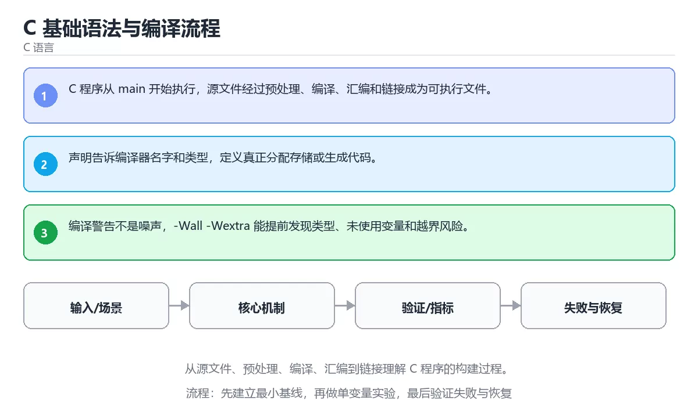

# C 基础语法与编译流程



> 内容更新时间：2026-10-03 · 学习阶段：基础 · 预计用时：20 分钟

## 学习目标

- 能用自己的话解释：C 程序从 main 开始执行，源文件经过预处理、编译、汇编和链接成为可执行文件。
- 能用自己的话解释：声明告诉编译器名字和类型，定义真正分配存储或生成代码。
- 能用自己的话解释：编译警告不是噪声，-Wall -Wextra 能提前发现类型、未使用变量和越界风险。
- 能把本课知识放回「C 语言」，并完成练习与测验。

## 前置知识

- 已完成「C 语言」的基础课程，能运行正文中的最小示例。
- 本课关键词：C、编译、链接、main。
- 遇到不熟悉的术语先记录问题，完成练习后再回读。

## 核心知识

### 1. C 程序从 main 开始执行，源文件经过预处理、编译、汇编和链接成为可执行文件。

- 它解决的问题：把「C 程序从 main 开始执行，源文件经过预处理、编译、汇编和链接成为可执行文件。」放回真实场景，说明不做它会带来什么后果。
- 关键做法：先用最小示例建立基线，再逐步加入边界、失败和性能条件。
- 验证标准：结果可复现、错误可解释、边界有测试、失败能恢复。

### 2. 声明告诉编译器名字和类型，定义真正分配存储或生成代码。

- 它解决的问题：把「声明告诉编译器名字和类型，定义真正分配存储或生成代码。」放回真实场景，说明不做它会带来什么后果。
- 关键做法：先用最小示例建立基线，再逐步加入边界、失败和性能条件。
- 验证标准：结果可复现、错误可解释、边界有测试、失败能恢复。

### 3. 编译警告不是噪声，-Wall -Wextra 能提前发现类型、未使用变量和越界风险。

- 它解决的问题：把「编译警告不是噪声，-Wall -Wextra 能提前发现类型、未使用变量和越界风险。」放回真实场景，说明不做它会带来什么后果。
- 关键做法：先用最小示例建立基线，再逐步加入边界、失败和性能条件。
- 验证标准：结果可复现、错误可解释、边界有测试、失败能恢复。

## 关键流程

```text
输入 → 校验 → 核心处理 → 验证 → 记录指标 → 失败恢复
```

## 实践路径

1. 用一句话复述本课要解决的问题。
2. 跑通正文中的最小示例并记录基线。
3. 只改变一个输入或参数，预测并验证结果。
4. 补一个失败路径，记录错误、恢复和指标。
5. 把结论写成可复现的笔记或测试。

## 常见误区

| 误区 | 后果 | 修正 |
| --- | --- | --- |
| 只记术语不做实验 | 遇到真实问题无法判断 | 用最小输入跑通并记录结果 |
| 只测正常路径 | 边界和故障上线才暴露 | 补空值、极值和依赖失败 |
| 没有基线就优化 | 无法证明改进有效 | 先测量再修改 |
| 忽略成本与安全 | 性能和风险失控 | 同时记录资源、权限与失败代价 |

## 动手练习

1. 合上教程，用 3～5 句话解释「C 基础语法与编译流程」。
2. 从正文选一个例子，改变一个条件并预测结果。
3. 设计一个失败场景，写出止损与恢复步骤。

**验收标准**：留下输入、命令、输出、差异和下一步问题。

## 本课小结

- 本课属于「C 语言」，核心关键词是 C、编译、链接、main。
- 先保证正确与可复现，再讨论性能和扩展。
- 完成练习和测验后，把仍然不确定的问题写成下一轮验证清单。

> 本课由 P1 内容扩展生成，重点补充原有课程缺失的主题与工程边界。

<!-- domain-supplement:v1 -->

## 语言专项实践：C 基础语法与编译流程

### 一、工具链

| 阶段 | 推荐工具 | 验收标准 |
| --- | --- | --- |
| 编译 | gcc/clang -Wall -Wextra -Werror | 命令可复现且错误能被定位 |
| 调试 | gdb + core dump | 命令可复现且错误能被定位 |
| 内存检查 | AddressSanitizer / Valgrind | 命令可复现且错误能被定位 |
| 构建发布 | Makefile/CMake + 静态或动态链接 | 命令可复现且错误能被定位 |

### 二、运行时与内存模型

围绕「C、编译、链接、main」说明变量生命周期、资源释放、并发模型和错误传播。语言语法只是入口，真正决定行为的是运行时、标准库和平台约束。

### 三、测试策略

- 单元测试覆盖核心规则和边界。
- 集成测试覆盖文件、网络、数据库或平台 API。
- 失败测试覆盖超时、取消、异常和资源耗尽。
- 性能测试记录基线，避免只凭感觉优化。

### 四、发布检查

- [ ] 版本和依赖锁定，构建可复现。
- [ ] 产物经过签名、校验和最小权限配置。
- [ ] 日志不泄露密钥和个人信息。
- [ ] 有升级、回滚和故障恢复说明。

<!-- p2-enrichment:v1 -->

## English Overview

**Title:** C Basics and Compilation

**Summary:** Understand preprocessing, compiling, assembling and linking C programs.

**Category:** C  
**Level:** 基础  
**Key terms:** C, 编译, 链接, main

> The full tutorial is written in Chinese. This bilingual overview helps English readers identify the topic, scope and key terms before studying the detailed examples.

## 内容元数据

- 内容版本：v2.0
- 最后更新：2026-10-03
- 学习阶段：基础
- 适用环境：C11 / GCC 或 Clang
- 内容来源：内置结构化课程与工程实践整理
- 相关主题：C、编译、链接、main
- 质量版本：P0 测验标准 + P1 覆盖扩展 + P2 体验补全

<!-- minimal-code:v1 -->

## 最小可运行示例

下面示例用于验证「C 基础语法与编译流程」的最小输入、处理和输出。先原样运行，再只修改一个值：

```python
print(bin(10), hex(255), 0b1010)
```

## 预期输出

```text
0b1010 0xff 10
```

## 验证步骤

1. 记录运行环境、命令和真实输出。
2. 修改一个输入，先写预测再运行。
3. 制造一次错误输入，记录错误信息与修复方式。
4. 把结论写回本课笔记或测试用例。

<!-- top50-rewrite:v1 -->

## 课程专属精读：C 基础语法与编译流程

### 一、知识地图

- **1. C 程序从 main 开始执行，源文件经过预处理、编译、汇编和链接成为可执行文件。**：理解它的定义、输入、输出和失败边界。
- **2. 声明告诉编译器名字和类型，定义真正分配存储或生成代码。**：理解它的定义、输入、输出和失败边界。
- **3. 编译警告不是噪声，-Wall -Wextra 能提前发现类型、未使用变量和越界风险。**：理解它的定义、输入、输出和失败边界。

### 二、机制与验证

| 主题 | 需要回答的问题 | 验证方式 |
| --- | --- | --- |
| 1. C 程序从 main 开始执行，源文件经过预处理、编译、汇编和链接成为可执行文件。 | 它解决什么问题，输入和输出是什么？ | 最小示例、边界输入、日志或指标 |
| 2. 声明告诉编译器名字和类型，定义真正分配存储或生成代码。 | 它解决什么问题，输入和输出是什么？ | 最小示例、边界输入、日志或指标 |
| 3. 编译警告不是噪声，-Wall -Wextra 能提前发现类型、未使用变量和越界风险。 | 它解决什么问题，输入和输出是什么？ | 最小示例、边界输入、日志或指标 |

### 三、专属检查问题

1. 1. C 程序从 main 开始执行，源文件经过预处理、编译、汇编和链接成为可执行文件。 与相邻主题的边界是什么？
2. 2. 声明告诉编译器名字和类型，定义真正分配存储或生成代码。 与相邻主题的边界是什么？
3. 3. 编译警告不是噪声，-Wall -Wextra 能提前发现类型、未使用变量和越界风险。 与相邻主题的边界是什么？

### 四、故障排查

1. 固定输入和环境，确认问题能复现。
2. 找到第一个异常状态，不从最终错误倒猜。
3. 只改变一个变量，记录预测和真实结果。
4. 修复后补边界、失败和重复执行测试。

## 专属复习题库

**问：1. C 程序从 main 开始执行，源文件经过预处理、编译、汇编和链接成为可执行文件。 的关键点是什么？**

答：理解它的定义、输入、输出和失败边界。 复习时要能用自己的话复述，并给出一个失败场景。

**问：2. 声明告诉编译器名字和类型，定义真正分配存储或生成代码。 的关键点是什么？**

答：理解它的定义、输入、输出和失败边界。 复习时要能用自己的话复述，并给出一个失败场景。

**问：3. 编译警告不是噪声，-Wall -Wextra 能提前发现类型、未使用变量和越界风险。 的关键点是什么？**

答：理解它的定义、输入、输出和失败边界。 复习时要能用自己的话复述，并给出一个失败场景。

## 专属进阶任务 2：C 基础语法与编译流程

- 围绕「1. C 程序从 main 开始执行，源文件经过预处理、编译、汇编和链接成为可执行文件。」完成一个可复现实验，记录输入、输出、指标和失败恢复。
- 围绕「2. 声明告诉编译器名字和类型，定义真正分配存储或生成代码。」完成一个可复现实验，记录输入、输出、指标和失败恢复。
- 围绕「3. 编译警告不是噪声，-Wall -Wextra 能提前发现类型、未使用变量和越界风险。」完成一个可复现实验，记录输入、输出、指标和失败恢复。

### 验收标准

- [ ] 能复现正文中的最小示例。
- [ ] 能解释该主题的正常、边界和失败路径。
- [ ] 能用测试、日志或指标证明结果。
- [ ] 能把结论放回「c_basics」所属的学习路径。

## 专属进阶任务 3：C 基础语法与编译流程

- 围绕「1. C 程序从 main 开始执行，源文件经过预处理、编译、汇编和链接成为可执行文件。」完成一个可复现实验，记录输入、输出、指标和失败恢复。
- 围绕「2. 声明告诉编译器名字和类型，定义真正分配存储或生成代码。」完成一个可复现实验，记录输入、输出、指标和失败恢复。
- 围绕「3. 编译警告不是噪声，-Wall -Wextra 能提前发现类型、未使用变量和越界风险。」完成一个可复现实验，记录输入、输出、指标和失败恢复。

### 验收标准

- [ ] 能复现正文中的最小示例。
- [ ] 能解释该主题的正常、边界和失败路径。
- [ ] 能用测试、日志或指标证明结果。
- [ ] 能把结论放回「c_basics」所属的学习路径。

## 专属进阶任务 4：C 基础语法与编译流程

- 围绕「1. C 程序从 main 开始执行，源文件经过预处理、编译、汇编和链接成为可执行文件。」完成一个可复现实验，记录输入、输出、指标和失败恢复。
- 围绕「2. 声明告诉编译器名字和类型，定义真正分配存储或生成代码。」完成一个可复现实验，记录输入、输出、指标和失败恢复。
- 围绕「3. 编译警告不是噪声，-Wall -Wextra 能提前发现类型、未使用变量和越界风险。」完成一个可复现实验，记录输入、输出、指标和失败恢复。

### 验收标准

- [ ] 能复现正文中的最小示例。
- [ ] 能解释该主题的正常、边界和失败路径。
- [ ] 能用测试、日志或指标证明结果。
- [ ] 能把结论放回「c_basics」所属的学习路径。

## 专属进阶任务 5：C 基础语法与编译流程

- 围绕「1. C 程序从 main 开始执行，源文件经过预处理、编译、汇编和链接成为可执行文件。」完成一个可复现实验，记录输入、输出、指标和失败恢复。
- 围绕「2. 声明告诉编译器名字和类型，定义真正分配存储或生成代码。」完成一个可复现实验，记录输入、输出、指标和失败恢复。
- 围绕「3. 编译警告不是噪声，-Wall -Wextra 能提前发现类型、未使用变量和越界风险。」完成一个可复现实验，记录输入、输出、指标和失败恢复。

### 验收标准

- [ ] 能复现正文中的最小示例。
- [ ] 能解释该主题的正常、边界和失败路径。
- [ ] 能用测试、日志或指标证明结果。
- [ ] 能把结论放回「c_basics」所属的学习路径。

## 专属进阶任务 6：C 基础语法与编译流程

- 围绕「1. C 程序从 main 开始执行，源文件经过预处理、编译、汇编和链接成为可执行文件。」完成一个可复现实验，记录输入、输出、指标和失败恢复。
- 围绕「2. 声明告诉编译器名字和类型，定义真正分配存储或生成代码。」完成一个可复现实验，记录输入、输出、指标和失败恢复。
- 围绕「3. 编译警告不是噪声，-Wall -Wextra 能提前发现类型、未使用变量和越界风险。」完成一个可复现实验，记录输入、输出、指标和失败恢复。

### 验收标准

- [ ] 能复现正文中的最小示例。
- [ ] 能解释该主题的正常、边界和失败路径。
- [ ] 能用测试、日志或指标证明结果。
- [ ] 能把结论放回「c_basics」所属的学习路径。

## 专属进阶任务 7：C 基础语法与编译流程

- 围绕「1. C 程序从 main 开始执行，源文件经过预处理、编译、汇编和链接成为可执行文件。」完成一个可复现实验，记录输入、输出、指标和失败恢复。
- 围绕「2. 声明告诉编译器名字和类型，定义真正分配存储或生成代码。」完成一个可复现实验，记录输入、输出、指标和失败恢复。
- 围绕「3. 编译警告不是噪声，-Wall -Wextra 能提前发现类型、未使用变量和越界风险。」完成一个可复现实验，记录输入、输出、指标和失败恢复。

### 验收标准

- [ ] 能复现正文中的最小示例。
- [ ] 能解释该主题的正常、边界和失败路径。
- [ ] 能用测试、日志或指标证明结果。
- [ ] 能把结论放回「c_basics」所属的学习路径。

<!-- full-english-guide:v1 -->

## Full English Study Guide

### Overview

**C Basics and Compilation** focuses on Understand preprocessing, compiling, assembling and linking C programs.

### Learning Outcomes

- Explain what **C Basics and Compilation** solves and when it should be used.
- Identify inputs, outputs, state and failure boundaries.
- Build a minimal reproducible example and observe the real result.
- Test normal, boundary and failure paths.
- Measure performance, resource cost or security impact before optimizing.
- Document the decision, rollback path and remaining uncertainty.

### Core Mental Model

1. **Problem first:** define the exact problem before choosing a tool or pattern.
2. **Smallest example:** reduce the system to one input and one observable output.
3. **State and flow:** trace how data, control or responsibility moves through the system.
4. **Boundaries:** identify invalid input, resource limits, timeouts and permission edges.
5. **Evidence:** use tests, logs, metrics or reproductions instead of intuition.
6. **Trade-offs:** compare correctness, latency, cost, complexity and operability.

### Step-by-step Study Plan

1. Read the Chinese lesson once and write down the main problem in one sentence.
2. Run the smallest example and save the exact command and output.
3. Change only one input or parameter and predict the result before running it.
4. Introduce one failure and record how the system detects, reports and recovers.
5. Write one test or checklist item for the normal, boundary and failure paths.
6. Complete the quiz and explain every wrong answer in your own words.

### Practice Tasks

- Rebuild the minimal example from an empty directory.
- Add one boundary test and one failure test.
- Produce a short report containing the baseline, change, result and rollback.

### Common Failure Modes

- Treating a happy-path demo as production readiness.
- Skipping boundary values and invalid inputs.
- Optimizing before establishing a measurable baseline.
- Hiding errors, permissions or resource limits.

### Self-check Questions

1. What is the smallest observable result that proves this lesson works?
2. What input or state is most likely to break it?
3. Which metric or test would reveal a regression?
4. What is the rollback path?
5. What is the cost of using this approach at 10x scale?
6. Which adjacent topic is most often confused with this one?

### Glossary

- Topic: **C Basics and Compilation**
- Related terms: C, 编译, 链接, main
- Primary evidence: command output, tests, logs, metrics or reproductions

> This guide is an English study companion for the detailed Chinese lesson. It covers the learning path, mental model and acceptance questions; code examples and engineering details remain in the main tutorial.

<!-- bilingual-outline:v1 -->

## Bilingual Section Outline

| 中文小节 | English section |
| --- | --- |
| 学习目标 | Learning objectives |
| 前置知识 | Prerequisites |
| 核心知识 | Core concepts |
| 关键流程 | 关键流程 |
| 实践路径 | 实践路径 |
| 常见误区 | 常见误区 |
| 动手练习 | Hands-on practice |
| 本课小结 | Summary |
| 语言专项实践：C 基础语法与编译流程 | 语言专项实践：C 基础语法与编译流程 |
| 最小可运行示例 | 最小可运行示例 |

> 该大纲把每个中文小节映射为英文标题，配合 Full English Study Guide 使用。

<!-- p2-references:v1 -->

## 参考资料与复核

- 最后复核：2026-10-04
- 下次复核：2027-04-04
- 复核范围：版本兼容、API 行为、安全建议与工程实践
- 来源性质：官方文档与标准；本课正文为离线教学重组，不复制原文

| 参考资料 | 本课用途 |
| --- | --- |
| [C 标准库参考](https://en.cppreference.com/w/c) | C 语言与标准库 |
| [GNU C Manual](https://www.gnu.org/software/libc/manual/) | POSIX 与系统接口 |

> 本课主题：从源文件、预处理、编译、汇编到链接理解 C 程序的构建过程。

> App 完全离线展示文字链接，不会自动联网；需要延伸阅读时可复制链接到浏览器。

