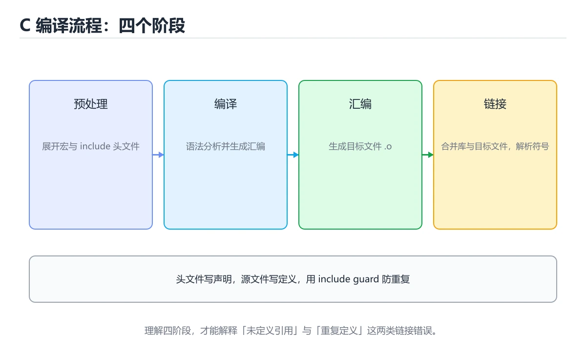

# C 基础语法与编译流程




> 内容更新时间：2026-10-06 · 学习阶段：基础 · 预计用时：50 分钟

## 本节知识框架

**课程定位**：所属分类为「C 语言」，课程主题为「C 基础语法与编译流程」，学习阶段为「基础」，建议用时 50 分钟。

**本课要解决的主问题**：从源文件、预处理、编译、汇编到链接理解 C 程序的构建过程。

| 学习层次 | 要回答的问题 | 完成判据 |
| --- | --- | --- |
| 概念层 | 「C 基础语法与编译流程」有哪些必须区分的对象与术语？ | 能用自己的话定义核心术语，并各举一个正例和一个反例。 |
| 机制层 | 这些对象按什么顺序发生作用，输入如何变成输出？ | 能画出或写出机制步骤，并说明每一步的失败条件。 |
| 应用层 | 什么场景适合使用「C 基础语法与编译流程」，什么场景不适合？ | 能给出一个真实场景、一个最小示例和一个边界案例。 |
| 性能层 | 时间、空间、吞吐或延迟受哪些量影响？ | 能说出复杂度或性能瓶颈的证据来源；没有证据时明确写“材料未提供”。 |
| 复习层 | 怎样确认自己不是只记住了结论？ | 能独立完成本课自测，并把错误定位到概念、机制、示例或边界。 |

### 阅读路线

1. 先读「核心概念定义」，建立「C」等对象的精确定义。
2. 再读「原理与运行机制」，把定义串成可重复的过程。
3. 用「代码/协议/SQL 示例」验证过程，并只改一个条件观察结果变化。
4. 最后检查性能、易错点、知识关系与自测题，形成可复习的证据链。

**前置知识**：没有硬性先修课；仍建议先具备本分类的基础阅读与操作能力。

**学习位置**：本课位于《C 函数入门》之后；如果前一课的自测不能通过，应先回补再继续。

**后续衔接**：下一课《C 类型、运算符与转换》会继续使用本课术语，学完后建议立即完成一次自测。

**教材衔接：学习目标**

- 能用自己的话解释：C 程序从 main 开始执行，源文件经过预处理、编译、汇编和链接成为可执行文件。
- 能用自己的话解释：声明告诉编译器名字和类型，定义真正分配存储或生成代码。
- 能用自己的话解释：编译警告不是噪声，-Wall -Wextra 能提前发现类型、未使用变量和越界风险。
- 能把本课知识放回「C 语言」，并完成练习与测验。

**教材衔接：前置知识**

- 已完成本分类的基础课程，能独立运行 C 的最小示例。
- 本课关键词：C、编译、链接、main。
- 遇到不熟悉的术语先记录问题，完成练习后再回读。

**教材衔接：本课小结**

- 本课围绕 C、编译、链接、main 展开，复习时重点核对它们的输入、输出和失败路径。
- 完成练习和测验后，把 C 上仍然不确定的问题写成下一轮验证清单。

## 核心概念定义

> 阅读约定：本课先给「C 基础语法与编译流程」相关术语的操作性定义与适用边界；正文里的口语化说法与定义冲突时，以定义和可复现示例为准。

| 术语 | 操作性定义 | 本课中的边界 |
| --- | --- | --- |
| C | 一种接近硬件、强调手动内存管理和可移植性的编译型语言。 | 仅在「C 基础语法与编译流程」明确给出的输入、版本与资源条件下成立。 |
| 编译 | 把源代码转换成目标机器代码或中间表示，并在此过程中检查语法和类型。 | 仅在「C 基础语法与编译流程」明确给出的输入、版本与资源条件下成立。 |
| 链接 | 「C、编译、链接、main」说明变量生命周期、资源释放、并发模型和错误传播。 | 仅在「C 基础语法与编译流程」明确给出的输入、版本与资源条件下成立。 |
| main | 「C 程序从 main 开始执行，源文件经过预处理、编译、汇编和链接成为可执行文件。 | 仅在「C 基础语法与编译流程」明确给出的输入、版本与资源条件下成立。 |

### 定义如何使用

在「C 基础语法与编译流程」中判断一个说法是否成立，先确认它使用的是哪个对象的定义，再检查输入规模、运行环境与失败路径。定义不是口号，而是后续推导、代码示例和自测题共享的约束。

## 原理与运行机制

### 机制总览

1. **建立输入**：把「C」按本课定义整理成可观察、可重复的输入条件。
2. **执行转换**：围绕「编译」执行本课的核心步骤；每一步都记录中间状态，避免只看最终输出。
3. **产生输出**：得到「链接」后，用正文示例或协议/SQL 结果核对输出是否符合预期。
4. **改变一个条件**：只替换一个边界条件或环境参数，观察「C 基础语法与编译流程」的结论是否仍然成立。

| 阶段 | 关注对象 | 失败时应检查 |
| --- | --- | --- |
| 输入 | C | 类型、范围、编码、版本或前置状态是否满足定义。 |
| 处理 | 编译 | 顺序、可见性、锁、路由、事务或调度规则是否被破坏。 |
| 输出 | 链接 | 结果是否可复现，错误是否被正确传播而不是被吞掉。 |

本课的机制结论要用「C 基础语法与编译流程」自己的示例验证。「C 基础语法与编译流程」没有给出某个数量级、吞吐或内存数据时，本课把该判断标为“材料未提供”，不从相邻主题外推。

**教材衔接：核心知识**

### 1. C 程序从 main 开始执行，源文件经过预处理、编译、汇编和链接成为可执行文件。

- 关键做法：先让 C 的最小示例可复现，再加入并发或规模条件。
- 验证标准：编译 的异常路径有明确错误信息与恢复动作。

### 2. 声明告诉编译器名字和类型，定义真正分配存储或生成代码。

把这条结论放回「C 基础语法与编译流程」的完整流程里展开：

- 正文依据：能用自己的话解释：C 程序从 main 开始执行，源文件经过预处理、编译、汇编和链接成为可执行文件。
- 落地检查：把「2. 声明告诉编译器名字和类型，定义真正分配存储或生成代码。」改写成一条可执行的核对项，逐条验证输入、超时与失败路径。

### 3. 编译警告不是噪声，-Wall -Wextra 能提前发现类型、未使用变量和越界风险。

把这条结论放回「C 基础语法与编译流程」的完整流程里展开：

- 正文依据：能用自己的话解释：声明告诉编译器名字和类型，定义真正分配存储或生成代码。
- 落地检查：把「3. 编译警告不是噪声，-Wall -Wextra 能提前发现类型、未使用变量和越界风险。」改写成一条可执行的核对项，逐条验证输入、超时与失败路径。

**教材衔接：关键流程**

```text
输入 → 校验 → 核心处理 → 验证 → 记录指标 → 失败恢复
```

**教材衔接：实践路径**

1. 用一句话复述本课要解决的问题。
2. 跑通正文中的最小示例并记录基线。
3. 只改变一个输入或参数，预测并验证结果。
4. 补一个失败路径，记录错误、恢复和指标。
5. 把结论写成可复现的笔记或测试。

**教材衔接：版本与时效**

- C23 已被主流编译器逐步支持，C17 仍是兼容性最好的基线；C 的写法要按目标标准选择。
- 编译器对未定义行为、严格别名与对齐的优化越来越激进
- 升级时重点回归位域、可变参数、内联汇编与结构体布局
- 语言参考：https://en.cppreference.com/w/c

### 升级检查清单

- 先固定当前版本，跑通全部示例与测验，再升级工具链。
- 只改 C 的版本变量，记录编译、测试与产物体积的变化。
- 回归范围锁定 squared 的默认行为，并确认弃用警告是否出现在构建输出里。
- 升级完成后记录 C 的新旧版本差异，并据此调整下次复核时间。

**教材衔接：验证步骤**

1. 记录运行环境、命令和真实输出。
2. 修改一个输入，先写预测再运行。
3. 制造一次错误输入，记录错误信息与修复方式。
4. 把结论写回本课笔记或测试用例。

## 典型应用场景

| 场景 | 典型输入或前提 | 期望产物 |
| --- | --- | --- |
| 学习验证 | 使用本课最小示例和 C、编译 | 能复现正文结论，并解释每一步。 |
| 工程落地 | 把「C 基础语法与编译流程」放入真实模块或服务边界 | 输出可观测、失败可定位、参数可配置。 |
| 故障排查 | 只改一个版本、规模、输入或依赖条件 | 能区分概念错误、实现错误和环境差异。 |

判断「C 基础语法与编译流程」的场景是否成立，标准是能否写出输入、处理、输出和失败路径；材料中没有出现的数据在本课标注为“材料未提供”，不用推测替代证据。

**课程内置实验入口**：`sandbox:cpp`，用于动手验证《C 基础语法与编译流程》的机制；实验结论不替代概念定义与复杂度分析。

## 代码/协议/SQL 示例

### 最小可验证示例

下面保留《C 基础语法与编译流程》原文中的最小示例。先预测《C 基础语法与编译流程》示例的输出，再按正文步骤运行或推演；示例依赖外部环境时，同时记录版本与输入。

```text
输入 → 校验 → 核心处理 → 验证 → 记录指标 → 失败恢复
```

**教材衔接：语言专项实践：C 基础语法与编译流程**

### 一、工具链

| 阶段 | 推荐工具 | 验收标准 |
| --- | --- | --- |
| 编译 | gcc/clang -Wall -Wextra -Werror | 命令可复现且错误能被定位 |
| 调试 | gdb + core dump | 命令可复现且错误能被定位 |
| 内存检查 | AddressSanitizer / Valgrind | 命令可复现且错误能被定位 |
| 构建发布 | Makefile/CMake + 静态或动态链接 | 命令可复现且错误能被定位 |

### 二、运行时与内存模型

围绕「C、编译、链接、main」说明变量生命周期、资源释放、并发模型和错误传播。语言语法只是入口，真正决定行为的是运行时、标准库和平台约束。

### 三、测试策略

- 单元测试覆盖核心规则和边界。
- 集成测试覆盖文件、网络、数据库或平台 API。
- 失败测试覆盖超时、取消、异常和资源耗尽。
- 性能测试记录基线，避免只凭感觉优化。

### 四、发布检查

- [ ] 版本和依赖锁定，构建可复现。
- [ ] 产物经过签名、校验和最小权限配置。
- [ ] 日志不泄露密钥和个人信息。
- [ ] 有升级、回滚和故障恢复说明。

**教材衔接：最小可运行示例**

下面示例用于验证 C 的最小输入、处理和输出。先原样运行，再只修改一个值：

```c
#include <stdio.h>

int main(void) {
    int value = 7;
    printf("%d squared is %d\n", value, value * value);
    return 0;
}
```

**教材衔接：预期输出**

```text
7 squared is 49
```

## 时间/空间复杂度或性能分析

**复杂度证据**：「C 基础语法与编译流程」的现有材料没有给出渐近时间或空间复杂度的明确结论，本课只做定性检查，不补写未经验证的 $O$ 记号。

| 维度 | 本课关注点 | 判断依据 |
| --- | --- | --- |
| 时间/延迟 | 「C 基础语法与编译流程」的主要步骤是否会随输入规模、并发度或网络往返增长。 | 以正文复杂度、基准数据或可重复测量为准。 |
| 空间/内存 | 中间状态、缓存、副本、连接或索引是否随规模增长。 | 记录峰值内存与数据副本，不只看最终结果。 |
| 吞吐/资源 | 版本、调度、锁、IO、序列化或协议开销是否成为瓶颈。 | 固定环境做对照实验，改变一个变量。 |

评估「C 基础语法与编译流程」时要区分“正确性成立”和“性能达标”两件事；材料没有给出基准时，本课只保留量级来源与测量方法，不写不可验证的绝对数字。

## 常见误区与易错点

> 复核《C 基础语法与编译流程》的易错点时，优先保留原文的错误表、故障现场与排错路径；每条修正都要能用本课示例复验。

| 易错点 | 常见表现 | 正确做法 |
| --- | --- | --- |
| 只背结论 | 能复述「C 基础语法与编译流程」的定义，却说不清输入、输出与边界。 | 回到机制步骤，用最小示例逐一验证。 |
| 混淆相邻概念 | 把本课对象与相邻主题的对象当成同一类。 | 先比较定义、资源归属、生命周期和失败模式。 |
| 忽略版本与环境 | 在开发机通过后直接外推到生产环境。 | 固定版本、输入和资源条件，再记录可复现结果。 |

**教材衔接：常见错误与排查**

> 说明：本表由《C 基础语法与编译流程》的核心知识整理（2026-10-07），人工复核进度见 docs/content_review_batches.md。

| 易错点 | 容易踩的做法 | 正确结论 |
| --- | --- | --- |
| 只编译不打开警告 | 隐式转换与未初始化变量被放过 | 打开 -Wall -Wextra，并把警告当错误处理 |
| 忽略函数返回值 | 错误被静默吞掉，故障在更远处爆发 | 检查可能失败的调用，至少记录错误码并确定处理策略 |
| 在头文件里定义变量 | 多个编译单元重复定义导致链接失败 | 头文件只放声明，定义集中在一个源文件里 |

**教材衔接：故障现场**

### 现场 1：只编译不打开警告

**症状**：在《C 基础语法与编译流程》的复现场景中，隐式转换与未初始化变量被放过。

**根因**：当出现“只编译不打开警告”时，执行路径已经绕过了《C 基础语法与编译流程》的关键约束，最终以“隐式转换与未初始化变量被放过”暴露出来；修复前必须先确认约束在哪里失效。

**修复**：针对《C 基础语法与编译流程》的问题，打开 -Wall -Wextra，并把警告当错误处理。

**验证**：在《C 基础语法与编译流程》中按“打开 -Wall -Wextra，并把警告当错误处理”调整后，从“只编译不打开警告”的触发条件重放同一条路径，确认“隐式转换与未初始化变量被放过”不再出现，并补一个相邻边界用例检查没有引入新问题。

### 现场 2：忽略函数返回值

**症状**：在《C 基础语法与编译流程》的复现场景中，错误被静默吞掉，故障在更远处爆发。

**根因**：“错误被静默吞掉，故障在更远处爆发”只是表层结果。向上追溯会落到“忽略函数返回值”这一步，因为它省略了《C 基础语法与编译流程》的约束，使实现行为和预期模型发生了偏离。

**修复**：针对《C 基础语法与编译流程》的问题，检查可能失败的调用，至少记录错误码并确定处理策略。

**验证**：保留《C 基础语法与编译流程》里触发“错误被静默吞掉，故障在更远处爆发”的输入、版本和日志，按“检查可能失败的调用，至少记录错误码并确定处理策略”完成修改后原样重放；只有失败现象消失且相邻场景仍可解释，才保留改动。

### 现场 3：在头文件里定义变量

**症状**：在《C 基础语法与编译流程》的复现场景中，多个编译单元重复定义导致链接失败。

**根因**：当出现“在头文件里定义变量”时，执行路径已经绕过了《C 基础语法与编译流程》的关键约束，最终以“多个编译单元重复定义导致链接失败”暴露出来；修复前必须先确认约束在哪里失效。

**修复**：针对《C 基础语法与编译流程》的问题，头文件只放声明，定义集中在一个源文件里。

**验证**：在《C 基础语法与编译流程》中按“头文件只放声明，定义集中在一个源文件里”调整后，从“在头文件里定义变量”的触发条件重放同一条路径，确认“多个编译单元重复定义导致链接失败”不再出现，并补一个相邻边界用例检查没有引入新问题。

**教材衔接：工程化精练：决策、失败与验证**

这一章把「C 基础语法与编译流程」从“看懂”推进到“能判断、能验证、能排错”。所有判断都围绕C、编译与链接展开，并与前文的示例、测验和失败现场互相对照。

### 一、C 的判断算法

| 步骤 | 要回答的问题 | 判断依据 | 记录什么 |
| --- | --- | --- | --- |
| 1. 定目标 | 「C 基础语法与编译流程」这一步要解决什么问题？ | 把C的目标写成一句可验证的结论 | 输入、约束、成功标准 |
| 2. 找边界 | 编译在什么条件下失效？ | 先列空值、极值、重复和失败路径 | 反例与触发条件 |
| 3. 跑基线 | 原始示例的真实输出是什么？ | 命令、版本和环境必须可复现 | 命令、输出、耗时 |
| 4. 只改一处 | 把链接换成另一种取值会怎样？ | 预测写在运行之前 | 预测与实际的差异 |
| 5. 回写结论 | 结论能否被他人复现？ | 把判断写成清单或测试 | 结论、证据、遗留问题 |

这张表的用法不是从上到下浏览，而是每次只填一行：先用「C 基础语法与编译流程」前文的示例验证第 3 行，再故意破坏一个条件验证第 2 行。当你能在不看解析的情况下说出C的判断依据，才算真正掌握本课。

- 先从C入手：把它写成“输入是什么、输出是什么、哪一步最容易出错”。如果这三句话中有一句说不清，说明对「C 基础语法与编译流程」的理解还停留在术语层面，需要回到正文的最小示例重新观察一次。

- 再把编译当成对照实验的变量：固定其他条件，只改变它的取值，记录输出是否变化。结论“变”或“不变”都要写出理由，并说明这个理由能否被他人独立复现。

- 针对链接做一次失败演练：故意给出空值、极值或错误类型，观察「C 基础语法与编译流程」的报错位置和处理方式。错误信息只是入口，真正要定位的是哪一层假设被破坏。

- 把「C 基础语法与编译流程」的结论压缩成一条可执行清单：先检查输入，再检查版本与环境，然后跑最小用例，最后才扩大规模。顺序颠倒会让排错范围成倍增加。

- 如果结论依赖时间或规模，就把数据量提高一个数量级再跑一次。在「C 基础语法与编译流程」里，小样本成立不代表大样本成立，复杂度、资源占用和失败率都要重新记录。

- 如果结论依赖并发或共享状态，就固定输入并连续运行多次。结果不一致时，优先怀疑「C 基础语法与编译流程」中C相关步骤的隐藏状态，而不是先改代码。

- 把「C 基础语法与编译流程」的判断写成测试：一个正常用例、一个边界用例、一个失败用例。测试通过只是起点，还要确认失败用例确实以预期方式失败。

- 把本课与相邻主题连起来：C解决的是“怎么做”，编译回答“什么时候不适用”。两者都答得出来，迁移才算完成。

> 第 2 轮复核「C 基础语法与编译流程」：把上面的结论逐条改写为可验证的问题，并记录仍不确定的部分。

- 先从C入手：把它写成“输入是什么、输出是什么、哪一步最容易出错”。如果这三句话中有一句说不清，说明对「C 基础语法与编译流程」的理解还停留在术语层面，需要回到正文的最小示例重新观察一次。

- 再把编译当成对照实验的变量：固定其他条件，只改变它的取值，记录输出是否变化。结论“变”或“不变”都要写出理由，并说明这个理由能否被他人独立复现。

- 针对链接做一次失败演练：故意给出空值、极值或错误类型，观察「C 基础语法与编译流程」的报错位置和处理方式。错误信息只是入口，真正要定位的是哪一层假设被破坏。

- 把「C 基础语法与编译流程」的结论压缩成一条可执行清单：先检查输入，再检查版本与环境，然后跑最小用例，最后才扩大规模。顺序颠倒会让排错范围成倍增加。

- 如果结论依赖时间或规模，就把数据量提高一个数量级再跑一次。在「C 基础语法与编译流程」里，小样本成立不代表大样本成立，复杂度、资源占用和失败率都要重新记录。

- 如果结论依赖并发或共享状态，就固定输入并连续运行多次。结果不一致时，优先怀疑「C 基础语法与编译流程」中C相关步骤的隐藏状态，而不是先改代码。

- 把「C 基础语法与编译流程」的判断写成测试：一个正常用例、一个边界用例、一个失败用例。测试通过只是起点，还要确认失败用例确实以预期方式失败。

- 把本课与相邻主题连起来：C解决的是“怎么做”，编译回答“什么时候不适用”。两者都答得出来，迁移才算完成。

> 第 3 轮复核「C 基础语法与编译流程」：把上面的结论逐条改写为可验证的问题，并记录仍不确定的部分。

- 先从C入手：把它写成“输入是什么、输出是什么、哪一步最容易出错”。如果这三句话中有一句说不清，说明对「C 基础语法与编译流程」的理解还停留在术语层面，需要回到正文的最小示例重新观察一次。

- 再把编译当成对照实验的变量：固定其他条件，只改变它的取值，记录输出是否变化。结论“变”或“不变”都要写出理由，并说明这个理由能否被他人独立复现。

- 针对链接做一次失败演练：故意给出空值、极值或错误类型，观察「C 基础语法与编译流程」的报错位置和处理方式。错误信息只是入口，真正要定位的是哪一层假设被破坏。

- 把「C 基础语法与编译流程」的结论压缩成一条可执行清单：先检查输入，再检查版本与环境，然后跑最小用例，最后才扩大规模。顺序颠倒会让排错范围成倍增加。

- 如果结论依赖时间或规模，就把数据量提高一个数量级再跑一次。在「C 基础语法与编译流程」里，小样本成立不代表大样本成立，复杂度、资源占用和失败率都要重新记录。

- 如果结论依赖并发或共享状态，就固定输入并连续运行多次。结果不一致时，优先怀疑「C 基础语法与编译流程」中C相关步骤的隐藏状态，而不是先改代码。

- 把「C 基础语法与编译流程」的判断写成测试：一个正常用例、一个边界用例、一个失败用例。测试通过只是起点，还要确认失败用例确实以预期方式失败。

- 把本课与相邻主题连起来：C解决的是“怎么做”，编译回答“什么时候不适用”。两者都答得出来，迁移才算完成。

> 第 4 轮复核「C 基础语法与编译流程」：把上面的结论逐条改写为可验证的问题，并记录仍不确定的部分。

- 先从C入手：把它写成“输入是什么、输出是什么、哪一步最容易出错”。如果这三句话中有一句说不清，说明对「C 基础语法与编译流程」的理解还停留在术语层面，需要回到正文的最小示例重新观察一次。

- 再把编译当成对照实验的变量：固定其他条件，只改变它的取值，记录输出是否变化。结论“变”或“不变”都要写出理由，并说明这个理由能否被他人独立复现。

- 针对链接做一次失败演练：故意给出空值、极值或错误类型，观察「C 基础语法与编译流程」的报错位置和处理方式。错误信息只是入口，真正要定位的是哪一层假设被破坏。

- 把「C 基础语法与编译流程」的结论压缩成一条可执行清单：先检查输入，再检查版本与环境，然后跑最小用例，最后才扩大规模。顺序颠倒会让排错范围成倍增加。

- 如果结论依赖时间或规模，就把数据量提高一个数量级再跑一次。在「C 基础语法与编译流程」里，小样本成立不代表大样本成立，复杂度、资源占用和失败率都要重新记录。

- 如果结论依赖并发或共享状态，就固定输入并连续运行多次。结果不一致时，优先怀疑「C 基础语法与编译流程」中C相关步骤的隐藏状态，而不是先改代码。

- 把「C 基础语法与编译流程」的判断写成测试：一个正常用例、一个边界用例、一个失败用例。测试通过只是起点，还要确认失败用例确实以预期方式失败。

- 把本课与相邻主题连起来：C解决的是“怎么做”，编译回答“什么时候不适用”。两者都答得出来，迁移才算完成。

> 第 5 轮复核「C 基础语法与编译流程」：把上面的结论逐条改写为可验证的问题，并记录仍不确定的部分。

- 先从C入手：把它写成“输入是什么、输出是什么、哪一步最容易出错”。如果这三句话中有一句说不清，说明对「C 基础语法与编译流程」的理解还停留在术语层面，需要回到正文的最小示例重新观察一次。

- 再把编译当成对照实验的变量：固定其他条件，只改变它的取值，记录输出是否变化。结论“变”或“不变”都要写出理由，并说明这个理由能否被他人独立复现。

- 针对链接做一次失败演练：故意给出空值、极值或错误类型，观察「C 基础语法与编译流程」的报错位置和处理方式。错误信息只是入口，真正要定位的是哪一层假设被破坏。

- 把「C 基础语法与编译流程」的结论压缩成一条可执行清单：先检查输入，再检查版本与环境，然后跑最小用例，最后才扩大规模。顺序颠倒会让排错范围成倍增加。

- 如果结论依赖时间或规模，就把数据量提高一个数量级再跑一次。在「C 基础语法与编译流程」里，小样本成立不代表大样本成立，复杂度、资源占用和失败率都要重新记录。

- 如果结论依赖并发或共享状态，就固定输入并连续运行多次。结果不一致时，优先怀疑「C 基础语法与编译流程」中C相关步骤的隐藏状态，而不是先改代码。

- 把「C 基础语法与编译流程」的判断写成测试：一个正常用例、一个边界用例、一个失败用例。测试通过只是起点，还要确认失败用例确实以预期方式失败。

- 把本课与相邻主题连起来：C解决的是“怎么做”，编译回答“什么时候不适用”。两者都答得出来，迁移才算完成。

> 第 6 轮复核「C 基础语法与编译流程」：把上面的结论逐条改写为可验证的问题，并记录仍不确定的部分。

- 先从C入手：把它写成“输入是什么、输出是什么、哪一步最容易出错”。如果这三句话中有一句说不清，说明对「C 基础语法与编译流程」的理解还停留在术语层面，需要回到正文的最小示例重新观察一次。

- 再把编译当成对照实验的变量：固定其他条件，只改变它的取值，记录输出是否变化。结论“变”或“不变”都要写出理由，并说明这个理由能否被他人独立复现。

- 针对链接做一次失败演练：故意给出空值、极值或错误类型，观察「C 基础语法与编译流程」的报错位置和处理方式。错误信息只是入口，真正要定位的是哪一层假设被破坏。

- 把「C 基础语法与编译流程」的结论压缩成一条可执行清单：先检查输入，再检查版本与环境，然后跑最小用例，最后才扩大规模。顺序颠倒会让排错范围成倍增加。

### 二、C 基础语法与编译流程 的机制拆解与自测

把本课考点还原成可回答的问题，再逐题写出依据：

**问题 1**：关于「C 程序从 main 开始执行，源文件经过预处理、编译、汇编和链接成为可执行文件。」，下列说法正确的是？

- 关联术语：C
- 判断依据：C 程序从 main 开始执行，源文件经过预处理、编译、汇编和链接成为可执行文件。
- 追问：如果把C的条件换成边界值，这个结论是否仍然成立？

**问题 2**：阅读「C 基础语法与编译流程」中的这段 C 代码，下面哪项判断最准确？

- 关联术语：编译
- 判断依据：回到「C 基础语法与编译流程」正文对应小节，先用最小示例验证再下结论。
- 追问：如果把编译的条件换成边界值，这个结论是否仍然成立？

**问题 3**：关于「编译警告不是噪声，-Wall -Wextra 能提前发现类型」，下列说法正确的是？

- 关联术语：链接
- 判断依据：编译警告不是噪声，-Wall -Wextra 能提前发现类型
- 追问：如果把链接的条件换成边界值，这个结论是否仍然成立？

**问题 4**：「C 基础语法与编译流程」的核心学习目标是什么？

- 关联术语：main
- 判断依据：从源文件、预处理、编译、汇编到链接理解 C 程序的构建过程。
- 追问：如果把main的条件换成边界值，这个结论是否仍然成立？

**问题 5**：补全代码：「C 基础语法与编译流程」示例中，下面这行代码缺少哪个关键字或函数名？请填入 ____。

`int ____(void) {`

- 关联术语：C
- 判断依据：回到「C 基础语法与编译流程」正文对应小节，先用最小示例验证再下结论。
- 追问：如果把C的条件换成边界值，这个结论是否仍然成立？

**问题 6**：关于「C 基础语法与编译流程」，下列哪些说法是正确的？（多选）

- 关联术语：编译
- 判断依据：C 程序从 main 开始执行，源文件经过预处理、编译、汇编和链接成为可执行文件。
- 追问：如果把编译的条件换成边界值，这个结论是否仍然成立？

### 三、失败模式与修复顺序

| 失败信号 | 常见根因 | 先做什么 | 修复后如何确认 |
| --- | --- | --- | --- |
| 「C 基础语法与编译流程」中 C 相关步骤报错 | 输入、版本或前置条件与示例不一致 | 保留第一条错误信息，回到最小输入 | 用C 程序从 main 开始执行，源文件经过预处理、编译、汇编和链接成为可执行文件。复跑，确认输出可复现 |
| 「C 基础语法与编译流程」中 编译 相关步骤报错 | 输入、版本或前置条件与示例不一致 | 保留第一条错误信息，回到最小输入 | 用编译警告不是噪声，-Wall -Wextra 能提前发现类型复跑，确认输出可复现 |
| 「C 基础语法与编译流程」中 链接 相关步骤报错 | 输入、版本或前置条件与示例不一致 | 保留第一条错误信息，回到最小输入 | 用从源文件、预处理、编译、汇编到链接理解 C 程序的构建过程。复跑，确认输出可复现 |
- 检查点：固定版本与输入重跑《C 基础语法与编译流程》，记录两次差异并定位不稳定条件。
| 单次结果正确但规模一大就失效 | 只测了正常路径，没有覆盖边界 | 把数据量或并发度提高一个数量级 | 记录边界值、耗时与失败率 |

排错顺序固定为：先复现，再缩小输入，然后只改一个条件，最后把结论写成回归用例。对「C 基础语法与编译流程」来说，任何不能复现的“修好了”都不算完成。

### 四、离开本课前的验证清单

| 检查项 | 通过标准 | 证据 |
| --- | --- | --- |
| 能复述 | 用三句话说明「C 基础语法与编译流程」解决什么问题、边界在哪 | 不看解析写出的结论 |
| 能运行 | 最小示例在本机跑通 | 命令、输出与版本 |
| 能改条件 | 只改一个输入并解释差异 | 预测与实际的对照 |
| 能排错 | 至少制造并修复一个失败 | 错误信息与修复步骤 |
| 能迁移 | 把C、编译、链接、main用到新场景 | 一个自选练习的结论 |

完成标准：能不看解析说清「C 基础语法与编译流程」全部自测题的依据，并且至少有一条C相关的结论经过真实运行验证。如果某一步只停留在“感觉懂了”，就把它写成下一轮针对「C 基础语法与编译流程」的最小验证任务。

### 五、把结论写成可检查的证据

学习「C 基础语法与编译流程」时，最容易出现的情况是“听过、看懂了，但换一个输入就说不清”。下面把C与编译放进一条可检查的证据链：每一句结论都要能回答“从哪里来、在什么条件下成立、失败时怎么发现”。

| 证据类型 | 本课要求 | 不合格的表现 |
| --- | --- | --- |
| 概念证据 | 用一句话说明C的定义与适用场景 | 只背术语，说不出它解决什么问题 |
| 运行证据 | 能复现「C 基础语法与编译流程」的最小示例 | 输出与记录对不上，或换机器就不一致 |
| 对照证据 | 只改一个条件，说明差异来自哪里 | 一次改多个变量，无法归因 |
| 失败证据 | 故意制造错误并记录恢复步骤 | 只测正常路径，失败时靠猜 |
| 迁移证据 | 把编译用到自选场景 | 换一个例子就完全套不上 |

举例：C 程序从 main 开始执行，源文件经过预处理、编译、汇编和链接成为可执行文件。。把这个结论代回「C 基础语法与编译流程」的正文，找出它对应的输入、处理步骤与输出；再换掉其中一个条件，观察结论是否仍然成立。能完成这一步，才说明这条知识已经从“记忆”变成“可用的判断”。

最后留一个自检问题：如果只能保留三条笔记，你会写下哪三句？把答案限定为「C 基础语法与编译流程」中的可验证结论，并给每条结论配一个反例。这三句加上对应反例，就是本课最值得带入后续课程的复习材料。

## 与其他知识点的关系

| 关系 | 课程 | 为什么 |
| --- | --- | --- |
| 关联 | 《C 类型、运算符与转换》 | 用于横向比较或把本课结论迁移到相邻主题。 |
| 关联 | 《环境与编译流程》 | 用于横向比较或把本课结论迁移到相邻主题。 |
| 关联 | 《编译与程序运行原理》 | 用于横向比较或把本课结论迁移到相邻主题。 |
| 关联 | 《实战：追踪程序的全生命周期》 | 用于横向比较或把本课结论迁移到相邻主题。 |
| 前置顺序 | 《C 函数入门》 | 同分类中安排在本课之前，建议先完成其自测。 |
| 后续顺序 | 《C 类型、运算符与转换》 | 同分类中安排在本课之后，会继续使用本课术语。 |

把「C 基础语法与编译流程」放回知识体系时，不只要记住“前面学过什么”，还要说明两个主题在输入、机制、资源边界和失败模式上的差异。这样才能把单课知识迁移到项目、排障和后续课程。

**教材衔接：复习与迁移**

复习目标：把「C 基础语法与编译流程」的判断标准放回可复现的例子里。先自己作答，再对照依据；如果结论正确但理由不完整，回到正文补足前提。

### 概念复述

- 用一句话说明「C 基础语法与编译流程」解决什么问题：从源文件、预处理、编译、汇编到链接理解 C 程序的构建过程。
- 写出C、编译、链接之间的关系，并各举一个例子。
- 说出本课最容易混淆的两个概念，以及区分它们的判据。

### 正文逐节复核

- **语言专项实践：C 基础语法与编译流程**：围绕「C、编译、链接、main」说明变量生命周期、资源释放、并发模型和错误传播。

### 测验回顾

1. 关于「C 程序从 main 开始执行，源文件经过预处理、编译、汇编和链接成为可执行文件。」，下列说法正确的是？
   - 依据：在「C 基础语法与编译流程」里，C 程序从 main 开始执行，源文件经过预处理、编译、汇编和链接成为可执行文件。在「C 基础语法与编译流程」里判断这道题，要把C、编译、链接的条件、过程与失败路径逐项对齐，换成“关于C 程序从 main 开始执行”这个场景，只有满足前提的结论才成立。
2. 阅读「C 基础语法与编译流程」中的这段 C 代码，下面哪项判断最准确？
   - 依据：在「C 基础语法与编译流程」里，这段 C 代码来自本课的本地示例，主要用来核对 C、编译、链接、main 之间的输入、处理和输出关系，从源文件、预处理、编译、汇编到链接理解 C 程序的构建过程。“基础语法与编译流程中的这段”与「C 基础语法与编译流程」的术语表相呼应，只有符合C、编译、链接约束的“从源文件、预处理、编译”才是正文支持的结论。
3. 关于「编译警告不是噪声，-Wall -Wextra 能提前发现类型」，下列说法正确的是？
   - 依据：在「C 基础语法与编译流程」里，编译警告不是噪声，-Wall -Wextra 能提前发现类型。在「C 基础语法与编译流程」里，如果只凭关键词作答，很容易把隐式转换会改变符号和宽度，比较和算术前要明确期望类型。在「C 基础语法与编译流程」里，作用域和链接属性共同决定名字在哪些文件和代码块可见。
4. 「C 基础语法与编译流程」的核心学习目标是什么？
   - 依据：在「C 基础语法与编译流程」里，结论应落在「从源文件、预处理、编译、汇编到链接理解 C 程序的构建过程」。在「C 基础语法与编译流程」里，结论应落在从源文件、预处理、编译、汇编到链接理解 C 程序的构建过程。在「C 基础语法与编译流程」里，这道题要求区分概念与边界，从源文件、预处理、编译、汇编到链接理解 C 程序的构建过程。
5. 补全代码：「C 基础语法与编译流程」示例中，下面这行代码缺少哪个关键字或函数名？请填入 ____。

`int ____(void) {`
   - 依据：在「C 基础语法与编译流程」里，main。在「C 基础语法与编译流程」里判断这道题，要把C、编译、链接的条件、过程与失败路径逐项对齐，换成“补全代码”这个场景，只有满足前提的结论才成立。回到「C 基础语法与编译流程」的正文示例，用“补全代码”走一遍C、编译、链接的完整流程，能复现的结论才可以保留。
1. 关于「C 基础语法与编译流程」，下列哪些说法是正确的？（多选）
   - 依据：题干的正确项是C 程序从 main 开始执行，源文件经过预处理、编译、汇编和链接成为可执行文件。在「C 基础语法与编译流程」里，声明告诉编译器名字和类型，定义真正分配存储或生成代码。把“C 程序从 main 开始执行”代回「C 基础语法与编译流程」里“C 基础语法与编译流程”的例子核对，条件一旦改变，结论就要用C、编译、链接重新推导。

### 迁移练习

把「C 基础语法与编译流程」的结论迁移到相邻主题，每次迁移都写清预测与证据：

1. 换输入：用C处理一组你自己的数据，对比教材示例的结果差异。
2. 换失败条件：制造一个编译相关的错误，说明如何从错误信息定位根因。
3. 换规模：把数据量或并发度提高一个数量级，说明「C 基础语法与编译流程」的结论是否仍成立。

## 自测题与参考答案

> 先独立作答《C 基础语法与编译流程》的自测题，再对照答案与解析；每处判断都要能在本课正文或示例中找到依据。

### 自测 1

关于「C 程序从 main 开始执行，源文件经过预处理、编译、汇编和链接成为可执行文件。」，下列说法正确的是？

A. 整数类型有固定最小宽度但平台实现可能不同，跨平台代码要用固定宽度类型。
B. 函数参数默认按值传递，修改形参不会改变调用方变量。
C. 指针保存地址，类型决定解引用时读取多少字节以及指针运算步长。
D. C 程序从 main 开始执行，源文件经过预处理，编译

**参考答案**：C 程序从 main 开始执行，源文件经过预处理，编译

**解析**：在「C 基础语法与编译流程」里，C 程序从 main 开始执行，源文件经过预处理，编译在「C 基础语法与编译流程」里判断这道题，要把C、编译、链接的条件、过程与失败路径逐项对齐，换成“关于C 程序从 main 开始执行”这个场景，只有满足前提的结论才成立。

### 自测 2

阅读「C 基础语法与编译流程」中的这段 C 代码，下面哪项判断最准确？

```c
#include <stdio.h>

int main(void) {
    int x = 3
    printf("%d\n", x);
    return 0;
}
```

A. 从源文件、预处理、编译、汇编到链接理解 C 程序的构建过程。
B. C、编译、链接 的结论只取决于关键字数量，与代码的控制流和边界条件无关。
C. 这段 C 代码可以跳过错误处理，因为运行成功后就不会再出现异常。
D. 它说明 C、编译、链接 只需要记忆结论，不需要记录版本、输入与运行结果。

**参考答案**：从源文件、预处理、编译、汇编到链接理解 C 程序的构建过程。

**解析**：在「C 基础语法与编译流程」里，这段 C 代码来自本课的本地示例，主要用来核对 C、编译、链接、main 之间的输入、处理和输出关系，从源文件、预处理、编译、汇编到链接理解 C 程序的构建过程。“基础语法与编译流程中的这段”与「C 基础语法与编译流程」的术语表相呼应，只有符合C、编译、链接约束的“从源文件、预处理、编译”才是正文支持的结论。

### 自测 3

补全代码：「C 基础语法与编译流程」示例中，下面这行代码缺少哪个关键字或函数名？请填入 ____。

`int ____(void) {`

**参考答案**：main

**解析**：在「C 基础语法与编译流程」里，main。在「C 基础语法与编译流程」里判断这道题，要把C、编译、链接的条件、过程与失败路径逐项对齐，换成“补全代码”这个场景，只有满足前提的结论才成立。回到「C 基础语法与编译流程」的正文示例，用“补全代码”走一遍C、编译、链接的完整流程，能复现的结论才可以保留。

**教材衔接：动手练习**

1. 合上教程，用 3～5 句话解释C 基础语法与编译流程。
2. 从正文选一个例子，改变一个条件并预测结果。
3. 设计一个失败场景，写出止损与恢复步骤。

**验收标准**：留下输入、命令、输出、差异和下一步问题。

**教材衔接：可运行练习**

### 任务 1：先跑通，再解释

```c
#include <stdio.h>

int main(void) {
    int value = 7;
    printf("%d squared is %d\n", value, value * value);
    return 0;
}
```

**预期输出**：%d squared is %d\n

### 任务 2：只改一个条件

把「C 基础语法与编译流程」的最小示例复制一份，只改一个条件再跑一次：

- 改动点：只调整 squared 的一个参数，其余条件一律不动。
- 预测：先写下「C 基础语法与编译流程」在改动后的输出或错误信息，再运行。
- 记录：对照改动前后的结果，指出差异出在哪一步。
- 验收：换回原条件能复现原结果，改动只影响C。

### 任务 3：迁移到自己的数据

换一个 编译 场景重做一次，确认结论不是只对示例数据成立。

**教材衔接：本课复习清单**

离开本课前，逐项确认：

- [ ] 不看解析，能说出「关于「C 程序从 main 开始执行，源文件经过预处理、编译、汇编和链接成为可执行文件。」，下列说法正确的是？」的判断依据。
- [ ] 不看解析，能说出「阅读「C 基础语法与编译流程」中的这段 C 代码，下面哪项判断最准确？」的判断依据。
- [ ] 不看解析，能说出「关于「编译警告不是噪声，-Wall -Wextra 能提前发现类型」，下列说法正确的是？」的判断依据。
- [ ] 至少运行一次《C 基础语法与编译流程》的示例，记录输入、输出和一个边界情况。
- [ ] 把本课最容易混淆的两个概念写成一句话对照。

| 复盘项 | 记录 |
| --- | --- |
| 已经能独立解释的考点 |  |
| 仍然说不清的概念 |  |
| 下一步验证动作 |  |

**教材衔接：复习与自测**

- [ ] 能用自己的话复述「核心知识」，并各举一个正例和反例。
- [ ] 能解释「2. 声明告诉编译器名字和类型，定义真正分配存储或生成代码。」里最容易混淆的两个概念。
- [ ] 能不看正文写出「关键流程」的关键步骤。
- [ ] 能用一句话说明「实践路径」解决什么问题。
- [ ] 能把「语言专项实践：C 基础语法与编译流程」的判断标准套到一个新例子上。
- [ ] 能说清「一、工具链」的结论，并说出它的适用边界。

---

## 术语速查

| 术语 | 一句话说明 |
| --- | --- |
| `C` | 一种接近硬件、强调手动内存管理和可移植性的编译型语言。 |
| `编译` | 把源代码转换成目标机器代码或中间表示，并在此过程中检查语法和类型。 |
| `链接` | 「C、编译、链接、main」说明变量生命周期、资源释放、并发模型和错误传播。 |
| `main` | 「C 程序从 main 开始执行，源文件经过预处理、编译、汇编和链接成为可执行文件。 |

## 考点精讲

### 考点 1：概念判断·C

- **题目**：关于「C 程序从 main 开始执行，源文件经过预处理、编译、汇编和链接成为可执行文件。」，下列说法正确的是？
- **判断依据**：在「C 基础语法与编译流程」里，C 程序从 main 开始执行，源文件经过预处理，编译在「C 基础语法与编译流程」里判断这道题，要把C、编译、链接的条件、过程与失败路径逐项对齐，换成“关于C 程序从 main 开始执行”这个场景，只有满足前提的结论才成立。

### 考点 2：代码补全·C

- **题目**：阅读「C 基础语法与编译流程」中的这段 C 代码，下面哪项判断最准确？
- **判断依据**：在「C 基础语法与编译流程」里，这段 C 代码来自本课的本地示例，主要用来核对 C、编译、链接、main 之间的输入、处理和输出关系，从源文件、预处理、编译、汇编到链接理解 C 程序的构建过程。“基础语法与编译流程中的这段”与「C 基础语法与编译流程」的术语表相呼应，只有符合C、编译、链接约束的“从源文件、预处理、编译”才是正文支持的结论。

### 考点 3：概念判断·C

- **题目**：关于「编译警告不是噪声，-Wall -Wextra 能提前发现类型」，下列说法正确的是？
- **判断依据**：在「C 基础语法与编译流程」里，编译警告不是噪声，-Wall -Wextra 能提前发现类型。在「C 基础语法与编译流程」里，如果只凭关键词作答，很容易把隐式转换会改变符号和宽度，比较和算术前要明确期望类型。在「C 基础语法与编译流程」里，作用域和链接属性共同决定名字在哪些文件和代码块可见。

### 考点 4：概念判断·C

- **题目**：「C 基础语法与编译流程」的核心学习目标是什么？
- **判断依据**：在「C 基础语法与编译流程」里，结论应落在「从源文件、预处理、编译、汇编到链接理解 C 程序的构建过程」。在「C 基础语法与编译流程」里，结论应落在从源文件、预处理、编译、汇编到链接理解 C 程序的构建过程。在「C 基础语法与编译流程」里，这道题要求区分概念与边界，从源文件、预处理、编译、汇编到链接理解 C 程序的构建过程。

### 考点 5：填空·int ____(void) {

- **题目**：补全代码：「C 基础语法与编译流程」示例中，下面这行代码缺少哪个关键字或函数名？请填入 ____。 `int ____(void) {`
- **判断依据**：在「C 基础语法与编译流程」里，main。在「C 基础语法与编译流程」里判断这道题，要把C、编译、链接的条件、过程与失败路径逐项对齐，换成“补全代码”这个场景，只有满足前提的结论才成立。回到「C 基础语法与编译流程」的正文示例，用“补全代码”走一遍C、编译、链接的完整流程，能复现的结论才可以保留。

### 考点 6：多选辨析·C

- **题目**：关于「C 基础语法与编译流程」，下列哪些说法是正确的？（多选）
- **判断依据**：题干的正确项是C 程序从 main 开始执行，源文件经过预处理、编译、汇编和链接成为可执行文件。在「C 基础语法与编译流程」里，声明告诉编译器名字和类型，定义真正分配存储或生成代码。把“C 程序从 main 开始执行”代回「C 基础语法与编译流程」里“C 基础语法与编译流程”的例子核对，条件一旦改变，结论就要用C、编译、链接重新推导。

## English Overview

**Title:** C Basics and Compilation

**Summary:** Understand preprocessing, compiling, assembling and linking C programs.

**Category:** C
**Level:** 基础
**Key terms:** C, 编译, 链接, main

## 内容元数据

- 内容版本：v2.0
- 最后更新：2026-10-06
- 学习阶段：基础
- 适用环境：C11 / GCC 或 Clang；本课聚焦 C。
- 内容来源：内置结构化课程与工程实践整理
- 相关主题：C、编译、链接、main
- 质量版本：P0 测验标准 + P1 覆盖扩展 + P2 体验补全

## Full English Study Guide

### Overview

**C Basics and Compilation** focuses on Understand preprocessing, compiling, assembling and linking C programs.

### Learning Outcomes

- Explain what **C Basics and Compilation** solves and when it should be used.

### Glossary

- Topic: **C Basics and Compilation**
- Related terms: C, 编译, 链接, main

## Bilingual Section Outline

| 中文小节 | English section |
| --- | --- |
| 学习目标 | Learning objectives |
| 前置知识 | Prerequisites |
| 核心知识 | Core concepts |
| 关键流程 | 关键流程 |
| 实践路径 | 实践路径 |
| 常见误区 | 常见误区 |
| 动手练习 | Hands-on practice |
| 本课小结 | Summary |
| 语言专项实践：C 基础语法与编译流程 | 语言专项实践：C 基础语法与编译流程 |
| 最小可运行示例 | 最小可运行示例 |

## 参考资料与复核

- 最后复核：2026-10-04
- 下次复核：2026-11-17
- 复核范围：版本兼容、API 行为、安全建议与工程实践
- 来源性质：官方文档、标准或权威教材；正文为离线教学重组

| 参考资料 | 本课用途 |
| --- | --- |
| [GCC 文档](https://gcc.gnu.org/onlinedocs/) | 编译、链接与警告选项 |
| [GNU Make](https://www.gnu.org/software/make/manual/) | Makefile 与构建依赖 |
| [cppreference C 标准库](https://en.cppreference.com/w/c) | C 标准库 API |

> 「C 基础语法与编译流程」的链接用于离线阅读后的延伸核对；App 不会自动联网。
