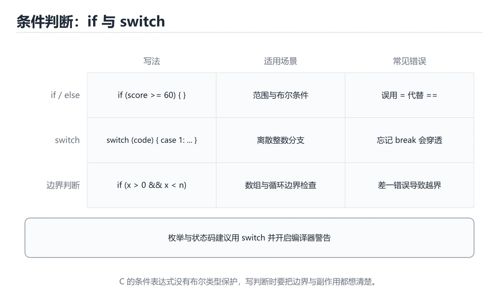

# C 条件判断

> 内容更新时间：2026-10-06 · 学习阶段：入门 · 预计用时：50 分钟




## 本节知识框架

**课程定位**：所属分类为「C 语言」，课程主题为「C 条件判断」，学习阶段为「入门」，建议用时 50 分钟。

**本课要解决的主问题**：用 if、else 和 switch 处理分支。

| 学习层次 | 要回答的问题 | 完成判据 |
| --- | --- | --- |
| 概念层 | 「C 条件判断」有哪些必须区分的对象与术语？ | 能用自己的话定义核心术语，并各举一个正例和一个反例。 |
| 机制层 | 这些对象按什么顺序发生作用，输入如何变成输出？ | 能画出或写出机制步骤，并说明每一步的失败条件。 |
| 应用层 | 什么场景适合使用「C 条件判断」，什么场景不适合？ | 能给出一个真实场景、一个最小示例和一个边界案例。 |
| 性能层 | 时间、空间、吞吐或延迟受哪些量影响？ | 能说出复杂度或性能瓶颈的证据来源；没有证据时明确写“材料未提供”。 |
| 复习层 | 怎样确认自己不是只记住了结论？ | 能独立完成本课自测，并把错误定位到概念、机制、示例或边界。 |

### 阅读路线

1. 先读「核心概念定义」，建立「C 条件判断」等对象的精确定义。
2. 再读「原理与运行机制」，把定义串成可重复的过程。
3. 用「代码/协议/SQL 示例」验证过程，并只改一个条件观察结果变化。
4. 最后检查性能、易错点、知识关系与自测题，形成可复习的证据链。

**前置知识**：《C 变量与输入输出》

**学习位置**：本课位于《C 变量与输入输出》之后；如果前一课的自测不能通过，应先回补再继续。

**后续衔接**：下一课《C 循环入门》会继续使用本课术语，学完后建议立即完成一次自测。

**教材衔接：学习目标**

- 先认识C 条件判断需要的工具、输入和输出。
- 按步骤运行最小示例，并记录结果与错误。
- 用一个边界输入验证自己是否真正掌握。

**教材衔接：前置知识**

- 会进行基本的文件或命令行操作。
- 不需要预先掌握「C 语言」的高级知识。

**教材衔接：本课小结**

- 入门阶段先保证能运行、能观察、能解释，再追求复杂功能。
- 每次只改一个变量，记录预测与实际结果。
- 遇到错误先看第一条错误信息，再回到最小示例。

## 核心概念定义

> 阅读约定：本课先给「C 条件判断」相关术语的操作性定义与适用边界；正文里的口语化说法与定义冲突时，以定义和可复现示例为准。

| 术语 | 操作性定义 | 本课中的边界 |
| --- | --- | --- |
| if-else | 按条件选择分支，else 与最近的未配对 if 结合。 | 仅在「C 条件判断」明确给出的输入、版本与资源条件下成立。 |
| 真假值 | C 里 0 为假、非 0 为真，没有独立的布尔类型。 | 仅在「C 条件判断」明确给出的输入、版本与资源条件下成立。 |
| 代码块 | 用花括号把多条语句合成一个分支体，同时形成作用域。 | 仅在「C 条件判断」明确给出的输入、版本与资源条件下成立。 |
| 入门练习 | 用最小输入和明确验收标准完成第一次动手验证。 | 仅在「C 条件判断」明确给出的输入、版本与资源条件下成立。 |
| 数组 | 数组名在大多数表达式中退化为首元素指针，但 sizeof 和取地址时不是 | 仅在「C 条件判断」明确给出的输入、版本与资源条件下成立。 |
| 字符串 | 字符串函数要保证目标缓冲区足够大，优先使用带长度限制的函数，防止溢出 | 仅在「C 条件判断」明确给出的输入、版本与资源条件下成立。 |

### 定义如何使用

在「C 条件判断」中判断一个说法是否成立，先确认它使用的是哪个对象的定义，再检查输入规模、运行环境与失败路径。定义不是口号，而是后续推导、代码示例和自测题共享的约束。

## 原理与运行机制

### 机制总览

1. **建立输入**：把「if-else」按本课定义整理成可观察、可重复的输入条件。
2. **执行转换**：围绕「真假值」执行本课的核心步骤；每一步都记录中间状态，避免只看最终输出。
3. **产生输出**：得到「代码块」后，用正文示例或协议/SQL 结果核对输出是否符合预期。
4. **改变一个条件**：只替换一个边界条件或环境参数，观察「C 条件判断」的结论是否仍然成立。

| 阶段 | 关注对象 | 失败时应检查 |
| --- | --- | --- |
| 输入 | if-else | 类型、范围、编码、版本或前置状态是否满足定义。 |
| 处理 | 真假值 | 顺序、可见性、锁、路由、事务或调度规则是否被破坏。 |
| 输出 | 代码块 | 结果是否可复现，错误是否被正确传播而不是被吞掉。 |

本课的机制结论要用「C 条件判断」自己的示例验证。「C 条件判断」没有给出某个数量级、吞吐或内存数据时，本课把该判断标为“材料未提供”，不从相邻主题外推。

**教材衔接：一句话入门**

用 if、else 和 switch 处理分支。

**教材衔接：C 语言基础机制速览**

### 编译、链接与程序结构

C 源码经过预处理、编译、汇编和链接生成可执行文件。`#include` 引入声明，函数定义提供实现，链接器负责解析外部符号。`main` 返回 0 表示成功，非 0 表示失败。理解头文件、声明与定义的区别，能区分“找不到函数声明”的编译错误和“找不到符号”的链接错误。

### 类型、变量与内存表示

C 是静态类型语言，基本类型的大小依赖平台，使用 `sizeof` 而不是硬编码字节数。整数有有符号和无符号之分，混合运算会发生转换；无符号回绕有定义，有符号溢出通常是未定义行为。浮点数遵循 IEEE 754 近似表示，比较时使用容差。字符类型、字符串和数组的关系需要清楚：字符串以 `\0` 结尾，`char` 数组不一定是字符串。

### 指针、数组与字符串

指针保存地址，`*` 解引用，`&` 取地址；指针算术按所指类型大小移动。数组名在大多数表达式中退化为首元素指针，但 `sizeof` 和取地址时不是。函数参数中的数组声明等价于指针，长度信息会丢失，必须额外传长度。字符串函数要保证目标缓冲区足够大，优先使用带长度限制的函数，防止溢出。

### 函数、结构体与内存管理

函数原型要在调用前可见，参数按值传递；要修改调用方变量就传指针。结构体可以按值复制，较大结构体通常传指针；`struct` 的内存可能有填充，`sizeof` 不一定等于成员大小之和。`malloc/free`、`calloc`、`realloc` 必须成对使用，释放后指针置空，不能访问已释放内存。栈内存自动回收但生命周期受作用域限制，返回局部数组地址是典型错误。

### 预处理器、未定义行为与调试

宏在预处理阶段替换文本，要加括号并避免多次求值副作用；`#include` 保护防止重复包含。未定义行为包括越界访问、解引用空指针、未初始化读取、有符号溢出和不匹配的格式化参数，编译器优化后可能产生难以预测的结果。使用编译器警告、静态分析、sanitizer 和调试器定位内存问题；测试要覆盖空输入、边界长度、内存分配失败和错误路径。

**教材衔接：版本与时效**

- 把标准版本写进构建配置，避免 C 语言 在不同环境下编译结果不一致。
- 编译器对未定义行为、严格别名与对齐的优化越来越激进
- 升级时重点回归位域、可变参数、内联汇编与结构体布局
- 语言参考：https://en.cppreference.com/w/c

### 升级检查清单

- 先固定当前版本，跑通全部示例与测验，再升级工具链。
- 一次只改一个版本条件，把 C 条件判断 相关的差异单独记成一条结论。
- 升级后重点回归 C 条件判断 的默认值、警告信息与错误格式。
- 升级完成后记录 C 条件判断 的新旧版本差异，并据此调整下次复核时间。

**教材衔接：语言专项实践：C 条件判断**

### 一、工具链

| 阶段 | 推荐工具 | 验收标准 |
| --- | --- | --- |
| 编译 | gcc/clang -Wall -Wextra -Werror | 命令可复现且错误能被定位 |
| 调试 | gdb + core dump | 命令可复现且错误能被定位 |
| 内存检查 | AddressSanitizer / Valgrind | 命令可复现且错误能被定位 |
| 构建发布 | Makefile/CMake + 静态或动态链接 | 命令可复现且错误能被定位 |

### 二、运行时与内存模型

「C 条件判断」的「二、运行时与内存模型」一节补全如下：

- 定位：这一节说明二、运行时与内存模型在「C 条件判断」知识体系里的位置。
- 检查点：固定版本与输入重跑《C 条件判断》，记录两次差异并定位不稳定条件。
- 自检：能否用一个最小例子解释二、运行时与内存模型？

### 三、测试策略

- 单元测试覆盖核心规则和边界。
- 集成测试覆盖文件、网络、数据库或平台 API。
- 失败测试覆盖超时、取消、异常和资源耗尽。
- 性能测试记录基线，避免只凭感觉优化。

### 四、发布检查

- [ ] 版本和依赖锁定，构建可复现。
- [ ] 产物经过签名、校验和最小权限配置。
- [ ] 日志不泄露密钥和个人信息。
- [ ] 有升级、回滚和故障恢复说明。

## 典型应用场景

| 场景 | 典型输入或前提 | 期望产物 |
| --- | --- | --- |
| 学习验证 | 使用本课最小示例和 C 条件判断、C 语言 | 能复现正文结论，并解释每一步。 |
| 工程落地 | 把「C 条件判断」放入真实模块或服务边界 | 输出可观测、失败可定位、参数可配置。 |
| 故障排查 | 只改一个版本、规模、输入或依赖条件 | 能区分概念错误、实现错误和环境差异。 |

判断「C 条件判断」的场景是否成立，标准是能否写出输入、处理、输出和失败路径；材料中没有出现的数据在本课标注为“材料未提供”，不用推测替代证据。

**课程内置实验入口**：`sandbox:cpp`，用于动手验证《C 条件判断》的机制；实验结论不替代概念定义与复杂度分析。

**教材衔接：代码实验：把示例跑成证据**

### 实验一：建立基线

```c
#include <stdio.h>

int main(void) {
    int score = 72;
    if (score >= 60) {
        printf("pass\n");
    } else {
        printf("fail\n");
    }
    return 0;
}
```

### 实验二：只改一个输入

沿用「C 条件判断」的最小示例做一次单变量实验：

| 实验 | 改动 | 预测 | 实际 | 结论 |
| --- | --- | --- | --- | --- |
| 基线 | 保持「C 条件判断」示例原样 |  |  |  |
| 边界 | 把C 条件判断换成空值或极值 |  |  |  |
| 失败 | 给C 语言传入非法输入 |  |  |  |

做完后用一句话写出「C 条件判断」的结论：输入怎么变，结果才怎么变。

### 实验三：制造一个可控错误

把 C 条件判断 的输入从正常值改成越界值，记录程序是报错、降级还是静默出错；「C 条件判断」要求三者区分对待。

| 实验 | 改动 | 预测 | 实际 | 结论 |
| --- | --- | --- | --- | --- |
| 基线 | 保持原样 |  |  |  |
| 边界 |  |  |  |  |
| 失败 |  |  |  |  |

### 实验四：用三句话复述

1. 在「C 条件判断」里，printf 接受哪些输入，非法输入应该在哪里被挡住？
2. printf 的执行顺序里，哪一步会写数据或产生外部副作用？
3. 输出如何验证，失败时第一条可观察证据是什么？

## 代码/协议/SQL 示例

### 最小可验证示例

下面保留《C 条件判断》原文中的最小示例。先预测《C 条件判断》示例的输出，再按正文步骤运行或推演；示例依赖外部环境时，同时记录版本与输入。

```c
#include <stdio.h>

int main(void) {
    int score = 72;
    if (score >= 60) {
        printf("pass\n");
    } else {
        printf("fail\n");
    }
    return 0;
}
```

**教材衔接：最小示例**

```c
#include <stdio.h>

int main(void) {
    int score = 72;
    if (score >= 60) {
        printf("pass\n");
    } else {
        printf("fail\n");
    }
    return 0;
}
```

**教材衔接：预期输出**

```text
pass
```

**教材衔接：零基础通俗讲：C 语言条件判断**

### 一句话说清它是什么

if / else if / else 让程序按条件选择分支：条件为真执行对应代码块，一旦某个分支命中，后面的分支就不再检查。

### 用生活比喻理解

像高速公路的出口指示牌：看到第一个出口匹配就下高速，后面的指示牌再合理也跟你无关。如果所有出口都不匹配，才会走到 else 这条默认通道。

### 完整可运行代码

```c
#include <stdio.h>

int main(void) {
    int score = 0;
    printf("请输入成绩：");
    scanf("%d", &score);

    if (score >= 90) {
        printf("优秀\n");
    } else if (score >= 60) {
        printf("及格\n");
    } else {
        printf("需要补考\n");
    }
    return 0;
}
```

### 逐行拆开看

- `int score = 0;` 先给变量一个初始值，避免读到内存里的随机数据。
- `printf("请输入成绩：")` 打印提示，但故意不换行，让光标停在冒号后面等输入。
- `scanf("%d", &score)` 从键盘读一个整数写进 score；返回值是成功读到的个数，正式程序应该检查它是否等于 1。
- `if (score >= 90)` 括号里是条件表达式，结果为非 0 视为真，为 0 视为假。
- `else if (score >= 60)` 只有前面条件不成立时才轮到它，所以顺序决定了结果。
- `else` 不写条件，负责兜住所有剩下的情况。

### 把程序跑一遍

- 输入 95：第一个条件成立，输出「优秀」，后面的分支全部跳过。
- 输入 72：第一个条件不成立、第二个成立，输出「及格」。
- 输入 40：两个条件都不成立，走 else，输出「需要补考」。
- 三种情况下程序都会执行 `return 0;` 并正常退出。

### 新手最容易踩的坑

- 把 `==` 写成 `=`：`if (score = 90)` 永远为真，编译器可能只给一条警告。
- 条件顺序写反：把 `score >= 60` 放在最前面，90 分也会被判成「及格」。
- 在 if 后面多写一个分号：`if (x > 0);` 让 if 管住一条空语句，后面的代码无条件执行。
- 忘记花括号却在分支里写多行：只有第一行受 if 控制，其余代码总是执行。
- scanf 不检查返回值：用户输入字母时 score 保持旧值，判断结果会莫名其妙。

### 动手练一练

- 输入 90 和 89，确认边界值归属，理解 `>=` 和 `>` 的差别。
- 交换前两个判断的顺序，输入 95，解释结果为什么变错。
- 增加一条「输入非法字符时提示重新输入」的处理，先用 scanf 的返回值做判断。

### 本课速查卡

把下面八行抄进自己的笔记，复习时只看这一页就能回忆整课：

| 复习项 | 本课要点 |
| --- | --- |
| 核心结论 | if / else if / else 让程序按条件选择分支：条件为真执行对应代码块，一旦某个分支命中，后面的分支就不再检查。 |
| 最少要写的代码 | `int main(void) {` |
| 正确做法 | 输入 95：第一个条件成立，输出「优秀」，后面的分支全部跳过。 |
| 最常见的错误 | 把 `==` 写成 `=`：`if (score = 90)` 永远为真，编译器可能只给一条警告。 |
| 出错先查什么 | 先读第一条报错信息，再回到最小示例只改一个地方 |
| 怎么确认学会了 | 输入 90 和 89，确认边界值归属，理解 `>=` 和 `>` 的差别。 |
| 和别的知识点的关系 | 本课打下的语法与思维方式会被后面每一课反复用到 |
| 接下来做什么 | 合上教程，凭记忆把上面的最小代码重写一遍再运行 |

## 时间/空间复杂度或性能分析

**复杂度证据**：「C 条件判断」的现有材料没有给出渐近时间或空间复杂度的明确结论，本课只做定性检查，不补写未经验证的 $O$ 记号。

| 维度 | 本课关注点 | 判断依据 |
| --- | --- | --- |
| 时间/延迟 | 「C 条件判断」的主要步骤是否会随输入规模、并发度或网络往返增长。 | 以正文复杂度、基准数据或可重复测量为准。 |
| 空间/内存 | 中间状态、缓存、副本、连接或索引是否随规模增长。 | 记录峰值内存与数据副本，不只看最终结果。 |
| 吞吐/资源 | 版本、调度、锁、IO、序列化或协议开销是否成为瓶颈。 | 固定环境做对照实验，改变一个变量。 |

评估「C 条件判断」时要区分“正确性成立”和“性能达标”两件事；材料没有给出基准时，本课只保留量级来源与测量方法，不写不可验证的绝对数字。

## 常见误区与易错点

> 复核《C 条件判断》的易错点时，优先保留原文的错误表、故障现场与排错路径；每条修正都要能用本课示例复验。

| 易错点 | 常见表现 | 正确做法 |
| --- | --- | --- |
| 只背结论 | 能复述「C 条件判断」的定义，却说不清输入、输出与边界。 | 回到机制步骤，用最小示例逐一验证。 |
| 混淆相邻概念 | 把本课对象与相邻主题的对象当成同一类。 | 先比较定义、资源归属、生命周期和失败模式。 |
| 忽略版本与环境 | 在开发机通过后直接外推到生产环境。 | 固定版本、输入和资源条件，再记录可复现结果。 |

**教材衔接：常见错误与排查**

> 说明：本表由《C 条件判断》的核心知识整理（2026-10-07），人工复核进度见 docs/content_review_batches.md。

| 易错点 | 容易踩的做法 | 正确结论 |
| --- | --- | --- |
| 条件里用赋值代替比较 | 条件恒为真，分支永远走同一条 | 打开编译告警，用显式比较并避免在条件里赋值 |
| 浮点直接用等号比较 | 精度误差让分支永远不成立 | 用差值与容差比较，并写清可接受的误差范围 |
| switch 忘记 break | 多个分支被连续执行 | 每个 case 显式 break，故意贯穿时写注释说明 |

**教材衔接：故障现场**

### 现场 1：条件里用赋值代替比较

**症状**：在《C 条件判断》的复现场景中，条件恒为真，分支永远走同一条。

**根因**：触发点是把“条件里用赋值代替比较”当成安全做法。它没有满足《C 条件判断》要求的前提，因此先表现为“条件恒为真，分支永远走同一条”；排查时先完整复现这一段，再核对输入、配置与依赖。

**修复**：针对《C 条件判断》的问题，打开编译告警，用显式比较并避免在条件里赋值。

**验证**：先在《C 条件判断》中记录“条件里用赋值代替比较”留下的失败证据，再执行“打开编译告警，用显式比较并避免在条件里赋值”并重放；确认错误路径变为明确结果，且修复没有掩盖同类故障。

### 现场 2：浮点直接用等号比较

**症状**：在《C 条件判断》的复现场景中，精度误差让分支永远不成立。

**根因**：“精度误差让分支永远不成立”只是表层结果。向上追溯会落到“浮点直接用等号比较”这一步，因为它省略了《C 条件判断》的约束，使实现行为和预期模型发生了偏离。

**修复**：针对《C 条件判断》的问题，用差值与容差比较，并写清可接受的误差范围。

**验证**：保留《C 条件判断》里触发“精度误差让分支永远不成立”的输入、版本和日志，按“用差值与容差比较，并写清可接受的误差范围”完成修改后原样重放；只有失败现象消失且相邻场景仍可解释，才保留改动。

### 现场 3：switch 忘记 break

**症状**：在《C 条件判断》的复现场景中，多个分支被连续执行。

**根因**：触发点是把“switch 忘记 break”当成安全做法。它没有满足《C 条件判断》要求的前提，因此先表现为“多个分支被连续执行”；排查时先完整复现这一段，再核对输入、配置与依赖。

**修复**：针对《C 条件判断》的问题，每个 case 显式 break，故意贯穿时写注释说明。

**验证**：保留《C 条件判断》里触发“多个分支被连续执行”的输入、版本和日志，按“每个 case 显式 break，故意贯穿时写注释说明”完成修改后原样重放；只有失败现象消失且相邻场景仍可解释，才保留改动。

**教材衔接：工程化精练：决策、失败与验证**

这一章把「C 条件判断」从“看懂”推进到“能判断、能验证、能排错”。所有判断都围绕C 条件判断、C 语言与入门练习展开，并与前文的示例、测验和失败现场互相对照。

### 一、C 条件判断 的判断算法

| 步骤 | 要回答的问题 | 判断依据 | 记录什么 |
| --- | --- | --- | --- |
| 1. 定目标 | 「C 条件判断」这一步要解决什么问题？ | 把C 条件判断的目标写成一句可验证的结论 | 输入、约束、成功标准 |
| 2. 找边界 | C 语言在什么条件下失效？ | 先列空值、极值、重复和失败路径 | 反例与触发条件 |
| 3. 跑基线 | 原始示例的真实输出是什么？ | 命令、版本和环境必须可复现 | 命令、输出、耗时 |
| 4. 只改一处 | 把入门练习换成另一种取值会怎样？ | 预测写在运行之前 | 预测与实际的差异 |
| 5. 回写结论 | 结论能否被他人复现？ | 把判断写成清单或测试 | 结论、证据、遗留问题 |

这张表的用法不是从上到下浏览，而是每次只填一行：先用「C 条件判断」前文的示例验证第 3 行，再故意破坏一个条件验证第 2 行。当你能在不看解析的情况下说出C 条件判断的判断依据，才算真正掌握本课。

- 先从C 条件判断入手：把它写成“输入是什么、输出是什么、哪一步最容易出错”。如果这三句话中有一句说不清，说明对「C 条件判断」的理解还停留在术语层面，需要回到正文的最小示例重新观察一次。

- 再把C 语言当成对照实验的变量：固定其他条件，只改变它的取值，记录输出是否变化。结论“变”或“不变”都要写出理由，并说明这个理由能否被他人独立复现。

- 针对入门练习做一次失败演练：故意给出空值、极值或错误类型，观察「C 条件判断」的报错位置和处理方式。错误信息只是入口，真正要定位的是哪一层假设被破坏。

- 把「C 条件判断」的结论压缩成一条可执行清单：先检查输入，再检查版本与环境，然后跑最小用例，最后才扩大规模。顺序颠倒会让排错范围成倍增加。

- 如果结论依赖时间或规模，就把数据量提高一个数量级再跑一次。在「C 条件判断」里，小样本成立不代表大样本成立，复杂度、资源占用和失败率都要重新记录。

- 如果结论依赖并发或共享状态，就固定输入并连续运行多次。结果不一致时，优先怀疑「C 条件判断」中C 条件判断相关步骤的隐藏状态，而不是先改代码。

- 把「C 条件判断」的判断写成测试：一个正常用例、一个边界用例、一个失败用例。测试通过只是起点，还要确认失败用例确实以预期方式失败。

- 把本课与相邻主题连起来：C 条件判断解决的是“怎么做”，C 语言回答“什么时候不适用”。两者都答得出来，迁移才算完成。

> 第 2 轮复核「C 条件判断」：把上面的结论逐条改写为可验证的问题，并记录仍不确定的部分。

- 先从C 条件判断入手：把它写成“输入是什么、输出是什么、哪一步最容易出错”。如果这三句话中有一句说不清，说明对「C 条件判断」的理解还停留在术语层面，需要回到正文的最小示例重新观察一次。

- 再把C 语言当成对照实验的变量：固定其他条件，只改变它的取值，记录输出是否变化。结论“变”或“不变”都要写出理由，并说明这个理由能否被他人独立复现。

- 针对入门练习做一次失败演练：故意给出空值、极值或错误类型，观察「C 条件判断」的报错位置和处理方式。错误信息只是入口，真正要定位的是哪一层假设被破坏。

- 把「C 条件判断」的结论压缩成一条可执行清单：先检查输入，再检查版本与环境，然后跑最小用例，最后才扩大规模。顺序颠倒会让排错范围成倍增加。

- 如果结论依赖时间或规模，就把数据量提高一个数量级再跑一次。在「C 条件判断」里，小样本成立不代表大样本成立，复杂度、资源占用和失败率都要重新记录。

- 如果结论依赖并发或共享状态，就固定输入并连续运行多次。结果不一致时，优先怀疑「C 条件判断」中C 条件判断相关步骤的隐藏状态，而不是先改代码。

- 把「C 条件判断」的判断写成测试：一个正常用例、一个边界用例、一个失败用例。测试通过只是起点，还要确认失败用例确实以预期方式失败。

- 把本课与相邻主题连起来：C 条件判断解决的是“怎么做”，C 语言回答“什么时候不适用”。两者都答得出来，迁移才算完成。

> 第 3 轮复核「C 条件判断」：把上面的结论逐条改写为可验证的问题，并记录仍不确定的部分。

- 先从C 条件判断入手：把它写成“输入是什么、输出是什么、哪一步最容易出错”。如果这三句话中有一句说不清，说明对「C 条件判断」的理解还停留在术语层面，需要回到正文的最小示例重新观察一次。

- 再把C 语言当成对照实验的变量：固定其他条件，只改变它的取值，记录输出是否变化。结论“变”或“不变”都要写出理由，并说明这个理由能否被他人独立复现。

- 针对入门练习做一次失败演练：故意给出空值、极值或错误类型，观察「C 条件判断」的报错位置和处理方式。错误信息只是入口，真正要定位的是哪一层假设被破坏。

### 二、C 条件判断 的机制拆解与自测

把本课考点还原成可回答的问题，再逐题写出依据：

**问题 1**：围绕“C 条件判断”中的 C 条件判断、C 语言、入门练习，下列哪两项是本课强调的实践判断？

- 关联术语：C 条件判断
- 判断依据：验证 C 语言 时要固定版本并覆盖边界输入，结论才可复现
- 追问：如果把C 条件判断的条件换成边界值，这个结论是否仍然成立？

**问题 2**：阅读「C 条件判断」中的这段 C 代码，下面哪项判断最准确？

- 关联术语：C 语言
- 判断依据：回到「C 条件判断」正文对应小节，先用最小示例验证再下结论。
- 追问：如果把C 语言的条件换成边界值，这个结论是否仍然成立？

**问题 3**：在 C 中，if (value) 判断的「真」是指什么？

- 关联术语：入门练习
- 判断依据：只要表达式的值不是 0 就视为真
- 追问：C 语言 的条件变化到什么程度时，需要换一种做法？

**问题 4**：避免悬空 else 问题，最直接的做法是？

- 关联术语：C 条件判断
- 判断依据：给每层 if 和 else 都加上配对的大括号
- 追问：如果把C 条件判断的条件换成边界值，这个结论是否仍然成立？

**问题 5**：填空：在「C 条件判断」的术语速查里，「C 源码经过预处理、编译、汇编和链接生成可执行文件。`____` 引入声明，函数定义提供实现，链接器负责解析外部符号。`main` 返回 0 表示成功，非 0 表示失败。理解头文件、声明与定义的区别，能区分“找不到函数声明”的编译错」描述的是哪个术语？

- 关联术语：C 语言
- 判断依据：回到「C 条件判断」正文对应小节，先用最小示例验证再下结论。
- 追问：如果把C 语言的条件换成边界值，这个结论是否仍然成立？

### 三、失败模式与修复顺序

| 失败信号 | 常见根因 | 先做什么 | 修复后如何确认 |
| --- | --- | --- | --- |
| 「C 条件判断」中 C 条件判断 相关步骤报错 | 输入、版本或前置条件与示例不一致 | 保留第一条错误信息，回到最小输入 | 用验证 C 语言 时要固定版本并覆盖边界输入，结论才可复现复跑，确认输出可复现 |
| 「C 条件判断」中 C 语言 相关步骤报错 | 输入、版本或前置条件与示例不一致 | 保留第一条错误信息，回到最小输入 | 用只要表达式的值不是 0 就视为真复跑，确认输出可复现 |
| 「C 条件判断」中 入门练习 相关步骤报错 | 输入、版本或前置条件与示例不一致 | 保留第一条错误信息，回到最小输入 | 用给每层 if 和 else 都加上配对的大括号复跑，确认输出可复现 |
- 检查点：固定版本与输入重跑《C 条件判断》，记录两次差异并定位不稳定条件。
| 单次结果正确但规模一大就失效 | 只测了正常路径，没有覆盖边界 | 把数据量或并发度提高一个数量级 | 记录边界值、耗时与失败率 |

排错顺序固定为：先复现，再缩小输入，然后只改一个条件，最后把结论写成回归用例。对「C 条件判断」来说，任何不能复现的“修好了”都不算完成。

### 四、离开本课前的验证清单

| 检查项 | 通过标准 | 证据 |
| --- | --- | --- |
| 能复述 | 用三句话说明「C 条件判断」解决什么问题、边界在哪 | 不看解析写出的结论 |
| 能运行 | 最小示例在本机跑通 | 命令、输出与版本 |
| 能改条件 | 只改一个输入并解释差异 | 预测与实际的对照 |
| 能排错 | 至少制造并修复一个失败 | 错误信息与修复步骤 |
| 能迁移 | 把C 条件判断、C 语言、入门练习用到新场景 | 一个自选练习的结论 |

完成标准：能不看解析说清「C 条件判断」全部自测题的依据，并且至少有一条C 条件判断相关的结论经过真实运行验证。如果某一步只停留在“感觉懂了”，就把它写成下一轮针对「C 条件判断」的最小验证任务。

### 五、把结论写成可检查的证据

学习「C 条件判断」时，最容易出现的情况是“听过、看懂了，但换一个输入就说不清”。下面把C 条件判断与C 语言放进一条可检查的证据链：每一句结论都要能回答“从哪里来、在什么条件下成立、失败时怎么发现”。

| 证据类型 | 本课要求 | 不合格的表现 |
| --- | --- | --- |
| 概念证据 | 用一句话说明C 条件判断的定义与适用场景 | 只背术语，说不出它解决什么问题 |
| 运行证据 | 能复现「C 条件判断」的最小示例 | 输出与记录对不上，或换机器就不一致 |
| 对照证据 | 只改一个条件，说明差异来自哪里 | 一次改多个变量，无法归因 |
| 失败证据 | 故意制造错误并记录恢复步骤 | 只测正常路径，失败时靠猜 |
| 迁移证据 | 把C 语言用到自选场景 | 换一个例子就完全套不上 |

举例：验证 C 语言 时要固定版本并覆盖边界输入，结论才可复现。把这个结论代回「C 条件判断」的正文，找出它对应的输入、处理步骤与输出；再换掉其中一个条件，观察结论是否仍然成立。能完成这一步，才说明这条知识已经从“记忆”变成“可用的判断”。

最后留一个自检问题：如果只能保留三条笔记，你会写下哪三句？把答案限定为「C 条件判断」中的可验证结论，并给每条结论配一个反例。这三句加上对应反例，就是本课最值得带入后续课程的复习材料。

<!-- language-intro-deep-dive:start -->

## 与其他知识点的关系

| 关系 | 课程 | 为什么 |
| --- | --- | --- |
| 先修 | 《C 变量与输入输出》 | 本课会直接使用它的概念或操作前提。 |
| 关联 | 《C 循环入门》 | 用于横向比较或把本课结论迁移到相邻主题。 |
| 前置顺序 | 《C 变量与输入输出》 | 同分类中安排在本课之前，建议先完成其自测。 |
| 后续顺序 | 《C 循环入门》 | 同分类中安排在本课之后，会继续使用本课术语。 |

把「C 条件判断」放回知识体系时，不只要记住“前面学过什么”，还要说明两个主题在输入、机制、资源边界和失败模式上的差异。这样才能把单课知识迁移到项目、排障和后续课程。

**教材衔接：复习与迁移**

复习目标：把「C 条件判断」的判断标准放回可复现的例子里。先自己作答，再对照依据；如果结论正确但理由不完整，回到正文补足前提。

### 概念复述

- 用一句话说明「C 条件判断」解决什么问题：用 if、else 和 switch 处理分支。
- 写出C 条件判断、C 语言、入门练习之间的关系，并各举一个例子。
- 说出本课最容易混淆的两个概念，以及区分它们的判据。

### 正文逐节复核

- **逐节复习与自检**：围绕「C 条件判断、C 语言、入门练习」说明变量生命周期、资源释放、并发模型和错误传播。

### 测验回顾

1. 围绕“C 条件判断”中的 C 条件判断、C 语言、入门练习，下列哪两项是本课强调的实践判断？
   - 依据：题干的正确项是验证 C 语言 时要固定版本并覆盖边界输入，结论才可复现。学习 C 条件判断 时要同时说明输入、输出和失败路径，不能只看正常流程。在「C 条件判断」里判断这道题，要把C 条件判断、C 语言、入门练习的条件、过程与失败路径逐项对齐，换成“围绕C 条件判断中的 C 条件判断、”这个场景，只有满足前提的结论才成立。
2. 阅读「C 条件判断」中的这段 C 代码，下面哪项判断最准确？
   - 依据：这段 C 代码来自本课的本地示例，主要用来核对 C 条件判断、C 语言、入门练习 之间的输入、处理和输出关系，用 if、else 和 switch 处理分支。“条件判断中的这段”与「C 条件判断」的术语表相呼应，只有符合C 条件判断、C 语言、入门练习约束的“用 if、else 和 switch 处”才是正文支持的结论。
3. 在 C 中，if (value) 判断的「真」是指什么？
   - 依据：在「C 条件判断」里，只要表达式的值不是 0 就视为真。C 没有专门的布尔类型（引入 stdbool.h 后才有 bool 宏），条件表达式按整数求值：0 为假，任何非 0 值都为真，包括负数。「C 条件判断」要求先交代C 条件判断、C 语言、入门练习的前提再下结论，所以“只要表达式的值不是 0 就视为真”只在题干“在 C 中”给定的条件下成立。
4. 避免悬空 else 问题，最直接的做法是？
   - 依据：在「C 条件判断」里，结论应落在「给每层 if 和 else 都加上配对的大括号」。else 总是与最近的未配对 if 结合，当代码省略大括号时，缩进所暗示的层级可能与编译器理解的不一致，这就是悬空 else。在「C 条件判断」里，这道题要求区分概念与边界，「给每层 if 和 else 都加上配对的大括号」只有在题干给出的前提下才成立，而「把 else 全部删除，只保留 if 分支」、「在 else 后面额外添加一个分号」缺少同一组条件。
5. 填空：在「C 条件判断」的术语速查里，「C 源码经过预处理、编译、汇编和链接生成可执行文件。`____` 引入声明，函数定义提供实现，链接器负责解析外部符号。`main` 返回 0 表示成功，非 0 表示失败。理解头文件、声明与定义的区别，能区分“找不到函数声明”的编译错」描述的是哪个术语？
   - 依据：把“#include”代回「C 条件判断」里“在C 条件判断的术语速查里”的例子核对，条件一旦改变，结论就要用C 条件判断、C 语言、入门练习重新推导。回到C 条件判断、C 语言、入门练习本身再看一遍：只有“#include”与题干“条件判断的术语速查里”的前提一致，结论才成立。

### 迁移练习

把「C 条件判断」的结论迁移到相邻主题，每次迁移都写清预测与证据：

1. 换输入：用C 条件判断处理一组你自己的数据，对比教材示例的结果差异。
2. 换失败条件：制造一个C 语言相关的错误，说明如何从错误信息定位根因。
3. 换规模：把数据量或并发度提高一个数量级，说明「C 条件判断」的结论是否仍成立。

## 自测题与参考答案

> 先独立作答《C 条件判断》的自测题，再对照答案与解析；每处判断都要能在本课正文或示例中找到依据。

### 自测 1

围绕“C 条件判断”中的 C 条件判断、C 语言、入门练习，下列哪两项是本课强调的实践判断？

A. 验证 C 语言 时要固定版本并覆盖边界输入，结论才可复现
B. 把 C 语言 的单次运行结果当成所有版本和规模都成立
C. 学习 C 条件判断 时要同时说明输入、输出和失败路径，不能只看正常流程
D. 只要 C 条件判断 的常规示例通过，就可以跳过边界与异常路径

**参考答案**：验证 C 语言 时要固定版本并覆盖边界输入，结论才可复现；学习 C 条件判断 时要同时说明输入、输出和失败路径，不能只看正常流程

**解析**：题干的正确项是验证 C 语言 时要固定版本并覆盖边界输入，结论才可复现。学习 C 条件判断 时要同时说明输入、输出和失败路径，不能只看正常流程。在「C 条件判断」里判断这道题，要把C 条件判断、C 语言、入门练习的条件、过程与失败路径逐项对齐，换成“围绕C 条件判断中的 C 条件判断、”这个场景，只有满足前提的结论才成立。

### 自测 2

阅读「C 条件判断」中的这段 C 代码，下面哪项判断最准确？

```c
#include <stdio.h>

int main(void) {
    int x = 6
    printf("%d\n", x);
    return 0;
}
```

A. 这段 C 代码只展示语法，不会读取任何输入或产生可验证输出。
B. C 条件判断、C 语言、入门练习 的结论只取决于关键字数量，与代码的控制流和边界条件无关。
C. 这段 C 代码可以跳过错误处理，因为运行成功后就不会再出现异常。
D. 用 if、else 和 switch 处理分支。

**参考答案**：用 if、else 和 switch 处理分支。

**解析**：这段 C 代码来自本课的本地示例，主要用来核对 C 条件判断、C 语言、入门练习 之间的输入、处理和输出关系，用 if、else 和 switch 处理分支。“条件判断中的这段”与「C 条件判断」的术语表相呼应，只有符合C 条件判断、C 语言、入门练习约束的“用 if、else 和 switch 处”才是正文支持的结论。

### 自测 3

在 C 中，if (value) 判断的「真」是指什么？

A. 只有值为正数时才视为真，负数不算
B. 由编译器随机决定，没有统一规则
C. 只要表达式的值不是 0 就视为真
D. 只有值等于 1 时才视为真

**参考答案**：只要表达式的值不是 0 就视为真

**解析**：在「C 条件判断」里，只要表达式的值不是 0 就视为真。C 没有专门的布尔类型（引入 stdbool.h 后才有 bool 宏），条件表达式按整数求值：0 为假，任何非 0 值都为真，包括负数。「C 条件判断」要求先交代C 条件判断、C 语言、入门练习的前提再下结论，所以“只要表达式的值不是 0 就视为真”只在题干“在 C 中”给定的条件下成立。

**教材衔接：动手练习**

1. 原样运行最小示例，保存命令和输出。
2. 把数字 2 改成 10，预测并验证新结果。
3. 制造一个错误输入，写出错误信息和修复方法。

**教材衔接：可运行练习**

### 任务 1：先跑通，再解释

```c
#include <stdio.h>

int main(void) {
    int score = 72;
    if (score >= 60) {
        printf("pass\n");
    } else {
        printf("fail\n");
    }
    return 0;
}
```

**预期输出**：fail\n

### 任务 2：只改一个条件

把「C 条件判断」的最小示例复制一份，只改一个条件再跑一次：

- 改动点：只调整 printf 的一个参数，其余条件一律不动。
- 预测：先写下「C 条件判断」在改动后的输出或错误信息，再运行。
- 记录：对照改动前后的结果，指出差异出在哪一步。
- 验收：换回原条件能复现原结果，改动只影响C 条件判断。

### 任务 3：迁移到自己的数据

换一个 C 语言 场景重做一次，确认结论不是只对示例数据成立。

**教材衔接：本课复习清单**

离开本课前，逐项确认：

- [ ] 不看解析，能说出「当 score 等于 72 时，示例中的 if/else 会怎样执行？」的判断依据。
- [ ] 不看解析，能说出「switch 语句中，case 结束后忘记写 break 会怎样？」的判断依据。
- [ ] 不看解析，能说出「在 C 中，if (value) 判断的「真」是指什么？」的判断依据。
- [ ] 不看解析，能说出「避免悬空 else 问题，最直接的做法是？」的判断依据。
- [ ] 不看解析，能说出「填空：C 条件判断术语速查中，表示的判断依据。
- [ ] 跑通「C 条件判断」的最小示例，并记录一次失败输入的处理方式。
- [ ] 把本课最容易混淆的两个概念写成一句话对照。

| 复盘项 | 记录 |
| --- | --- |
| 已经能独立解释的考点 |  |
| 仍然说不清的概念 |  |
| 下一步验证动作 |  |

**教材衔接：复习与自测**

逐节自检：能说清 C 条件判断 的输入、输出与失败路径才算通过，否则回到原文。

### 一句话入门

自检：这一节的关键输入与输出分别是什么？

### 最小示例

```c
#include <stdio.h>

int main(void) {
    int score = 72;
    if (score >= 60) {
        printf("pass\n");
    } else {
        printf("fail\n");
    }
    return 0;
}
```

自检：这一节与相邻主题的边界在哪里？

### 预期输出

```text
pass
```

### 常见错误

自检：把这一节讲给没学过的人，最需要强调哪一点？

### 动手练习

自检：如果去掉这一节里的一个前提，结论会怎样变化？

### 语言专项实践：C 条件判断

围绕「C 条件判断、C 语言、入门练习」说明变量生命周期、资源释放、并发模型和错误传播。语言语法只是入口，真正决定行为的是运行时、标准库和平台约束。

---

## 术语速查

把「C 条件判断」里反复出现的术语集中放在一起。复习时先遮住右列，尝试用自己的话解释，再回到正文核对。

| 术语 | 一句话说明 |
| --- | --- |
| `if-else` | 按条件选择分支，else 与最近的未配对 if 结合。 |
| `真假值` | C 里 0 为假、非 0 为真，没有独立的布尔类型。 |
| `代码块` | 用花括号把多条语句合成一个分支体，同时形成作用域。 |
| `入门练习` | 用最小输入和明确验收标准完成第一次动手验证。 |
| `数组` | 数组名在大多数表达式中退化为首元素指针，但 sizeof 和取地址时不是 |
| `字符串` | 字符串函数要保证目标缓冲区足够大，优先使用带长度限制的函数，防止溢出 |

## 考点精讲

### 考点 1：多选辨析·C 条件判断

- **题目**：围绕“C 条件判断”中的 C 条件判断、C 语言、入门练习，下列哪两项是本课强调的实践判断？
- **判断依据**：题干的正确项是验证 C 语言 时要固定版本并覆盖边界输入，结论才可复现。学习 C 条件判断 时要同时说明输入、输出和失败路径，不能只看正常流程。在「C 条件判断」里判断这道题，要把C 条件判断、C 语言、入门练习的条件、过程与失败路径逐项对齐，换成“围绕C 条件判断中的 C 条件判断、”这个场景，只有满足前提的结论才成立。

### 考点 2：代码补全·C 条件判断

- **题目**：阅读「C 条件判断」中的这段 C 代码，下面哪项判断最准确？
- **判断依据**：这段 C 代码来自本课的本地示例，主要用来核对 C 条件判断、C 语言、入门练习 之间的输入、处理和输出关系，用 if、else 和 switch 处理分支。“条件判断中的这段”与「C 条件判断」的术语表相呼应，只有符合C 条件判断、C 语言、入门练习约束的“用 if、else 和 switch 处”才是正文支持的结论。

### 考点 3：概念判断·真

- **题目**：在 C 中，if (value) 判断的「真」是指什么？
- **判断依据**：在「C 条件判断」里，只要表达式的值不是 0 就视为真。C 没有专门的布尔类型（引入 stdbool.h 后才有 bool 宏），条件表达式按整数求值：0 为假，任何非 0 值都为真，包括负数。「C 条件判断」要求先交代C 条件判断、C 语言、入门练习的前提再下结论，所以“只要表达式的值不是 0 就视为真”只在题干“在 C 中”给定的条件下成立。

### 考点 4：概念判断·C 条件判断

- **题目**：避免悬空 else 问题，最直接的做法是？
- **判断依据**：在「C 条件判断」里，结论应落在「给每层 if 和 else 都加上配对的大括号」。else 总是与最近的未配对 if 结合，当代码省略大括号时，缩进所暗示的层级可能与编译器理解的不一致，这就是悬空 else。在「C 条件判断」里，这道题要求区分概念与边界，「给每层 if 和 else 都加上配对的大括号」只有在题干给出的前提下才成立，而「把 else 全部删除，只保留 if 分支」、「在 else 后面额外添加一个分号」缺少同一组条件。

### 考点 5：填空·____

- **题目**：填空：在「C 条件判断」的术语速查里，「C 源码经过预处理、编译、汇编和链接生成可执行文件。`____` 引入声明，函数定义提供实现，链接器负责解析外部符号。`main` 返回 0 表示成功，非 0 表示失败。理解头文件、声明与定义的区别，能区分“找不到函数声明”的编译错」描述的是哪个术语？
- **判断依据**：把“#include”代回「C 条件判断」里“在C 条件判断的术语速查里”的例子核对，条件一旦改变，结论就要用C 条件判断、C 语言、入门练习重新推导。回到C 条件判断、C 语言、入门练习本身再看一遍：只有“#include”与题干“条件判断的术语速查里”的前提一致，结论才成立。

## English Overview

**Title:** C Conditionals

**Summary:** Handle branches with if and switch.

**Category:** C
**Level:** 入门
**Key terms:** C 条件判断, C 语言, 入门练习

## 内容元数据

- 内容版本：v2.0
- 最后更新：2026-10-06
- 学习阶段：入门
- 适用环境：C11 / GCC 或 Clang；本课聚焦 C 条件判断。
- 内容来源：内置结构化课程与工程实践整理
- 相关主题：C 条件判断、C 语言、入门练习
- 质量版本：P0 测验标准 + P1 覆盖扩展 + P2 体验补全

## 参考资料与复核

- 最后复核：2026-10-04
- 下次复核：2026-11-17
- 复核范围：版本兼容、API 行为、安全建议与工程实践
- 来源性质：官方文档、标准或权威教材；正文为离线教学重组

| 参考资料 | 本课用途 |
| --- | --- |
| [cppreference C 语言](https://en.cppreference.com/w/c/language) | C 语言规则与语义 |
| [GDB 文档](https://sourceware.org/gdb/documentation/) | C 程序调试与崩溃定位 |
| [GNU Make](https://www.gnu.org/software/make/manual/) | Makefile 与构建依赖 |

> 「C 条件判断」的链接用于离线阅读后的延伸核对；App 不会自动联网。
