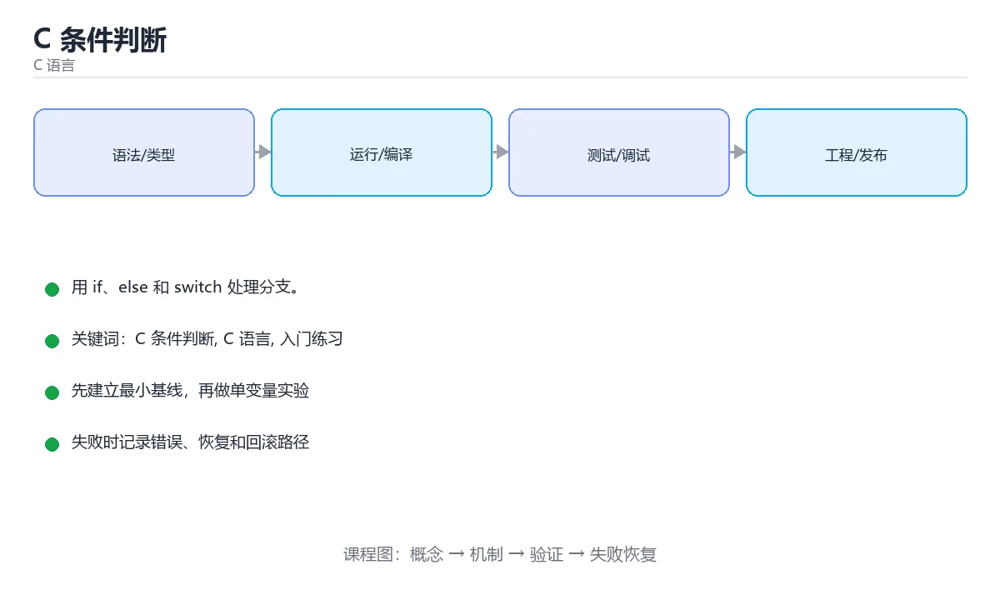

# C 条件判断



> 内容更新时间：2026-10-03 · 学习阶段：入门 · 预计用时：15 分钟

## 学习目标

- 先认识「C 条件判断」需要的工具、输入和输出。
- 按步骤运行最小示例，并记录结果与错误。
- 用一个边界输入验证自己是否真正掌握。

## 前置知识

- 会进行基本的文件或命令行操作。
- 不需要预先掌握「C 语言」的高级知识。

## 一句话入门

用 if、else 和 switch 处理分支。

## 最小示例

```c
#include <stdio.h>

int main(void) {
    int score = 72;
    if (score >= 60) {
        printf("pass\n");
    } else {
        printf("fail\n");
    }
    return 0;
}
```

## 预期输出

```text
pass
```

## 常见错误

- 数组越界或忘记字符串终止符，造成未定义行为。
- 复制命令时遗漏空格、引号或必要参数。

## 动手练习

1. 原样运行最小示例，保存命令和输出。
2. 把数字 2 改成 10，预测并验证新结果。
3. 制造一个错误输入，写出错误信息和修复方法。

## 本课小结

- 入门阶段先保证能运行、能观察、能解释，再追求复杂功能。
- 每次只改一个变量，记录预测与实际结果。
- 遇到错误先看第一条错误信息，再回到最小示例。


## 代码实验：把示例跑成证据

这一节不引入新语法，而是把「C 条件判断」的最小示例变成可以复现、可以对照的实验。每次只改变一个条件，先写预测，再运行，最后解释差异。

### 实验一：建立基线

```c
#include <stdio.h>

int main(void) {
    int score = 72;
    if (score >= 60) {
        printf("pass\n");
    } else {
        printf("fail\n");
    }
    return 0;
}
```

先原样运行上面的代码，记录命令、完整输出和退出状态。然后把输出与正文的预期输出逐字对照，不要用“看起来差不多”代替核对；空格、大小写、换行和错误流向都可能暴露环境差异。

### 实验二：只改一个输入

从代码中选一个会影响结果的字面量、参数或输入，把它替换成边界值：数值可尝试 0、1、最大值和最小值，字符串可尝试空串和超长文本，集合可尝试空集合、单元素和重复元素。先写出预测，再运行并记录实际结果。

### 实验三：制造一个可控错误

删掉一条语句末尾的分号，或者把格式化占位符与参数类型改成不匹配。记录编译器第一条诊断，再恢复代码确认基线仍然可运行。

| 实验 | 改动 | 预测 | 实际 | 结论 |
| --- | --- | --- | --- | --- |
| 基线 | 保持原样 |  |  |  |
| 边界 |  |  |  |  |
| 失败 |  |  |  |  |

### 实验四：用三句话复述

1. 输入是什么，哪些输入属于合法范围，哪些属于边界或非法范围？
2. 程序按什么顺序处理输入，在哪一步产生了状态变化或副作用？
3. 输出如何验证，失败时第一条可观察证据是什么？

## C 语言基础机制速览

### 编译、链接与程序结构

C 源码经过预处理、编译、汇编和链接生成可执行文件。`#include` 引入声明，函数定义提供实现，链接器负责解析外部符号。`main` 返回 0 表示成功，非 0 表示失败。理解头文件、声明与定义的区别，能区分“找不到函数声明”的编译错误和“找不到符号”的链接错误。

### 类型、变量与内存表示

C 是静态类型语言，基本类型的大小依赖平台，使用 `sizeof` 而不是硬编码字节数。整数有有符号和无符号之分，混合运算会发生转换；无符号回绕有定义，有符号溢出通常是未定义行为。浮点数遵循 IEEE 754 近似表示，比较时使用容差。字符类型、字符串和数组的关系需要清楚：字符串以 `\0` 结尾，`char` 数组不一定是字符串。

### 指针、数组与字符串

指针保存地址，`*` 解引用，`&` 取地址；指针算术按所指类型大小移动。数组名在大多数表达式中退化为首元素指针，但 `sizeof` 和取地址时不是。函数参数中的数组声明等价于指针，长度信息会丢失，必须额外传长度。字符串函数要保证目标缓冲区足够大，优先使用带长度限制的函数，防止溢出。

### 函数、结构体与内存管理

函数原型要在调用前可见，参数按值传递；要修改调用方变量就传指针。结构体可以按值复制，较大结构体通常传指针；`struct` 的内存可能有填充，`sizeof` 不一定等于成员大小之和。`malloc/free`、`calloc`、`realloc` 必须成对使用，释放后指针置空，不能访问已释放内存。栈内存自动回收但生命周期受作用域限制，返回局部数组地址是典型错误。

### 预处理器、未定义行为与调试

宏在预处理阶段替换文本，要加括号并避免多次求值副作用；`#include` 保护防止重复包含。未定义行为包括越界访问、解引用空指针、未初始化读取、有符号溢出和不匹配的格式化参数，编译器优化后可能产生难以预测的结果。使用编译器警告、静态分析、sanitizer 和调试器定位内存问题；测试要覆盖空输入、边界长度、内存分配失败和错误路径。

## 考点精讲：把测验题还原成判断过程

本课有 5 个判断点。先自己作答，再看「判断依据」；如果结论正确但理由不完整，回到正文对应章节补足概念。

### 考点 1：当 score 等于 72 时，示例中的 if/else 会怎样执行？

- **正确判断**：条件 score >= 60 成立，输出 pass 后跳过 else
- **判断依据**：正确答案是「条件 score >= 60 成立，输出 pass 后跳过 else」，本课在「一句话入门」中说明：用 if、else 和 switch 处理分支。72 大于等于 60，条件为真，于是执行 if 之后的代码块并输出 pass，else 分支整体被跳过，所以不会出现两行结果。
- **迁移检查**：如果给某个错误选项去掉一个限定词，它会不会变成正确？说明理由。

### 考点 2：switch 语句中，case 结束后忘记写 break 会怎样？

- **正确判断**：控制流继续执行下一个 case 的语句，形成穿透
- **判断依据**：正确答案是「控制流继续执行下一个 case 的语句，形成穿透」，这道题在问switch语句中，case结束后忘记写break会怎样，判断时要把题干限定的输入、边界与目标逐项对齐。switch 只在入口处按标签跳转，之后顺序执行语句，直到遇到 break 或结构结束，因此漏写 break 会继续执行后续 case，这种现象称为 fallthrough。
- **迁移检查**：如果给某个错误选项去掉一个限定词，它会不会变成正确？说明理由。

### 考点 3：在 C 中，if (value) 判断的「真」是指什么？

- **正确判断**：只要表达式的值不是 0 就视为真
- **判断依据**：正确答案是「只要表达式的值不是 0 就视为真」，这道题在问在C中，if(value)判断的真是指什么，判断时要把题干限定的输入、边界与目标逐项对齐。C 没有专门的布尔类型（引入 stdbool.h 后才有 bool 宏），条件表达式按整数求值：0 为假，任何非 0 值都为真，包括负数。
- **迁移检查**：遮住选项，只根据定义复述一次答案，再回来看哪个选项与复述一致。

### 考点 4：避免悬空 else 问题，最直接的做法是？

- **正确判断**：给每层 if 和 else 都加上配对的大括号
- **判断依据**：正确答案是「给每层 if 和 else 都加上配对的大括号」，本课在「一句话入门」中说明：用 if、else 和 switch 处理分支。else 总是与最近的未配对 if 结合，当代码省略大括号时，缩进所暗示的层级可能与编译器理解的不一致，这就是悬空 else。
- **迁移检查**：把题干里的一个条件换成边界值，原来的结论还成立吗？写出判断过程。

### 考点 5：填空：「C 条件判断」术语速查中，表示「C 源码经过预处理、编译、汇编和链接生成可执行文件。`____` 引入声明，函数定义提供实现，链接器负责解析外部符号。`main` 返回 0 表示成功，非 0 表示失败。理解头文件、声明与定义的区别，能区分“找不到函数声明”的编译错…」的术语是什么？

- **正确判断**：#include
- **判断依据**：正确答案是「#include」，这道题在问填空：C条件判断术语速查中，表示C源码经过预处理、编…“找不到函数声明”的编译错…的术语是什么，判断时要把题干限定的输入、边界与目标逐项对齐。课程摘要指出用 if，else 和 switch 处理分支，本课要判断的正是填空：C条件判断术语速查中，表示C源码经过预处理、编…“找不到函数声明”的编译错…的术语是什么。
- **迁移检查**：不看题干，用自己的话补全这句话，再与标准答案对照。

## 本课复习清单

离开本课前，逐项确认：

- [ ] 不看解析，能说出「当 score 等于 72 时，示例中的 if/else 会怎样执行？」的判断依据。
- [ ] 不看解析，能说出「switch 语句中，case 结束后忘记写 break 会怎样？」的判断依据。
- [ ] 不看解析，能说出「在 C 中，if (value) 判断的「真」是指什么？」的判断依据。
- [ ] 不看解析，能说出「避免悬空 else 问题，最直接的做法是？」的判断依据。
- [ ] 不看解析，能说出「填空：「C 条件判断」术语速查中，表示「C 源码经过预处理、编译、汇编和链接生成…」的判断依据。
- [ ] 至少运行一次本课示例，记录输入、输出和一个边界情况。
- [ ] 把本课最容易混淆的两个概念写成一句话对照。

| 复盘项 | 记录 |
| --- | --- |
| 已经能独立解释的考点 |  |
| 仍然说不清的概念 |  |
| 下一步验证动作 |  |

## 逐节复习与自检

下面按正文顺序回顾每一节，并给出一个自检问题；说不清的地方回到原章节补课。

### 一句话入门

用 if、else 和 switch 处理分支。

自检：这一节的关键输入与输出分别是什么？

### 最小示例

```c
#include <stdio.h>

int main(void) {
    int score = 72;
    if (score >= 60) {
        printf("pass\n");
    } else {
        printf("fail\n");
    }
    return 0;
}
```

自检：这一节与相邻主题的边界在哪里？

### 预期输出

```text
pass
```

自检：这一节与相邻主题的边界在哪里？

### 常见错误

数组越界或忘记字符串终止符，造成未定义行为。

自检：把这一节讲给没学过的人，最需要强调哪一点？

### 动手练习

把数字 2 改成 10，预测并验证新结果。制造一个错误输入，写出错误信息和修复方法。

自检：如果去掉这一节里的一个前提，结论会怎样变化？

### 语言专项实践：C 条件判断

围绕「C 条件判断、C 语言、入门练习」说明变量生命周期、资源释放、并发模型和错误传播。语言语法只是入口，真正决定行为的是运行时、标准库和平台约束。

自检：这一节的关键输入与输出分别是什么？

## 术语速查

把本课反复出现的术语集中放在一起。复习时先遮住右列，尝试用自己的话解释，再回到正文核对。

| 术语 | 本课语境 |
| --- | --- |
| `#include` | C 源码经过预处理、编译、汇编和链接生成可执行文件。`#include` 引入声明，函数定义提供实现，链接器负责解析外部符号。`main` 返回 0 表示成功，非 0 表示失败。理解头文件、声明与定义的区别，能区分“找不… |
| `main` | C 源码经过预处理、编译、汇编和链接生成可执行文件。`#include` 引入声明，函数定义提供实现，链接器负责解析外部符号。`main` 返回 0 表示成功，非 0 表示失败。理解头文件、声明与定义的区别，能区分“找不… |
| `sizeof` | C 是静态类型语言，基本类型的大小依赖平台，使用 `sizeof` 而不是硬编码字节数。整数有有符号和无符号之分，混合运算会发生转换；无符号回绕有定义，有符号溢出通常是未定义行为。浮点数遵循 IEEE 754 近似表示，… |
| `\0` | C 是静态类型语言，基本类型的大小依赖平台，使用 `sizeof` 而不是硬编码字节数。整数有有符号和无符号之分，混合运算会发生转换；无符号回绕有定义，有符号溢出通常是未定义行为。浮点数遵循 IEEE 754 近似表示，… |
| `char` | C 是静态类型语言，基本类型的大小依赖平台，使用 `sizeof` 而不是硬编码字节数。整数有有符号和无符号之分，混合运算会发生转换；无符号回绕有定义，有符号溢出通常是未定义行为。浮点数遵循 IEEE 754 近似表示，… |
| `解引用，` | 指针保存地址，`*` 解引用，`&` 取地址；指针算术按所指类型大小移动。数组名在大多数表达式中退化为首元素指针，但 `sizeof` 和取地址时不是。函数参数中的数组声明等价于指针，长度信息会丢失，必须额外传长度。字符… |
| `struct` | 函数原型要在调用前可见，参数按值传递；要修改调用方变量就传指针。结构体可以按值复制，较大结构体通常传指针；`struct` 的内存可能有填充，`sizeof` 不一定等于成员大小之和。`malloc/free`、`cal… |
| `malloc/free` | 函数原型要在调用前可见，参数按值传递；要修改调用方变量就传指针。结构体可以按值复制，较大结构体通常传指针；`struct` 的内存可能有填充，`sizeof` 不一定等于成员大小之和。`malloc/free`、`cal… |
| `calloc` | 函数原型要在调用前可见，参数按值传递；要修改调用方变量就传指针。结构体可以按值复制，较大结构体通常传指针；`struct` 的内存可能有填充，`sizeof` 不一定等于成员大小之和。`malloc/free`、`cal… |
| `realloc` | 函数原型要在调用前可见，参数按值传递；要修改调用方变量就传指针。结构体可以按值复制，较大结构体通常传指针；`struct` 的内存可能有填充，`sizeof` 不一定等于成员大小之和。`malloc/free`、`cal… |

## 面试问答与自测

下面把本课考点换成面试追问。先口述自己的答案，
再对照参考回答检查是否遗漏了前提、边界或失败路径。

### 追问 1：当 score 等于 72 时，示例中的 if/else 会怎样执行？

**参考回答**：正确答案是「条件 score >= 60 成立，输出 pass 后跳过 else」，本课在「一句话入门」中说明：用 if、else 和 switch 处理分支。72 大于等于 60，条件为真，于是执行 if 之后的代码块并输出 pass，else 分支整体被跳过，所以不会出现两行结果。

### 追问 2：switch 语句中，case 结束后忘记写 break 会怎样？

**参考回答**：正确答案是「控制流继续执行下一个 case 的语句，形成穿透」，这道题在问switch语句中，case结束后忘记写break会怎样，判断时要把题干限定的输入、边界与目标逐项对齐。switch 只在入口处按标签跳转，之后顺序执行语句，直到遇到 break 或结构结束，因此漏写 break 会继续执行后续 case，这种现象称为 fallthrough。

### 追问 3：在 C 中，if (value) 判断的「真」是指什么？

**参考回答**：正确答案是「只要表达式的值不是 0 就视为真」，这道题在问在C中，if(value)判断的真是指什么，判断时要把题干限定的输入、边界与目标逐项对齐。C 没有专门的布尔类型（引入 stdbool.h 后才有 bool 宏），条件表达式按整数求值：0 为假，任何非 0 值都为真，包括负数。

### 追问 4：避免悬空 else 问题，最直接的做法是？

**参考回答**：正确答案是「给每层 if 和 else 都加上配对的大括号」，本课在「一句话入门」中说明：用 if、else 和 switch 处理分支。else 总是与最近的未配对 if 结合，当代码省略大括号时，缩进所暗示的层级可能与编译器理解的不一致，这就是悬空 else。

### 追问 5：填空：「C 条件判断」术语速查中，表示「C 源码经过预处理、编译、汇编和链接生成可执行文件。`____` 引入声明，函数定义提供实现，链接器负责解析外部符号。`main` 返回 0 表示成功，非 0 表示失败。理解头文件、声明与定义的区别，能区分“找不到函数声明”的编译错…」的术语是什么？

**参考回答**：正确答案是「#include」，这道题在问填空：C条件判断术语速查中，表示C源码经过预处理、编…“找不到函数声明”的编译错…的术语是什么，判断时要把题干限定的输入、边界与目标逐项对齐。课程摘要指出用 if，else 和 switch 处理分支，本课要判断的正是填空：C条件判断术语速查中，表示C源码经过预处理、编…“找不到函数声明”的编译错…的术语是什么。

## English Overview

**Title:** C Conditionals

**Summary:** Handle branches with if and switch.

**Category:** C  
**Level:** 入门  
**Key terms:** C 条件判断, C 语言, 入门练习

> The full tutorial is written in Chinese. This bilingual overview helps English readers identify the topic, scope and key terms before studying the detailed examples.

## 内容元数据

- 内容版本：v2.0
- 最后更新：2026-10-03
- 学习阶段：入门
- 适用环境：C11 / GCC 或 Clang
- 内容来源：内置结构化课程与工程实践整理
- 相关主题：C 条件判断、C 语言、入门练习
- 质量版本：P0 测验标准 + P1 覆盖扩展 + P2 体验补全


## 语言专项实践：C 条件判断

### 一、工具链

| 阶段 | 推荐工具 | 验收标准 |
| --- | --- | --- |
| 编译 | gcc/clang -Wall -Wextra -Werror | 命令可复现且错误能被定位 |
| 调试 | gdb + core dump | 命令可复现且错误能被定位 |
| 内存检查 | AddressSanitizer / Valgrind | 命令可复现且错误能被定位 |
| 构建发布 | Makefile/CMake + 静态或动态链接 | 命令可复现且错误能被定位 |

### 二、运行时与内存模型

围绕「C 条件判断、C 语言、入门练习」说明变量生命周期、资源释放、并发模型和错误传播。语言语法只是入口，真正决定行为的是运行时、标准库和平台约束。

### 三、测试策略

- 单元测试覆盖核心规则和边界。
- 集成测试覆盖文件、网络、数据库或平台 API。
- 失败测试覆盖超时、取消、异常和资源耗尽。
- 性能测试记录基线，避免只凭感觉优化。

### 四、发布检查

- [ ] 版本和依赖锁定，构建可复现。
- [ ] 产物经过签名、校验和最小权限配置。
- [ ] 日志不泄露密钥和个人信息。
- [ ] 有升级、回滚和故障恢复说明。


## 参考资料与复核

- 最后复核：2026-10-04
- 下次复核：2027-04-04
- 复核范围：版本兼容、API 行为、安全建议与工程实践
- 来源性质：官方文档与标准；本课正文为离线教学重组，不复制原文

| 参考资料 | 本课用途 |
| --- | --- |
| [C 标准库参考](https://en.cppreference.com/w/c) | C 语言与标准库 |
| [GNU C Manual](https://www.gnu.org/software/libc/manual/) | POSIX 与系统接口 |

> 本课主题：用 if、else 和 switch 处理分支。

> App 完全离线展示文字链接，不会自动联网；需要延伸阅读时可复制链接到浏览器。
