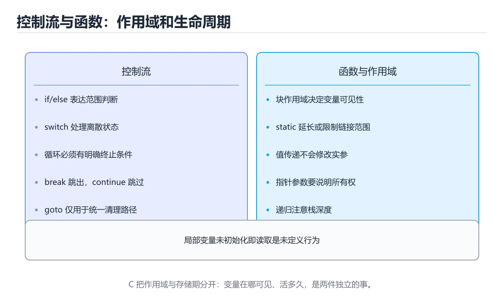
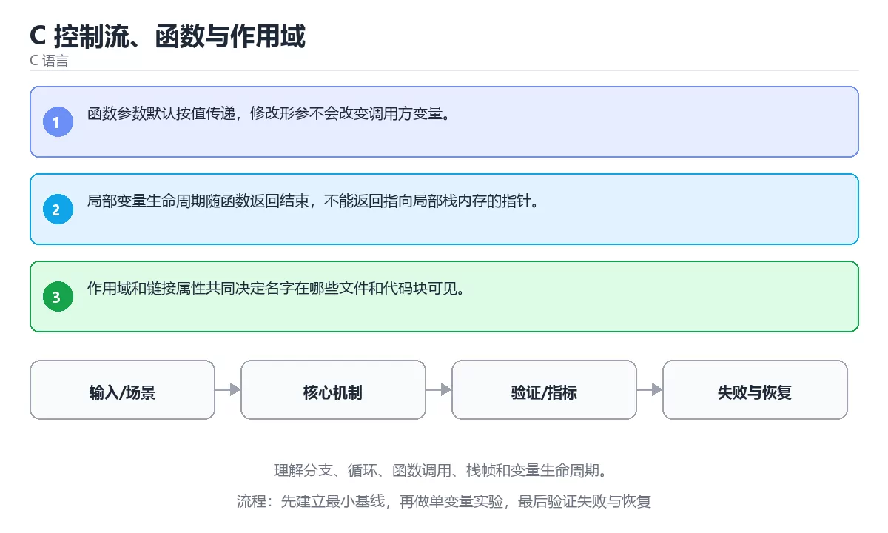

# C 控制流、函数与作用域





> 内容更新时间：2026-10-06 · 学习阶段：基础 · 预计用时：40 分钟

## 本节知识框架

**课程定位**：所属分类 `c`（C 语言），课程主题 `C 控制流、函数与作用域`，学习阶段 基础，建议用时 45 分钟。

本课主线：理解分支、循环、函数调用、栈帧和变量生命周期。

**学完本课应当能够**
- 说清 `控制流` 与 `函数` 的含义与区别，并各举一个正例和一个反例。
- 用本课示例验证 `作用域` 的行为，记录输入、输出与失败条件。
- 遇到「函数返回局部数组」这类问题时，能说出触发条件与修复顺序。

### 从概念到验证的学习链条

1. `控制流`：先掌握 程序根据顺序、条件和循环决定语句执行路径，再用它解释 `函数` 为什么会出现。
2. `函数`：先掌握 接收输入、执行确定逻辑并返回结果的代码单元，再用它解释 `作用域` 为什么会出现。
3. `作用域`：先掌握 二、运行时与内存模型：围绕「控制流、函数、作用域、栈帧」说明变量生命周期、资源释放、并发模型和错误传播，再用它解释 `栈帧` 为什么会出现。
4. `栈帧`：先掌握 每次函数调用在栈上建立的记录，保存返回地址、参数与局部变量，返回时整体弹出，再用它解释 本课示例的观察结果 为什么会出现。

**先修与衔接**：本课是「C 语言」分类的第 8 课。先修内容：《C 类型、运算符与转换》。《C 类型、运算符与转换》里的 `类型`、`溢出` 是本课的前提。相关或后续课程：《C 指针与内存模型》、《函数》、《函数、作用域与 this》、《语义分析与符号表》。

### 完成判据

- **定义关**：不看正文也能说明 `控制流` 是 程序根据顺序、条件和循环决定语句执行路径，并指出一个反例。
- **机制关**：能按“输入 → 转换 → 输出 → 验证”复述 `C 控制流、函数与作用域`，而不是只背结论。
- **示例关**：能运行或推演 `C 控制流、函数与作用域` 的 `text` 示例，并说明一个真实出现的标识符或字面量。
- **证据关**：能指出 `C 控制流、函数与作用域` 示例里的 调用了 `classify()`，并说明它支持或反驳了本课的哪一条结论。
- **排错关**：能复现 函数返回局部数组，记录现象并按 由调用方传入缓冲区，或返回堆内存并明确释放责任 修复。
- **迁移关**：能把 `控制流`、`函数`、`作用域`、`栈帧` 放进一个与 `C 控制流、函数与作用域` 不同的项目场景，并保持输入与验证条件可追踪。
- **复盘关**：学完 `C 控制流、函数与作用域` 后，用一句话写下仍然不确定的结论，并列出下一次验证需要的输入、环境和成功判据。

### 复习清单

- [ ] 能不看正文复述本课核心术语，并指出一个边界或反例。
- [ ] 能运行或推演本课示例，记录输入、输出与失败现象。
- [ ] 能完成一次自测，并把错题对照错误表定位原因。

## 核心概念定义

| 术语 | 操作性定义 | 常见边界与风险 |
| --- | --- | --- |
| 控制流 | 程序根据顺序、条件和循环决定语句执行路径。 | 只在「程序根据顺序、条件和循环决定语句执行路径」这一前提下成立，换输入或换环境要重新验证。 |
| 函数 | 接收输入、执行确定逻辑并返回结果的代码单元。 | 易错：函数结束后调用方拿到悬垂指针；正确做法是由调用方传入缓冲区，或返回堆内存并明确释放责任。 |
| 作用域 | 二、运行时与内存模型：围绕「控制流、函数、作用域、栈帧」说明变量生命周期、资源释放、并发模型和错误传播。 | 易错：使用已释放或未初始化的变量；正确做法是声明即初始化，并把变量作用域缩到最小。 |
| 栈帧 | 每次函数调用在栈上建立的记录，保存返回地址、参数与局部变量，返回时整体弹出。 | 越界、悬垂引用与释放顺序会破坏结论，必须在边界输入下复验。 |

## 原理与运行机制

### 机制总览

**教材衔接：核心知识**

### 1. 函数参数默认按值传递，修改形参不会改变调用方变量。

- 关键做法：先用 classify 建立 控制流 的基线，再逐步加入边界与失败条件。
- 验证标准：classify 的输出能被他人复现，边界输入有对应用例。

### 2. 局部变量生命周期随函数返回结束，不能返回指向局部栈内存的指针。

把这条结论放回「C 控制流、函数与作用域」的完整流程里展开：

- 正文依据：能用自己的话解释：函数参数默认按值传递，修改形参不会改变调用方变量。
- 落地检查：把「2. 局部变量生命周期随函数返回结束，不能返回指向局部栈内存的指针。」改写成一条可执行的核对项，逐条验证输入、超时与失败路径。

### 3. 作用域和链接属性共同决定名字在哪些文件和代码块可见。

把这条结论放回「C 控制流、函数与作用域」的完整流程里展开：

- 正文依据：能用自己的话解释：局部变量生命周期随函数返回结束，不能返回指向局部栈内存的指针。
- 落地检查：把「3. 作用域和链接属性共同决定名字在哪些文件和代码块可见。」改写成一条可执行的核对项，逐条验证输入、超时与失败路径。

**教材衔接：关键流程**

**教材衔接：实践路径**

**教材衔接：语言专项实践：C 控制流、函数与作用域**

### 一、工具链

| 阶段 | 推荐工具 | 验收标准 |
| --- | --- | --- |
| 编译 | gcc/clang -Wall -Wextra -Werror | 命令可复现且错误能被定位 |
| 调试 | gdb + core dump | 命令可复现且错误能被定位 |
| 内存检查 | AddressSanitizer / Valgrind | 命令可复现且错误能被定位 |
| 构建发布 | Makefile/CMake + 静态或动态链接 | 命令可复现且错误能被定位 |


### 四、发布检查

**教材衔接：版本与时效**

- 把标准版本写进构建配置，避免 函数 在不同环境下编译结果不一致。
- 编译器对未定义行为、严格别名与对齐的优化越来越激进
- 升级时重点回归位域、可变参数、内联汇编与结构体布局
- 语言参考：https://en.cppreference.com/w/c

### 升级检查清单

- 先固定当前版本，跑通全部示例与测验，再升级工具链。
- 升级时只动一个依赖版本，用 classify 记录构建与运行结果。
- 先回归 控制流 与 函数 的默认行为和错误信息，再扩大测试范围。
- 升级完成后更新本课「最后复核 / 下次复核」日期，并记录 控制流 的版本变化。

**教材衔接：零基础精讲：把C 控制流、函数与作用域真正讲透**

### 先建立一个直觉

本课的摘要可以当作一张地图：理解分支、循环、函数调用、栈帧和变量生命周期。

### 逐步拆解

1. 澄清输入与目标。先写清「C 控制流、函数与作用域」要解决的问题、合法输入范围和成功标准，再进入后续步骤。
2. 描述处理过程。把「控制流、函数、作用域、栈帧」映射到具体步骤，每步都要求能单独验证。
3. 定义输出。把 classify 的返回值、日志和失败信号都写清楚，缺一项都不算完整。
4. 关掉一个看似必要的检查（函数相关），观察哪个测试或指标先失败，用证据说明它为什么不能省。
5. 用 classify 贯穿一次小实验：先预测输出，再运行或逐步推演，最后解释差异来自哪一步。

### 把正文串成一条执行链

- **1. 函数参数默认按值传递，修改形参不会改变调用方变量。**：在「C 控制流、函数与作用域」里，「1. 函数参数默认按值传递，修改形参不会改变调用方变量。」这一步要先写清输入与预期，再记录实际结果和差异；结果不符时回到对应小节核对前提。
- **2. 局部变量生命周期随函数返回结束，不能返回指向局部栈内存的指针。**：在「C 控制流、函数与作用域」里，「2. 局部变量生命周期随函数返回结束，不能返回指向局部栈内存的指针。」这一步要先写清输入与预期，再记录实际结果和差异；结果不符时回到对应小节核对前提。
- **3. 作用域和链接属性共同决定名字在哪些文件和代码块可见。**：在「C 控制流、函数与作用域」里，「3. 作用域和链接属性共同决定名字在哪些文件和代码块可见。」这一步要先写清输入与预期，再记录实际结果和差异；结果不符时回到对应小节核对前提。
- 一、工具链：控制流 的阶段、推荐工具与验收标准
- **二、运行时与内存模型**：围绕「控制流、函数、作用域、栈帧」说明变量生命周期、资源释放、并发模型和错误传播
- **三、测试策略**：- 单元测试覆盖核心规则和边界

### 从测验反推易错点

- 参考判断：函数参数默认按值传递，修改形参不会改变调用方变量。
- 自问：如果去掉题干里的一个限定词，结论还成立吗？

- 参考判断：局部变量生命周期随函数返回结束，不能返回指向局部栈内存的指针。

- 参考判断：作用域和链接属性共同决定名字在哪些文件和代码块可见。

**检查点 4：本课的核心学习目标是什么？**

- 参考判断：理解分支、循环、函数调用、栈帧和变量生命周期。

- 参考判断：main


### 变式训练

1. 把 控制流 的实现压缩到一个进程内，去掉所有外部依赖后再谈扩展。
2. 把 控制流 的输入规模扩大十倍，记录时间、内存和失败路径，找出第一个瓶颈。
3. 让 classify 的外部依赖超时，确认系统能回滚或补偿，而不是留下脏数据。
5. 把 classify 的执行顺序调换一次，记录哪个中间结果先错；顺序敏感的地方就是本课的关键约束。
6. 在低带宽或低算力条件下重跑 函数，记录降级路径是否仍然可用。


### 迁移案例库

下面用不同约束重复同一套方法，每轮只改变 控制流 的一个取值并记录结论。

#### 迁移案例 1：围绕「控制流」做一次小实验

**验收**：控制流 的正常、边界、失败三条路径都要有结论；失败路径要写清恢复动作与「C 控制流、函数与作用域」里仍然存在的剩余风险。

#### 迁移案例 2：围绕「函数」做一次小实验

**步骤**：
1. 复述当前方案对「函数」的假设，写成一句可证伪的话。

#### 迁移案例 3：围绕「作用域」做一次小实验

**步骤**：
1. 复述当前方案对「作用域」的假设，写成一句可证伪的话。

#### 迁移案例 4：围绕「栈帧」做一次小实验

**步骤**：
1. 复述当前方案对「栈帧」的假设，写成一句可证伪的话。

#### 迁移案例 5：围绕「控制流」做一次小实验

**步骤**：

#### 迁移案例 6：围绕「函数」做一次小实验

**步骤**：

#### 迁移案例 7：围绕「作用域」做一次小实验

**步骤**：

#### 迁移案例 8：围绕「栈帧」做一次小实验

**步骤**：

#### 迁移案例 9：围绕「控制流」做一次小实验

**步骤**：

#### 迁移案例 10：围绕「函数」做一次小实验

**步骤**：

#### 迁移案例 11：围绕「作用域」做一次小实验

**步骤**：

#### 迁移案例 12：围绕「栈帧」做一次小实验

**步骤**：

#### 迁移案例 13：围绕「控制流」做一次小实验

**步骤**：

#### 迁移案例 14：围绕「函数」做一次小实验

**步骤**：

#### 迁移案例 15：围绕「作用域」做一次小实验

**步骤**：

#### 迁移案例 16：围绕「栈帧」做一次小实验

**步骤**：

<!-- p0-depth-v2:end -->

**教材衔接：验证步骤**

### 机制拆解：每一步的输入、动作与输出

#### 1. `控制流`
- 输入：`控制流`；本步把 程序根据顺序、条件和循环决定语句执行路径 当作判断规则。
- 动作：围绕 `控制流` 保留中间状态，并记录它与 `函数` 的对应关系。
- 输出：`函数`，它可以被下一段代码、测试或记录继续使用。
- `控制流` 的失败条件：只在「程序根据顺序、条件和循环决定语句执行路径」这一前提下成立，换输入或换环境要重新验证。

#### 2. `函数`
- 输入：`控制流`；本步把 接收输入、执行确定逻辑并返回结果的代码单元 当作判断规则。
- 动作：围绕 `函数` 保留中间状态，并记录它与 `作用域` 的对应关系。
- 输出：`作用域`，它可以被下一段代码、测试或记录继续使用。
- `函数` 的失败条件：当函数返回局部数组时，会出现函数结束后调用方拿到悬垂指针。

#### 3. `作用域`
- 输入：`函数`；本步把 二、运行时与内存模型：围绕「控制流、函数、作用域、栈帧」说明变量生命周期、资源释放、并发模型和错误传播 当作判断规则。
- 动作：围绕 `作用域` 保留中间状态，并记录它与 `栈帧` 的对应关系。
- 输出：`栈帧`，它可以被下一段代码、测试或记录继续使用。
- `作用域` 的失败条件：当忽略变量作用域与生命周期时，会出现使用已释放或未初始化的变量。

#### 4. `栈帧`
- 输入：`作用域`；本步把 每次函数调用在栈上建立的记录，保存返回地址、参数与局部变量，返回时整体弹出 当作判断规则。
- 动作：围绕 `栈帧` 保留中间状态，并记录它与 `classify` 的对应关系。
- 输出：`classify`，它可以被下一段代码、测试或记录继续使用。
- `栈帧` 的失败条件：越界、悬垂引用与释放顺序会破坏结论，必须在边界输入下复验。

### 示例中的可观察事实

1. 调用了 `classify()`；它对应的课程主题是 `C 控制流、函数与作用域`。
2. 调用了 `main()`；它对应的课程主题是 `C 控制流、函数与作用域`。
3. 调用了 `printf()`；它对应的课程主题是 `C 控制流、函数与作用域`。

### 复现实验记录

- 环境：`C 控制流、函数与作用域` 使用 `text` 示例，固定 `控制流`、`函数`、`作用域`、`栈帧` 作为第一组条件。
- 首轮输入：先确认 调用了 `classify()`，预测 `控制流` 会怎样变化。
- 基线观察：记录命令、输入、输出和错误原文，不用截图代替可复制的文本。
- 单变量修改：只改变 `控制流`，观察 `栈帧` 是否仍满足定义。
- 失败注入：复现 函数返回局部数组，确认现象是 函数结束后调用方拿到悬垂指针。
- 记录结论：把“修改前、修改后、预期变化、实际变化”写成四列表，这样复盘 `C 控制流、函数与作用域` 时才能区分概念错误与实现错误。

## 典型应用场景

- **函数返回局部数组**：典型现象是函数结束后调用方拿到悬垂指针；正确做法是由调用方传入缓冲区，或返回堆内存并明确释放责任。
- **忽略变量作用域与生命周期**：典型现象是使用已释放或未初始化的变量；正确做法是声明即初始化，并把变量作用域缩到最小。
- **递归没有终止条件**：典型现象是深度过大后栈溢出；正确做法是写清递归出口，并估算最坏递归深度。

### 最小验证场景

- 准备：保留 `text` 示例的原始输入，先记录 `C 控制流、函数与作用域` 的基线输出和完整运行命令。
- 观察：先核对 调用了 `classify()`，再改变一个与 `控制流` 相关的条件。
- 判定：新结果与 `C 控制流、函数与作用域` 的基线不同不等于错误；只有当差异破坏了 `控制流` 的定义或错误表中的约束，才判定为失败。

### 选择与边界

- 使用 `控制流` 时，先满足它的定义：程序根据顺序、条件和循环决定语句执行路径；只在「程序根据顺序、条件和循环决定语句执行路径」这一前提下成立，换输入或换环境要重新验证。
- 使用 `函数` 时，先满足它的定义：接收输入、执行确定逻辑并返回结果的代码单元；易错：函数结束后调用方拿到悬垂指针；正确做法是由调用方传入缓冲区，或返回堆内存并明确释放责任。
- 使用 `作用域` 时，先满足它的定义：二、运行时与内存模型：围绕「控制流、函数、作用域、栈帧」说明变量生命周期、资源释放、并发模型和错误传播；易错：使用已释放或未初始化的变量；正确做法是声明即初始化，并把变量作用域缩到最小。
- 使用 `栈帧` 时，先满足它的定义：每次函数调用在栈上建立的记录，保存返回地址、参数与局部变量，返回时整体弹出；越界、悬垂引用与释放顺序会破坏结论，必须在边界输入下复验。

## 代码/协议/SQL 示例

### 最小可验证示例

**教材衔接：最小可运行示例**

下面的示例覆盖「C 控制流、函数与作用域」中 控制流 的核心路径。先原样运行，再按注释改一处：

```c
#include <stdio.h>

int classify(int value) {
    if (value < 0) return -1;
    if (value == 0) return 0;
    return 1;
}

int main(void) {
    printf("%d %d %d\n", classify(-5), classify(0), classify(7));
    return 0;
}
```

**教材衔接：预期输出**

```text
-1 0 1
```

### 示例精读：先找证据，再改一个条件

1. 调用了 `classify()`；它出现在 `C 控制流、函数与作用域` 的示例中，阅读时先确认它前后各发生了什么。
2. 调用了 `main()`；它出现在 `C 控制流、函数与作用域` 的示例中，阅读时先确认它前后各发生了什么。
3. 调用了 `printf()`；它出现在 `C 控制流、函数与作用域` 的示例中，阅读时先确认它前后各发生了什么。
- 在 `C 控制流、函数与作用域` 中与 `控制流` 对照：示例必须能支持 程序根据顺序、条件和循环决定语句执行路径，否则说明这一段还缺少实现或验证步骤。
- 在 `C 控制流、函数与作用域` 中与 `函数` 对照：示例必须能支持 接收输入、执行确定逻辑并返回结果的代码单元，否则说明这一段还缺少实现或验证步骤。
- 在 `C 控制流、函数与作用域` 中与 `作用域` 对照：示例必须能支持 二、运行时与内存模型：围绕「控制流、函数、作用域、栈帧」说明变量生命周期、资源释放、并发模型和错误传播，否则说明这一段还缺少实现或验证步骤。
- 在 `C 控制流、函数与作用域` 中与 `栈帧` 对照：示例必须能支持 每次函数调用在栈上建立的记录，保存返回地址、参数与局部变量，返回时整体弹出，否则说明这一段还缺少实现或验证步骤。

## 时间/空间复杂度或性能分析

**性能关注点（C 控制流、函数与作用域）**：内存布局与系统调用是主要成本：记录运行时间、内存占用与系统调用次数。

**本课特有开销（C 控制流、函数与作用域 · 控制流）**：并发度提高后要观察是否出现拐点：延迟上升而吞吐不增，说明瓶颈已转移。

**测量方法**：以 `C 控制流、函数与作用域` 的 `控制流` 场景为对象，固定输入跑一遍记录基线，再把规模或并发度提高一个数量级复测；两次结果的差值与波动范围才是结论依据。

### 需要控制的变量与记录项

- `C 控制流、函数与作用域` 的 `控制流`：固定它的版本、输入范围和资源上限，分别记录速度、内存与失败率的变化。
- `C 控制流、函数与作用域` 的 `函数`：固定它的版本、输入范围和资源上限，分别记录速度、内存与失败率的变化。
- `C 控制流、函数与作用域` 的 `作用域`：固定它的版本、输入范围和资源上限，分别记录速度、内存与失败率的变化。
- `C 控制流、函数与作用域` 的 `栈帧`：固定它的版本、输入范围和资源上限，分别记录速度、内存与失败率的变化。
- `C 控制流、函数与作用域` 中 `控制流` 的边界：只在「程序根据顺序、条件和循环决定语句执行路径」这一前提下成立，换输入或换环境要重新验证。达到边界时不要外推，必须重新测量。
- `C 控制流、函数与作用域` 中 `函数` 的边界：易错：函数结束后调用方拿到悬垂指针；正确做法是由调用方传入缓冲区，或返回堆内存并明确释放责任。达到边界时不要外推，必须重新测量。
- `C 控制流、函数与作用域` 中 `作用域` 的边界：易错：使用已释放或未初始化的变量；正确做法是声明即初始化，并把变量作用域缩到最小。达到边界时不要外推，必须重新测量。
- `C 控制流、函数与作用域` 中 `栈帧` 的边界：越界、悬垂引用与释放顺序会破坏结论，必须在边界输入下复验。达到边界时不要外推，必须重新测量。
- `C 控制流、函数与作用域` 的代码证据：先验证 调用了 `classify()`，再记录该路径的输入规模与耗时；只看代码行数不能推出复杂度。

## 常见误区与易错点

| 容易写错的做法 | 实际现象 | 原因与正确做法 |
| --- | --- | --- |
| 函数返回局部数组 | 函数结束后调用方拿到悬垂指针。 | 由调用方传入缓冲区，或返回堆内存并明确释放责任。 |
| 忽略变量作用域与生命周期 | 使用已释放或未初始化的变量。 | 声明即初始化，并把变量作用域缩到最小。 |
| 递归没有终止条件 | 深度过大后栈溢出。 | 写清递归出口，并估算最坏递归深度。 |

### 现场 1：函数返回局部数组

**症状**：函数结束后调用方拿到悬垂指针。

**根因与修复**：由调用方传入缓冲区，或返回堆内存并明确释放责任。

**自检**：在本课示例里复现「函数返回局部数组」，改成由调用方传入缓冲区，或返回堆内存并明确释放责任后重跑；如果症状消失且失败路径按预期变化，说明定位正确。

### 现场 2：忽略变量作用域与生命周期

**症状**：使用已释放或未初始化的变量。

**根因与修复**：声明即初始化，并把变量作用域缩到最小。

**自检**：在本课示例里复现「忽略变量作用域与生命周期」，改成声明即初始化，并把变量作用域缩到最小后重跑；如果症状消失且失败路径按预期变化，说明定位正确。

### 现场 3：递归没有终止条件

**症状**：深度过大后栈溢出。

**根因与修复**：写清递归出口，并估算最坏递归深度。

**自检**：在本课示例里复现「递归没有终止条件」，改成写清递归出口，并估算最坏递归深度后重跑；如果症状消失且失败路径按预期变化，说明定位正确。

## 与其他知识点的关系

| 关系 | 课程 | 为什么 |
| --- | --- | --- |
| 先修 | 《C 类型、运算符与转换》 | 本课会直接使用它的概念或操作前提。 |
| 关联 | 《C 指针与内存模型》 | 用于横向比较或把本课结论迁移到相邻主题。 |
| 关联 | 《函数》 | 用于横向比较或把本课结论迁移到相邻主题。 |
| 关联 | 《函数、作用域与 this》 | 用于横向比较或把本课结论迁移到相邻主题。 |
| 关联 | 《语义分析与符号表》 | 用于横向比较或把本课结论迁移到相邻主题。 |
| 前置顺序 | 《C 类型、运算符与转换》 | 同分类中安排在本课之前，建议先完成其自测。 |
| 后续顺序 | 《C 指针与内存模型》 | 同分类中安排在本课之后，会继续使用本课术语。 |

**教材衔接：复习与迁移**

### 概念复述

- 用一句话说明「C 控制流、函数与作用域」解决什么问题：理解分支、循环、函数调用、栈帧和变量生命周期。
- 写出控制流、函数、作用域之间的关系，并各举一个例子。
- 说出本课最容易混淆的两个概念，以及区分它们的判据。

### 正文逐节复核

- **语言专项实践：C 控制流、函数与作用域**：围绕「控制流、函数、作用域、栈帧」说明变量生命周期、资源释放、并发模型和错误传播。
- **零基础精讲：把C 控制流、函数与作用域真正讲透**：本课的摘要可以当作一张地图：理解分支、循环、函数调用、栈帧和变量生命周期。


### 迁移练习

把「C 控制流、函数与作用域」的结论迁移到相邻主题，每次迁移都写清预测与证据：

- **先修**：`C 类型、运算符与转换`。本课默认这些内容已经掌握。
- **相关或后续**：`C 指针与内存模型`、`函数`、`函数、作用域与 this`、`语义分析与符号表`。本课术语会在这些课程里继续使用。
- **术语归属**：`控制流`、`函数`、`作用域` 的定义以本课「核心概念定义」为准，换到其他课程时先确认定义是否被改写。

### 先修与后续术语接口

- `函数`：共享术语 `函数`，共同关键词 `函数`、`作用域`。
- `C 类型、运算符与转换`：两者通过本分类的学习顺序衔接，阅读时重点比较各自的输入与失败条件。
- `C 指针与内存模型`：两者通过本分类的学习顺序衔接，阅读时重点比较各自的输入与失败条件。
- `函数、作用域与 this`：共享术语 `函数`、`作用域`，共同关键词 `函数`、`作用域`。
- `语义分析与符号表`：共享术语 `作用域`、`控制流`，共同关键词 `作用域`、`控制流`。

### 容易混淆的相邻概念

- `控制流` 与 `函数`：前者强调 程序根据顺序、条件和循环决定语句执行路径；后者强调 接收输入、执行确定逻辑并返回结果的代码单元。判断时分别检查两条定义的适用范围，不要只看名称相似就互换。
- `函数` 与 `作用域`：前者强调 接收输入、执行确定逻辑并返回结果的代码单元；后者强调 二、运行时与内存模型：围绕「控制流、函数、作用域、栈帧」说明变量生命周期、资源释放、并发模型和错误传播。判断时分别检查两条定义的适用范围，不要只看名称相似就互换。
- `作用域` 与 `栈帧`：前者强调 二、运行时与内存模型：围绕「控制流、函数、作用域、栈帧」说明变量生命周期、资源释放、并发模型和错误传播；后者强调 每次函数调用在栈上建立的记录，保存返回地址、参数与局部变量，返回时整体弹出。判断时分别检查两条定义的适用范围，不要只看名称相似就互换。

## 自测题与参考答案

> 先独立作答，再对照参考答案；答案都能在本课正文、术语表或错误表里找到依据。

### 自测 1（概念复述）

不看正文，写出 `控制流` 的操作性定义，并说明它与 `函数` 的区别。

**参考答案**：程序根据顺序、条件和循环决定语句执行路径。

`函数` 的定位是：接收输入、执行确定逻辑并返回结果的代码单元；两者的差别要从适用对象与失败模式上说明。

### 自测 2（排错）

本课错误表记录了「函数返回局部数组」这类做法。请写出它会出现的现象、根因，以及修复顺序。

**参考答案**：现象是函数结束后调用方拿到悬垂指针；正确做法是由调用方传入缓冲区，或返回堆内存并明确释放责任。修复时先复现现象并保留证据，再改动一处假设重跑，确认现象消失。

### 自测 3（动手验证）

运行本课的 `text` 示例，改动其中一个输入后重新运行，记录输出与错误信息。

**参考答案**：正常输入下 `text` 示例应当复现正文给出的结果；改动输入后，如果结果改变或报错，先核对它是否满足 `C 控制流、函数与作用域` 中`控制流` 的适用范围，再检查错误表里是否有同类现象。

### 自测 4（代码阅读）

阅读本课开头的 `text` 示例，说明它体现了`控制流` 的哪一条性质，并指出改动哪个输入会让这条性质不再成立。

**参考答案**：`控制流` 的定义是 程序根据顺序、条件和循环决定语句执行路径，示例正是在实现这条定义。改动与 `控制流` 有关的一个输入后，如果结果不再符合 `C 控制流、函数与作用域` 的正文描述，就说明该性质只在当前前提成立。

### 自测 5（迁移）

把 `C 控制流、函数与作用域` 的方法迁移到自己的项目：围绕 `控制流` 写出一个与错误表同类的风险点，并说明触发条件和检验方式。

**参考答案**：例如「递归没有终止条件」，它会导致深度过大后栈溢出；检验方式是按写清递归出口，并估算最坏递归深度改一处再复现，确认现象消失且没有引入新的失败分支。

### 自测 6（对比）

用一个表格对比 `控制流` 与 `函数`：各写一行适用场景、一行失败表现。

**参考答案**：`控制流` 的定义是程序根据顺序、条件和循环决定语句执行路径；`函数` 的定义是接收输入、执行确定逻辑并返回结果的代码单元。两者的失败表现分别对应本课错误表里与本术语相关的行。

### 自测 7（排错顺序）

面对「函数返回局部数组」引发的问题，请把“复现 函数结束后调用方拿到悬垂指针 → 保留证据 → 由调用方传入缓冲区，或返回堆内存并明确释放责任 → 回归验证”四步写成可执行的检查清单。

**参考答案**：第一步按函数结束后调用方拿到悬垂指针复现；第二步记录输入、版本与完整报错；第三步按由调用方传入缓冲区，或返回堆内存并明确释放责任只改一处；第四步重跑并确认失败路径也按预期变化。

### 自测 8（边界判断）

针对 `栈帧`，分别写出“可以使用”的条件和“结论不再成立”的条件。

**参考答案**：越界、悬垂引用与释放顺序会破坏结论，必须在边界输入下复验。 同时要把 `栈帧` 的定义 每次函数调用在栈上建立的记录，保存返回地址、参数与局部变量，返回时整体弹出 与实际输入逐项对照。

### 自测 9（机制重建）

不看正文，按输入、转换、输出、验证四段重建 `控制流` → `函数` → `作用域` → `栈帧` 的作用链。

**参考答案**：起点是 `控制流` 的定义 程序根据顺序、条件和循环决定语句执行路径；中间每一步都保留可观察状态；终点由 `栈帧` 检查，失败时回到错误表定位第一个偏离定义的步骤。

### 自测 10（综合排错）

在 `C 控制流、函数与作用域` 中，现象是 深度过大后栈溢出。请围绕 递归没有终止条件 写出最小复现、关键证据、修复动作和回归验证，并说明为什么不能只凭一次运行下结论。

**参考答案**：先复现 递归没有终止条件，记录输入与完整错误；再按 写清递归出口，并估算最坏递归深度 只改一处。回归时同时跑正常路径和边界路径，只有两次结果都可解释，才把修复视为完成。

### 自测 11（一分钟复述）

用每分钟约 200 字的速度复述 `C 控制流、函数与作用域`：先给主问题，再按顺序说出 `控制流`、`函数`、`作用域`、`栈帧`，最后给一个失败案例。

**自评标准**：主问题必须对应 理解分支、循环、函数调用、栈帧和变量生命周期；每个术语都要能接上一句定义或边界；失败案例必须写成可观察现象，不能用“可能有风险”代替证据。

## 术语速查

| 术语 | 一句话说明 |
| --- | --- |
| `控制流` | 程序根据顺序、条件和循环决定语句执行路径。 |
| `函数` | 接收输入、执行确定逻辑并返回结果的代码单元。 |
| `作用域` | 二、运行时与内存模型：围绕「控制流、函数、作用域、栈帧」说明变量生命周期、资源释放、并发模型和错误传播。 |
| `栈帧` | 每次函数调用在栈上建立的记录，保存返回地址、参数与局部变量，返回时整体弹出。 |

**术语关系**：`控制流`（程序根据顺序、条件和循环决定语句执行路径） → `函数`（接收输入、执行确定逻辑并返回结果的代码单元） → `作用域`（二、运行时与内存模型：围绕「控制流、函数、作用域、栈帧」说明变量生命周期、资源释放、并发模型和错误传播） → `栈帧`（每次函数调用在栈上建立的记录）。

## 考点精讲

`C 控制流、函数与作用域` 的题库有 6 道题，下面逐题给出题干、正确项与判断依据：先自己作答，再核对正确项，最后回到正文对应小节复核。

### 考点 1：第 1 题

- **题目**：在 `C 控制流、函数与作用域` 里，与 `控制流` 有关的说法中，哪一项最符合理解分支、循环、函数调用、栈帧和变量生命周期。？
- **正确项**：函数参数默认按值传递，修改形参不会改变调用方变量。
- **判断依据**：这道题落在术语 `控制流` 上：程序根据顺序、条件和循环决定语句执行路径。复习时把 `控制流` 的定义、适用边界和一个反例一起说清楚，再回到「核心概念定义」核对原文。

### 考点 2：第 2 题

- **题目**：阅读 `C 控制流、函数与作用域` 中围绕 `控制流` 的代码；课程主线是理解分支、循环、函数调用、栈帧和变量生命周期。下面哪项判断最准确？
- **正确项**：理解分支、循环、函数调用、栈帧和变量生命周期。
- **判断依据**：这道题落在术语 `控制流` 上：程序根据顺序、条件和循环决定语句执行路径。复习时把 `控制流` 的定义、适用边界和一个反例一起说清楚，再回到「核心概念定义」核对原文。

### 考点 3：第 3 题

- **题目**：在 `C 控制流、函数与作用域` 里，与 `控制流` 有关的说法中，哪一项最符合理解分支、循环、函数调用、栈帧和变量生命周期。？（C 控制流、函数与作用域·C 语言 第 3 题）
- **正确项**：作用域和链接属性共同决定名字在哪些文件和代码块可见。
- **判断依据**：这道题落在术语 `控制流` 上：程序根据顺序、条件和循环决定语句执行路径。复习时把 `控制流` 的定义、适用边界和一个反例一起说清楚，再回到「核心概念定义」核对原文。

### 考点 4：第 4 题

- **题目**：`C 控制流、函数与作用域` 的主线是：理解分支、循环、函数调用、栈帧和变量生命周期。下面哪一项与这条主线一致？
- **正确项**：理解分支、循环、函数调用、栈帧和变量生命周期。
- **判断依据**：这道题落在术语 `控制流` 上：程序根据顺序、条件和循环决定语句执行路径。复习时把 `控制流` 的定义、适用边界和一个反例一起说清楚，再回到「核心概念定义」核对原文。

### 考点 5：第 5 题

- **题目**：填空：补齐下面这段术语说明中的空缺。课程 `理解分支、循环、函数调用、栈帧和变量生命周期。`，这段说明是：`____`：每次函数调用在栈上建立的记录，保存返回地址、参数与局部变量，返回时整体弹出。空缺处应填哪个术语？
- **正确项**：栈帧
- **判断依据**：这道题落在术语 `函数` 上：接收输入、执行确定逻辑并返回结果的代码单元。复习时把 `函数` 的定义、适用边界和一个反例一起说清楚，再回到「核心概念定义」核对原文。

### 考点 6：第 6 题

- **题目**：关于 `控制流`，下列哪些说法与 `C 控制流、函数与作用域` 的正文一致？判断时以理解分支、循环、函数调用、栈帧和变量生命周期。为主线。（多选）
- **正确项**：局部变量生命周期随函数返回结束，不能返回指向局部栈内存的指针；函数参数默认按值传递，修改形参不会改变调用方变量
- **判断依据**：这道题落在术语 `控制流` 上：程序根据顺序、条件和循环决定语句执行路径。复习时把 `控制流` 的定义、适用边界和一个反例一起说清楚，再回到「核心概念定义」核对原文。

### 考点 7：`控制流`

- **要点**：程序根据顺序、条件和循环决定语句执行路径。
- **控制流 的边界**：只在「程序根据顺序、条件和循环决定语句执行路径」这一前提下成立，换输入或换环境要重新验证。

### 考点 8：`函数`

- **要点**：接收输入、执行确定逻辑并返回结果的代码单元。
- **函数 的边界**：易错：函数结束后调用方拿到悬垂指针；正确做法是由调用方传入缓冲区，或返回堆内存并明确释放责任。

### 考点 9：`作用域`

- **要点**：二、运行时与内存模型：围绕「控制流、函数、作用域、栈帧」说明变量生命周期、资源释放、并发模型和错误传播。
- **作用域 的边界**：易错：使用已释放或未初始化的变量；正确做法是声明即初始化，并把变量作用域缩到最小。

### 考点 10：`栈帧`

- **要点**：每次函数调用在栈上建立的记录，保存返回地址、参数与局部变量，返回时整体弹出。
- **栈帧 的边界**：越界、悬垂引用与释放顺序会破坏结论，必须在边界输入下复验。

### 考点 11：排错——函数返回局部数组

- **现象**：函数结束后调用方拿到悬垂指针。
- **处理**：由调用方传入缓冲区，或返回堆内存并明确释放责任。

### 考点 12：排错——忽略变量作用域与生命周期

- **现象**：使用已释放或未初始化的变量。
- **处理**：声明即初始化，并把变量作用域缩到最小。

### 考点 13：综合辨析——`控制流` 与 `栈帧`

- **辨析点**：`控制流` 的定义是 程序根据顺序、条件和循环决定语句执行路径；`栈帧` 的定义是 每次函数调用在栈上建立的记录，保存返回地址、参数与局部变量，返回时整体弹出。
- **答题要求**：面对 `C 控制流、函数与作用域` 的题目，先判断描述的是 `控制流` 还是 `栈帧`，再归到对应定义，最后写出一个会让该定义失效的边界输入。

### 考点 14：排错评分点

- **现象分**：能写出 函数结束后调用方拿到悬垂指针，而不是只写“程序有错”。
- **证据分**：保留触发 函数返回局部数组 的输入、版本和错误原文。
- **修复分**：按 由调用方传入缓冲区，或返回堆内存并明确释放责任 只改一处，并同时回归正常路径与边界路径。

## 内容元数据

- 内容版本：v2.0
- 最后更新：2026-10-06
- 学习阶段：基础
- 适用环境：C11 / GCC 或 Clang；本课聚焦 控制流。
- 内容来源：内置结构化课程与工程实践整理
- 相关主题：控制流、函数、作用域、栈帧
- 质量版本：P0 测验标准 + P1 覆盖扩展 + P2 体验补全

## 参考资料与复核

- 最后复核：2026-10-04
- 下次复核：2026-11-17
- 复核范围：版本兼容、API 行为、安全建议与工程实践
- 来源性质：官方文档、标准或权威教材；本课核对关键词：控制流、函数、作用域、栈帧。

| 参考资料 | 本课用途 |
| --- | --- |
| [GCC 文档](https://gcc.gnu.org/onlinedocs/) | 编译、链接与警告选项 |
| [POSIX 标准](https://pubs.opengroup.org/onlinepubs/9799919799/) | 可移植系统接口标准 |
| [Valgrind 文档](https://valgrind.org/docs/manual/manual.html) | 内存错误与泄漏检测 |

| [本课术语索引：C 控制流、函数与作用域](#核心概念定义) | 按本课输入、术语边界和错误表现逐项核对 |
> 「C 控制流、函数与作用域」的链接用于离线阅读后的延伸核对；App 不会自动联网。