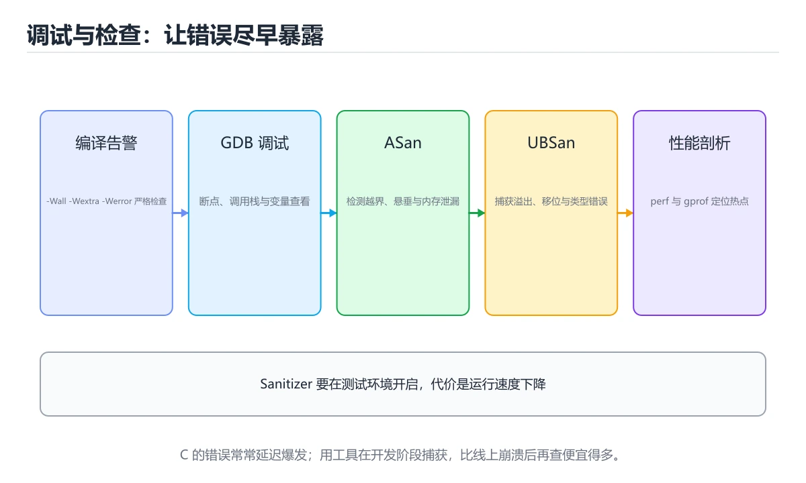
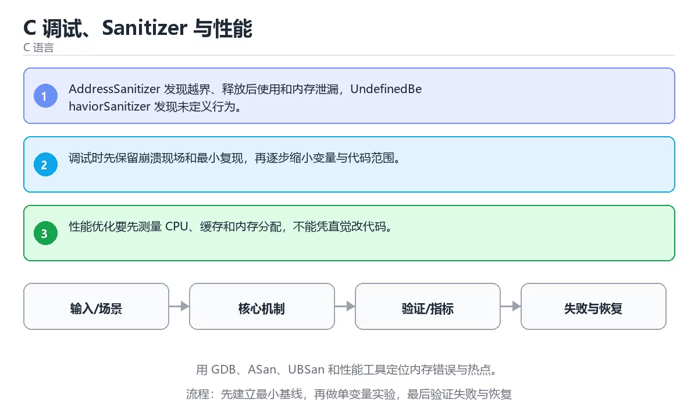

# C 调试、Sanitizer 与性能

> 内容更新时间：2026-10-06 · 学习阶段：高级 · 预计用时：45 分钟





## 本节知识框架

**课程定位**：所属分类为「C 语言」，课程主题为「C 调试、Sanitizer 与性能」，学习阶段为「高级」，建议用时 45 分钟。

**本课要解决的主问题**：用 GDB、ASan、UBSan 和性能工具定位内存错误与热点。

| 学习层次 | 要回答的问题 | 完成判据 |
| --- | --- | --- |
| 概念层 | 「C 调试、Sanitizer 与性能」有哪些必须区分的对象与术语？ | 能用自己的话定义核心术语，并各举一个正例和一个反例。 |
| 机制层 | 这些对象按什么顺序发生作用，输入如何变成输出？ | 能画出或写出机制步骤，并说明每一步的失败条件。 |
| 应用层 | 什么场景适合使用「C 调试、Sanitizer 与性能」，什么场景不适合？ | 能给出一个真实场景、一个最小示例和一个边界案例。 |
| 性能层 | 时间、空间、吞吐或延迟受哪些量影响？ | 能说出复杂度或性能瓶颈的证据来源；没有证据时明确写“材料未提供”。 |
| 复习层 | 怎样确认自己不是只记住了结论？ | 能独立完成本课自测，并把错误定位到概念、机制、示例或边界。 |

### 阅读路线

1. 先读「核心概念定义」，建立「GDB」等对象的精确定义。
2. 再读「原理与运行机制」，把定义串成可重复的过程。
3. 用「代码/协议/SQL 示例」验证过程，并只改一个条件观察结果变化。
4. 最后检查性能、易错点、知识关系与自测题，形成可复习的证据链。

**前置知识**：《C 文件、错误处理与资源管理》

**学习位置**：本课位于《C 文件、错误处理与资源管理》之后；如果前一课的自测不能通过，应先回补再继续。

**后续衔接**：下一课《实战：C 命令行任务管理器》会继续使用本课术语，学完后建议立即完成一次自测。

**教材衔接：学习目标**

- 能用自己的话解释：AddressSanitizer 发现越界、释放后使用和内存泄漏，UndefinedBehaviorSanitizer 发现未定义行为。
- 能用自己的话解释：调试时先保留崩溃现场和最小复现，再逐步缩小变量与代码范围。
- 能用自己的话解释：性能优化要先测量 CPU、缓存和内存分配，不能凭直觉改代码。
- 能把本课知识放回「C 语言」，并完成练习与测验。

**教材衔接：前置知识**

- 能运行 divide 所在的示例环境，并读懂报错信息。
- 本课关键词：GDB、ASan、UBSan、性能。
- 遇到不熟悉的术语先记录问题，完成练习后再回读。

**教材衔接：本课小结**

- 本课围绕 GDB、ASan、UBSan、性能 展开，复习时重点核对它们的输入、输出和失败路径。
- 完成练习和测验后，把 GDB 上仍然不确定的问题写成下一轮验证清单。

## 核心概念定义

> 阅读约定：本课先给「C 调试、Sanitizer 与性能」相关术语的操作性定义与适用边界；正文里的口语化说法与定义冲突时，以定义和可复现示例为准。

| 术语 | 操作性定义 | 本课中的边界 |
| --- | --- | --- |
| GDB | GNU 调试器：可设断点、单步执行、查看栈帧与变量，是定位 C 程序崩溃的主力工具。 | 仅在「C 调试、Sanitizer 与性能」明确给出的输入、版本与资源条件下成立。 |
| 性能 | 二、运行时与内存模型：围绕「GDB、ASan、UBSan、性能」说明变量生命周期、资源释放、并发模型和错误传播。 | 仅在「C 调试、Sanitizer 与性能」明确给出的输入、版本与资源条件下成立。 |
| 最小复现 | 能稳定触发问题的最短输入与步骤，配合断点可以把排查范围缩到最小。 | 仅在「C 调试、Sanitizer 与性能」明确给出的输入、版本与资源条件下成立。 |
| 地址消毒器 | ASan、UBSan 一类的编译期插桩工具，在越界、悬垂指针和未定义行为发生时就报出位置。 | 仅在「C 调试、Sanitizer 与性能」明确给出的输入、版本与资源条件下成立。 |

### 定义如何使用

在「C 调试、Sanitizer 与性能」中判断一个说法是否成立，先确认它使用的是哪个对象的定义，再检查输入规模、运行环境与失败路径。定义不是口号，而是后续推导、代码示例和自测题共享的约束。

## 原理与运行机制

### 机制总览

1. **建立输入**：把「GDB」按本课定义整理成可观察、可重复的输入条件。
2. **执行转换**：围绕「性能」执行本课的核心步骤；每一步都记录中间状态，避免只看最终输出。
3. **产生输出**：得到「最小复现」后，用正文示例或协议/SQL 结果核对输出是否符合预期。
4. **改变一个条件**：只替换一个边界条件或环境参数，观察「C 调试、Sanitizer 与性能」的结论是否仍然成立。

| 阶段 | 关注对象 | 失败时应检查 |
| --- | --- | --- |
| 输入 | GDB | 类型、范围、编码、版本或前置状态是否满足定义。 |
| 处理 | 性能 | 顺序、可见性、锁、路由、事务或调度规则是否被破坏。 |
| 输出 | 最小复现 | 结果是否可复现，错误是否被正确传播而不是被吞掉。 |

本课的机制结论要用「C 调试、Sanitizer 与性能」自己的示例验证。「C 调试、Sanitizer 与性能」没有给出某个数量级、吞吐或内存数据时，本课把该判断标为“材料未提供”，不从相邻主题外推。

**教材衔接：核心知识**

### 1. AddressSanitizer 发现越界、释放后使用和内存泄漏，UndefinedBehaviorSanitizer 发现未定义行为。

- 关键做法：基线只保留 ASan 必需的部分，其余条件一次加一个。
- 验证标准：divide 的输出能被他人复现，边界输入有对应用例。

### 2. 调试时先保留崩溃现场和最小复现，再逐步缩小变量与代码范围。

把这条结论放回「C 调试、Sanitizer 与性能」的完整流程里展开：

- 正文依据：能用自己的话解释：性能优化要先测量 CPU、缓存和内存分配，不能凭直觉改代码。
- 落地检查：把「2. 调试时先保留崩溃现场和最小复现，再逐步缩小变量与代码范围。」改写成一条可执行的核对项，逐条验证输入、超时与失败路径。

### 3. 性能优化要先测量 CPU、缓存和内存分配，不能凭直觉改代码。

把这条结论放回「C 调试、Sanitizer 与性能」的完整流程里展开：

- 正文依据：本课关键词：GDB、ASan、UBSan、性能。
- 落地检查：把「3. 性能优化要先测量 CPU、缓存和内存分配，不能凭直觉改代码。」改写成一条可执行的核对项，逐条验证输入、超时与失败路径。

**教材衔接：关键流程**

```text
输入 → 校验 → 核心处理 → 验证 → 记录指标 → 失败恢复
```

**教材衔接：实践路径**

1. 用一句话复述本课要解决的问题。
2. 跑通正文中的最小示例并记录基线。
3. 只改变一个输入或参数，预测并验证结果。
4. 补一个失败路径，记录错误、恢复和指标。
5. 把结论写成可复现的笔记或测试。

**教材衔接：版本与时效**

- 先确认编译器支持的标准版本，再决定 divide 能否使用新特性。
- 编译器对未定义行为、严格别名与对齐的优化越来越激进
- 升级时重点回归位域、可变参数、内联汇编与结构体布局
- 语言参考：https://en.cppreference.com/w/c

### 升级检查清单

- 先固定当前版本，跑通全部示例与测验，再升级工具链。
- 只改 GDB 的版本变量，记录编译、测试与产物体积的变化。
- 先回归 GDB 与 ASan 的默认行为和错误信息，再扩大测试范围。
- 升级后把 divide 的实测版本写进「内容元数据」，再更新复核日期。

**教材衔接：验证步骤**

1. 记录运行环境、命令和真实输出。
2. 修改一个输入，先写预测再运行。
4. 把结论写回本课笔记或测试用例。

## 典型应用场景

| 场景 | 典型输入或前提 | 期望产物 |
| --- | --- | --- |
| 学习验证 | 使用本课最小示例和 GDB、ASan | 能复现正文结论，并解释每一步。 |
| 工程落地 | 把「C 调试、Sanitizer 与性能」放入真实模块或服务边界 | 输出可观测、失败可定位、参数可配置。 |
| 故障排查 | 只改一个版本、规模、输入或依赖条件 | 能区分概念错误、实现错误和环境差异。 |

判断「C 调试、Sanitizer 与性能」的场景是否成立，标准是能否写出输入、处理、输出和失败路径；材料中没有出现的数据在本课标注为“材料未提供”，不用推测替代证据。

**课程内置实验入口**：`sandbox:cpp`，用于动手验证《C 调试、Sanitizer 与性能》的机制；实验结论不替代概念定义与复杂度分析。

## 代码/协议/SQL 示例

### 最小可验证示例

下面保留《C 调试、Sanitizer 与性能》原文中的最小示例。先预测《C 调试、Sanitizer 与性能》示例的输出，再按正文步骤运行或推演；示例依赖外部环境时，同时记录版本与输入。

```text
输入 → 校验 → 核心处理 → 验证 → 记录指标 → 失败恢复
```

**教材衔接：最小可运行示例**

下面示例用于验证 GDB 的最小输入、处理和输出。先原样运行，再只修改一个值：

```c
#include <assert.h>
#include <stdio.h>

int divide(int a, int b) {
    assert(b != 0);
    return a / b;
}

int main(void) {
    printf("result=%d\n", divide(42, 6));
    return 0;
}
```

**教材衔接：预期输出**

```text
result=7
```

## 时间/空间复杂度或性能分析

**复杂度证据**：「C 调试、Sanitizer 与性能」的现有材料没有给出渐近时间或空间复杂度的明确结论，本课只做定性检查，不补写未经验证的 $O$ 记号。

| 维度 | 本课关注点 | 判断依据 |
| --- | --- | --- |
| 时间/延迟 | 「C 调试、Sanitizer 与性能」的主要步骤是否会随输入规模、并发度或网络往返增长。 | 以正文复杂度、基准数据或可重复测量为准。 |
| 空间/内存 | 中间状态、缓存、副本、连接或索引是否随规模增长。 | 记录峰值内存与数据副本，不只看最终结果。 |
| 吞吐/资源 | 版本、调度、锁、IO、序列化或协议开销是否成为瓶颈。 | 固定环境做对照实验，改变一个变量。 |

评估「C 调试、Sanitizer 与性能」时要区分“正确性成立”和“性能达标”两件事；材料没有给出基准时，本课只保留量级来源与测量方法，不写不可验证的绝对数字。

**教材衔接：语言专项实践：C 调试、Sanitizer 与性能**

### 一、工具链

| 阶段 | 推荐工具 | 验收标准 |
| --- | --- | --- |
| 编译 | gcc/clang -Wall -Wextra -Werror | 命令可复现且错误能被定位 |
| 调试 | gdb + core dump | 命令可复现且错误能被定位 |
| 内存检查 | AddressSanitizer / Valgrind | 命令可复现且错误能被定位 |
| 构建发布 | Makefile/CMake + 静态或动态链接 | 命令可复现且错误能被定位 |

### 二、运行时与内存模型

围绕「GDB、ASan、UBSan、性能」说明变量生命周期、资源释放、并发模型和错误传播。语言语法只是入口，真正决定行为的是运行时、标准库和平台约束。

### 三、测试策略

- 单元测试覆盖核心规则和边界。
- 集成测试覆盖文件、网络、数据库或平台 API。
- 失败测试覆盖超时、取消、异常和资源耗尽。
- 性能测试记录基线，避免只凭感觉优化。

### 四、发布检查

- [ ] 版本和依赖锁定，构建可复现。
- [ ] 产物经过签名、校验和最小权限配置。
- [ ] 日志不泄露密钥和个人信息。
- [ ] 有升级、回滚和故障恢复说明。

**教材衔接：零基础精讲：把C 调试、Sanitizer 与性能真正讲透**

### 先建立一个直觉

本课的摘要可以当作一张地图：用 GDB、ASan、UBSan 和性能工具定位内存错误与热点。

### 逐步拆解

1. 澄清输入与目标。先写清「C 调试、Sanitizer 与性能」要解决的问题、合法输入范围和成功标准，再进入后续步骤。
2. 描述处理过程。把「GDB、ASan、UBSan、性能」映射到具体步骤，每步都要求能单独验证。
3. 定义输出。明确 GDB 与 ASan 各自的产物，以及失败时留下什么证据。
4. 制造一次ASan的失败输入，确认错误出现在「核心知识」的哪一步，并写下恢复后如何验证状态已回到一致。
5. 用 divide 构造一个最小反例，证明「C 调试、Sanitizer 与性能」的结论有边界。

### 把正文串成一条执行链

- **1. AddressSanitizer 发现越界、释放后使用和内存泄漏，UndefinedBehaviorSanitizer 发现未定义行为。**：在「C 调试、Sanitizer 与性能」里，「1. AddressSanitizer 发现越界、释放后使用和内存泄漏，UndefinedBehaviorSanitizer 发现未定义行为。」这一步要先写清输入与预期，再记录实际结果和差异；结果不符时回到对应小节核对前提。
- **2. 调试时先保留崩溃现场和最小复现，再逐步缩小变量与代码范围。**：在「C 调试、Sanitizer 与性能」里，「2. 调试时先保留崩溃现场和最小复现，再逐步缩小变量与代码范围。」这一步要先写清输入与预期，再记录实际结果和差异；结果不符时回到对应小节核对前提。
- **3. 性能优化要先测量 CPU、缓存和内存分配，不能凭直觉改代码。**：在「C 调试、Sanitizer 与性能」里，「3. 性能优化要先测量 CPU、缓存和内存分配，不能凭直觉改代码。」这一步要先写清输入与预期，再记录实际结果和差异；结果不符时回到对应小节核对前提。
- 一、工具链：GDB 的阶段、推荐工具与验收标准
- **二、运行时与内存模型**：围绕「GDB、ASan、UBSan、性能」说明变量生命周期、资源释放、并发模型和错误传播
- **三、测试策略**：- 单元测试覆盖核心规则和边界

### 从测验反推易错点

**检查点 1：关于「AddressSanitizer 发现越界，释放后使用和内存泄漏」，下列说法正确的是？**

- 参考判断：AddressSanitizer 发现越界，释放后使用和内存泄漏
- 自问：如果去掉题干里的一个限定词，结论还成立吗？

**检查点 2：关于「调试时先保留崩溃现场和最小复现，再逐步缩小变量与代码范围。」，下列说法正确的是？**

- 参考判断：调试时先保留崩溃现场和最小复现，再逐步缩小变量与代码范围。

**检查点 3：关于「性能优化要先测量 CPU、缓存和内存分配，不能凭直觉改代码。」，下列说法正确的是？**

- 参考判断：性能优化要先测量 CPU、缓存和内存分配，不能凭直觉改代码。

**检查点 4：本课的核心学习目标是什么？**

- 参考判断：用 GDB、ASan、UBSan 和性能工具定位内存错误与热点。

- 参考判断：main

### 工程排错顺序

| 先查什么 | 要得到的证据 | 判断标准 |
| --- | --- | --- |
| 输入与前提是否满足 | 日志、输入样例、测试或指标 | 能复现并解释，才算定位 |
| 核心步骤是否产生了预期中间结果 | 日志、输入样例、测试或指标 | 能复现并解释，才算定位 |
| 失败路径是否可观测、可恢复 | 日志、输入样例、测试或指标 | 能复现并解释，才算定位 |
| 资源、权限与成本是否在预算内 | 日志、输入样例、测试或指标 | 能复现并解释，才算定位 |

### 变式训练

1. 先用一个单文件示例验证 divide，确认正确性后再引入框架或分布式组件。
2. 扩大 ASan 的规模，记录本课结论在哪一个量级开始不成立。
3. 让 divide 的外部依赖超时，确认系统能回滚或补偿，而不是留下脏数据。
5. 把「C 调试、Sanitizer 与性能」里最容易被省略的一步去掉，用测试或指标证明它不可省略，而不是凭感觉判断。
6. 把 GDB 的方案切换到低资源设备，重新评估默认参数、超时和降级策略。

### 本课自测

- [ ] 能用一句话解释「GDB」在本课中的角色与边界。
- [ ] 能举出一个正常例子和一个失败例子。
- [ ] 能说出最小验证步骤，以及需要记录的证据。
- [ ] 能用一句话解释「ASan」在本课中的角色与边界。
- [ ] 能用一句话解释「UBSan」在本课中的角色与边界。
- [ ] 能用一句话解释「性能」在本课中的角色与边界。

### 迁移案例库

换一个 ASan 约束重做一次，确认结论在新条件下是否仍然成立。

#### 迁移案例 1：围绕「GDB」做一次小实验

**目标**：在不改变课程主体的前提下，验证C 调试、Sanitizer 与性能中的一个关键判断。

**步骤**：
1. 复述当前方案对「GDB」的假设，写成一句可证伪的话。
2. 设计一个正常输入和一个边界输入，分别预测输出。
3. 运行或逐步演算，记录实际输出、耗时和失败信息。
4. 只调整一个参数，比较前后差异并解释原因。
5. 补充一条测试或复习卡，确保下次能更快复现。

**验收**：迁移过程要留下 divide 的可运行记录，并说明ASan在新场景下是否仍然成立。

#### 迁移案例 2：围绕「ASan」做一次小实验

**步骤**：
1. 复述当前方案对「ASan」的假设，写成一句可证伪的话。

#### 迁移案例 3：围绕「UBSan」做一次小实验

**步骤**：
1. 复述当前方案对「UBSan」的假设，写成一句可证伪的话。

#### 迁移案例 4：围绕「性能」做一次小实验

**步骤**：
1. 复述当前方案对「性能」的假设，写成一句可证伪的话。

#### 迁移案例 5：围绕「GDB」做一次小实验

**步骤**：

#### 迁移案例 6：围绕「ASan」做一次小实验

**步骤**：

#### 迁移案例 7：围绕「UBSan」做一次小实验

**步骤**：

#### 迁移案例 8：围绕「性能」做一次小实验

**步骤**：

#### 迁移案例 9：围绕「GDB」做一次小实验

**步骤**：

#### 迁移案例 10：围绕「ASan」做一次小实验

**步骤**：

#### 迁移案例 11：围绕「UBSan」做一次小实验

**步骤**：

#### 迁移案例 12：围绕「性能」做一次小实验

**步骤**：

#### 迁移案例 13：围绕「GDB」做一次小实验

**步骤**：

#### 迁移案例 14：围绕「ASan」做一次小实验

**步骤**：

#### 迁移案例 15：围绕「UBSan」做一次小实验

**步骤**：

#### 迁移案例 16：围绕「性能」做一次小实验

**步骤**：

<!-- p0-depth-v2:end -->

## 常见误区与易错点

> 复核《C 调试、Sanitizer 与性能》的易错点时，优先保留原文的错误表、故障现场与排错路径；每条修正都要能用本课示例复验。

| 易错点 | 常见表现 | 正确做法 |
| --- | --- | --- |
| 只背结论 | 能复述「C 调试、Sanitizer 与性能」的定义，却说不清输入、输出与边界。 | 回到机制步骤，用最小示例逐一验证。 |
| 混淆相邻概念 | 把本课对象与相邻主题的对象当成同一类。 | 先比较定义、资源归属、生命周期和失败模式。 |
| 忽略版本与环境 | 在开发机通过后直接外推到生产环境。 | 固定版本、输入和资源条件，再记录可复现结果。 |

**教材衔接：常见错误与排查**

> 说明：本表由《C 调试、Sanitizer 与性能》的核心知识整理（2026-10-07），人工复核进度见 docs/content_review_batches.md。

| 易错点 | 容易踩的做法 | 正确结论 |
| --- | --- | --- |
| 只靠打印调试 | 内存越界与悬垂指针看不出来 | 用 Sanitizer 与调试器定位，打印只作为辅助证据 |
| 打开优化后再调试 | 变量被优化掉，行号与代码不对应 | 先用 -O0 -g 复现，再用 -O2 验证线上行为 |
| 忽略未定义行为 | 换个编译器或优化级别结果就变 | 用 Sanitizer 与静态检查排除越界、悬垂与数据竞争 |

**教材衔接：故障现场**

### 现场 1：只靠打印调试

**症状**：在《C 调试、Sanitizer 与性能》的复现场景中，内存越界与悬垂指针看不出来。

**根因**：触发点是把“只靠打印调试”当成安全做法。它没有满足《C 调试、Sanitizer 与性能》要求的前提，因此先表现为“内存越界与悬垂指针看不出来”；排查时先完整复现这一段，再核对输入、配置与依赖。

**修复**：针对《C 调试、Sanitizer 与性能》的问题，用 Sanitizer 与调试器定位，打印只作为辅助证据。

**验证**：在《C 调试、Sanitizer 与性能》中按“用 Sanitizer 与调试器定位，打印只作为辅助证据”调整后，从“只靠打印调试”的触发条件重放同一条路径，确认“内存越界与悬垂指针看不出来”不再出现，并补一个相邻边界用例检查没有引入新问题。

### 现场 2：打开优化后再调试

**症状**：在《C 调试、Sanitizer 与性能》的复现场景中，变量被优化掉，行号与代码不对应。

**根因**：触发点是把“打开优化后再调试”当成安全做法。它没有满足《C 调试、Sanitizer 与性能》要求的前提，因此先表现为“变量被优化掉，行号与代码不对应”；排查时先完整复现这一段，再核对输入、配置与依赖。

**修复**：针对《C 调试、Sanitizer 与性能》的问题，先用 -O0 -g 复现，再用 -O2 验证线上行为。

**验证**：在《C 调试、Sanitizer 与性能》中按“先用 -O0 -g 复现，再用 -O2 验证线上行为”调整后，从“打开优化后再调试”的触发条件重放同一条路径，确认“变量被优化掉，行号与代码不对应”不再出现，并补一个相邻边界用例检查没有引入新问题。

### 现场 3：忽略未定义行为

**症状**：在《C 调试、Sanitizer 与性能》的复现场景中，换个编译器或优化级别结果就变。

**根因**：当出现“忽略未定义行为”时，执行路径已经绕过了《C 调试、Sanitizer 与性能》的关键约束，最终以“换个编译器或优化级别结果就变”暴露出来；修复前必须先确认约束在哪里失效。

**修复**：针对《C 调试、Sanitizer 与性能》的问题，用 Sanitizer 与静态检查排除越界、悬垂与数据竞争。

**验证**：保留《C 调试、Sanitizer 与性能》里触发“换个编译器或优化级别结果就变”的输入、版本和日志，按“用 Sanitizer 与静态检查排除越界、悬垂与数据竞争”完成修改后原样重放；只有失败现象消失且相邻场景仍可解释，才保留改动。

## 与其他知识点的关系

| 关系 | 课程 | 为什么 |
| --- | --- | --- |
| 先修 | 《C 文件、错误处理与资源管理》 | 本课会直接使用它的概念或操作前提。 |
| 关联 | 《实战：C 命令行任务管理器》 | 用于横向比较或把本课结论迁移到相邻主题。 |
| 前置顺序 | 《C 文件、错误处理与资源管理》 | 同分类中安排在本课之前，建议先完成其自测。 |
| 后续顺序 | 《实战：C 命令行任务管理器》 | 同分类中安排在本课之后，会继续使用本课术语。 |

把「C 调试、Sanitizer 与性能」放回知识体系时，不只要记住“前面学过什么”，还要说明两个主题在输入、机制、资源边界和失败模式上的差异。这样才能把单课知识迁移到项目、排障和后续课程。

**教材衔接：复习与迁移**

复习目标：把「C 调试、Sanitizer 与性能」的判断标准放回可复现的例子里。先自己作答，再对照依据；如果结论正确但理由不完整，回到正文补足前提。

### 概念复述

- 用一句话说明「C 调试、Sanitizer 与性能」解决什么问题：用 GDB、ASan、UBSan 和性能工具定位内存错误与热点。
- 写出GDB、ASan、UBSan之间的关系，并各举一个例子。
- 说出本课最容易混淆的两个概念，以及区分它们的判据。

### 正文逐节复核

- **语言专项实践：C 调试、Sanitizer 与性能**：围绕「GDB、ASan、UBSan、性能」说明变量生命周期、资源释放、并发模型和错误传播。
- **零基础精讲：把C 调试、Sanitizer 与性能真正讲透**：本课的摘要可以当作一张地图：用 GDB、ASan、UBSan 和性能工具定位内存错误与热点。

### 测验回顾

1. 关于「AddressSanitizer 发现越界，释放后使用和内存泄漏」，下列说法正确的是？
   - 依据：在「C 调试、Sanitizer 与性能」里，AddressSanitizer 发现越界，释放后使用和内存泄漏。这道题的关键在「C 调试、Sanitizer 与性能」的GDB、ASan、UBSan：先确认题干“关于AddressSanitizer”问的是哪一步，再排除偷换前提的选项。
2. 关于「调试时先保留崩溃现场和最小复现，再逐步缩小变量与代码范围。」，下列说法正确的是？
   - 依据：在「C 调试、Sanitizer 与性能」里，调试时先保留崩溃现场和最小复现，再逐步缩小变量与代码范围。在「C 调试、Sanitizer 与性能」里判断这道题，要把GDB、ASan、UBSan的条件、过程与失败路径逐项对齐，换成“关于调试时先保留崩溃现场和最小复现”这个场景，只有满足前提的结论才成立。
3. 关于「性能优化要先测量 CPU、缓存和内存分配，不能凭直觉改代码。」，下列说法正确的是？
   - 依据：在「C 调试、Sanitizer 与性能」里，性能优化要先测量 CPU、缓存和内存分配，不能凭直觉改代码。在「C 调试、Sanitizer 与性能」里判断这道题，要把GDB、ASan、UBSan的条件、过程与失败路径逐项对齐，换成“关于性能优化要先测量 CPU、缓存和”这个场景，只有满足前提的结论才成立。
4. 围绕“C 调试、Sanitizer 与性能”中的 GDB、ASan、UBSan，下列哪两项是本课强调的实践判断？
   - 依据：结论应落在学习 GDB 时要同时说明输入、输出和失败路径。本课把C 调试、Sanitizer 与性能拆成概念、示例与故障现场三部分，因此判断 GDB 时必须同时交代输入、输出和失败路径，这使“学习 GDB 时要同时说明输入、输出和失败路径，不能只看正常流程”成立。在C 调试、Sanitizer 与性能里，判断 ASan 时要固定版本与边界输入，所以“验证 ASan 时要固定版本并覆盖边界输入，结论才可复现”才可复现。
5. 补全代码：「C 调试、Sanitizer 与性能」示例中，下面这行代码缺少哪个关键字或函数名？请填入 ____。

`int ____(void) {`
   - 依据：把“main”代回「C 调试、Sanitizer 与性能」里“C 调试、Sanitizer 与性能示例中”的例子核对，条件一旦改变，结论就要用GDB、ASan、UBSan重新推导。「C 调试、Sanitizer 与性能」要求先交代GDB、ASan、UBSan的前提再下结论，所以“main”只在题干“Sanitizer”给定的条件下成立。
1. 阅读「C 调试、Sanitizer 与性能」的代码片段，下面哪项判断是正确的？
   - 依据：在「C 调试、Sanitizer 与性能」里，AddressSanitizer 发现越界，释放后使用和内存泄漏。“Sanitizer”与「C 调试、Sanitizer 与性能」的术语表相呼应，只有符合GDB、ASan、UBSan约束的“AddressSanitizer 发现越”才是正文支持的结论。

### 迁移练习

把「C 调试、Sanitizer 与性能」的结论迁移到相邻主题，每次迁移都写清预测与证据：

1. 换输入：用GDB处理一组你自己的数据，对比教材示例的结果差异。
2. 换失败条件：制造一个ASan相关的错误，说明如何从错误信息定位根因。
3. 换规模：把数据量或并发度提高一个数量级，说明「C 调试、Sanitizer 与性能」的结论是否仍成立。

## 自测题与参考答案

> 先独立作答《C 调试、Sanitizer 与性能》的自测题，再对照答案与解析；每处判断都要能在本课正文或示例中找到依据。

### 自测 1

关于「AddressSanitizer 发现越界，释放后使用和内存泄漏」，下列说法正确的是？

A. C 程序从 main 开始执行，源文件经过预处理、编译、汇编和链接成为可执行文件。
B. 整数类型有固定最小宽度但平台实现可能不同，跨平台代码要用固定宽度类型。
C. 函数参数默认按值传递，修改形参不会改变调用方变量。
D. AddressSanitizer 发现越界，释放后使用和内存泄漏

**参考答案**：AddressSanitizer 发现越界，释放后使用和内存泄漏

**解析**：在「C 调试、Sanitizer 与性能」里，AddressSanitizer 发现越界，释放后使用和内存泄漏。这道题的关键在「C 调试、Sanitizer 与性能」的GDB、ASan、UBSan：先确认题干“关于AddressSanitizer”问的是哪一步，再排除偷换前提的选项。

### 自测 2

围绕“C 调试、Sanitizer 与性能”中的 GDB、ASan、UBSan，下列哪两项是本课强调的实践判断？

A. 学习 GDB 时要同时说明输入、输出和失败路径，不能只看正常流程
B. 只要 GDB 的常规示例通过，就可以跳过边界与异常路径
C. 验证 ASan 时要固定版本并覆盖边界输入，结论才可复现
D. 把 ASan 的单次运行结果当成所有版本和规模都成立

**参考答案**：学习 GDB 时要同时说明输入、输出和失败路径，不能只看正常流程；验证 ASan 时要固定版本并覆盖边界输入，结论才可复现

**解析**：结论应落在学习 GDB 时要同时说明输入、输出和失败路径。本课把C 调试、Sanitizer 与性能拆成概念、示例与故障现场三部分，因此判断 GDB 时必须同时交代输入、输出和失败路径，这使“学习 GDB 时要同时说明输入、输出和失败路径，不能只看正常流程”成立。在C 调试、Sanitizer 与性能里，判断 ASan 时要固定版本与边界输入，所以“验证 ASan 时要固定版本并覆盖边界输入，结论才可复现”才可复现。

### 自测 3

补全代码：「C 调试、Sanitizer 与性能」示例中，下面这行代码缺少哪个关键字或函数名？请填入 ____。

`int ____(void) {`

**参考答案**：main

**解析**：把“main”代回「C 调试、Sanitizer 与性能」里“C 调试、Sanitizer 与性能示例中”的例子核对，条件一旦改变，结论就要用GDB、ASan、UBSan重新推导。「C 调试、Sanitizer 与性能」要求先交代GDB、ASan、UBSan的前提再下结论，所以“main”只在题干“Sanitizer”给定的条件下成立。

**教材衔接：动手练习**

1. 合上教程，用 3～5 句话解释C 调试、Sanitizer 与性能。
2. 从正文选一个例子，改变一个条件并预测结果。
3. 设计一个失败场景，写出止损与恢复步骤。

**验收标准**：留下输入、命令、输出、差异和下一步问题。

**教材衔接：可运行练习**

### 任务 1：先跑通，再解释

```c
#include <assert.h>
#include <stdio.h>

int divide(int a, int b) {
    assert(b != 0);
    return a / b;
}

int main(void) {
    printf("result=%d\n", divide(42, 6));
    return 0;
}
```

**预期输出**：result=%d\n

### 任务 2：只改一个条件

把「C 调试、Sanitizer 与性能」的最小示例复制一份，只改一个条件再跑一次：

- 改动点：把 ASan 换成边界值，其他输入保持原样。
- 预测：先写下「C 调试、Sanitizer 与性能」在改动后的输出或错误信息，再运行。
- 记录：对照改动前后的结果，指出差异出在哪一步。
- 验收：换回原条件能复现原结果，改动只影响GDB。

### 任务 3：迁移到自己的数据

把 divide 换成你自己的输入，先保持步骤不变，再比较输出差异。

**教材衔接：本课复习清单**

离开本课前，逐项确认：

- [ ] 不看解析，能说出「关于「AddressSanitizer 发现越界，释放后使用和内存泄漏」，下列说法正确的是？」的判断依据。
- [ ] 不看解析，能说出「关于「调试时先保留崩溃现场和最小复现，再逐步缩小变量与代码范围。」，下列说法正确的是？」的判断依据。
- [ ] 不看解析，能说出「关于「性能优化要先测量 CPU、缓存和内存分配，不能凭直觉改代码。」，下列说法正确的是？」的判断依据。
- [ ] 至少运行一次《C 调试、Sanitizer 与性能》的示例，记录输入、输出和一个边界情况。
- [ ] 把本课最容易混淆的两个概念写成一句话对照。

| 复盘项 | 记录 |
| --- | --- |
| 已经能独立解释的考点 |  |
| 仍然说不清的概念 |  |
| 下一步验证动作 |  |

**教材衔接：复习与自测**

下面按正文顺序回顾「C 调试、Sanitizer 与性能」的每一节；说不清的地方回到 核心知识 补课。

### 核心知识

自检：这一节与相邻主题的边界在哪里？

### 动手练习

自检：如果去掉这一节里的一个前提，结论会怎样变化？

### 语言专项实践：C 调试、Sanitizer 与性能

自检：用自己的话复述这一节，并举一个反例。

### 最小可运行示例

```c
#include <assert.h>
#include <stdio.h>

int divide(int a, int b) {
    assert(b != 0);
    return a / b;
}

int main(void) {
    printf("result=%d\n", divide(42, 6));
    return 0;
}
```

自检：把这一节讲给没学过的人，最需要强调哪一点？

### 预期输出

```text
result=7
```

### 验证步骤

制造一次错误输入，记录错误信息与修复方式。

---

## 术语速查

| 术语 | 一句话说明 |
| --- | --- |
| `GDB` | GNU 调试器：可设断点、单步执行、查看栈帧与变量，是定位 C 程序崩溃的主力工具。 |
| `性能` | 二、运行时与内存模型：围绕「GDB、ASan、UBSan、性能」说明变量生命周期、资源释放、并发模型和错误传播。 |
| `最小复现` | 能稳定触发问题的最短输入与步骤，配合断点可以把排查范围缩到最小。 |
| `地址消毒器` | ASan、UBSan 一类的编译期插桩工具，在越界、悬垂指针和未定义行为发生时就报出位置。 |

## 考点精讲

### 考点 1：概念判断·GDB

- **题目**：关于「AddressSanitizer 发现越界，释放后使用和内存泄漏」，下列说法正确的是？
- **判断依据**：在「C 调试、Sanitizer 与性能」里，AddressSanitizer 发现越界，释放后使用和内存泄漏。这道题的关键在「C 调试、Sanitizer 与性能」的GDB、ASan、UBSan：先确认题干“关于AddressSanitizer”问的是哪一步，再排除偷换前提的选项。

### 考点 2：概念判断·GDB

- **题目**：关于「调试时先保留崩溃现场和最小复现，再逐步缩小变量与代码范围。」，下列说法正确的是？
- **判断依据**：在「C 调试、Sanitizer 与性能」里，调试时先保留崩溃现场和最小复现，再逐步缩小变量与代码范围。在「C 调试、Sanitizer 与性能」里判断这道题，要把GDB、ASan、UBSan的条件、过程与失败路径逐项对齐，换成“关于调试时先保留崩溃现场和最小复现”这个场景，只有满足前提的结论才成立。

### 考点 3：概念判断·GDB

- **题目**：关于「性能优化要先测量 CPU、缓存和内存分配，不能凭直觉改代码。」，下列说法正确的是？
- **判断依据**：在「C 调试、Sanitizer 与性能」里，性能优化要先测量 CPU、缓存和内存分配，不能凭直觉改代码。在「C 调试、Sanitizer 与性能」里判断这道题，要把GDB、ASan、UBSan的条件、过程与失败路径逐项对齐，换成“关于性能优化要先测量 CPU、缓存和”这个场景，只有满足前提的结论才成立。

### 考点 4：多选辨析·GDB

- **题目**：围绕“C 调试、Sanitizer 与性能”中的 GDB、ASan、UBSan，下列哪两项是本课强调的实践判断？
- **判断依据**：结论应落在学习 GDB 时要同时说明输入、输出和失败路径。本课把C 调试、Sanitizer 与性能拆成概念、示例与故障现场三部分，因此判断 GDB 时必须同时交代输入、输出和失败路径，这使“学习 GDB 时要同时说明输入、输出和失败路径，不能只看正常流程”成立。在C 调试、Sanitizer 与性能里，判断 ASan 时要固定版本与边界输入，所以“验证 ASan 时要固定版本并覆盖边界输入，结论才可复现”才可复现。

### 考点 5：填空·int ____(void) {

- **题目**：补全代码：「C 调试、Sanitizer 与性能」示例中，下面这行代码缺少哪个关键字或函数名？请填入 ____。 `int ____(void) {`
- **判断依据**：把“main”代回「C 调试、Sanitizer 与性能」里“C 调试、Sanitizer 与性能示例中”的例子核对，条件一旦改变，结论就要用GDB、ASan、UBSan重新推导。「C 调试、Sanitizer 与性能」要求先交代GDB、ASan、UBSan的前提再下结论，所以“main”只在题干“Sanitizer”给定的条件下成立。

### 考点 6：排错·GDB

- **题目**：阅读「C 调试、Sanitizer 与性能」的代码片段，下面哪项判断是正确的？
- **判断依据**：在「C 调试、Sanitizer 与性能」里，AddressSanitizer 发现越界，释放后使用和内存泄漏。“Sanitizer”与「C 调试、Sanitizer 与性能」的术语表相呼应，只有符合GDB、ASan、UBSan约束的“AddressSanitizer 发现越”才是正文支持的结论。

## English Overview

**Title:** C Debugging, Sanitizers and Performance

**Summary:** Use GDB, ASan, UBSan and profilers to find memory bugs and hotspots.

**Category:** C
**Level:** 高级
**Key terms:** GDB, ASan, UBSan, 性能

## 内容元数据

- 内容版本：v2.0
- 最后更新：2026-10-06
- 学习阶段：高级
- 适用环境：C11 / GCC 或 Clang；本课聚焦 GDB。
- 内容来源：内置结构化课程与工程实践整理
- 相关主题：GDB、ASan、UBSan、性能
- 质量版本：P0 测验标准 + P1 覆盖扩展 + P2 体验补全

## 参考资料与复核

- 最后复核：2026-10-04
- 下次复核：2026-11-17
- 复核范围：版本兼容、API 行为、安全建议与工程实践
- 来源性质：官方文档、标准或权威教材；正文为离线教学重组

| 参考资料 | 本课用途 |
| --- | --- |
| [GDB 文档](https://sourceware.org/gdb/documentation/) | C 程序调试与崩溃定位 |
| [GCC 文档](https://gcc.gnu.org/onlinedocs/) | 编译、链接与警告选项 |
| [cppreference C 语言](https://en.cppreference.com/w/c/language) | C 语言规则与语义 |

> 「C 调试、Sanitizer 与性能」的链接用于离线阅读后的延伸核对；App 不会自动联网。
