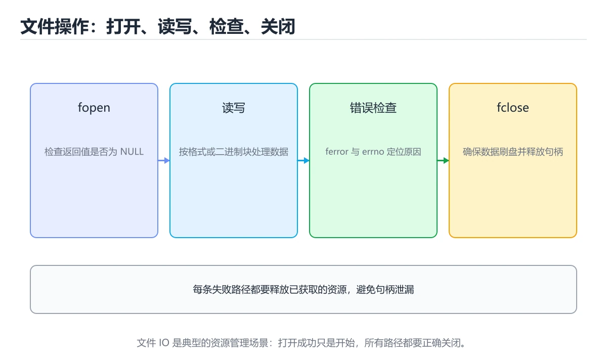

# C 文件、错误处理与资源管理




> 内容更新时间：2026-10-06 · 学习阶段：进阶 · 预计用时：35 分钟

## 学习目标

- 能用自己的话解释：文件操作每一步都要检查返回值，并区分打开失败、读写失败和关闭失败。
- 能用自己的话解释：错误发生后要保证已分配的内存、文件描述符和锁都能释放。
- 能用自己的话解释：二进制与文本模式、换行转换和缓冲区刷新在跨平台时容易产生差异。
- 能把本课知识放回「C 语言」，并完成练习与测验。

## 前置知识

- 已完成本分类的基础课程，能独立运行 文件 的最小示例。
- 本课关键词：文件、errno、资源释放、错误处理。
- 遇到不熟悉的术语先记录问题，完成练习后再回读。

## 核心知识

### 1. 文件操作每一步都要检查返回值，并区分打开失败、读写失败和关闭失败。

- 关键做法：基线只保留 errno 必需的部分，其余条件一次加一个。
- 验证标准：FILE 的输出能被他人复现，边界输入有对应用例。

### 2. 错误发生后要保证已分配的内存、文件描述符和锁都能释放。

把这条结论放回「C 文件、错误处理与资源管理」的完整流程里展开：

- 正文依据：能用自己的话解释：文件操作每一步都要检查返回值，并区分打开失败、读写失败和关闭失败。
- 落地检查：把「2. 错误发生后要保证已分配的内存、文件描述符和锁都能释放。」改写成一条可执行的核对项，逐条验证输入、超时与失败路径。

### 3. 二进制与文本模式、换行转换和缓冲区刷新在跨平台时容易产生差异。

把这条结论放回「C 文件、错误处理与资源管理」的完整流程里展开：

- 正文依据：能用自己的话解释：错误发生后要保证已分配的内存、文件描述符和锁都能释放。
- 落地检查：把「3. 二进制与文本模式、换行转换和缓冲区刷新在跨平台时容易产生差异。」改写成一条可执行的核对项，逐条验证输入、超时与失败路径。

## 关键流程

```text
输入 → 校验 → 核心处理 → 验证 → 记录指标 → 失败恢复
```

## 实践路径

1. 用一句话复述本课要解决的问题。
2. 跑通正文中的最小示例并记录基线。
3. 只改变一个输入或参数，预测并验证结果。
4. 补一个失败路径，记录错误、恢复和指标。
5. 把结论写成可复现的笔记或测试。

## 常见错误与排查

> 说明：本表由《C 文件、错误处理与资源管理》的核心知识整理（2026-10-07），人工复核进度见 docs/content_review_batches.md。

| 易错点 | 容易踩的做法 | 正确结论 |
| --- | --- | --- |
| 不检查打开文件的结果 | 空指针解引用直接崩溃 | 每次打开后检查返回值，并给出可解释的错误信息 |
| 打开文件忘记关闭 | 文件描述符耗尽，后续操作全部失败 | 所有分支统一走清理路径，包括错误与提前返回 |
| 用文件结束标志控制循环 | 最后一行被处理两次 | 用读取函数的返回值判断循环是否结束 |

## 动手练习

1. 合上教程，用 3～5 句话解释C 文件、错误处理与资源管理。
2. 从正文选一个例子，改变一个条件并预测结果。
3. 设计一个失败场景，写出止损与恢复步骤。

**验收标准**：留下输入、命令、输出、差异和下一步问题。

## 本课小结

- 本课围绕 文件、errno、资源释放、错误处理 展开，复习时重点核对它们的输入、输出和失败路径。
- 做完本课测验后，把答错且解释不清的 errno 相关题目记成验证任务。


## 语言专项实践：C 文件、错误处理与资源管理

### 一、工具链

| 阶段 | 推荐工具 | 验收标准 |
| --- | --- | --- |
| 编译 | gcc/clang -Wall -Wextra -Werror | 命令可复现且错误能被定位 |
| 调试 | gdb + core dump | 命令可复现且错误能被定位 |
| 内存检查 | AddressSanitizer / Valgrind | 命令可复现且错误能被定位 |
| 构建发布 | Makefile/CMake + 静态或动态链接 | 命令可复现且错误能被定位 |

### 二、运行时与内存模型

围绕「文件、errno、资源释放、错误处理」说明变量生命周期、资源释放、并发模型和错误传播。语言语法只是入口，真正决定行为的是运行时、标准库和平台约束。

### 三、测试策略

- 单元测试覆盖核心规则和边界。
- 集成测试覆盖文件、网络、数据库或平台 API。
- 失败测试覆盖超时、取消、异常和资源耗尽。
- 性能测试记录基线，避免只凭感觉优化。

### 四、发布检查

- [ ] 版本和依赖锁定，构建可复现。
- [ ] 产物经过签名、校验和最小权限配置。
- [ ] 日志不泄露密钥和个人信息。
- [ ] 有升级、回滚和故障恢复说明。

## 可运行练习

### 任务 1：先跑通，再解释

```c
#include <stdio.h>

int main(void) {
    FILE *file = fopen("notes.txt", "w");
    if (file == NULL) {
        perror("fopen");
        return 1;
    }
    fputs("hello file\n", file);
    fclose(file);
    printf("wrote notes.txt\n");
    return 0;
}
```

**预期输出**：wrote notes.txt\n

### 任务 2：只改一个条件

把「C 文件、错误处理与资源管理」的最小示例复制一份，只改一个条件再跑一次：

- 改动点：把 errno 换成边界值，其他输入保持原样。
- 预测：先写下「C 文件、错误处理与资源管理」在改动后的输出或错误信息，再运行。
- 记录：对照改动前后的结果，指出差异出在哪一步。
- 验收：换回原条件能复现原结果，改动只影响文件。

### 任务 3：迁移到自己的数据

换一个 errno 场景重做一次，确认结论不是只对示例数据成立。

## 故障现场

### 现场 1：不检查打开文件的结果

**症状**：在《C 文件、错误处理与资源管理》的复现场景中，空指针解引用直接崩溃。

**根因**：触发点是把“不检查打开文件的结果”当成安全做法。它没有满足《C 文件、错误处理与资源管理》要求的前提，因此先表现为“空指针解引用直接崩溃”；排查时先完整复现这一段，再核对输入、配置与依赖。

**修复**：针对《C 文件、错误处理与资源管理》的问题，每次打开后检查返回值，并给出可解释的错误信息。

**验证**：先在《C 文件、错误处理与资源管理》中记录“不检查打开文件的结果”留下的失败证据，再执行“每次打开后检查返回值，并给出可解释的错误信息”并重放；确认错误路径变为明确结果，且修复没有掩盖同类故障。

### 现场 2：打开文件忘记关闭

**症状**：在《C 文件、错误处理与资源管理》的复现场景中，文件描述符耗尽，后续操作全部失败。

**根因**：“文件描述符耗尽，后续操作全部失败”只是表层结果。向上追溯会落到“打开文件忘记关闭”这一步，因为它省略了《C 文件、错误处理与资源管理》的约束，使实现行为和预期模型发生了偏离。

**修复**：针对《C 文件、错误处理与资源管理》的问题，所有分支统一走清理路径，包括错误与提前返回。

**验证**：保留《C 文件、错误处理与资源管理》里触发“文件描述符耗尽，后续操作全部失败”的输入、版本和日志，按“所有分支统一走清理路径，包括错误与提前返回”完成修改后原样重放；只有失败现象消失且相邻场景仍可解释，才保留改动。

### 现场 3：用文件结束标志控制循环

**症状**：在《C 文件、错误处理与资源管理》的复现场景中，最后一行被处理两次。

**根因**：触发点是把“用文件结束标志控制循环”当成安全做法。它没有满足《C 文件、错误处理与资源管理》要求的前提，因此先表现为“最后一行被处理两次”；排查时先完整复现这一段，再核对输入、配置与依赖。

**修复**：针对《C 文件、错误处理与资源管理》的问题，用读取函数的返回值判断循环是否结束。

**验证**：在《C 文件、错误处理与资源管理》中按“用读取函数的返回值判断循环是否结束”调整后，从“用文件结束标志控制循环”的触发条件重放同一条路径，确认“最后一行被处理两次”不再出现，并补一个相邻边界用例检查没有引入新问题。

## 版本与时效

- C23 已被主流编译器逐步支持，C17 仍是兼容性最好的基线；文件 的写法要按目标标准选择。
- 编译器对未定义行为、严格别名与对齐的优化越来越激进
- 升级时重点回归位域、可变参数、内联汇编与结构体布局
- 语言参考：https://en.cppreference.com/w/c

### 升级检查清单

- 先固定当前版本，跑通全部示例与测验，再升级工具链。
- 一次只改一个版本条件，把 文件 相关的差异单独记成一条结论。
- 回归范围锁定 FILE 的默认行为，并确认弃用警告是否出现在构建输出里。
- 升级完成后更新本课「最后复核 / 下次复核」日期，并记录 文件 的版本变化。

## 本课复习清单


离开本课前，逐项确认：

- [ ] 不看解析，能说出「围绕“C 文件、错误处理与资源管理”中的 文件、errno、资源释放，下列哪两项是本课强调的实践判断？」的判断依据。
- [ ] 不看解析，能说出「关于「错误发生后要保证已分配的内存、文件描述符和锁都能释放。」，下列说法正确的是？」的判断依据。
- [ ] 不看解析，能说出「关于「二进制与文本模式、换行转换和缓冲区刷新在跨平台时容易产生差异。」，下列说法正确的是？」的判断依据。
- [ ] 至少运行一次《C 文件、错误处理与资源管理》的示例，记录输入、输出和一个边界情况。
- [ ] 把本课最容易混淆的两个概念写成一句话对照。

| 复盘项 | 记录 |
| --- | --- |
| 已经能独立解释的考点 |  |
| 仍然说不清的概念 |  |
| 下一步验证动作 |  |

## 复习与自测

下面按正文顺序回顾「C 文件、错误处理与资源管理」的每一节；说不清的地方回到 核心知识 补课。

### 核心知识

自检：这一节与相邻主题的边界在哪里？

### 动手练习

自检：如果去掉这一节里的一个前提，结论会怎样变化？

### 语言专项实践：C 文件、错误处理与资源管理

「C 文件、错误处理与资源管理」的「语言专项实践：C 文件、错误处理与资源管理」一节补全如下：

- 定位：这一节说明语言专项实践：C 文件、错误处理与资源管理在「C 文件、错误处理与资源管理」知识体系里的位置。
- 要点：合上教程，用 3～5 句话解释C 文件、错误处理与资源管理。
- 自检：能否用一个最小例子解释语言专项实践：C 文件、错误处理与资源管理？

### 最小可运行示例

```c
#include <stdio.h>

int main(void) {
    FILE *file = fopen("notes.txt", "w");
    if (file == NULL) {
        perror("fopen");
        return 1;
    }
    fputs("hello file\n", file);
    fclose(file);
    return 0;
}
```

自检：把这一节讲给没学过的人，最需要强调哪一点？

### 预期输出

```text
wrote notes.txt
```

### 验证步骤

制造一次错误输入，记录错误信息与修复方式。

## 术语速查

| 术语 | 一句话说明 |
| --- | --- |
| `文件` | 参考判断：验证 errno 时要固定版本并覆盖边界输入，结论才可复现、学习 文件 时要同时说明输入、输出和失败路径，不能只看正常流程。 |
| `errno` | 系统调用失败时写入的全局错误码，必须在调用后立即读取，配合 strerror 转成可读文本。 |
| `资源释放` | 二、运行时与内存模型：围绕「文件、errno、资源释放、错误处理」说明变量生命周期、资源释放、并发模型和错误传播。 |
| `文件描述符` | 内核给进程打开的文件、管道、套接字分配的小整数，用完必须 close，否则会泄漏。 |
| `错误处理` | 识别、传播并恢复异常或失败路径，避免错误被吞掉或扩大影响 |

## 零基础精讲：把C 文件、错误处理与资源管理真正讲透

### 先建立一个直觉

本课的摘要可以当作一张地图：覆盖文件读写、errno、返回值检查和资源释放。

### 逐步拆解

1. 澄清输入与目标。先写清「C 文件、错误处理与资源管理」要解决的问题、合法输入范围和成功标准，再进入后续步骤。
2. 描述处理过程。把「文件、errno、资源释放、错误处理」映射到具体步骤，每步都要求能单独验证。
3. 定义输出。明确 文件 与 errno 各自的产物，以及失败时留下什么证据。
4. 关掉一个看似必要的检查（errno相关），观察哪个测试或指标先失败，用证据说明它为什么不能省。
5. 用 FILE 贯穿一次小实验：先预测输出，再运行或逐步推演，最后解释差异来自哪一步。

### 把正文串成一条执行链

- **1. 文件操作每一步都要检查返回值，并区分打开失败、读写失败和关闭失败。**：在「C 文件、错误处理与资源管理」里，「1. 文件操作每一步都要检查返回值，并区分打开失败、读写失败和关闭失败。」这一步要先写清输入与预期，再记录实际结果和差异；结果不符时回到对应小节核对前提。
- **2. 错误发生后要保证已分配的内存、文件描述符和锁都能释放。**：在「C 文件、错误处理与资源管理」里，「2. 错误发生后要保证已分配的内存、文件描述符和锁都能释放。」这一步要先写清输入与预期，再记录实际结果和差异；结果不符时回到对应小节核对前提。
- **3. 二进制与文本模式、换行转换和缓冲区刷新在跨平台时容易产生差异。**：在「C 文件、错误处理与资源管理」里，「3. 二进制与文本模式、换行转换和缓冲区刷新在跨平台时容易产生差异。」这一步要先写清输入与预期，再记录实际结果和差异；结果不符时回到对应小节核对前提。
- 一、工具链：完成 核心知识 的推荐工具与检查项
- **二、运行时与内存模型**：围绕「文件、errno、资源释放、错误处理」说明变量生命周期、资源释放、并发模型和错误传播
- **三、测试策略**：- 单元测试覆盖核心规则和边界

### 从测验反推易错点

**检查点 1：围绕C 文件、错误处理与资源管理中的 文件、errno、资源释放，下列哪两项是本课强调的实践判断？**

- 参考判断：验证 errno 时要固定版本并覆盖边界输入，结论才可复现、学习 文件 时要同时说明输入、输出和失败路径，不能只看正常流程
- 解析：本课把C 文件、错误处理与资源管理拆成概念、示例与故障现场三部分，因此判断 文件 时必须同时交代输入、输出和失败路径，这使“学习 文件 时要同时说明输入、输出和失败路径，不能只看正常流程”成立；在C 文件、错误处理与资源管理里，判断 errno 时要固定版本与边界输入，所以“验证 errno 时要固定版本并覆盖边界输入，结论才可复现”才可复现。相反，“只要 文件 的常规示例通过，就可以跳过边界与异常路径”把一次正常示例当成全部情况，会漏掉本课的边界缺陷；“把 errno 的单次运行结果当成所有版本和规模都成立”把单次结果外推成普遍结论，在C 文件、错误处理与资源管理里忽略了版本和规模变化。对照本课的故障现场与自测清单，就能用证据区分这两种判断。
- 自问：如果去掉题干里的一个限定词，结论还成立吗？

**检查点 2：关于「错误发生后要保证已分配的内存、文件描述符和锁都能释放。」，下列说法正确的是？**

- 参考判断：错误发生后要保证已分配的内存、文件描述符和锁都能释放。

**检查点 3：关于「二进制与文本模式、换行转换和缓冲区刷新在跨平台时容易产生差异。」，下列说法正确的是？**

- 参考判断：二进制与文本模式、换行转换和缓冲区刷新在跨平台时容易产生差异。

**检查点 4：本课的核心学习目标是什么？**

- 参考判断：覆盖文件读写、errno、返回值检查和资源释放。

- 参考判断：main

### 工程排错顺序

| 先查什么 | 要得到的证据 | 判断标准 |
| --- | --- | --- |
| 输入与前提是否满足 | 日志、输入样例、测试或指标 | 能复现并解释，才算定位 |
| 核心步骤是否产生了预期中间结果 | 日志、输入样例、测试或指标 | 能复现并解释，才算定位 |
| 失败路径是否可观测、可恢复 | 日志、输入样例、测试或指标 | 能复现并解释，才算定位 |
| 资源、权限与成本是否在预算内 | 日志、输入样例、测试或指标 | 能复现并解释，才算定位 |

### 变式训练

1. 先用一个单文件示例验证 FILE，确认正确性后再引入框架或分布式组件。
2. 把 FILE 的数据量提高一个数量级，观察延迟与内存的变化拐点。
3. 制造一次 文件 相关的依赖超时或错误输入，要求错误可解释且不留半完成状态。
5. 删掉一个看似必要的步骤（例如 文件 相关的校验），观察哪个测试或指标先失败，用证据说明它为什么不能省。
6. 在低带宽或低算力条件下重跑 errno，记录降级路径是否仍然可用。

### 本课自测

- [ ] 能用一句话解释「文件」在本课中的角色与边界。
- [ ] 能举出一个正常例子和一个失败例子。
- [ ] 能说出最小验证步骤，以及需要记录的证据。
- [ ] 能用一句话解释「errno」在本课中的角色与边界。
- [ ] 能用一句话解释「资源释放」在本课中的角色与边界。
- [ ] 能用一句话解释「错误处理」在本课中的角色与边界。

### 迁移案例库

围绕 FILE 重复同一套方法，每完成一轮就把差异写进笔记。

#### 迁移案例 1：围绕「文件」做一次小实验

**目标**：在不改变课程主体的前提下，验证C 文件、错误处理与资源管理中的一个关键判断。

**步骤**：
1. 复述当前方案对「文件」的假设，写成一句可证伪的话。
2. 设计一个正常输入和一个边界输入，分别预测输出。
3. 运行或逐步演算，记录实际输出、耗时和失败信息。
4. 只调整一个参数，比较前后差异并解释原因。
5. 补充一条测试或复习卡，确保下次能更快复现。

**验收**：文件 的正常、边界、失败三条路径都要有结论；失败路径要写清恢复动作与「C 文件、错误处理与资源管理」里仍然存在的剩余风险。

#### 迁移案例 2：围绕「errno」做一次小实验

**步骤**：
1. 复述当前方案对「errno」的假设，写成一句可证伪的话。

#### 迁移案例 3：围绕「资源释放」做一次小实验

**步骤**：
1. 复述当前方案对「资源释放」的假设，写成一句可证伪的话。

#### 迁移案例 4：围绕「错误处理」做一次小实验

**步骤**：
1. 复述当前方案对「错误处理」的假设，写成一句可证伪的话。

#### 迁移案例 5：围绕「文件」做一次小实验

**步骤**：

#### 迁移案例 6：围绕「errno」做一次小实验

**步骤**：

#### 迁移案例 7：围绕「资源释放」做一次小实验

**步骤**：

#### 迁移案例 8：围绕「错误处理」做一次小实验

**步骤**：

#### 迁移案例 9：围绕「文件」做一次小实验

**步骤**：

#### 迁移案例 10：围绕「errno」做一次小实验

**步骤**：

#### 迁移案例 11：围绕「资源释放」做一次小实验

**步骤**：

#### 迁移案例 12：围绕「错误处理」做一次小实验

**步骤**：

#### 迁移案例 13：围绕「文件」做一次小实验

**步骤**：

#### 迁移案例 14：围绕「errno」做一次小实验

**步骤**：

#### 迁移案例 15：围绕「资源释放」做一次小实验

**步骤**：

#### 迁移案例 16：围绕「错误处理」做一次小实验

**步骤**：

<!-- p0-depth-v2:end -->

## 考点精讲

### 考点 1：多选辨析·文件

- **题目**：围绕“C 文件、错误处理与资源管理”中的 文件、errno、资源释放，下列哪两项是本课强调的实践判断？
- **判断依据**：本课把C 文件、错误处理与资源管理拆成概念、示例与故障现场三部分，因此判断 文件 时必须同时交代输入、输出和失败路径，这使“学习 文件 时要同时说明输入、输出和失败路径，不能只看正常流程”成立。在C 文件、错误处理与资源管理里，判断 errno 时要固定版本与边界输入，所以“验证 errno 时要固定版本并覆盖边界输入，结论才可复现”才可复现。

### 考点 2：概念判断·文件

- **题目**：关于「错误发生后要保证已分配的内存、文件描述符和锁都能释放。」，下列说法正确的是？
- **判断依据**：在「C 文件、错误处理与资源管理」里，错误发生后要保证已分配的内存、文件描述符和锁都能释放。这道题的关键在「C 文件、错误处理与资源管理」的文件、errno、资源释放：先确认题干“关于错误发生后要保证已分配的内存、文”问的是哪一步，再排除偷换前提的选项。把“错误发生后要保证已分配的内存”代回「C 文件、错误处理与资源管理」里“错误发生后要保证已分配的内存、文件描述符和锁都能释放”的例子核对，条件一旦改变，结论就要用文件、errno、资源释放重新推导。

### 考点 3：概念判断·文件

- **题目**：关于「二进制与文本模式、换行转换和缓冲区刷新在跨平台时容易产生差异。」，下列说法正确的是？
- **判断依据**：在「C 文件、错误处理与资源管理」里，二进制与文本模式、换行转换和缓冲区刷新在跨平台时容易产生差异。在「C 文件、错误处理与资源管理」里，如果只凭关键词作答，很容易把隐式转换会改变符号和宽度，比较和算术前要明确期望类型。「C 文件、错误处理与资源管理」要求先交代文件、errno、资源释放的前提再下结论，所以“二进制与文本模式”只在题干“二进制与文本模式、换行转换和缓冲区刷新在跨平台时容易产生差异”给定的条件下成立。

### 考点 4：概念判断·文件

- **题目**：「C 文件、错误处理与资源管理」的核心学习目标是什么？
- **判断依据**：在「C 文件、错误处理与资源管理」里，结论应落在「覆盖文件读写、errno、返回值检查和资源释放」。在「C 文件、错误处理与资源管理」里，结论应落在覆盖文件读写、errno、返回值检查和资源释放。在「C 文件、错误处理与资源管理」里，这道题要求区分概念与边界，覆盖文件读写、errno、返回值检查和资源释放。

### 考点 5：填空·int ____(void) {

- **题目**：补全代码：「C 文件、错误处理与资源管理」示例中，下面这行代码缺少哪个关键字或函数名？请填入 ____。 `int ____(void) {`
- **判断依据**：int (void) { 限定的语境来判断。把“main”代回「C 文件、错误处理与资源管理」里“C 文件、错误处理与资源管理示例中”的例子核对，条件一旦改变，结论就要用文件、errno、资源释放重新推导。「C 文件、错误处理与资源管理」要求先交代文件、errno、资源释放的前提再下结论，所以“main”只在题干“错误处理与资源管理示例中”给定的条件下成立。

### 考点 6：排错·文件

- **题目**：阅读「C 文件、错误处理与资源管理」的代码片段，下面哪项判断是正确的？
- **判断依据**：在「C 文件、错误处理与资源管理」里，文件操作每一步都要检查返回值，并区分打开失败、读写失败和关闭失败。在「C 文件、错误处理与资源管理」里判断这道题，要把文件、errno、资源释放的条件、过程与失败路径逐项对齐，换成“阅读C 文件、错误处理与资源管理的代”这个场景，只有满足前提的结论才成立。

## English Overview

**Title:** C Files, Error Handling and Resource Management

**Summary:** Cover file IO, errno, return-value checks and resource cleanup.

**Category:** C
**Level:** 进阶
**Key terms:** 文件, errno, 资源释放, 错误处理

## 内容元数据

- 内容版本：v2.0
- 最后更新：2026-10-06
- 学习阶段：进阶
- 适用环境：C11 / GCC 或 Clang；本课聚焦 文件。
- 内容来源：内置结构化课程与工程实践整理
- 相关主题：文件、errno、资源释放、错误处理
- 质量版本：P0 测验标准 + P1 覆盖扩展 + P2 体验补全

## 最小可运行示例

下面示例用于验证 文件 的最小输入、处理和输出。先原样运行，再只修改一个值：

```c
#include <stdio.h>

int main(void) {
    FILE *file = fopen("notes.txt", "w");
    if (file == NULL) {
        perror("fopen");
        return 1;
    }
    fputs("hello file\n", file);
    fclose(file);
    printf("wrote notes.txt\n");
    return 0;
}
```

## 预期输出

```text
wrote notes.txt
```

## 验证步骤

1. 记录运行环境、命令和真实输出。
2. 修改一个输入，先写预测再运行。
4. 把结论写回本课笔记或测试用例。

## 参考资料与复核

- 最后复核：2026-10-04
- 下次复核：2026-11-17
- 复核范围：版本兼容、API 行为、安全建议与工程实践
- 来源性质：官方文档、标准或权威教材；正文为离线教学重组

| 参考资料 | 本课用途 |
| --- | --- |
| [GCC 文档](https://gcc.gnu.org/onlinedocs/) | 编译、链接与警告选项 |
| [GDB 文档](https://sourceware.org/gdb/documentation/) | C 程序调试与崩溃定位 |
| [Valgrind 文档](https://valgrind.org/docs/manual/manual.html) | 内存错误与泄漏检测 |

> 「C 文件、错误处理与资源管理」的链接用于离线阅读后的延伸核对；App 不会自动联网。

## 复习与迁移

复习目标：把「C 文件、错误处理与资源管理」的判断标准放回可复现的例子里。先自己作答，再对照依据；如果结论正确但理由不完整，回到正文补足前提。

### 概念复述

- 用一句话说明「C 文件、错误处理与资源管理」解决什么问题：覆盖文件读写、errno、返回值检查和资源释放。
- 写出文件、errno、资源释放之间的关系，并各举一个例子。
- 说出本课最容易混淆的两个概念，以及区分它们的判据。

### 正文逐节复核

- **语言专项实践：C 文件、错误处理与资源管理**：围绕「文件、errno、资源释放、错误处理」说明变量生命周期、资源释放、并发模型和错误传播。
- **零基础精讲：把C 文件、错误处理与资源管理真正讲透**：本课的摘要可以当作一张地图：覆盖文件读写、errno、返回值检查和资源释放。

### 测验回顾

1. 围绕“C 文件、错误处理与资源管理”中的 文件、errno、资源释放，下列哪两项是本课强调的实践判断？
   - 依据：本课把C 文件、错误处理与资源管理拆成概念、示例与故障现场三部分，因此判断 文件 时必须同时交代输入、输出和失败路径，这使“学习 文件 时要同时说明输入、输出和失败路径，不能只看正常流程”成立。在C 文件、错误处理与资源管理里，判断 errno 时要固定版本与边界输入，所以“验证 errno 时要固定版本并覆盖边界输入，结论才可复现”才可复现。
2. 关于「错误发生后要保证已分配的内存、文件描述符和锁都能释放。」，下列说法正确的是？
   - 依据：在「C 文件、错误处理与资源管理」里，错误发生后要保证已分配的内存、文件描述符和锁都能释放。这道题的关键在「C 文件、错误处理与资源管理」的文件、errno、资源释放：先确认题干“关于错误发生后要保证已分配的内存、文”问的是哪一步，再排除偷换前提的选项。把“错误发生后要保证已分配的内存”代回「C 文件、错误处理与资源管理」里“错误发生后要保证已分配的内存、文件描述符和锁都能释放”的例子核对，条件一旦改变，结论就要用文件、errno、资源释放重新推导。
3. 关于「二进制与文本模式、换行转换和缓冲区刷新在跨平台时容易产生差异。」，下列说法正确的是？
   - 依据：在「C 文件、错误处理与资源管理」里，二进制与文本模式、换行转换和缓冲区刷新在跨平台时容易产生差异。在「C 文件、错误处理与资源管理」里，如果只凭关键词作答，很容易把隐式转换会改变符号和宽度，比较和算术前要明确期望类型。「C 文件、错误处理与资源管理」要求先交代文件、errno、资源释放的前提再下结论，所以“二进制与文本模式”只在题干“二进制与文本模式、换行转换和缓冲区刷新在跨平台时容易产生差异”给定的条件下成立。
4. 「C 文件、错误处理与资源管理」的核心学习目标是什么？
   - 依据：在「C 文件、错误处理与资源管理」里，结论应落在「覆盖文件读写、errno、返回值检查和资源释放」。在「C 文件、错误处理与资源管理」里，结论应落在覆盖文件读写、errno、返回值检查和资源释放。在「C 文件、错误处理与资源管理」里，这道题要求区分概念与边界，覆盖文件读写、errno、返回值检查和资源释放。
5. 补全代码：「C 文件、错误处理与资源管理」示例中，下面这行代码缺少哪个关键字或函数名？请填入 ____。

`int ____(void) {`
   - 依据：int (void) { 限定的语境来判断。把“main”代回「C 文件、错误处理与资源管理」里“C 文件、错误处理与资源管理示例中”的例子核对，条件一旦改变，结论就要用文件、errno、资源释放重新推导。「C 文件、错误处理与资源管理」要求先交代文件、errno、资源释放的前提再下结论，所以“main”只在题干“错误处理与资源管理示例中”给定的条件下成立。
1. 阅读「C 文件、错误处理与资源管理」的代码片段，下面哪项判断是正确的？
   - 依据：在「C 文件、错误处理与资源管理」里，文件操作每一步都要检查返回值，并区分打开失败、读写失败和关闭失败。在「C 文件、错误处理与资源管理」里判断这道题，要把文件、errno、资源释放的条件、过程与失败路径逐项对齐，换成“阅读C 文件、错误处理与资源管理的代”这个场景，只有满足前提的结论才成立。

### 迁移练习

把「C 文件、错误处理与资源管理」的结论迁移到相邻主题，每次迁移都写清预测与证据：

1. 换输入：用文件处理一组你自己的数据，对比教材示例的结果差异。
2. 换失败条件：制造一个errno相关的错误，说明如何从错误信息定位根因。
3. 换规模：把数据量或并发度提高一个数量级，说明「C 文件、错误处理与资源管理」的结论是否仍成立。

