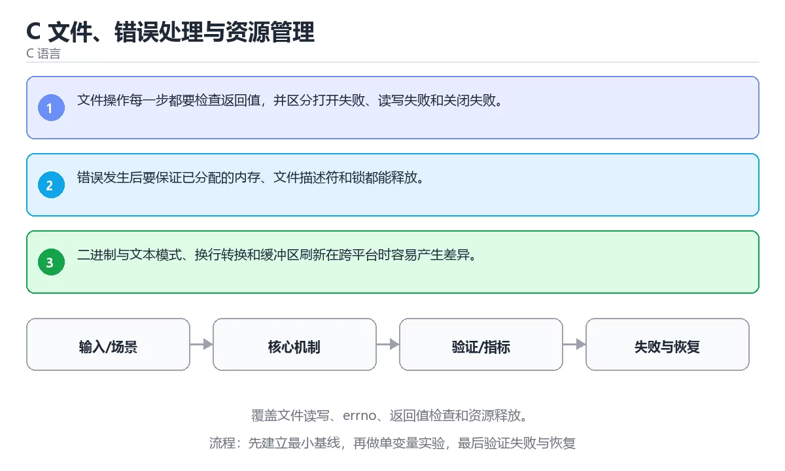

# C 文件、错误处理与资源管理



> 内容更新时间：2026-10-03 · 学习阶段：进阶 · 预计用时：23 分钟

## 学习目标

- 能用自己的话解释：文件操作每一步都要检查返回值，并区分打开失败、读写失败和关闭失败。
- 能用自己的话解释：错误发生后要保证已分配的内存、文件描述符和锁都能释放。
- 能用自己的话解释：二进制与文本模式、换行转换和缓冲区刷新在跨平台时容易产生差异。
- 能把本课知识放回「C 语言」，并完成练习与测验。

## 前置知识

- 已完成「C 语言」的基础课程，能运行正文中的最小示例。
- 本课关键词：文件、errno、资源释放、错误处理。
- 遇到不熟悉的术语先记录问题，完成练习后再回读。

## 核心知识

### 1. 文件操作每一步都要检查返回值，并区分打开失败、读写失败和关闭失败。

- 它解决的问题：把「文件操作每一步都要检查返回值，并区分打开失败、读写失败和关闭失败。」放回真实场景，说明不做它会带来什么后果。
- 关键做法：先用最小示例建立基线，再逐步加入边界、失败和性能条件。
- 验证标准：结果可复现、错误可解释、边界有测试、失败能恢复。

### 2. 错误发生后要保证已分配的内存、文件描述符和锁都能释放。

- 它解决的问题：把「错误发生后要保证已分配的内存、文件描述符和锁都能释放。」放回真实场景，说明不做它会带来什么后果。
- 关键做法：先用最小示例建立基线，再逐步加入边界、失败和性能条件。
- 验证标准：结果可复现、错误可解释、边界有测试、失败能恢复。

### 3. 二进制与文本模式、换行转换和缓冲区刷新在跨平台时容易产生差异。

- 它解决的问题：把「二进制与文本模式、换行转换和缓冲区刷新在跨平台时容易产生差异。」放回真实场景，说明不做它会带来什么后果。
- 关键做法：先用最小示例建立基线，再逐步加入边界、失败和性能条件。
- 验证标准：结果可复现、错误可解释、边界有测试、失败能恢复。

## 关键流程

```text
输入 → 校验 → 核心处理 → 验证 → 记录指标 → 失败恢复
```

## 实践路径

1. 用一句话复述本课要解决的问题。
2. 跑通正文中的最小示例并记录基线。
3. 只改变一个输入或参数，预测并验证结果。
4. 补一个失败路径，记录错误、恢复和指标。
5. 把结论写成可复现的笔记或测试。

## 常见误区

| 误区 | 后果 | 修正 |
| --- | --- | --- |
| 只记术语不做实验 | 遇到真实问题无法判断 | 用最小输入跑通并记录结果 |
| 只测正常路径 | 边界和故障上线才暴露 | 补空值、极值和依赖失败 |
| 没有基线就优化 | 无法证明改进有效 | 先测量再修改 |
| 忽略成本与安全 | 性能和风险失控 | 同时记录资源、权限与失败代价 |

## 动手练习

1. 合上教程，用 3～5 句话解释「C 文件、错误处理与资源管理」。
2. 从正文选一个例子，改变一个条件并预测结果。
3. 设计一个失败场景，写出止损与恢复步骤。

**验收标准**：留下输入、命令、输出、差异和下一步问题。

## 本课小结

- 本课属于「C 语言」，核心关键词是 文件、errno、资源释放、错误处理。
- 先保证正确与可复现，再讨论性能和扩展。
- 完成练习和测验后，把仍然不确定的问题写成下一轮验证清单。

> 本课由 P1 内容扩展生成，重点补充原有课程缺失的主题与工程边界。


## 语言专项实践：C 文件、错误处理与资源管理

### 一、工具链

| 阶段 | 推荐工具 | 验收标准 |
| --- | --- | --- |
| 编译 | gcc/clang -Wall -Wextra -Werror | 命令可复现且错误能被定位 |
| 调试 | gdb + core dump | 命令可复现且错误能被定位 |
| 内存检查 | AddressSanitizer / Valgrind | 命令可复现且错误能被定位 |
| 构建发布 | Makefile/CMake + 静态或动态链接 | 命令可复现且错误能被定位 |

### 二、运行时与内存模型

围绕「文件、errno、资源释放、错误处理」说明变量生命周期、资源释放、并发模型和错误传播。语言语法只是入口，真正决定行为的是运行时、标准库和平台约束。

### 三、测试策略

- 单元测试覆盖核心规则和边界。
- 集成测试覆盖文件、网络、数据库或平台 API。
- 失败测试覆盖超时、取消、异常和资源耗尽。
- 性能测试记录基线，避免只凭感觉优化。

### 四、发布检查

- [ ] 版本和依赖锁定，构建可复现。
- [ ] 产物经过签名、校验和最小权限配置。
- [ ] 日志不泄露密钥和个人信息。
- [ ] 有升级、回滚和故障恢复说明。


## 考点精讲：把测验题还原成判断过程

本课有 4 个判断点。先自己作答，再看「判断依据」；如果结论正确但理由不完整，回到正文对应章节补足概念。

### 考点 1：关于「文件操作每一步都要检查返回值 并区分…」，下列说法正确的是？

- **正确判断**：文件操作每一步都要检查返回值，并区分打开失败、读写失败和关闭失败。
- **判断依据**：学习《C 文件、错误处理与资源管理》时应把该要点与「文件」一起理解。复习《C 文件、错误处理与资源管理》的「文件、errno、资源释放」时，再用一个边界输入验证同一个结论。正确项「文件操作每一步都要检查返回值，并区分打开失败、读写失败和关闭失败」抓住了题干的核心条件，是经得起边界检验的表述。错误项「C 程序从 main 开始执行，源文件经过预处理、编译、汇编和链接成为可执行文件」把不同概念混在一起，缺少题干限定的前提。错误项「整数类型有固定最小宽度但平台实现可能不同，跨平台代码要用固定宽度类型」与课程给出的定义相冲突，不能回答题目所问。错误项「函数参数默认按值传递，修改形参不会改变调用方变量」只看到了表面现象，没有解释题干真正考查的机制。把题干「关于「文件操作每一步都要检查返回值 并区分…」，下列说法正确的是？」放回《C 文件、错误处理与资源管理》的「覆盖文件读写、errno、返回值检查和资源释放」语境，逐项对照定义与边界条件，就能排除其余说法。
- **迁移检查**：遮住选项，只根据定义复述一次答案，再回来看哪个选项与复述一致。

### 考点 2：关于「错误发生后要保证已分配的内存、文件描…」，下列说法正确的是？

- **正确判断**：错误发生后要保证已分配的内存、文件描述符和锁都能释放。
- **判断依据**：学习《C 文件、错误处理与资源管理》时应把该要点与「文件」一起理解。复习《C 文件、错误处理与资源管理》的「文件、errno、资源释放」时，再用一个边界输入验证同一个结论。正确项「错误发生后要保证已分配的内存、文件描述符和锁都能释放」完整覆盖了题目要求的关键点，没有遗漏前提。错误项「声明告诉编译器名字和类型，定义真正分配存储或生成代码」适用于其他场景，但与本题的前提不匹配。错误项「有符号整数溢出是未定义行为，不能依赖回绕结果」把因果关系颠倒了，不能作为正确结论。错误项「局部变量生命周期随函数返回结束，不能返回指向局部栈内存的指针」忽略了题目中的限制条件，因此不成立。把题干「关于「错误发生后要保证已分配的内存、文件描…」，下列说法正确的是？」放回《C 文件、错误处理与资源管理》的「覆盖文件读写、errno、返回值检查和资源释放」语境，逐项对照定义与边界条件，就能排除其余说法。
- **迁移检查**：把题干里的一个条件换成边界值，原来的结论还成立吗？写出判断过程。

### 考点 3：关于「二进制与文本模式、换行转换和缓冲区刷…」，下列说法正确的是？

- **正确判断**：二进制与文本模式、换行转换和缓冲区刷新在跨平台时容易产生差异。
- **判断依据**：学习《C 文件、错误处理与资源管理》时应把该要点与「文件」一起理解。正确项「二进制与文本模式、换行转换和缓冲区刷新在跨平台时容易产生差异」是该问题的规范说法，换成其他表述都会丢失条件。错误项「隐式转换会改变符号和宽度，比较和算术前要明确期望类型」适用于其他场景，但与本题的前提不匹配。错误项「作用域和链接属性共同决定名字在哪些文件和代码块可见」把因果关系颠倒了，不能作为正确结论。错误项「编译警告不是噪声，-Wall -Wextra 能提前发现类型、未使用变量和越界风险」属于相邻主题的说法，范围与本题要求不一致。把题干「关于「二进制与文本模式、换行转换和缓冲区刷…」，下列说法正确的是？」放回《C 文件、错误处理与资源管理》的「覆盖文件读写、errno、返回值检查和资源释放」语境，逐项对照定义与边界条件，就能排除其余说法。
- **迁移检查**：如果给某个错误选项去掉一个限定词，它会不会变成正确？说明理由。

### 考点 4：「C 文件、错误处理与资源管理」的核心学习目标是什么？

- **正确判断**：覆盖文件读写、errno、返回值检查和资源释放。
- **判断依据**：正确项「覆盖文件读写、errno、返回值检查和资源释放」与题干要求一致，是本课知识点的准确定义。错误项「从源文件、预处理、编译、汇编到链接理解 C 程序的构建过程」属于相邻主题的说法，范围与本题要求不一致。错误项「掌握整数宽度、溢出、隐式转换、浮点精度和 sizeof」把不同概念混在一起，缺少题干限定的前提。错误项「理解分支、循环、函数调用、栈帧和变量生命周期」与课程给出的定义相冲突，不能回答题目所问。把题干「「C 文件、错误处理与资源管理」的核心学习目标是什么？」放回《C 文件、错误处理与资源管理》的「覆盖文件读写、errno、返回值检查和资源释放」语境，逐项对照定义与边界条件，就能排除其余说法。
- **迁移检查**：遮住选项，只根据定义复述一次答案，再回来看哪个选项与复述一致。

## 本课复习清单

离开本课前，逐项确认：

- [ ] 不看解析，能说出「关于「文件操作每一步都要检查返回值 并区分…」，下列说法正确的是？」的判断依据。
- [ ] 不看解析，能说出「关于「错误发生后要保证已分配的内存、文件描…」，下列说法正确的是？」的判断依据。
- [ ] 不看解析，能说出「关于「二进制与文本模式、换行转换和缓冲区刷…」，下列说法正确的是？」的判断依据。
- [ ] 不看解析，能说出「「C 文件、错误处理与资源管理」的核心学习目标是什么？」的判断依据。
- [ ] 至少运行一次本课示例，记录输入、输出和一个边界情况。
- [ ] 把本课最容易混淆的两个概念写成一句话对照。

| 复盘项 | 记录 |
| --- | --- |
| 已经能独立解释的考点 |  |
| 仍然说不清的概念 |  |
| 下一步验证动作 |  |

## 逐节复习与自检

下面按正文顺序回顾每一节，并给出一个自检问题；说不清的地方回到原章节补课。

### 核心知识

」放回真实场景，说明不做它会带来什么后果。关键做法：先用最小示例建立基线，再逐步加入边界、失败和性能条件。

自检：这一节与相邻主题的边界在哪里？

### 动手练习

合上教程，用 3～5 句话解释「C 文件、错误处理与资源管理」。从正文选一个例子，改变一个条件并预测结果。

自检：如果去掉这一节里的一个前提，结论会怎样变化？

### 语言专项实践：C 文件、错误处理与资源管理

围绕「文件、errno、资源释放、错误处理」说明变量生命周期、资源释放、并发模型和错误传播。语言语法只是入口，真正决定行为的是运行时、标准库和平台约束。

自检：如果去掉这一节里的一个前提，结论会怎样变化？

### 最小可运行示例

```c
#include <stdio.h>

int main(void) {
    FILE *file = fopen("notes.txt", "w");
    if (file == NULL) {
        perror("fopen");
        return 1;
    }
    fputs("hello file\n", file);
    fclose(file);
```

自检：把这一节讲给没学过的人，最需要强调哪一点？

### 预期输出

```text
wrote notes.txt
```

自检：这一节与相邻主题的边界在哪里？

### 验证步骤

制造一次错误输入，记录错误信息与修复方式。

自检：如果去掉这一节里的一个前提，结论会怎样变化？

## English Overview

**Title:** C Files, Error Handling and Resource Management

**Summary:** Cover file IO, errno, return-value checks and resource cleanup.

**Category:** C  
**Level:** 进阶  
**Key terms:** 文件, errno, 资源释放, 错误处理

> The full tutorial is written in Chinese. This bilingual overview helps English readers identify the topic, scope and key terms before studying the detailed examples.

## 内容元数据

- 内容版本：v2.0
- 最后更新：2026-10-03
- 学习阶段：进阶
- 适用环境：C11 / GCC 或 Clang
- 内容来源：内置结构化课程与工程实践整理
- 相关主题：文件、errno、资源释放、错误处理
- 质量版本：P0 测验标准 + P1 覆盖扩展 + P2 体验补全


## 最小可运行示例

下面示例用于验证「C 文件、错误处理与资源管理」的最小输入、处理和输出。先原样运行，再只修改一个值：

```c
#include <stdio.h>

int main(void) {
    FILE *file = fopen("notes.txt", "w");
    if (file == NULL) {
        perror("fopen");
        return 1;
    }
    fputs("hello file\n", file);
    fclose(file);
    printf("wrote notes.txt\n");
    return 0;
}
```

## 预期输出

```text
wrote notes.txt
```

## 验证步骤

1. 记录运行环境、命令和真实输出。
2. 修改一个输入，先写预测再运行。
3. 制造一次错误输入，记录错误信息与修复方式。
4. 把结论写回本课笔记或测试用例。


## 参考资料与复核

- 最后复核：2026-10-04
- 下次复核：2027-04-04
- 复核范围：版本兼容、API 行为、安全建议与工程实践
- 来源性质：官方文档与标准；本课正文为离线教学重组，不复制原文

| 参考资料 | 本课用途 |
| --- | --- |
| [C 标准库参考](https://en.cppreference.com/w/c) | C 语言与标准库 |
| [GNU C Manual](https://www.gnu.org/software/libc/manual/) | POSIX 与系统接口 |

> 本课主题：覆盖文件读写、errno、返回值检查和资源释放。

> App 完全离线展示文字链接，不会自动联网；需要延伸阅读时可复制链接到浏览器。

