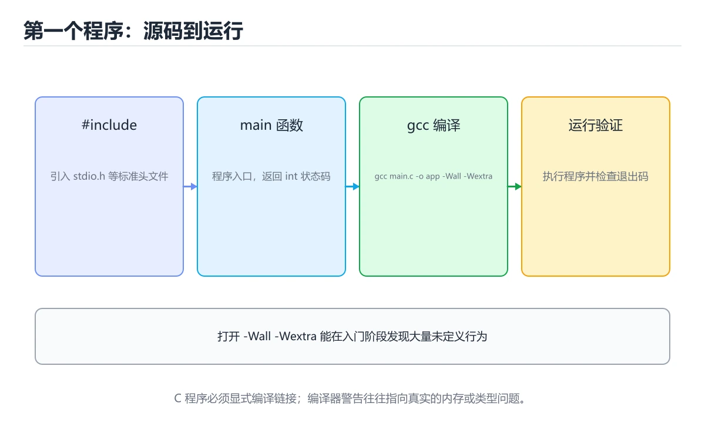
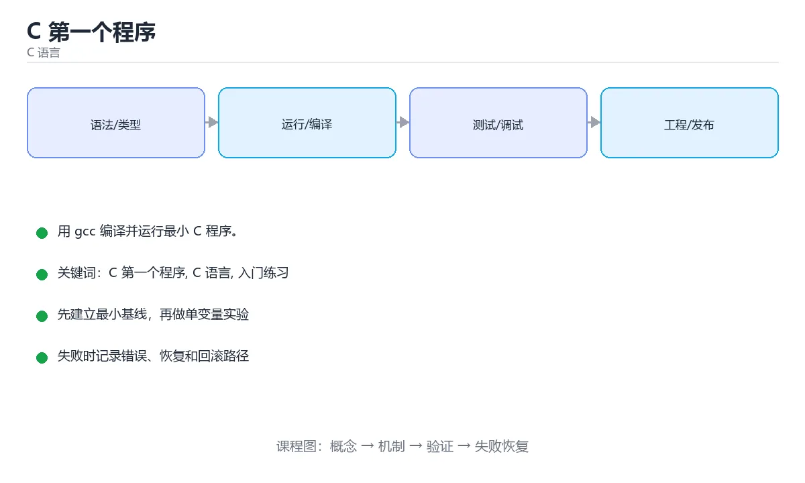

# C 第一个程序

> 内容更新时间：2026-10-06 · 学习阶段：入门 · 预计用时：50 分钟





## 本节知识框架

**课程定位**：所属分类为「C 语言」，课程主题为「C 第一个程序」，学习阶段为「入门」，建议用时 50 分钟。

**本课要解决的主问题**：用 gcc 编译并运行最小 C 程序。

| 学习层次 | 要回答的问题 | 完成判据 |
| --- | --- | --- |
| 概念层 | 「C 第一个程序」有哪些必须区分的对象与术语？ | 能用自己的话定义核心术语，并各举一个正例和一个反例。 |
| 机制层 | 这些对象按什么顺序发生作用，输入如何变成输出？ | 能画出或写出机制步骤，并说明每一步的失败条件。 |
| 应用层 | 什么场景适合使用「C 第一个程序」，什么场景不适合？ | 能给出一个真实场景、一个最小示例和一个边界案例。 |
| 性能层 | 时间、空间、吞吐或延迟受哪些量影响？ | 能说出复杂度或性能瓶颈的证据来源；没有证据时明确写“材料未提供”。 |
| 复习层 | 怎样确认自己不是只记住了结论？ | 能独立完成本课自测，并把错误定位到概念、机制、示例或边界。 |

### 阅读路线

1. 先读「核心概念定义」，建立「C 第一个程序」等对象的精确定义。
2. 再读「原理与运行机制」，把定义串成可重复的过程。
3. 用「代码/协议/SQL 示例」验证过程，并只改一个条件观察结果变化。
4. 最后检查性能、易错点、知识关系与自测题，形成可复习的证据链。

**前置知识**：没有硬性先修课；仍建议先具备本分类的基础阅读与操作能力。

**学习位置**：本课是当前分类的第一课，建议从本页开始建立术语表。

**后续衔接**：下一课《C 变量与输入输出》会继续使用本课术语，学完后建议立即完成一次自测。

**教材衔接：学习目标**

- 先认识C 第一个程序需要的工具、输入和输出。
- 按步骤运行最小示例，并记录结果与错误。
- 用一个边界输入验证自己是否真正掌握。

**教材衔接：前置知识**

- 会进行基本的文件或命令行操作。
- 不需要预先掌握「C 语言」的高级知识。

**教材衔接：本课小结**

- 入门阶段先保证能运行、能观察、能解释，再追求复杂功能。
- 每次只改一个变量，记录预测与实际结果。
- 遇到错误先看第一条错误信息，再回到最小示例。

## 核心概念定义

> 阅读约定：本课先给「C 第一个程序」相关术语的操作性定义与适用边界；正文里的口语化说法与定义冲突时，以定义和可复现示例为准。

| 术语 | 操作性定义 | 本课中的边界 |
| --- | --- | --- |
| main 函数 | C 程序的入口，操作系统从这里开始执行。 | 仅在「C 第一个程序」明确给出的输入、版本与资源条件下成立。 |
| 编译 | 把 .c 源文件翻译成机器码可执行文件的过程，如 gcc hello.c -o hello。 | 仅在「C 第一个程序」明确给出的输入、版本与资源条件下成立。 |
| printf | 按格式串把内容输出到标准输出。 | 仅在「C 第一个程序」明确给出的输入、版本与资源条件下成立。 |
| 语句与分号 | C 的每条语句以分号结束，漏写分号会直接编译报错。 | 仅在「C 第一个程序」明确给出的输入、版本与资源条件下成立。 |
| 数组 | 数组名在大多数表达式中退化为首元素指针，但 sizeof 和取地址时不是 | 仅在「C 第一个程序」明确给出的输入、版本与资源条件下成立。 |
| 字符串 | 字符串函数要保证目标缓冲区足够大，优先使用带长度限制的函数，防止溢出 | 仅在「C 第一个程序」明确给出的输入、版本与资源条件下成立。 |

### 定义如何使用

在「C 第一个程序」中判断一个说法是否成立，先确认它使用的是哪个对象的定义，再检查输入规模、运行环境与失败路径。定义不是口号，而是后续推导、代码示例和自测题共享的约束。

## 原理与运行机制

### 机制总览

1. **建立输入**：把「main 函数」按本课定义整理成可观察、可重复的输入条件。
2. **执行转换**：围绕「编译」执行本课的核心步骤；每一步都记录中间状态，避免只看最终输出。
3. **产生输出**：得到「printf」后，用正文示例或协议/SQL 结果核对输出是否符合预期。
4. **改变一个条件**：只替换一个边界条件或环境参数，观察「C 第一个程序」的结论是否仍然成立。

| 阶段 | 关注对象 | 失败时应检查 |
| --- | --- | --- |
| 输入 | main 函数 | 类型、范围、编码、版本或前置状态是否满足定义。 |
| 处理 | 编译 | 顺序、可见性、锁、路由、事务或调度规则是否被破坏。 |
| 输出 | printf | 结果是否可复现，错误是否被正确传播而不是被吞掉。 |

本课的机制结论要用「C 第一个程序」自己的示例验证。「C 第一个程序」没有给出某个数量级、吞吐或内存数据时，本课把该判断标为“材料未提供”，不从相邻主题外推。

**教材衔接：一句话入门**

用 gcc 编译并运行最小 C 程序。

**教材衔接：C 语言基础机制速览**

### 编译、链接与程序结构

C 源码经过预处理、编译、汇编和链接生成可执行文件。`#include` 引入声明，函数定义提供实现，链接器负责解析外部符号。`main` 返回 0 表示成功，非 0 表示失败。理解头文件、声明与定义的区别，能区分“找不到函数声明”的编译错误和“找不到符号”的链接错误。

### 类型、变量与内存表示

C 是静态类型语言，基本类型的大小依赖平台，使用 `sizeof` 而不是硬编码字节数。整数有有符号和无符号之分，混合运算会发生转换；无符号回绕有定义，有符号溢出通常是未定义行为。浮点数遵循 IEEE 754 近似表示，比较时使用容差。字符类型、字符串和数组的关系需要清楚：字符串以 `\0` 结尾，`char` 数组不一定是字符串。

### 指针、数组与字符串

指针保存地址，`*` 解引用，`&` 取地址；指针算术按所指类型大小移动。数组名在大多数表达式中退化为首元素指针，但 `sizeof` 和取地址时不是。函数参数中的数组声明等价于指针，长度信息会丢失，必须额外传长度。字符串函数要保证目标缓冲区足够大，优先使用带长度限制的函数，防止溢出。

### 函数、结构体与内存管理

函数原型要在调用前可见，参数按值传递；要修改调用方变量就传指针。结构体可以按值复制，较大结构体通常传指针；`struct` 的内存可能有填充，`sizeof` 不一定等于成员大小之和。`malloc/free`、`calloc`、`realloc` 必须成对使用，释放后指针置空，不能访问已释放内存。栈内存自动回收但生命周期受作用域限制，返回局部数组地址是典型错误。

### 预处理器、未定义行为与调试

宏在预处理阶段替换文本，要加括号并避免多次求值副作用；`#include` 保护防止重复包含。未定义行为包括越界访问、解引用空指针、未初始化读取、有符号溢出和不匹配的格式化参数，编译器优化后可能产生难以预测的结果。使用编译器警告、静态分析、sanitizer 和调试器定位内存问题；测试要覆盖空输入、边界长度、内存分配失败和错误路径。

**教材衔接：版本与时效**

- 把标准版本写进构建配置，避免 C 语言 在不同环境下编译结果不一致。
- 编译器对未定义行为、严格别名与对齐的优化越来越激进
- 升级时重点回归位域、可变参数、内联汇编与结构体布局
- 语言参考：https://en.cppreference.com/w/c

### 升级检查清单

- 先固定当前版本，跑通全部示例与测验，再升级工具链。
- 升级时只动一个依赖版本，用 printf 记录构建与运行结果。
- 升级后重点回归 C 第一个程序 的默认值、警告信息与错误格式。
- 升级完成后更新本课「最后复核 / 下次复核」日期，并记录 C 第一个程序 的版本变化。

**教材衔接：语言专项实践：C 第一个程序**

### 一、工具链

| 阶段 | 推荐工具 | 验收标准 |
| --- | --- | --- |
| 编译 | gcc/clang -Wall -Wextra -Werror | 命令可复现且错误能被定位 |
| 调试 | gdb + core dump | 命令可复现且错误能被定位 |
| 内存检查 | AddressSanitizer / Valgrind | 命令可复现且错误能被定位 |
| 构建发布 | Makefile/CMake + 静态或动态链接 | 命令可复现且错误能被定位 |

### 二、运行时与内存模型

「C 第一个程序」的「二、运行时与内存模型」一节补全如下：

- 定位：这一节说明二、运行时与内存模型在「C 第一个程序」知识体系里的位置。
- 检查点：固定版本与输入重跑《C 第一个程序》，记录两次差异并定位不稳定条件。
- 自检：能否用一个最小例子解释二、运行时与内存模型？

### 三、测试策略

- 单元测试覆盖核心规则和边界。
- 集成测试覆盖文件、网络、数据库或平台 API。
- 失败测试覆盖超时、取消、异常和资源耗尽。
- 性能测试记录基线，避免只凭感觉优化。

### 四、发布检查

- [ ] 版本和依赖锁定，构建可复现。
- [ ] 产物经过签名、校验和最小权限配置。
- [ ] 日志不泄露密钥和个人信息。
- [ ] 有升级、回滚和故障恢复说明。

## 典型应用场景

| 场景 | 典型输入或前提 | 期望产物 |
| --- | --- | --- |
| 学习验证 | 使用本课最小示例和 C 第一个程序、C 语言 | 能复现正文结论，并解释每一步。 |
| 工程落地 | 把「C 第一个程序」放入真实模块或服务边界 | 输出可观测、失败可定位、参数可配置。 |
| 故障排查 | 只改一个版本、规模、输入或依赖条件 | 能区分概念错误、实现错误和环境差异。 |

判断「C 第一个程序」的场景是否成立，标准是能否写出输入、处理、输出和失败路径；材料中没有出现的数据在本课标注为“材料未提供”，不用推测替代证据。

**课程内置实验入口**：`sandbox:cpp`，用于动手验证《C 第一个程序》的机制；实验结论不替代概念定义与复杂度分析。

**教材衔接：代码实验：把示例跑成证据**

### 实验一：建立基线

```c
#include <stdio.h>

int main(void) {
    printf("hello from C\n");
    return 0;
}
```

### 实验二：只改一个输入

沿用「C 第一个程序」的最小示例做一次单变量实验：

| 实验 | 改动 | 预测 | 实际 | 结论 |
| --- | --- | --- | --- | --- |
| 基线 | 保持「C 第一个程序」示例原样 |  |  |  |
| 边界 | 把C 第一个程序换成空值或极值 |  |  |  |
| 失败 | 给C 语言传入非法输入 |  |  |  |

做完后用一句话写出「C 第一个程序」的结论：输入怎么变，结果才怎么变。

### 实验三：制造一个可控错误

删掉 C 语言 相关的一处必要写法，观察错误在哪一层出现，再恢复代码确认基线仍然可运行。

| 实验 | 改动 | 预测 | 实际 | 结论 |
| --- | --- | --- | --- | --- |
| 基线 | 保持原样 |  |  |  |
| 边界 |  |  |  |  |
| 失败 |  |  |  |  |

### 实验四：用三句话复述

1. 在「C 第一个程序」里，printf 接受哪些输入，非法输入应该在哪里被挡住？
2. C 第一个程序 按什么顺序处理输入，在哪一步产生了状态变化或副作用？
3. 输出如何验证，失败时第一条可观察证据是什么？

## 代码/协议/SQL 示例

### 最小可验证示例

下面保留《C 第一个程序》原文中的最小示例。先预测《C 第一个程序》示例的输出，再按正文步骤运行或推演；示例依赖外部环境时，同时记录版本与输入。

```c
#include <stdio.h>

int main(void) {
    printf("hello from C\n");
    return 0;
}
```

**教材衔接：最小示例**

```c
#include <stdio.h>

int main(void) {
    printf("hello from C\n");
    return 0;
}
```

**教材衔接：预期输出**

```text
hello from C
```

**教材衔接：零基础通俗讲：C 语言第一个程序**

### 一句话说清它是什么

一个 C 程序必须有一个 main 函数，程序从它开始执行；#include 把工具说明书提前拿进来，printf 负责往屏幕写字。

### 用生活比喻理解

把 main 想成大楼唯一的正门：不管楼里有多少房间，进程每次都是从这道门进来、从这道门出去。include 则是开工前先领的工具箱，没领到工具箱，后面的螺丝刀就用不了。

### 完整可运行代码

```c
#include <stdio.h>

int main(void) {
    printf("你好，C 语言\n");
    return 0;
}
```

### 逐行拆开看

- `#include <stdio.h>` 是预处理指令，在真正编译前把标准输入输出库的声明贴进来，`printf` 的用法就来自这里。
- `int main(void)` 定义主函数：`int` 表示它会给操作系统返回一个整数，`void` 表示它不接受参数。
- `{` 和 `}` 圈出函数体，所有属于 main 的语句都写在这对花括号之间。
- `printf("你好，C 语言\n");` 把引号里的内容打印出来；`\n` 是换行符，不加它光标会停在行尾。
- 每个语句结尾的分号不能省，它是 C 用来判断「这句话说完了」的标记。
- `return 0;` 把 0 交还给操作系统，惯例上 0 表示程序正常结束，非 0 表示出错。

### 把程序跑一遍

- 编译：`gcc hello.c -o hello`，把源码翻译成可执行文件；编译失败会直接报错行号和原因。
- 运行：Linux 或 macOS 执行 `./hello`，Windows 执行 `hello.exe`。
- 程序进入 main，执行 printf，屏幕出现 `你好，C 语言` 并换行。
- main 返回 0，进程结束；在 Linux 终端可以用 echo 加问号查看上一条命令的退出码，Windows 用 echo %ERRORLEVEL%。

### 新手最容易踩的坑

- 忘记 `#include <stdio.h>`：编译器会警告 `implicit declaration of printf`，新标准下直接报错。
- 把 `main` 拼成 `mian` 或 `Main`：C 区分大小写，链接阶段会报找不到入口。
- 语句末尾漏分号：报错行通常指向下一行，实际错误在上一行结尾。
- 忘了 `return 0;`：现代标准会默认返回 0，但显式写出来更清楚，也能避免老编译器告警。
- 用中文标点写代码：全角分号、全角括号都不是合法符号，编译器会给出难以理解的报错。

### 动手练一练

- 把输出的文字换成自我介绍，重新编译运行，确认输出变化。
- 在 printf 后面再加一行 printf，观察两次输出是否会换行。
- 故意删掉第一行的 `#include`，记录完整的编译错误，体会「报错要看第一条」。

### 本课速查卡

把下面八行抄进自己的笔记，复习时只看这一页就能回忆整课：

| 复习项 | 本课要点 |
| --- | --- |
| 核心结论 | 一个 C 程序必须有一个 main 函数，程序从它开始执行；#include 把工具说明书提前拿进来，printf 负责往屏幕写字。 |
| 最少要写的代码 | `int main(void) {` |
| 正确做法 | 编译：`gcc hello.c -o hello`，把源码翻译成可执行文件；编译失败会直接报错行号和原因。 |
| 最常见的错误 | 忘记 `#include <stdio.h>`：编译器会警告 `implicit declaration of printf`，新标准下直接报错。 |
| 出错先查什么 | 先读第一条报错信息，再回到最小示例只改一个地方 |
| 怎么确认学会了 | 把输出的文字换成自我介绍，重新编译运行，确认输出变化。 |
| 和别的知识点的关系 | 本课打下的语法与思维方式会被后面每一课反复用到 |
| 接下来做什么 | 合上教程，凭记忆把上面的最小代码重写一遍再运行 |

## 时间/空间复杂度或性能分析

**复杂度证据**：「C 第一个程序」的现有材料没有给出渐近时间或空间复杂度的明确结论，本课只做定性检查，不补写未经验证的 $O$ 记号。

| 维度 | 本课关注点 | 判断依据 |
| --- | --- | --- |
| 时间/延迟 | 「C 第一个程序」的主要步骤是否会随输入规模、并发度或网络往返增长。 | 以正文复杂度、基准数据或可重复测量为准。 |
| 空间/内存 | 中间状态、缓存、副本、连接或索引是否随规模增长。 | 记录峰值内存与数据副本，不只看最终结果。 |
| 吞吐/资源 | 版本、调度、锁、IO、序列化或协议开销是否成为瓶颈。 | 固定环境做对照实验，改变一个变量。 |

评估「C 第一个程序」时要区分“正确性成立”和“性能达标”两件事；材料没有给出基准时，本课只保留量级来源与测量方法，不写不可验证的绝对数字。

## 常见误区与易错点

> 复核《C 第一个程序》的易错点时，优先保留原文的错误表、故障现场与排错路径；每条修正都要能用本课示例复验。

| 易错点 | 常见表现 | 正确做法 |
| --- | --- | --- |
| 只背结论 | 能复述「C 第一个程序」的定义，却说不清输入、输出与边界。 | 回到机制步骤，用最小示例逐一验证。 |
| 混淆相邻概念 | 把本课对象与相邻主题的对象当成同一类。 | 先比较定义、资源归属、生命周期和失败模式。 |
| 忽略版本与环境 | 在开发机通过后直接外推到生产环境。 | 固定版本、输入和资源条件，再记录可复现结果。 |

**教材衔接：常见错误与排查**

> 说明：本表由《C 第一个程序》的核心知识整理（2026-10-07），人工复核进度见 docs/content_review_batches.md。

| 易错点 | 容易踩的做法 | 正确结论 |
| --- | --- | --- |
| 分号缺失或括号不配对 | 编译错误指向的位置与实际错误不一致 | 从第一条错误开始改，按代码块检查括号配对 |
| main 返回值随意 | 脚本与流水线无法判断成功还是失败 | 正常结束返回 0，失败返回非零并写入错误输出 |
| 改完不重新编译就运行 | 运行的还是上一次生成的可执行文件 | 固定编译命令与输出路径，每次改动后重新构建 |

**教材衔接：故障现场**

### 现场 1：分号缺失或括号不配对

**症状**：在《C 第一个程序》的复现场景中，编译错误指向的位置与实际错误不一致。

**根因**：触发点是把“分号缺失或括号不配对”当成安全做法。它没有满足《C 第一个程序》要求的前提，因此先表现为“编译错误指向的位置与实际错误不一致”；排查时先完整复现这一段，再核对输入、配置与依赖。

**修复**：针对《C 第一个程序》的问题，从第一条错误开始改，按代码块检查括号配对。

**验证**：保留《C 第一个程序》里触发“编译错误指向的位置与实际错误不一致”的输入、版本和日志，按“从第一条错误开始改，按代码块检查括号配对”完成修改后原样重放；只有失败现象消失且相邻场景仍可解释，才保留改动。

### 现场 2：main 返回值随意

**症状**：在《C 第一个程序》的复现场景中，脚本与流水线无法判断成功还是失败。

**根因**：触发点是把“main 返回值随意”当成安全做法。它没有满足《C 第一个程序》要求的前提，因此先表现为“脚本与流水线无法判断成功还是失败”；排查时先完整复现这一段，再核对输入、配置与依赖。

**修复**：针对《C 第一个程序》的问题，正常结束返回 0，失败返回非零并写入错误输出。

**验证**：先在《C 第一个程序》中记录“main 返回值随意”留下的失败证据，再执行“正常结束返回 0，失败返回非零并写入错误输出”并重放；确认错误路径变为明确结果，且修复没有掩盖同类故障。

### 现场 3：改完不重新编译就运行

**症状**：在《C 第一个程序》的复现场景中，运行的还是上一次生成的可执行文件。

**根因**：触发点是把“改完不重新编译就运行”当成安全做法。它没有满足《C 第一个程序》要求的前提，因此先表现为“运行的还是上一次生成的可执行文件”；排查时先完整复现这一段，再核对输入、配置与依赖。

**修复**：针对《C 第一个程序》的问题，固定编译命令与输出路径，每次改动后重新构建。

**验证**：先在《C 第一个程序》中记录“改完不重新编译就运行”留下的失败证据，再执行“固定编译命令与输出路径，每次改动后重新构建”并重放；确认错误路径变为明确结果，且修复没有掩盖同类故障。

**教材衔接：工程化精练：决策、失败与验证**

这一章把「C 第一个程序」从“看懂”推进到“能判断、能验证、能排错”。所有判断都围绕C 第一个程序、C 语言与入门练习展开，并与前文的示例、测验和失败现场互相对照。

### 一、C 第一个程序 的判断算法

| 步骤 | 要回答的问题 | 判断依据 | 记录什么 |
| --- | --- | --- | --- |
| 1. 定目标 | 「C 第一个程序」这一步要解决什么问题？ | 把C 第一个程序的目标写成一句可验证的结论 | 输入、约束、成功标准 |
| 2. 找边界 | C 语言在什么条件下失效？ | 先列空值、极值、重复和失败路径 | 反例与触发条件 |
| 3. 跑基线 | 原始示例的真实输出是什么？ | 命令、版本和环境必须可复现 | 命令、输出、耗时 |
| 4. 只改一处 | 把入门练习换成另一种取值会怎样？ | 预测写在运行之前 | 预测与实际的差异 |
| 5. 回写结论 | 结论能否被他人复现？ | 把判断写成清单或测试 | 结论、证据、遗留问题 |

这张表的用法不是从上到下浏览，而是每次只填一行：先用「C 第一个程序」前文的示例验证第 3 行，再故意破坏一个条件验证第 2 行。当你能在不看解析的情况下说出C 第一个程序的判断依据，才算真正掌握本课。

- 先从C 第一个程序入手：把它写成“输入是什么、输出是什么、哪一步最容易出错”。如果这三句话中有一句说不清，说明对「C 第一个程序」的理解还停留在术语层面，需要回到正文的最小示例重新观察一次。

- 再把C 语言当成对照实验的变量：固定其他条件，只改变它的取值，记录输出是否变化。结论“变”或“不变”都要写出理由，并说明这个理由能否被他人独立复现。

- 针对入门练习做一次失败演练：故意给出空值、极值或错误类型，观察「C 第一个程序」的报错位置和处理方式。错误信息只是入口，真正要定位的是哪一层假设被破坏。

- 把「C 第一个程序」的结论压缩成一条可执行清单：先检查输入，再检查版本与环境，然后跑最小用例，最后才扩大规模。顺序颠倒会让排错范围成倍增加。

- 如果结论依赖时间或规模，就把数据量提高一个数量级再跑一次。在「C 第一个程序」里，小样本成立不代表大样本成立，复杂度、资源占用和失败率都要重新记录。

- 如果结论依赖并发或共享状态，就固定输入并连续运行多次。结果不一致时，优先怀疑「C 第一个程序」中C 第一个程序相关步骤的隐藏状态，而不是先改代码。

- 把「C 第一个程序」的判断写成测试：一个正常用例、一个边界用例、一个失败用例。测试通过只是起点，还要确认失败用例确实以预期方式失败。

- 把本课与相邻主题连起来：C 第一个程序解决的是“怎么做”，C 语言回答“什么时候不适用”。两者都答得出来，迁移才算完成。

> 第 2 轮复核「C 第一个程序」：把上面的结论逐条改写为可验证的问题，并记录仍不确定的部分。

- 先从C 第一个程序入手：把它写成“输入是什么、输出是什么、哪一步最容易出错”。如果这三句话中有一句说不清，说明对「C 第一个程序」的理解还停留在术语层面，需要回到正文的最小示例重新观察一次。

- 再把C 语言当成对照实验的变量：固定其他条件，只改变它的取值，记录输出是否变化。结论“变”或“不变”都要写出理由，并说明这个理由能否被他人独立复现。

- 针对入门练习做一次失败演练：故意给出空值、极值或错误类型，观察「C 第一个程序」的报错位置和处理方式。错误信息只是入口，真正要定位的是哪一层假设被破坏。

- 把「C 第一个程序」的结论压缩成一条可执行清单：先检查输入，再检查版本与环境，然后跑最小用例，最后才扩大规模。顺序颠倒会让排错范围成倍增加。

- 如果结论依赖时间或规模，就把数据量提高一个数量级再跑一次。在「C 第一个程序」里，小样本成立不代表大样本成立，复杂度、资源占用和失败率都要重新记录。

- 如果结论依赖并发或共享状态，就固定输入并连续运行多次。结果不一致时，优先怀疑「C 第一个程序」中C 第一个程序相关步骤的隐藏状态，而不是先改代码。

- 把「C 第一个程序」的判断写成测试：一个正常用例、一个边界用例、一个失败用例。测试通过只是起点，还要确认失败用例确实以预期方式失败。

- 把本课与相邻主题连起来：C 第一个程序解决的是“怎么做”，C 语言回答“什么时候不适用”。两者都答得出来，迁移才算完成。

> 第 3 轮复核「C 第一个程序」：把上面的结论逐条改写为可验证的问题，并记录仍不确定的部分。

- 先从C 第一个程序入手：把它写成“输入是什么、输出是什么、哪一步最容易出错”。如果这三句话中有一句说不清，说明对「C 第一个程序」的理解还停留在术语层面，需要回到正文的最小示例重新观察一次。

- 再把C 语言当成对照实验的变量：固定其他条件，只改变它的取值，记录输出是否变化。结论“变”或“不变”都要写出理由，并说明这个理由能否被他人独立复现。

- 针对入门练习做一次失败演练：故意给出空值、极值或错误类型，观察「C 第一个程序」的报错位置和处理方式。错误信息只是入口，真正要定位的是哪一层假设被破坏。

- 把「C 第一个程序」的结论压缩成一条可执行清单：先检查输入，再检查版本与环境，然后跑最小用例，最后才扩大规模。顺序颠倒会让排错范围成倍增加。

- 如果结论依赖时间或规模，就把数据量提高一个数量级再跑一次。在「C 第一个程序」里，小样本成立不代表大样本成立，复杂度、资源占用和失败率都要重新记录。

- 如果结论依赖并发或共享状态，就固定输入并连续运行多次。结果不一致时，优先怀疑「C 第一个程序」中C 第一个程序相关步骤的隐藏状态，而不是先改代码。

### 二、C 第一个程序 的机制拆解与自测

把本课考点还原成可回答的问题，再逐题写出依据：

**问题 1**：#include <stdio.h> 这行代码在 C 程序里起什么作用？

- 关联术语：C 第一个程序
- 判断依据：引入标准输入输出的函数声明，例如 printf
- 追问：如果把C 第一个程序的条件换成边界值，这个结论是否仍然成立？

**问题 2**：阅读「C 第一个程序」中的这段 C 代码，下面哪项判断最准确？

- 关联术语：C 语言
- 判断依据：回到「C 第一个程序」正文对应小节，先用最小示例验证再下结论。
- 追问：如果把C 语言的条件换成边界值，这个结论是否仍然成立？

**问题 3**：围绕“C 第一个程序”中的 C 第一个程序、C 语言、入门练习，下列哪两项是本课强调的实践判断？

- 关联术语：入门练习
- 判断依据：学习 C 第一个程序 时要同时说明输入、输出和失败路径，不能只看正常流程
- 追问：如果把 C 第一个程序 的条件换成边界值，这个结论是否仍然成立？

**问题 4**：printf("hello from C\n"); 中 \n 的作用是？

- 关联术语：C 第一个程序
- 判断依据：输出一个换行符，让后续内容从下一行开始
- 追问：如果把C 第一个程序的条件换成边界值，这个结论是否仍然成立？

**问题 5**：填空：在「C 第一个程序」的术语速查里，「C 源码经过预处理、编译、汇编和链接生成可执行文件。`____` 引入声明，函数定义提供实现，链接器负责解析外部符号。`main` 返回 0 表示成功，非 0 表示失败。理解头文件、声明与定义的区别，能区分“找不到函数声明”的编译错」描述的是哪个术语？

- 关联术语：C 语言
- 判断依据：回到「C 第一个程序」正文对应小节，先用最小示例验证再下结论。
- 追问：如果把C 语言的条件换成边界值，这个结论是否仍然成立？

### 三、失败模式与修复顺序

| 失败信号 | 常见根因 | 先做什么 | 修复后如何确认 |
| --- | --- | --- | --- |
| 「C 第一个程序」中 C 第一个程序 相关步骤报错 | 输入、版本或前置条件与示例不一致 | 保留第一条错误信息，回到最小输入 | 用引入标准输入输出的函数声明，例如 printf复跑，确认输出可复现 |
| 「C 第一个程序」中 C 语言 相关步骤报错 | 输入、版本或前置条件与示例不一致 | 保留第一条错误信息，回到最小输入 | 用学习 C 第一个程序 时要同时说明输入、输出和失败路径，不能只看正常流程复跑，确认输出可复现 |
| 「C 第一个程序」中 入门练习 相关步骤报错 | 输入、版本或前置条件与示例不一致 | 保留第一条错误信息，回到最小输入 | 用输出一个换行符，让后续内容从下一行开始复跑，确认输出可复现 |
- 检查点：固定版本与输入重跑《C 第一个程序》，记录两次差异并定位不稳定条件。
| 单次结果正确但规模一大就失效 | 只测了正常路径，没有覆盖边界 | 把数据量或并发度提高一个数量级 | 记录边界值、耗时与失败率 |

排错顺序固定为：先复现，再缩小输入，然后只改一个条件，最后把结论写成回归用例。对「C 第一个程序」来说，任何不能复现的“修好了”都不算完成。

### 四、离开本课前的验证清单

| 检查项 | 通过标准 | 证据 |
| --- | --- | --- |
| 能复述 | 用三句话说明「C 第一个程序」解决什么问题、边界在哪 | 不看解析写出的结论 |
| 能运行 | 最小示例在本机跑通 | 命令、输出与版本 |
| 能改条件 | 只改一个输入并解释差异 | 预测与实际的对照 |
| 能排错 | 至少制造并修复一个失败 | 错误信息与修复步骤 |
| 能迁移 | 把C 第一个程序、C 语言、入门练习用到新场景 | 一个自选练习的结论 |

完成标准：能不看解析说清「C 第一个程序」全部自测题的依据，并且至少有一条C 第一个程序相关的结论经过真实运行验证。如果某一步只停留在“感觉懂了”，就把它写成下一轮针对「C 第一个程序」的最小验证任务。

### 五、把结论写成可检查的证据

学习「C 第一个程序」时，最容易出现的情况是“听过、看懂了，但换一个输入就说不清”。下面把C 第一个程序与C 语言放进一条可检查的证据链：每一句结论都要能回答“从哪里来、在什么条件下成立、失败时怎么发现”。

| 证据类型 | 本课要求 | 不合格的表现 |
| --- | --- | --- |
| 概念证据 | 用一句话说明C 第一个程序的定义与适用场景 | 只背术语，说不出它解决什么问题 |
| 运行证据 | 能复现「C 第一个程序」的最小示例 | 输出与记录对不上，或换机器就不一致 |
| 对照证据 | 只改一个条件，说明差异来自哪里 | 一次改多个变量，无法归因 |
| 失败证据 | 故意制造错误并记录恢复步骤 | 只测正常路径，失败时靠猜 |
| 迁移证据 | 把C 语言用到自选场景 | 换一个例子就完全套不上 |

举例：引入标准输入输出的函数声明，例如 printf。把这个结论代回「C 第一个程序」的正文，找出它对应的输入、处理步骤与输出；再换掉其中一个条件，观察结论是否仍然成立。能完成这一步，才说明这条知识已经从“记忆”变成“可用的判断”。

最后留一个自检问题：如果只能保留三条笔记，你会写下哪三句？把答案限定为「C 第一个程序」中的可验证结论，并给每条结论配一个反例。这三句加上对应反例，就是本课最值得带入后续课程的复习材料。

<!-- language-intro-deep-dive:start -->

## 与其他知识点的关系

| 关系 | 课程 | 为什么 |
| --- | --- | --- |
| 关联 | 《C 变量与输入输出》 | 用于横向比较或把本课结论迁移到相邻主题。 |
| 后续顺序 | 《C 变量与输入输出》 | 同分类中安排在本课之后，会继续使用本课术语。 |

把「C 第一个程序」放回知识体系时，不只要记住“前面学过什么”，还要说明两个主题在输入、机制、资源边界和失败模式上的差异。这样才能把单课知识迁移到项目、排障和后续课程。

**教材衔接：复习与迁移**

复习目标：把「C 第一个程序」的判断标准放回可复现的例子里。先自己作答，再对照依据；如果结论正确但理由不完整，回到正文补足前提。

### 概念复述

- 用一句话说明「C 第一个程序」解决什么问题：用 gcc 编译并运行最小 C 程序。
- 写出C 第一个程序、C 语言、入门练习之间的关系，并各举一个例子。
- 说出本课最容易混淆的两个概念，以及区分它们的判据。

### 正文逐节复核

- **逐节复习与自检**：围绕「C 第一个程序、C 语言、入门练习」说明变量生命周期、资源释放、并发模型和错误传播。

### 测验回顾

1. #include <stdio.h> 这行代码在 C 程序里起什么作用？
   - 依据：在「C 第一个程序」里，引入标准输入输出的函数声明，例如 printf。stdio.h 是标准库头文件，声明了 printf、scanf、fopen 等函数，让编译器知道调用方式与返回类型。这道题的关键在「C 第一个程序」的C 第一个程序、C 语言、入门练习：先确认题干“include <stdio.h 这”问的是哪一步，再排除偷换前提的选项。
2. 阅读「C 第一个程序」中的这段 C 代码，下面哪项判断最准确？
   - 依据：在「C 第一个程序」里，题干的正确项是用 gcc 编译并运行最小 C 程序。「C 第一个程序」要求先交代C 第一个程序、C 语言、入门练习的前提再下结论，所以“用 gcc 编译并运行最小 C 程序，”只在题干“阅读C 第一个程序中的这段 C 代码”给定的条件下成立。
3. 围绕“C 第一个程序”中的 C 第一个程序、C 语言、入门练习，下列哪两项是本课强调的实践判断？
   - 依据：题干的正确项是学习 C 第一个程序 时要同时说明输入、输出和失败路径，不能只看正常流程；验证 C 语言 时要固定版本并覆盖边界输入，结论才可复现。把“学习 C 第一个程序 时要同时说明输入”代回「C 第一个程序」里“围绕C 第一个程序中的 C 第一个程序、C 语言、入门练习”的例子核对，条件一旦改变，结论就要用C 第一个程序、C 语言、入门练习重新推导。
4. printf("hello from C\n"); 中 \n 的作用是？
   - 依据：在「C 第一个程序」里，结论应落在「输出一个换行符，让后续内容从下一行开始」。中\n的作用是，判断时要把题干限定的输入、边界与目标逐项对齐。反斜杠加 n 是换行转义序列，编译器把它转换成单个换行字符，因此终端输出后光标移到下一行。在「C 第一个程序」里，这道题要求区分概念与边界，「输出一个换行符，让后续内容从下一行开始」只有在题干给出的前提下才成立，而「在字符串中插入反斜杠和字母 n 两个字符」、「清空标准输出缓冲区并强制刷新屏幕」缺少同一组条件。
5. 填空：在「C 第一个程序」的术语速查里，「C 源码经过预处理、编译、汇编和链接生成可执行文件。`____` 引入声明，函数定义提供实现，链接器负责解析外部符号。`main` 返回 0 表示成功，非 0 表示失败。理解头文件、声明与定义的区别，能区分“找不到函数声明”的编译错」描述的是哪个术语？
   - 依据：在「C 第一个程序」里，#include。回到「C 第一个程序」的正文示例，用“填空”走一遍C 第一个程序、C 语言、入门练习的完整流程，能复现的结论才可以保留。回到正文示例，用“第一个程序的术语速查里”走一遍C 第一个程序、C 语言、入门练习的完整流程，能复现的结论才可以保留。

### 迁移练习

把「C 第一个程序」的结论迁移到相邻主题，每次迁移都写清预测与证据：

1. 换输入：用C 第一个程序处理一组你自己的数据，对比教材示例的结果差异。
2. 换失败条件：制造一个C 语言相关的错误，说明如何从错误信息定位根因。
3. 换规模：把数据量或并发度提高一个数量级，说明「C 第一个程序」的结论是否仍成立。

## 自测题与参考答案

> 先独立作答《C 第一个程序》的自测题，再对照答案与解析；每处判断都要能在本课正文或示例中找到依据。

### 自测 1

#include <stdio.h> 这行代码在 C 程序里起什么作用？

A. 把 printf 的实现复制进当前源文件一起编译
B. 引入标准输入输出的函数声明，例如 printf
C. 在程序运行时动态加载标准输入输出库
D. 声明一个名为 stdio 的全局变量供后续使用

**参考答案**：引入标准输入输出的函数声明，例如 printf

**解析**：在「C 第一个程序」里，引入标准输入输出的函数声明，例如 printf。stdio.h 是标准库头文件，声明了 printf、scanf、fopen 等函数，让编译器知道调用方式与返回类型。这道题的关键在「C 第一个程序」的C 第一个程序、C 语言、入门练习：先确认题干“include <stdio.h 这”问的是哪一步，再排除偷换前提的选项。

### 自测 2

阅读「C 第一个程序」中的这段 C 代码，下面哪项判断最准确？

```c
#include <stdio.h>

int main(void) {
    printf("hello from C\n");
    return 0;
}
```

A. 这段 C 代码只展示语法，不会读取任何输入或产生可验证输出。
B. C 第一个程序、C 语言、入门练习 的结论只取决于关键字数量，与代码的控制流和边界条件无关。
C. 这段 C 代码可以跳过错误处理，因为运行成功后就不会再出现异常。
D. 用 gcc 编译并运行最小 C 程序。

**参考答案**：用 gcc 编译并运行最小 C 程序。

**解析**：在「C 第一个程序」里，题干的正确项是用 gcc 编译并运行最小 C 程序。「C 第一个程序」要求先交代C 第一个程序、C 语言、入门练习的前提再下结论，所以“用 gcc 编译并运行最小 C 程序，”只在题干“阅读C 第一个程序中的这段 C 代码”给定的条件下成立。

### 自测 3

围绕“C 第一个程序”中的 C 第一个程序、C 语言、入门练习，下列哪两项是本课强调的实践判断？

A. 把 C 语言 的单次运行结果当成所有版本和规模都成立
B. 学习 C 第一个程序 时要同时说明输入、输出和失败路径，不能只看正常流程
C. 只要 C 第一个程序 的常规示例通过，就可以跳过边界与异常路径
D. 验证 C 语言 时要固定版本并覆盖边界输入，结论才可复现

**参考答案**：学习 C 第一个程序 时要同时说明输入、输出和失败路径，不能只看正常流程；验证 C 语言 时要固定版本并覆盖边界输入，结论才可复现

**解析**：题干的正确项是学习 C 第一个程序 时要同时说明输入、输出和失败路径，不能只看正常流程；验证 C 语言 时要固定版本并覆盖边界输入，结论才可复现。把“学习 C 第一个程序 时要同时说明输入”代回「C 第一个程序」里“围绕C 第一个程序中的 C 第一个程序、C 语言、入门练习”的例子核对，条件一旦改变，结论就要用C 第一个程序、C 语言、入门练习重新推导。

**教材衔接：动手练习**

1. 原样运行最小示例，保存命令和输出。
2. 把数字 2 改成 10，预测并验证新结果。
3. 制造一个错误输入，写出错误信息和修复方法。

**教材衔接：可运行练习**

### 任务 1：先跑通，再解释

```c
#include <stdio.h>

int main(void) {
    printf("hello from C\n");
    return 0;
}
```

**预期输出**：hello from C\n

### 任务 2：只改一个条件

把「C 第一个程序」的最小示例复制一份，只改一个条件再跑一次：

- 改动点：只调整 printf 的一个参数，其余条件一律不动。
- 预测：先写下「C 第一个程序」在改动后的输出或错误信息，再运行。
- 记录：对照改动前后的结果，指出差异出在哪一步。
- 验收：换回原条件能复现原结果，改动只影响C 第一个程序。

### 任务 3：迁移到自己的数据

把 printf 换成你自己的输入，先保持步骤不变，再比较输出差异。

**教材衔接：本课复习清单**

离开本课前，逐项确认：

- [ ] 不看解析，能说出「#include <stdio.h> 这行代码在 C 程序里起什么作用？」的判断依据。
- [ ] 不看解析，能说出「把 hello.c 编译成可执行文件 hello，常见命令是？」的判断依据。
- [ ] 不看解析，能说出「int main(void) 与末尾的 return 0; 组合表达了什么？」的判断依据。
- [ ] 不看解析，能说出「printf("hello from C\n"); 中 \n 的作用是？」的判断依据。
- [ ] 不看解析，能说出「填空：C 第一个程序术语速查中，表示的判断依据。
- [ ] 跑通「C 第一个程序」的最小示例，并记录一次失败输入的处理方式。
- [ ] 把本课最容易混淆的两个概念写成一句话对照。

| 复盘项 | 记录 |
| --- | --- |
| 已经能独立解释的考点 |  |
| 仍然说不清的概念 |  |
| 下一步验证动作 |  |

**教材衔接：复习与自测**

对照 代码实验：把示例跑成证据 复述本课结论，答不上来的部分回到 printf 的示例重跑一次。

### 最小示例

```c
#include <stdio.h>

int main(void) {
    printf("hello from C\n");
    return 0;
}
```

自检：这一节与相邻主题的边界在哪里？

### 预期输出

```text
hello from C
```

### 常见错误

自检：把这一节讲给没学过的人，最需要强调哪一点？

### 动手练习

自检：如果去掉这一节里的一个前提，结论会怎样变化？

### 语言专项实践：C 第一个程序

围绕「C 第一个程序、C 语言、入门练习」说明变量生命周期、资源释放、并发模型和错误传播。语言语法只是入口，真正决定行为的是运行时、标准库和平台约束。

---

## 术语速查

把「C 第一个程序」里反复出现的术语集中放在一起。复习时先遮住右列，尝试用自己的话解释，再回到正文核对。

| 术语 | 一句话说明 |
| --- | --- |
| `main 函数` | C 程序的入口，操作系统从这里开始执行。 |
| `编译` | 把 .c 源文件翻译成机器码可执行文件的过程，如 gcc hello.c -o hello。 |
| `printf` | 按格式串把内容输出到标准输出。 |
| `语句与分号` | C 的每条语句以分号结束，漏写分号会直接编译报错。 |
| `数组` | 数组名在大多数表达式中退化为首元素指针，但 sizeof 和取地址时不是 |
| `字符串` | 字符串函数要保证目标缓冲区足够大，优先使用带长度限制的函数，防止溢出 |

## 考点精讲

### 考点 1：概念判断·C 第一个程序

- **题目**：#include <stdio.h> 这行代码在 C 程序里起什么作用？
- **判断依据**：在「C 第一个程序」里，引入标准输入输出的函数声明，例如 printf。stdio.h 是标准库头文件，声明了 printf、scanf、fopen 等函数，让编译器知道调用方式与返回类型。这道题的关键在「C 第一个程序」的C 第一个程序、C 语言、入门练习：先确认题干“include <stdio.h 这”问的是哪一步，再排除偷换前提的选项。

### 考点 2：代码补全·C 第一个程序

- **题目**：阅读「C 第一个程序」中的这段 C 代码，下面哪项判断最准确？
- **判断依据**：在「C 第一个程序」里，题干的正确项是用 gcc 编译并运行最小 C 程序。「C 第一个程序」要求先交代C 第一个程序、C 语言、入门练习的前提再下结论，所以“用 gcc 编译并运行最小 C 程序，”只在题干“阅读C 第一个程序中的这段 C 代码”给定的条件下成立。

### 考点 3：多选辨析·C 第一个程序

- **题目**：围绕“C 第一个程序”中的 C 第一个程序、C 语言、入门练习，下列哪两项是本课强调的实践判断？
- **判断依据**：题干的正确项是学习 C 第一个程序 时要同时说明输入、输出和失败路径，不能只看正常流程；验证 C 语言 时要固定版本并覆盖边界输入，结论才可复现。把“学习 C 第一个程序 时要同时说明输入”代回「C 第一个程序」里“围绕C 第一个程序中的 C 第一个程序、C 语言、入门练习”的例子核对，条件一旦改变，结论就要用C 第一个程序、C 语言、入门练习重新推导。

### 考点 4：概念判断·C 第一个程序

- **题目**：printf("hello from C\n"); 中 \n 的作用是？
- **判断依据**：在「C 第一个程序」里，结论应落在「输出一个换行符，让后续内容从下一行开始」。中\n的作用是，判断时要把题干限定的输入、边界与目标逐项对齐。反斜杠加 n 是换行转义序列，编译器把它转换成单个换行字符，因此终端输出后光标移到下一行。在「C 第一个程序」里，这道题要求区分概念与边界，「输出一个换行符，让后续内容从下一行开始」只有在题干给出的前提下才成立，而「在字符串中插入反斜杠和字母 n 两个字符」、「清空标准输出缓冲区并强制刷新屏幕」缺少同一组条件。

### 考点 5：填空·____

- **题目**：填空：在「C 第一个程序」的术语速查里，「C 源码经过预处理、编译、汇编和链接生成可执行文件。`____` 引入声明，函数定义提供实现，链接器负责解析外部符号。`main` 返回 0 表示成功，非 0 表示失败。理解头文件、声明与定义的区别，能区分“找不到函数声明”的编译错」描述的是哪个术语？
- **判断依据**：在「C 第一个程序」里，#include。回到「C 第一个程序」的正文示例，用“填空”走一遍C 第一个程序、C 语言、入门练习的完整流程，能复现的结论才可以保留。回到正文示例，用“第一个程序的术语速查里”走一遍C 第一个程序、C 语言、入门练习的完整流程，能复现的结论才可以保留。

## English Overview

**Title:** First C Program

**Summary:** Compile and run a minimal C program.

**Category:** C
**Level:** 入门
**Key terms:** C 第一个程序, C 语言, 入门练习

## 内容元数据

- 内容版本：v2.0
- 最后更新：2026-10-06
- 学习阶段：入门
- 适用环境：C11 / GCC 或 Clang；本课聚焦 C 第一个程序。
- 内容来源：内置结构化课程与工程实践整理
- 相关主题：C 第一个程序、C 语言、入门练习
- 质量版本：P0 测验标准 + P1 覆盖扩展 + P2 体验补全

## 参考资料与复核

- 最后复核：2026-10-04
- 下次复核：2026-11-17
- 复核范围：版本兼容、API 行为、安全建议与工程实践
- 来源性质：官方文档、标准或权威教材；正文为离线教学重组

| 参考资料 | 本课用途 |
| --- | --- |
| [GCC 文档](https://gcc.gnu.org/onlinedocs/) | 编译、链接与警告选项 |
| [GDB 文档](https://sourceware.org/gdb/documentation/) | C 程序调试与崩溃定位 |
| [GNU C Library](https://www.gnu.org/software/libc/manual/) | POSIX 与 GNU C 接口 |

> 「C 第一个程序」的链接用于离线阅读后的延伸核对；App 不会自动联网。
