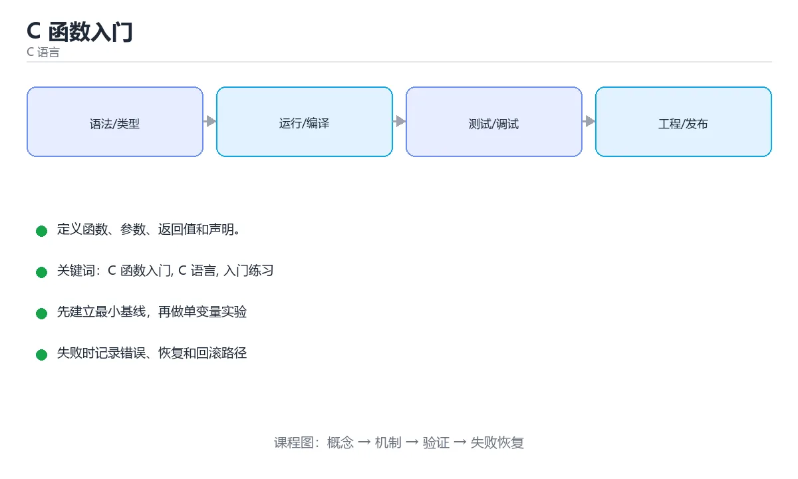

# C 函数入门



> 内容更新时间：2026-10-03 · 学习阶段：入门 · 预计用时：15 分钟

## 学习目标

- 先认识「C 函数入门」需要的工具、输入和输出。
- 按步骤运行最小示例，并记录结果与错误。
- 用一个边界输入验证自己是否真正掌握。

## 前置知识

- 会进行基本的文件或命令行操作。
- 不需要预先掌握「C 语言」的高级知识。

## 一句话入门

定义函数、参数、返回值和声明。

## 最小示例

```c
#include <stdio.h>

int square(int n) { return n * n; }

int main(void) {
    printf("square(7)=%d\n", square(7));
    return 0;
}
```

## 预期输出

```text
square(7)=49
```

## 常见错误

- 数组越界或忘记字符串终止符，造成未定义行为。
- 复制命令时遗漏空格、引号或必要参数。

## 动手练习

1. 原样运行最小示例，保存命令和输出。
2. 把数字 2 改成 10，预测并验证新结果。
3. 制造一个错误输入，写出错误信息和修复方法。

## 本课小结

- 入门阶段先保证能运行、能观察、能解释，再追求复杂功能。
- 每次只改一个变量，记录预测与实际结果。
- 遇到错误先看第一条错误信息，再回到最小示例。


## 代码实验：把示例跑成证据

这一节不引入新语法，而是把「C 函数入门」的最小示例变成可以复现、可以对照的实验。每次只改变一个条件，先写预测，再运行，最后解释差异。

### 实验一：建立基线

```c
#include <stdio.h>

int square(int n) { return n * n; }

int main(void) {
    printf("square(7)=%d\n", square(7));
    return 0;
}
```

先原样运行上面的代码，记录命令、完整输出和退出状态。然后把输出与正文的预期输出逐字对照，不要用“看起来差不多”代替核对；空格、大小写、换行和错误流向都可能暴露环境差异。

### 实验二：只改一个输入

从代码中选一个会影响结果的字面量、参数或输入，把它替换成边界值：数值可尝试 0、1、最大值和最小值，字符串可尝试空串和超长文本，集合可尝试空集合、单元素和重复元素。先写出预测，再运行并记录实际结果。

### 实验三：制造一个可控错误

删掉一条语句末尾的分号，或者把格式化占位符与参数类型改成不匹配。记录编译器第一条诊断，再恢复代码确认基线仍然可运行。

| 实验 | 改动 | 预测 | 实际 | 结论 |
| --- | --- | --- | --- | --- |
| 基线 | 保持原样 |  |  |  |
| 边界 |  |  |  |  |
| 失败 |  |  |  |  |

### 实验四：用三句话复述

1. 输入是什么，哪些输入属于合法范围，哪些属于边界或非法范围？
2. 程序按什么顺序处理输入，在哪一步产生了状态变化或副作用？
3. 输出如何验证，失败时第一条可观察证据是什么？

## C 语言基础机制速览

### 编译、链接与程序结构

C 源码经过预处理、编译、汇编和链接生成可执行文件。`#include` 引入声明，函数定义提供实现，链接器负责解析外部符号。`main` 返回 0 表示成功，非 0 表示失败。理解头文件、声明与定义的区别，能区分“找不到函数声明”的编译错误和“找不到符号”的链接错误。

### 类型、变量与内存表示

C 是静态类型语言，基本类型的大小依赖平台，使用 `sizeof` 而不是硬编码字节数。整数有有符号和无符号之分，混合运算会发生转换；无符号回绕有定义，有符号溢出通常是未定义行为。浮点数遵循 IEEE 754 近似表示，比较时使用容差。字符类型、字符串和数组的关系需要清楚：字符串以 `\0` 结尾，`char` 数组不一定是字符串。

### 指针、数组与字符串

指针保存地址，`*` 解引用，`&` 取地址；指针算术按所指类型大小移动。数组名在大多数表达式中退化为首元素指针，但 `sizeof` 和取地址时不是。函数参数中的数组声明等价于指针，长度信息会丢失，必须额外传长度。字符串函数要保证目标缓冲区足够大，优先使用带长度限制的函数，防止溢出。

### 函数、结构体与内存管理

函数原型要在调用前可见，参数按值传递；要修改调用方变量就传指针。结构体可以按值复制，较大结构体通常传指针；`struct` 的内存可能有填充，`sizeof` 不一定等于成员大小之和。`malloc/free`、`calloc`、`realloc` 必须成对使用，释放后指针置空，不能访问已释放内存。栈内存自动回收但生命周期受作用域限制，返回局部数组地址是典型错误。

### 预处理器、未定义行为与调试

宏在预处理阶段替换文本，要加括号并避免多次求值副作用；`#include` 保护防止重复包含。未定义行为包括越界访问、解引用空指针、未初始化读取、有符号溢出和不匹配的格式化参数，编译器优化后可能产生难以预测的结果。使用编译器警告、静态分析、sanitizer 和调试器定位内存问题；测试要覆盖空输入、边界长度、内存分配失败和错误路径。

## 考点精讲：把测验题还原成判断过程

本课有 4 个判断点。先自己作答，再看「判断依据」；如果结论正确但理由不完整，回到正文对应章节补足概念。

### 考点 1：函数声明（原型）与函数定义的区别是？

- **正确判断**：声明只给出名称与类型，定义才提供函数体
- **判断依据**：原型告诉编译器函数如何被调用，包括返回类型和参数类型；定义提供实际执行的代码。调用点之前若没有声明，编译器可能按旧规则猜测类型并产生未定义行为，因此多文件工程通常把原型放进头文件统一引用。声明可以出现多次，定义在同一程序中只能有一次，重复定义会触发链接错误。
- **迁移检查**：遮住选项，只根据定义复述一次答案，再回来看哪个选项与复述一致。

### 考点 2：C 语言中参数默认的传递方式是？

- **正确判断**：按值传递，函数得到实参的副本
- **判断依据**：C 只有按值传递一种方式，数组名会退化为指针，看起来像引用，实际传递的仍是指针的副本，因此函数可以通过指针修改数组内容。若希望函数修改普通变量，需要显式传入 &x 并在形参中使用指针类型。理解「传的是值」这一点，能解释很多看似矛盾的修改失败现象。
- **迁移检查**：把题干里的一个条件换成边界值，原来的结论还成立吗？写出判断过程。

### 考点 3：函数返回类型写成 void 表示什么？

- **正确判断**：函数不返回任何值，调用处不能使用其结果
- **判断依据**：void 表示没有值，函数可以通过 return; 提前结束，但不能写成 return 某个表达式。若只是想忽略返回值，应使用具体返回类型并在调用处忽略；把 void 当成空字符串会导致类型错误。选择返回类型时，先想清楚调用方是否需要结果，再决定是否保留返回值。
- **迁移检查**：把题干里的一个条件换成边界值，原来的结论还成立吗？写出判断过程。

### 考点 4：示例里 square(7) 的返回值是多少？

- **正确判断**：49，函数把参数相乘后作为结果返回
- **判断依据**：square 的参数 n 收到 7 的副本，函数体返回 n * n，因此结果是 49，再由 printf 用 %d 输出。若把返回类型误写成 void，调用处就无法取值；若参数类型写成 double，返回与格式串也要相应调整。核对函数签名与调用处的类型，是排查这类问题的固定步骤。
- **迁移检查**：把题干里的一个条件换成边界值，原来的结论还成立吗？写出判断过程。

## 本课复习清单

离开本课前，逐项确认：

- [ ] 不看解析，能说出「函数声明（原型）与函数定义的区别是？」的判断依据。
- [ ] 不看解析，能说出「C 语言中参数默认的传递方式是？」的判断依据。
- [ ] 不看解析，能说出「函数返回类型写成 void 表示什么？」的判断依据。
- [ ] 不看解析，能说出「示例里 square(7) 的返回值是多少？」的判断依据。
- [ ] 至少运行一次本课示例，记录输入、输出和一个边界情况。
- [ ] 把本课最容易混淆的两个概念写成一句话对照。

| 复盘项 | 记录 |
| --- | --- |
| 已经能独立解释的考点 |  |
| 仍然说不清的概念 |  |
| 下一步验证动作 |  |

## 逐节复习与自检

下面按正文顺序回顾每一节，并给出一个自检问题；说不清的地方回到原章节补课。

### 最小示例

```c
#include <stdio.h>

int square(int n) { return n * n; }

int main(void) {
    printf("square(7)=%d\n", square(7));
    return 0;
}
```

自检：这一节与相邻主题的边界在哪里？

### 预期输出

```text
square(7)=49
```

自检：这一节与相邻主题的边界在哪里？

### 常见错误

数组越界或忘记字符串终止符，造成未定义行为。

自检：把这一节讲给没学过的人，最需要强调哪一点？

### 动手练习

把数字 2 改成 10，预测并验证新结果。制造一个错误输入，写出错误信息和修复方法。

自检：如果去掉这一节里的一个前提，结论会怎样变化？

### 语言专项实践：C 函数入门

围绕「C 函数入门、C 语言、入门练习」说明变量生命周期、资源释放、并发模型和错误传播。语言语法只是入口，真正决定行为的是运行时、标准库和平台约束。

自检：用自己的话复述这一节，并举一个反例。

## 术语速查

| 术语 | 本课语境 |
| --- | --- |
| `#include` | C 源码经过预处理、编译、汇编和链接生成可执行文件。`#include` 引入声明，函数定义提供实现，链接器负责解析外部符号。`main` 返回 0 表示成功，非 0 表示失败。理解头文件、声明与定义的区别，能区分“找不到函数声明”的编译错… |
| `main` | C 源码经过预处理、编译、汇编和链接生成可执行文件。`#include` 引入声明，函数定义提供实现，链接器负责解析外部符号。`main` 返回 0 表示成功，非 0 表示失败。理解头文件、声明与定义的区别，能区分“找不到函数声明”的编译错… |
| `sizeof` | C 是静态类型语言，基本类型的大小依赖平台，使用 `sizeof` 而不是硬编码字节数。整数有有符号和无符号之分，混合运算会发生转换；无符号回绕有定义，有符号溢出通常是未定义行为。浮点数遵循 IEEE 754 近似表示，比较时使用容差。字符… |
| `\0` | C 是静态类型语言，基本类型的大小依赖平台，使用 `sizeof` 而不是硬编码字节数。整数有有符号和无符号之分，混合运算会发生转换；无符号回绕有定义，有符号溢出通常是未定义行为。浮点数遵循 IEEE 754 近似表示，比较时使用容差。字符… |
| `char` | C 是静态类型语言，基本类型的大小依赖平台，使用 `sizeof` 而不是硬编码字节数。整数有有符号和无符号之分，混合运算会发生转换；无符号回绕有定义，有符号溢出通常是未定义行为。浮点数遵循 IEEE 754 近似表示，比较时使用容差。字符… |
| `解引用，` | 指针保存地址，`*` 解引用，`&` 取地址；指针算术按所指类型大小移动。数组名在大多数表达式中退化为首元素指针，但 `sizeof` 和取地址时不是。函数参数中的数组声明等价于指针，长度信息会丢失，必须额外传长度。字符串函数要保证目标缓冲… |
| `struct` | 函数原型要在调用前可见，参数按值传递；要修改调用方变量就传指针。结构体可以按值复制，较大结构体通常传指针；`struct` 的内存可能有填充，`sizeof` 不一定等于成员大小之和。`malloc/free`、`calloc`、`real… |
| `malloc/free` | 函数原型要在调用前可见，参数按值传递；要修改调用方变量就传指针。结构体可以按值复制，较大结构体通常传指针；`struct` 的内存可能有填充，`sizeof` 不一定等于成员大小之和。`malloc/free`、`calloc`、`real… |
| `calloc` | 函数原型要在调用前可见，参数按值传递；要修改调用方变量就传指针。结构体可以按值复制，较大结构体通常传指针；`struct` 的内存可能有填充，`sizeof` 不一定等于成员大小之和。`malloc/free`、`calloc`、`real… |
| `realloc` | 函数原型要在调用前可见，参数按值传递；要修改调用方变量就传指针。结构体可以按值复制，较大结构体通常传指针；`struct` 的内存可能有填充，`sizeof` 不一定等于成员大小之和。`malloc/free`、`calloc`、`real… |

## English Overview

**Title:** C Functions

**Summary:** Define functions, parameters and returns.

**Category:** C  
**Level:** 入门  
**Key terms:** C 函数入门, C 语言, 入门练习

> The full tutorial is written in Chinese. This bilingual overview helps English readers identify the topic, scope and key terms before studying the detailed examples.

## 内容元数据

- 内容版本：v2.0
- 最后更新：2026-10-03
- 学习阶段：入门
- 适用环境：C11 / GCC 或 Clang
- 内容来源：内置结构化课程与工程实践整理
- 相关主题：C 函数入门、C 语言、入门练习
- 质量版本：P0 测验标准 + P1 覆盖扩展 + P2 体验补全


## 语言专项实践：C 函数入门

### 一、工具链

| 阶段 | 推荐工具 | 验收标准 |
| --- | --- | --- |
| 编译 | gcc/clang -Wall -Wextra -Werror | 命令可复现且错误能被定位 |
| 调试 | gdb + core dump | 命令可复现且错误能被定位 |
| 内存检查 | AddressSanitizer / Valgrind | 命令可复现且错误能被定位 |
| 构建发布 | Makefile/CMake + 静态或动态链接 | 命令可复现且错误能被定位 |

### 二、运行时与内存模型

围绕「C 函数入门、C 语言、入门练习」说明变量生命周期、资源释放、并发模型和错误传播。语言语法只是入口，真正决定行为的是运行时、标准库和平台约束。

### 三、测试策略

- 单元测试覆盖核心规则和边界。
- 集成测试覆盖文件、网络、数据库或平台 API。
- 失败测试覆盖超时、取消、异常和资源耗尽。
- 性能测试记录基线，避免只凭感觉优化。

### 四、发布检查

- [ ] 版本和依赖锁定，构建可复现。
- [ ] 产物经过签名、校验和最小权限配置。
- [ ] 日志不泄露密钥和个人信息。
- [ ] 有升级、回滚和故障恢复说明。


## 参考资料与复核

- 最后复核：2026-10-04
- 下次复核：2027-04-04
- 复核范围：版本兼容、API 行为、安全建议与工程实践
- 来源性质：官方文档与标准；本课正文为离线教学重组，不复制原文

| 参考资料 | 本课用途 |
| --- | --- |
| [C 标准库参考](https://en.cppreference.com/w/c) | C 语言与标准库 |
| [GNU C Manual](https://www.gnu.org/software/libc/manual/) | POSIX 与系统接口 |

> 本课主题：定义函数、参数、返回值和声明。

> App 完全离线展示文字链接，不会自动联网；需要延伸阅读时可复制链接到浏览器。
